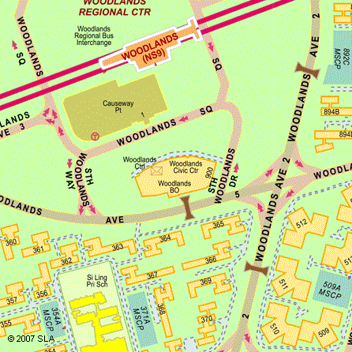
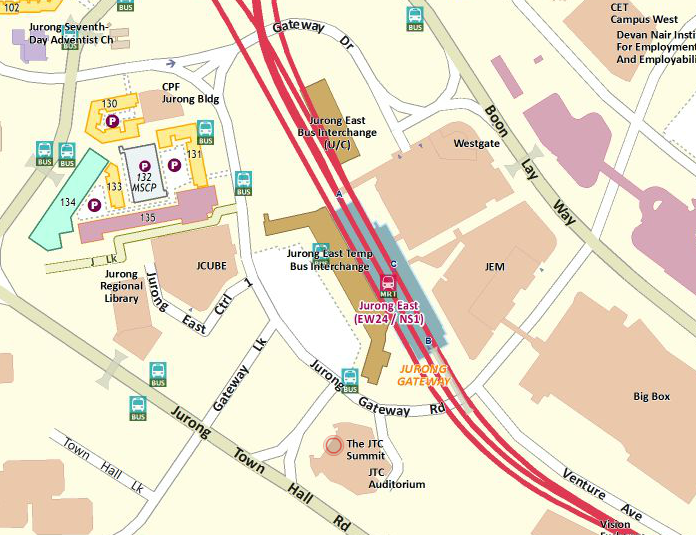

|image0|

Contents
========

`CLINIC MANAGEMENT 1 <#_Toc398040999>`__

`Clinic Checklist for Volunteer Lawyers 7 <#_Toc398041006>`__

`Making Referrals 8 <#making-referrals>`__

`CIVIL CLAIMS (General) 22 <#_Toc398041034>`__

`Jurisdiction of the courts 22 <#jurisdiction-of-the-courts>`__

`Conducting a Civil Case in Person
22 <#conducting-a-civil-case-in-person>`__

`Other FORUMS 29 <#other-forums>`__

`Situations where claims can arise
30 <#situations-where-claims-can-arise>`__

`Limitation of actions 31 <#_Toc398041039>`__

`Traffic Accidents 34 <#traffic-accidents>`__

`The Employment Act 44 <#_Toc398041041>`__

`Workmen’s Compensation 53 <#_Toc398041042>`__

`Workplace Safety and Health Act
54 <#workplace-safety-and-health-act>`__

`Credit Card and Bank Debts; Insurance Disputes 55 <#_Toc398041044>`__

`Defamation 62 <#defamation>`__

`Wheel clamping 67 <#wheel-clamping>`__

`FAMILY LAW 68 <#_Toc398041047>`__

`Family Court 68 <#family-court>`__

`Divorce 68 <#divorce>`__

`Nullity 80 <#nullity>`__

`Ancillary Matters Upon Divorce 84 <#ancillary-matters-upon-divorce>`__

`Maintenance 93 <#maintenance>`__

`Division of Matrimonial Property
103 <#division-of-matrimonial-property>`__

`HDB-related issues upon Divorce
112 <#hdb-related-issues-upon-divorce>`__

`CPF-related issues upon Divorce
115 <#cpf-related-issues-upon-divorce>`__

`BANKRUPTCY AND INSOLVENCY 122 <#bankruptcy-and-insolvency>`__

`Effects of Bankruptcy 131 <#effects-of-bankruptcy>`__

`Commonly Asked Questions on Bankruptcy 138 <#_Toc398041084>`__

`CRIMINAL LAW AND PROCEDURE 161 <#criminal-law-and-procedure>`__

`Arrest, Custody & Police Bail 162 <#arrest-custody-police-bail>`__

`Being Charged In Court 172 <#_Toc398041105>`__

`Court Bail 178 <#_Toc398041110>`__

`The Criminal Legal Aid Scheme 182 <#the-criminal-legal-aid-scheme>`__

`Magistrate’s Complaints 183 <#_Toc398041112>`__

`Spent Criminal Records 186 <#_Toc398041114>`__

`Juvenile Crimes/Offences 191 <#_Toc398041116>`__

`PROPERTY 192 <#property>`__

`Purchasing or Selling a House or Flat
192 <#purchasing-or-selling-a-house-or-flat>`__

`Documents for Buying a House or Flat
201 <#documents-for-buying-or-selling-a-house-or-flat>`__

`Selling Your House or Flat 203 <#selling-your-house-or-flat>`__

`Your Lawyer’s Role in a Property Sale
204 <#your-lawyers-role-in-a-property-sale>`__

`Commonly Asked Questions on Purchasing or Selling a House or Flat
205 <#commonly-asked-questions-on-purchasing-or-selling-a-house-or-flat>`__

`Letting / Renting a Property 210 <#letting-renting-a-property>`__

`Subletting of an Entire HDB Flat 211 <#_Toc398041137>`__

`Subletting of Bedrooms in a HDB Flat
216 <#subletting-of-bedrooms-in-a-hdb-flat>`__

`Commonly Asked Questions on Letting and Subletting
220 <#commonly-asked-questions-on-letting-and-subletting>`__

`Recourse for Landlords, Enforcement Proceedings
227 <#recourse-for-landlords-enforcement-proceedings>`__

`Commonly Asked Questions on Enforcement Proceedings
230 <#commonly-asked-questions-on-enforcement-proceedings>`__

`HDB Flats & Related Issues 232 <#hdb-flats-related-issues>`__

`Commonly Asked Questions on Retention & Transfer of Onwership of HDB
Flat
236 <#commonly-asked-questions-on-retention-transfer-of-onwership-of-hdb-flat>`__

`Purchasing & Investing in Private Properties
238 <#purchasing-investing-in-private-properties>`__

`Bankruptcy and Sale of Property
240 <#bankruptcy-and-sale-of-property>`__

`Maintenance, Repairs, Leakages & Disputes in Strata Management Title
242 <#maintenance-repairs-leakages-disputes-in-strata-management-title>`__

`Commonly Asked Questions on Maintenance & Leakages
243 <#commonly-asked-questions-on-maintenance-leakages>`__

`Referral of Disputes to the Strata Titles Boards
245 <#referral-of-disputes-to-the-strata-titles-boards>`__

`En-Bloc Sale 247 <#en-bloc-sale>`__

`Divorce & Separation: Property Considerations
254 <#divorce-separation-property-considerations>`__

`INTELLECTUAL PROPERTY 259 <#_Toc398041173>`__

`Definitions of the various forms of intellectual property
259 <#definitions-of-the-various-forms-of-intellectual-property>`__

`Copyright 261 <#copyright>`__

`Criminal Offences under Copyright Law
270 <#criminal-offences-under-copyright-law>`__

`Civil Remedies under Copyright Law
273 <#civil-remedies-under-copyright-law>`__

`Right Management Information (RMI)
274 <#right-management-information-rmi>`__

`Copyright and the Internet 275 <#copyright-and-the-internet>`__

`Commonly Asked Questions on Copyright
277 <#commonly-asked-questions-on-copyright>`__

`Trade Marks 291 <#trade-marks>`__

`Applying to Register a Trade Mark in Singapore
293 <#applying-to-register-a-trade-mark-in-singapore>`__

`Infringement of Registered Trademark 295 <#section-39>`__

`Revocation and Invalidation of Trade Marks
297 <#revocation-and-invalidation-of-trade-marks>`__

`Passing Off 299 <#passing-off>`__

`Registered Designs 301 <#registered-designs>`__

`Trade Secrets and Confidential Information
304 <#trade-secrets-and-confidential-information>`__

`Maintaining Confidentiality 307 <#maintaining-confidentiality>`__

`Patents 310 <#patents>`__

`Layout-designs of Integrated Circuits
314 <#layout-designs-of-integrated-circuits>`__

`Geographical Indications 316 <#geographical-indications>`__

`Plant Variety 318 <#plant-variety>`__

`WILLS <#wills-intestacy-probate-administration>`__, `INTESTACY, PROBATE
& ADMINISTRATION 322 <#_Toc398041221>`__

`Administration of Small Estates by The Public Trustee
329 <#_Toc398041227>`__

`About the Wills Registry 335 <#about-the-wills-registry>`__

`Probate and Letters of Administration
338 <#probate-and-letters-of-administration>`__

`DATA PROTECTION LAW 349 <#data-protection-law>`__

`Personal Data Protection Act 2012 (‘PDPA’)
349 <#personal-data-protection-act-2012-pdpa>`__

`ADVANCE MEDICAL DIRECTIVES 355 <#_Toc398041283>`__

`JUVENILE ISSUES 357 <#juvenile-issues>`__

`Definitions & Age Ranges 357 <#definitions-age-ranges>`__

`Beyond Parental Control 358 <#beyond-parental-control>`__

`Juvenile Arrest Cases 362 <#youth-arrest-cases>`__

`Commonly Asked Questions on Pre-Sentence Report
363 <#commonly-asked-questions-on-pre-sentence-report>`__

`Court Orders 364 <#court-orders>`__

`Family Conferencing 370 <#family-conferencing>`__

`Commonly Asked Questions on Court Orders & Family Conferencing
372 <#commonly-asked-questions-on-court-orders-family-conferencing>`__

`Restorative Programmes 374 <#restorative-programmes>`__

`Care & Protection 376 <#care-protection>`__

`MILITARY LAW 379 <#military-law>`__

`Overview of the Military Justice System
379 <#overview-of-the-military-justice-system>`__

`Charge Procedures 384 <#_Toc398041322>`__

`Common Military Offences 389 <#common-military-offences>`__

`ALTERNATIVE DISPUTE RESOLUTION 394 <#alternative-dispute-resolution>`__

`Arbitration 394 <#_Toc398041332>`__

`Mediation 395 <#_Toc398041333>`__

`Adjudication 395 <#_Toc398041334>`__

`Alternative Dispute Resolution in Singapore 397 <#_Toc398041336>`__

`THE TRAFFIC COURT 403 <#the-traffic-court>`__

`Traffic offences without any offer of composition
403 <#traffic-offences-without-any-offer-of-composition>`__

`Minor traffic offences with an offer of composition
403 <#minor-traffic-offences-with-an-offer-of-composition>`__

**
Acknowledgements**

Compiled by

The Law Society of Singapore

Pro Bono Services Office

50 Market Street

#10-04 Golden Shoe Car Park

Singapore 048490

Email: ProBonoServices@lawsoc.org.sg

Website: `www.lawsociety.org.sg <http://www.lawsociety.org.sg>`__

*Version 4.04 – Compiled on April 2015*

We would like to acknowledge the following sources from which
information in this 4\ :sup:`rd` revision of the manual was drawn:

-  Central Provident Fund Board

-  Centre For Enabled Living (CEL)

-  Consumers’ Association of Singapore (CASE)

-  Credit Bureau (Singapore) Pte Ltd

-  Credit Counselling Singapore

-  Financial Insurance Disputes Resolution Centre Ltd (FIDReC)

-  Health Science Authority

-  Housing Development Board

-  Insolvency & Public Trustee’s Office (IPTO)

-  Intellectual Property Office of Singapore (IPOS)

-  Islamic Religious Council of Singapore (MUIS)

-  Legal Aid Bureau (LAB)

-  Ministry of Community Development, Youth and Sports

-  Ministry of Manpower (MOM)

-  Ministry of Trade and Industry

-  Motor Industries Dispute Resolution Centre (MIDReC)

-  National Council on Problem Gambling (NCPG)

-  Promotion of Alternatives to Violence (PAVe)

-  Singapore Accredited Estate Agencies (SAEA)

-  Singapore Institute of Surveyors and Valuers (SISV)

-  Singapore Dental Council (SDC)

-  Singaore Dental Association (SDA)

-  Singapore Mediation Centre (SMC)

-  Singapore Medical Association (SMA)

-  Singapore Medical Council

-  Singapore Police Force

-  Special Needs Trust Company (SNTC)

-  Strata Titles Boards

-  Syariah Court Singapore

-  The Law Society of Singapore

-  The Motor Insurers’ Bureau (MIB); from General Insurance Association
   website

-  The State Courts of Singapore

-  Supreme Court Singapore

We would also like to thank all our volunteers, including students from
National University of Singapore Pro Bono Group and Singapore Management
University Pro Bono Club, for their support and contribution towards the
Community Legal Clinics.

CLINIC MANAGEMENT
=================

Conduct
~~~~~~~

All data relating to the legal clinic is confidential and is **not** to
be revealed to anyone not directly related to the service. The lawyers
will be governed by the relevant sections of the Legal Profession Act
and relevant ethical rules during their interactions with clients. In
the event that the applicant has sought the advice of another lawyer,
you may deal with the case as you see fit.

Confidentiality
~~~~~~~~~~~~~~~

In addition to the rules mentioned above, the CDC shall not release the
names or contact details of any of the lawyers volunteering at the legal
clinic.

You are not to give your name, the name of your firm or any details by
which the client may be able to identify or locate you.

Support
~~~~~~~

A copy of the Community Legal Clinic Manual will be provided to each
lawyer prior to the clinic.

Before beginning to volunteer at the clinic, it is suggested that
lawyers sit in on at least one session with an experienced volunteer
lawyer (mentor). It is proposed that there be at least one mentor
present at each session.

New volunteers are encouraged to consult the designated mentor in the
event of doubt. They are also encouraged to attend such training
sessions to be conducted by the Law Society under the auspices of the
Pro Bono Services Office as necessary.

A copy of the Women’s Charter, Penal Code and other Statutes related to
family and criminal Law, information on Legal Aid Bureau, Family Court,
Criminal Legal Aid Scheme and The Law Society of Singapore Directory are
available for reference at the Community Legal Clinic. You may consult
the other volunteer lawyers for their opinion.

In case you feel the clinic attendee is eligible for legal aid – civil
or criminal, or needs referral to particular services such as
counselling or financial aid, please let the PBS Officer know. They will
carry out the appropriate follow-up after the legal consultation.

In some cases, clinic attendees may be emotionally charged over the
matter. If at any point you feel that the clinic attendee needs
emotional support, please request assistance from the PBS Officer.

Forms

Before each clinic session, you will be furnished a summary of each
clinic attendee’s problem/area of enquiry (see page 3-2 for a sample).

For each attendee, you will need to complete a green form (FORM A, see
page 3-5 for a sample) which is essentially the attendance note for you
to record the advice given to the client.

The Clinic Case List contains information about the clinic applicants
registered for each session and a short narrative of the problem and
issues on which advice is sought.

Form A and the Clinic Case List are NOT to be handed to the client.

Fill in FORM A after the consultation, giving a short synopsis of the
advice offered. If you have suggested a second consultation, make a note
on FORM A and inform the PBS Officer of this. As a rule, we do not
register applicants for a second consultation over the same issue unless
there are special circumstances requiring further legal advice.

Applicants
~~~~~~~~~~

As a rule, each applicant is given a maximum of 20 minutes. The duty PBS
Officer will advise if there is adequate time. If there are fewer
applicants, the length of consultation may be lengthened at your own
discretion.

All applicants who have registered for the Community Legal Clinic will
be seen on the night itself. As far as possible, we avoid turning
applicants away. Applicants (and anyone accompanying them) will be
required to provide their identification for verification purposes, as
well as sign a Disclaimer of Liability before being allowed to consult
with the lawyer.

\ *Clinic times and venues*
~~~~~~~~~~~~~~~~~~~~~~~~~~~

Registration and arrangements for appointments at the four Community
Legal Clinics are handled by the Pro Bono Services Office. The clinics
are hosted by the NW, SW, SE and Central CDCs. Volunteer’s lawyers will
have the use of interview rooms at the CDC office. A Pro Bono Service
Officer will be at the reception counter of the CDC office to usher the
clients into the interview rooms where the advice is given. The times
and venues for the clinics are as follows:

Mon (7 -9.30 pm)

North West Community Development Council

#06-13 Woodlands Civic Centre

900 South Woodlands Drive

Singapore 730900

(5 minutes walk from Woodlands MRT station)

|image1|

*Reproduced with permission of SLA.*

Tues (7 – 9.30 pm)

South East Community Development Council

#02-01 Singapore Post Centre

10 Eunos Road 8

Singapore 408600

(5 minutes walk from Paya Lebar MRT station)

|image2|

*Reproduced with permission of SLA.*

Wed (7 – 9.30 pm)

South West Community Development Council

#03-11 The JTC Summit

8 Jurong Town Hall Road

Singapore 609434

(10 minutes walk from Jurong East MRT station)

|image3|

*Reproduced with permission of SLA.*

Thurs (7 – 9.30 pm)

Central Community Development Council

#07-11 HDB Hub via Bizthree Lift Lobby 1

490 Lorong 6 Toa Payoh

Singapore 310490

(5 minutes walk from Toa Payoh MRT station)

|image4|

\ *Reproduced with permission of SLA.*

Clinic Checklist for Volunteer Lawyers
--------------------------------------

The following checklist will assist the volunteer lawyer when dealing
with the attendee during the clinic session.

**Explain to the clinic attendee the Disclaimer of Liability**. You
could say\ **:**

**
**\ *The purpose of the Community Legal Clinic is to provide free advice
to all those in need. The advice given at these sessions shall be as a
matter of guidance and comfort only and is not intended to replace,
substitute or supplement legal advice and legal action that may be
needed. The information provided by attendees to the volunteer lawyers
shall be kept confidential. Please note that the volunteer lawyers are
under a legal prohibition from acting any further for attendees. For the
free advice given, The Law Society of Singapore and its volunteer
lawyers and/or their practices shall not be liable in any way whatsoever
for any such advice or information.*

**You are discouraged from revealing your name, the name of your firm,
or any details by which the applicant can identify or locate you, to the
clinic attendee.** This reduces the likelihood of the attendee tracing
you for further advice or representation.

**Adhere to the time limit of 20 minutes allocated**. This is to ensure
that everyone gets the same amount of time with you.

**Be polite and courteous at all times to members of the public.** If
you have any problems or experience difficulties with any member of the
public, please approach the duty Pro Bono Service Officer for
assistance.

**Do not attend to a member of public who has a solicitor on record.**
It is likely that you will not be told of all the facts within 20
minutes and any advice given by you may be in conflict with the advice
already given by the solicitor on record. If you **do** find out that
the person is represented by a lawyer, immediately inform the person
that you cannot give advice and terminate the session.

**Do not give specific advice on “legal costs”, especially on
professional charges for a specific matter.** You may, however, explain
the basis for charging and taxation of bill costs.

**Keep an accurate record of the nature of the advice sought and the
advice rendered by you in the attendance note provided.** Although there
is a disclaimer the member of public would have signed, an accurate
record will help us deal with complaint(s) later should any arise.

Making Referrals
----------------

The Pro Bono Officer will inform you of the appropriate referrals for
the clinic attendees. You may then indicate the relevant information on
Form B (blue form) and/or C (purple form) and hand this to the clinic
attendee at the end of the session. Below is a list of agencies
providing follow-up services. The services they provide are described in
this section.

In the course of counselling, you may decide that additional referral
action is required. Record the type of help required on Form A (the
green form) and inform the PBS Officer who will then arrange for the
client to contact the appropriate agency for further assistance.

• The Advertising Standards Authority of Singapore (ASAS)

• Consumers Association of Singapore (CASE)

• Credit Counselling Singapore (CCS)

• Centre for Enable Living (CEL)

• Criminal Legal Aid Scheme (CLAS)

• The Consumer Protection (Fair Trading) Act (CPFTA)

• Financial Industry Disputes Resolution Centre Ltd (FIDReC)

• Friends of Litigants-In-Person (FLIP)

• Health Science Authority (HSA)

• Insolvency & Public Trustees Office (IPTO)

    | • Legal Aid Bureau (LAB)
    | • Ministry of Manpower (MOM)

• Motor Industries Dispute Resolution Centre (MIDReC)

• National Council On Problem Gambling (NCPG)

    • National Council of Social Service (NCSS) – with 54 social service
    agencies including Family Service Centres (FSCs)

• Primary Justice Project (PJP)

• Singapore Institute of Surveyors & Valuers

• Singapore Dental Association (SDA)

• Singapore Dental Council (SDC)

• Singapore Institute of Surveyors & Valuers (SISV)

• Singapore Mediation Centre (SMC)

• Singapore Medical Association (SMA)

• Singapore Medical Council (SMC)

• Special Needs Trust Company (SNTC)

• Strata Titles Boards

• Tribunal for the Maintenance of Parents

*
*\ \ *The Advertising Standards Authority of Singapore (ASAS)*\  [1]_

Address: 170 Ghim Moh Road #05-01

Ulu Pandan Community Building

Singapore 279621

General Line: 6461 1888

Fax : 6467 9055

Email : asas@case.org.sg

Operating Hours: Mondays–Fridays, 9am–6pm

(Nearest MRT Station: Holland Village)

The Advertising Standards Authority of Singapore (ASAS) is an Advisory
Council to the Consumers Association of Singapore (CASE). It was set up
in 1973 to promote ethical advertising in Singapore and is the
self-regulatory body of the advertising industry.

**What can ASAS do?**

-  Provides advice and guidance when advertisers, advertising agencies
   and media owners are in doubt over the acceptability of
   advertisements – particularly before publication. However, it is not
   intended for ASAS to be a clearing-house for the approval of all
   advertising.

-  Handles complaints about advertising practices. ASAS is able to rule
   on disputes between members of the Singapore Advertisers Association,
   the Association of Accredited Advertising Agents, Advertising Media
   Owners’ Association of Singapore and the Association of Broadcasters.

-  Advises on any advertisement prepared and/or published by persons or
   companies outside the four Associations, provided that it is brought
   to the attention of ASAS in accordance with the procedure of lodging
   a complaint.

-  Issues sanctions: In withholding of advertising space or time from
   advertisers, and withdrawal of the trading privileges from
   advertising agencies. Both these sanctions are applied by the media
   owners.

-  On adverse publicity. This is wielded by ASAS, which may publish
   details of the outcome of investigations it undertakes naming those
   who have offended against the Code. Decides and interprets the Code.
   Decision shall be final.

*Consumers Assocation of Singapore (CASE)*
------------------------------------------

170 Ghim Moh Road #05-01

Ulu Pandan Community Building

Singapore 279621

Hotline: 6 1000 315

Fax : 6467 9055

(Nearest MRT Station: Buona Vista) (Bus numbers: 92, 100, 111, 198)

**
**

**Complaints CASE handles:**

Consumer-to-business disputes

| Please ensure the main complainant is the person lodging the claim,
  (the main complainant
| denotes the person who made the purchase). You are a consumer if you
  make a transaction for a product or service for personal use.

**What to do if you have a consumer complaint?**

If you have a dispute with a retailer over consumer goods and services
and the matter with the retailer remains unresolved, you can approach
CASE for advice and assistance through the following means:

**Phone assistance**

| You may call our hotline 6100-0315 to seek general queries from our
  Consumer Relations Officers. 
| Hotline hours: Mon-Fri 9am to 5pm, Sat 9am to 12pm

**Counter service**

For a consultation, please see any of our officers directly at our
office. Our operating hours are from Monday to Saturday, 9am to 4pm. We
are located at:

|  
| 170 Ghim Moh Road

#05-01 Ulu Pandan Community Building

Singapore 279621

**Complaints CASE does not handle:**

-  Business-to-business disputes - This includes any transactions
   between businesses and products or services purchased for business
   use. Should there be a dispute, you may consider checking with the
   Small Claims Tribunals (SCT) if you are eligible to make a claim
   via \ `SCT <http://app.subcourts.gov.sg/sct/index.aspx>`__.

-  Landlord and tenant claims - For disputes pertaining to deposits or
   rental issues, you should lodge your case with the Small Claims
   Tribunals \ `SCT <http://app.subcourts.gov.sg/sct/index.aspx>`__.

-  Speculation in shares, stocks, commodities, investments - If you are
   an investor and have dealings in shares, stocks etc. Accident claims
   - If you have a dispute with another driver in an accident.

-  Overseas companies - If you have bought a product overseas (except
   for Mainland China, India, Macao SAR and Malaysia).

*Credit Counselling Singapore (CCS)*\  [2]_
-------------------------------------------

210 Middle Road #05-04

Singapore Pools Building

Singapore 1

General Line: 6338 2663

Fax : 6338 6586

Email : enquiry@ccs.org.sg

Operating Hours: Mondays–Fridays, 9am–6pm

Hotline: 1800 CALL CCS (1800 2255 227)

(Nearest MRT Station: Bugis)

**About CCS**

CCS specialises in assisting people with an unsecured, legal, consumer
debt problem. However, CCS is unable to take up a person’s case and talk
to his creditors, e.g. a bank, without first having a detailed
understanding of his financial situation.  And CCS obtains a person’s
details from the credit counselling session that takes place after the
person has attended CCS free info talk on debt management and also
submitted his counselling request.

It offers services in the following areas:

-  Info Talk on Debt Management

-  Credit Counselling

-  Debt Management Programme (DMP)

-  Education on Financial Topics

*Centre For Enabled Living (CEL)*\  [3]_

SG Enable

141 Redhill Road

Singapore 158828

Tel: 6593 6437

Hotline: 1800-8585-885

Fax: 6270 7024

Website: `*https://www.sgenable.sg* <https://www.sgenable.sg/>`__

(Nearest MRT Station: Redhill)

SG Enable is an agency dedicated to enabling persons with disabilities.

Key functions of SG Enable include:

-  Enhancing information and referral services for child and adult
   disability schemes;

-  Administering grants and support to persons with disabilities and
   their caregivers;

-  Improving transition management across different life stages;

-  Enhancing employability and employment options for persons with
   disabilities; and

-  Rallying stakeholder support in enabling persons with disabilities

SG Enable provides programmes for children, youths and adults. It also
provides support for caregivers and for work training and employment.
Schemes for financial assistance and other assistance may also be
available

*Criminal Legal Aid Scheme (CLAS)*
----------------------------------

State Courts

Level 5 (between Court No. 5 & 12)

1 Havelock Square

| Singapore 059724
| Tel: 6534 1564

Fax: 6534 5237

Email: CLAS@lawsoc.org.sg

Operating Hours: 9 am to 5.45 pm

Mondays to Fridays; closed on Saturdays, Sundays and Public Holidays

(Nearest MRT Station: Clarke Quay)

CLAS provides free criminal legal assistance to the poor and needy in
non-capital charges. Only persons with a disposable income of not more
than S$10,000 per year and a disposable capital of not more than
S$10,000 may be granted legal aid.

**The laws that CLAS covers include: **

-  Arms & Explosives Act (Cap. 13)

-  Arms Offences Act (Cap. 14)

-  Computer Misuse Act (Cap. 50A)

-  Corrosive & Explosive Substances & Offensive Weapons Act (Cap. 65)

-  Dangerous Fireworks Act (Cap. 72)

-  Enlistment Act (Cap. 93)

-  Explosive Substances Act (Cap. 100)

-  Films Act (Cap. 107)

-  Miscellaneous Offences (Public Order and Nuisance) Act (Cap. 184)

-  Misuse of Drugs Act (Cap. 185)

-  Penal Code (Cap. 224)

-  Prevention of Corruption Act (Cap. 241)

-  Undesirable Publications Act (Cap. 338)

-  Vandalism Act (Cap. 341)

-  Women’s Charter (Cap. 353) [Sections 65(8) and 140(1)(i)] [S. 65(8) –
   breach of personal protection order] [S. 140(1)(i) – sexual
   intercourse with any girl below the age of 16 years except by way of
   marriage]

*Centre for Forensic Medicine (CFM) *
-------------------------------------

Health Sciences Authority

Level 1, Blk 9, SGH, Outram Rd

Singapore 169608

(Nearest MRT Station: Outram Park)The Applied Sciences Group applies
forensic, medical, scientific, investigative and analytical expertise to
serve the administration of justice and to safeguard public health. The
Group consists of the Centre for Analytical Science (CAS), Centre for
Forensic Medicine (CFM) and Centre for Forensic Science (CFS).

\ *The Consumer Protection (Fair Trading) Act (CPFTA)*
------------------------------------------------------

Under the CPFTA, CASE and Singapore Tourism Board are empowered to
invite errant businesses to enter into a Voluntary Compliance Agreement,
failing which, to take an injunction to stop the business from engaging
in further unfair practices.

The consumer should first seek to resolve the dispute with the trader.
Businesses should consider having in place a dispute resolution or
alternative mediation process so that there is a platform for settling
disputes with consumers. Currently, mediation services are available
through Community Mediation Centres, Singapore Mediation Centre, CASE
and various industry-specific mediation facilities. If the dispute
cannot be settled, the consumer may file a claim in court for civil
remedies. Most claims for unfair practices under the Act should be filed
in the Small Claims Tribunal. The consumer may also have rights of
action under contract or tort law. The consumer should seek legal advice
in case of uncertainty.

When considering a claim for unfair practices under the Act, prior
granting remedies the court will take into account whether the consumer
made a reasonable effort to minimise any loss or damage resulting from
the unfair practice, and tried to resolve the dispute through a
specified dispute resolution scheme. The Financial Industry Disputes
Resolution Centre Ltd (FIDReC) has been prescribed as the specified
dispute resolution scheme in respect of disputes relating to MAS-related
financial products or services supplied by a subscriber to FIDReC.

\ *Financial Industry Disputes Resolution Centre Ltd (FIDReC)*\  [4]_

112 Robinson Road #13-03

HB Robinson

Singapore 068902

Tel: (65) 63278878 / Fax: (65) 63278488

(Nearest MRT Station: Downtown)

Email: info@fidrec.com.sg

Opening hours:

Mondays, Wednesdays, Fridays: 9am – 6pm

Tuesdays, Thursdays: 9am – 7.30pm

**The Jurisdiction of FIDReC**

**
**\ The jurisdiction of FIDReC in adjudicating disputes between
consumers and financial institutions is as follows:

(1) Claims between the insured and insurance companies up to S$100,000

(2) Disputes between banks and consumers, capital market disputes and
    all other disputes (including third party claims and market conduct
    claims): up to S$50,000

At present, FIDReC’s services are available to all consumers who are
individuals or sole-proprietors.

\ *Friends of Litigants-In-Person (FLIP)*
-----------------------------------------

Community Justice Centre

Level 11 Havelock Square

State Courts Complex

Singapore 059724

Tel: 6557 4100    Website: www.cjc.org.sg

(Nearest MRT Station: Clarke Quay)

The FLIP programme aims to assist litigants-in-person with emotional and
practical support as they journey through the various steps of court
proceedings during the trial. The earlier they engage FLIP, the more
FLIP is able to help them.

\ *Health Science Authority (HSA)*

Health Sciences Authority

11 Outram Road

Singapore 169078

Bloodbank@HSA

Website: `www.hsa.gov.sg <http://www.hsa.gov.sg/>`__

(Nearest MRT Station: Outram Park)

\ *Insolvency & Public Trustees Office (IPTO)*\  [5]_
-----------------------------------------------------

The URA Centre, East Wing

45 Maxwell Road

#07-11, Singapore 069118

Tel: 1800 2255 529

Email: OneMinLaw@mlaw.gov.sg

Opening Hours:

Mondays to Fridays: 8:30 am to 5:00 pm

Saturdays: 8:00 am to 12:00pm

(Nearest MRT Station: Telok Ayer)

The Insolvency and Public Trustee's Office (IPTO) provides services in:

-  Bankruptcy & Debt Repayment Schemes

-  Corporate Insolvency

-  Public Trustee

-  Moneylenders

-  Pawnbrokers

\ *Legal Aid Bureau (LAB)*
--------------------------

45 Maxwell Rd #07-11

The URA Centre, East Wing

Singapore 069118

Registration Hours

Mondays to Fridays: 8:30am to 5:00pm

Saturdays: 8:30am to 12:00pm

Tel: (65) 1800 2255 529 (toll-free) / Fax: (65) 6325 1402

E-mail: OneMinLaw@mlaw.gov.sg

(Nearest MRT Station: Telok Ayer)

LAB provides Legal Advice, Legal Aid, Legal Assistance and
Counselling. It handles divorce, variation or enforcement orders,
custody of children, monetary claims, claims for compensation and estate
matters. It is not free and most people will be required to pay a
contribution towards the costs of work done. Legal Aid is available to
Singapore citizens, and PRs who are in Singapore, that satisfy the means
test.

\ *Ministry of Manpower (MOM)*
------------------------------

Ministry of Manpower Services Centre

1500 Bendemeer Road

Singapore 339946

Tel: 6438 5122 (General Enquiries) / Fax: 6534 4840

(Nearest MRT Station: Potong Pasir)

Ministry of Manpower Headquarters

18 Havelock Road

Singapore 059764

(Nearest MRT Station: Clarke Quay)

The general enquiries hotline operates on:

Monday - Friday: 8.30 am to 5.30 pm

Saturday: 8.30 am to 1 pm

If you are an employee covered by the Employment Act and wish to lodge a
claim against your employer, you can call MOM Contact Centre at 6438
5122 or visit Appointment@MOM to book a 30-min appointment session to
consult our Labour Relations Officer. Alternatively, you may submit your
claims online via Employment Standards Online (ESOL) for individual
users. This service is intended for employees who have left employment
and wish to recover salaries and other statutory payments such as
overtime pay, public holiday and annual leave pay from their former
employers. 

\ *Motor Industries Dispute Resolution Centre (MIDReC)*\  [6]_
--------------------------------------------------------------

61 Ubi Avenue 2

#06-04/05 Automobile Megamart

Singapore 408898

Opening hours: Mondays – Fridays 9:00am to 5:30pm / Saturdays 9:00am to
1:00pm

Tel: 67430269 / Fax: 67471010 / Email: info@midrec.com.sg

(Nearest MRT Station: MacPherson)

The Motor Industries Dispute Resolution Centre or MIDReC is an
independent and impartial institution specializing in the resolution of
disputes between motoring businesses and consumers. Consumers who have
an unresolved dispute with an accredited motoring business can lodge
their claim/disputewith the MIDReC.

\ *National Council On Problem Gambling (NCPG)*\  [7]_
------------------------------------------------------

510 Thomson Road

#05-01, SLF Building, Singapore 298135

Opening hours: Mondays – Fridays 8:30am to 6:00pm. Eve of public
holidays: 8.30am to 12.30pm

(Nearest MRT Station: Toa Payoh)

The NCPG is a council comprising 15 members with expertise in psychiatry
and psychology, social services, counselling, legal, rehabilitative as
well as religious services. The Council’s first two-year term began on
31 August 2005, and it is now in its fifth term.

\ *National Council of Social Service (NCSS)*
---------------------------------------------

Ulu Pandan Community Building

170 Ghim Moh Road, #01-02, Singapore 279621

DID: 6210 2500

Website: `www.ncss.org.sg <http://www.ncss.org.sg>`__

(Nearest MRT Station: Holland Village)

There is a referral protocol to recommend follow-up of clinic attendees
by social agencies registered with NCSS. After recording in Form A or C
the type of referral required, please inform the duty PBS Officer who
will be able to inform the relevant agencies for appropriate follow-up
action with the client.

Under this arrangement, referrals can be made to and from 42 social
service agencies which includes the 36 Family Service Centres.

More information on the financial, social and other assistance schemes
available can be found in “Assistance Schemes for Individuals & Families
in Social & Financial Need” compiled by NCSS.

*Singapore Dental Association (SDA)*
------------------------------------

2 College Road

Level 2 Alumni Association, Singapore 169850

Opening Hours: Monday - Friday 9:00am to 6:00pm

(Nearest MRT Station: Outram Oark)

Complaints other than those of professional misconduct (e.g. billing
disputes and other complaints against dentist or dental clinics) are
directed to the Complaints Handling Committee of the Singapore Dental
Association for mediation.

\ *Singapore Dental Council (SDC)*\  [8]_
-----------------------------------------

81 Kim Keat Road

#09-00 NKF Building, Singapore 328836

Opening Hours: Monday - Friday 9:00am to 6:00pm

Tel: 6355 2405

(Nearest MRT Station: Chinatown)

The Council looks into cases where there is professional misconduct,
performance impaired by ill health or a conviction. If you have concerns
that a dental provider has not acted in a professional manner, you can
seek help from the Council or the Singapore Dental Association (SDA).
The SDC will only convene a hearing by the Complaints Committee after it
has received an official complaint in writing and is supported by a
Statutory Declaration.

Types of issues include (1) serious profession misconduct, (2)
performance impaired by ill health and/or (3) conviction.

*Singapore Institute of Surveyors & Valuers (SISV)*
---------------------------------------------------

SISV Dispute Resolution Centre

110 Middle Road #09-03

Chiat Hong Building

Singapore 188968

Tel: 6222-3030 / Fax: 6225-2453

Email: sisv.info@sisv.org.sg / Website:
`http://www.sisv.org.sg <http://www.sisv.org.sg/>`__

(Nearest MRT Station: Bugis)

**Joint SISV-CMC Mediation Scheme**

The purpose of this Scheme is to allow disputes occurring in private
estates and neighbourhoods to be resolved in an amicable manner rather
than resorting to courts.

Accredited agencies or agents and those employing their services may
avail themselves of mediation and other dispute resolution services.
Under this scheme, trained mediators from the Community Mediation Centre
of Ministry of Law and the Singapore Institute of Surveyors and Valuers
Mediation Centre will conduct a co-mediation session to help parties
resolve their disputes.

Community mediators who are mainly grassroots leaders currently deal
with community and social conflicts in public housing estates. SISV
mediators handle technical conflicts relating to real estate and
construction disputes. This Scheme takes advantage of the respective
skills and expertise of these mediators to better resolve conflicts in
management corporations and private estates jointly. It will benefit
residents and occupants in these private developments and help to
promote good neighbourliness and community cohesion. This Scheme will
only deal with relational disputes such as quarrels, environmental
problems arising from noise or leakage, use of common facilities, and
disagreements with Council members and residents

\ *
Singapore Mediation Centre (SMC)*
---------------------------------

1 Supreme Court Lane

Level 4, Singapore 178879

Tel +65 6332 4366

(Nearest MRT Station: City Hall)

Mediation is a solutions-driven, problem-solving process. Instead of
pitting parties against each other, SMC facilitates an objective
discussion on how to advance difficult situations. The goal of mediation
is to find a practical solution and acceptable settlement.

Their process is carefully managed and facilitated by one of their
professional mediators. All SMC mediators have undergone mediation
training of the highest standards. They are respected, senior members of
the legal profession or are industry experts in their respective fields.
Their experience and training help parties identify issues, negotiate
constructively and explore different ways of settling.

Key to mediation is that parties make their own decisions, often with
the help of their lawyers. They are in complete control of the outcome
and do not run the risk of having an unfavourable decision imposed upon
them by a judge or arbitrator. 

\ *Primary Justice Project*
---------------------------

The PJP is a joint collaboration between the State Courts, the Law
Society, the Community Justice Centre and other justice stakeholders.
The PJP encourages the public to explore amicable settlement of disputes
as it provides an interim step between self-help and commencing action
in the courts.

Under this scheme, a party who has a dispute may approach any lawyer
listed on the Primary Justice panel, who provide basic legal advice and
facilitate a settlement of the dispute at a fixed fee.

**How PJP can help**

Parties may apply for PJP of their case falls under the following
categories:

(1) *Civil claims of less than $60,000* (e.g. claims for breach of
    contract, defamation) and which fall outside the Small Claims
    Tribunals' jurisdiction, including consumer claims, tenancy
    disputes, MCST disputes, defamation and employment disputes; and

(2) *Divorce matters where most ancillary matters are close to
    settlement* (e.g. maintenance; matrimonial property; matrimonial
    assets).

**How much does PJP cost**

+----------------------------+------------------------------------------------------------------------------------------------------------------------------------------------------------------------------------------------------------------------+
| **1st appointment**        | **2nd appointment**                                                                                                                                                                                                    |
+============================+========================================================================================================================================================================================================================+
| $300 legal fees            | $1,500 (calculated at $300 per hour, capped at 5 hours).                                                                                                                                                               |
|                            |                                                                                                                                                                                                                        |
| $100 administrative fees   | Includes disbursements, however, this does not include costs and disbursements payable to an ADR service provider (e.g. mediation provider) and does not include stamp fees and other fees payable to third parties.   |
+----------------------------+------------------------------------------------------------------------------------------------------------------------------------------------------------------------------------------------------------------------+

**How to apply**

Application forms are available at CJC HELP Services.

\ *Singapore Medical Association (SMA)*\  [9]_
----------------------------------------------

2 College Road, Level 2

Alumni Medical Centre, Singapore 169850

Telephone: +65 6223 1264

(Nearest MRT Station: Outram Park)

SMA is a national medical organisation representing the majority of
medical practitioners in both the public and private sector.

**Procedure For Submission of A Complaint **

1) Forward an original, signed letter, giving full details of the
       matter, to:

    The Chairman

    Complaints Committee

    Singapore Medical Association

    2 College Road

    Singapore 169850

1) In the letter, please furnish the patient's particulars: NRIC No./
       Address/ Telephone No.

2) The doctor's particulars: Name / Place of Practice (Clinic /
       Department & Hospital Name).

3) A letter of consent from the patient for the release of all relevant
       information pertaining to consultation and treatment with the
       doctor(s) or hospital mentioned in the letter. Please download
       the appropriate consent/authorisation form from the SMA’s
       website.

4) If you are not the patient, but are submitting the letter on behalf
       of the patient, kindly furnish your Name, NRIC No., and Contact
       Address.

SMA’s preliminary enquiry procedure entails obtaining comments from the
doctor(s) referred to in the case. Refer to Information on SMA
Complaints Committee in the next section.

The Committee meets once a month to consider cases for which the
preliminary enquiry is completed. While we endeavour to expedite the
processing of letters received, the whole process may take 2 to 6 months
before you will receive a final reply from us.

\ *Singapore Medical Council (SMC)*\  [10]_
-------------------------------------------

Singapore Medical Council

16 College Road #01-01

College of Medicine Building

Singapore 169854

Website: `www.smc.gov.sg <http://www.smc.gov.sg>`__

(Nearest MRT Station: Outram Park)

*Relating to Complaints/Disciplinary Proceedings*

General Enquiries: 6372 3141

Appointment for Statutory Declarations: 6372-3074

The Singapore Medical Council (SMC) is a statutory board under the
Ministry of Health. Section 5 of the Medical Registration Act (Cap 174)
states that the SMC is to:

-  Keep and maintain registers of registered medical practitioners

-  Approve or reject applications for medical registration under the MRA
   or to approve any such application subject to such restrictions as it
   may think fit

-  Issue practising certificates to registered medical practitioners

-  Make recommendations to the appropriate authorities on the courses of
   instructions and examinations leading to the Singapore degree

-  Make recommendations to the appropriate authorities for the training
   and education of registered medical practitioners

-  Determine and regulate the conduct and ethics of registered medical
   practitioners; and

-  Generally do all such acts and matters and things as are necessary to
   be carried out under the MRA

\ *Special Needs Trust Company (SNTC)*
--------------------------------------

298 Tiong Bahru Road

#03-07 Central Plaza, Singapore 168730

(Nearest MRT Station: Tiong Bahru)

Tel: 6278 9598 / Email: enquires@sntc.org.sg

Website: `www.sntc.org.sg <http://www.sntc.org.sg>`__

Operation hours: Mon – Fri, 9am – 6pm

**About SNTC**

SNTC, a charity and an Institution of Public Character, is the only
non-profit trust company in Singapore set up to provide affordable trust
services to people with special needs/disabilities.

The Insolvency and Public Trustee’s Office (“Public Trustee”) is
entrusted to invest and manage the trust funds. SNTC will administer the
funds according to a care plan, set out in a \*\*Letter of Intent
tailored to the needs of the Beneficiary under the trust.

SNTC is jointly supported by the Ministry of Social and Family
Development (MSF) and National Council of Social Service (NCSS).

\ *Strata Titles Boards*\  [11]_
--------------------------------

45 Maxwell Road #01-11

East Wing, The URA Centre,

Singapore 069118

(Nearest MRT Station: Telok Ayer)

Website: www.mnd.gov.sg/stb/index.html

Tel No: 63251589/63251581

Fax No: 6325 1607

Email: mnd\_strata\_titles\_boards\_enquiry@mnd.gov.sg

A Strata Titles Board is a body constituted under Part VI of the
Building Maintenance and Strata Management Act (BMSMA) to hear
applications:

(a) for orders for collective sales under Part VA of the Land Titles
(Strata) Act; and

    (b) relating to certain types of disputes or matters arising in
    respect of the strata units or the strata development including the
    common property.

\ *Tribunal For The Maintenance Of Parents*
-------------------------------------------

Address: Family Link@Lengkok Bahru

8 Lengkok Bahru #02-01

Singapore 159052

Tel: 1800-2585128 / Fax: 62585928

(Nearest MRT Station: Redhill)

Operation Hours:

Mon – Fri: 8.30 a.m. – 5 p.m. (Lunch: 1 – 2 p.m.)

Sat: 8.30 a.m. – 1 p.m.

Closed on Sunday & Public Holidays

**Role of the TMP**

Setup in 1996 under the Maintenance of Parents Act (Chapter 167B), the
TMP provides a legal channel for elderly parents to seek maintenance
from their children who are capable of supporting them, but are not
willing to do so.

The Tribunal, comprising a President and his members, hears applications
for maintenance or variation of maintenance orders. It adopts a
non-adversarial stance and refers the differences between the parties to
a conciliation officer for mediation before applications are heard. The
Ministry provides the services of a Commissioner and the secretariat to
support the Tribunal.

**Who May Apply**

Any person 60 years and above, domiciled and resident in Singapore
unable to maintain himself adequately can claim maintenance from their
children..

A person below 60 years may also apply if the Tribunal is satisfied that
he is suffering from infirmity of mind or body or for other special
reasons which prevent him or makes it difficult to maintain himself.

An approved person or organization in whose care a parent resides may
apply to the Tribunal for an order for maintenance from one or more of
his children. Any person/organization must apply to the Minister for
Community Development for approval to be an approved person /
organization before filing an application for maintenance.

The Commissioner for the Maintenance of Parents appointed under the
Maintenance of Parents Act may also make an application on a parent’s
behalf.

CIVIL CLAIMS (General)
======================

A civil case may be commenced by individuals or legal entities against
other individuals or legal entities in respect of the legal duties and
responsibilities that are owed to each other. If you have a civil case
(for example, a claim for breach of contract, or damage/injury caused by
wrongful acts), the maximum amount of your claim will determine which
court you should commence your claim in.

Jurisdiction of the courts
--------------------------

Civil cases involving claims *not exceeding $60,000* are generally dealt
with by the Magistrate Courts. Civil claims of *more than $60,000 but
not exceeding $250,000* are dealt with by the District Courts. Claims of
*above $250,000* are generally dealt with by the High Court unless the
parties consent to have the claim dealt with in the District Court.

In addition, civil cases (except for motor vehicle accidents or leases
over 2 years) involving certain categories, such as claims not exceeding
$10,000 (or up to $20,000 where both parties consent in writing) may be
brought to a Small Claims Tribunal.

Conducting a Civil Case in Person 
----------------------------------

**Basic Information **

A litigant in a civil action (except for Small Claim Tribunal
proceedings) can appoint a lawyer to represent him or conduct his own
case, i.e. act in person. However, a company can only commence or defend
a civil action through a lawyer.

In Small Claims Tribunal proceedings, lawyers are not permitted to
represent the parties. A company should send an employee as a
representative to attend the proceedings. We will discuss proceedings in
the Small Claim Tribunal in Part D below.

**General Considerations **

Litigants in person are held to the same standard of preparation and
conduct as lawyers. They have to comply with all relevant laws and
procedures in the conduct of the case. If a litigant cannot afford to
appoint a lawyer, he may approach the Legal Aid Bureau to determine if
he can qualify for assistance.

This section is intended for litigants representing themselves. It sets
out basic information and court procedures relating to the conduct of a
civil trial in person in the State Courts (i.e. the Magistrate Courts or
District Courts).

For the detailed legal framework, rules, regulations and powers of the
Court in the civil litigation process, litigants may wish to refer to
the following resources which can be found on the website of the State
Courts (*https://www.statecourts.gov.sg/Pages/default.aspx*).

**Service Bureaux**

In the course of a civil case, the parties will have to file, submit and
serve many documents to court and the other parties. Filing and serving
of court documents is usually done electronically by way of the
eLitigation system via the Service Bureaux at either of the following
venues:.

*Supreme Court *

1 Supreme Court Lane

Level 1,Supreme Court Building

Singapore 178879

Tel: 6337 9164

*Chinatown Point*

133 New Bridge Road

#19-01/02, Chinatown Point

Singapore 059413

Tel: 6538 9507

The operating hours for the electronic filing of court documents are:

+-------------------------------+-------------------------+
| *Operating hours*             | *For filing*            |
+-------------------------------+-------------------------+
| Mondays to Fridays            | 8.30 a.m to 5 p.m       |
| (excluding Public Holidays)   |                         |
+-------------------------------+-------------------------+
| Saturdays                     | 8.30 a.m to 12.30 p.m   |
| (excluding Public Holidays)   |                         |
+-------------------------------+-------------------------+
| Sundays and Public Holidays   | Closed                  |
+-------------------------------+-------------------------+

For further information please visit the following website:
www.elitigation.sg/getready/filingdocuments.html

**Commencing a Civil Action **

A civil action is begun by filing an originating process or document in
court. There are 2 types of originating process:

(1) Writ of Summons; or

(2) Originating Summons.

Where there is likely to be substantial factual disputes, a Writ of
Summons should be filed. The Writ of Summons may be filed together with
a Statement of Claim which states the material facts of the case, the
ingredients of the causes of action relied upon and the remedies sought
by the claimant. If the Statement of Claim is not filed together with
the Writ of Summons, it will have to be filed on a later date.

Where a limited application is going to be made to a judge, as provided
by any written law, an Originating Summons should be filed. Equally,
where the sole or principal question is likely to be the construction of
any written law, a deed, a will or contractual document, it is
appropriate to file an Originating Summons.

In this manual, we will focus on civil cases that are commenced by a
Writ of Summons as this is more common.

The party who commences the claim and files a Writ of Summons is known
as the Plaintiff. The other party against whom the claim is made is
known as the Defendant. There can be more than one Plaintiff or
Defendant in any claim.

The Plaintiff should serve the Writ of Summons on the Defendant after
the sealed copy of this document is returned from the Court.

**Defending a Civil Action **

A defendant who wishes to contest the Plaintiff's claim must inform both
the court and the Plaintiff of his intention to do so by entering an
appearance. He must file a Memorandum of Appearance in court *within 8
days* after he is served with the Writ of Summons.

Then, *within 22 days* from the date the Defendant was served with the
Statement of Claim, he must file his Defence in court and serve a copy
of his Defence on the Plaintiff or the Plaintiff's lawyers.

Refusing to acknowledge service of a Writ of Summons does not make the
service of the Writ of Summons invalid. It also does not prevent the
Plaintiff from proceeding further and obtaining a default judgment.

A failure by a Defendant to file the Memorandum of Appearance or to file
and serve his Defence is very serious and may result in default judgment
being entered against him.

If the Defendant has a Counterclaim to make, he may file a Defence &
Counterclaim to set out both his point of defence, as well as his
counterclaim.

The Plaintiff may file a Reply after the Defence has been filed. If the
Defendant had filed a Defence & Counterclaim, the Plaintiff may file a
Reply & Defence to Counterclaim.

The parties’ Statement of Claim, Defence and Reply are known as
“pleadings”.

**Main Stages of a Civil Action before the Trial **

There are several stages between filing the pleadings and the trial
commencing

During the pre-trial stage (known as “interlocutory stage”), both
parties have to comply with the requirements set out in the Rules of
Court, for example, those relating to giving sufficient details of one's
case, the gathering and exchange of documents that are relevant to the
case (known as discovery) and the preparation and exchange of witness
statements by way of Affidavits of Evidence-in-Chief.

In the course of preparing the case for trial during the pre-trial
stage, both parties may file interlocutory applications to the court in
order to assist their preparation of their case.

Examples of common interlocutory applications are:

-  Application for default judgment: where a Plaintiff applies for
   judgment without a trial on the ground that the defendant did not
   appear or file and serve his defence;

-  Application for the amendment of documents filed (eg the statement of
   claim, defence, reply) in relation to the matter in dispute;

-  Application for discovery of documents: through this process, the
   court may order a party to disclose certain relevant documents in his
   possession, custody or power to the other party;

-  Application for further and better particulars: through this process,
   the court may order a party to provide further details in his
   pleadings so that the other party can better understand what he needs
   to establish at trial;

-  Application for summary judgment: where the Plaintiff applies for
   judgment without trial on the ground that the defendant has no real
   defence to contest his claim.

-  Application for striking out: where the defendant applies for some
   parts or the whole of the Plaintiff’s Statement of Claim to be struck
   out on the basis that there is no reasonable cause of action against
   him, the action is frivolous or vexatious, or an abuse of the process
   of court.

Interlocutory applications may be commenced by filing a Summons,
together with an affidavit to support the application.

The Summons is a document that sets out the parties, the order which the
party wishes to obtain from the court and the grounds of application for
the order. The affidavit is a document that sets out the facts which a
party seeks to rely on in support of his application or to oppose an
application filed by the other party. An affidavit must be attested to
before a Commissioner for Oaths.

**Discovery**

Discovery is a very important process in court proceedings mandated
under Order 24 of the Rules of Court. It requires parties in civil
litigation proceedings to disclose to each other all relevant documents
in their possession, custody or power so that all relevant evidence is
available to the Court.

Parties will have to file a List of Documents in the prescribed format,
listing all relevant documents that are or were in their possession,
custody or power. The parties also have to file an affidavit verifying
the list of documents at the time of the filing. Both the List of
Documents and the affidavit verifying the List of Documents have to be
served on the other parties. After that, the other parties are entitled
to inspect and request a copy of the documents listed in their
opponent’s List of Documents.

Documents that are subject to privilege need not be disclosed.

A party’s obligation to disclose relevant documents is not restricted to
the time during the discovery process, each party being obliged to
continue to disclose all relevant documents from the start until the
conclusion of a civil action.

**Setting Down an Action for Trial **

This is a necessary step usually undertaken by the plaintiff before an
action goes to trial. Please refer to Order 34 of the Rules of Court for
the detailed requirements and procedure to set an action down for trial.

**Pre-Trial Conference **

Once a matter has been set down for trial, a pre-trial conference will
be conducted to ascertain the status of the action and fix the date(s)
of the trial. When attending the pre-trial conference, you should come
prepared to take trial dates and to inform the judge of the number of
witnesses you would like to call and the estimated number of days the
trial will take. As such you should check with your witnesses’ to ensure
they are available. The trial will generally be fixed within 28 days
from the date of the pre-trial conference. If you or any of your
witnesses cannot speak English, this should be made known to the judge
hearing the pre-trial conference.

**Preparing for Trial **

You must make sure that all your witnesses will attend the trial. If you
are not sure whether the witness is will attend, you should apply for a
subpoena to compel his/her attendance.

Prior Trial Documents should be submitted no less than 5 days prior
commencement of an action.

(a) *Affidavits of evidence-in-chief and Bundle of documents* - Each
party must submit to court the originals of the affidavit of
evidence-in-chief of all the witnesses and a bundle of the main
documents that will be relied on or referred to at the trial by any
party. As far as possible, a common bundle of core documents should be
agreed on between the parties and filed by the plaintiff.

(b) *Opening statement* - Opening statements are required in all cases
except where the trial judge has dispensed with the requirement and in
motor vehicle running down actions. The opening statement should set out
the party's case in a nutshell, both on the facts and law.

(b) *Bundle of authorities* - To improve the conduct of civil
proceedings and reduce the time taken in the presentation of cases in
court, parties are also required to prepare a bundle of legal
authorities which should accompany the opening statement. Legal
authorities include cases, statutes, subsidiary legislation and any
other reference materials that a party seeks to rely upon.

Besides submitting the above documents to Court, the documents should
also be served on the other party. The detailed contents and format for
the submission of the above documents can be found in paragraph 50 of
the State Courts Practice Directions.

**Documents to Bring on the Day of the Trial **

You must ensure that you have brought two sets of all the documents
submitted above to court: one for the witness and one for yourself. You
should also bring sufficient writing material and stationery to take
notes.

**On the Day of the Trial **

You should arrive early to find your way to the right court on time.
Upon arrival, you should inform the court officer of your presence and
confirm that your case is fixed in that particular court.

If you are late or absent, the case may proceed in your absence. Your
action may be dismissed or judgment entered against you

**Court Decorum **

You should be dressed appropriately in court. You should avoid shabby or
scanty dressing.

When the judge enters and leaves the courtroom, you should stand up and
bow as a show of respect for the Judiciary.

You should remain standing whenever you address the Court. You should
address the judge as "Your Honour", the lawyer for the other side as
"Learned Counsel" and the witnesses by their surname, for example, “Mr
Tan” or “Miss Kamala”.

You should not interrupt the judge or the lawyer for the other side when
they are speaking. If you wish to raise a point when it is not your turn
to speak, you should wait for the judge or lawyer for the other side to
finish speaking before you stand up to seek the permission to raise any
further points.

**Order of Proceedings during the Trial **

(a) *Opening Statements* - As the parties' opening statements would have
been submitted to the Court prior to the trial, the Court would usually
order that the opening statements be deemed seen and read. In such
circumstances, parties need not make oral opening submissions, but will
go straight into the examination of witnesses.

(b) *Examination of Witnesses* - In a civil trial, the plaintiff will
present his evidence first by calling his first witness. When the
witness is on the stand, the rest of the witnesses both for the
Plaintiff and Defendant must wait outside the courtroom.

When the Plaintiff's witness is on the stand, the Plaintiff will be
given the first opportunity to ask the witness questions. This is known
as the "examination-in-chief" of the witness. As the evidence sought to
be adduced by each witness would already be contained in the affidavit
of evidence-in- chief, the examination-in-chief of each witness is
generally short. After taking the oath, the witness will usually be
asked to confirm his name, identitification number, occupation and
residential address to establish his identity. After that, he will be
asked to confirm the truth of the contents of his/her Affidavit of
Evidence-in-Chief.

After the examination-in-chief is complete, the Defendant’s lawyer or
the Defendant will be entitled to ask the witness questions. This is
known as cross-examination. This is the opportunity to challenge the
evidence given by the Plaintiff's witness. This can be done by giving
the defendant's version of events to the witness and asking if the
witness agrees. The Defendant can also rely on documentary evidence to
contradict the evidence given by the witness. Questions intended to
insult or embarrass the witness are not allowed. Questions which are not
relevant to the issue at hand can also be objected to by the other
party.

After the cross-examination, the Plaintiff is allowed to ask the witness
some questions to clarify the answers given by the witness during cross
examination. This is known as the re-examination of the witness.

After all the Plaintiff's witnesses have given evidence, the Plaintiff
will inform the court that he has closed his case. The Defendant's
witnesses will then give evidence before the court. The procedure for
the examination of the Defendant's witnesses is the same as that for the
Plaintiff's witnesses.

(c) *Closing Submissions* - After the examination of all the witnesses
of the parties, oral closing submissions by each party will be made,
making reference to the parties final arguments.

Usually, a party's closing submissions will summarise the evidence heard
during the trial and will set out the reasons why the Court should rule
in favour of that party: for example, why the Court should not accept
the evidence of certain witnesses. Closing submissions will also usually
set out the legal authorities supporting the party's arguments, for
example, legislation or previously decided cases.

The Court may decide that parties do not need to make their closing
submissions orally. Instead the Court may give the parties a deadline by
which to file their written closing submissions. Usually the Defendant
will make his closing submissions first, followed by the Plaintiff. It
is also possible for parties to exchange their written submissions
simultaneously.

**Judgment **

The judgment is the decision of the Court at the conclusion of the
trial. The Court may pronounce judgment immediately after listening to
the closing submissions, or may adjourn the case to take more time to
consider the evidence and arguments. In such an instance, the Court will
inform the parties onto attend the Court at a later date for the
delivery of judgment.

Once judgment is given, that party should not argue with the judge or
protest in any other way as this may amount to contempt of court.

**Appeal **

If a party is not satisfied with the judgment, he should file a notice
of appeal within 14 days from the pronouncement of the judgment. Before
filing and appeal, the party should check and apply for leave to appeal
if required.

Other FORUMS 
-------------

***Small Claims Tribunals***

The Small Claims Tribunals provides a quick and inexpensive forum for
the resolution of small claims between consumers and suppliers that
arose less than a year ago. The Tribunal has jurisdiction to hear
certain categories of claims and claims not exceeding $10,000 (or not
exceeding $20,000 if parties consent in writing). 

Generally, claims arising from any of the following matters may *not* be
heard in the Small Claims Tribunals:

-  Hire purchase agreement

-  Employment matters

-  Loans

-  Purchase of stocks and shares

-  Rental (except the lease of a residential property for a period not
   exceeding 2 years) or charters

-  Legal fees

-  Co-broking

-  Insurance claim

-  Damage caused by use of a motor vehicle

Falling within the jurisdiction of the Tribunal are:

-  A contract for sale of goods

-  A contract for a provision of services (note: services should involve
   skill and labor)

-  Damage caused to property

-  A contract for a lease of residential property which does not exceed
   2 years

-  Cancellation of contracts under the Consumer Fair Trading
   (Cancellation of contracts) Regulations 2009

-  Refund of motor vehicle deposits with the Consumer Fair Trading
   (Motor Vehicle Dealer Deposits) Regulations 2007

-  Opt-out under Consumer Fair Trading (Out-Out) Regulations 2007

A monetary claim that is split or divided into several claims so as to
bring it within the Tribunals' jurisdiction is not allowed.

The Claimant has to file a Claim Form. The other party against whom the
claim is served is known as the Respondent. Lawyers may not represent
parties at Small Claims Tribunals’ hearings.

Both parties will be required to attend a Consultation before the
Registrar who will attempt to mediate the dispute first. If the claim
cannot be resolved at Consultation, the matter will be fixed for Hearing
on another day before a Referee. After hearing both sides of the
dispute, the Referee will decide the case and make an appropriate Order,
which will be binding on both parties.

The Order of Tribunals will either demand a sum to be paid or for work
to be done.Payment of a summust generally occur within a specified
time-frame. Failure to do so can result in an enforcement Order by Writ
of Seizure and Sale.

An appeal against a Referee’s decision will be heard by the High Court
and can only be made on a question of law or jurisdiction.

For more information on the Small Claims Tribunals’ process, please see:
https://www.statecourts.gov.sg/SmallClaims/Pages/GeneralInformation.aspx

Situations where claims can arise
---------------------------------

Consumer protection – Consumer Protection (Fair Trading) Act (“CPFTA”)
^^^^^^^^^^^^^^^^^^^^^^^^^^^^^^^^^^^^^^^^^^^^^^^^^^^^^^^^^^^^^^^^^^^^^^

The CPFTA provides the legislative framework to allow consumers
aggrieved by unfair retail practices to have recourse to a civil claim
in the Courts or the Small Claims Tribunals (subject to their
jurisdictional limits).

**Purpose of the CPFTA**

The CPFTA aims to stamp out unconscionable conduct of businesses.
Consumers are protected in two broad scenarios, namely:

(1) Where the supplier of goods uses unfair practices to induce the
    consumer. This could include misrepresentation, or an omission to
    state important information.

(2) Where the supplier of goods provides goods that do not conform to
    the applicable contract (faulty goods).

In each of these scenarios the CPFTA entitles a consumer to seek
remedies from a court.

For unfair practices a consumer can make a claim for damages so long as
the amount does not exceed $30,000. The consumer may also choose to
pursue a claim concurrently to the CPFTA and abandon the claim for any
amount that is in excess of the prescribed limit.

An alternative remedy available under the CPFTA is an injunction or
declaration from a court that can prohibit the supplier from continuing
to carry out the unfair practice.

For the supply of goods that do not conform to the contract, the
supplier is given a reasonable time to fix or replace the goods. If the
supplier fails to complythe consumer can seek assistance from the court
for specific performance of the supplier’s obligations. Specific
performance is a discretionary remedy that allows the court to compel
the to carry out a particular course of action. Failure to comply with
this order will amount to contempt of court. As an alternative to fixing
or replacing the goods, the supplier may reduce the amount to be paid
for the goods or rescind the contract for the sale of the goods.

Regulated contracts are the subject of further requirements under the
Consumer Protection (Fair Trading) (Cancellation of Contracts)
Regulations 2009 (“**Cancellation of Contract Regulations**\ ”). A
“regulated contract” refers to a direct sales contract, a long-term
holiday product contract, a time share contract or a time share related
contract.

The consumer must bring his/her claim within two years of either the
last material date of the transaction. or from the time that the
consumer had knowledge of the unfair practice committed by the supplier.

Mediation by Consumers Assocation of Singapore (CASE)
^^^^^^^^^^^^^^^^^^^^^^^^^^^^^^^^^^^^^^^^^^^^^^^^^^^^^

If you have a dispute with a retailer over consumer goods and services
which you have not been able to resolve, you can approach CASE for
advice and assistance. CASE handles consumer-to-business disputes.

In a mediation, you will have full opportunity to put forward your side
of the story. You should therefore provide full details of the unfair
practice in chronological order. You may find it useful to write down
the details and practice discussing them with a friend before the
mediation.

Limitation of actions
---------------------

This principle bars a person from initiating legal action after a
certain amount of time has elapsed since their claim first arose.

This principle aims to:

(1) Protect unsuspecting defendants against being served claims years
    after the wrong occurred, and:

(2) Ensure that legal actions are tried by the Courts in a timely
    manner.

**What are the time limits to bring legal actions?**

Generally, a legal action based on a contract or a tort (civil wrong)
must be brought within six years from the cause of action arising. For
cases involving negligence, nuisance or breach of duty, the time limits
are:

(1) Within three years of the date the cause of action arising, or;

(2) Within three years from the date the plaintiff had knowledge of the
    right to take the legal action.

**What happens if the time period lapses?**

| If person does not intiate their legal action within the prescribed
  time limits their action will be time barred, meaning that their legal
  rights are extinguished. 
| Personal Injuries Claims

**What is a personal injury?**

A personal injury can include, for example, an injury at work or in a
traffic accident, received as a result of faulty goods or services,
sustained by tripping over paving stones, or caused by errors in
hospital treatment.

If you have sustained a personal injury you may want to consider the
following:

(1) Do you want to make a complaint to the person or organisation you
    believe was responsible for the injuries:

(2) Do you want to make a claim for compensation to cover losses you
    have suffered as a result of the injury;

(3) Are there any immediate financial problems arising because of the
    injury, for example, you are unable to work.

**Action to be taken**

Whatever you are intending to do about your personal injury, actions
could include:

(1) If the injury resulted from a road accident, lodging a police report
    and reporting it to your insurance company.

(2) If the injury resulted from an accident at work, you should notify
    your employer and the accident must be recorded in the accident
    book.

(3) Reporting the injury to your doctor because it could become more
    serious. You should do this even if the injury seems minor. If you
    subsequently go to Court to get compensation for the injury, the
    doctor will be asked to provide a medical report.

(4) Gathering evidence about the accident and injuries. For example, it
    may be useful to take photographs of the scene of an accident and
    the cause of injury. You should also, if possible, write an account
    of the incident while details are still fresh in your mind. If there
    are witnesses, you should make a note of their names and addresses.

(5) Keeping copies of all relevant documents (eg. Receipts and medical
    reports).

**Making a complaint**

If you have had an accident or suffered an injury you might be able to
get an explanation of what went wrong and to receive an apology. In some
cases, there may be an official complaints procedure, however these may
be very time consuming and may only result in an apology.If you have
suffered a personal injury and you also want compensation, you should be
aware that there are time limits for taking legal action and going
through a complaints procedure may sometimes delay matters.

**Compensation**

The main way of getting compensation for a personal injury is by taking
legal action in a civil court.

If you have sustained a personal injury you may be able to claim two
types of compensation, general damages and special damages.

General damages are paid as compensation for an injury, for example, a
payment for pain and suffering or loss of future earnings. The court
will decide on the amount to be paid.

Special damages are paid as compensation for actual financial loss
caused by the accident up to the date of the hearing. These can include
damage to clothing or other belongings, the costs of care, travel costs
to hospital, medical expenses (including the cost of private treatment)
and the cost of hiring and/or repairing a car if it has been damaged in
the accident.

If a court decides that you were partly to blame for the accident, it
may reduce the amount of damages you receive. An example of this would
be if you were not wearing a seat belt when you were involved in a
traffic accident.

**Taking legal action**

If you want to take legal action to claim compensation for a personal
injury you will need to get advice from a solicitor. This must be done
as soon as possible as there are strict time limits

**Time limits**

There are different time limits within which you must begin legal action
in a personal injury claim. The most common claim in a personal injury
case is negligence and the time limit for this is 3 years from when the
injury arose.

**Costs**

On top of compensation (also reffered to as damages), a party may be
awarded costs.

There are two types of costs: party-party costs and solicitor-client
costs. Party-party costs refers to a sum of money which the court may
order a party to an action (not always necessarily the winner) to pay to
the other party to help offset that party’s legal fees (i.e.
solicitor-client costs). The rationale behind this is that the ‘loser’
should be made to pay a portion of the ‘winner’s’ legal fees in having
to commence the action in the first place.

The quantification of costs will be decided by the Courts, having regard
to the conduct of both the parties. There may be instances where the
‘winner’ of the action is ordered to pay a huge amount of party-party
costs to the ‘loser’ despite the judgment being in his favour. This is
often the case when the court is of the view that the litigation may not
have to take on such a protracted course and that the ‘winner’ had not
conducted the litigation in good faith. In such situations, the ‘winner’
may ultimately end up being the ‘loser’ as the costs he has to pay to
the other side will be greater than the damages he was awarded.

It is a fundamental principle that party-party costs should never be
allowed to exceed solicitor-client costs. This means that each party to
an action will never be able to claim costs to completely offset their
own legal fees. There appears to be a widely-held view that a ‘winner’
of a lawsuit never has to pay for their legal fees and the court will
invariably order the ‘loser’ to pay all the legal costs that the
‘winner’ has incurred. As explained above, this is unfortunately (or
fortunately as the case may be) a misconception.

Traffic Accidents
-----------------

As of 1 June 2008, the Motor Claims Framework (‘MCF’), which is meant to
be ‘clear and common procedures’ laid down by the General Insurance
Association of Singapore will come into effect. Motorists must follow
these procedures in case of an accident. The MCF will also assist
vehicle owners to obtain ‘speedy and professional repairs’. Vehicle
owners will not incur any fees or charges in the reporting process.

What to do at the accident site 
^^^^^^^^^^^^^^^^^^^^^^^^^^^^^^^^

You should take down the following particulars:

(1) registration numbers and name of insurance companies of all vehicles
    involved in the accident;

(2) names, NRIC Numbers, addresses and telephone numbers of the drivers,
    passengers, injured pedestrians and witnesses.

| You should also give your particulars to the other parties involved in
  the accident.
| If it is a serious accident e.g. where someone is injured or has died,
  call the police. As the police need to draw a sketch plan, do not move
  the vehicles or dead bodies.
| If possible,

(1) make a sketch plan or mental note of the accident site, position of
    vehicles, any landmarks; and

(2) take photographs of all damage caused by the accident. You must keep
    the negatives of those photographs.

This is important. Many do not realise how essential and helpful sketch
plans, photographs of the scene of the accident and photographs of
damage sustained are to parties who are trying to resolve the accident
claim, be it pre or post writ.

**Note:** Should you, as a vehicle owner, fail to report to your
insurers, then you may find yourself prejudiced meaning that your
insurers will have the right to reject your claim. This may also result
in a loss of your No Claim Discount when you review your policy next.

What to do immediately after the accident
^^^^^^^^^^^^^^^^^^^^^^^^^^^^^^^^^^^^^^^^^

| **Police report
  **\ You should make a written police report as soon as possible at any
  police station or Neighbourhood Police Post. If you are hospitalised
  as a result of the accident, make your report as soon as you are
  discharged from hospital. Give all the information mentioned above in
  “what to do at the accident site”.
| The report must be made in English. If you have difficulty, ask
  someone to help you write a report beforehand or you can explain the
  accident to the police officer who will translate it into English and
  write it for you. The police report is important because it is the
  official written record of the accident. Your insurance company, the
  police and lawyers will refer to it if you make any claim for
  compensation.

**Report to insurance company
**\ You should report the accident to your insurance company
(“insurers”) within the time limit stated in your policy, usually 7
days, otherwise your insurers may not accept responsibility for any
claims made by you or any third party claims against you.

**Damage to your vehicle
**\ You should arrange for your damaged vehicle to be removed to your
workshop or to a workshop approved by your insurer for a survey and
repairs. If, however, you wish to claim against the insurer of the other
vehicle, you may wish to give the other vehicle’s insurer an opportunity
to inspect your vehicle within a reasonable time (e.g. 48 hours).

**Personal injury
**\ If you have been injured, see a doctor immediately and get a medical
report. Depending upon the severity of the accident and how it
physically impacted you, this could be the most important step and
should occur first.

**Keeping records
**\ You should keep a proper record of the following:

(1) particulars of the accident;

(2) copies of police reports/GIA reports;

(3) medical and specialist reports;

(4) a list of expenses incurred, e.g. transport, medical fees and rental
    of car; and

(5) documents supporting your claim such as photographs (and negatives),
    medical certificates, repair bills and receipts.

(6) names and particulars of witnesses.

Making a claim 
^^^^^^^^^^^^^^^

**Claim against your own insurance company**

In this case, you should note that there is an excess clause in your
insurance policy. Your claim must exceed the excess amount, and your
insurance company will only pay the difference between your claim and
the excess amount. For example, if the excess amount is $700 and your
claim is $500 the insurers will not pay out at all. However, if your
claim is $1,000, your insurers will only pay $300. You will also lose
your no claim bonus.

**Claim against another person**

It is advisable to see a lawyer. Please remember that lawyers can
represent you only if you authorise them to do so, usually by signing a
warrant to act. Please be informed that vehicle workshops are not
authorised to make claims on your behalf.

**Claiming in hit and run cases**

If you suffer personal injuries as a result of an accident and do not
know the particulars of the other party that caused the accident, you
may make a claim to the Motor Insurance Bureau.

**FIDReC Non-Injury Motor Accident (NIMA) Scheme**

From March 2008, the FIDReC Non-Injury Motor Accident Scheme
("FIDReC-NIMA Scheme") helps consumers resolve non-injury motor accident
disputes with insurance companies in which the amount claimed is below
$1,000. The Scheme covers claims by consumers against an insurance
company which is **not** their own insurer.

**Police summons**

If you receive a police summons charging you of an offence related to
the accident, you should seek advice from a lawyer immediately before
taking any course of action. Note that if you plead guilty, accept a
warning or pay the summons, it can be used against you at a civil
hearing of the same case. It is therefore highly advisable that you
engage a lawyer as soon as possible to advise you on the appropriate
steps to take as well as the legal implications that may arise in your
case.

What to Do If a Claim is Made Against Me
^^^^^^^^^^^^^^^^^^^^^^^^^^^^^^^^^^^^^^^^

**Report to your insurers**

The moment you are involved in an accident report to your insurers
within 24 hours or by the next working day.

If you receive a Letter of Demand from the lawyers of the other vehicle
in the accident or a Writ of Summons, you should inform your insurers
immediately. The Letter of Demand will contain a paragraph telling you
to forward the claim together with the supporting documents to your
insurers.

In the event that a Writ of Summons is served on you personally, you
should immediately inform your insurers so that they can handle the
matter for you themselves or appoint lawyers on your behalf to do so. It
is important to remember that within 8 days of the Writ of Summons being
served on you, a Memorandum of Appearance (a Court document) must be
filed in Court, failing which, either a Final Judgment or Interlocutory
Judgment can be entered against you.

It is imperative to be mindful of these matters to avoid incurring or
escalating costs for yourself.

If your insurers repudiate liability for whatever reason, then you may
want to engage your own lawyer to handle your case. You will bear the
costs in such a case. One common reason for repudiation is if you were
driving under the influence of alcohol.

**Non-Injury Motor Claims**

The law allows you 6 years to claim for any damage to your vehicle.

Under the Non-Injury Motor Accidents (‘NIMA’) protocol, non-injury motor
claims will most probably proceed for mediation at the Primary Dispute
Resolution Centre (commonly called the ‘PDRC’). It is presided by a
District Judge in a mediation chamber. The PDRC will consider the GIA
reports of the parties involved in the accident and any other relevant
evidence in order to determine the liability of the parties. Sometimes
the Court will direct the parties to appear in person. The District
Judge will then give an indication of the liability of the parties, who
have the prerogative of accepting or rejecting the Court’s indication.

In the event that both parties accept the indication, they can proceed
to settle or negotiate the quantum. Most, if not all insurers, will take
away your No Claim Discount (‘NCD’) if the indication against you
exceeds 20%. This is the general policy but of course the prerogative
and final decision lies with your insurers.

However if you do not accept the indication of the Court, you must be
prepared to proceed to trial. If this is against the advice of your
insurers, you will have to bear the costs yourself if you lose the case.

**Personal injury cases**

A personal injury claim must be brought within 3 years, after which his
claim will be time-barred.

Like the NIMA cases for property damage, the personal injury claims will
proceed for mediation for parties to resolve the issue of liability
first. In the event that it is settled at PDRC, the parties will proceed
to resolve quantum either at a mediation session called the ‘ADCR’,
where an indication on quantum will be given by the presiding District
Judge or if not settled, proceed for an Assessment of Damages hearing
(‘AD’). The AD is like a trial but the Court will only decide on
quantum.

One has to bear in mind that costs continue to escalate the further one
proceeds. Therefore one must consider the practicalities and the cost
consequences of any case.

**Seeing Your Lawyer**

When you see your lawyer, bring along the documents noted in the
paragraph on ‘Keeping Records’.

Your lawyer will:

(1) go through the documents and consider the evidence;

(2) take a statement from you and advise you on the strength of your
    case;

(3) write letters on your behalf to claim compensation;

(4) discuss with you offers made and negotiate a settlement; and

(5) if a settlement is not made, start proceedings in Court, prepare
    court documents, interview your witnesses and prepare for trial.

What Can a Person Claim
^^^^^^^^^^^^^^^^^^^^^^^

**General damages**

This compensates you for pain and suffering as a result of injuries
caused to your person (‘personal injuries’). There are some guidelines
from earlier cases.

**Special damages**

This compensates you for expenses incurred, eg costs of medical fees,
transport, repairs to vehicle, hiring another vehicle while your vehicle
is being repaired, loss of salary, any other actual expenses incurred
and CPF savings contributions before the trial. You must make sure that
you keep the original receipts for these expenses. At times, the court
may decide that you are partially to blame for the accident, i.e. are
"contributorily negligent". If so, your claim will be reduced by the
percentage the court finds you liable.

**Bereavement**

When it is a fatal accident, the Civil Law Act [Cap 43] entitles those
listed under section 21(2) to claim for bereavement. This includes
children, parents of the deceased and so forth. It is fixed at
$10,000.00. It is not a claim of $10,000.00 per claimant, as this amount
is to be divided among the number of claimants notwithstanding how many
there are.

**At the Trial**

| If your claim is under $250,000.00 your action should commence in the
  State Courts. Any amount above that is within the jurisdiction of the
  High Court.
| If proceedings are commenced in Court, there are two questions to be
  decided:

(1) Liability, ie who is responsible; and

(2) Quantum, ie how much the damage caused is worth (see ‘What Can a
    Person Claim’)

For liability, the Court can decide that one party is fully responsible
for the accident, in which case, he is said to be ‘100% liable’. The
Court can also decide that the person making the claim (plaintiff) is
partly responsible for the accident (contributory negligent).

The Court will assess the degree of responsibility in percentage terms
and divide the damage accordingly, eg if the plaintiff is found to be
20% contributorily negligent for a $10,000 claim, then he will only be
awarded the sum of $8,000 as damages.

**Costs**

The costs you have to pay your lawyer is called ‘Solicitor and Client’
costs. The costs that the losing party pays to the winning party is
called ‘Party and Party’ costs.

If you lose your case, normally you will have to pay the other side’s
Party and Party costs, as well as your own Solicitor and Client costs.
If you win your case, the Party and Party costs received by you can be
used towards paying your own Solicitor and Client costs which may be
more than your Party and Party costs.

If you are awarded a sum of $5,000 or more for personal injuries, a
Public Trustee fee of $500 is incurred. This is usually paid by the
Defendant as part of the entire settlement of the Plaintiff’s claim.

**Note:** Under the MCF, all accidents, regardless of how minor, and
even if the damage is not visible, must be reported to your insurers
within 24 hours or by the next working day. Even if you intend to claim
from the insurers or Third Parties you must still lodge a report with
your insurers. With this new policy, all insurers will operate a 24-hour
hotline.

The Motor Insurers’ Bureau of Singapore 
^^^^^^^^^^^^^^^^^^^^^^^^^^^^^^^^^^^^^^^^

[The information in this section is taken from the General Insurance
Assocation’s website at http://www.gia.org.sg]

**
**

**1. What is the scope of the MIB’s work?**

The Motor Insurers’ Bureau (MIB) is an independent body that was set up
by insurers in 1975 and is funded by all motor insurers in Singapore.
The MIB provides cover for personal injury claims only, in accordance
with the Untraced Drivers' Agreement and the Uninsured Drivers'
Agreement between the Government, the MIB and general insurance
companies. The Untraced Drivers' Agreement requires the MIB to consider
compensation for victims of 'hit and run' accidents where the motor
vehicle is untraced. The Uninsured Drivers' Agreement requires the MIB
to meet unsatisfied Court Judgments against identified motorists who may
have been uninsured.

**2. In what circumstances should I approach the MIB?**

You should only approach the MIB after you have made reasonable
enquiries to determine if the motorist who has caused the accident is
untraced or uninsured. Those enquires will include but not necessarily
be limited to contacting the uninsured motorist, the Traffic Police to
confirm if the accident has been reported, and obtaining details of the
registration of the vehicle from the Land Transport Authority.
Applications must be submitted in writing, within three years from the
date of the accident.

**3. What will happen when I contact the MIB?**

For accidents caused by an untraced motorist, the MIB will require you
or your solicitors to complete an application form to explain what
happened, give details of your injuries and an authority to obtain
evidence from others such as your doctor and employer.

Where an uninsured motorist is involved, you may be required to obtain a
judgment against the uninsured motorist.

**4. How do I contact the MIB?**

You can call the MIB on 6220 8607 or visit the office at 112 Robinson
Road #05-03 HB Robinson, Singapore 068902. MIB staff will provide you
with the necessary forms and assistance to lodge your application.

**5. What happens after I have completed and returned the application
forms?**

The MIB will acknowledge receipt and explain what action is being taken.
The action will vary depending on the facts and the information you have
been able to provide. The MIB will conduct an investigation based on
this information.

**6. What form will the investigation take?**

External parties will undertake the investigation work for the MIB. They
may interview you and obtain a full statement about the accident and
your injuries. The scene of the accident may be visited, a plan prepared
and witnesses may be interviewed. Medical evidence may be obtained and
if you have any loss of earnings, evidence may be taken from your
employer.

**7. How long will my claim take?**

This is difficult to predict as many different factors are involved. It
may be necessary to wait until investigations are completed. MIB will
make every effort to reach a decision on responsibility as quickly as
possible.

**8. What happens when investigations have been completed?**

Responsibility for the accident has to be agreed on or decided by the
Council of the MIB or by a Court. Your claim may be reduced or rejected,
if the evidence shows that you were partly or completely at fault.

**9. Who pays for the MIB?**

The MIB is funded by all motor insurers in Singapore. Motor insurers are
required by the Government to pay a share of the MIB’s costs. Members
pay their share by way of subscription, which is a proportion of their
motor business for the previous year.

**10. How much compensation does MIB pay?**

The MIB, in its first year of operation in 1975, paid compensation
totalling $14,100 for five claims. In 2004, the MIB paid 21 claims
amounting to $163,040. From 1975 to 2004 the MIB had paid a total of 851
claims amounting to $25.3 million. Currently, there are 137 outstanding
claims with an estimated value of $4.3 million.

**11. How is the MIB Administered?**

The MIB Council, which is comprised of representatives from the leading
motor insurers and the Government, assesses all claims and determines
their validity.

**12. What can I do if I think I have grounds for complaint?**

The MIB deals with all claims in accordance with service standards.
However, if you are dissatisfied, please write to the MIB through your
solicitor. MIB will then forward your appeal to the Public Trustee,
whose decision is final.

**What is CaseTrust-SVTA Accreditation for Motoring Business?**

Since December 2007 the Singapore Vehicle Traders Association (SVTA)
work on the new accreditation scheme. From the complaints gathered from
consumers who have had trouble with car dealers, CASE was able to
identify the most common errant practices that vehicle dealers have used
against consumers. This accreditation scheme was designed in a bid to
differentiate the trustworthy vehicle dealers who offer transparency and
good business practices in their dealings with consumers.

Model agreements were designed to be used by accredited vehicle dealers
to add greater transparency to the process of purchasing a motor
vehicle. These 4 contracts would clearly spell out the liabilities of
each party, as well as the terms and conditions with regards to the
purchase of a motor vehicle.

**What can consumers expect from a CaseTrust-SVTA Accredited business?**

A motoring business that achieves CaseTrust-SVTA accreditation is
certified as a business that possesses the foundation for good sales
practices and standards. The business will have the following mechanisms
in place:

**Clear Fee Policies**

Clearly articulated and documented policies on fees and fee refunds.
These must be fully disclosed to customers and adher to the terms and
conditions of the contract between the business and consumers.

**Well-Defined Business Practices and Systems**

A redress system with proper and clearly defined dispute resolution
mechanisms for the business and consumers. This will include mediation
by the Motor Industry Dispute Resolution Centre (MIDReC), CASE Mediation
Centre, and recourse to the Small Claims Tribunals and the Courts, if
necessary.

An insurance bond capped at $50,000 protects the customer’s fees and
deposits paid in the event of an unresolved dispute.

**Well-Trained Personnel**

The business must ensure that it has trained sales staff who do not
practice unethical sales tactics and are able to provide good customer
service.

**What is the insurance bond for?**

All accredited motoring businesses will be required to purchase an
insurance bond in the amount of $50,000. The insurance bond is one of
the many ways that an accredited motoring business shows its commitment
to their customers.

In the event that a consumer has an unresolved dispute with an
accredited motoring business the matter can be referred to MIDReC, where
an adjudicator or panel of adjudicators will decide on the facts and
merits of each case. If the decision is made in favour of the consumer,
a payout will be made from this insurance bond.

Motor Industry Dispute Resolution Centre
^^^^^^^^^^^^^^^^^^^^^^^^^^^^^^^^^^^^^^^^

MIDReC is an independent and impartial institution specializing in the
resolution of disputes between motoring businesses and consumers.
Consumers who have an unresolved dispute with an accredited motoring
business can lodge their claim/dispute with MIDReC.

**What is MIDReC’s Dispute Resolution Process?**

The dispute resolution process of MIDReC comprises of Mediation (1st
Stage) and Adjudication (2nd Stage).

**Mediation (1st Stage)**

When a complaint is first received, it is handled by MIDReC’s Case
Manager. The complainant and the accredited business are encouraged to
resolve the claim/dispute in an amicable and fair manner. In appropriate
cases, the Case Manger mediates the dispute between parties.

**Adjudication (2nd Stage)**

Where the dispute is not settled by mediation, the case is heard and
adjudicated by a MIDReC Adjudicator or a Panel of Adjudicators.
Accredited businesses are contractually bound to honour the decisions
made by MIDReC.

**When should I approach MIDReC?**

Consumers can approach MIDReC or CASE Mediation Centre when they have a
dispute with a CaseTrust-SVTA accredited business that they have not
been able to resolve or has not been resolved to their satisfaction.

**How do I file a complaint with MIDReC?**

Consumers can file a complaint by submitting a complaint resolution form
together with a registration fee of $30 at MIDReC either in person or
via fax, post, or email.

**What happens after I file a complaint with MIDReC?**

On receipt of the complaint, a Case Manger will process the claim. If
the claim is within MIDReC’s jurisdiction, the Case Manager will take it
up with the accredited business concerned and facilitate a resolution of
the dispute if possible through case management and mediation.

**What if a settlement cannot be reached during mediation?**

If a resolution cannot be reached, the consumer may then choose to take
his or her complaint further by referring the dispute/claim to the
Adjudicator or Panel of Adjudicators for adjudication.

**How long will it take for MIDReC to resolve my dispute?**

The length of time needed varies with the complexity of each case.
MIDReC will seek to resolve all disputes as expeditiously as possible.

Insurance Bond against Mischief
^^^^^^^^^^^^^^^^^^^^^^^^^^^^^^^

All accredited motoring businesses will be required to purchase an
insurance bond in the amount of $50,000. The insurance bond is one of
the many ways that an accredited motoring business takes to show its
commitment to their customers.

(Is this the same as the insurance bond referred to on p.50?)

**How does this insurance bond work?**

In the event a consumer has an unresolved dispute with an accredited
motoring business the dispute can be referred to MIDReC where an
Adjudicator or Panel of Adjudicators will decide based on the facts and
merits of each case. When a decision is made in favour of the consumer,
a payout will be made from this insurance bond.

**Is there a minimum or maximum amount that I can claim?**

There is no minimum amount that can be claimed. The maximum amount of
the claim is S$50,000.

**Under what circumstances will this payout be made?**

A payout will be made when a decision by the Adjudicator or Panel of
Adjudicators is in favour of the consumer and is monetary in nature.

**Are consumers bound by the judgement passed at adjudication?**

The decision of the Adjudicator or panel of Adjudicators is final and
binding on the accredited business concerned, but not on the consumer.
If the consumer is unhappy with the decision, he/she is free to reject
the it and pursue a claim through other avenues. This essentially means
that there is no disadvantage for consumers if they choose to lodge
their complaint/claim with MIDReC.

**What happens when there are other claims against the company that
exceeds S$50,000?**

Once the number of registered claims against a particular motor vehicle
dealer equals to or exceeds S$50,000, the amount will be shared on an
equal basis in accordance with the ratio of the amount of each claim.

Employment Act
--------------

The Employment Act covers every employee (regardless of nationality) who
is under a *contract of service* with an employer. It does not make any
distinction between a temporary employee, contract employee, daily-rated
employee or employee on tenured employment.

Employees working less than 35 hours a week are covered by the
Employment of Part-Time Employees Regulations, which provides certain
flexibility for both the employers and employees, including the
pro-rating of employment benefits, encashment of annual leave and
provision of rest day.

**Managers and executives **

Managers and executives are employees with executive or supervisory
functions. These functions include the authority to influence or make
decision on issues such as recruitment, discipline, termination of
employment, assessment of performance and reward,involvement in the
formulation of strategies and policies of the enterprise, or the
management and running of the business.

They also include professionals with tertiary education and specialised
knowledge/skills and whose employment terms are comparable to those of
managers and executives. Professionals such as lawyers, accountants,
dentists and doctors whose nature and terms of employment are comparable
to executives are deemed as such, , are therefore not covered by the
ActJunior managers and executives earning $4,500 basic monthly salary
and below are considered employees under the Employment Act to the
extent of all provisions apart from the provisions of part IV –
concerning rest days, hours of work and other conditions of service.

Part IV of the Act, which provides for rest days, hours of work,
holidays and other conditions of service, applies only to:

a) Workmen earning not more than $4,500 basic monthly salaries, and

b) Employees who earn basic monthly salaries not exceeding $2,500 a
month.

**Rights as an Employee**

\ **Salary**

Your salary must be paid at least once a month (not necessarily on the
first day of a calendar month) and within the 7 days of the end of each
salary period. For example, if your salary period ends on the 15th day
of each calendar month, you must be paid no later than the 22nd day of
the month.

If your employer ends your contract of service, you should be paid
within 3 days of the end of your employment. If you end your employment,
you should be paid within 7 days of the end of your employment.

Your employer can make deductions from your salary for a number of
reasons, for example:

(1) Absence from work without good reason;

(2) Repayment of a loan;

(3) Income tax;

(4) CPF contributions;

(5) The costs of goods entrusted to you which are lost or damaged
    because of your negligence;

(6) If you agree, for meals supplied by the employer, and;

(7) If you agree, for housing accommodation supplied by the employer.

There are limits to the deductions which can be made and the total
amount of such deductions cannot be more than half your monthly salary.
Regarding housing accommodation there is a further provision that no
more than 25% of your monthly salary be deducted.

In addition to your salary, you may also get extra allowances, for
example, for food or accommodation, but not for alcohol or drugs.

Your employer cannot tell you how you should spend your salary, for
example, if he sets up a canteen at your place of work, he cannot force
you to buy your meals there.

All salary must be paid in legal tender and be paid into your personal,
joint account or by cheque to you.

If your employer does not comply with payment of salary on time, payment
of salary in dismissal or payment of salary on termination by employee,
he is guilty of an offence and can be fined between $3,000 - $15,000
and/or jailed up to 6 months, and for a subsequent offence fined up to
$6000 - $30,000 and/or jailed up to 12 months.

**Conditions of Work **
^^^^^^^^^^^^^^^^^^^^^^^

The following matters are only applicable to employees if your monthly
income does not exceed $2,500 a month, and for workmen whose monthly
salary does not exceed $4,500 a month.

**Working Hours**

Generally, an employee/workman is not required to work more than 8 hours
a day. There are, however, exceptions to this general rule. You can:

(1) Work for 9 hours in one day (but still not exceeding 44 hours a
    week), if you agree to work less than 8 hours a day on one or more
    days, or work 5 (or less) days a week.

(2) Work for 48 hours a week (or 88 hours over 2 weeks), if you agree to
    work less than 44 hours every alternative week.

(3) Work unlimited hours and on rest days if there is an accident,if the
    work is essential to the life of the community, defence or security,
    or if there is urgent work to be done to machinery or plants.

Equally, an employee/workman is not required to work longer than 6 hours
continuously at any one time. The one exception to this rule is when the
employee/workman is required, due to the nature of the work, to work
continuously for 8 hours, provided that he/she is given a period/s of no
less than 45 minutes to have a meal/s.

If you work more than the above hours you are working overtime and the
employer is required to compensate the employee/workman by paying
him/her one and a half his/her hourly basic rate. Also, it is prohibited
for an employee to work overtime for more than 72 hours a month.

The formula for calculating overtime of pay is: Hourly-rate of pay X 1.5
number of overtime hours

**
Rest Time**

You are entitled to have at least 1 rest day a week which need not be a
Sunday.

**Working on a Rest Day: Salary Entitlement**

+-----------------------+----------------------------------------------------------------------------------------------------------------------------------------------------------------------------------------+--------------------------------+
| *Hours of Work*       | *At your request*                                                                                                                                                                      | *At your employer’s request*   |
+-----------------------+----------------------------------------------------------------------------------------------------------------------------------------------------------------------------------------+--------------------------------+
| ½ day or less         | ½ your basic rate of pay                                                                                                                                                               | your basic rate of pay         |
|                       | for one day’s work                                                                                                                                                                     | for one day’s work             |
+-----------------------+----------------------------------------------------------------------------------------------------------------------------------------------------------------------------------------+--------------------------------+
| more than ½ day,      | your basic rate of pay                                                                                                                                                                 | twice your basic rate of pay   |
| less than normal      | for one day’s work                                                                                                                                                                     | for one day’s work             |
| daily working hours   |                                                                                                                                                                                        |                                |
+-----------------------+----------------------------------------------------------------------------------------------------------------------------------------------------------------------------------------+--------------------------------+
| more than normal      | At employee’s request: a sum at the basic rate of pay for one days work and for additional hours beyond normal working day, a pay of one and a half times his/her hourly basic rate.   |
| daily working hours   |                                                                                                                                                                                        |
|                       | At employer’s request: a sum at the basic rate of pay for two days work and for additional hours beyond normal working day, a pay of one and a half times his/her hourly basic rate.   |
+-----------------------+----------------------------------------------------------------------------------------------------------------------------------------------------------------------------------------+--------------------------------+

**Shift Workers**

As a shift worker, your hours or work may differ from those of other
workers. Section 38 of the Act sets out the standard working hours for
non-shift workers. Section 40 of the Act sets out the working hour’s
requirement for shift workers.

Under the section:

(1) You can be required to work more than 6 consecutive hours without a
    break, or more than 8 hours (but not more than 12 hours) a day, or
    more than 44 hours a week (but not more than an average of 44 hours
    per week over a period of 3 weeks.

(2) You can claim overtime if you work more than an average of 44 hours
    per week over a period of 3 weeks.

You must consent in writing to working on shift. Section 38 and 40 of
the Act must be explained to you, otherwise your consent will be
invalid.

**Holidays and Annual Leave**

You are entitled to have an day off on all official public holidays (but
you may agree with your employer to change to another day).

**
**

**Annual Leave Entitlement**

If you have served an employer for a period of not less than 3 monthsyou
shall be entitled to a paid annual leave of 7 days in respect of the
first 12 months of continuous service with the same employer, and an
additional one day’s paid annual leave for every subsequent 12 months of
continuous service with the same employer subject to a maximum of 14
days of such leave which shall be in addition to the rest days, holidays
and sick leave to which the employee is entitled under sections 36, 88
and 89 of the Act, respectively.

After working for 3 months, you are entitled to pro-rate your annual
leave. In calculating the pro-rated leave, any fraction which is less
than half a day shall not be counted, and if it is more than half, it
shall be counted as 1 day.

Your employer can forfeit your annual leave if you are from work for
more than 20% of the number of working days in the month or year.

-  | Your annual leave entitlement depends on how long you have worked
     for your employer.
   | An employee is entitled to Annual Leave if they meet the following
     conditions:He/she is covered under Part IV of the Employment Act

-  He/she has worked for at least three months

An employee's annual leave entitlement under Part IV of the Employment
Act is as follows:

+-------------------------------+---------------------+
| **Year of service \***        | **Days of leave**   |
+===============================+=====================+
| 1\ :sup:`st`                  | 7                   |
+-------------------------------+---------------------+
| 2\ :sup:`nd`                  | 8                   |
+-------------------------------+---------------------+
| 3\ :sup:`rd`                  | 9                   |
+-------------------------------+---------------------+
| 4\ :sup:`th`                  | 10                  |
+-------------------------------+---------------------+
| 5\ :sup:`th`                  | 11                  |
+-------------------------------+---------------------+
| 6\ :sup:`th`                  | 12                  |
+-------------------------------+---------------------+
| 7\ :sup:`th`                  | 13                  |
+-------------------------------+---------------------+
| 8\ :sup:`th` and thereafter   | 14                  |
+-------------------------------+---------------------+

\* where an employee's year of service begins from the day he/she
started work with the employer.

The employer may grant the employee unpaid leave if the employee is not
eligible for annual leave or has used up his annual leave.

The employer can deduct an employee's salary for excess annual leave
taken within the same month, i.e. excess annual leave may be treated as
unpaid leave and deductions made from salary accordingly. Such
deductions, however, must be within the same month in which the excess
leave is taken. If the employer fails to make the deduction within the
same month in which the excess leave is taken, he is not allowed to make
the deduction afterwards. A deduction taken after the month constitutes
an unauthorised deduction under the Employment Act.

**If an employee has worked less than a year**

An employee's annual leave entitlement should be in proportion to the
number of completed months of service in that year (if the employee has
been in service for at least three months). This entitlement also
applies to an employee who has not been confirmed.

If an employee has worked for less than one whole year (i.e. less than
12 months), his/her annual leave should be pro-rated using the following
formula:

(No of months in service/12) x 7

Periods of unpaid leave should not be included when computing annual
leave entitlement.

**Marriage, paternity and compassionate leave entitlement **

There is no statutory entitlement for marriage, paternity and
compassionate leave under the Employment Act. However, regarding
Paternal leave, this gap is filled by the Child Development Co-Savings
Act which provides that a male employee who is the natural father of a
child can take seven days leave within the period of sixteen weeks from
the date of birth of the child.

Alternatively, the employer and male employee may agree to shorter
periods of Paternity leave, not totalling more than 6 days, during the
twelve month period commencing from the date of birth of the child.
Apart from this, the entitlement to such leave may depend on what is
mutually agreed upon in the contract of service.

**Sick Leave**

After 6 months of work, you are entitled to 14 days of
non-hospitalisation sick leave and 60 days of hospitalisation leave. If
you are hospitalised for less than 46 days in any 1 year, your
entitlement to paid sick leave shall not be more than a total of 14 days
and the number of days you are hospitalised.

All sick leave must be certified by a medical officer or a doctor and
you must inform your employer within 48 hours that you are on sick leave
otherwise you will be deemed to be absent from work.

**Retrenchment and Retirement Benefits**

If you have been in continuous service with an employer for less than 3
years you shall not be entitled to any retrenchment benefit on your
dismissal on the ground of redundancy or by reason of any reorganisation
of the employer's profession, business, trade or work.

Your employer can retrench you if you are no longer needed or in case of
a reorganisation of your employer's business. Your employer need not
give any reasons and he cannot be stopped from employing new workers
after a retrenchment exercise.

Retrenchment benefits are therefore payable only if your contract of
service (or a collective agreement if you a union member) says so or if
your employer decides to pay you 'ex-gratia' (gratuitous) retrenchment
benefit.

The Act says that if you have worked for less than 5 years with your
employer you are not entitled to any retirement benefits. The Act
however does not say that if you have worked for at least 5 years with
your employer, you are automatically entitled to retirement benefits.
The amount of retirement benefits is not stated in the Act and must be
negotiated between yourself (or your trade union) and your employer.

**Termination of Contract of Service**

The period of notice for either you or your employer to terminate your
contract of service should be stated in your contract. It should not be
less than the following guidelines in the Act:

+----------------------------------+-------------------------+
| *Period of Employment*           | *Period of Notice*      |
+----------------------------------+-------------------------+
| less than 26 weeks               | not less than 1 day     |
+----------------------------------+-------------------------+
| 26 weeks but less than 2 years   | not less than 1 week    |
+----------------------------------+-------------------------+
| 2 years but less than 5 years    | not less than 2 weeks   |
+----------------------------------+-------------------------+
| 5 years or more                  | not less than 4 weeks   |
+----------------------------------+-------------------------+

Notice can be given at any time, but it must be dated and given in
writing.

Either you or your employer can choose to waive your right to notice.
Either party can also choose not to wait for the notice period to
expire. In this case, the party who does not wish to wait for the expiry
of the notice period must pay the other salary in lieu of notice.

Notice of termination need not be given if there has been a breach of
the terms and conditions of the contract of service. For example, if
your employer fails to pay your salary, or if you feel that you have
been asked to do something which will involve danger, violence or
disease which is not stated in the contract of service, you may leave
your employment without giving notice. (It is advisable to seek advice
from your lawyer or the Ministry of Manpower before doing this). On your
part, your employer need not give you notice if you absent yourself from
work for more than 2 days without prior leave or without reasonable
excuse or attempting to inform your employer.

| The employer can, instead of dismissing you, do the following:
| -  instantly downgrade you; or
| -  instantly suspend you without pay for a period not exceeding 1
  week.

If you think that your employer has acted wrongfully, you can complain
to the Ministry of Manpower within 1 month of the dismissal.

` <http://www.lawsociety.org.sg/awareness/employment.htm#top#top>`__

\ **Maternity Leave**

Maternity leave is your entitlement and it is illegal for your employer
to ask you to give up your maternity leave. During maternity leave you
are entitled to be paid your full salary, you are however not allowed to
claim for sick leave. Your employer is not entitled to terminate your
service and neither are you allowed to give notice of termination using
your maternity leave as the notice period. However, if you work in
another job when you are supposed to be on maternity leave, you can be
dismissed.

Your rights are governed by The Children Development Co-Savings Act.
Female employees are entitled to a maternity leave of 4 weeks before and
12 weeks after delivery of their child. Alternatively, you and your
employer may agree to a period of a 16 weeks commencing not earlier than
28 days before the day of your confinement and not later than the day of
her confinement.

You and your employer can also agree to a period of 8 weeks commencing
not earlier than 28 days immediately preceding the day of your
confinement and not later than the day of your confinement and one or
more further periods, not exceeding 48 days in the aggregate, , which
shall be within the period of 12 months commencing on the day of your
confinement.

| To be entitled to full pay during maternity leave, you must have
  worked for at least 90 days before delivering the child. You are only
  entitled to full pay during maternity leave for your first two
  children.
| You must inform your employer at least 1 week before you commence your
  maternity leave and also inform your employer of the date of delivery
  of your child as soon as possible. If you do not give notice, you will
  only be entitled to half pay unless you have good reason forfailing to
  do so.
| **Annual wage supplement**

If your employer has agreed with you, before 28 August 1988, to pay you
an Annual Wage Supplement ('AWS') of more than one month, that AWS shall
continue to be payable until otherwise agreed.

With effect from 26 August 1988, your contract of service cannot provide
for AWS of more than one month per year.

Depending on your employer's profits, your performance and contribution,
you may get an additional 'variable payment'. This is usually
recommended by the Minister through the National Wage Council or through
negotiations with your employer. Variable payment is not compulsory
unless such payment is provided for in the employment contract or
collective agreement.

| The Annual Wage Supplement (AWS) is commonly known as the 13th month
  payment. It is a single annual payment to employees that supplements
  the total amount of annual wage earned.
| Payment of AWS depends on the contractual agreement between the
  employer and the employee i.e. whether it is provided for in the
  employment contract or a collective agreement.

If it is not stipulated in the employment contract, AWS payment is
subject to negotiation and the mutual agreement between an employer and
employee, or the trade union representing the employee. An employer is
not allowed to pay an AWS of more than three months' salary if:

-  He/she agreed (either by way of an employment contract or collective
   agreement) to pay an AWS of up to three months' wages before the
   commencement of the Employment (Amendment) Act 1988 on 16 August
   1988.

    However, the employer can negotiate with the employee, or the trade
    union representing the employee, to vary the quantum.

An employer is not allowed to pay an AWS of more than one month's wage
if he/she:

-  Has not paid any AWS prior to 16 August 1988.

If business results are exceptionally poor for any year, an employer may
negotiate with the employees, or the trade union representing the
employees, to adjust the AWS downwards.

**Bonus**

A bonus is a one-time payment usually paid to employees at the end of
the year to reward them for their contributions to the company.

Payment of a bonus is not compulsory. However, it is a contractual
obligation for the employer to pay bonus if it is provided for in the
employment contract or collective agreement.

**Variable payment**

A Variable payment is an incentive payment to employees:

(1) To increase their productivity; or

(2) As a reward for their contributions.

The amount of variable payment can be based on trading results,
productivity or any criteria as agreed upon between employers, employees
or trade unions. Variable payments are not compulsory unless such
payment is provided for in the employment contract or collective
agreement\ **.**

**Making a complaint**

| If you have any disagreement with your employer about your salary, the
  terms of your contract or your rights under the Act, you can make a
  complain to the Ministry of Manpower (MOM).
| You may lodge a complaint via Employment Standards Online ('ESOL') on
  the MOM website. It is a one-stop portal for organisations and the
  general public to transact with the Labour Relations and Workplaces
  Division ('LRWD'). ESOL for Individual Users allows employees to
  report a breach of the Employment Act.

If you are filing a case on salary matters, you must lodge the case
within 6 months from the date you leave your employment, and the case
must be on issues arising not more than one year from the date the claim
is reported; e.g. a claim for public holiday salary on 25 December 2008
must be filed by 24 December 2009.

| If you think your employer will leave Singapore to avoid paying your
  salary, you can apply to the Commissioner for Workplace Safety and
  Health to ask that your employer give a guarantee to remain in
  Singapore until the salary is paid.
| The Commissioner will inform the party whom you are complaining
  against and summon him and any other interested party to attend an
  inquiry into the complaint. The Commissioner may hold a preliminary
  inquiry and parties are given a change to settle the matter at the
  preliminary inquiry. If a settlement is reached, the Commissioner
  shall make an order to record the terms of the settlement and the
  order shall be as effective as an order made after an inquiry.
| At the inquiry, the Commissioner will hear evidence from all sides to
  the dispute and then make the necessary order. The order can be to
  dismiss the claim or to order a party to pay a sum of money to satisfy
  the claim. The Commissioner can make an order in the absence of one
  party if that party fails to attend the inquiry.
| Any party not satisfied with the Commissioner's order can appeal to
  the High Court within 14 days of the decision.

**Employment of Children and young Persons**
^^^^^^^^^^^^^^^^^^^^^^^^^^^^^^^^^^^^^^^^^^^^

The employment of children and young persons is governed by Part VIII of
the Employment Act and The Employment of Children and Young Persons
Regulations.

-  A child is a person under 15 years of age.

-  A young person is someone 15 years of age or above but under 16 years
   of age.

-  A child must be at least 13 years of age before he/she can be
   employed.

**Suitable forms of work**

A child who is 13 years old or above can only engage in light work
suited to his/her capacity, and cannot work in any industrial
undertaking or vessel unless such undertaking or vessel is under the
personal charge of his/her parent. An industrial undertaking includes
mines, quarries, factories, shipyards, businesses and companies carrying
out construction work or transport (including bus, ship, car, lorry)
operators.

No young person shall be employed in any industrial undertaking declared
by the Minister to be one which cannot employ your persons.

**Transfer of Employment**

An employer has the right to transfer his employees to another employer.
He may do so if there is a restructuring of the organisation. This may
involve another company and can be a merger, take-over, sale of parts of
the employer's operation or setting up a subsidiary company. The
employees can therefore be transferred to a related company such as a
subsidiary or associated company, or to a totally unrelated company.

**Obligations of an Employer to his Employees in a Transfer **

The employer is required to:

a) Notify the affected employees or their union within a reasonable time
   of the impending transfer;

b) Inform the affected employees about the terms of transfer so as to
   enable the employees or their unions to enter into consultations with
   the company; and

c) Ensure that there is continuity of the period of employment of the
   affected employees when they are transferred to a new employer, and
   that their terms of employment are not less favourable than what they
   have been enjoying before the transfer.

**Rights and Obligations of Employees in a Transfer **

The rights of the employees are:

a) To be notified by the employer of the transfer and matters relating
   to the transfer;

b) To be given the opportunity to have a consultation with the employer;
   and

c) To hold the period of employment and terms and conditions of
   employment with the original employer as continuing and preserved
   under his employment with the new employer.

The obligation of the employee is:

-  On his transfer to serve the new employer as if the latter is the
   original employer who had entered into the employment contract with
   him.

**Obligations of Transferee (Employer who takes over the Transferred
Employees) **

The transferee must inform the transferor (previous employer) of matters
relating to the transfer which will affect the employee and the
transferor must convey such information to the employee within a
reasonable period.

On completion of a transfer, the transferee shall take over from the
previous employer all rights, powers, duties and liabiliest which had
been entered into in any contract of service or agreement with the
employee's union before the transfer.

The transferee is not allowed to change any terms and conditions of
employment of the transferred employee unless the transferred employee
agrees.

**Dispute or Disagreement between Transferred Employee or Transferee **

Either party to the dispute or disagreement may refer the matter to the
Commissioner for Labour for adjudication.

The Commissioner is empowered to:

a) Delay or prohibit the transfer of the employee concerned, or

b) Order the transfer of the employee and set such terms as the
   Commissioner considers just.

**Dispute with a Supervisor **

The Ministry has no jurisdiction to intervene in any ‘personal dispute',
e.g. management style or lack of sensitivity on the part of the
employer. The employee is advised to approach the company's top
management if he wishes to lodge a complaint against the behaviour of
the supervisor. Nor does the Ministry intervene in cases of a criminal
nature, as such cases should be referred to the police or other relevant
agencies.

` <http://www.lawsociety.org.sg/awareness/employment.htm#top#top>`__

\ **Workmen’s Compensation **
-----------------------------

The Work Injury Compensation Act replaces the Workmen's Compensation Act
from 1 April 2008. The new Act is applicable to accidents that happened
on and after 1 April 2008. For accidents that happened before 1 April
2008, the coverage and benefits under the Workmen's Compensation Act
will continue to apply.

All employees who are engaged under a contract of service or
apprenticeship are covered by The Work Injury Compensation Act ,
regardless of their level of earnings. If you are injured by accident or
contract a disease arising in the course of your employment; you may
choose to:

(1) Submit a claim for workmen’s compensation through the Ministry of
    Manpower (which you can inform your employer who will notify
    Ministry of Manpower); or

(2) Claim damages under common law against your employer for breach of
    duty or negligence.

You can claim only under one of the above.

**Common law claim**

You must show that your employer has failed to provide a safe system of
work, breached a duty required by law, or that your employer’s
negligence caused the injury. This may involve commencing legal
proceedingswhich may take up more time and expenses.

Damages under common law are however usually more than an award under
Workmen’s Compensation. Common law damages include compensation for pain
and suffering, loss of wages, medical expenses and any future loss of
earnings.

If you decide to claim under the Workmen’s Compensation Act, you will
usually not be allowed to claim under the common law.

**Workmen’s compensation claim**

All you have to show is that the injury arose in the course of
employment. No negligence or breach of statutory duty on the part of
your employer need be shown. The procedure is relatively simple and
cheap. Awards are however limited and are based on the injury suffered
by him/her.

Under the Work Injury Compensation Act, as an employee you can claim
work injury compensation if you:

a) Sustain injuries or die in a work-related accident; or

Contract occupational diseases arising out of your work. Unlike the
Workmen’s Compensation Act, the new Act covers all employees engaged
under a contract of service or apprenticeship, regardless of their level
of earnings. However, self-employed persons, independent contractors,
domestic workers, members of the Singapore Armed Forces, officers of the
Singapore Police Force, the Singapore Civil Defence Force, the Central
Narcotics Bureau and the Singapore Prison Service are not covered by the
Work Injury Compensation Act.

Similar to the Workmen’s Compensation Act, once you decide to claim
under the Work Injury Act you may not be able to claim under the common
law.

There is a fixed formula in the Act on the amount of compensation to be
awarded, and capped so that the financial liability on your employer is
limited. The no-fault claims and prescribed amounts of compensation
serve to facilitate and expedite claims under the Work Injury
Compensation Act.

**Occupational disease**

There is scheduled list of diseases which if contracted by youin your
occupation will entitle you to claim compensation. The diseases include
deafness, asbestosis, and industrial dermatitis. You should consult the
Ministry of Manpower or a lawyer for further information.

**Workplace Safety and Health Act **
------------------------------------

In effect since 1 March 2006, The Workplace Safety and Health Act (WSHA)
is an essential part of the new framework to cultivate good safety
habits in all individuals so as to engender a strong safety culture in
your workplace. It emphasises the importance of managing workplace
safety and health proactively by requiring stakeholders to take
reasonably practicable measures to ensure the safety and health of
workers and other people that are affected by the work being carried
out.

**Guiding principles**

The 3 guiding principles that underpin the new OSH framework are:

a) Reducing risks at source by requiring all stakeholders to eliminate
   or minimize the risks they create;

b) Instilling greater ownership of safety and health outcomes by
   industry; and

c) Preventing accidents through higher penalties for poor safety
   management

It goes beyond the prescriptive nature of Factories Act (which it has
replaced) to:

a) Specify liabilities for a range of persons at the workplace;

b) Focus more on workplace safety and health goals and systems; and

c) Stipulate greater penalties for compromising safety and health.

**Key reforms under WSHA**

The key reforms with the new WSHA;

a) Allows a gradual increase in scope to cover all workplaces;

b) Assigns responsibilities to a range of stakeholders at the workplace
   along lines of control;

c) Focuses on workplace safety and health systems and outcomes;

d) Provides for more effective enforcement through the issuance of
   “remedial orders”; and

e) Provides for higher penalties for non-compliant and risk-taking
   behaviour to prevent accidents upfront.

Credit Card and Bank Debts; Insurance Disputes
----------------------------------------------

**Credit Counseling Service (CCS)**

The idea for CCS began as early as 2001 when judges from the Subordinate
Courts expressed their concern over problems caused to individuals and
families by the rising consumer credit indebtedness. The CCS aims to
promote the responsible use of credit and money management through
education. The CCS alao aims to assist consumers to recover from serious
debt problems by providing general credit management information, credit
counselling and where applicable, put up a debt repayment plan for
suitable consumers.

**Seeking Assistance from CCS**

There is this 3-step process to seek assistance from CCS:

**Step 1 –** Free information on debt management:

-  The consumer is invited to attend a free info talk that is conducted
   on a weekly basis. This compulsory talk explains the various options
   in handling a debt problem and the common collection actions taken by
   the creditors. It also explains the services offered by the CCS so
   that the consumer can self-assess and decide what he wants to do
   next.

-  Consumers are requested to call 1800 CALL CCS (MUST dial 1800 before
   2255 227 to get through to CCS) between Mondays – Fridays, 9 am – 6
   pm, to register for the talk.

**Step 2** – Credit Counselling:

If the consumer wishes to seek further assistance after he has attended
the free info talk, he needs to collect the Counselling Session Request
Package and complete and submit it with photocopies of the necessary
documents to CCS. We will then set up a one-to-one counselling session
for him to discuss his situation in details with a credit counsellor.
Consumers are requested to submit only PHOTOCOPIES of the required
documents together with the duly completed Counselling Session Request
Package to CCS.

The counselling session ascertains the most appropriate solution to the
debt problem. It does not necessarily lead to a Debt Management
Programme.

**Step 3** – Set up a Debt Management Programme (DMP):

At the counselling session, the counsellor will try to assist the
consumer to identify the most appropriate solution for his debt problem.
If at the end of the counselling session, both the consumer and his
counsellor concur that the Debt Management Programme (DMP) is the most
suitable option, the CCS will work on it, subject to the DMP Review
Committee’s approval and put it up for the creditors’ consideration and
acceptance.

Consumers are requested to be upfront on all their assets, liabilities,
income and other resources available and be open-minded to explore the
various options in resolving their debt problem.

**Debt Management Programme**

The Debt Management Programme, known as DMP, is basically a debt
repayment plan. It is an installment plan that allows the consumers to
gradually repay their unsecured debt (eg. credit cards and overdraft),
the principal amount plus interest charges, to their creditors over a
period of time.

This repayment plan is suitable for consumers who are willing, i.e. have
the desire to avoid bankruptcy and the determination to live within a
discipline budget, and ability ie, have the means to repay the unsecured
debt that they owe.

The DMP is a voluntary arrangement between the consumers and the
creditors. In short, it is the creditors’ discretion whether to offer an
installment plan and the terms of the repayment.

**Options in Debt Handling**

There are basically four options in handling a debt problem, namely,
Self Administration, Voluntary Arrangement, Debt Management Programme
(DMP) and Bankruptcy.

**Option 1:** Self Administration

As the name suggest, the consumers administer the debt problem
themselves by liaising with the creditors directly to explain their
financial plights and appeal for assistance from the creditors (eg. an
installment plan to repay the debt owed).

**Option 2:** Voluntary Arrangement

The consumers need to engage a licensed professional (eg. lawyer or
accountant) to make a composite offer to their creditors. Alternatively,
the consumer may also raise the money and negotiate with the creditors
directly themselves, and appeal for a discounted lump sum settlement of
the debt.

**Option 4:** Bankruptcy

This serves as the last resort when all else fails to resolve the debt
problem. The consumer may either wait to be sued by the creditors or
file a self-declare bankruptcy petition at the Insolvency and Public
Trustee’s Office.

The FIDReC is an independent and impartial institution specialising in
the resolution of disputes between financial institutions and consumers.
FIDReC subsumes the work of the Consumer Mediation Unit (CMU) of the
Association of Banks in Singapore and the Insurance Disputes Resolution
Organisation (IDRO).

FIDReC provides an affordable and accessible one-stop avenue for
consumers to resolve their disputes with financial institutions. It also
streamlines the dispute resolution processes across the entire financial
sector of Singapore.

FIDReC provides an affordable avenue for consumers who do not have the
resources to go to court or who do not want to pay hefty legal fees. It
is staffed by full-time employees familiar with the relevant laws and
practices.

The Consumer Credit Bureau
^^^^^^^^^^^^^^^^^^^^^^^^^^

Credit Bureau (Singapore) Pte Ltd (CBS) is Singapore's consumer credit
bureau. It is a joint venture between The Association of Banks in
Singapore (ABS) and DBIC Holdings Pte Ltd. The setting up of a consumer
credit bureau in Singapore is in line with the Monetary Authority of
Singapore’s vision to enhance the Republic's risk management capability.

Since 2002, the Banking Act has allowed Credit Bureau (Singapore)
members, which include banks, credit card companies and other financial
institutions, to disclose credit-related information and obtain such
information from Credit Bureau (Singapore) for the purpose of checking
on their existing and prospective customers’ creditworthiness. These
member banks and credit card companies must first be recognised by MAS.

Credit Bureau (Singapore)’s goal is to help credit providers make better
lending decisions quickly and more objectively. To do this, Credit
Bureau (Singapore) aggregates credit-related information amongst
participating members and presents a more complete risk profile of a
customer to credit providers. This helps credit providers determine the
likelihood of the customer repaying, thus enhancing their risk
assessment capabilities.

**What is a consumer credit bureau?**

A consumer credit bureau is a repository of factual information on the
credit application and repayment records of consumers only. A credit
bureau provides this information to its members (credit providers),
under authorised conditions, to help them to determine whether or not
the person applying for credit is likely to repay. In doing this, a
credit bureau helps lenders make better lending decisions quickly and
objectively. It also guards against fraud. Credit bureaus are a common
feature of developed countries around the world, and this concept is not
unique to Singapore.

**How does the Credit Bureau (Singapore) benefit me?**

Credit Bureau (Singapore)’s data is aimed at helping credit providers to
make faster and more objective lending decisions. This also contributes
to a more competitive credit marketplace among the credit providers.
With the Bureau in place, responsible customers can expect faster and
more competitive services from the credit providers.

**How does Credit Bureau (Singapore) work?**

In order for credit providers such as banks to gain a fuller
understanding of the credit applicant, they must be able to gain access
to the applicant’s complete credit record that may be spread over
different institutions. This can be used to supplement other information
to help banks make their decisions to grant credit. Credit Bureau
(Singapore) stores and provides these credit records in the form of
credit reports to enquiring institutions that must first be members of
the Bureau. To do this, all Credit Bureau (Singapore) members need to
contribute specific credit performance data to the Credit Bureau.

**Where does Credit Bureau (Singapore) get its information?**

Credit Bureau (Singapore) draws its information mainly from members and
supplements it with publicly available information, such as bankruptcy
information.

**Is it legal for the banks to share the information of its consumers?**

Yes. The Banking Act (Sixth Schedule) provides the legal framework on
the use of customer information. Banks are only permitted to disclose
specific credit-related information to the recognised Credit Bureau.
Banks are not allowed to disclose deposit information. This includes any
funds, safe deposit boxes or safe custody arrangements of a customer
under management by a bank.

**Do all banks contribute data to Credit Bureau (Singapore)?**

Yes. It is intended that all retail banks that are members of ABS
participate in Credit Bureau (Singapore) as an industry-wide practice
contribute credit performance data under legally permitted conditions.

**Is Credit Bureau (Singapore) regulated?**

Credit Bureau (Singapore) is self-regulated. Credit Bureau (Singapore)
and all authorised members must adhere to a strict Code of Conduct in
the handling of consumer data. Credit Bureau (Singapore) and all
authorised members will have contractual agreements based on this Code.
The Bureau has been gazetted by the Monetary Authority of Singapore
(MAS) and must operate in a prudent manner to maintain its gazetted
status.

**Will Credit Bureau (Singapore)'s Code of Conduct be verified or
accredited with any symbol of best business practices or a trust mark?**

Yes. Credit Bureau (Singapore) has been awarded accreditation from both
the CaseTrust Accreditation Scheme and Trust SG Certification.

**Is Credit Bureau (Singapore)’s Code of Conduct available to the
public?**

Yes. Click here to view the Bureau's Code of Conduct.

http://www.creditbureau.com.sg/general

**Who can access my credit report?**

Only Credit Bureau (Singapore) and other MAS-approved institutions
participating in Credit Bureau (Singapore) have access to a consumer's
credit report. The purpose for such access is restricted to the
assessment of credit-worthiness of the consumers, and to disclose any
other person is prohibited. All authorised personnel (of both members
and the Bureau) will have unique ID and passwords to identify themselves
when they access the Bureau’s database. Access by unauthorised personnel
is prohibited. All access to the Bureau’s database is tracked.

**Can Credit Bureau (Singapore) provide my information to companies such
as direct marketing companies?**

No. Credit Bureau (Singapore) can only provide information to its
members, who can only access the information for credit-worthiness
checks. Credit Bureau (Singapore) must also maintain a high standard of
confidentiality and prudent operations for the Bureau to keep its
gazetted status. Without the gazetted status, it will be illegal for
banks to provide customer information to Credit Bureau (Singapore).

**Can Credit Bureau (Singapore) provide credit report information to
credit providers** **in other countries?**

No. Credit Bureau (Singapore) can only provide credit report information
to its members in Singapore.

**
**

**Are all my personal profile data held by my bank reported and
disclosed to Credit** **Bureau (Singapore) and its members?**

Not all your personal profile data held by your bank is reported to the
Bureau. Only your basic personal profile data such as name, gender,
nationality, ID, occupation, date of birth and postal code (without your
full address and contact numbers) may be provided to Credit Bureau
(Singapore). These are required for matching data from various sources
to the correct individuals. Banks also use them to conduct data
verification in their credit-worthiness assessment process. Such basic
personal profile data is in the credit report that members of Credit
Bureau (Singapore) can access for the purpose of credit-worthiness
assessment only. As an added data privacy safeguard measure, Credit
Bureau (Singapore) has subscribed to the CaseTrust Accreditation Scheme
and has subjected its system and procedures to assessment by CaseTrust.
Data privacy protection is one of the principles that CaseTrust requires
its members to adhere to.

**How does Credit Bureau (Singapore) ensure that information in the
database is kept safely?**

Credit Bureau (Singapore)'s security measures are aligned with stringent
risk management standards and are subjected to regular audits and
testing by leading IT service companies. The CaseTrust scheme also
requires that a standard of data security be met before Credit Bureau
(Singapore) is accredited.

**What additional safeguards are there to protect my data in Credit
Bureau** **(Singapore)’s database?**

In addition to the strict access of dataonly to authorised Bureau
members, the restricted use only for credit-worthiness assessment and
the IT security of the database, access to your own credit report allows
you to dispute any information that you feel is inaccurate. This will
help to ensure that the data held by Credit Bureau (Singapore) is
accurate.

**Banks Lending Decisions**

**Does the credit report indicate if credit should or should not be
given?**

The credit report only shows the factual credit data available and does
not opine, indicate nor comment if credit should or should not be
granted.

**Who makes the decision to grant credit?**

The banks or other credit providers with whom you have applied for
credit make the credit decisions. Credit Bureau (Singapore) does not
grant nor deny credit.

**Will Credit Bureau (Singapore) know why I have been denied credit?**

No. The decision to grant or deny credit is made by the banks or credit
providers.

**Does Credit Bureau (Singapore) have any “blacklists”?**

No. Credit Bureau (Singapore) only provides specific factual
credit-related information about consumers who have credit or loan
facilities.

**If my credit application has been rejected, will this fact appear in
my credit record?**

No. The members do not provide such information to Credit Bureau
(Singapore). As such, it will not be in an individual’s credit report.

**If I have been denied credit by a bank, will others also reject me?**

Not necessarily. Different credit providers may use information
differently, or take into account other factors when they assess your
application. Although one bank may deny you credit, another bank may
take a different view and accept your application. If you have been
denied credit, you may wish to review your credit report, which you can
obtain from Credit Bureau (Singapore) free of charge.

**When is an account classified as “default”?**

This is a commercial decision by the credit provider, and may depend on
a variety of factors. In normal cases, the Account will be 90 days +
overdue before it is classified as in default. Credit Bureau (Singapore)
however does not determine when an account is classified as default, and
merely reflects this information after the bank has classified it as
such.

**How long does information remain on my credit report?**

The relative importance of each type of information differs in
credit-worthiness assessment. As such, information remains in the credit
report for members' use in their credit-worthiness assessment in the
following manner: Previous enquiries made on your report are displayed
indefinitely. Records on the promptness of monthly repayments for the
past 12 months are displayed closed or terminated. Credit accounts will
be displayed for 3 years from the date the account was reported closed
or terminated. Default records, if any, will be displayed for 6 years
from the date it was uploaded to Credit Bureau (Singapore). Bankruptcy
data, if any, will be displayed for 6 years from the date of discharge.

**How do I avoid having negative information on me from being sent to
the bureau?**

The best preventive measure is to exercise good money management and
make repayments on time.

**If I am a first-time borrower, will I be disadvantaged as there will
be** **no information on me?**

As a new borrower, a new file will be created for you. This is not
considered a disadvantage. It will then be in your interest to build up
a favourable repayment track record for future credit applications.

***
Rectifying Inaccurate Information***

**Can I obtain my credit report from Credit Bureau (Singapore)?**

Yes. To find out how to obtain a copy of your credit report, click here.

http://www.creditbureau.com.sg/get-my-credit-report

**
What if I disagree with the information in my credit report?**

Please contact Credit Bureau (Singapore) who will process your request
and an investigation will be carried out. If the investigation uncovers
an error in your personal profile, Credit Bureau (Singapore) will
immediately amend your information. If the disagreement is in the credit
data, Credit Bureau (Singapore) will:

-  Consult with the data source;

-  Post a notice in your credit file with Credit Bureau (Singapore) that
   the credit data is being disputed .and is under investigation;

-  Inform you of the progress and outcome of the investigation. After
   the error in the credit report has been rectified, the revised report
   will be sent to all Bureau members who have made enquiries onyou in
   the last 3 months to inform them of the amendment in your credit
   report.

**What if I disagree with the outcome of the investigation above?**

Credit Bureau (Singapore) has a Compliance Committee to whom you can
make a request to review your case.

***My Credit File - Online***

**What is My Credit File - Online?**

My Credit File - Online is a new service that allows consumers to access
their personal credit report via the Internet. The authentication used
would be SingPass ID.

**What is a SingPass ID?**

SingPass stands for “Singapore Personal Access”. It is your common
password to transact with different Government online services.

**I do not have a SingPass ID. Where can I obtain it?**

You can request for your SingPass ID via CPF Online Request Service.

**Can I use my SingPass ID to purchase a credit report on behalf of
someone else?**

As SingPass is a highly confidential password, third-party request is
strictly prohibited.

**Why do I need to furnish my personal details since I have already been
authenticated** **by SingPass?**

Credit Bureau (Singapore) Pte Ltd is using SingPass ID for
authentication purpose only. No personal details are obtained from the
authorities. These personal details are necessary for matching and
recording purpose.

**
**

**Will Credit Bureau (Singapore) Pte Ltd have access to my SingPass ID
and password?**

Credit Bureau (Singapore) Pte Ltd does not have access nor store
passwords keyed in at point of authentication.

**Is the information on my credit report be accessible to third
parties?**

The information stored in your personal credit report is strictly
private and confidential. Only Credit Bureau (Singapore) and other
MAS-approved institutions participating in Credit Bureau (Singapore) can
have access to a consumer’s credit report. The purpose for such access
is restricted to the assessment of credit-worthiness of the consumers,
and further disclosure to any other person is prohibited. All authorized
personnel (of both Members and the Bureau) will have unique ID and
passwords to identify themselves when they access the Bureau’s database.
Access by unauthorized personnel is prohibited. All access to the
Bureau’s database is tracked.

**What are the payment modes allowed for this service?**

Currently, Credit Card payment via eNets is the only available mode.

Defamation
----------

| **Definitions
  **
| *Defamation* can be a civil or criminal cause of action. The tort of
  defamation is a civil cause of action which allows a person to claim
  for damages for the injury caused to his reputation as a result of
  defamatory material that was published by the defendant to a third
  party. The claimant may also seek injunctions to restrain future
  publications and force the defendant to withdraw the defamatory
  statement.

Criminal defamation occurs whenever a person, by words either spoken or
intended to be read, or by signs or visible representations, makes or
publishes any imputation concerning any person, intending to harm, or
knowing or having reason to believe that such imputation will harm, the
reputation of such person. The mens rea of the offence, namely intention
or knowledge, is negated by grounds of mental incapacity or unsoundness.

*Libel* refers to defamation that is published in writing in permanent
form, for example, on film, CD, DVD, internet blogging, etc.

*Slander* refers to offending statement(s) in transient or temporal
form, e.g. spoken words or sounds, sign language, gestures or the like.

Tort of Defamation
^^^^^^^^^^^^^^^^^^

**Elements of a prima facie case for defamation**

There are 3 main legal requirements to establish a prima facie case:

(1) The statement must be defamatory in nature;

(2) The statement must refer to the plaintiff; and

(3) The statement must be published.

In general, a statement is defamatory in nature if it tends to:

(1) lower the plaintiff in the estimation of right-thinking members of
    society generally;

(2) cause the plaintiff to be shunned or avoided;

(3) expose the plaintiff to hatred, ridicule or contempt.

The test of whether subject material is defamatory or not is “what would
a reasonable reader perceive as the material’s natural and ordinary
meaning in its full context”; what the author or publisher intended is
irrelevant.

Words which appear innocuous may also be understood to be disparaging of
the plaintiff to third parties who have knowledge of special facts which
are not generally known. This is known as a true innuendo.

In other words, there can be different levels of defamatory meaning that
may arise from a particular statement.

Although an opinion cannot be considered defamatory, merely labeling a
statement as “opinion” does not make it so. The Court will look at
whether a reasonable reader would have understood the statement to be an
opinion or as a statement of verifiable fact.

| Libel is actionable *per se* , eg the statement needn’t have caused
  any actual damage Slander however requires such proof unless specific
  common law and statutory exceptions apply.
| **Defences for Defamation
  **
| The following are defences to a claim for defamation:

-  | **Justication**: the information was true. If a statement infers
     something greater than the literal meaning of the words used,
     proving that the statement is literally true is insufficient.
   | **Fair Comment**: includes content or opinion that cannot by its
     nature be true or false. The statements must be shown to be based
     on fact, made in good faith, published without malice and as a
     matter of public interest.
   | **Absolute Privilege**: the law allows for individuals to speak
     freely without fear of being sued (even if they have their facts
     wrong) in court proceedings and Parliament debates, and for fair
     and accurate reporting of such proceedings.
   | **Qualified Privilege**: Qualified privilege may be defeated by
     proof that the defendant’s statements were motivated by malice.
     Qualified privilege may arise in one or more of the following
     circumstances: (a) the defendant has an interest or duty to
     communicate information and the recipient has the corresponding
     interest or duty to receive the information; (b) the defendant
     makes a statement with a view to protecting his or her
     self-interests; or (c) fair and accurate reporting of parliamentary
     and judicial proceedings.

-  **Innocent dissemination:** this defence is available to
   intermediaries such as retail vendors and distributors, libraries and
   delivery agents. The intermediary must prove that: (a) he did not
   know that the publication was libellous; (b) the circumstances or the
   work could not have alerted the defendant to the libellous content;
   (c) such ignorance was not due to his or her negligence.

-  **Offer of amends**: Section 7 of the Defamation Act provides a
   defence to a defendant to ward off a potential defamation action or
   to procure the discontinuance of such an action if he is able to
   prove that he had innocently defamed another person and if he offers
   to publish a suitable correction and apology and take steps to inform
   the parties who have received the defamatory material that the
   contents were defamatory to the aggrieved party.

-  **Assent by the plaintiff**: the plaintiff had clearly and
   unequivocally assented to the publication of the defamatory statement
   by the defendant.

**Actions to Take to Defend a Defamation Claim
**\ The Respondent should obtain legal advice as soon as possible before
responding to the Claimant. Check the original statement and carry out
all associated investigative work prior to publication.

The Respondent should consider withdrawing his statement if, on
checking, he thinks his statement was wrong. All drafts and evidence
should be retained. All those involved in the writing and research
conducted before the publication of the statement should be made aware
of the situation and the fact that they may have to provide evidence or
statements.

If the Respondent has libel insurance, he should inform his insurers and
comply with their requests for information.

| Criminal Defamation
| **
  **\ Section 499 of the Penal Code provides for the offence of criminal
  defamation. The elements of the crime have to be proved beyond
  reasonable doubt.

There are a number of statutory exceptions under section 499 of the
Penal Code. It is not criminal defamation to:

-  Impute anything which is true concerning another person for public
   good. The interest of the public is a question of fact.

-  Express in good faith, any opinion of the conduct of any person
   touching on his discharge of his public functions or any public
   question, respecting his character, so far as his character appears
   in that conduct but no further.

-  Express in good faith, any opinion whatsoever regardingthe conduct of
   any person touching on any public question, and respecting his
   character, so far as his character appears in that conduct, and no
   further.

-  Publish a substantially true report of proceedings in a court of
   justice or of parliament, or the result of such proceedings.

-  Express in good faith any opinion on the merits of a case or the
   conduct of any person as a party of the proceedings in a court of
   justice.

-  Express in good faith any opinion respecting the merits of any
   performance which its author has submitted to the judgment of the
   public, or respecting the character of the author so far as his
   character appears in such performance, and no further.

-  Pass censure in good faith, on the conduct of another person in
   matters where one has legal authority over or are relevant to their
   legal authority.

-  Proffer in good faith an accusation against any person to those who
   have lawful authority over that person with respect to the
   subject-matter of the accusation.

-  Impute on the character of another in the protection of his own
   interest, of any other persons or for the public good.

-  Convey a caution for the good of the person to whom it is conveyed or
   a third party whom that person is interested or for the public good.

The maximum penalty for criminal defamation is imprisonment for a term
which may extend to 2 years, a fine, or both.

Defamation FAQs
^^^^^^^^^^^^^^^

**What action can I take against online defamation?**

The legal process is the same as for any other defamation action. The
primary legal remedy is to bring an action against the publisher for
defamation. Please note, however, that there may other complicated
issues that arise from such a factual scenario including questions on
jurisdiction and obtaining the full name and address of the defendant to
commence and effect the defamation process.

Other practical solutions include asking the website administrator or
person who posted the comment to remove the defamatory material from the
website and to issue a correction statement.

**Can I take action against a newspaper/magazine for leaking a story?**

More details would be required to find out what cause of action would
arise out of the action of “leaking a story”. Potential causes of action
could include breach of confidentiality [12]_.

Harassment 
^^^^^^^^^^^

The common law tort of harassment has now been abolished and substituted
by the Protection from Harassment Act (POHA). POHA broadens the current
scope of laws against harassment to include both acts committed in the
real world, as well as in the online world, such as cyber-bullying and
workplace sexual harassment. It also creates the new offence of unlawful
stalking.

However, the operation of the Act shall only take full force of law, and
therefore become operational, once it has been published in the
Government Gazette. As of today, this has still yet to occur.

Hence, any offence which has been committed under the Tort of Harassment
would still be valid until the commencement of the Act.

**What offences does the Act cover?**

The Act provides for the following offences, namely:

-  (a) Where an individual intentionally harasses or causes alarm or
   distress to the victim;

-  (b) Where an individual uses threatening, abusive or insulting words
   or behaviour to cause harassment, alarm and distress to a victim;

-  (c) Where an individual uses threatening, abusive or insulting words
   or behaviour to cause fear to the victim, or provoke actual violence
   by the victim;

-  (d) Where an individual uses threatening, insulting, abusive or
   indecent words or behaviour at a public servant or public service
   worker; and

-  (e) Where an individual commits unlawful stalking, by demonstrating
   behaviour associated with stalking which causes harassment, alarm or
   distress to the victim.

The Act also criminalizes actions carried out in Singapore towards a
victim who is overseas, as well as actions caried out from overseas
towards a victim in Singapore. This could potentially apply to
cross-border offences such as cyber-stalking.

**What are the punishments for committing any of the above crimes?**

-  For offence (a) above, the punishment is a fine up to $5,000 and/or
   imprisonment up to six months; this fine can be increased to $10,000
   and/or imprisonment of up to twelve months for repeat offences

-  For offence (b) above, the punishment is a fine up to $5,000; this
   fine can be increased to $10,000 and/or imprisonment of up to six
   months for repeat offences

-  For offence (c) above, the punishment is a fine up to $5,000 and/or
   imprisonment up to twelve months; this fine can be increased to
   $10,000 and/or imprisonment of up to two years for repeat offences

-  For offence (d) above, the punishment is a fine up to $5,000 and/or
   imprisonment up to twelve months, and; this fine can be increased up
   to $10,000 and/or imprisonment of up to two years for repeat offences

-  For offence (e) above, the punishment is a fine up to $5,000 and/or
   imprisonment up to twelve months; this fine can be increased to
   $10,000 and/or imprisonment of up to two years for repeat offences

**What remedies can a victim obtain?**

The Act will allow a victim to seek the following remedies from a court,
namely:

-  A protection order to be granted by the District Court which will
   order the alleged perpetrator to stop doing the thing which he/she is
   accused of, stop publishing any harassing material or refer both the
   accused and victim to attend a mediation centre for counselling;

-  An expedited protection order, which is similar to the above remedy
   except that this order can be granted without the alleged perpetrator
   being notified beforehand;

-  An award of monetary damages for breach of statutory tort. The
   claimant will have to prove on the balance of probabilities that the
   defendant breached one of the offences in the Act;

-  An order from the District Court that a false statement of fact shall
   not be published by an individual, unless notification is given of
   the falsehood of the statement accompanied by the true facts.

Wheel clamping
--------------

**Why was my vehicle wheel clamped?**

Car park operators will clamp unauthorised/illegallyparked vehicles.

Examples of parking offences include unauthorized parking at reserved
lots with stand up signs; parking in a manner causing obstruction at car
park driveways; parking at Fire Engine Hard Standing Areas/Fire Engine
Access and at lots reserved for the physically challenged; unauthorized
parking at staff parking lots; unauthorized/ illegal parking that
compromise the safety, health, environment and security of the
university community.

Owners of the vehicle will need to pay an administrative fee to release
the wheel clamp.

**When is wheel clamping trespass?**

Owners of the vehicle may have an action in trespass against the car
park operators.

The act of clamping the wheel of another person's car, even when that
car was trespassing, is an act of trespass to that other person's
property unless it could be shown that the owner of the car had
consented to, or willingly assumed the risk of, his car being clamped
i.e. car owner was aware of the consequences of parking his car so that
it trespassed on the land of another [13]_.

**When will the car owner be found to have consented to orwillingly
assumed risk of the car being clamped?**

Normally, the presence of notices warning that cars areliable to be
clamped if left in that place without permission which were clearly
visible , (for example at the entrance to a private car park), and were
of a type which the car driver would be expected to have read, would
lead to a finding that the car driver had knowledge of and appreciated
the warning.

Where a driver sees a notice and appreciates that it contains terms
concerning the basis on which he is to come onto another's land, but
does not read it and thus does not fully understand the precise terms,
he will not be able to say, in the absence of unusual circumstances,
that he did not consent to and willingly assume the risk of being
clamped [14]_.

FAMILY LAW
==========

Family Court 
-------------

The Family Court is now a unified family court, dealing with all family
proceedings in Singapore. Its jurisdiction covers:

-  Adoption proceedings under the Adoption of Children Act

-  Divorce, nullity and judicial separation proceedings under Part X of
   the Women’s Charter

-  Guardianship, custody, care and control of and access to children
   under the Guardianship of Infants Act and Part X of the Women’s
   Charter

-  Division of matrimonial assets under Part X and section 59 of the
   Women’s Charter

-  Personal protection orders under Part VII of the Women’s Charter

-  Spousal and child maintenance under Parts VIII and X of the Women’s
   Charter

-  Enforcement of maintenance orders made by Singapore courts, the
   Maintenance of Parents Tribunal and the Syariah Court under section
   71 and Part IX of the Women’s Charter and the Maintenance of Parents
   Tribunal Act

-  Reciprocal enforcement of maintenance orders made by foreign courts
   or tribunals under the Maintenance Orders (Facilities for
   Enforcement) Act and Maintenance Orders (Reciprocal Enforcement) Act

+--------------------------------------------+--------------------------------------------------------------------------------------------------------+-------------------------------------------------------+
| **COURSES OF ACTION OPEN TO APPLICANTS**   |
+============================================+========================================================================================================+=======================================================+
| Divorce                                    | Nullity                                                                                                | Judicial Separation                                   |
+--------------------------------------------+--------------------------------------------------------------------------------------------------------+-------------------------------------------------------+
| Legal procedure ending marriage            | Voiding marriage in its entirety, putting parties in the position as if they have never been married   | Allows parties to live separately without divorcing   |
|                                            |                                                                                                        |                                                       |
|                                            |                                                                                                        | Reasons: Religion or marriage for less than 3 years   |
+--------------------------------------------+--------------------------------------------------------------------------------------------------------+-------------------------------------------------------+

Divorce
-------

A divorce is the legal procedure that ends a marriage.

**Judge-led approach**

The current adversarial system used in divorce proceedings is inimical
to family cases as it increases rather than resolves the conflict given
the high emotional investment. A Judge-led approach will be used in
future, where Judges are empowered to take a proactive role in court
proceedings.

This approach will place a much greater emphasis on addressing the
interests of children in a divorce. This includes:

1. Expanding the mandate of the existing Counselling and Psychological
   Services of the State Courts;

2. Appointing Child Representatives. This could take the form of a
   lawyer appointed to be the child’s advocate or a social worker or
   medical expert if one is required; and

3. Enlisting the assistance of social and psychological service
   professionals to protect the best interests of the child.

**Divorce Support Specialist Agencies**

The Ministry of Law is in the midst of facilitating the development and
growth of four Divorce Support Specialist Agencies. They will provide
services such as information, non-legal advice, case management by
social workers, counselling and family dispute management. Whenever
possible, the Divorce Specialist Agencies will encourage and faciliate
the resolution of problemsoutside of Court.

**Family Law Practitioner (FLP) Accreditation**

Family lawyers often require specific skill sets in addition to
masteingr the law, such as counselling, mediation and emotional conflict
resolution skills. The Ministry of Law will be developing specialist
training for family lawyers with a view to equipping them with such
skills. Lawyers who undergo this training will receive a Family Law
Practitioner (FLP) accreditation, and parties looking to hire a divorce
lawyer could consider hiring an FLP-accreditated lawyer.r

**Preliminary considerations**

Before filing for divorce, parties should consider:

1. The possibility of reconciliation. Project HEART is a programme to
   aid couples in their efforts to salvage their marriage.

2. Whether they require more information on what to expect when they
   embark on divorce proceedings. Parties may find it useful to read
   relevant Family Court pamphlets, or to attend a pre-filing
   information session before filing their divorce application.

3. Whether they require the assistance of the “Court Friend” scheme,
   whch provides practical support and help to unrepresented litigants.

4. Couples with children must undergo a pre-filing consultation session,
   unless they are able to agree on the divorce and all ancillary
   matters. The objective of the consultation session is to help parents
   understand the importance of co-parenting and the practical isues
   arising in a divorce that may have an impact on children.

The Family Court will practice differentiated case management for
different types of cases entering the court system.

**Parties in a Divorce Petition**

A divorce petition usually comprises 2 parties:

1. The Plaintiff – the spouse filing the Petition.

2. The Defendant – the other spouse.

If the Divorce is based on the factual situation of Adultery, the 3rd
party may be named in the Petition and he or she is known as the
"*Co-Defendant*".

**Brief Outline of Divorce Procedure**

1. STAGE 1 – Interim Judgment: When a Judge of the Family Court grants
   your divorce, he or she will hand down an Interim Judgment of
   Divorce. This is the end of the first stage of your divorce
   proceedings.

2. STAGE 2 – Ancillary Matters: The Interim Judgment does not settle
   issues about the children, property or maintenance. In legal
   language, issues about the children, property and maintenance are
   known as ‘\ *ancillary matters*.’ The ancillary matters are usually
   dealt with *after* the Court has granted the Interim Judgment. This
   is the second stage of divorce proceedings.

3. STAGE 3 – Final Judgment: You must wait until the Court has dealt
   with all the ancillary matters in your divorce, or for three months,
   whichever is later, before you can apply for a Certificate of Making
   Interim Judgment Final, or Final Judgment. You can only remarry after
   you have obtained Final Judgment.

**Who can apply for a divorce?**

A party can obtain a divorce in the Family Court if the party **or**
his/her spouse:

1. Is domiciled in Singapore at the time of commencement of divorce
   proceedings.

   a. A Singapore Citizen shall be deemed, until the contrary is proved,
      to be domiciled in Singapore.

   b. The requirement of domicile goes beyond mere residency, it is
      fulfilled as long as the party considers Singapore his or her
      home, and intends to reside in Singapore indefinitely.

2. Has lived in Singapore for at least three years immediately before
   the commencement of divorce proceedings.

**Three-Year Marriage Requirement**

Parties *cannot* apply for a divorce if they have been married for less
than three years unless they apply for leave of Court (ie. obtain the
Court’s permission) to make their divorce application.

Leave of Court in this case will be given if a party proves that:

1. He or she has suffered exceptional hardship during the marriage, or

2. The other spouse has behaved with exceptional depravity, meaning that
       he or she has behaved unusually badly.

The party must apply for leave of Court by originating summons,
supported with a supporting affidavit explaining the grounds for your
application.

Please note that it is **rare** for the Court to approve a divorce
application for couples married for less than three years. The threshold
for exceptional hardship and/or exceptional depravity is extremely high
and cannot usually be met in cases of adultery, barring any aggravating
conditions.

**Legal Requirements for a Divorce**

A party will be granted a divorce only if a Judge of the Family Court
agrees that his/her marriage has ended.

In legal language, the Judge must find that his/her marriage has
irrevocably broken down. This is set out in section 95 of the Women’s
Charter.

To prove that his/her marriage has irrevocablybroken down, a party must
satisfy the Court that one or more of the following facts is true:

-  That the other spouse has committed *adultery*, and the party finds
   it *intolerable* to live with him or her.

-  That the other spouse has *behaved* in such a way that the party
   cannot reasonably be expected to live with him or her.

-  That the other spouse has *deserted the party for a continuous period
   of at least two years*.

-  If the other spouse *agrees to the divorce*, that the party and the
   other spouse have *lived apart for a continuous period of at least
   three years*.

-  If the other spouse *does not agree to the divorce*, that the party
   and the other spouse have *lived apart for a continuous period* of
   *at least four years*.

Divorce Case Flow [15]_

+--------------------+---------------------------------------------------------------------------------------------------------------------------------------------------------------------------------------------------------------------------------------------------------------------------------------------------------------------------------------------------------------------------------------------------------------------------------------------------------------------------------------------------------------------------------------------------------+------------------------------------------------------------------------------------------------------------------+-----------------------------------------------------------------------------------------------------------------------------------+
| **FIRST STAGE**    | APPLY for a divorce by filing a **Writ for Divorce** and related papers                                                                                                                                                                                                                                                                                                                                                                                                                                                                                 |
+====================+=========================================================================================================================================================================================================================================================================================================================================================================================================================================================================================================================================================+==================================================================================================================+===================================================================================================================================+
|                    | First day at Court:                                                                                                                                                                                                                                                                                                                                                                                                                                                                                                                                     |
+--------------------+---------------------------------------------------------------------------------------------------------------------------------------------------------------------------------------------------------------------------------------------------------------------------------------------------------------------------------------------------------------------------------------------------------------------------------------------------------------------------------------------------------------------------------------------------------+------------------------------------------------------------------------------------------------------------------+-----------------------------------------------------------------------------------------------------------------------------------+
|                    | STATUS CONFERENCE IN CHAMBERS                                                                                                                                                                                                                                                                                                                                                                                                                                                                                                                           |
+--------------------+---------------------------------------------------------------------------------------------------------------------------------------------------------------------------------------------------------------------------------------------------------------------------------------------------------------------------------------------------------------------------------------------------------------------------------------------------------------------------------------------------------------------------------------------------------+------------------------------------------------------------------------------------------------------------------+-----------------------------------------------------------------------------------------------------------------------------------+
|                    | If you have not **set down** your application for hearing (formally asking the Court for a hearing date for your divorce) after six weeks, the Court will ask you to attend a Status Conference. A Status Conference is conducted by a Deputy Registrar of the Family Court. The Deputy Registrar will check if you have **served** your application on the other party. If you have, and the other party is present, the Deputy Registrar will make certain **orders** to help both parties reach an agreement on the divorce, if this is possible.    |
+--------------------+---------------------------------------------------------------------------------------------------------------------------------------------------------------------------------------------------------------------------------------------------------------------------------------------------------------------------------------------------------------------------------------------------------------------------------------------------------------------------------------------------------------------------------------------------------+------------------------------------------------------------------------------------------------------------------+-----------------------------------------------------------------------------------------------------------------------------------+
|                    | Your next most likely Court date:                                                                                                                                                                                                                                                                                                                                                                                                                                                                                                                       |
+--------------------+---------------------------------------------------------------------------------------------------------------------------------------------------------------------------------------------------------------------------------------------------------------------------------------------------------------------------------------------------------------------------------------------------------------------------------------------------------------------------------------------------------------------------------------------------------+------------------------------------------------------------------------------------------------------------------+-----------------------------------------------------------------------------------------------------------------------------------+
|                    | **COUNSELLING**                                                                                                                                                                                                                                                                                                                                                                                                                                                                                                                                         | **RESOLUTIONCONFERENCE**                                                                                         | **JOINTCONFERENCE**                                                                                                               |
|                    | with a professional Court counsellor to help both parties resolve their differences over the emotional aspects of the divorce                                                                                                                                                                                                                                                                                                                                                                                                                           | with a Family Court Judge to help both parties resolve their differences over the legal aspects of the divorce   | with a Family Court Judge and a professional Court counsellor to help with both the emotional and legal aspects of the dispute.   |
+--------------------+---------------------------------------------------------------------------------------------------------------------------------------------------------------------------------------------------------------------------------------------------------------------------------------------------------------------------------------------------------------------------------------------------------------------------------------------------------------------------------------------------------------------------------------------------------+------------------------------------------------------------------------------------------------------------------+-----------------------------------------------------------------------------------------------------------------------------------+
|                    | If there is no settlement:                                                                                                                                                                                                                                                                                                                                                                                                                                                                                                                              | If there is a settlement:                                                                                        |
+--------------------+---------------------------------------------------------------------------------------------------------------------------------------------------------------------------------------------------------------------------------------------------------------------------------------------------------------------------------------------------------------------------------------------------------------------------------------------------------------------------------------------------------------------------------------------------------+------------------------------------------------------------------------------------------------------------------+-----------------------------------------------------------------------------------------------------------------------------------+
|                    | Plaintiff asks the Court to **set down** the divorce for hearing                                                                                                                                                                                                                                                                                                                                                                                                                                                                                        |
+--------------------+---------------------------------------------------------------------------------------------------------------------------------------------------------------------------------------------------------------------------------------------------------------------------------------------------------------------------------------------------------------------------------------------------------------------------------------------------------------------------------------------------------------------------------------------------------+------------------------------------------------------------------------------------------------------------------+-----------------------------------------------------------------------------------------------------------------------------------+
|                    | PRE-TRIAL CONFERENCE IN CHAMBERS                                                                                                                                                                                                                                                                                                                                                                                                                                                                                                                        | UNCONTESTED DIVORCE HEARING IN OPEN COURT                                                                        |
+--------------------+---------------------------------------------------------------------------------------------------------------------------------------------------------------------------------------------------------------------------------------------------------------------------------------------------------------------------------------------------------------------------------------------------------------------------------------------------------------------------------------------------------------------------------------------------------+------------------------------------------------------------------------------------------------------------------+-----------------------------------------------------------------------------------------------------------------------------------+
|                    | A Pre-Trial Conference is conducted by a Deputy Registrar of the Family Court. The purpose of a Pre-Trial Conference is to help both parties get ready for the divorce hearing.                                                                                                                                                                                                                                                                                                                                                                         |                                                                                                                  |
+--------------------+---------------------------------------------------------------------------------------------------------------------------------------------------------------------------------------------------------------------------------------------------------------------------------------------------------------------------------------------------------------------------------------------------------------------------------------------------------------------------------------------------------------------------------------------------------+------------------------------------------------------------------------------------------------------------------+-----------------------------------------------------------------------------------------------------------------------------------+
|                    | CONTESTED DIVORCE TRIAL IN OPEN COURT                                                                                                                                                                                                                                                                                                                                                                                                                                                                                                                   |                                                                                                                  |
+--------------------+---------------------------------------------------------------------------------------------------------------------------------------------------------------------------------------------------------------------------------------------------------------------------------------------------------------------------------------------------------------------------------------------------------------------------------------------------------------------------------------------------------------------------------------------------------+------------------------------------------------------------------------------------------------------------------+-----------------------------------------------------------------------------------------------------------------------------------+
|                    | INTERIM JUDGMENT                                                                                                                                                                                                                                                                                                                                                                                                                                                                                                                                        |
+--------------------+---------------------------------------------------------------------------------------------------------------------------------------------------------------------------------------------------------------------------------------------------------------------------------------------------------------------------------------------------------------------------------------------------------------------------------------------------------------------------------------------------------------------------------------------------------+------------------------------------------------------------------------------------------------------------------+-----------------------------------------------------------------------------------------------------------------------------------+
| **SECOND STAGE**   | ANCILLARY MATTERS PRE-TRIAL CONFERENCE IN CHAMBERS                                                                                                                                                                                                                                                                                                                                                                                                                                                                                                      |
+--------------------+---------------------------------------------------------------------------------------------------------------------------------------------------------------------------------------------------------------------------------------------------------------------------------------------------------------------------------------------------------------------------------------------------------------------------------------------------------------------------------------------------------------------------------------------------------+------------------------------------------------------------------------------------------------------------------+-----------------------------------------------------------------------------------------------------------------------------------+
|                    | An Ancillary Matters Pre-Trial Conference is conducted by a Deputy Registrar of the Family Court. He or she may make certain **orders** to help both parties come to an agreement on the disputed ancillary matters, including orders for the disclosure of financial documents, or for parties to attend counseling or a resolution conference.                                                                                                                                                                                                        |
+--------------------+---------------------------------------------------------------------------------------------------------------------------------------------------------------------------------------------------------------------------------------------------------------------------------------------------------------------------------------------------------------------------------------------------------------------------------------------------------------------------------------------------------------------------------------------------------+------------------------------------------------------------------------------------------------------------------+-----------------------------------------------------------------------------------------------------------------------------------+
|                    | **COUNSELLING**                                                                                                                                                                                                                                                                                                                                                                                                                                                                                                                                         | **RESOLUTIONCONFERENCE**                                                                                         |
|                    | with a professional Court counsellor especially if children’s issues are in dispute.                                                                                                                                                                                                                                                                                                                                                                                                                                                                    | with a Judge to help both parties resolve their differences.                                                     |
+--------------------+---------------------------------------------------------------------------------------------------------------------------------------------------------------------------------------------------------------------------------------------------------------------------------------------------------------------------------------------------------------------------------------------------------------------------------------------------------------------------------------------------------------------------------------------------------+------------------------------------------------------------------------------------------------------------------+-----------------------------------------------------------------------------------------------------------------------------------+
|                    | If there is no settlement                                                                                                                                                                                                                                                                                                                                                                                                                                                                                                                               | If there is a settlement                                                                                         |
+--------------------+---------------------------------------------------------------------------------------------------------------------------------------------------------------------------------------------------------------------------------------------------------------------------------------------------------------------------------------------------------------------------------------------------------------------------------------------------------------------------------------------------------------------------------------------------------+------------------------------------------------------------------------------------------------------------------+-----------------------------------------------------------------------------------------------------------------------------------+
|                    | ANCILLARY MATTERS PRE-TRIAL CONFERENCE IN CHAMBERS                                                                                                                                                                                                                                                                                                                                                                                                                                                                                                      | CONSENT ANCILLARY MATTERS HEARING                                                                                |
+--------------------+---------------------------------------------------------------------------------------------------------------------------------------------------------------------------------------------------------------------------------------------------------------------------------------------------------------------------------------------------------------------------------------------------------------------------------------------------------------------------------------------------------------------------------------------------------+------------------------------------------------------------------------------------------------------------------+-----------------------------------------------------------------------------------------------------------------------------------+
|                    | Filing of Affidavits of Assets and Means                                                                                                                                                                                                                                                                                                                                                                                                                                                                                                                |                                                                                                                  |
+--------------------+---------------------------------------------------------------------------------------------------------------------------------------------------------------------------------------------------------------------------------------------------------------------------------------------------------------------------------------------------------------------------------------------------------------------------------------------------------------------------------------------------------------------------------------------------------+------------------------------------------------------------------------------------------------------------------+-----------------------------------------------------------------------------------------------------------------------------------+
|                    | If there are children, a counsellor or social worker may have to prepare a report for the Judge to consider at the contested ancillary matters hearing                                                                                                                                                                                                                                                                                                                                                                                                  |                                                                                                                  |
+--------------------+---------------------------------------------------------------------------------------------------------------------------------------------------------------------------------------------------------------------------------------------------------------------------------------------------------------------------------------------------------------------------------------------------------------------------------------------------------------------------------------------------------------------------------------------------------+------------------------------------------------------------------------------------------------------------------+-----------------------------------------------------------------------------------------------------------------------------------+
|                    | CONTESTED ANCILLARY MATTERS HEARING IN CHAMBERS                                                                                                                                                                                                                                                                                                                                                                                                                                                                                                         |                                                                                                                  |
+--------------------+---------------------------------------------------------------------------------------------------------------------------------------------------------------------------------------------------------------------------------------------------------------------------------------------------------------------------------------------------------------------------------------------------------------------------------------------------------------------------------------------------------------------------------------------------------+------------------------------------------------------------------------------------------------------------------+-----------------------------------------------------------------------------------------------------------------------------------+
|                    | FINAL JUDGMENT                                                                                                                                                                                                                                                                                                                                                                                                                                                                                                                                          |
+--------------------+---------------------------------------------------------------------------------------------------------------------------------------------------------------------------------------------------------------------------------------------------------------------------------------------------------------------------------------------------------------------------------------------------------------------------------------------------------------------------------------------------------------------------------------------------------+------------------------------------------------------------------------------------------------------------------+-----------------------------------------------------------------------------------------------------------------------------------+

Divorce Proceedings at Court

Please note that contested divorces are usually much more time-consuming
and costly than uncontested divorce hearings.

**FIRST STAGE OF DIVORCE CASE**

**1. Starting proceedings **

To start divorce proceedings, you must file the following documents in
Court:

1. **Writ for Divorce, Statement of Claim and Statement of Particulars
   -** The Statement of Claim must specify on which grounds (adultery,
   unreasonable behaviour, three years’ separation with consent or four
   years’ separation) you are relying on to ask the Court to grant you a
   divorce. In the Statement of Particulars, give details of the fact
   that you are relying on.

2. **Proposed Parenting Plan if you have children below 21 -** File an
   Agreed Parenting Plan if you and your spouse (the Defendant) have
   managed to agree on the care arrangements for your children after the
   divorce.

3. **Proposed Matrimonial Property Plan -**\ If there is a Housing and
   Development Board (HDB) flat to be divided between you and the
   Defendant. File an Agreed Matrimonial Property Plan if you have
   managed to agree on what to do with the HDB flat after the divorce.

4. **Acknowledgment of Service**

5. **Memorandum of Appearance **

You will need to pay the appropriate filing fee.

**2. Service**

If your documents are in order, the Family Registry will accept your
documents for filing. Copies of your documents with the Court seal on
them (the sealed copies) will be returned to you.

Rule 11 of the Matrimonial Proceedings Rules states that the sealed
copies must then be served on the Defendant. This is to alert him or her
that you have started divorce proceedings in Court.

You must serve the sealed copies in one of the following ways:

1. By personal service, which means that the documents must be handed to
   the Defendant directly by someone authorized to do so, such as a
   court process server;

2. By registered post to the Defendant’s address, but only if the
   Defendant signs and returns the Acknowledgment of Service to you;

3. By the Integrated Electronic Litigation System (eLitigation) on the
   Defendant’s lawyer, if he or she has one, but only if the Defendant’s
   lawyer indicates on the documents that he or she accepts service on
   behalf of the Defendant.

**3. Your first court date**

If the Defendant and yourself have agreed on a divorce, and if the
Defendant has no dispute over what you have said in your Statement of
Claim and Statement of Particulars, you must inform the Court that you
are ready for your case to be heard by ‘setting down’ your case for
hearing on an uncontested basis. You must do this by filing a Request
for Setting Down Action for Trial.

If you do not set down within six weeks of filing your Writ for Divorce,
the Court will call both parties for a Status Conference to check on
your case. You will be notified by letter if you are required to attend
Court for a Status Conference.

A Status Conference is conducted by a Deputy Registrar of the Family
Court in chambers - meaning that the hearing is closed to the public,
and only those directly involved in the matter can attend. You or the
Defendant do not have to attend a Status Conference yourself if you have
a lawyer to represent you.

At the Status Conference, the Deputy Registrar will check if all the
necessary documents have been filed in Court. If the Defendant is
contesting the divorce, the Deputy Registrar may refer the case for
counselling with a professional Court counsellor, or for a resolution
conference at the Family Relations Chambers. Further information on
Status Conferences may be found at paragraph 101 of the Practice
Directions.

If you are a Defendant, and have been served with a set of divorce
papers that you do not understand, please note that if you choose to
ignore the divorce papers, the Plaintiff is allowed to ask the Court for
a divorce hearing date by filing the Request for Setting Down Action for
Trial.

The Court may proceed to fix a divorce hearing date, hear the case, and
grant the divorce in your absence.

**4. Divorce hearing**

The Court will send you a letter to notify you of your next court date
once you have filed your Request for Setting Down Action for Trial.

**If your divorce is uncontested, your next court date will be the
uncontested divorce hearing date. **

Uncontested divorce hearings are normally held in Family Court 6. The
uncontested divorce hearing will be quite short, usually lasting only
five to ten minutes. A District Judge of the Family Court will hear the
case in open court, meaning that members of the public may sit in the
public gallery to watch the proceedings if they wish. The Judge may hear
up to 30 divorce cases in a single morning or afternoon.

**If your divorce is contested, your next court date will be a Pre-Trial
Conference date.**

A Pre-Trial Conference is conducted by a Deputy Registrar of the Family
Court in chambers - meaning that the hearing is closed to the public,
and only those directly involved in the matter can attend. You or the
Defendant do not have to attend a Pre-Trial Conference yourself if you
have a lawyer.

The purpose of a Pre-Trial Conference is to get both parties ready for
the contested divorce hearing, which will take the form of a trial in
open court. If there is a possibility of settlement, the Deputy
Registrar may refer the case for counselling with a professional Court
counsellor, or for a resolution conference at the Family Relations
Chambers.

If settlement is not possible, the Deputy Registrar will ask both
parties to file Affidavits of Evidence in Chief. If you are not sure
what to say, or need help preparing your affidavit, you should seek
independent legal advice immediately.

Further information on Pre-Trial Conferences may be found at paragraph
90 of the Practice Directions.

**5. Interim Judgment**

At the end of both types of divorce hearing, the Judge will grant an
Interim Judgment if he or she is satisfied that the marriage has
irrevocably broken down. Any ancillary matters will be adjourned to be
heard in chambers.

The Interim Judgment is a provisional order for divorce. It is made
final, or confirmed, after three months. You cannot remarry until the
Interim Judgment has been made final.

**SECOND STAGE OF DIVORCE CASE**

**6. Ancillary matters pre-trial process**

The second stage begins when an Ancillary Matters Pre-Trial Conference
is called. This is usually called within a month of the Interim Judgment
being granted. The Court will send you a letter to notify you of the
Ancillary Matters Pre-Trial Conference date.

An Ancillary Matters Pre-Trial Conference is conducted by a Deputy
Registrar of the Family Court in chambers - meaning that the hearing is
closed to the public, and only those directly involved in the matter can
attend. You or the Defendant do not have to attend the Ancillary Matters
Pre-Trial Conference yourself if either of you have a lawyer.

The purpose of an Ancillary Matters Pre-Trial Conference is to get both
parties ready for the ancillary matters hearing, which will take place
before a District Judge of the Family Court in chambers. If there is a
possibility of settlement, the Deputy Registrar may refer the case for
counselling with a professional Court counsellor, or for a resolution
conference at the Family Relations Chambers. In a high conflict case
where children are involved, the Deputy Registrar may consider referring
the matter to a professional Court counsellor or social worker, so that
a confidential report on custody or access may be prepared for the
purpose of the ancillary matters hearing.

If settlement is not possible, the Deputy Registrar will ask both
parties to file Affidavits of Assets and Means (Form 27). If you are not
sure what to say, or need help preparing Form 35, you should seek
independent legal advice immediately.

Further information on Ancillary Matters Pre-Trial Conferences may be
found at paragraph 90 of the Practice Directions.

**7. Ancillary matters hearing**

If both parties manage to reach an agreement on the ancillary matters,
the Court will give directions for a consent ancillary matters hearing
to be fixed. You must prepare a Draft Consent Order in the correct form.
Both parties must sign the Draft Consent Order. If a party has a lawyer,
it is enough for the lawyer to sign it. If a party does not have a
lawyer, he or she must sign the Draft Consent Order himself before a
Commissioner for Oaths or a lawyer.

If there is no agreement, the Deputy Registrar will fix your case for a
contested ancillary matters hearing.

Please note that if either party declares that the gross value of the
matrimonial property to be divided between you is S$1.5 million or more,
your case must be transferred to the High Court for the contested
ancillary matters hearing.

You would make such a declaration when the Deputy Registrar asks you to
complete the Declaration of the Value of Matrimonial Assets (Form 19B).
The Deputy Registrar will normally ask both parties to complete Form 19B
at an Ancillary Matters Pre-Trial Conference.

**8. Certificate of Making Interim Judgment Final**

Three months after the Court has granted an Interim Judgment, you may
proceed to apply for the *Certificate of Making Interim Judgment Final*.

This will confirm your divorce, and conclude all Court proceedings.

Muslim Marriages 
~~~~~~~~~~~~~~~~~

**Can the Family Court grant a divorce to a Muslim couple, or to a
couple married under the Muslim law?**

No. The Family Court only grants divorces to couples who are married
under civil law.

Marital disputes involving Muslim parties or persons who are married
under the Muslim law come under the jurisdiction of the Syariah Court
under the Administration of Muslim Law Act (AMLA).

A party cannot apply for a divorce in the Family Court if that party and
his/her spouse are Muslims, or were married under the Muslim law.

**Can I enforce orders made by the Syariah Court in the Family Court? **

Yes. You may choose to file a Magistrate’s Complaint for breach of the
order under sections 51 or 52 of the Administration of Muslim Law Act,
or to have the Syariah Court order registered as a judgment of a
District Court under section 53 of the Administration of Muslim Law Act.

*Commonly Asked Questions on Divorce*

**Can I proceed with the divorce if I am unable to locate my spouse?**

Yes. You may still proceed with your divorce application in the Family
Court, but the procedure may be more expensive and complicated because
the Court will still require you to serve the divorce papers on him or
her.

**Can I oppose a Writ for Divorce filed by my spouse?**

If you want to oppose your spouse’s divorce application, it is very
important that you follow the proper procedures. If you simply ignore
the Court case, the Court may decide the case without you. You may find
that your marriage has been legally ended, and that certain orders have
been made on the children, property and maintenance. These orders will
still be binding on you even if you were not at the Court hearing.

You must be clear as to whether you want to remain married to your
spouse, or if you simply want the Court to hear you on the issues
relating to the children, property and maintenance. These are the
ancillary matters and will be covered in the next section.

If you wish to remain married to your spouse, you must defend the
divorce.

You must do this by filing a Memorandum of Appearance and a Defence. A
copy of the Memorandum of Appearance will have been served on you
together with the divorce papers.

If you just want the Court to hear you on the ancillary matters, file
the Memorandum of Appearance indicating which issues you wish to be
heard on. After the Interim Judgment hearing is over, the Court will
call an Ancillary Matters Pre-Trial Conference.

**Is there a way for my spouse and I to come to an agreement so that we
can avoid a contested divorce?**

Yes. The Family Relations Chambers of the Family Court is dedicated to
helping you and your spouse come to an amicable arrangement on the
divorce and ancillary matters.

You can make a request for a Resolution Conference with a Judge of the
Family Relations Chambers. You can make your request through your lawyer
if you have one, or to the Deputy Registrar when you attend Court at the
Status Conference or Pre-Trial Conference stage of your divorce
proceedings.

You can also make a request for counseling at the Family and Juvenile
Justice Centre.

**Do I need a lawyer to get divorced?**

If you really want to, and if you are able to do so, you can apply for a
divorce yourself. In legal language, this is known as ‘acting in
person.’

But you will not be exempt from the legal, procedural and formal
requirements of conducting Court proceedings. For example, you must
ensure that the documents you file in Court are in the correct format,
that you have paid the correct filing fees, and that you have filed your
documents through the Electronic Filing System.

Most importantly, the Family Court cannot give you any advice on what
you should say or do. Only a qualified lawyer can give you independent
legal advice on the merits of your case.

**When can I remarry?**

You can only remarry after you have obtained Final Judgment—also known
as a *Certificate of Making Interim Judgment Final (Form 26)*. You must
wait until the Court has dealt with all the ancillary matters in your
divorce, or for three months, whichever is later, before you can apply
for the Certificate of Making Interim Judgment Final.

**Is it legal for me to make my spouse move out of the matrimonial
property during divorce proceedings?**

Generally, you will not be allowed to do so. However, in special
circumstances for example where that person has behaved in such a way
that you cannot reasonably be expected to live with him/her the court
might then grant such relief to you.

**Can a prenuptial agreement be enforced in Singapore?**

Prenuptial agreements are not enforceable per se. The court will
determine on a case by case basis.

**Is it possible for the length of separation required for divorce to be
shortened? **

Generally this relief isn’t available within the first three years of
marriage. There is an exception to this 3-year minimum rule where the
case is one of ‘exceptional hardship’. [16]_ The factors which the court
must consider in deciding whether to grant leave would include if there
was any child of the marriage and whether there is a any reasonable
chance of reconciliation between the parties within the 3-year
period. [17]_

**Can we put forward a self-drafted agreement in respect of division of
matrimonial assets in connection with the grant of judgment of divorce?
**

Once the divorce proceedings reach the ancillary stage (ie. after a
final order for divorce has been granted by a court), any agreement
between the parties concerning the ownership and division of matrimonial
assets made in contemplation of divorce may be considered by a court
when deciding on such matters. [18]_

**What happens if one party wants a divorce and the other only wants a
separation?**

If the plaintiff spouse who has filed a writ for divorce is able to
satisfy the court that there has been a irrevocable breakdown of the
marriage based on one or more of the facts set out in Section 95(3) of
the Women’s Charter, then the court will determine whether to grant the
judgment of divorce. It is not necessary that the defendant spouse
agrees to the divorce in certaincases.

**If I get a divorce, does this affect my PR/immigration status?**

This is a matter in which can be referred to the Immigration and
Checkpoints Authority of Singapore.

**I have obtained a divorce in a foreign country. Can I apply to the
Singapore court to seek financial relief?**

You can apply to the Singapore court to seek financial relief provided
that:

1. The divorce in the foreign country must be recognized as valid in
   Singapore under Singaporean law; and

2. either party to the marriage was domiciled in Singapore on the date
   of application or was so domiciled on the date the divorce took
   effect in the foreign country or either party was habitually resident
   in Singapore for a continuous period of one year immediately before
   the date of application or the date in which the divorce took effect
   in the foreign country.

However, before any Singapore court can make an order granting financial
relief it must decide whether Singapore is the ‘natural forum’ for the
handling of the ancillary matters following the overseas divorce. The
courts must consider:

(a) The connection which the parties to the marriage have with
    Singapore.

(b) The connection which those parties have with the country in which
    the marriage was dissolved.

(c) The connection which those parties have with any other foreign
    country.

(d) Any financial benefit which the applicant or a child of the marriage
    has received, or is likely to receive, in consequence of the divorce
    or by virtue of any agreement or the operation of the law of a
    foreign country.

(e) In a case where an order has been made by a court of competent
    jurisdiction in a foreign country requiring the other party to the
    marriage to make any payment or transfer any property for the
    benefit of the applicant or a child of the marriage, the financial
    relief given by the order and the extent to which the order has been
    complied with or is likely to be complied with

(f) Any right which the applicant has, or has had, to apply for
    financial relief from the other party to the marriage under the law
    of any foreign country, and if the applicant has omitted to exercise
    that right, the reason for that omission.

(g) The availability in Singapore of any matrimonial asset in respect of
    which an order could be made.

(h) The extent to which any order is likely to be enforceable.

(i) The length of time which has elapsed since the date of the
    divorce [19]_.

**Will the court consider the interests of my children when deciding
whether to grant my divorce?**

The court shall consider *all* the circumstances of the case, including
how the interests of any children of the marriage may be affected if the
marriage is dissolved. If it should appear to the court that in all the
circumstances it would be wrong to dissolve the marriage, the court
shall dismiss the divorce proceedings.

**What actions can I take against the mistress of my spouse?**

The person alleged to have committed adultery with the defendant can be
made a co-defendant in the action if such person is named in the
statement of claim, unless the court directs otherwise.

**Can I sue someone for bigamy? What are the consequences of bigamy?**

Bigamy in Singapore is regarded a criminal offence in Singapore. The
penalty for such offence is of imprisonment up to 7 years as well as a
fine. [20]_

Nullity
-------

Under certain circumstances, the court may find that the marriage should
be set aside. If the Court grants a decree of nullity the parties are
essentially in the position that they were before being married, eg it
is as if they have never been married, Such marriages can be divided
into two types; void and voidable. The marriage remains valid up until
being declared void. Annulment does not retrospectively terminate the
marriage at the point when it was formed.

**What are the grounds for annulling a marriage? **

*Applicable to a marriage which takes place after **1\ :sup:`st` June
1981***

-  The marriage has not been consummated owing to the incapacity of
   either party to consummate it.

-  The marriage has not been consummated owing to the willful refusal of
   the respondent to consummate it.

-  Lack of consent; the marriage was not consensual on both parties,
   whether in consequence of duress, mistake, mental disorder or
   otherwise.

-  Mental illness rendering the person unfit for marriage

-  Respondent suffered from Communicable Venereal Disease prior to
   marriage

-  At the time of the marriage the wife respondent was pregnant by some
   person other than the petitioner.

The above list is not exhaustive. To rely on the grounds of mental
illness, lack of consent, pregnancy and venereal disease, the
proceedings must be instituted within 3 years from the date of marriage.

**Void Marriages**

If any of the following situations exist, then the marriage is
considered void at law i.e. no legal marriage has ever taken place:

1) Either party is under the age of 18 years old and is married without
   the Minister's special permission.

2) Spouses are closely related (such relationships are set out in the
   Women's Charter) and the Minister's permission has not been obtained.

3) A marriage celebrated outside Singapore fails to comply with the law
   of that country.

4) Either party is already married.

5) Person who solemnized the marriage does not have the authority /
   valid license to do so.

6) The parties are of the same sex as stated in their respective
   documents of identity.

A child of a void marriage born on or after **2nd May 1975** shall be
deemed the legitimate child of his/her parents if at the date of the
marriage, both or either parents reasonably believed that the marriage
was valid meaning he/she inherits his/her parents' assets if they die
intestate (without a will).

**What are the defences to the grant of a decree of nullity? **

The Court will not grant a decree of nullity in such voidable marriages
if the Respondent convinces the Court that:

a. The Petitioner, knowing that he/she has grounds for nullity, gave the
   Respondent the impression that he/she would not seek such a decree.

b. It would be unjust to the Respondent for the Court to grant the
   decree.

**What about the status of any child of a marriage that has been
annulled? **

Notwithstanding the annulment, as at the date of the decree, the child
shall be deemed to be their legitimate child (if the child would have
been the legitimate child of the parties to the marriage if it has been
dissolved by way of divorce instead of being annulled).

**How do I respond when served with a writ to nullify a marriage?**

You need to decide if you want to contest the annulment (e.g. because
the reasons provided by your spouse were false or unjustified). You will
need to provide additional evidence to counter the allegations made. In
such cases, you might want to contact a legal representative and/or
obtain legal advice.

If you do not wish to contest the case and both parties agree to the
annulment, it will take between 4-5 months to process. Both parties will
need to make a court appearance. You may wish to obtain legal
representation for this as well.

Judicial Separation

A Petitioner can opt to file for a Judicial Separation instead of a
Divorce. Alternatively, the parties can engage a lawyer to prepare a
Deed of Separation.

If either party is opposed to divorce on religious or other grounds, but
wishes to live apart from the other spouse, the Court may make a decree
of Judicial Separation. Such a decree is obtained by proving the same
facts as in a divorce petition.

You may wish to live permanently apart from your spouse by reason of one
or more of the following situations without commencing divorce
proceedings for various reasons. This is possible if you apply to the
Court for Judicial Separation:

(a) Adultery.

(b) Unreasonable behaviour.

(c) Desertion for a continuous period of at least 2 years immediately
    preceding the presentation of the petition.

(d) Separation for 3 or 4 years with consent.

**What is the effect of a Judicial Separation?**

Once the decree of Judicial Separation is granted by the Court, the
Petitioner is no longer obliged to cohabit with the Respondent.

A decree of judicial separation does not legally end the marriage,thus
neither party can re-marry. However, a party would be entitled to make
similar claims as in a divorce (e.g. custody, maintenance and division
of matrimonial assets). Judicially separated spouses are not entitled to
claim on the intestacy of the other if that person dies intestate after
**1st June 1981**.

**Why should I choose Judicial Separation\ *? ***

There may be reasons that you may not want a Divorce such as on
religious or moral grounds. You may also not meet the 3 years'
restriction on petitions for divorces.

**In a Judicial Separation, can the Court deal with ancillary matters?**

Yes. The Court can deal with matters such as custody of the children,
maintenance and the division of matrimonial assets.

Deed of Separation [21]_
~~~~~~~~~~~~~~~~~~~~~~~~

You may wish to be separated from your spouse for a period of time
before you decide on a divorce. In the meantime, the parties can still
work on reconciliation.

In this case, you may sign an agreement called a Deed of Separation,
which will set out the terms and conditions governing the relationship
between you and your spouse during the period of separation. Both
parties may mutually agree on an arrangement for the custody care and
control of the children who are below the age of 21, maintenance of a
spouse and/or children and division of the matrimonial assets in the
event of a divorce.

A Deed of Separation is a private document, and not lodged with any
government departments, and the Separation Deed may be revoked at any
time with the consent of both parties.

Although the parties may have mutually agreed to the terms in the
Separation Deed, either party can still apply to have any of the terms
set aside by the Family Court (unless the Deed of Separation was
sanctioned by the Court).

The Deed of Separation is usually prepared by a lawyer and is signed in
the presence of a lawyer.

**Can I reconcile with my spouse after signing a Deed of Separation?**

Yes. You may reconcile with your spouse even after signing the Deed of
Separation

**How do I contest a Deed of Separation?**

The deed of separation is only valid if there is agreement and both
parties sign the deed. Both parties must consent to its terms in order
for it to be legally binding, so if you contest a Deed of Separation
immediately contact a lawyer for advice.

Ancillary Matters Upon Divorce
------------------------------

Ancillary matters that a court will adjudicate upon after granting the
Interim Judgment includes the following:

1. Custody, care and control, and access to any child of the marriage

2. Maintenance of a wife or ex-wife

3. Maintenance of a child or children

4. Division of matrimonial property

Custody, Care and Control, and Access [22]_
~~~~~~~~~~~~~~~~~~~~~~~~~~~~~~~~~~~~~~~~~~~

In any hearing pertaining to the custody, care and control, or access to
a child, the court’s primary and overriding consideration will be the
welfare of that child. The court will make decisions based on what is in
the best interests of the child.

The parents’ wishes will come second to the child’s welfare and/or the
child’s wishes (if he or she is old enough to express an independent
opinion).

This section provides a summary of procedures in filing an application
for custody, care and control of or access to a child in the Family
Court. It deals with applications made under the Guardianship of Infants
Act. Custody, care, control and access issues may also be dealt with as
ancillary matters during divorce proceedings.

***Electronic filing***

Please note that all Court documents in guardianship proceedings must be
filed or sent to the Court using the Electronic Filing System (EFS). You
can file documents through the EFS at the LawNet/EFS Service Bureau.
There are two Service Bureaux in Singapore:

**Supreme Court LawNet / EFS Service Bureau**

1 Supreme Court Lane

Level 1, Supreme Court Building

Singapore 178879

6337 9164

**Chinatown Point LawNet / EFS Service Bureau**

133 New Bridge Road

#19-01/02 Chinatown Point

Singapore 059413

6538 9507

Proceedings for Obtaining Custody, Care and Control, and Access
~~~~~~~~~~~~~~~~~~~~~~~~~~~~~~~~~~~~~~~~~~~~~~~~~~~~~~~~~~~~~~~

**Original Summons Case Flow**

+--------------------------------------------------------------------------------------------------------------------------------------------------------------------------------------------------------------------------------------------------------------------------------------------------------------------------------------------------------------------------------------------+--------------------------------------------------------------------------------------------------------------------------------------------+--------------------------------------------------------------------------------------------------------------------------------------------------------+
| How your case may progress through the Family Court:                                                                                                                                                                                                                                                                                                                                       |
+============================================================================================================================================================================================================================================================================================================================================================================================+============================================================================================================================================+========================================================================================================================================================+
| **APPLY for custody, care and control or access by filing an Originating Summons and related papers**                                                                                                                                                                                                                                                                                      |
+--------------------------------------------------------------------------------------------------------------------------------------------------------------------------------------------------------------------------------------------------------------------------------------------------------------------------------------------------------------------------------------------+--------------------------------------------------------------------------------------------------------------------------------------------+--------------------------------------------------------------------------------------------------------------------------------------------------------+
| First day at Court:                                                                                                                                                                                                                                                                                                                                                                        |
+--------------------------------------------------------------------------------------------------------------------------------------------------------------------------------------------------------------------------------------------------------------------------------------------------------------------------------------------------------------------------------------------+--------------------------------------------------------------------------------------------------------------------------------------------+--------------------------------------------------------------------------------------------------------------------------------------------------------+
| **PRE-TRIAL CONFERENCE IN CHAMBERS**                                                                                                                                                                                                                                                                                                                                                       |
+--------------------------------------------------------------------------------------------------------------------------------------------------------------------------------------------------------------------------------------------------------------------------------------------------------------------------------------------------------------------------------------------+--------------------------------------------------------------------------------------------------------------------------------------------+--------------------------------------------------------------------------------------------------------------------------------------------------------+
| A Pre-Trial Conference is conducted by a Deputy Registrar of the Family Court.  The purpose of a Pre-Trial Conference is to help both parties get ready for the hearing of the Originating Summons.  If it might be possible to reach an amicable settlement of the matter, the Deputy Registrar will refer the parties for counseling, a Resolution Conference, or a Joint Conference.    |
+--------------------------------------------------------------------------------------------------------------------------------------------------------------------------------------------------------------------------------------------------------------------------------------------------------------------------------------------------------------------------------------------+--------------------------------------------------------------------------------------------------------------------------------------------+--------------------------------------------------------------------------------------------------------------------------------------------------------+
| **Your next most likely Court date:**                                                                                                                                                                                                                                                                                                                                                      |
+--------------------------------------------------------------------------------------------------------------------------------------------------------------------------------------------------------------------------------------------------------------------------------------------------------------------------------------------------------------------------------------------+--------------------------------------------------------------------------------------------------------------------------------------------+--------------------------------------------------------------------------------------------------------------------------------------------------------+
| **COUNSELLING** with a professional Court counsellor to help both parties resolve their differences over the emotional aspects of the dispute                                                                                                                                                                                                                                              | **RESOLUTION CONFERENCE** with a Family Court Judge to help both parties resolve their differences over the legal aspects of the dispute   | **JOINT CONFERENCE** with a Family Court Judge and a professional Court counsellor to help with both the emotional and legal aspects of the dispute.   |
+--------------------------------------------------------------------------------------------------------------------------------------------------------------------------------------------------------------------------------------------------------------------------------------------------------------------------------------------------------------------------------------------+--------------------------------------------------------------------------------------------------------------------------------------------+--------------------------------------------------------------------------------------------------------------------------------------------------------+
| If there is no settlement:                                                                                                                                                                                                                                                                                                                                                                 | If there is a settlement:                                                                                                                  |
+--------------------------------------------------------------------------------------------------------------------------------------------------------------------------------------------------------------------------------------------------------------------------------------------------------------------------------------------------------------------------------------------+--------------------------------------------------------------------------------------------------------------------------------------------+--------------------------------------------------------------------------------------------------------------------------------------------------------+
| **PRE-TRIAL                                                                                                                                                                                                                                                                                                                                                                                | **CONSENT ORIGINATING SUMMONS HEARING BEFORE A DISTRICT JUDGE IN CHAMBERS**                                                                |
| CONFERENCE IN CHAMBERS**                                                                                                                                                                                                                                                                                                                                                                   |                                                                                                                                            |
+--------------------------------------------------------------------------------------------------------------------------------------------------------------------------------------------------------------------------------------------------------------------------------------------------------------------------------------------------------------------------------------------+--------------------------------------------------------------------------------------------------------------------------------------------+--------------------------------------------------------------------------------------------------------------------------------------------------------+
| **HEARING OF ORIGINATING SUMMONS BEFORE A DISTRICT JUDGE IN CHAMBERS**                                                                                                                                                                                                                                                                                                                     |                                                                                                                                            |
+--------------------------------------------------------------------------------------------------------------------------------------------------------------------------------------------------------------------------------------------------------------------------------------------------------------------------------------------------------------------------------------------+--------------------------------------------------------------------------------------------------------------------------------------------+--------------------------------------------------------------------------------------------------------------------------------------------------------+

Starting proceedings
^^^^^^^^^^^^^^^^^^^^

To start guardianship proceedings, you must file the following documents
in Court:

1. Originating Summons

2. Affidavit in support of the Originating Summons

The person filing the Originating Summons is the Plaintiff.  The person
against whom you are filing the Originating Summons is the Defendant.
Under paragraph 102 of the `Practice
Directions <http://app.subcourts.gov.sg/subcourts/page.aspx?pageid=4433>`__,
you must exhibit your Marriage Certificate to your affidavit if you are
or were married to the Defendant.

If there are `Syariah Court <http://www.syariahcourt.gov.sg>`__ divorce
proceedings between you and the Defendant, Order 84 of the Rules of
Court requires you to file the following documents with your Originating
Summons:

1. A Syariah Court commencement certificate; or

2. The parties’ written consent to the commencement of proceedings in
   the Family Court, and a Syariah Court certificate of attendance.

You will need to pay the appropriate filing
`fees <http://app.subcourts.gov.sg/family/page.aspx?pageid=3759>`__ for
all documents filed in Court.

Service 
^^^^^^^^

If your documents are in order, the Family Registry will accept your
documents for filing.  Copies of your documents with the Court seal on
them (the sealed copies) will be returned to you. 

Serve the sealed copies on the defendant. This is to alert him or her
that you have started these proceedings in Court.

You must serve the sealed copies in one of the following ways:

1. By personal service, which means that the documents must be handed to
   the Defendant directly by someone authorized to do so, such as a
   court process server; or

2. By EFS on the Defendant’s lawyer, if he or she has one, but only if
   the Defendant’s lawyer indicates on the documents that he or she
   accepts service on behalf of the Defendant.

Your first Court date
^^^^^^^^^^^^^^^^^^^^^

Your first Court date is likely to be a Pre-Trial Conference before a
Deputy Registrar of the Family Court.  Both you and the Defendant will
be notified of the Court date by letter.

A Pre-Trial Conference is conducted in chambers – meaning that the
hearing is closed to the public, and only those directly involved in the
matter can attend.  You or the Defendant do not have to attend a
Pre-Trial Conference yourself if either of you have a lawyer. 

At the Pre-Trial Conference, the Deputy Registrar will check if all the
necessary documents have been filed in Court.  If the Defendant is
contesting your application, he or she will have to file an affidavit in
reply. 

If there is a possibility for amicable resolution, the Deputy Registrar
may refer the case for counselling with a professional Court counsellor,
or for a resolution or joint conference at the `Family Relations
Chambers <http://app.subcourts.gov.sg/family/page.aspx?pageid=3657>`__. 

In a high conflict case, the Deputy Registrar may consider referring the
matter to a professional Court counsellor or social worker, so that a
confidential report may be prepared for the purpose of the Originating
Summons hearing.

Further information on Pre-Trial Conferences may be found at paragraphs
89 and 102 of the `Practice
Directions <http://app.subcourts.gov.sg/subcourts/page.aspx?pageid=4433>`__.

Originating Summons Hearing
^^^^^^^^^^^^^^^^^^^^^^^^^^^

If an amicable resolution of your dispute is reached after attendance at
counselling, or after a resolution or joint conference, a consent order
may be recorded before a District Judge in chambers. This formally ends
the Court proceedings.

If an amicable resolution is not possible, the Originating Summons will
proceed for hearing before a District Judge in chambers.  The District
Judge will make his or her decision based on the affidavits that have
been filed in Court.  It is not necessary for you or the Defendant to
give oral evidence before the District Judge. 

After hearing both sides, the District Judge will rule on your
application, and make the necessary orders.  This formally ends the
Court proceedings. 

Appeals
^^^^^^^

If you are not satisfied with the District Judge’s order, you may appeal
to a Judge of the High Court.

If you wish to appeal, you must do so by filing a Notice of Appeal (Form
113) in the Civil Registry of the State Courts.  The Notice must be
issued within 14 days of the District Judge’s order.  You must then
serve the Notice on the other party within 7 days of it being issued. 
You may wish to refer to Order 55C of the Rules of Court for further
details.

The courts’ primary consideration in awarding ‘\ **custody**\ ’, i.e.
the right to make major decisions about the welfare and upbringing, and
the '**care and control**' of a child (i.e. the right to have the child
live with a particular parent and to make day-to-day decisions
concerning the child), is still “the welfare of the child”.

When the Court considers the welfare of the child, some relevant factors
would be:

-  The role each parent has played in the child’s life.

-  The stability that each parent can offer the child.

-  Whether the child’s existing care arrangements can be left as they
   are.

-  The child’s age: care and control of a very young child will normally
   lie with the mother.

-  Whether there are siblings: as far as possible, the Court tries not
   to separate siblings.

-  The child’s wishes, if he or she is old enough to express an
   independent opinion.

-  The parents’ wishes: but it is important to note that this factor
   comes second to the welfare of the child.

-  It is now the trend for Singapore to award joint custody to both
       parents even though in some situations, the parents obviously do
       not get along.

-  A court order for custody may be changed later if it can be shown
   that there has been a substantial change of circumstances since the
   previous court order, and that the change would be in the best
   interests of the child.

Commonly Asked Questions on Children’s Issues [23]_
~~~~~~~~~~~~~~~~~~~~~~~~~~~~~~~~~~~~~~~~~~~~~~~~~~~

**How does the Court decide which parent gets the children?**

The Court does not award the children to either parent. Each parent has
an equal responsibility for the children. Parental responsibility does
not change when parents’ divorce.

The Court decides two things:

    1. The first thing to decide is whether one or both parents should
    have custody of the children. Custody is the right to make major
    decisions on the welfare and upbringing of the children. Custody can
    be shared.

    2. The second thing to decide is which parent has care and control
    of the children. Care and control is the right to have the children
    live with you, and to make everyday decisions about them. For
    practical reasons, care and control normally lies with one parent.

The Court considers the welfare of the child to be the most important
factor in making its decisions on custody, care and control. The welfare
of the child is a very wide concept. It includes the child’s emotional
and physical well-being. It also includes the child’s education,
religious and moral upbringing.

**Must our children choose which parent they want to follow?**

No. If they want to, they can express their views to the Court as to
which parent they would like to live with. While the Court may consider
the children’s views against all of the circumstances of the case and
with reference to their age, it will make the decision it feels is in
the best interests of the children.

**How will I see my children if the Court grants care and control to the
other parent?**

When the Court decides on custody, care and control, the Court will make
an access order to ensure that the parent without care and control
canhis or her children regularly. When deciding on the right access
order to make, the most important factor to consider is the welfare of
the children.

If both parents can co-operate with each other, and would like to keep
the access arrangements flexible, then the Court will usually order
‘reasonable access.’ But if the circumstances of the case require the
access order to be more specific the Court may set out a timetable for
access, and any particular conditions to be complied with during access.

***
*\ What if I feel that the other parent is a bad influence on our
children, and do not want him or her to have access?**

You may ask the Court to order that the other parent does not have
access to the children, but you should be aware that access is only
denied if it will harm the children more than it will benefit them.

One option may be to ask for an order for supervised access. This means
that access will be granted to the other parent on the condition that
you, or a neutral third party such as a relative, are present. A
short-term supervised access order may also be made under the Family
Court’s Project Contact, run in conjunction with participating Family
Service Centres across Singapore. This may be suitable if your children
are very young, and the other parent is not able to handle the children
on his or her own, or if there are some concerns with his or her
interactions with the children.

**What should I do if the other parent is violent towards the
children?**

You may wish to consider applying for a personal protection order.
Please read the section on Family Violence before making such an
application.

**What should I do if the other parent suddenly takes our children out
of Singapore?**

The Women’s Charter says that once a Court order on the children is
made, it is a criminal offence to take the children out of Singapore for
more than a month without the written consent of both parents, and/or
the Court’s permission.

If you think there is a chance that the other parent may take the
children overseas without your permission, you can ask the Court for a
clear order that neither you nor the other parent can take the children
overseas without the permission of the other parent or the Court. The
Court may also order that the children’s passports be kept by you while
they are with the other parent.

You must be able to tell the Court why you want these orders to be made.
The Court will decide whether it is in the best interests of the
children to make such orders. The Court will consider if it is likely
that the other parent would take the children overseas without your
permission. Some relevant factors would be:

• Which country the other parent is likely to take the children to.

• Whether he or she is a citizen of that country.

• Whether he or she has a job or family overseas.

**How exactly do I enforce my rights to access? What do I do if the
other parent denies me access?**

When a parenting order is made, each person affected by the order must
comply with the order. If the non-custodial parent encounters problems
with access, he can file an application to request an assisted transfer
or to specify venue of handover, or commence committal proceedings. This
can be done at the Family Court at Paterson Road. Counselling and
mediation services are also available there. You must be able to prove
the allegations by providing evidence (e.g. witnesses) of contravention.

If your ex-spouse threatens to take your child out of Singapore without
your consent, you may apply to the Court for an order to prevent him
from doing so. If he/she disobeys the court order, he/she may be guilty
of contempt and may be fined or imprisoned.

**How exactly does joint custody work?**

Custody refers to the legal decision-making authority in a child’s life.
This includes, but is not limited to religion, education, and health
issues. In most cases, joint custody is granted to both parents. Both
parents have a share in making major decisions involving the child and
must agree on the decisions made. In the absence of agreement, either
parent must apply to the courts for a determination of the disputed
issue. Alternatively, and preferably, they can seek counseling or
mediation instead.

**What does ‘liberal access’ actually entail?**

“Liberal access” entails that the non-custodial parent should have
frequent contact and reasonable access to his/her child. The custodial
parent should not unreasonably prohibit such contact/access. As opposed
to fixed access arrangements, it does not entail specific
schedules/arrangements for access and is mainly characterized by the
presumption that both parties will act reasonably. What is ‘reasonable’
depends on the particular context. If either parent acts unreasonably in
withholding or being over-intrusive in accessing the child, he/she may
be guilty of contempt of court.

**What is involved in a transfer of custody?**

In general, judges avoid moving children unnecessarily as instability
may be detrimental to a child’s welfare. However, in special
circumstances, the non-custodial parent can make an application to the
family court to vary custody orders (e.g. unreasonable behavior from the
custodial parent, change in financial circumstances etc.) He/she must
furnish the court with evidence to back up the reasons provided. The
eventual decision over whether or not a transfer of custody will be
granted depends on what the judge thinks is best for the child’s
welfare.

**Do I have any rights to custody over my grandchildren?**

No, unless the courts have expressly awarded you this right.

In circumstances of divorce, under Part X of the Women’s Charter the
court is empowered to make orders as it thinks fit with respect to the
welfare of any child of the marriage. Section 125, under Part X of the
Women’s Charter, provides that the court may place the child in the
custody of the parents or a relative of the child or any other person.
Since the welfare of the child is the paramount consideration, the court
is not restricted to only awarding custody to the parents. It is
possible that a grandparent could seek custody.

 

If it is possible for a grandparent to intervene during the parents’
divorce proceedings to seek an order of custody of the child, it is
likely that access, being a ‘lesser right’ than custody, may also be
sought. A grandparent under these limited circumstances is not starting
a new application to bring the child before the court for resolution of
matters. The court is already possessed of jurisdiction and power to
make orders for the child’s welfare.

***
*\ Do I still have legal custody over my adult offspring?**

No.

The Women’s Charter defines a child as one who is under 21 years of age.
However, you may still have custody over your children in certain
special circumstances (eg. mental/physical disabilities) even if they
are 21 years and older.

**Does a child have a legal right to see his siblings?**

Your child does not have a legal right to see his siblings per se, but
it is a very compelling factor that judges will take into account in
making or varying access/custody orders.

**Will my job/profession affect my chances of gaining custody?**

Yes. Custody refers to the legal decision-making authority in a child’s
life. This includes, but is not limited to religion, education, and
health issues.. While the Court will primarily consider the child’s
well-being and moral welfare, other factors such as his physical
wellbeing and security, his ties of affection and his preferences will
be taken into account. Custody will be granted based on which parent
will be better able to provide for the child’s needs.

**What other factors may be relevant?**

A parties criminal record, admission of family violence, previous
divorce and/or children or a divorce based on ‘unreasonable behaviour’
are all factors that could affect the custody judgment.

**Can I prevent my child from living with my ex-spouse’s new partner?**

If your ex-spouse can provide a more suitable environment for your child
to live in, you cannot contravene court orders regardless of a new
partner

**How do I obtain access to my child once my social pass expires**

You can apply for a short-term social visit pass, or if you are female
with a child below 21 studying in Singapore, possibly a long-term
visitor pass. The Social Visit Pass is valid between two to four weeks
and may be subsequently renewed for up to three months. Holders of the
Social Visit Pass are not allowed to work in Singapore. For more details
on application, please visit `www.ica.gov.sg <http://www.ica.gov.sg>`__.

**What happens if neither parent wants custody?**

The Judge may feel it is more appropriate to give the custody and/or the
care and control/access of the child to a relative or a children's
welfare organisation.

**What regulations govern custody over an illegitimate child?**

There are no fixed rules with regards to granting custody, even
involving unmarried parents. When deciding who to give the custody
and/or the care and control/access of your child to, the Judge may
consider your wishes and those of the child’s father and the wishes of
your child. In order for the child’s father to have a right to claim
custody over the child, he must be legally registered as the child’s
biological father.

With regards to a child’s right to maintenance, the Women’s Charter does
not draw any distinction based on the marital status of his/her parents.
Both parents have an obligation to maintain the child.

**What constitutes grounds for removal of visitation rights?**

If the non-custodial parent behaves in a manner that is deemed to be
detrimental to the child’s welfare (for example by flouting access
arrangements, neglecting or abusing your child), you may file for a
variation of access arrangements at the Family Court at Paterson Road.
You must furnish the courts with evidence to support your grounds for
removing visitation rights.

**Does a foreign court ruling on custody apply in Singapore?**

For cross jurisdictional marriages ending in divorce, the parents may
obtain mirror orders in that he/she obtains a similar order, or
registers the order obtained in Singapore, in another jurisdiction which
is relevant to parties. For example, if a mother from a foreign country
is given an order for custody of the children by the Singapore court,
with the Singaporean father being given access orders, either party may
apply to the foreign court for similar orders or register the Singapore
orders in that foreign country, as appropriate.

However even with a prior foreign custody order, the court, , may be
willing to re-open a custody dispute and determine the case on its
merits. While due respect will be given to a foreign order and followed
unless there are exceptional circumstances, they will not necessarily be
regarded as binding given the paramount consideration for the child’s
welfare

**Does my ex-spouse have a right to access my child’s birth certificate
if I have sole custody?**

It depends on the extent of access your ex-spouse has to your child,
which is determined by the court. The Judge may, in this specific
circumstance, choose to interview the parties involved or obtain a
welfare report by various governmental agencies to determine whether he
or she should have access to your child’s birth certificate. The court
will order a welfare report if it is of the view that the input of
someone trained and experienced in child welfare would be useful in
coming to a decision on what orders to make in relation to the custody
and/or access dispute between parties. 

Reports may be ordered by the deputy registrar at the ancillary
pre-trial conference, the court mediator or the judge hearing the
ancillary matters. [24]_

Maintenance [25]_
-----------------

Maintenance is financial support.

**Maintenance case flow**

+-----------------------------------------------------------------------------------------------------------------------------------------------------------------------------------------+--------------------------------------------------------------------------------------------------------------------------------------------------------------------------------------------------------------------------------------------------------+
| How your case may progress through the Family Court:                                                                                                                                    |
+=========================================================================================================================================================================================+========================================================================================================================================================================================================================================================+
| APPLY for **maintenance**, or for the enforcement of an existing maintenance order by filing and swearing/affirming a **Magistrate’s Complaint**                                        |
+-----------------------------------------------------------------------------------------------------------------------------------------------------------------------------------------+--------------------------------------------------------------------------------------------------------------------------------------------------------------------------------------------------------------------------------------------------------+
| You will be brought before a Magistrate or District Judge.  If your application is in order, the Magistrate or District Judge will direct that a summons to the respondent be issued.   |
| The Court will send a letter to the respondent to inform him or her that attendance in Court is required for service of the summons.  You must also be present on this date.            |
+-----------------------------------------------------------------------------------------------------------------------------------------------------------------------------------------+--------------------------------------------------------------------------------------------------------------------------------------------------------------------------------------------------------------------------------------------------------+
| First day at Court:                                                                                                                                                                     |
+-----------------------------------------------------------------------------------------------------------------------------------------------------------------------------------------+--------------------------------------------------------------------------------------------------------------------------------------------------------------------------------------------------------------------------------------------------------+
| If the respondent is **present**                                                                                                                                                        | If the respondent is **absent**                                                                                                                                                                                                                        |
+-----------------------------------------------------------------------------------------------------------------------------------------------------------------------------------------+--------------------------------------------------------------------------------------------------------------------------------------------------------------------------------------------------------------------------------------------------------+
| SERVICE OF THE SUMMONS AND MEDIATION                                                                                                                                                    | SERVICE OF THE SUMMONS                                                                                                                                                                                                                                 |
+-----------------------------------------------------------------------------------------------------------------------------------------------------------------------------------------+--------------------------------------------------------------------------------------------------------------------------------------------------------------------------------------------------------------------------------------------------------+
| The respondent will be served with the summons personally at the Family Court.  If both of you are agreeable, your case will be referred for mediation with a court mediator.           | You will have to accompany the Court process server to the respondent’s house for service of the summons.                                                                                                                                              |
+-----------------------------------------------------------------------------------------------------------------------------------------------------------------------------------------+--------------------------------------------------------------------------------------------------------------------------------------------------------------------------------------------------------------------------------------------------------+
| IF THERE IS AN AGREEMENT BETWEEN THE PARTIES, CONSENT ORDER RECORDED BEFORE MAGISTRATE OR DISTRICT JUDGE                                                                                | MENTIONS IN FAMILY COURT 1                                                                                                                                                                                                                             |
+-----------------------------------------------------------------------------------------------------------------------------------------------------------------------------------------+--------------------------------------------------------------------------------------------------------------------------------------------------------------------------------------------------------------------------------------------------------+
|                                                                                                                                                                                         | On your next Court date, your case will be mentioned in Family Court 1 before a District Judge.  The District Judge will order both parties to disclose financial documents and salary slips, and fix trial dates if the case is ready for hearing.    |
+-----------------------------------------------------------------------------------------------------------------------------------------------------------------------------------------+--------------------------------------------------------------------------------------------------------------------------------------------------------------------------------------------------------------------------------------------------------+
|                                                                                                                                                                                         | HEARING IN OPEN COURT                                                                                                                                                                                                                                  |
+-----------------------------------------------------------------------------------------------------------------------------------------------------------------------------------------+--------------------------------------------------------------------------------------------------------------------------------------------------------------------------------------------------------------------------------------------------------+
|                                                                                                                                                                                         | Maintenance trials are heard before a Magistrate or a District Judge in open court.  The open court trial may take up to one day depending on the complexity of the case.                                                                              |
|                                                                                                                                                                                         | The Magistrate or District Judge will make the necessary orders after the hearing is over.                                                                                                                                                             |
+-----------------------------------------------------------------------------------------------------------------------------------------------------------------------------------------+--------------------------------------------------------------------------------------------------------------------------------------------------------------------------------------------------------------------------------------------------------+
|                                                                                                                                                                                         | ORDER OF COURT                                                                                                                                                                                                                                         |
+-----------------------------------------------------------------------------------------------------------------------------------------------------------------------------------------+--------------------------------------------------------------------------------------------------------------------------------------------------------------------------------------------------------------------------------------------------------+

Starting proceedings 
^^^^^^^^^^^^^^^^^^^^^

You must come **personally** to the Family Court to complete the
standard Magistrate’s Complaint form.  You may do this at the Family
Registry, Level 1, Family and Juvenile Court Building.

You must bring:

1. Your Marriage Certificate, if any

2. Your children’s Birth Certificates, if you are applying for their
   maintenance

3. A copy of the Court order that you wish to enforce, if you are
   applying for enforcement

As you are the person filing the Magistrate’s Complaint, you are the
Complainant. The person against whom the Magistrate’s Complaint is made
is the Respondent.

When you have completed and submitted your Magistrate’s Complaint, you
will be taken before a Magistrate or District Judge to have it sworn or
affirmed, eg confirming that the contents of what you have written in
the form are true and correct. .  It is a serious offence to include
statements that you know to be untrue or incorrect in a sworn or
affirmed Magistrate’s Complaint.

If your application is in order, the Magistrate or District Judge will
direct that a summons to the Respondent be issued. 

You will have to pay the
prescribed\ `fee <http://app.subcourts.gov.sg/family/page.aspx?pageid=3759>`__
for the issuance of the summons.

The Family Registry will set a date for the personal service of the
summons on the Respondent.  The Respondent will be sent a letter at the
address you have provided, to inform him or her that he or she has to
attend at the Family Court for the service of the summons.

Service appointment 
^^^^^^^^^^^^^^^^^^^^

If both you and the Respondent are present, personal service of the
summons will be effected on the Respondent.  If both of you are in
agreement , you will be referred for a free mediation service with a
Court mediator to see if you can reach a settlement on the maintenance
issue.  If a settlement is reached, you will both be brought before a
Magistrate or District Judge to have the settlement recorded as a Court
order.  That will conclude your case.  You will both receive copies of
the order by post.

If the Respondent is absent from Court on this date, you will have to
accompany the Court process server to the Respondent’s address if you
wish to proceed with your application.  You will have to pay the
prescribed
`fee <http://app.subcourts.gov.sg/family/page.aspx?pageid=3759>`__ for
service of your summons by the Court process server.

Once the summons has been served on the Respondent, a date will be set
for the mention of your case in Family Court 1. 

If you fail to turn up on any of your Court dates, including the date
for service of the summons on the Respondent, your application may be
struck out.  This means that you will have to file another Magistrate’s
Complaint, and pay the fee again.

If you are the Respondent, your failure to turn up will result in the
issuance of a Warrant of Arrest against you.

Your first Court date 
^^^^^^^^^^^^^^^^^^^^^^

Your first Court date will be a mention of your case in Family Court 1
before a District Judge.  A mention is a short hearing.  It usually
lasts only five minutes.  A District Judge may hear up to 30 or 40
mentions per half-day session in Family Court 1.

At your mention, the Judge will:

-  Consider whether the case may be resolved by agreement.

-  Give orders on the production of evidence—in maintenance cases, the
   usual evidence consists of parties’ bank and CPF statements, salary
   slips, IRAS Notices of Assessments and lists of personal monthly
   expenses.

-  Give orders on the filing of affidavits, if you or the Respondent
   have lawyers, or know how to prepare affidavits.

-  Determine how many days are needed for the hearing of your case, and
   fix trial dates accordingly.

If you have applied to enforce an existing maintenance order, the
District Judge may direct the Respondent to show cause as to why he or
she has breached the maintenance order, and why enforcement action
should not be taken against him or her. 

If you are the Respondent, you should ensure that all the documents you
want to rely on—for example, any medical reports or letters of
retrenchment—are ready to be shown to the Judge on the mention date.

Hearing in open court
^^^^^^^^^^^^^^^^^^^^^

If you are not able to settle the maintenance dispute with the
Respondent, you will each have to give evidence before a Magistrate or
District Judge to prove your respective cases.  This will be done in a
trial in open court.  If either party wishes to call witnesses at the
trial, they should inform the District Judge of their intention during
the mention in Family Court 1.

The trial may last anything from an hour or two, to a few days,
depending on the complexity of your case. The District Judge in Family
Court 1 will assess this, and decide how much time to allocate to your
case.

At the trial, the proceedings will generally take the following
structure:

-  The Complainant gives his or her documents to the Court, and takes
   the witness stand to give sworn or affirmed evidence.

-  The Respondent may cross-examine the Complainant on what he or she
   has said.

-  The Respondent gives his or her documents to the Court, and takes the
   witness stand to give sworn or affirmed evidence.

-  The Complainant may cross-examine the Respondent on what he or she
   has said.

If either party is represented, the trial will be conducted by their
lawyers. At the end of the hearing, the lawyers will present arguments
on behalf of each party.

The Magistrate or District Judge will then make the necessary orders. 
This concludes your case.

Appeals 
^^^^^^^^

If you are not satisfied with the order, you may appeal to a Judge of
the High Court.

If you wish to appeal, you must do so by filing a\ `Notice of Appeal
(Form 114) <http://app.subcourts.gov.sg/family/page.aspx?pageid=8541>`__
in the `Civil Registry <http://app.subcourts.gov.sg/civil/index.aspx>`__
of the State Courts.  The Notice must be filed and served within 14 days
of the order. You must also provide security for the other party’s costs
of the appeal in the sum of $2,000, if you are appealing against a
Magistrate’s order, or $3,000, if you are appealing against a District
Judge’s order.  You may wish to refer to Order 55D of the Rules of Court
for further details. **Please note that court staff cannot help you with
your appeal papers.  **

*
*

Respondents residing outside Singapore 
^^^^^^^^^^^^^^^^^^^^^^^^^^^^^^^^^^^^^^^

If you want to file a Magistrate’s Complaint against a respondent who
resides outside Singapore, you may do so if:

-  You know the respondent’s address in the foreign country.

-  The country is one of those which has made arrangements with
   Singapore on maintenance matters.

These countries are listed in the Maintenance Orders (Facilities for
Enforcement) Act (Cap 168) and the Maintenance Orders (Reciprocal
Enforcement) Act (Cap 169).

If you meet these conditions, you may file a Magistrate’s Complaint in
the same way that you would if the respondent lived in Singapore. 

If you are applying to **enforce** an existing maintenance order, you
must bring a copy of that order when you come to the Family Court to
file your Magistrate’s Complaint.  After your Complaint is filed, the
Court will send the necessary papers to the authorities in the
respondent’s country for enforcement. 

If you are applying for maintenance **for the first time**, you will be
given a Court date to attend before a Magistrate or District Judge in
open court.  You must bring:

-  Your Marriage Certificate, or the children’s Birth Certificates, if
   you are applying for their maintenance.

-  Information on the respondent’s residential address in the foreign
   country.

-  A photograph of the respondent.

You will give sworn or affirmed evidence, and produce any documents in
support of the application – such as, for example receipts for expenses
incurred by the child, if you are applying for maintenance of a child. 

The Magistrate or District Judge may then issue a provisional
maintenance order.  The provisional maintenance order will be sent to
the respondent’s country. The provisional maintenance order must be
confirmed before it becomes effective. 

The procedures in each receiving country will vary depending on what
mechanisms or practices have been put in place by the competent
authorities in that particular country.  Family Court staff will not be
able to advise you on how long the process will take in the receiving
country.

Commonly Asked Questions on Maintenance
~~~~~~~~~~~~~~~~~~~~~~~~~~~~~~~~~~~~~~~

**Who can apply for maintenance?**

Any married woman whose husband neglects or refuses to provide her
reasonable maintenance may apply to a District Court or a Magistrate’s
Court and that Court may, on due proof thereof, order the husband to pay
a monthly allowance or a lump sum for her maintenance. [26]_

Additionally, the following persons may also apply for an order to grant
maintenance from either the District Court or a Magistrate’s Court,
namely:

(a) Any person who is a guardian or has the actual custody of the child.

(b) Where the child has attained the age of 21 years, by the child
    himself.

(c) Where the child is below the age of 21 years, any of his siblings
    who has attained the age of 21 years, or

(d) Any person appointed by the Minister [27]_.

**Do I have to maintain my child if the Court has granted care and
control to the other parent?**

Except where an agreement or order of court otherwise provides, it shall
be the duty of a parent to maintain or contribute to the maintenance of
his or her children. [28]_

**What factors does the Court consider in making a maintenance order?**

Below are the following factors which the court will take into
consideration in deciding whether to make an order for maintenance or
not, namely:

(a) the financial needs of the wife or child;

(b) the income, earning capacity (if any), property and other financial
    resources of the wife or child;

(c) any physical or mental disability of the wife or child;

(d) the age of each party to the marriage and the duration of the
    marriage;

(e) the contributions made by each of the parties to the marriage to the
    welfare of the family, including any contribution made by looking
    after the home or caring for the family;

(f) the standard of living enjoyed by the wife or child before the
    husband or parentneglected or refused to provide reasonable
    maintenance for the wife or child;

(g) in the case of a child, the manner in which he was being, and in
    which the parties to the marriage expected him to be, educated or
    trained; and

(h) the conduct of each of the parties to the marriage, if the conduct
    is such that it would in the opinion of the court be inequitable to
    disregard it. [29]_

**Can I withhold access if the other parent has not been paying child
maintenance?**

No. The Court considers maintenance issues and parenting issues
separately. You are still bound by the Court order to allow the other
parent to have access to the children even if he or she is not making
regular maintenance payments. You similarly can’t withhold maintenance
payments if the other parent has denied you access to your child [30]_.

However, where a parent is failing to make maintenance payment/s an
applicant can apply to court to enforce the maintenance order. In this
situation the court may order any of the following, namely:

(a) For every breach of the order by warrant direct the amount due to be
    levied in the manner by law provided for levying fines imposed by a
    Magistrate’s Court.

(b) Sentence him to imprisonment for a term not exceeding one month for
    each month’s allowance remaining unpaid.

(c) Make a garnishee order in accordance with the rules made under this
    Act.

(d) Order the person to furnish security against any future default in
    maintenance payments by means of a bankerʼs guarantee.

(e) If the court considers it in the interests of the parties in the
    maintenance proceedings or their children to do so, order the person
    to undergo financial counselling or such other similar or related
    programme as the court may direct.

(f) Make a community service order requiring the person to perform any
    unpaid community service for up to 40 hours under the supervision of
    a community service officer [31]_.

**How do I represent myself in Court without a lawyer?**

If you represent yourself in court without a lawyer’s assistance, you
are said to be operating pro se (“for oneself”). The procedures you must
follow are the same as those of lawyers, except that you yourself will
be responsible for filing and filling out legal forms (e.g. calculations
of maintenance needs, collation of evidence).

You can do this online at eLitigation, Singapore’s electronic legal
filing database, which can be accessed with your Singpass. It offers
lawyers and court users a single access point for commencement and
active management of case files throughout the litigation process. The
system also provides functionalities and related services that
streamline the litigation process, thereby helping to improve efficiency
and enhance access to justice. [32]_

**Do I have to pay maintenance if my spouse did not mention this in the
Writ of Divorce?**

For a child’s maintenance, the judge can order you to pay for the child
at any time either before or after a final judgment for divorce has been
granted. [33]_ This maintenance order may subsequently be further varied
subject to changing circumstances (e.g. needs of the child, finances of
either parent). [34]_

For spousal maintenance, however, your spouse will need to apply for
maintenance during divorce proceedings themselves, although this does
not necessarily restrict itself to the stage of serving you with the
writ of divorce. A divorce suit takes place in 2 stages. In the
1\ :sup:`st` stage, the courts will decide if the marriage will be
dissolved. Ancillary matters such as those relating to spousal
maintenance will be dealt with at the second stage. [35]_

In cases where a maintenance order is urgently required, an application
can be made immediately at the State Courts without having to wait for
the divorce hearing in the High Court. The application can be made
anytime during the marriage or separation or after the divorce. [36]_

**What mode of payment should I use to pay maintenance (Cheque? Bank
transfer?)**

You should check with your ex-spouse and work out a suitable agreement
between the both of you. The method you eventually choose should enable
you to meet your maintenance responsibilities in a timely and consistent
fashion. Such details would be included in the maintenance order handed
down from the Judge. [37]_

**Is it possible to pay maintenance solely to my child and not to my
ex-spouse?**

If your child is under 21, it is unlikely that the court will allow
maintenance payments to be paid directly to him/her. If your child is
legally an adult, you may seek a variation of your child maintenance
orders (e.g. to pay schooling fees directly to your child).

If your minor child's needs are not being met and you are worried about
their welfare (e.g. that the money is being misused), you may apply to
the Family Court for a variation of maintenance orders. [38]_

**Will the fact that I have outstanding loans/debt affect the amount of
maintenance I have to pay?**

The judge will consider the earning and financial capacity of both
parties in deciding the amount of maintenance to be paid. [39]_ However,
maintenance orders may be varied in the future subject to changing
circumstances (e.g. repayment of debts, change of job). [40]_

***
*\ Can I defer maintenance payments until I finish my studies and get a
job?**

Before granting an order of maintenance, a Judge would consider all
necessary factors, such as age, occupation and financial capacity of the
parties. [41]_ The order of maintenance when effective would mean that
the party would be obliged to make the payments immediately.

**Do I still have to pay child maintenance if my ex-spouse passes away
and our child lives with my ex-spouse’s relatives?**

It is the individual responsibility of each parent to maintain and
contribute to the maintenance of his/her children. [42]_ Therefore, even
where one of the parents passes away, the obligation to maintain the
child will still rest with the parent which is still alive.

Additionally, for example, where a maintenance order was previously
granted which stated that the parent had to make payments to the other
parent of the child, who has since passed away; a fresh application for
maintenance could be made by any of the following persons for the child,
namely:

(a) any person who is a guardian or has the actual custody of the child;

(b) where the child has attained the age of 21 years, by the child
    himself;

(c) where the child is below the age of 21 years, any of his siblings
    who has attained the age of 21 years; or

(d) any person appointed by the Minister. [43]_

**How can I prove that I have been paying maintenance?**

A court has the power to make an attachment of earnings order in
connection with the payment of maintenance. [44]_ This will require the
employer to directly pay the wife/child a specified sum out of the
earnings of his/her employee. In such cases, it would be important for
the employer to keep a record of such payments being made.

In other situations, for example, if a person ordered to pay maintenance
is self-employed, he/she should keep personal receipts and records of
any payments which have been made.

**What would be a reasonable amount of maintenance to request?**

What would be considered a reasonable amount of maintenance differs from
case to case depending on the outcome of the court based upon its
investigation of the factors of each party. [45]_

**Can I request a lump maintenance sum?**

A court, when granting a maintenance order, may either require a person
to make periodical payments or a lump sum payment, which may be required
to be secured. [46]_

**Can I nominate a third party’s bank account for my maintenance to be
paid into?**

When the court makes a maintenance order it will usually specify:

-  The full amount of the maintenance to be paid and how much is to be
   paid for the spouse/civil partner and how much for each child

-  The frequency of payments – weekly, fortnightly or monthly

-  The date on which the first payment is to be made

-  To whom payments are to be made

-  Method of payment

If there are special circumstances verifiable by evidence, you may
request that maintenance be paid into a third party’s bank account in
the court order for maintenance. Alternatively, if this is not specified
by the court, you should check with your ex-spouse if he would agree to
such an arrangement and subsequently confirm the agreement in written
form to provide evidence of such a variation.

**Can I claim maintenance from an ex-boyfriend?**

Only a married woman can claim maintenance from her husband. However, if
the ex-boyfriend is the parent to your child then an application can be
made for maintenance of the child. [47]_

**Can I claim maintenance from a partner who is in jail?**

Yes. As stated above, in deciding on the exact amount of maintenance to
be paid a judge would take various factors into accounts, such as, the
financial capacity of the individuals. [48]_

**Can I compel my ex-spouse to pay maintenance in advance if he is about
to emigrate?**

Such a matter would likely be considered by a court when you present
your evidence.

**How do I obtain a court record of arrears in maintenance?**

A record of arrears in maintenance can only be provided by yourself. The
Family Court can however, enforce a recovery of arrears for up to 3
years of maintenance before the filing of the enforcement application,
if evidence of any arrears you furnish is adequate. Note that any
arrears in excess of 3 years cannot be recovered unless the Court, under
special circumstances, otherwise allows. [49]_

**Can my ex-spouse remarry if he owes me outstanding maintenance
payments? **

Yes. However, if the ex-spouse at any time refuses or neglects to make
payments as provided under the maintenance order, the aggrieved party
may seek the assistance of a court to initiate enforcement proceedings
of the maintenance order. [50]_

**Will I able to gain sole custody of our child if my ex-spouse fails to
meet his maintenance obligations?**

No.

The Court considers maintenance issues and parenting issues separately.
You are still bound by the Court order to allow the other parent to have
access to the children even if he or she is not making regular
maintenance payments. You may wish to apply to Court to enforce the
maintenance order against the other parent. The Court can impose a fine
or jail term if your ex-spouse is persistently in arrears of
maintenance. [51]_

**Can I enforce a maintenance order made overseas?**

There is a list of countries provided under Singapore law, whose orders
for maintenance can be enforced in a Singapore court. [52]_ Countries
included in the list are:

(a) The United Kingdom;

(b) New Zealand;

(c) Hong Kong;

(d) China;

(e) Province of Manitoba, and;

(f) Australia.

**Can maintenance be claimed for education fees?**

Yes.

The general rule is the maintenance is not required to be paid once a
child has reached the age of 21. However, a court may order for
maintenance payments to continue to be paid after the child has reached
21 where the child is or will be receiving an education. [53]_

**As a child, how do I file a maintenance claim?**

Where the child is below the age of 21, the following persons are
eligible to make an application for an order of maintenance on his/her
behalf, namely:

    Any person who is a guardian or has the actual custody of the child:

(a) Where the child has attained the age of 21 years, by the child
    himself

(b) Where the child is below the age of 21 years, any of his siblings
    who has attained the age of 21 years, or

(c) Any person appointed by the Minister [54]_

**
**\ Division of Matrimonial Property [55]_
------------------------------------------

| **Originating Summons case flow for division of matrimonial property**
| How your case may progress through the Family Court:

+-----------------------------------------------------------------------------------------------------------------------------------------------------------------------------------------------------------------------------------------------------------------------------------------------------------------------------------------------------------------------------------------+-------------------------------------------------------------------------------+
| APPLY for **division of matrimonial property** by filing an **Originating Summons** and related papers                                                                                                                                                                                                                                                                                  |
+=========================================================================================================================================================================================================================================================================================================================================================================================+===============================================================================+
| First day at Court:                                                                                                                                                                                                                                                                                                                                                                     |
+-----------------------------------------------------------------------------------------------------------------------------------------------------------------------------------------------------------------------------------------------------------------------------------------------------------------------------------------------------------------------------------------+-------------------------------------------------------------------------------+
| **PRE-TRIAL CONFERENCE IN CHAMBERS**                                                                                                                                                                                                                                                                                                                                                    |
+-----------------------------------------------------------------------------------------------------------------------------------------------------------------------------------------------------------------------------------------------------------------------------------------------------------------------------------------------------------------------------------------+-------------------------------------------------------------------------------+
| A Pre-Trial Conference is conducted by a Deputy Registrar of the Family Court. The purpose of a Pre-Trial Conference is to help both parties get ready for the hearing of the Originating Summons. If it might be possible to reach an amicable settlement of the matter, the Deputy Registrar will refer the parties for counseling, a Resolution Conference, or a Joint Conference.   |
+-----------------------------------------------------------------------------------------------------------------------------------------------------------------------------------------------------------------------------------------------------------------------------------------------------------------------------------------------------------------------------------------+-------------------------------------------------------------------------------+
| Your next most likely Court date:                                                                                                                                                                                                                                                                                                                                                       |
+-----------------------------------------------------------------------------------------------------------------------------------------------------------------------------------------------------------------------------------------------------------------------------------------------------------------------------------------------------------------------------------------+-------------------------------------------------------------------------------+
| RESOLUTION CONFERENCE with a Family Court Judge to help both parties resolve their differences over the legal aspects of the dispute                                                                                                                                                                                                                                                    |
+-----------------------------------------------------------------------------------------------------------------------------------------------------------------------------------------------------------------------------------------------------------------------------------------------------------------------------------------------------------------------------------------+-------------------------------------------------------------------------------+
| If there is no settlement:                                                                                                                                                                                                                                                                                                                                                              | If there is a settlement:                                                     |
+-----------------------------------------------------------------------------------------------------------------------------------------------------------------------------------------------------------------------------------------------------------------------------------------------------------------------------------------------------------------------------------------+-------------------------------------------------------------------------------+
| **PRE-TRIAL CONFERENCE IN CHAMBERS**                                                                                                                                                                                                                                                                                                                                                    | **CONSENT ORIGINATING SUMMONS HEARING BEFORE A DISTRICT JUDGE IN CHAMBERS**   |
+-----------------------------------------------------------------------------------------------------------------------------------------------------------------------------------------------------------------------------------------------------------------------------------------------------------------------------------------------------------------------------------------+-------------------------------------------------------------------------------+
| **HEARING OF ORIGINATING SUMMONS BEFORE A DISTRICT JUDGE IN CHAMBERS**                                                                                                                                                                                                                                                                                                                  |                                                                               |
+-----------------------------------------------------------------------------------------------------------------------------------------------------------------------------------------------------------------------------------------------------------------------------------------------------------------------------------------------------------------------------------------+-------------------------------------------------------------------------------+

Proceedings For Division of Matrimonial Property
~~~~~~~~~~~~~~~~~~~~~~~~~~~~~~~~~~~~~~~~~~~~~~~~

Starting proceedings
^^^^^^^^^^^^^^^^^^^^

To start proceedings for the division of matrimonial property, you must
file the following documents in Court:

-  Originating Summons

-  Affidavit in support of the Originating Summons

The person filing the Originating Summons is the Plaintiff. The person
against whom you are filing the Originating Summons is the Defendant.

You may refer to the Affidavits Fact Sheet for more information on how
to prepare and file an affidavit. However, if you are not sure what to
say, or need help preparing your affidavit, you should seek independent
legal advice immediately.

If you are making your application under s 17A(2)(c) of the Supreme
Court of Judicature Act, you must also file the following documents with
your Originating Summons:

-  A Syariah Court commencement certificate; or

-  The parties’ written consent to the commencement of proceedings in
   the Family Court, and a Syariah Court certificate of attendance; and

-  If there is an HDB matrimonial asset to be divided, an `Agreed or
   Proposed Matrimonial Property
   Plan <http://app.subcourts.gov.sg/family/page.aspx?pageid=3764>`__.

You will need to pay the appropriate `filing
fees <http://app.subcourts.gov.sg/family/page.aspx?pageid=3759>`__ for
all documents filed in Court.

Service
^^^^^^^

| If your documents are in order, the Family Registry will accept your
  documents for filing. Copies of your documents with the Court seal on
  them (the sealed copies) will be returned to you.
| Serve the sealed copies on the defendant. This is to alert him or her
  that you have started these proceedings in Court.

You must serve the sealed copies in one of the following ways:

-  By personal service, which means that the documents must be handed to
   the Defendant directly by someone authorized to do so, such as a
   court process server

-  By EFS on the Defendant’s lawyer, if he or she has one, but only if
   the Defendant’s lawyer indicates on the documents that he or she
   accepts service on behalf of the Defendant

Your first Court date
^^^^^^^^^^^^^^^^^^^^^

Your first Court date is likely to be a Pre-Trial Conference before a
Deputy Registrar of the Family Court. Both you and the Defendant will be
notified of the Court date by letter.

A Pre-Trial Conference is conducted in chambers—meaning that the hearing
is closed to the public, and only those directly involved in the matter
can attend. You or the Defendant do not have to attend a Pre-Trial
Conference if both of you have a lawyer.

At the Pre-Trial Conference, the Deputy Registrar will check if all the
necessary documents have been filed in Court. If the Defendant is
contesting your application, he or she will have to file an affidavit in
reply.

If there is a possibility for amicable resolution, the Deputy Registrar
may refer the case for a resolution conference at the `Family Relations
Chambers <http://app.subcourts.gov.sg/family/page.aspx?pageid=3657>`__.

Further information on Pre-Trial Conferences may be found at paragraphs
89 and 111 of the Practice Directions.

Originating Summons hearing
^^^^^^^^^^^^^^^^^^^^^^^^^^^

| If an amicable resolution of your dispute is reached after a
  resolution, a consent order may be recorded before a District Judge in
  chambers. This formally ends the Court proceedings.
| If amicable resolution is not possible, the Originating Summons will
  proceed for hearing before a District Judge in chambers. The District
  Judge will make his or her decision on the affidavits that have been
  filed in Court. It is not necessary for you or the Defendant to give
  oral evidence before the District Judge.

After hearing both sides, the District Judge will rule on your
application, and make the necessary orders. This formally ends the Court
proceedings.

Appeals
^^^^^^^

| If you are not satisfied with the District Judge’s order, you may
  appeal to a Judge of the High Court.
| If you wish to appeal, you must do so by filing a Notice of Appeal) in
  the Civil Registry of the State Courts. The Notice must be issued
  within 14 days of the District Judge’s order. You must then serve the
  Notice on the other party within 7 days of it being issued. You may
  wish to refer to Order 55C of the Rules of Court for further details.

Commonly Asked Questions on Division of Matrimonial Property
~~~~~~~~~~~~~~~~~~~~~~~~~~~~~~~~~~~~~~~~~~~~~~~~~~~~~~~~~~~~

**Can I keep our HDB flat after the divorce?**

That depends. If the HDB flat is a matrimonial asset, the Court can make
an order for division of this matrimonial asset. [56]_

It is very important that you check with HDB that you are eligible to
retain the flat. [57]_ You must do this before the ancillary matters
hearing, because the Court will not be able to give you an answer to
this question.

It is also very important that you check on your own financial status to
see if you can reimburse the CPF money that your spouse used to buy the
flat, and to pay any cash amount that your spouse may ask for in return
for the transfer. You may need to make some inquiries with your bank.
Again, you must do this before the ancillary matters hearing, because
the Court will not be able to help you with financing the
transfer. [58]_

**If my spouse and I have reached an agreement to sell our (HDB) flat
after the divorce, must we refund the CPF money we used to buy the flat
to our CPF accounts?**

You will both need to refund the money used for the purchase of your
home, with interest on those amounts, or such amounts as to be
determined by the CPF Board, to your respective CPF accounts. [59]_

You should refer to the CPF Board website for current information on CPF
rules, regulations and policies. [60]_

**How does the Court decide on our shares of the matrimonial assets?**

In making an order for the division of matrimonial assets, the Court
will consider all circumstances of the case including the following
factors:

(a) The extent of the contributions made by each party in money,
    property or work towards acquiring, improving or maintaining the
    matrimonial assets.

(b) Any debt owing or obligation incurred or undertaken by either party
    for their joint benefit or for the benefit of any child of the
    marriage.

(c) The needs of the children (if any) of the marriage.

(d) The extent of the contributions made by each party to the welfare of
    the family, including looking after the home or caring for the
    family or any aged or infirm relative or dependant of either party.

(e) Any agreement between the parties with respect to the ownership and
    division of the matrimonial assets made in contemplation of divorce.

(f) Any period of rent-free occupation or other benefit enjoyed by one
    party in the matrimonial home to the exclusion of the other party.

(g) The giving of assistance or support by one party to the other party
    (whether or not of a material kind), including the giving of
    assistance or support which aids the other party in the carrying on
    of his or her occupation or business.

(h) To the extent relevant, such matters which are considered when the
    Court determines the amount of any maintenance to be paid by a man
    to his wife or former wife as set out in section 114(1) of the
    Women’s Charter of Singapore [61]_.

**What is a matrimonial asset?**

A matrimonial asset is deemed to be an asset acquired by either party
before the marriage which was used by both parties or their children for
shelter, transportation, household, educational, recreational, social,
aesthetic purposes or was an asset which was substantially improved upon
in the marriage by either parties to the marriage.

A matrimonial asset also includes an asset of any nature acquired during
the marriage by either party or both parties to the marriage.

However, a matrimonial asset shall not include any asset which was
acquired by a party to the marriage by way of gift or inheritance (apart
from the matrimonial home) and that has not been substantially improved
during the marriage by the other party or by both parties to the
marriage. [62]_

**What if one or both of us is bankrupt?**

When a person is made bankrupt, the Official Assignee will step in to
manage all his assets except for the HDB flat [63]_ and CPF money. [64]_

The Court will still divide the matrimonial assets in the same way as in
a case where neither spouse is bankrupt. But the Official Assignee may
attend the ancillary matters hearing to make representations on behalf
of the bankrupt spouse. If you and your spouse have reached an agreement
on the division of the matrimonial assets, you will need to obtain the
Official Assignee’s approval before the Court will endorse your
agreement.

For more information on bankruptcy and the role of the Official
Assignee, you may wish to refer to the website of the Insolvency and
Public Trustee’s Office. [65]_

**What happens if my spouse has debts/liabilities? Will that affect the
division of matrimonial assets/property?**

In deciding on the division of matrimonial assets, the Court will take
into consideration various factors including any debt owing or
obligation incurred or undertaken by either party for their joint
benefit or for the benefit of any child of the marriage. [66]_

Therefore, in cases where the debts/liabilities of your spouse are
contracted for the joint benefit for both of you, then it will affect
the division of matrimonial assets.

Except in such cases, you will not be liable for your spouse’s
individual debts/liabilities.

**If I transfer my flat as a gift to a family member, will it still be
considered as a matrimonial property?**

No. If the property is validly transferred to a third party as a gift,
such property will no longer constitute matrimonial asset.

However, in deciding on the division of matrimonial assets, the Court
will take into consideration various factors including the extent of the
contributions made by each party to the welfare of the family. [67]_
Therefore, if you transfer your flat as a gift to a family member, then
it may affect the division of matrimonial assets.

**Are there any actions I can take to prevent the sale of the
matrimonial property?**

The Court may make an order postponing the sale or vesting of any share
in any matrimonial asset, or any part of such share, until such future
date or until the occurrence of such future event or until the
fulfilment of such condition as may be specified in the order. [68]_

Regarding the ownership of matrimonial property, the Court will apply
general principles of property law to your dispute – in other words, the
Court will decide your dispute according to the same principles that
apply in property disputes between people who are not married to each
other. [69]_

**What happens if the matrimonial property still has an outstanding
mortgage?**

In deciding on the division of matrimonial assets, the Court will take
into consideration various factors including any debt owing or
obligation incurred or undertaken by either party for their joint
benefit or for the benefit of any child of the marriage. [70]_

Therefore, in case where the matrimonial property still has an
outstanding mortgage, such amount will be taken into account when the
court divides the matrimonial assets.

**Is it legal for my ex-spouse to withdraw and withhold all the money
from our joint account?**

It is legal for your ex-spouse to withdraw and withhold all the money
from the joint account, as long as such action does not conflict with a
court order or an agreement between you and your ex-spouse.

In a joint-alternate account, each of the account holders may perform
banking transactions on that account individually. Therefore, one of the
holder may withdraw money, write cheques or close the account without
consulting the joint holder.

However, even if it is legal to withdraw money, any asset acquired
during the marriage by one party or both parties to the marriage will
constitute matrimonial asset. [71]_ Therefore, the money withdrawn from
the joint account should, in general, constitute matrimonial asset and
be subject to the court’s decision on division of matrimonial assets.

**How can I regain possessions taken by my ex-spouse?**

The Court may make an Order vesting any matrimonial asset or any part
thereof in either party. [72]_ Therefore, if the possessions constitute
matrimonial assets, you may apply to obtain a Court Order vesting the
possessions in you to regain such assets.

**What happens if I ignore a Court Order?**

If you ignore a Court Order, the Judgment Creditor (opponent) may
enforce the Order against you. An Order for the payment of money can be
enforced by either Writ of Seizure and Sale or Garnishee
proceedings. [73]_

Garnishee proceedings take place where a judgment debtor is owed money
from a third party. [74]_

**What happens if my ex-spouse wants to sell the matrimonial property
and I do not?**

If you wish to keep the matrimonial property, you may adjust the
division of matrimonial assets by requesting the Court to make an order
to vest the matrimonial asset in you or in a third party to be held on
trust. If it is better to divide the matrimonial asset, the court may
make an order vesting any matrimonial asset owned by both parties
jointly in both the parties in common in such shares as the court
considers just and equitable. [75]_

**Can I reclaim a personal loan I made to my ex-spouse after our
divorce?**

As long as the personal loan agreement meets the requirement of the law
of contract, such agreement is valid. [76]_ If the loan is payable, then
you may reclaim the loan.

***
* Am I eligible to purchase a HDB flat while I am separated?**

Depends on the conditions. According to the website of HDB, requirements
regarding family nucleus of a HDB purchaser are as follows:

+----------------------------+---------------------------------------------------------------------+
| **Scheme**                 | **Family Nucleus **                                                 |
+============================+=====================================================================+
| Public                     | | You, the applicant, and;                                          |
|                            | | • Your spouse, and children (if any)                              |
|                            | | • Your parents, and siblings (if any)                             |
|                            | | • Your children under your legal custody, care and control (for   |
|                            |                                                                     |
|                            | widowed/ divorced)                                                  |
+----------------------------+---------------------------------------------------------------------+
| Fiance/Fiancee             | You, the applicant, and your fiance/fiancee                         |
+----------------------------+---------------------------------------------------------------------+
| Orphan                     | You, the applicant, and your unmarried siblings                     |
+----------------------------+---------------------------------------------------------------------+
| Single Singapore Citizen   | You, the applicant, must be a First-timer and is:                   |
|                            | • Unmarried , divorced or widowed                                   |
+----------------------------+---------------------------------------------------------------------+
| Non-Citizen Spouse         | You, the applicant must be a First-timer, and your spouse who is    |
|                            |                                                                     |
|                            | not a Singapore Citizen or Singapore Permanent Resident             |
+----------------------------+---------------------------------------------------------------------+
| Joint Single Scheme        | You, the applicant, and the co-applicants (up to a maximum of 4)    |
|                            |                                                                     |
|                            | | must be First-timers and are:                                     |
|                            | | • Unmarried , divorced or widowed [77]_                           |
+----------------------------+---------------------------------------------------------------------+

Please note that during separation, although you will still be treated
as married under the law, some HDB schemes will treat separated people
as “single” provided that you have the legal documents.

**Is there a time limit within which matrimonial assets have to be
divided?**

There is no time limit regarding the application for division of
matrimonial assets. However, a judge may decide on a “cut-off date” for
determining matrimonial assets depending on the circumstances. In other
words, instead of taking a view such as “until the final judgment is
made, the “marriage” still exists in law and any assets acquired by any
party until then should be regarded as matrimonial assets”, the judge
may set the “cut-off date” before the final judgment.

Further, if you wish to appeal against the District Judge’s order, you
must do so by filing a `Notice of
Appeal <http://app.subcourts.gov.sg/family/page.aspx?pageid=8577#M_N>`__
in the Civil Registry of the `State
Courts <http://app.subcourts.gov.sg/civil/index.aspx>`__ within 14 days
of the District Judge’s order.

**What happens if a joint-owner of the matrimonial property is a third
party?**

The share of property owned by that third party must be calculated and
exempted when dividing the matrimonial asset.

In general, issues regarding ownership of third party will be discussed
during Ancillary Matters Pre-Trial Conference (‘APTC’). APTC is held in
divorce cases where an Interim Judgment has already been granted, in
order for the court to give the appropriate directions to resolve the
ancillary matters in as expeditious a manner as possible. For example,
issues that will be discussed include: Are there any matrimonial assets
or alleged matrimonial assets which are in the name of a third party, or
over which a third party may have a claim? What is the worth of this
matrimonial asset? Can all parties agree on what share the third party
has in the matrimonial asset? And has the third party been served with
the relevant documents in these proceedings?

**How do I remove my ex-spouse’s name as an occupier of the HDB flat?**

You may delete the names of the existing occupiers from the flat, if the
occupiers are no longer staying in the flat.

| ***(1) Eligibility Criteria:*** You can delete the names of existing
  occupiers, provided that the deletion of occupiers does not make you
  ineligible to retain the flat under an eligibility scheme.
| For example, deletion of the name of an occupier may mean that there
  is no longer a family nucleus; therefore, the flat owner cannot retain
  the flat under the eligibility scheme.

***(2) Application Procedure:*** If you wish to delete the names of
existing flat occupiers, you can submit your application, (a) online,
through My HDBPage; HDB Branch will process the application and inform
the flat owners of the outcome; or (b) if you do not have Internet
access at home, you may visit HDB Branch, where you can submit your
application via the Internet Personal Computer at the public waiting
area.

If you are not familiar with the Internet Personal Computer and need
assistance, Customer Service Officers will assist you. [78]_

HDB-related issues upon Divorce [79]_
-------------------------------------

Policies - Retention of Flat Ownership
^^^^^^^^^^^^^^^^^^^^^^^^^^^^^^^^^^^^^^

After taking possession of an HDB flat, the family structure may change.
As such, existing flat owner(s) can apply to retain the flat subject to
the HDB eligibility conditions. The common changes to the family
structures are:

(a) Annulment of Marriage / Break-up of Fiancé & Fiancée Relationship

(b) Divorce

(c) Separation

(d) Others: Demise of Joint Owner; Demise of Sole Owner /
Tenant-in-Common; Loss of Citizenship; Married Child Moving Out

Annulment of Marriage / Breakup of Fiancé & Fiancée Scheme
^^^^^^^^^^^^^^^^^^^^^^^^^^^^^^^^^^^^^^^^^^^^^^^^^^^^^^^^^^

If a divorce is due to the non-consummation of marriage, annulment of
marriage, or there is a break-up of the Fiancé / Fiancée relationship,
neither party is allowed to retain the HDB flat. Retention of the flat
by either party is only allowed with parents who were originally listed
in the application to buy the HDB flat. If none of the owners is
eligible to retain the flat, the owners may have to return the flat to
HDB at the prevailing compensation price, subject to HDB's approval.

HDB flat owners who are seeking an annulment of marriage should request
his / her private solicitor handling the divorce or annulment to submit
either an "Agreed Matrimonial Property" Plan or "Standard Query" Form to
the HDB Branch Office managing the matrimonial flat for an assessment of
his / her eligibility to retain the flat.

Divorce
^^^^^^^

Under the HDB's prevailing policy for divorce (not due to
non-consummation of marriage or annulment or break-up of Fiancé /
Fiancée relationship), a divorced party who has the custody of the child
(including care and control) is allowed to retain the flat subject to
the eligibility conditions.

If there are no children from the marriage, the divorced party may also
retain the flat alone under the Single Singapore Citizen (SSC) Scheme
if:

(a) He / she is a Singapore citizen

(b) He/she is least 35 years old and above

    (c) The matrimonial flat must be a resale flat purchased from the
    open market without the CPF Housing Grant for Family

If the matrimonial flat is bought directly from HDB (including resale
flats bought with the CPF Housing Grant for Family), the 5-year minimum
occupation period (MOP) must be satisfied before the divorced party is
allowed to take over the flat under the SSC Scheme.

Alternatively, the divorced party may include another person to retain
the flat, subject to the prevailing eligibility criteria and eligibility
scheme regardless of the occupation period.

Resale of Matrimonial Flat
^^^^^^^^^^^^^^^^^^^^^^^^^^

If the divorced owners wish to resell their flat in the open market,
they must have completed the MOP for the matrimonial flat as at the date
of divorce. If the divorce is within the MOP and none of the owners is
eligible to retain the flat, the owners may have to return the flat to
HDB, subject to HDB's approval. The compensation for the return of flat
will be determined by HDB.

**Eligibility to sell a HDB Flat (if it is the Matrimonial Flat)**
''''''''''''''''''''''''''''''''''''''''''''''''''''''''''''''''''

HDB policies that all sellers should be aware of regarding their
"eligibility to sell":

-  Ethnic Group Policy: the ethnic group of your buyer have not reached
   the prescribed limits under the Ethnic Integration Policy (EIP)

-  If the resale flat is purchased by a Singapore Permanent Resident
   (SPR) family, the family must meet the SPR quota (the SPR proportion
   in the block or neighbourhood) *in addition to* the EIP

HDB flat owners must have physically occupied their flats for a period
of time, referred to as MOP, before they are eligible to sell it on the
open market. Flat owners can request for a written confirmation by
submitting an on-line request form

The MOP is calculated from the date the owner collects the keys to the
flat. It excudes any period that the flat is not occupied by flat
owners, such as when the whole flat is rented out or when there is any
infringement of the flat lease.

The length of MOP depends on the purchase mode, the flat type and the
date of the flat application:

+-------------------------------------------------------------------------------+------------------------------------------------------+----------------------------------+
| **Purchase Mode**                                                             | **MOP**                                              |
+===============================================================================+======================================================+==================================+
| Flat bought from the HDB                                                      | 5 years                                              |
+-------------------------------------------------------------------------------+------------------------------------------------------+----------------------------------+
| DBSS flat bought from a developer                                             | 5 years                                              |
+-------------------------------------------------------------------------------+------------------------------------------------------+----------------------------------+
| Flat bought under the Selective en bloc Redevelopment Scheme (SERS)           | The earlier of:                                      |
|                                                                               |                                                      |
|                                                                               | 5 years OR                                           |
|                                                                               |                                                      |
|                                                                               | 7 years from date of selection of replacement flat   |
+-------------------------------------------------------------------------------+------------------------------------------------------+----------------------------------+
| Flat bought under the SERS with portable SERS re-housing benefits             | 5 years                                              |
+-------------------------------------------------------------------------------+------------------------------------------------------+----------------------------------+
| Resale Flat bought from the open market *with* CPF Housing Grant              | 5 years                                              |
+-------------------------------------------------------------------------------+------------------------------------------------------+----------------------------------+
| **Resale Flat bought from the open market *without* the CPF Housing Grant**   |
+-------------------------------------------------------------------------------+------------------------------------------------------+----------------------------------+
| 1-room flat                                                                   | No MOP                                               |
+-------------------------------------------------------------------------------+------------------------------------------------------+----------------------------------+
| 2-room or bigger flat with date of flat application:                          | On or after 30 August 2010                           | 5 years                          |
+-------------------------------------------------------------------------------+------------------------------------------------------+----------------------------------+
|                                                                               | Between 5 March – 29 August 2010                     | 3 years                          |
+-------------------------------------------------------------------------------+------------------------------------------------------+----------------------------------+
|                                                                               | Before 5 March 2010                                  | 2.5 years if HDB loan taken OR   |
|                                                                               |                                                      |                                  |
|                                                                               |                                                      | 1 year if HDB loan not taken     |
+-------------------------------------------------------------------------------+------------------------------------------------------+----------------------------------+

Flat owners may submit an e-Request on Confirmation on the Computation
of Requisite Occupation Period for the purpose of resale.

**Ethnic Integration Policy (EIP)**
'''''''''''''''''''''''''''''''''''

Flat owners must ensure your buyers meet the EIP.

The EIP is to promote racial integration and harmony and to prevent the
formation of racial enclaves, by ensuring a balanced ethnic mix among
the various ethnic communities living in public housing estates.

The EIP is applicable to the purchase of new flats, resale flats, SERS
(Selective En-bloc Redevelopment Scheme) replacement flats and DBSS
(Design, Build & Sell Scheme) flats as well as the allocation of rental
flats in all HDB estates.

*Under the Policy:*

-  Maximum proportions are set for all ethnic groups: Chinese, Malays
   and Indian/Others, in each HDB block and neighbourhood. There is no
   restriction on the sale and purchase of an HDB flat if the proportion
   of the buyer's ethnic group is within the prescribed block and
   neighbourhood limits.

-  Once the block/neighbourhood limit for a particular ethnic group has
   been reached, no further sale of HDB flats to that ethnic group will
   be allowed.

-  There is no restriction if the buyer and seller are of the same
   ethnic group.

**Singapore Permanent Resident (SPR) Quota**
''''''''''''''''''''''''''''''''''''''''''''

The SPR quota ensures that SPR families can integrate into the local
community for social cohesion and to prevent enclaves from forming in
the public housing estates. SPR families buying a resale flat have to
meet the SPR quota (the SPR proportion in the block or neighbourhood).
This is ascertained in addition to the EIP.

The quota will only apply to non-Malaysian SPR households. Malaysians
are not included because of close historical and cultural links to
Singapore.

A non-Malaysian SPR household is one with no Singapore Citizen or
Malaysian-SPR buyers, ie. where all flat buyers are non-Malaysian SPRs.
A non-Malaysian SPR household buyer must satisfy both the ethnic
proportion limit and SPR Quota to qualify to buy a resale HDB flat.

**Checklist for Buyers/Sellers: **
''''''''''''''''''''''''''''''''''

You may check the eligibility of buyer's ethnic group and SPR Quota
eligibility in any particular block using the following channels:

1. e-Service in HDB InfoWEB: Enquiry on Ethnic Group Eligibility

2. HDB Home-Link (24 hours): 1800-8663060

3. Sale/Resale Customer Service Line (office hours): 1800-8663066

The status of changes of ethnic proportions is updated on the first day
of every month and is applicable for resale applications submitted to
HDB in the current month.

CPF-related issues upon Divorce [80]_
-------------------------------------

**What happens to my CPF when I divorce? **

If you have used your CPF savings to purchase your property, a charge is
created to ensure that a refund is made to your CPF account when you
dispose of your property. Note that you will need to refund the
principal CPF amount withdrawn for the property, including the accrued
interest, to your CPF account when you sell or transfer the property.
Otherwise, the charge on the property remains and you will not be able
to complete the transaction.

If you are 55 years old and above when you sell your property, the CPF
refunds will be used to top up your Retirement Account up to your cohort
Minimum Sum and your Medisave Account up to the current Medisave Minimum
Sum. Any excess housing refunds will be paid to you within 5 working
days from the date the refund is credited to your CPF account.

Disposal of Matrimonial Property and CPF Refunds
^^^^^^^^^^^^^^^^^^^^^^^^^^^^^^^^^^^^^^^^^^^^^^^^

**If the Matrimonial Home is an HDB Flat**

Upon your divorce, you can choose to dispose of your flat in the
following ways:

1. Transfer your share to your ex-spouse

2. Sell your share to your ex-spouse

3. Sell your flat on the open market

You will first need to check with HDB if you are eligible to transfer or
sell your flat. This can be carried out on the HDB website.

In the case of a sale (to your ex-spouse or on the open market), you do
not need to make a full CPF refund if the selling price is not enough
for you to do so. This is provided the flat is sold at or above market
value.

Since 1 October 2007, the Court has been given greater flexibility to
order the transfer of the property to the ex-spouse with no or a partial
CPF refund. When the property is subsequently sold, the CPF amount not
refunded at the time of transfer and the amount withdrawn by the
ex-spouse for the flat, including accrued interest, would have to be
refunded to the ex-spouse’s CPF Account.

**Conditions for transfer with partial or no CPF refund **

a) The ex-spouse must be a Singaporean or Singapore Permanent Resident.

b) Loans or grants taken by the member which are repayable or refundable
to the Government must be repaid or refunded first before the transfer
can take place. Grants include housing grants from HDB and HOPE (Home
Ownership Plus Education) grants from the Ministry of Social and Family
Development (MSF).

**Rules for CPF Refund **

Upon sale of the transferred property, the ex-spouse will be required to
refund the member’s principal CPF used, plus the accrued interest,
computed at the point of transfer to the ex-spouse, that was not
refunded, plus his/her own principal CPF used plus the accrued interest,
regardless of the ex-spouse’s age.

If the ex-spouse is 55 years old and above, the CPF refunds will be used
to top up his/her Retirement Account up to his/her cohort Minimum Sum
and Medisave Account up to the current Medisave Minimum Sum. Any balance
housing refunds will be paid to him/her thereafter.

**If the Matrimonial Home is Private Property**

Upon your divorce, you can choose to:

1. Transfer your share to your ex-spouse.

2. Sell your share to your ex-spouse.

3. Sell the property on the open market.

4. Retain your respective shares in the property.

In the case of a sale (to your ex-spouse or on the open market), you do
not need to make a full CPF refund if the selling price is not enough
for you to do so. This is provided the property is sold at fair market
value.

More details on the amount to be refunded if you sell your share of your
property to your ex-spouse, or if you and your ex-spouse are selling the
property on the open market can be found on the CPF website.

\ *Commonly Asked Questions: *
~~~~~~~~~~~~~~~~~~~~~~~~~~~~~~

\ *Distribution of CPF Savings In Matrimonial Proceedings*  [81]_
~~~~~~~~~~~~~~~~~~~~~~~~~~~~~~~~~~~~~~~~~~~~~~~~~~~~~~~~~~~~~~~~~

**Can a member transfer his/her share in the property to his/her
ex-spouse?**

Prior 1 October 2007, a member could only transfer his/her share in the
matrimonial property to the ex-spouse after the required CPF refund had
been returned. In instances where the member or ex-spouse did not have
sufficient funds to effect the required CPF refund, the transfer of the
property could take place.

The CPF laws were changed on 1 October 2007 to give the Court the
flexibility to order the transfer of the member’s share in the property
to the ex-spouse with no or partial CPF refund. The CPF not refunded at
the time of transfer will be treated as having been withdrawn by the
ex-spouse, who will then be required to make the necessary refund to her
own account when she subsequently sells the property.

**Can you show me an example of the CPF transfer? **

**Example:**

    1. The Court has ordered the member transfers to his share of the
    property to the ex-spouse without any CPF refund to member’s
    account.

    2. The member is below 55 and had used $100,000 from his CPF
    savings, inclusive of accrued interest. The ex-spouse had used
    $20,000 from her CPF savings, inclusive of accrued interest.

**A) At the point of transfer of the member’s share of the property to
the ex-spouse:** The member transfers his share of the property to the
ex-spouse without the need for any refunds to be made to his CPF
account(s).

**B) At the point of ex-spouse relinquishing her interest in the
property:** The ex-spouse refunds her CPF principal amount used and the
member's portion of CPF monies withdrawn including interest to her CPF
Account. ($100,000 plus $20,000 plus accrued interest. Interest on
$100,000 and $20,000 will be accruing from the time of transfer to time
of sale.)

**What are the member’s obligations after the Court Order is issued,
before and following the transfer? **

The member has to take the necessary steps and execute the necessary
legal documents to transfer his/her share in the property to his/her
ex-spouse. Upon the transfer of the property, the member has to refund
the sum as ordered by the court.

Also, loans or grants taken by the member which are repayable or
refundable to the Government must be repaid or refunded first before the
transfer can take place. Grants include housing grants from HDB and HOPE
(Home Ownership Plus Education) from MFS.

**What are the ex-spouse’s obligations following the transfer? **

If the court so orders, the ex-spouse has to refund the sum (amount
decided by the court) to the member’s CPF account upon transfer. The
court may also order no refunds to the member upon transfer.

Upon the eventual disposal of the flat, the ex-spouse would be required
to refund his/hers and the member's portion of CPF monies withdrawn
including interest to his/her own CPF Account.

**RELATED ADMINISTRATIVE ISSUES **

**I’ve got my Court Order. What do I do next? **

Either your lawyers or yourself (if you are acting in person) are
advised to serve the Court Order on the CPF Board. All Court Orders
relating to matrimonial proceedings which involve actions to be taken by
CPF Board are to be served personally at the Retirement Schemes
Department, Applications Section at 79 Robinson Road CPF Building
Singapore 068897.

**My divorce is settled and an order on division of matrimonial assets
was granted before 1 October 2007. Can I send the order to CPF Board?
Can I vary the order to benefit from the new CPF laws? **

Yes, you can send the order to CPF Board. CPF Board would effect the
order as directed but it would follow the law before 1 October 2007.

You may apply to the court to vary the order but it is up to the court
to decide if existing Court Orders can be amended to benefit from the
new CPF rules. Please seek your own legal advice on this.

**After the transfer has been done, I reached a different agreement with
my ex-spouse. Can we undo the transfer? **

The CPF Board has no power under CPF laws to reverse the transfer after
the CPF Board has affected the Court Order which directs such a
transfer. Please seek your own legal advice on this.

**Can the courts order the sale of the member’s share of the matrimonial
property to the ex-spouse without any CPF refund? **

No.

Upon sale of the member’s share of the matrimonial property to the
ex-spouse, the required CPF refund has to be first returned to the
member’s CPF Account. The court can then order the transfer of the
refunded CPF monies from the member’s CPF Account to the ex-spouse’s CPF
Account if it so wishes.

Commonly Asked Questions: 
~~~~~~~~~~~~~~~~~~~~~~~~~~

Distribution of CPF Investment Scheme (Cpfis) Investments In Matrimonial Proceedings
~~~~~~~~~~~~~~~~~~~~~~~~~~~~~~~~~~~~~~~~~~~~~~~~~~~~~~~~~~~~~~~~~~~~~~~~~~~~~~~~~~~~

**I am required to give some of my CPFIS investments to my ex-spouse as
specified in the Court Order. What should I do after receiving the Court
Order? **

If the Court Order involves the division of your CPF assets, you or the
lawyer representing you should serve the Court Order personally on CPF
Board at the Retirement Schemes Department, Applications Section at 79
Robinson Road CPF Building Singapore 068897

You should also proceed to execute the transfer/liquidation of your
investments in accordance with the Court Order. Please refer to the CPF
website (http://mycpf.cpf.gov.sg/) for a step-by-step guide on how a
transfer/sale of CPFIS investments is effected from you to your
ex-spouse.

**What are the options available to my ex-spouse in the division of my
CPFIS investments as part of the divorce proceedings? **

If your ex-spouse is a CPF member who is a Singaporean or Permanent
Resident (PR), he/she can request the Court to make an order for CPF
Transfer or Charging Order.

***CPF Transfer***

A CPF transfer involves the Court ordering:

i) An immediate transfer of your investments to your ex-spouse; or

    ii) Your investments to be liquidated and the sale proceeds to be
    transferred to your ex-spouse.

**Charging Order**

The Court can order a charge to be placed on your investment sale
proceeds. This entitles your ex-spouse to withdraw the sale proceeds in
cash only when you turn 55 years old or when you are entitled to
withdraw your CPF savings earlier on other grounds after you have set
aside the CPF Minimum Sum and Medisave Minimum Sum applicable to you.

If your ex-spouse is a foreigner (ie. not a Singaporean or a PR), he/she
can only request the Court to make a Charging Order. Your ex-spouse will
be able to withdraw the sales proceeds in cash when you turn 55 years
old or when you are entitled to withdraw your CPF monies earlier on
other grounds. You will not need to set aside the CPF Minimum Sum and
Medisave Minimum Sum applicable to you for your ex-spouse to get his/her
entitlement. This is a concession to foreign ex-spouses to ensure
equitable treatment as they do not have immediate access to their
entitlement until you turn 55 years old.

**What are the criteria to be fulfilled by my ex-spouse before my
investments could be transferred to him/her? What are the options
available to my ex-spouse who could not fulfill the criteria? **

Before your investments could be transferred to your ex-spouse, he/she
must be a CPF member who is Singaporean or a PR and 21 years old and
above. If your ex-spouse is below 21 years old, he/she could consider
requesting the Court to order your investments to be liquidated and the
sale proceeds to be transferred to his/her CPF accounts.

**What are the obligations that my ex-spouse assumes when my investments
are transferred to him or her\ *?***

When your investments are transferred to your ex-spouse, he/she will be
subjected to the CPFIS rules (e.g. investments are subject to stock/gold
limits, types of investments CPF savings could be used) so as to ensure
his/her own retirement adequacy.

If your ex-spouse sells the transferred investments, the sale proceeds
will be credited to his/her Ordinary and/or Special Accounts, where
applicable. The amount will be subject to CPF rules and can only be
withdrawn when he/she meets the withdrawal conditions under Section 15
of the CPF Act.

Your ex-spouse will have to pay bank charges for the transferred
investments that he/she continues to hold in his/her Investment Account.
Such charges can be paid using his/her Ordinary Account savings.

**Why do I have to effect the transfer/sale of investments? What happens
if I do not come forward to effect the transfer/sale of investments? **

You are solely responsible for presenting the Court Order and/or
completing the necessary forms at the relevant financial intermediaries
to effect the transfer/sale of investments because the financial
intermediaries require authorisation and instruction from the owner,
i.e. you.

If you do not sign the transfer form, your ex-spouse may apply to the
Court for the Registrar of Court to sign the transfer form on your
behalf. Your ex-spouse will need to furnish the required information
(eg, Divorce Petition number, both of your names, contact numbers, CPF
account numbers, Investment Account numbers, names of agent banks, name
of your investments, name of financial intermediaries, etc) to complete
the transfer form.

If you do not sell the investments as ordered, and the investments are
such that they cannot be sold without instruction being given personally
by you (as required by the financial intermediaries), your ex-spouse may
request for the Court Order to be varied to transfer your investments to
him/her instead. As this depends on the nature of the investments, your
ex-spouse should make the necessary enquiries with the financial
intermediaries concerned before obtaining the appropriate order.

**Who should bear the costs incurred for such transfer/sale? Can CPF
savings be used to pay such costs?**

You bear all costs unless otherwise stated in the Court Order. You may
use cash, CPF savings or sale proceeds to pay agent banks and product
providers to process the transfer or sale.

**Which investments can be transferred? Which investments have to be
liquidated for proceeds to be transferred? Which financial
intermediaries to approach for transfer/liquidation of investments?**

Please refer to the step-by-step guide on the CPF website for more
details (http://mycpf.cpf.gov.sg/).

**Can the cash balance in my Investment Account be transferred? **

Yes, cash balances in your Investment Account can be transferred but you
have to initiate the transfer of cash balance from your Investment
Account to your Ordinary Account first before CPF Board can transfer the
balance to your ex-spouse’s Ordinary Account.

**What happens if I pass away before the order is effected? **

Your Estate will effect the transfer or sale of investments on your
behalf as set out in the Court Order. Your ex-spouse is advised to
consult his/her lawyer on how to complete the transfer. Such matrimonial
assets belonging to your ex-spouse under the Court Order will not be
subject to estate duty payable by your Estate.

BANKRUPTCY AND INSOLVENCY
=========================

Bankruptcy is a process where the debtor is publicly recognised (i.e. by
a court order) as unable to pay their debts (i.e. insolvent). The Court
usually appoints an Official Assignee to administer the bankruptcy
estate, which involves the selling of assets, registration of creditors'
claims and paying out dividends to his creditors.

This chapter is divided into three sections:

1. Bankruptcy Procedure

2. Effects of Bankruptcy

3. Commonly Asked Questions Related to Bankruptcy

This chapter deals with the bankruptcy of individual persons, as
different legal provisions apply to the insolvency of corporations (the
Companies Act) and limited liability partnerships (Limited Liability
Partnerships Act).

**NOTE:** As of July 2014, the Insolvency and Public Trustee’s Office
(IPTO) is in the midst of reviewing the insolvency regime in Singapore
and aims to introduce an Insolvency Act that covers both personal and
corporate insolvencies.

\ *Procedure*
-------------

**How is a Person Declared Bankrupt?**

A person is declared bankrupt on the order of the **High Court** if he
is unable to pay his **debts of at least S$10,000**. This is usually
done upon the application or petition of a creditor, although the debtor
may file a bankruptcy application on his or her own behalf. The creditor
taking out the application for bankruptcy would have served the debtor a
notice known as a **Statutory Demand**, demanding payment from the
debtor. If the payment is not met within a term of 21 days, the debtor
is presumed unable to pay his debts and a petition will be filed in
Court and the hearing date given. If payment is not made by the hearing
date, the Court may proceed to make a **Bankruptcy Order**.

For bankruptcy applications filed after 18 May 2009 and in which the
debt owed does not exceed S$100,000, the debtor will be referred to the
Official Assignee for an assessment of eligibility and suitability to
enter into a **Debt Repayment Scheme (‘DRS’)**. In such cases, the
bankruptcy application shall be adjourned for a period of 6 months or as
otherwise ordered by the High Court.

**The Official Assignee**

The **Official Assignee (‘OA’)** is a public servant and an officer of
the Court. In the vast majority of cases, the Court will appoint him as
the trustee and receiver of the estate once a Bankruptcy Order is made.
The OA will administer all of the insolvent person's financial affairs,
including selling of assets, registration of creditors' claims and
paying out dividends to his creditors. Alternatively, the Court may
appoint a private trustee in lieu of the OA if the creditors so request.

The OA's role is two-fold:

-  To realise as anym assets as possible for distribution to creditors;
   and

-  To assist the insolvent in obtaining a discharge from bankruptcy.

As an administrator of the bankruptcy estate, the OA also has the duty
to **investigate an insolvent's conduct** while he remains a bankrupt.
Additional duties of the OA include adjudication of the creditors'
claims, payment of dividends to creditors and applying to the High Court
for an insolvent's discharge from bankruptcy. In situations where there
are disputes between a bankrupt and his creditors regarding the quantum
of debt or the amount of payment of the debt, the OA will **act as
mediator** to assist in reaching a mutually acceptable proposal.

**When a Statement of Affairs is Required and How to File It**

A written Statement of Affairs (the ‘\ **Statement’**) is required when:

(a) A bankruptcy application is adjourned and referred to an OA for
    determining eligibility and suitability for a DRS. In such a case,
    the OA shall give notice in writing requiring the Statement; or

(b) A bankruptcy order is issued.

**Contents of a Statement:** Under Section 81 of the Bankruptcy Act (Cap
20), once declared bankrupt, the ‘insolvent’ is required to disclose to
the OA via the Statement all of his assets, creditors, debts and other
liabilities. This must be done within 21 days of the date of the
Bankruptcy Order being made against the insolvent person.

If the insolvent person is a partner of a firm which has been declared
insolvent, he will have to submit a Statement stating his personal
assets and liabilities and a joint Statement of the insolvent firm's
assets and liabilities (unless the joint Statement has been submitted by
another partner of the firm).

A 'Guide to Completing Your Statement of Affairs' will be sent to the
insolvent together with his first appointment letter to see an officer
of the OA upon the insolvent being made bankrupt. It will assist the
insolvent in completing parts of the Statement when the insolvent attens
his first interview, and will save him considerable time at the OA's
office.

Please note that it is an offence punishable with imprisonment for a
term not exceeding 2 years or to a fine not exceeding S$10,000 or both
if the insolvent, without reasonable excuse, fails to submit a Statement
of Affairs to the OA or submits a Statement which is false, misleading
or contains any material omission.

**
**\ Categorisation of Insolvents
--------------------------------

Insolvents are categorised based on their conduct during bankruptcy.
This categorisation helps to streamline case management and allow
insolvents who show satisfactory conduct to have certain privileges (see
below). This streamlining will also facilitate insolvents in getting a
discharge from bankruptcy expeditiously.

The following are some of the factors that the OA will consider:

+-------------------------------------------------------------------+---------------------------------------------------------------------------+
| **Green Zone**                                                    | **Red Zone**                                                              |
+===================================================================+===========================================================================+
| Statement of Affairs filed on time                                | Statement of Affairs **not** filed on time                                |
+-------------------------------------------------------------------+---------------------------------------------------------------------------+
| Gainfully employed                                                | Unemployed (with no good reasons for unemployment)                        |
+-------------------------------------------------------------------+---------------------------------------------------------------------------+
| Regular in making instalment payments                             | Irregular in making instalment payments or no payments made at all        |
+-------------------------------------------------------------------+---------------------------------------------------------------------------+
| Instalment amount is commensurate to income and needs of family   | Instalment amount is **not** commensurate to income and needs of family   |
+-------------------------------------------------------------------+---------------------------------------------------------------------------+
| Timely submission of Income and Expenditure statements            | Irregular submission of Income and Expenditure statements                 |
+-------------------------------------------------------------------+---------------------------------------------------------------------------+
| Is co-operative with the OA                                       | Is uncooperative with the OA                                              |
+-------------------------------------------------------------------+---------------------------------------------------------------------------+
| No pending warrant of arrest                                      | Outstanding warrant of arrest                                             |
+-------------------------------------------------------------------+---------------------------------------------------------------------------+
| No pending prosecution action                                     | Pending prosecution action                                                |
+-------------------------------------------------------------------+---------------------------------------------------------------------------+
| No complaint under investigation                                  | Complaint under investigation                                             |
+-------------------------------------------------------------------+---------------------------------------------------------------------------+
| No offences committed under the Bankruptcy Act (Chapter 20)       | Has committed offences under the Bankruptcy Act (Chapter 20)              |
+-------------------------------------------------------------------+---------------------------------------------------------------------------+
| Full disclosure of assets (both local and overseas)               | Non-disclosure of assets (local and overseas)                             |
+-------------------------------------------------------------------+---------------------------------------------------------------------------+

+-------------------------------------------------------------------------------------------------------------------------------------------+-----------------------------------------------------------------------------------------------------------------------------------------------------------------------------------------------------------------------------------------------------------+
| **Benefits Of Being In The Green Zone**                                                                                                   | **Disincentives To Those In The Red Zone**                                                                                                                                                                                                                |
+===========================================================================================================================================+===========================================================================================================================================================================================================================================================+
| Expeditious processing of online applications for permission to travel. May be given permit up to 1 year to travel to any country         | Will generally **not** be granted permission to travel                                                                                                                                                                                                    |
+-------------------------------------------------------------------------------------------------------------------------------------------+-----------------------------------------------------------------------------------------------------------------------------------------------------------------------------------------------------------------------------------------------------------+
| Green Zone classification can help an insolvent obtain a discharge after 3 years in bankruptcy if liabilities are *less than* S$500,000   | A Red Zone insolvent will generally **not** be recommended for discharge by the Certificate of the OA or by Court. He or she can only obtain a discharge through full settlement of debts or through a voluntary arrangement accepted by his creditors.   |
+-------------------------------------------------------------------------------------------------------------------------------------------+-----------------------------------------------------------------------------------------------------------------------------------------------------------------------------------------------------------------------------------------------------------+
| Recommended for discharge by **Court** after 3 years in bankruptcy if liabilities is *more than* S$500,000                                |                                                                                                                                                                                                                                                           |
+-------------------------------------------------------------------------------------------------------------------------------------------+-----------------------------------------------------------------------------------------------------------------------------------------------------------------------------------------------------------------------------------------------------------+
| Expeditious processing of insolvent’s application to buy and sell a HDB flat within 7 working days                                        | Applications to purchase or sell a HDB flat will be processed within 14 days or longer                                                                                                                                                                    |
+-------------------------------------------------------------------------------------------------------------------------------------------+-----------------------------------------------------------------------------------------------------------------------------------------------------------------------------------------------------------------------------------------------------------+
| Buying a HDB flat: The OA’s consent is required only for the purchase of a HDB flat larger than a 5-room flat.                            |
+-------------------------------------------------------------------------------------------------------------------------------------------+-----------------------------------------------------------------------------------------------------------------------------------------------------------------------------------------------------------------------------------------------------------+
| Expeditious processing of insolvent’s application to run/manage a business or act as a director within 14 working days                    | Insolvent will **not** be given permission to manage a business or act as a director                                                                                                                                                                      |
+-------------------------------------------------------------------------------------------------------------------------------------------+-----------------------------------------------------------------------------------------------------------------------------------------------------------------------------------------------------------------------------------------------------------+
| Submission of Income and Expenditure statement on a yearly basis                                                                          | Submission of Income and Expenditure statement on a six-monthly basis or more frequent basis                                                                                                                                                              |
+-------------------------------------------------------------------------------------------------------------------------------------------+-----------------------------------------------------------------------------------------------------------------------------------------------------------------------------------------------------------------------------------------------------------+

**Re-categorisation:** An insolvent who has been categorised in the Red
Zone can, if he or she makes an effort to demonstrate good conduct
during bankruptcy, be re-categorised into the Green Zone.

Administration Costs & Fees
---------------------------

**1. Cost incurred by the petitioning creditor**

**Deposit:** Under the Bankruptcy (Fees) Rules, any creditor or debtor
who wishes to file a bankruptcy petition in the High Court must pay a
deposit of **S$1,600** to the OA. The petitioning creditor may recover
his deposit from the insolvent if there are sufficient funds in the
insolvent's estate.

**In case of withdrawal:** In the event that a bankruptcy petition is
withdrawn or dismissed by the High Court, the OA will retain S$250 as
preliminary administration costs under the Bankruptcy (Fees) Rules and
refund S$1,350 to the petitioning creditor.

**2. Cost incurred by the insolvent**

The insolvent bears the costs incurred by the petitioning creditor, i.e.
the petitioning creditor's deposit, solicitor's fees and disbursements
incurred in obtaining the Bankruptcy Order.

The OA also deducts a realisation fee from proceeds of assets realised,
or deposits placed into the insolvent's estate. Distribution fees are
also levied on dividends distributed to creditors. Please check with the
Insolvency & Public Trustee’s Office (IPTO) (www.ipto.gov.sg/) for an
indication of the current fees. [82]_

Concerns of Creditors
---------------------

***Creditors should look to bankruptcy only as a last resort***

Creditors should not rush to take up bankruptcy proceedings immediately
upon default of payment by debtors, but should look to bankruptcy as a
last resort for debt recovery and only after all other avenues for
recovery have failed.

**Alternative arrangements:** Creditors are advised to consider a debt
settlement proposal, Voluntary Arrangement or Debt Repayment Scheme
(DRS) proposed by debtors under Part V of the Bankruptcy Act (Cap 20)
carefully. This can be a very cost effective way of recovering debt
through settlement instead of bankruptcy proceedings. Please refer to
the next section on “Alternatives to Bankruptcy” for more information.

**1. Duties of secured creditors**

Secured creditors (e.g. banks or other financial institutions to whom
the debtor has mortgaged or pledged his property or goods in order to
secure credit facilities) should take possession of the property or
goods upon the bankruptcy of the debtor. If the property is worth more
than the amount of money secured against it, the balance from the
proceeds of sale must be remitted to OA.

Secured creditors must realise their security within 6 months from the
date of the Bankruptcy Order or such extended period as the OA may
allow. Otherwise, they will not be entitled to claim any interest
subsequent to the date of the Bankruptcy Order.

**2. Filing your claim against the insolvent**

Once a debtor is declared bankrupt by the High Court, his creditors can
**no longer** commence or continue with any legal action against the
insolvent to recover monetary claims that arose before his insolvency
without leave of the Court. Instead, creditors are required to submit to
the OA a Proof of Debt (Form 23) and give an account of their claims
against the insolvent, along with the relevant supporting documents
(e.g. invoices, receipts, agreements, judgments). The petitioning
creditor should also file his Proof of Debt against the insolvent.
Creditors who change their address after filing their Proof of Debt must
notify the OA.

Debts that are incurred after the date of Bankruptcy Order are not
provable (claimable) against the bankrupt's estate.

**3. Receiving dividends from the bankruptcy estate**

Notices will be published in the Straits Times to inform creditors of
the OA's intention to declare dividend to creditors. This is done when
there are sufficient funds in the bankruptcy estate for a dividend
pay-out or for the insolvent to make a debt settlement offer.

Creditors are advised to carefully consider any debt settlement offer of
insolvents and to accept any invitation to mediation if proposed.

Mediation in Individual Insolvency
----------------------------------

The primary interest of all insolvents is for a quick and early
discharge from their bankruptcies and for creditors, the early
settlement and repayment of their debts.

Mediation has always played a central role in the administration of debt
settlement proposals. The OA is therefore provides a wide range of
mediation services to insolvents and their creditors through the
Bankruptcy Mediation Unit.

**The Bankruptcy Mediation Unit **

The unit consists of a panel of mediators who assist the parties to
reach mutually acceptable resolutions of their disputes through the use
of mediation.

The unit provides mediation services to:

(a) Resolve the amount of debt owed by the insolvents to their
    creditors; and

(b) Negotiate on debt settlement proposals between the insolvents and
    their creditors.

Alternatives to Bankruptcy
--------------------------

**A. Alternative Arangements for Creditors**

Creditors should only commence bankruptcy proceedings after all avenues
for recovering debts have been explored and proven unsuccessful, as
bankruptcy is not an instant remedy for the recovery of debts.

*Reasons to advise creditors why they should not rush to commence
bankruptcy proceedings:*

-  High cost of bankruptcy proceedings

-  Full recovery of debts is unlikely

-  Loss of interest, as interest on unsecured debts ceases to run upon
   the making of the Bankruptcy Order

-  Effect on insolvent’s earning capacity

-  No priority for unsecured creditors

-  Discharge may be ordered by the Court or the OA

***1. Private arrangements***

Creditors should discuss with the insolvent his financial position and
work out arrangements for repayment of debts. This may encourage the
insolvent finding ways to settle your claim in order to **avoid legal
proceedings**. Debtors who are entrepreneurs also have a fair chance to
pull themselves around. A private arrangement may be reached for the
purposes of allowing the debtor to pay debts by instalments, reschedule
payments or obtaining an extension of time to liquidate assets.

***2. Voluntary arrangement***

A voluntary arrangement is a formal arrangement between the debtor and
his creditors in respect of repaying the debts, subject to supervision
by a nominee. The proposal for a voluntary arrangement must provide for
the nominee (who must be a registered public accountant, an advocate and
solicitor or a person gazetted by the Minister who has consented to
being appointed as such), who shall be appointed to supervise the debt
and settlement proposal.

If a debtor applies to court to make a proposal for a voluntary
arrangement under Part V of the Bankruptcy Act (Cap 20), the creditor
should participate in the creditors' meeting to consider the proposal.

    **Disclosure requirements:** The debtor is required to disclose his
    or her assets and liabilities, and propose ways of settling his or
    her debts. If the voluntary arrangement is accepted by creditors and
    implemented successfully, it will benefit both creditors and debtor.
    If not, the debtor runs the risk of bankruptcy. Under Section 56 of
    the Bankruptcy Act (Cap 20), if the debtor fails to comply with any
    of the obligations undertaken in the voluntary arrangement, any of
    the creditor’s party to the same may make a bankruptcy application
    against the debtor.

**B. Alternative Arrangements for Debtors**

*Compelling reasons why bankruptcy should be avoided by debtors as far
as possible*

-  Social stigma

-  Your assets will become vested in the OA and divisible among
   creditors

-  You must file Statements of Affairs and income and expenditure
   statements, and your financial affairs will be subject to thorough
   investigations by the OA

-  You must make monthly payments to the bankruptcy estate

-  You must disclose your bankruptcy when obtaining credit of >$500

-  Your correspondence may be redirected to the OA (Bankruptcy Act (Cap
   20), Section 115(1))

-  Restrictions on overseas travel; possible impounding of your travel
   document (Section 116(2))

-  You may not manage a business or act as a director of companies
   without approval of the court or the OA

-  Certain behaviour such as gambling, seeking credit or engaging in
   business may constitute a criminal offense under the Act (Part X)

-  Even after discharge from bankruptcy, potential creditors may be
   dissuaded from granting you credit

***1. Private arrangements***

**Process:** A debtor can enter into private arrangements with creditors
to pay debts by instalments, to reschedule repayments, or to give
extension of time to liquidate assets or seek other financial sources to
repay debts.

**Responsibility of debtor under private arrangements:** Inform
creditors truthfully and completely of his latest financial position and
provide accurate information and documentary evidence readily to prove
one’s current financial position. Debtors should always undertake
serious efforts to comply with the new repayment arrangements.

***2. Voluntary arrangement***

You may apply to court for an interim order for voluntary arrangement
under Part V of Bankruptcy Act. You must disclose your assets and
liabilities, and make a proposal on how you intend to settle your debts
with your creditors. Under no circumstances should any false
representation be made or any other fraud committed for the purpose of
obtaining the creditors’ approval of the proposed voluntary arrangement.

**3. Debt Repayment Scheme**

Debtors who have aggregate debts in an amount **no greater than
S$100,000** may be eligible for a Debt Repayment Scheme (DRS) under the
provisions of Part VA of the Bankruptcy Act (Cap 20), subject to the
approval of the OA. Bankruptcy applications filed before 18 May 2009 are
not eligible for a DRS.

If the debtor meets the statutory criteria and is considered suitable
for a DRS by the OA, a repayment plan requiring regular debt repayments
over a fixed period of time will be reviewed by a OA and further by a
meeting of creditors presided by the OA. For the duration of the DRS,
the debtor is required to comply with the conditions set out in the plan
and failure to do so may prompt the OA to issue a Certificate of Failure
of the DRS, after which the DRS will cease and debtor may be declared
bankrupt.

**4. Court dispute resolution**

If you are being sued by creditors in civil proceedings, you may
negotiate with creditors for a settlement on repayment of debts and
avoid bankruptcy.

**
**\ How to be Discharged from Bankruptcy
----------------------------------------

Under the Bankruptcy Act (Cap 20), there are three ways in which the
insolvent can be discharged from bankruptcy:

(a) Annulment of the bankruptcy order by Certificate of Annulment of the
    OA

(b) Discharge by the Court

(c) Discharge by Certificate of the OA

**NOTE:** There is no automatic discharge in Singapore.

**Preliminary steps to a discharge of bankruptcy**

**a. Advertisement of intention to declare a dividend:** In order to
ascertain the full extent of your liabilities, the OA is required to
advertise your intention to pay dividends to your creditors. The
estimated cost of the advertisement is $350 and it will be published in
the Straits Times. Creditors have 14 days to file their claims (or
proofs of debt).

**b. Adjudicating or admitting claims:** After the claims of creditors
or proofs of debt have been received, you will be asked to examine these
claims at the IPTO website and state whether you admit or dispute them.
When this is done, the bankrupt will be informed whether he or she has
sufficient money to make full payment of his or her debts, or compute
the sum of money needed to raise the Offer of Composition or Scheme of
Arrangement.

**c. Procedures involved in full settlement:** If you have sufficient
funds to make a full payment, your creditors will be informed of the
amount you have admitted as owing them.

-  A 100% dividend will be declared to the creditors. The OA will issue
       a Certificate of Annulment to annul the Bankruptcy Order.

-  Any surplus monies in the bankruptcy estate account will be refunded
       after all fees and bills have been paid.

**1. Annulment of the bankruptcy order by Certificate of Annulment of
the OA **

The OA will issue a Certificate of Annulment if the insolvent’s **offer
of composition**, or **scheme of arrangement**, has been accepted by his
creditors, or if his debts have been paid in full.

-  An **Offer of Composition** is an offer to settle debts by payment of
   a fixed percentage of the debts to the creditors.

-  A **Scheme of Arrangement** means to settle debts by paying different
   percentages of the debts owed to different creditors. For example,
   one may have to settle the full sum owing to the Comptroller of
   Income Tax and may make a partial offer to the other creditors.

Acceptance of the composition or scheme must be made by a **special
resolution** approved in writing or passed at a general meeting of
creditors, and by a majority of the creditors (in number) that represent
at least three-fourths (3/4) of the value of the debt that has been
proven.

The OA may also issue a Certificate of Annulment of a Bankruptcy Order
under Section 123A of the Bankruptcy Act (Chapter 20) when the debts
which have been proved and the expenses of the bankruptcy have been paid
as of the issuance of the Bankruptcy Order.

**Procedures Involved In Scheme of Arrangement or Offer of Composition**

If you do not have sufficient funds for full payment you may still
propose a debt settlement plan.

Your proposal will be forwarded to your creditors and they will be
invited to accept the offer. The proposal will be deemed as successful
if a majority in number of creditors that represent at least
three-fourths (3/4) in value of the bankrupt’s debts vote in favour.

Once a majority vote is obtained, the OA will declare a dividend and
discharge the bankrupt.

**2. Discharge by the Court**

The High Court may grant an Order of Discharge under Section 124 of the
Bankruptcy Act (Chapter 20) at the request of the bankrupt, the OA or
any other person with an interest in the matter.

**Notice requirement:** Prior to granting a conditional or absolute
discharge, notice must be given to and the Court will hear the OA and
the creditors before deciding whether to grant the order of discharge or
not. The Court will consider such facts as: the bankrupt’s age, earning
capacity and assets before deciding whether to discharge him or her.

In addition, the Court will also consider the amount of payments he or
she has contributed for the benefit of his creditors, whether any
bankruptcy or other offences were committed, and generally, whether the
insolvent has co-operated fully with the OA in the administration of the
bankruptcy estate.

**3. Discharge by Certificate of the OA**

Under Section 125 of the Bankruptcy Act (Chapter 20), the OA may, at his
or her own discretion, discharge an insolvent provided that a period of
3 years has passed since bankruptcy began and the proven debts are no
more than S$500,000. In deciding whether to grant the Certificate of
Discharge to an insolvent, the OA will take into consideration, among
others, the following factors: the cause and period of bankruptcy, the
insolvent's assets and payments made to the bankruptcy estate, and the
bankrupt’s conduct and the level of co-operation with the OA.

It is therefore in the insolvent’s best interests to extend his fullest
co-operation to the OA in the administration of the insolvent’s affairs,
as this factor will weigh in his or her favour in evaluating discharge
from bankruptcy.

Effects of Bankruptcy
---------------------

Rights and Responsibilities of an Insolvent
~~~~~~~~~~~~~~~~~~~~~~~~~~~~~~~~~~~~~~~~~~~

**1. Filing of Statement of Affairs**

Under the Bankruptcy Act (Cap 20), the insolvent is required to disclose
fully all his or her assets and liabilities to the OA and submit a
written statement of his or her assets and liabilities (known as the
**Statement of Affairs**) within **21 days** from the date of the
Bankruptcy Order. This Statement of Affairs should be made under oath
and in the prescribed form.

The insolvent must ensure that letters from the OA to him or her are
answered promptly and that he or she attends at this office whenever
required, and that the Income and Expenditure Statements required by the
OA are provided on time. Any change in residential address should be
promptly reported to the OA. The insolvent has an obligation under the
Bankruptcy Act (Cap 20) to assist in the administration of his or her
estate and it is in the insolvent’s best interest to do so.

**Failure to comply:** Failure to comply with the requirements to file
the Statement of Affairs, or the submission of a Statement of Affairs
that does not comply with legal requirements or that contains false or
misleading information is an offence punishable on conviction with
imprisonment up to 2 years or a fine up to $10,000 or to both.

**2. Income and contributions**

If the insolvent is gainfully employed, he or she must make a monthly
contribution to his bankruptcy estate for the benefit of his creditors.
This will enable the OA to obtain the insolvent’s discharge from
insolvency as soon as possible. Please note that the amount of payments
the insolvent makes is also an important factor considered by the OA
when exercising his or her discretion whether to issue a certificate to
discharge him from bankruptcy.

The OA will assess the contribution, if any, that the insolvent will be
liable to pay each month out of his or her income after taking into
account what he or she reasonably needs to upkeep himself and his
family. To assist the OA in making this assessment, he or she must
provide on a 6-monthly basis (or as otherwise directed by the OA) an
account of all moneys and property which have come to his or her hands
for his or her own use during such time, and information about his or
her occupation, income and dependants.

To facilitate easy and regular payments of the insolvent’s income
contribution, the OA will allow him to operate a savings account and the
contribution will be deducted periodically through GIRO.

**Failure to comply:** Failure to comply with this requirement, or the
failure to pay to the OA the amounts that have not been expressly
expended for maintenance of the insolvent and his family, is an offence
punishable on conviction with imprisonment up to 2 years or a fine up to
$10,000 or to both, and in the case of a continuing offense to a further
fine of up to $200 per day.

\ **
**\ Creditors
~~~~~~~~~~~~~

Creditors can take no further legal proceedings against the insolvent to
recover any debts incurred before insolvency.

**Exception:** However, a very important exception to this concerns the
payment of fines for breaches of the law. A declaration of bankruptcy
does not protect the insolvent from the obligation to pay such fines,
including taxes due to the Inland Revenue Department, which must be
settled even after a discharge from insolvency.

If the insolvent receives any demand for payments, notice of court
action from creditors or is approached by creditors to whom the
insolvent owed money at the date of insolvency, he should advise the
creditors of his status as bankrupt and forward any documents received
to the OA.

**Secured Creditors**

Creditors who hold security (such as banks or other financial
institutions to whom the insolvent has mortgaged or pledged property or
goods in order to secure credit facilities) over the insolvent’s
property or goods have a right to sell such property or goods if the
bankrupt does not continue to meet the payments when they are due. If
the property or goods are worth more than the amount of money secured
against it, any balance from the proceeds of sale after discharging the
security will be accredited to the bankruptcy estate and utilised to pay
a dividend to other creditors.

Secured creditors should realize their security within **6 months** from
the date of the bankruptcy order or such extended time as the OA may
allow, otherwise they will not be entitled to claim any interest in
respect of their debts subsequent to the date of the bankruptcy order.

Insolvent’s Assets
~~~~~~~~~~~~~~~~~~

**Vesting of the insolvent’s property in the OA**

Under the Bankruptcy Act (Cap 20), the OA takes over the title to the
insolvent’s assets and has the responsibility to realise them and pay a
dividend to the insolvent’s creditors. The insolvent cannot sell or deal
with any of his assets or items of value. Only the OA or a secured
creditor is able to do so (with respect to the secured property or
assets).

**Scope of “assets”:** Includes anything of value belonging to the
bankrupt at the date of insolvency, or obtained by him thereafter and
gifts given to him before his discharge from insolvency. The insolvent
must deliver up possession of these assets to the OA.

**Protected property**

Certain property is protected against the insolvent’s creditors by law,
which means it cannot be sold or taken over by the OA. Under the
Bankruptcy Act (Cap 20), limited tools of trade and possessions such as
furniture, clothing and provisions necessary for satisfying the domestic
needs of the bankrupt and his family remain with the bankrupt. Other
protected properties include:

-  Properties held in trust by the bankrupt, HDB flats (provided at
   least one of the owners is a Singapore citizen) orCentral Provident
   Fund (CPF) contributions

-  Life insurance policies which are expressed to be for the benefit of
   the insolvent’s spouse or children

-  Compensation awarded for legal actions due to personal injuries or
   wrongful acts against the bankrupt

**HDB Flats**

Special considerations may apply with regard to HDB flats. For more
information please see the section titled Obtaining OA's Approval To
Sell Or Buy A HDB Flat below.

Restrictions on an Undischarged Insolvent
~~~~~~~~~~~~~~~~~~~~~~~~~~~~~~~~~~~~~~~~~

As an undischarged insolvent there are some things the bankrupt cannot
do. These include the following:

(a) Travelling overseas without the OA’s permission.

    (b) Bringing any Court action, other than an action for damages or
    compensation in respect of personal injuries or wrongful acts
    against him, without the OA’s permission.

(c) Obtaining credit.

(d) Acting as trustee or personal representative without the Court’s
permission.

(e) Managing a business or corporation without the Court’s or OA’s
permission.

In addition to the above, other offences which relate to fraudulent acts
by insolvents and are punishable with imprisonment of up to 3 years or a
fine up to S$10,000 or both are prescribed in the Bankruptcy Act (Cap
20), mainly in Part X of the same. These include, among others:

-  Non-disclosure of information relating to his affairs and making
   misrepresentations to the OA, e.g. making material omissions in any
   statement to the OA, concealment of assets or concealment of books
   and papers, destruction of books affecting your property or affairs.

-  Leaving or attempting to leave Singapore with his property in order
   to defraud his creditors (absconding with property).

Opening An OA-Assisted Bank Account
~~~~~~~~~~~~~~~~~~~~~~~~~~~~~~~~~~~

Upon his bankruptcy, all the insolvent’s bank accounts will be
terminated. The OA will assist him in opening a new savings account.
This account will allow cash withdrawals, ATM facilities and GIRO
deductions. The following conditions will be imposed when opening the
new savings account:

-  The insolvent is required to pay his monthly instalments towards his
   bankruptcy estate via GIRO; and

-  He must furnish all information required by the OA in respect of the
   savings account.

If the above conditions are not complied with, the OA will close the
savings account.

**Procedure for opening a bank account and activating GIRO deductions:**

-  The insolvent will receive a letter from the OA addressed to the bank
   and a Direct Debit Authorisation ("DDA") form – the DDA form is to
   activate the GIRO deductions from the bank account to his bankruptcy
   estate for the benefit of his creditors

-  Within 14 days, the insolvent will have to present the OA's letter to
   the bank to open the savings account. He must:

    a. Make a photocopy of the first page of the bank passbook (the page
    that contains your account information) and attach it to the DDA
    form.

    b. Complete the DDA form by filing in item nos. (1) - (5), and
    ensure that the signature at item (5) matches the signature in the
    bank passbook.

    c. Return the DDA form and the photocopy of the first page of the
    bank passbook to the OA

-  The OA will notify the insolvent once the GIRO facilities is
   activated. Generally, it will take 8 weeks for the activation to take
   place.

-  **Note:** Until reception of notification, the insolvent will have to
   make his instalment payments via cash or Nets or cash card at the
   OA’s office.

**Making Monthly Instalment Payments Via GIRO**

    On receipt of the OA's notification, the insolvent must ensure that
    he maintains sufficient funds in the bank account before the 3rd or
    before the 16th day of each month.

    The GIRO deductions from the bank account into the bankruptcy estate
    account will take place between the **3rd - 7th day (1st attempt)**
    or the **16th - 20th day (2:sup:`nd` attempt)** of each month. The
    second attempt will be made only when the first attempt to deduct
    the funds has failed.

Obtaining OA’s Approval To Sell Or Buy A HDB Flat
~~~~~~~~~~~~~~~~~~~~~~~~~~~~~~~~~~~~~~~~~~~~~~~~~

Property of an HDB flat will not vest with the OA in the event that the
bankrupt flat owner is a Singapore citizen, or when a co-owner of the
flat is a Singapore citizen.

**Application to sell a HDB flat **

**Obtaining OA Approval:** The OA’s approval is required for all
applications to sell HDB flats when property of the HDB flat vests with
the OA. However, a bankrupt who wishes to use all or part of the
proceeds from the sale of his or her HDB flat to pay his creditors may
do so. The OA’s Practice Circular No. 1 of 2009 encourages bankrupts
that wish to do so to contact their case officer within 2 weeks after
their 1st appointment with the HDB so that the OA may assist the
bankrupt in offering a debt settlement proposal to creditors.

The OA’s Practice Circular No. 1 of 2009 sets out the requirements for
the sale of immovable property that vests in the OA The permission of
the OA is required before entering into an agreement for selling the
property. The OA will generally not object if the bankrupt is going to
sell his flat at or above the valuation price as the proceeds of sale
will help get him out of bankruptcy. The OA will assist him to obtain a
discharge after the HDB has remitted the sale proceeds for the OA's
administration. Any share of insolvent’s cash from purchasers as
deposit/option fee should be forwarded to the OA as well. If part of the
net sale proceeds is needed to buy another flat, this should be
specified when submitting an application to the OA.

**Procedures involved in selling a HDB flat**

In order to process the application, the insolvent must submit the
following:

-  All information relating to the proposed sale.

-  Option to Purchase document.

-  Valuation Report (not older than 3 months).

-  Copy of the title searches at the Singapore Land Authority.

-  Latest CPF statements of the property owners.

-  Latest statement of accounts from mortgagee bank (if any) and the
   mortgagee bank’s written statement of consent to the sale.

    Additional documents (such as the Transmission Application on
    Bankruptcy of Proprietor and the Transfer document) must be
    submitted within 10 working days of completion of the sale.

**Buying an HDB flat **

The OA has no objection to the insolvent buying an HDB flat but he
should not be seen to be maintaining an ostentatious lifestyle while
debts remain unpaid. A bankrupt will therefore, generally, not be
allowed to purchase a HDB Executive/Maisonette flat. For purchase of a
HDB Executive/Maisonette flat, he must show that he has both the means
and the need for such a flat. His conduct and co-operation will also be
considered when assessing such applications.

**Procedures involved in buying a HDB flat**

In order to process an application to purchase an HDB flat, the
insolvent is required to submit the following documents to the OA:

a. Application To The OA To Buy A HDB Executive/Maisonette Flat
(application forms for the purchase of an executive flat or maisonette
are available online) [83]_, **and**

b. Latest CPF statement of the applicant and co-applicant.

Applications By Insolvents To Manage A Business Or Act As Director
~~~~~~~~~~~~~~~~~~~~~~~~~~~~~~~~~~~~~~~~~~~~~~~~~~~~~~~~~~~~~~~~~~

**Principle:** It is important that an insolvent remains economically
productive even during insolvency as this will allow him to settle his
debts earlier and be discharged from bankruptcy quickly. It will also
allow the insolvent to continue contributing economically to society. It
is for these reasons that the law has been amended to make it easier for
an undischarged insolvent to engage in business or trade, take part in
the management or act as director of a company or business, especially
if he is experienced in business.

An undischarged insolvent may apply to the High Court or to the OA for
permission to take part in or to be concerned in the management of any
business or company or to act as a Director of a company. Please note
that it is an offence punishable with imprisonment of up to 2 years, a
fine not exceeding S$10,000, or both, for an undischarged bankrupt to
directly or indirectly take part in or to be concerned in the management
of any business or company or to act as Director of a company without
the leave of the High Court or the written permission of the OA, under
Section 26(1) of the Business Registration Act (Cap 32) and Section
148(1) of the Companies Act (Cap 50).

**1. Applying for the OA’s permission**

The OA’s permission must be sought in order to:

1. Directly or indirectly take part in or be concerned with the
management of any business carried on by a person required to be
registered under the Business Registration Act (Cap 32); **or **

2. To act as director or directly or indirectly take part in or be
concerned with the management of any corporation (Singapore or foreign
company) under the Companies Act (Cap 50).

**2. Relevant Forms Required**

An application for the OA's written permission should be made using
either **Form B-ARC-B** (for managing a business under the Business
Registration Act (Cap 32)) or **Form B-ARC-C** (for acting as director
or managing a company pursuant to the Companies Act (Cap 50)). Both
forms may be accessed via the IPTO website [84]_.

The relevant form must be submitted with the documents indicated,
including, amongst others:

-  People’s Profile Printout of the insolvent from the Accounting &
   Corporate Regulatory Authority (“ACRA”).

-  Company or business Profile Printout from ACRA.

-  Latest audited accounts or financial statements of the company or
   business; **and**

-  Letter from the other director(s) or partner(s) and the sponsor
   indicating they are aware of the bankruptcy order and have **no
   objections** to the bankrupt being a director and/or managing the
   company or business.

**3. Processing of the application**

The undischarged insolvent’s application will first be assessed by an
**Application Review Committee (ARC)** comprising of Legal Officers,
Senior Insolvency Officers and Accountants.

It will be processed within 2 weeks of the submission of all relevant
documents and information for insolvents categorised in the Green Zone.

Each application will be considered on its own merits. In deciding
whether or not to grant the application, the OA will take into
consideration a number of factors including:

-  Cause of the individual’s insolvency.

-  The insolvent’s conduct before and during insolvency.

-  The insolvent’s previous involvement in business or company.

-  The nature and the viability of the proposed business or company.

-  The nature of insolvent’s involvement in the business or company.

-  Benefits to creditors from the insolvent’s involvement in the
   business or company.

-  The risk of the insolvent incurring more debts as a result of
   management activities.

As provided by law, the OA may refuse or approve the application subject
to conditions such as he may impose. Such conditions may include
maintaining proper accounting records, making regular payments to the
bankruptcy estate from income or profits of the business or company for
the benefit of creditors.

The applicant should contact their Case Management Officer for further
information.

Commonly Asked Questions on Bankruptcy
--------------------------------------

GENERAL ENQUIRIES
~~~~~~~~~~~~~~~~~

**What is ‘declaring’ Bankruptcy?**

To be declared bankrupt means that the High Court has issued a
bankruptcy order officially pronouncing the debtor to be in bankruptcy.
As of the date of the bankruptcy order, and until discharge or annulment
of the same, the insolvent will be subject to all the limitations and
restrictions prescribed in the Bankruptcy Act (Chapter 20).

**Can I declare myself bankrupt before the court does? Does it matter?**

A debtor may file an application for bankruptcy, but the declaration
itself will only be issued by the High Court in the form of a bankruptcy
order. Therefore, you cannot declare bankruptcy before the court
declares you bankrupt – you can only apply to have yourself recognised
as bankrupt before someone else does.

Whether you apply or someone else applies for you will have no impact on
the court’s decision to declare you bankrupt.

**What are my legal options?**

Upon receiving a statutory demand for payment by one of his creditors, a
debtor may contact the creditor or his counsel to reach an agreement and
discontinue the bankruptcy proceedings.

Alternatively, the debtor may seek to set aside the demand if he or she:

-  Has a valid counterclaim equivalent to or exceeding the amount of the
   debt stated demand.

-  Disputes the debt.

-  Has assets which the creditor holds or has a security over in respect
   of the debt, which has not been taken into account in the demand.

-  Has received a statutory demand which is defective in its form and
   contents.

**How can I avoid Bankruptcy?**

A debtor who has been served with a statutory demand may and should
attempt to reach an arrangement with the creditor(s) and avoid
bankruptcy proceedings. If unable to do so, a Debt Repayment Scheme
under the OA’s supervision is an alternative option.

Debtors may seek assistance from Credit Counselling Singapore at the
following:

*Credit Counselling Singapore*

210 Middle Road, #05-04 Singapore Pools Building, Singapore 188994

General line: 6225 5227 \| Fax: 6338 6586

Email: enquiry@ccs.org.sg

Website: http://www.ccs.org.sg

Debtors on a Debt Repayment Scheme may also take advantage of a
subsidized Financial Education Workshop held by the IPTO aimed at
providing bankrupts or debtors on a Debt Repayment Scheme with necessary
money management tools.

Those interested should contact IPTO via e-mail [85]_.

**What will I lose if I am declared Bankrupt?**

If declared bankrupt, a debtors assets will vest in the OA, who shall be
charged with realising the assets for the purposes of making dividend
payments to the creditors. Assets that will vest in the OA include
anything of value save for necessary furniture and household items and
limited tools of trade, and those assets protected by law (such as HDB
flats when the owner or co-owner is a Singaporean citizen). In the event
that the bankrupt is employed, a portion of his or her salary must be
contributed to the bankruptcy estate.

Further, a bankrupt may also be forced to endure additional
restrictions, such as the inability to travel. (Please refer to previous
Section 1.2.4 for further information.)

**Can I claim money from a Bankrupt person?**

Not directly. Bankrupts that receive a claim for payment from a creditor
while in bankruptcy are advised to forward such claims to the OA. The OA
will then decide whether you are able to claim the money.

**Can I still execute the Writ of Summons against my debtor after he is
made a bankrupt? **

No.

Since they have been made a bankrupt, all their affairs would be
administered by the OA What you can do is file a proof of debt against
them.

PROCEDURAL ENQUIRIES
~~~~~~~~~~~~~~~~~~~~

**I have been served with a Statutory Demand, what should I do next? **

You may wish to contact the creditor or the creditor's counsel and try
to arrange for an instalment payment scheme or to make voluntary
arrangements to settle your debt and ask the creditor not to carry on
with bankruptcy proceedings.

Alternatively, you may wish to take out an application to court to set
aside the statutory demand if:

a. You have a valid counterclaim equivalent to or exceeding the amount
   of the debt stated in the statutory demand.

b. You dispute the debt.

c. The creditor holds your assets or security in respect of the debt,
   which has not been taken into account in the statutory demand.

d. The statutory demand is defective in its form and contents.

**How do I set aside a Statutory Demand served on me? **

**1. Filing an Originating Summons:** The procedure for setting aside a
statutory demand is to apply to court by filing an Originating Summons
(Bankruptcy - To Set Aside Statutory Demand) with an Affidavit
(Bankruptcy) within 14 days (or 21 days where the demand is served
outside jurisdiction) from the date the statutory demand was served on
you.

**2. Serving the Originating Summons:** After filing these documents,
you must serve the Originating Summons together with the supporting
affidavit on the creditor within 3 days of your court application. You
may also apply for more time from the court, which may decide the
application or adjourn it, giving such directions as it thinks
appropriate. In the event that the application to set aside the
statutory demand is dismissed by the court, the creditor may proceed
with bankruptcy proceedings.

**When will the hearing of the application to set aside the statutory
demand be fixed? **

The hearing will usually be fixed **within two weeks** from the date the
application is filed.

**What is the difference between a debtor's bankruptcy application and a
creditor's bankruptcy application? **

A debtor's application is filed when the debtor applies to make
himself/herself a bankrupt. Alternatively, a creditor who is owed
**S$10,000** or more by a debtor can apply to court to bankrupt the
debtor. In both situations, a bankruptcy order will be made by the court
against the debtor if the application succeeds.

**How do I self-petition for bankruptcy? **

The OA does not provide advice on the procedures for filing a
self-petition. The procedure for a debtor’s bankruptcy application is
covered in Sections 134 – 146 of the Bankruptcy Rules.

A step-by-step explanation can also be viewed online [86]_.

In order to file a bankruptcy application, debtor must complete the
following documents:

a. Originating Summons (Debtor’s Bankruptcy Application)

b. Supporting Affidavit (Bankruptcy)

c. Affidavit Verifying the Statement of Affairs

d. Statement of Affairs

e. Supporting Affidavit [Bankruptcy – Debt Repayment Scheme (DRS)
   applies or DRS does not apply (see Section E of the Supreme Court
   Guide on Bankruptcy Proceedings in the High Court, see link above),
   whichever Affidavit is applicable]

If you require assistance in completing the Statement of Affairs, you
may bring your bank statements and other relevant documents to the IPTO
for assistance upon payment of the prescribed fee.

The Supporting Affidavit (Bankruptcy) and Affidavit Verifying the
Statement of Affairs must be sworn to (or affirmed) before a
Commissioner for Oaths. Once you have prepared your documents, you will
have to go to the IPTO and make payment with the OA of the
administrative fee. The IPTO will issue you with a temporary receipt.

The temporary receipt and remaining documents must be brought to the
Supreme Court Insolvency Counter. You should proceed to the Cashier's
Counter to make a payment for stamp fees/Commissioner for Oaths fees.
You must then swear or affirm the affidavit verifying the Statement of
Affairs and the Supporting Affidavit (Bankruptcy) before a Commissioner
for Oaths.

Next, you should go to the LawNet Service Bureau, located at Level 1 of
the Supreme Court, to file your documents upon payment of the prescribed
fee. The LawNet Service Bureau will inform you when to return to collect
your documents. Upon collection of the documents, the date and time that
your application will be heard in court will be printed on your
application. The debtor must attend the hearing at the appointed date
and time. If you are unable to attend the hearing on the assigned date,
you must write to the Registrar of the Supreme Court immediately to
request a later hearing date and state the reasons for your request.

Please be advised not to consider self-petition as an option to relieve
your financial problems. You may wish to seek assistance from Credit
Counselling Singapore for a discussion on how you can reach an amicable
settlement with your creditors without resorting to bankruptcy.

In any event, if you require any assistance from the Official Assignee's
Pre-Bankruptcy Advisory & Mediation Services, please contact:

Ms Lai Yuen Ling

Individual Insolvency Division

Insolvency & Public Trustee’s Office

Email: lai\_yuen\_ling@ipto.gov.sg

Tel: 6325-1465 / 6325-1465

**Can I submit a hand written application\ *? ***

The documents referred to in the above question must be typewritten
except for the Statement of Affairs, which may be hand written.

**What will happen if I don't submit the Income and Expenditure (I&E)
Statement? **

It is an offence punishable with imprisonment for a term not exceeding
two years or to fine not exceeding S$10,000 or both if you fail to
submit the I&E Statement.

**What actions can a bank take against me?**

Financial institutions such as banks that hold security over the assets
or goods of a bankrupt have a right to sell these if you default on your
payments.

The terms of financial products such as bank accounts and loans will be
governed by an agreement between the bank and its customers. Typically,
such agreements will permit the bank to freeze or terminate a debtor’s
bank accounts.

**How does a creditor file a claim against a bankrupt?**

Once a debtor has been declared bankrupt by the Court, his creditors can
no longer initiate or continue with any legal action to recover monetary
claims that arose prior to his/ her insolvency.

Instead, they can submit a **Proof of Debt (Form 23)** to the OA, giving
a detailed account of their claims against the bankrupt. Debts that have
been incurred after the Bankruptcy Order has been made are not
"provable" (i.e. not claimable) against the bankrupt's estate. If the
bankrupt disputes the sum claimed, the creditor(s) will be asked to
provide documentary evidence supporting their claims.

**What will happen if I do not attend the bankruptcy hearing? **

If you have filed a debtor's application and do not attend the
bankruptcy hearing, the application may be adjourned to a later hearing
date or dismissed by the court. If the application is dismissed and you
still wish to have yourself made bankrupt, you will have to re-apply and
pay a fresh set of filing and administrative fees.

If a creditor has applied to make you bankrupt and you do not attend the
hearing, a bankruptcy order may be made against you, unless the creditor
asks the court for the application to be heard at a later date instead.

**A bankruptcy order has been made against me. I was not aware of the
bankruptcy** **proceedings against me. How do I set the bankruptcy order
aside?**

To set aside the Bankruptcy Order, two documents are required for filing
in court:

a. Summons (Bankruptcy); and

b. Affidavit (Bankruptcy)

The Affidavit (Bankruptcy) is required to be sworn or affirmed before a
Commissioner for Oaths before it can be filed. You can obtain sample
documents of the Summons (Bankruptcy) and the Affidavit (Bankruptcy) at
the Insolvency Counter of the Supreme Court which is located at the
Legal Registry, Supreme Court (Level 2).

The two documents are to be filed at the LawNet Service Bureau located
at Level 1 of the Supreme Court. After filing, you have to serve the
documents on your creditor and the Official Assignee. At the hearing,
the court will determine the merits of your application to set aside the
bankruptcy order.

**How do I appeal against the bankruptcy order? **

Three documents are required for filing:

a. Registrar's Appeal - to be filed within 14 days from the date of the
       bankruptcy order at the Trials Counter of the Supreme Court's
       Legal Registry;

b. Summons (Bankruptcy) for Stay of Proceeding - to be filed at the
       Insolvency Counter; **and**

c. Affidavit (Bankruptcy)

A sample document of the Registrar's Appeal form can be obtained at the
Trials Counter and a copy of the Summons (Bankruptcy) and the Affidavit
(Bankruptcy) can be obtained at the Insolvency Counter. Both counters
are located at the Legal Registry, Supreme Court (Level 2).

The Affidavit (Bankruptcy) is required to be affirmed before a
Commissioner for Oaths before the affidavit can be filed. All three
documents are to be filed at the LawNet Service Bureau. After the
documents are filed, you have to serve the documents on your creditor
and the Official Assignee. At the hearing, the court will determine the
merits of your application.

\ **ALTERNATIVE ARRANGEMENTS TO BANKRUPTCY**
~~~~~~~~~~~~~~~~~~~~~~~~~~~~~~~~~~~~~~~~~~~~

**I have been served with a creditor's bankruptcy application, how can I
resist my creditor's attempt to make me a bankrupt? **

You may approach your creditor's solicitor to negotiate a mutually
satisfactory settlement proposal which may persuade your creditor to
withdraw his application for a bankruptcy order against you.

Alternatively, if you have valid reasons to set aside the bankruptcy
application, you can object to the application by filing a Notice of
Objection at least 3 days before the bankruptcy application is heard,
specifying your reasons for objecting to the bankruptcy application. If
you choose to pursue this course of action, please take note that you
will need to serve a copy of the filed Notice of Objection on your
creditor and the Official Assignee.

**I have made an alternative proposal for payment to my creditor but I
have not** **heard from my creditor or their lawyers. Do I need to
attend the bankruptcy hearing? **

Yes. You should attend the hearing and inform the court that you tried
to contact your creditor but did not receive any response. At the
hearing, your creditor's lawyers will inform the court whether they
agree with your proposal. If they agree, they may either apply for an
adjournment to monitor your payments, or ask for leave to withdraw the
Originating Summons against you. If they are not agreeable, the court
may adjourn the hearing to give you more time to make a better proposal,
or the court may make the bankruptcy order against you.

**I have made an alternative proposal for payment to my creditor but the
proposal** **has been rejected. Do I need to attend the bankruptcy
hearing?**

Yes. You should attend the hearing and inform the court that you had
made a repayment proposal to your creditor but the proposal was not
agreeable to your creditor. The court may adjourn the hearing to give
you more time to make a better proposal, or the court may make the
bankruptcy order against you.

**
**

\ **SPOUSAL AND FAMILY CONCERNS**
~~~~~~~~~~~~~~~~~~~~~~~~~~~~~~~~~

**If my spouse is the guarantor of my debt, should he/she apply for
bankruptcy as well? **

It would depend on your spouse's financial situation and whether he/she
is in fact able to fulfil his/her obligations as a guarantor. The Court
will not grant a bankruptcy order upon a debtor's application unless it
is satisfied that the debtor is unable to pay his/her debts. Your
creditor may also decide to institute bankruptcy proceedings against
your spouse if he/she is unable to repay your debt.

**Will divorce save me from my spouse's creditors?**

The only advantage of getting a divorce would be to determine the amount
of matrimonial assets your spouse is entitled to. The matrimonial home
is one of the assets capable of division by the court. If you are both
already maintaining separate bank accounts and assets, there is no
advantage in a divorce unless there are joint assets of which you wish
to carve out your share before the creditors get to the assets.

If you get a divorce, creditors will not come after you if the debts are
solely his/hers (unless you acted as guarantor). For example, for credit
cards and accounts that are solely in his/her name - the banks in that
case can only look to him/her to settle, not you. They can come after
you only if you were his/her guarantor, or if the account is a joint
one. A bank may deduct the money from the joint account to satisfy part,
or all, of the debts and you are advised not to leave your savings in
that account.

If it is a credit line, overdraft facility or credit card account, then
both of you are jointly and individually liable for the credit spent.

You should withdraw your name from the account, if the bank allows you
to do so. Both of you could instruct the bank to immediately freeze any
line of credit on the account so your spouse cannot incur further debts
on it.

You then need to pay the minimum instalments on time or the bank may
take action over the account. You could pay off the debt in full and
close the account to stop further action against you. This will leave
only your spouse's individual bank accounts, which only he/she is liable
for.

You and your spouse should inform the HDB branch office about your
financial problems so HDB will not take legal action against you for any
HDB arrears. A revised payment plan for reduced instalments for a
limited period can be worked out. You can later revert to the current
arrangement.

However, a divorce will not protect you against your spouse’s debts
unless they are debts incurred for the family, and the court issues an
order that specifically states that you will not be responsible for
them. The court grants such orders only if the debt is already in the
sole name of the spouse - for example, if he/she took out a renovation
or study loan. The order will state that one party is solely responsible
for the repayment of the debt.

**How do I protect my assets if my spouse is declared bankrupt?**

The best way to protect your assets is to keep them strictly separate,
e.g. not to have any joint credit cards, bank accounts, properties or
fixed deposits. Your spouse’s creditors can only go after the money held
in the name of your spouse, whether it is solely held by him/her or
jointly with any other person. They cannot touch the money in your sole
accounts or in your joint accounts with your children unless you or your
children have acted as guarantors for your spouse’s debts or are
co-borrowers.

**Joint-tenancy:** If you and your spouse are joint tenants of your
home, you can change the ownership into tenants-in-common and you can
deal with your own share in any way you want. However the process of
changing from joint tenants to tenants in common will result in both
parties receiving equal shares regardless of original contributions to
the purchase price

**Non-essential home items:** Your spouse’s creditors can also enforce
payment by a writ of seizure and sale against the non-essential items in
your home, such as computers and TVs. If you can prove with receipts or
credit card or bank statements that you alone paid for them, the
creditors will be prevented from auctioning off the items.

**Will my family be liable for my debts? For example, will a child be
liable to the debts of his father? **

Creditors may make the family members of a bankrupt liable for the debts
owed only if the family members are co-borrowers on a mortgage loan, an
unsecured line of credit or under a hire-purchase agreement. Family
members may also be made liable if they acted as guarantors for the
bankrupt’s debts.

**Are there any other people who may be affected by my debt? **

Yes. Some examples include:

-  Co-applicants for future loans may be adversely affected by your
   bankruptcy.

-  Co-owners of property with the bankrupt as the property could be sold
   off.

-  Parties who have entered into a contract jointly with the person
   declared bankrupt.

STATUS / HANDLING OF ASSETS UPON BANKRUPTCY
~~~~~~~~~~~~~~~~~~~~~~~~~~~~~~~~~~~~~~~~~~~

**Can a co-owned flat and/or furniture be seized?**

Yes.

Furniture and household items that are not deemed indispensable for
satisfying his needs or those of his family may be seized. Similarly,
co-owned properties or flats will also vest in the OA unless the flat is
an HDB where one of the co-owners is a Singaporean citizen.

**Will any proceeds from a sale of property go to the bankrupt? Or their
CPF?**

After payment in full has been made to a bankrupt’s creditors, the
bankrupt shall be entitled to any surplus pursuant to section 122 of the
Bankruptcy Act (Chapter 20). It should be noted that proceeds from the
sale of investments made (prior to bankruptcy) using CPF monies will be
credited into bankrupt’s CPF Investment Account or Special Account.

**What about insurance policies of the insolvent person?**

If the nominated beneficiaries such as spouse and/or children in his
insurance policies from the onset, an irrevocable statutory trust under
section 73 Conveyancing and Law of Property Act is created. When such
trust is formed, the proceeds from the policy will avoid probate process
in the case of death of the insured. Such S73 policies are also
protected against creditors. Thus, in the event of bankruptcy, creditors
cannot seize them. One point to note is that such S73 policies cannot be
purchased using CPF funds, as S73 policies was designed to protect the
family whilst CPF funds are meant for retirement. Note that named
beneficiaries cannot be changed without the consent of the
beneficiaries.

**Are CPF monies protected from distribution among the bankrupt's
creditors?**

The funds in a person's CPF account cannot be seized, attached, or
levied upon by his creditors to satisfy any debt or claim and such funds
do not vest in the OA upon bankruptcy.

Undischarged bankrupts who have attained the age of 55 are restricted
from withdrawing monies from their CPF accounts despite ordinarily being
entitled to draw from these funds. Any withdrawals from CPF monies made
by undischarged bankrupts are subject to the CPF Board's discretion:
Section 27, Central Provident Fund Act (Cap 36).

**What should I do if there is a pending Court Action? **

You should immediately write in to the OA office and seek their
permission to continue the Court Action. You should provide the facts of
the case and details as to who is bearing all the legal costs.

**Can creditors seize property located overseas? What about theOA?**

Yes. The OA may institute any action or legal proceedings relating to
the property of the bankrupt, which could include proceedings for
seizing debtor’s assets abroad. However, this will generally depend on
the enforceability of foreign judgments under the law of the country
where the assets are located. In particular, Sections 151 and 152 of the
Bankruptcy Act provide for close cooperation and mutual recognition for
the bankruptcy courts and OAs of Singapore and Malaysia (and other
“designated countries”).

**Can I trade in shares? **

A bankrupt is allowed to sell previously owned shares but he is not
permitted to purchase any new shares. Public listed and shares of
Private Limited companies will be sold by the Official Assignee.

**A bankrupt borrows from me without informing that they are an
undischarged bankrupt. What can I do? **

Write to the OA office with regards to the matter for their
investigation.

*Contact Address:*

Insolvency & Public Trustee's Office

The URA Centre, East Wing

45 Maxwell Road, #07-11, Singapore 069118

Tel: 1800 2255 529 / Fax: 65-63251417

E-mail to OneMinLaw@mlaw.gov.sg for any enquiries.

*(Contact details above verified as of 29 April 2015)*\ \ *
*

**ENQUIRIES RELATING TO TRAVEL**
~~~~~~~~~~~~~~~~~~~~~~~~~~~~~~~~

**Is an undischarged bankrupt allowed to leave Singapore to start afresh
overseas?**

No.

Under Section 131(1)(b) of the Bankruptcy Act (Chapter 20) an
undischarged bankrupt cannot leave the country or remain or reside
outside the country without first obtaining the permission of the OA.
Contravention of this Section attracts either a maximum fine of
S$10,000.00, or a maximum imprisonment of 2 years, or both.

Powers are also given to the OA under Section 116(4) to impound the
bankrupt's passport if he thinks fit and to direct the Controller of
Immigration to take measures to prevent the bankrupt from leaving the
country, such as retaining the bankrupt's passport, certificate of
identity, or any travel documents authorising the bankrupt to leave or
enter Singapore.

**What if I have to travel frequently? **

If you have to travel frequently, you may apply for block leave for
either 3 months or 6 months. During this period, you can travel as many
times as you wish. For all travel applications, you have to submit via
the Insolvency and Public Trustee’s Office website (www.ipto.gov.sg) for
their consideration.

\ **DEBT REPAYMENT SCHEME**
~~~~~~~~~~~~~~~~~~~~~~~~~~~

**What is Debt Repayment Scheme (DRS)? **

The Bankruptcy Act was amended to provide for the Debt Repayment Scheme.
The new provisions are applicable to all bankruptcy applications filed
on or after 18 May 2009. The objective of the DRS is to assist debtors
who have debts less than $100,000 to pay their debts by way of a debt
repayment plan over a fixed period of time. This seeks to give creditors
their rights and debtors an opportunity for a fresh start in their
financial matters.

After a bankruptcy application has been made and where the Court
considers that on the face of the application, the following criteria
has been satisfied, the Court will adjourn the application for the
Official Assignee to assess if the debtor is suitable for the DRS:

a. The debts do not exceed $100,000.

b. The debtor is not an undischarged bankrupt and has not been a
   bankrupt within the past 5 years.

c. A voluntary arrangement in respect of the debtor is not in effect,
   and was not in effect within the past 5 years.

d. The debtor is not subject to any debt repayment scheme, and has not
   been subject to any such scheme within the past 5 years.

e. The debtor is not a sole proprietor, a partner of a firm or a partner
   in a limited liability partnership.

If the debtor is assessed to be suitable for the DRS, a debt repayment
plan may commence. Upon commencement of this plan, the adjourned
bankruptcy application is deemed withdrawn. If the debtor is found to be
unsuitable for the DRS, the court will proceed to hear the bankruptcy
application and may order that the debtor be made a bankrupt.

**
**

**Can I apply for the DRS without filing a Debtor's** **Bankruptcy
Application with the High Court? **

No. You must first file a Debtor's Bankruptcy Application. If the Court
is satisfied on the face of your application that you qualify for the
DRS, your case will then be adjourned for the Official Assignee to
assess your suitability.

**How do I complete paragraph 1 of the Affidavit in Support of
Debtor’s** **Bankruptcy Application? **

You have to state which of the relevant limbs below is applicable to
you:

a. That you are domiciled in Singapore;

b. That you have property in Singapore; **or **

c. That you have, at any time any time within the period of one year
   immediately before the date of your application

    (i) been ordinarily resident or have had a place of residence in
    Singapore; **or**

    (ii) carried on business in Singapore.

**I wish to apply for the DRS. How do I complete paragraph 4 of the
Affidavit in Support of Debtor’s Bankruptcy Application? **

You should be completing the Supporting Affidavit (DRS applies). YOU
MUST SATISFY ALL LIMBS IN PARAGRAPH 4(a) TO (i) OF THE SAID AFFIDAVIT.
If you do not satisfy any one limb in paragraph 4(a) to (i), then you
will not be considered for the DRS. In such a situation, you should be
completing Supporting Affidavit (DRS does not apply) (see link provided
on the next page).

**If DRS does not apply to me, how should I complete** **paragraph 4 of
the Affidavit in Support of Debtor’s Bankruptcy Application? **

You should be completing the Supporting Affidavit (DRS does not apply)
(see link provided on the next page). For paragraph 4, you should decide
which of the limbs in paragraph 4(a) to (i) are applicable to you and
delete the rest that are not applicable.

**Can I file the old form of the Affidavit in Support of Debtor’s
Bankruptcy** **Application if my application is made after 18 May 2009?
**

No, the old form is no longer valid. If you choose to file a Debtor’s
Bankruptcy Application using the old form of Supporting Affidavit, the
Court may reject your application upon filing or, alternatively, the
Court may accept the application but require that you file the new form
of Supporting Affidavit.

**Where can I download the forms to apply for an order of bankruptcy
against myself and to apply for the DRS? **

The following forms can be downloaded from the Supreme Court website:

1. `Debtor's Bankruptcy
   Application.doc  <http://www.ifaq.gov.sg/supremecourt/apps/fcd_faqmain.aspx?qst=2fN7e274RAp%2bbUzLdEL%2fmCxs7iwcgv8gv2atNDOvsLAEt2OJnXgKNSdu24nRFL%2fqyaGPdwJELJKVBNQBAZwcSDkbChvwlMOLnzSV9JwnqYfp6eeC8%2bBEM3e6tgAkxqpxeygWVmsj9jJT%2f0JJ8TRS4hgmKnSG%2fjKFJmfQOKXbDOohigIcKRlVT%2b8bu7Pl%2bkdxM56iedDRQcLNi%2f%2bwwBYG4jce499vAvHsEmjTIcOi8buejlVm9WYHiw%3d%3d##>`__

2. `Affidavit verifying
   Statement.doc  <http://www.ifaq.gov.sg/supremecourt/apps/fcd_faqmain.aspx?qst=2fN7e274RAp%2bbUzLdEL%2fmCxs7iwcgv8gv2atNDOvsLAEt2OJnXgKNSdu24nRFL%2fqyaGPdwJELJKVBNQBAZwcSDkbChvwlMOLnzSV9JwnqYfp6eeC8%2bBEM3e6tgAkxqpxeygWVmsj9jJT%2f0JJ8TRS4hgmKnSG%2fjKFJmfQOKXbDOohigIcKRlVT%2b8bu7Pl%2bkdxM56iedDRQcLNi%2f%2bwwBYG4jce499vAvHsEmjTIcOi8buejlVm9WYHiw%3d%3d##>`__

3. `Statement of
   Affairs.pdf  <http://www.ifaq.gov.sg/supremecourt/apps/fcd_faqmain.aspx?qst=2fN7e274RAp%2bbUzLdEL%2fmCxs7iwcgv8gv2atNDOvsLAEt2OJnXgKNSdu24nRFL%2fqyaGPdwJELJKVBNQBAZwcSDkbChvwlMOLnzSV9JwnqYfp6eeC8%2bBEM3e6tgAkxqpxeygWVmsj9jJT%2f0JJ8TRS4hgmKnSG%2fjKFJmfQOKXbDOohigIcKRlVT%2b8bu7Pl%2bkdxM56iedDRQcLNi%2f%2bwwBYG4jce499vAvHsEmjTIcOi8buejlVm9WYHiw%3d%3d##>`__

4. `Supporting Affidavit (DRS
   applies).doc  <http://www.ifaq.gov.sg/supremecourt/apps/fcd_faqmain.aspx?qst=2fN7e274RAp%2bbUzLdEL%2fmCxs7iwcgv8gv2atNDOvsLAEt2OJnXgKNSdu24nRFL%2fqyaGPdwJELJKVBNQBAZwcSDkbChvwlMOLnzSV9JwnqYfp6eeC8%2bBEM3e6tgAkxqpxeygWVmsj9jJT%2f0JJ8TRS4hgmKnSG%2fjKFJmfQOKXbDOohigIcKRlVT%2b8bu7Pl%2bkdxM56iedDRQcLNi%2f%2bwwBYG4jce499vAvHsEmjTIcOi8buejlVm9WYHiw%3d%3d##>`__

5. `Supporting Affidavit (DRS does not
   apply).doc  <http://www.ifaq.gov.sg/supremecourt/apps/fcd_faqmain.aspx?qst=2fN7e274RAp%2bbUzLdEL%2fmCxs7iwcgv8gv2atNDOvsLAEt2OJnXgKNSdu24nRFL%2fqyaGPdwJELJKVBNQBAZwcSDkbChvwlMOLnzSV9JwnqYfp6eeC8%2bBEM3e6tgAkxqpxeygWVmsj9jJT%2f0JJ8TRS4hgmKnSG%2fjKFJmfQOKXbDOohigIcKRlVT%2b8bu7Pl%2bkdxM56iedDRQcLNi%2f%2bwwBYG4jce499vAvHsEmjTIcOi8buejlVm9WYHiw%3d%3d##>`__

**What if a debtor entered into a hire-purchase agreement before the
bankruptcy application was made against him or has an existing mortgage
loan on his home?**

If a debtor entered into a hire-purchase agreement before the bankruptcy
application was made against him or has an existing mortgage loan on a
property, he must inform the OA of this when he is being considered for
the Scheme. He should continue to make payments to the hire-purchase
company or the bank in accordance with the terms of the hire-purchase
agreement or the mortgage, as the case may be.

**How will the monthly payments made by the debtor in accordance with
the Plan be distributed to the creditors? **

Upon commencement of the plan, creditors will receive periodic payments.
These will continue until the completion of the payments as set out in
the terms of the plan as approved by a majority (in numbers) of the
creditors representing at least ¾ of the debtor’s debts.

**Can creditors still take action against the debtor after the
commencement of the Plan for debts owed to them?**

Creditors whose debts were incurred prior to the commencement of the
plan should file a proof of debt with the OA, notwithstanding that the
plan has commenced.

**When will a debtor know if he qualifies and is found suitable for the
Scheme? **

When a debtor is referred by the Court to IPTO, the hearing of the
bankruptcy application will be adjourned for a period of up to 6 months
to enable the OA to assess his suitability for the Scheme. The OA will
inform the Court, the debtor and the applicant-creditor of the outcome
of the assessment before the end of the period of adjournment.

**What happens once a debtor is referred by the Court to the OA? **

The debtor will receive a notice from the OA informing him of the
appointment of his administrator who will assess his suitability for the
Scheme. The debtor will also receive a set of documents which he is
required to complete. The debtor will be required to attend at IPTO on
the date stated in the notice to submit the completed documents.

**Can a debtor be found to be unsuitable for DRS? **

Yes, a debtor can be found to be unsuitable for DRS if:

-  He does not cooperate with the OA (e.g. if debtor fails to submit or
   complete the documents required of him.

-  He is unemployed at the time the assessment is being made by the OA.

-  He is presently an undischarged bankrupt/ has been in bankruptcy
   sometime in the past 5 years.

-  He is presently or has been under a Voluntary Arrangement for the
   past 5 years.

-  He is a sole-proprietor/ business owner/ partner of a firm .

-  His unsecured debts exceed S$100,000.

The Court, the debtor and the applicant-creditor will be informed of his
unsuitability and the adjourned bankruptcy proceedings will then resume.

**Does the debtor have to be present at the first meeting with his
creditors? **

Yes, the debtor must be present at the first meeting of his creditors.
The debtor may be considered unsuitable for the Scheme if he fails to
attend the meeting without a valid reason and without having obtained
the permission of the OA to be absent. If the debtor is unable to attend
the meeting the OA should be informed at least 3 days prior to the
meeting of creditors.

**Where can a debtor make his repayments? **

The debtor can make his repayments at any SingPost branch, SAM machine
or pay directly at the URA Centre’s cashier (located at 45 Maxwell Road
URA Centre East Wing, #06-11, Singapore 069118).

**Who will monitor repayments made by the debtor? **

The OA will monitor the repayments made by the debtor.

**What is a debtor’s minimum repayment amount? **

There is no fixed minimum amount. The minimum repayment amount is
determined on a case by case basis taking into account the particular
debtor’s circumstances, income and expenses.

**What if the debtor’s personal circumstances change after the
commencement of the payment plan? **

The debtor must inform the OA of any change in his personal
circumstances, particularly where the change may affect his ability to
comply with the terms of the Plan. The OA may then consider modifying
the Plan.

**What if the debtor is unhappy with the Plan or any modifications made?
**

A debtor who is unhappy with the Plan or any modification made to it may
file an appeal with the Appeal Panel using the appropriate Form found
online [87]_.

The notice of appeal must be filed no later than 14 days as of the OA’s
notice of the approved Scheme.

**If a debtor is unable to or fails to comply with the terms of the Plan
or to fulfill the obligations imposed on him by law, can he be declared
a bankrupt?**

If a debtor is unable to or fails to comply with the terms of the Plan
or if he fails to fulfill the obligations imposed on him by law, the OA
may issue a Certificate of Failure against him. His creditors can then
proceed to initiate fresh bankruptcy proceedings, and he may be declared
a bankrupt by the Court.

**
**

**How will a creditor know if a debtor is under a DRS? **

A creditor who has been disclosed as a creditor by the debtor will
receive a notice from the OA to file a proof of debt against the debtor.
A creditor may also conduct a search at a fee of S$6 via www.isis.gov.sg
on an individual to check if an individual is on the Scheme.

**How does a creditor file a claim against a debtor? **

Creditors can file their proof of debt electronically online [88]_ for a
prescribed fee of S$5. Alternatively, creditors may download the Proof
of Debt form online [89]_ and submit it manually to The Insolvency and
Public Trustee’s Office, 45 Maxwell Road, #07-11, The URA Centre (East
Wing), Singapore 069118 for a prescribed fee of S$8.

**Does a creditor need to attend the first meeting with the debtor? **

A creditor may choose not to attend the meeting. However, if the
creditor wishes to raise questions in relation to the debtor’s Statement
of Affairs, Income and Expenditure Statement and the Plan, he is
required to submit his list of questions to the OA at least 7 days
before the meeting. The OA will examine the questions to determine if
they are relevant. The OA will disallow questions which are irrelevant,
scandalous, frivolous or vexatious. A creditor must bring all documents
in support of his claim of a debt against the debtor. Where a creditor
has yet to submit his proof of debt, he must also bring a copy of the
proof of debt

**What happens if a creditor discovers any changes to the debtor’s
personal** **circumstances after the commencement of the Plan? **

The creditor must inform the OA and the OA may make modifications to the
Plan.

**Will a creditor be notified if the circumstances of the debtor should
change during the repayment period? **

A creditor will be informed of any changes in the debtor’s circumstances
that may affect the debtor’s ability to fulfill the terms of the Plan.

**What happens if a creditor disagrees with the Plan? **

The creditor may file an appeal with the Appeal Panel using the
appropriate Form found online [90]_. The notice of appeal must be filed
no later than 14 days as of the OA’s notice of the approved Scheme.

**Will the execution of a writ of seizure and sale be stopped if I file
for bankruptcy** **application?**

No, the execution will not be stopped.

**
**

**Can I appeal against a writ of seizure and sale?**

If a bankrupt receives a writ of seizure and sale he should immediately
contact the OA. Under Section 131(a) of the Bankruptcy Act (Chapter 20)
a bankrupt may not, without the permission of the OA, maintain any legal
proceedings other than an action for damages in respect of an injury to
his person.

**Should I inform all my creditors about my Debtor’s Bankruptcy
Application? **

That is a choice you have to make. There is no requirement in law for
you to do so.

**What do I do if the bank has frozen my account pending the outcome of
my bankruptcy application? **

You should approach your bank for clarification on why they have done
that. You may also wish to clarify whether you have (in the past) agreed
that they may take such measures if a bankruptcy application is
commenced against you.

**Am I able to negotiate with my bank in relation to bankruptcy?**

Yes. You may enter into a private arrangement with your creditor bank
to:

-  Pay debts by instalments

-  Reschedule repayments

-  Get an extension of time to liquidate assets, **or**

-  Seek other financial sources to repay the debts

**Disclosure requirements:** You should inform the bank truthfully and
completely of your latest financial position. You should provide
information and documentary evidence readily to prove your current
financial position.

You should not make empty promises after entering
into alternative repayment arrangements, and you must make serious
efforts to keep to the new repayment arrangements.

Debtors may also apply to court for an interim order for a voluntary
arrangement, which is a negotiated `debt <javascript:;>`__ settlement
under Part V of the `Bankruptcy <javascript:;>`__ Act. The
`debtor <javascript:;>`__ must disclose his assets and liabilities, and
make a proposal on how he intends to settle his debts with various
creditors. If the proposal is accepted by creditors and implemented
successfully, it would benefit the `debtor <javascript:;>`__ and his
creditors. [91]_

**LOAN RECOVERY**
~~~~~~~~~~~~~~~~~

**How do I recover a personal loan in the event of bankruptcy? **

If the loan was made prior to the bankruptcy order, then the creditor is
required to file a Proof of Debt with the OA.

**
**

**How do I recover a loan if the person is dead?**

Even death does not wipe out debts. Settlement of debts has first
priority over estate distribution. It is only when all estate debts have
been settled, or in rare occasion been forgiven, that the residual
estate can be distributed amongst beneficiaries.

As a creditor, you may lodge a caveat on the estate, until all creditors
are satisfied that there are sufficient funds in the estate and an
undertaking from the estate legal representative to settle the debt
before distribution is present. Before the caveat is removed, the letter
of administration or grant of probate will not be issued.

You must keep in mind though, that if there is no formal IOU, it would
be very difficult for you to recover from the estate. The estate legal
representative is under no legal obligation to recognise such loans, let
alone settle it. However, if there is admissible evidence, like a
bounced cheque issued by the debtor shortly before he dies, you can file
a caveat onto the estate. [92]_

**Are there expiry dates for debts?**

Debts that are incurred after the date of the making of the Bankruptcy
Order are not provable (claimable) against the bankruptcy estate.

**How do I negotiate an instalment plan?**

Debtors should inform creditors truthfully and completely of their
latest financial position. They should provide information and
documentary evidence readily to prove their current financial
position.

Debtors should not make empty promises after entering into
alternative repayment arrangements. Debtors must make serious efforts to
keep to the new repayment arrangements.

Debtors may also apply to court for an interim order for a voluntary
arrangement, which is a negotiated `debt <javascript:;>`__ settlement
under Part V of the `Bankruptcy <javascript:;>`__ Act. The
`debtor <javascript:;>`__ must disclose his assets and liabilities, and
make a proposal on how he intends to settle his debts with various
creditors. If the proposal is accepted by creditors and implemented
successfully, it would benefit the `debtor <javascript:;>`__ and his
creditors. [93]_

**
**\ \ **GUARANTOR RESPONSIBILITIES**
~~~~~~~~~~~~~~~~~~~~~~~~~~~~~~~~~~~~

**What are my rights and responsibilities as a guarantor/surety in the
event of default by the principal debtor?**

The rights of the parties would usually depend on the terms of the
particular guarantee document. A surety´s liability, being collateral to
that of the principal debtor, arises when there has been a ***default***
by the principal debtor. The liability arises immediately upon the
default and, ***unless the guarantee provides otherwise***, is not
conditional upon the creditor doing any of the following:

-  Notifying the surety of the principal debtor´s default

-  Making a demand upon the surety

-  Suing the principal debtor **or**

-  Realising any security held by the creditor

Thus, a surety who wishes to make his liability so conditional must make
specific provision in the document of guarantee.

Since collateral liability is an essential aspect of a guarantee, and if
the principal debtor is discharged, so is the surety. Thus, if the
principal debtor performs his primary obligation and makes payment, the
surety is also discharged. Another situation where the principal debtor
is discharged is where the creditor´s breach of contract entitles the
principal debtor to terminate the principal contract.

There are many scenarios in which the *conduct of the creditor may
result in the discharge of the surety*:

-  ***Variation of Principal Contract: “***\ Any variation to the
   principal contract, other than variations which are beneficial or
   which cannot be prejudicial to the surety will discharge the surety”.
   The reason for this strict rule is that since the surety is
   understandably concerned about transactions involving the principal
   debtor, the creditor must inform and consult him. The surety is not
   discharged if the principal contract allowed for variations or if the
   surety had consented, such as through a clause in the guarantee, to
   the variation. Note, however, that a clause in the guarantee may not
   justify a radical change.

-  ***Alteration of Terms of Guarantee:-*** If the creditor deliberately
   alters the instrument of guarantee in any material particular without
   the consent of the surety, the instrument will become void and the
   surety will be discharged.

-  ***Departure from Terms of Guarantee:*** If the creditor departs from
   or breaches a term in the guarantee, whether the surety is discharged
   depends on the seriousness of the breach. If it is a serious breach,
   the surety is fully discharged whereas if it is not serious, then the
   surety is discharged only to the extent that he suffered prejudice.

-  ***Agreement to Give Time to Principal Debtor:*** It is a strict
   principle of suretyship law that an agreement to give time to the
   principal debtor discharges the surety if it was made without the
   surety´s consent, whether or not the surety is prejudiced by it. The
   technical reason is that this agreement interferes with the surety´s
   right to pay the creditor and sue the principal debtor.

-  ***Agreement with Principal Debtor to Give Time to Surety:*** Where
   the creditor agrees with the principal debtor to give time to the
   surety, the surety is discharged. The reason is that such an
   agreement ties the hands of the creditor from receiving payment from
   the surety and therefore interferes with the surety´s right to pay
   the debt and sue the principal debtor.

-  ***Release of Principal Debtor:*** A release of the principal debtor
   discharges the surety, for the same technical reason that his right
   to pay the debt and sue the principal debtor is interfered with. The
   surety is not discharged if the contract of guarantee provides
   otherwise.

-  ***Release of Surety:*** Obviously, if the creditor chooses to
   release the surety, the latter is discharged from liability.

-  ***Release of Co-Surety:*** A release of a co-surety discharges the
   surety, the reason being that such release may prejudice his right of
   contribution from the co-surety.

-  ***Release or Loss of Securities:*** Where the existence of the
   security is a condition of the guarantee, the release or loss of the
   security by the creditor fully discharges the surety. Where there is
   no such condition, the release or loss discharges the surety only to
   the extent that he has been prejudiced. The creditor, however, is
   probably not under a duty to the surety to realize a security before
   it became worthless; the creditor is free to decide whether or not to
   realize security, and if so, when.

-  ***Negligent Realization:*** While a creditor is not under a duty to
   enforce securities held by him, if he does enforce any such
   securities, he owes a duty to the surety to take reasonable care in
   enforcing them. He is under a duty to realize the securities at the
   \`best possible price´ or the \`true market value´, at the time he
   realizes them.

-  ***General Duty not to Prejudice the Surety:*** There is some
   authority for a general proposition that if the creditor does any act
   which is injurious to the surety or inconsistent with the surety´s
   rights, the surety is discharged.

-  ***Clauses Taking Away Surety´s Defences:*** Most standard form
   guarantees contain clauses that seek to preserve the surety´s
   liability in every scenario where the surety would have been
   discharged on account of the creditor´s conduct. While such clauses
   are generally effective, it is possible that in some situations they
   may amount to unreasonable exclusion clauses under the Unfair
   Contract Terms Act (Cap 396).

-  ***Avoidance of Guarantee:*** Like any contract, a guarantee can be
   avoided because of vitiating factors such as misrepresentation, undue
   influence, and illegality.

-  ***Non-Disclosure:*** It is well established that unlike contracts of
   insurance, a contract of guarantee is not a contract uberrimae fidei
   - there is no obligation on the part of the creditor to disclose to
   an intending surety all material facts of which the creditor is
   aware. Instead, the creditor has a duty to disclose unusual facts or,
   put in another way, anything that might not naturally be expected to
   take place between the parties. It has recently been said that \`a
   creditor is obliged to disclose to a guarantor any unusual feature of
   the contract between the creditor and the debtor which makes it
   materially different in a potentially disadvantageous respect from
   what the guarantor might naturally expect´.

-  ***Misrepresentation, Undue Influence and Unsconcionability:*** A
   guarantee may be avoided on account of the creditor´s vitiating
   conduct in inducing the other party to give the guarantee, such as
   through misrepresentation, undue influence and unconscionability.
   Misrepresentation involves the false statement of a material fact to
   induce the other party. Undue influence refers to the improper use of
   pressure or influence. Unconscionability involves the exploitation of
   a person´s disadvantage or disability to achieve an oppressive
   result. If the creditor uses any of these forms of improper conduct
   to induce the guarantee to be given, the guarantee may be avoided.

-  ***Principal Debtor´s Vitiating Conduct:*** In the context of
   guarantees, the vitiating conduct that is likely to occur is not so
   much that of the creditor but rather that of the principal debtor
   towards the surety. The typical scenario is where a debtor-husband
   through some vitiating conduct induces his wife to stand as surety
   (or mortgagor) for him. The difficulty here is in deciding which of
   the two apparently innocent parties is deserving of the law´s
   protection - the surety or the creditor. The recent two decades have
   seen significant developments in this area of law. The current
   position, after two landmark House of Lords decisions, appears to be
   as that the creditor is affected by the principal debtor´s misconduct
   towards the surety if: (a) the principal debtor was the creditor´s
   agent in securing the surety´s consent to giving the guarantee; or
   (b) the creditor had actual or constructive notice of the principal
   debtor´s impropriety.

-  ***Constructive Notice:*** The constructive notice concept used here
   needs elaboration. A creditor who is \`put on inquiry´ as to the
   impropriety is required to take reasonable steps to ensure that the
   surety understands the nature and effect of the transaction;
   otherwise he is affixed with constructive notice. A creditor is said
   to be put on inquiry by a combination of two factors - the
   transaction not being to the financial advantage of the surety, and
   substantial risk of the debtor committing wrong in procuring the
   guarantee.

-  ***Reasonable Steps:*** The creditor has to take reasonable steps
   either through a private meeting with the surety or through obtaining
   confirmation from a solicitor acting for the surety. There are
   elaborate requirements and qualifications with regard to the steps
   that should be taken.

-  ***Wider Propositions:*** In addition to these principles, there is
   weighty dicta for two wider propositions of law: that the creditor is
   put on inquiry whenever a wife soley stands as surety for her
   husband´s debts, and that a creditor is put on inquiry in respect of
   all non-commercial sureties.

-  ***Avoidance of Corporate Guarantees:*** A corporate guarantee may be
   avoided on account of it being ultra vires the company i.e., beyond
   the company's capacity. In addition, the Companies Act (cap 50)
   prohibits a company from giving a guarantee: for the purpose of the
   purchase by any person of shares in the company or in its holding
   company; for the benefit of a director of the company or a related
   company; or for the benefit of a company that is connected to the
   directors of the company giving the guarantee. However, the
   respective contraventions have differing effects on the
   enforceability of the guarantee.

*
*\ Rights of Surety [94]_
~~~~~~~~~~~~~~~~~~~~~~~~~

The main rights of a surety are: the right of indemnity as against the
principal debtor, the right of subrogation as against the creditor and
the right of contribution as against co-sureties.

-  ***Right against Principal Debtor:*** There are two main bases upon
   which a surety may claim against the principal debtor - indemnity and
   restitution. The indemnity basis applies whenever there is as between
   the principal debtor and the surety an express or implied agreement
   that the former will indemnify the latter from all losses incurred as
   a result of giving the guarantee. Upon paying the principal debt, the
   surety is entitled at law to exercise his right of indemnity. When
   the creditor makes a demand on the surety, it would be prudent for
   the surety to inform or consult the principal debtor as:

a. It helps the surety to confirm that there has been default;

b. It helps the surety to ascertain whether the principal debtor has any
   defences, **and**

    c. The principal debtor may in response give specific instructions
    to the surety or even assume responsibility of defending the action.

-  ***Indemnity Rights:*** In equity, even before payment, the surety
   has indemnity rights. As soon as the surety´s liability to pay under
   the guarantee has become absolute in that the creditor has acquired a
   right to immediate payment by the surety, the surety is entitled to
   call upon the principal debtor to pay the debt in order to relieve
   the surety of such liability. The surety proceeds by way of a \`quia
   timet´ action (literally, \`because he fears´).

-  ***Restitutionary Rights:*** The second basis is restitution. The
   restitutionary claim does not depend on any express or implied
   indemnity on the part of the principal debtor. Rather, the principle
   is that where the plaintiff has paid money which the defendant is
   liable to pay, so that the defendant has obtained a benefit by the
   discharge of his liability, the defendant is indebted to the
   plaintiff in that amount. Note, however, that the surety should not
   have \`officiously´ assumed responsibility. A surety is officious if
   it was not reasonably necessary in his interests to assume
   responsibility.

-  ***Rights against Creditor:*** A surety who has paid the creditor has
   the right of subrogation, meaning that he is entitled to all the
   rights of the creditor in respect of the debt. This means, most
   importantly, that he is entitled to all the securities which the
   creditor received from the principal debtor or from a co-surety,
   whether the securities were given before or after the suretyship was
   entered into and whether or not the surety was at the time aware of
   their existence. An unrequested surety probably has subrogation
   rights. Apart from subrogation rights, a surety also has certain
   rights which may be exercised even before payment of the debt.

-  ***Rights against Co-sureties:*** A surety who has paid more than his
   share of the debt has a right of contribution against the
   co-sureties. Possibly, before payment, he has quia timet rights
   against his co-sureties. Co-sureties share their liability in
   accordance with what was set out in the guarantee. Failing such
   stipulation, the principle is that if each is a surety for an equal
   amount, they contribute equally whereas if they are liable for
   different amounts, they contribute proportionately. It would be
   prudent for a surety to consult his co-sureties before making any
   payment to the creditor.

-  ***Rights of Set-off:*** In addition to the abovementioned rights,
   there are also rights of set-off. Three forms of set-offs are of
   interest here: legal set-off, equitable set-off and insolvency
   set-off. Legal set-off is available whereas between the plaintiff and
   the defendant there are mutual claims (that is, between the same
   parties and in the same capacities) which are liquidated and due and
   payable. Equitable set-off is available where the defendant´s
   cross-claim is closely connected with the plaintiff´s claim and
   applies whether or not the two claims are liquidated. Insolvency
   set-off is an automatic set-off of mutual debts as between a bankrupt
   and his creditors. The result of a set-off is that the original claim
   is cancelled out or reduced by the cross-claim. Set-off may apply to
   guarantees, for example where:

   a. The creditor has a claim on the guarantee against a surety who has
      a cross-claim against him;

   b. The surety has an indemnity claim against the principal debtor who
      has a cross-claim against him; or

   c. The surety has a contribution claim against a co-surety who has a
      cross-claim against him.

A surety may also be able to invoke the right of set-off which the
principal debtor (or a co-surety) has against the creditor, although
this is a matter of some debate.

**Can I act as a guarantor if I am declared bankrupt?**\  [95]_

Not likely.

As a bankrupt, your assets become vested in the Official Assignee and
divisible among your creditors; hence, your assets, already insufficient
to cover your existing debts, are protected for their benefit and cannot
further be depleted by your act of incurring additional liability by
acting as a guarantor. Further, you will be required to disclose your
`bankruptcy <javascript:;>`__ status if you are obtaining
`credit <javascript:;>`__ of more than S$500 from others; hence, it is
highly unlikely that the creditor would consider your guarantee.

You must take note that in any case, as a bankrupt, you must seek the
necessary permissions and disclose the relevant information relating to
your affairs to the Official Assignee. Hence, you must first seek such
permission before attempting to undertake potential further financial
liability.

After your discharge from bankruptcy, you may apply for loans and credit
facilities, including acting as a guarantor. **However, the decision of
whether or not to grant credit lies with the credit grantor.** A credit
grantor would, before granting any credit, consider the creditworthiness
of the applicant by reviewing their past records.

\ **ENQUIRIES RELATING TO DISCHARGE OF BANKRUPTCY**
~~~~~~~~~~~~~~~~~~~~~~~~~~~~~~~~~~~~~~~~~~~~~~~~~~~

**How long will it take to discharge bankruptcy? What is the fastest way
to discharge from bankruptcy? **

According to the IPTO, the process to obtain a discharge generally takes
at least six months and varies depending on the complexity of the case.

\ **ENQUIRIES RELATING TO POST-DISCHARGE OF BANKRUPTCY**
~~~~~~~~~~~~~~~~~~~~~~~~~~~~~~~~~~~~~~~~~~~~~~~~~~~~~~~~

**Can my bankruptcy records be expunged? **

Bankruptcy Orders are made by High Court. Notification on bankruptcy
orders and discharges are information available in the public domain
which the OA has no power to expunge. However, the OA will remove the
bankruptcy information from the IPTO’s online insolvency search service
6 years after a bankrupt is discharged from bankruptcy and the Supreme
Court’s records will also have evidence of the discharge.

**Can a discharged bankrupt apply for loans or credit cards after being
discharged from bankruptcy? **

After the discharge of a bankrupt, the decision whether to grant credit
or not lies with the credit grantor. A credit grantor would, before
granting any credit, determine the creditworthiness of credit applicants
by reviewing their past records.

\ **OTHER ENQUIRIES**
~~~~~~~~~~~~~~~~~~~~~

**I'm a professional and have been bankrupted. Am I immediately
disqualified from practising?**

Yes.

If you are a solicitor, accountant, architect, or surveyor, you will be
immediately disqualified from continuing in your professional capacity
upon your being adjudged a bankrupt.

In the case of an insolvent solicitor, he/ she will be disqualified from
practice and barred from applying for a practice certificate. If the
practicing certificate has already been issued, it will cease to be
valid upon the insolvency of the solicitor concerned. The insolvent
solicitor will also be subject to disciplinary action, particularly if
he/ she is guilty of any one of the acts/ omissions specified in Section
124(5) of the Bankruptcy Act (Chapter 20).

**Can I apply for free legal assistance from the Legal Aid Bureau? **

It may be possible for you to apply for free legal assistance from the
Legal Aid Bureau. However, if your income exceeds the limit prescribed
by the Legal Aid Bureau, you may be precluded from applying for legal
aid. For more information on legal aid, you can visit the Legal Aid
Bureau's website at http://app.minlaw.gov.sg/lab/ or call them at the
toll-free hotline: 1800 325 1424.

**Are there laws which govern high interest rates? How do I appeal if I
feel I’m being charged overly high interest rates?**

Under Section 94(1) of the Bankruptcy Act (Chapter 20), for the purposes
of dividend distribution, where a debt which has been proved in a
bankruptcy includes interest payments then the same shall be calculated
at no more than 8% per annum as per Section 185 of the Bankruptcy Rules.
Section 184 of the Bankruptcy Rules also provides for a maximum interest
rate of 8% per annum when the interest due to the creditor is
unspecified.

With regards to loans made by moneylenders, Section 21 of the
Moneylenders Act (Chapter 188) sets out that where a debt due to a
moneylender in respect of a loan includes interest, that interest shall,
for the purposes of the provisions of the Bankruptcy Act (Chapter 20),
be calculated at a rate not exceeding 4% per annum.

Where these rates are exceeded, inform your OA immediately.

**I have outstanding payments for a car loan, do I still have to pay it
even if I surrender the car?**

Yes. Voluntary surrender means that you volunteer to give the car back
to the finance company but still have to pay what you owe - your debt
does not disappear with the car. You sign a voluntary surrender form,
the finance company sells the car and the money they get goes towards
your debt but you will still have to make repayments until the entire
debt is paid off.

CRIMINAL LAW AND PROCEDURE
==========================

*Legal Infrastructure: What are the Criminal Courts and their differences?*
---------------------------------------------------------------------------

+-----------------------------------------------------------+--------------------------------------------------------------------------------------------------------------------------------------------------------------------------------------------------------------------------------------------------------------------------------------------------------------------------------------------------------------------------------------------------------------------------------------------------------------------------------------------------------------------------------------------------------------------------------------------------------------------------------------------------------------------------------------------------------------------------------+
| **Name**                                                  | **Offences **                                                                                                                                                                                                                                                                                                                                                                                                                                                                                                                                                                                                                                                                                                                  |
+===========================================================+================================================================================================================================================================================================================================================================================================================================================================================================================================================================================================================================================================================================================================================================================================================================+
| **Magistrates’ Courts**                                   | Can try offences where maximum imprisonment does not exceed three years or are punishable with a fine only. Can sentence a person to imprisonment for not more than two years. However, where the law expressly provides for it, the MC also has the jurisdiction to try offences and impose sentences which exceed the above limits such as Common Gaming House Act (Cap 49), Films Act (Cap 107) and Misc. Offences (Public Order & Nuisance) Act (Cap 184). [96]_                                                                                                                                                                                                                                                           |
+-----------------------------------------------------------+--------------------------------------------------------------------------------------------------------------------------------------------------------------------------------------------------------------------------------------------------------------------------------------------------------------------------------------------------------------------------------------------------------------------------------------------------------------------------------------------------------------------------------------------------------------------------------------------------------------------------------------------------------------------------------------------------------------------------------+
| **District Courts**                                       | Can try offences where maximum imprisonment term does not exceed 10 years or are punishable with a fine only. Can sentence a person to imprisonment for no more than 7 years, a fine exceeding $10,000 and up to 12 strokes of the cane or any lawful sentence combining any of the sentences which hit is authorised by law to pass. Can also exceed limits on crimes under certain acts. [97]_                                                                                                                                                                                                                                                                                                                               |
+-----------------------------------------------------------+--------------------------------------------------------------------------------------------------------------------------------------------------------------------------------------------------------------------------------------------------------------------------------------------------------------------------------------------------------------------------------------------------------------------------------------------------------------------------------------------------------------------------------------------------------------------------------------------------------------------------------------------------------------------------------------------------------------------------------+
| **Commercial Criminal Courts and Special Trial Courts**   | Deals with specialised offences relating to commercial crimes and all interlocutory matters related to financial fraud, money laundering and confiscation of assets; as well as cases of corruption, immigration, and employment of illegal foreign workers, special drug offences, outraging of modesty and rape cases.                                                                                                                                                                                                                                                                                                                                                                                                       |
+-----------------------------------------------------------+--------------------------------------------------------------------------------------------------------------------------------------------------------------------------------------------------------------------------------------------------------------------------------------------------------------------------------------------------------------------------------------------------------------------------------------------------------------------------------------------------------------------------------------------------------------------------------------------------------------------------------------------------------------------------------------------------------------------------------+
| **Criminal Mentions Courts**                              | An accused person is summoned to a Criminal Mentions Court when the prosecution is ready to formally charge him/her, no longer than 48 hours after his/her arrest and remand.                                                                                                                                                                                                                                                                                                                                                                                                                                                                                                                                                  |
|                                                           |                                                                                                                                                                                                                                                                                                                                                                                                                                                                                                                                                                                                                                                                                                                                |
|                                                           | There are two criminal mentions courts: District Arrest Cases (DACs) and the other with Magistrates’ Arrest Cases (MACs). [98]_ The charge is then read and explained to the accused. If they plead guilty, they are then transferred to either sentencing courts or District Court (DC) No.1. DC No.1 allows a presiding judge to grant appropriate applications of the prosecution or the accused persons including bail applications, applications to detain an accused for further investigations and applications to engage defence counsel. If an accused claims trial, the presiding judge will then fix the case for a pre-trail conference before a Group Manager Judge under the Group Management of Cases scheme.   |
+-----------------------------------------------------------+--------------------------------------------------------------------------------------------------------------------------------------------------------------------------------------------------------------------------------------------------------------------------------------------------------------------------------------------------------------------------------------------------------------------------------------------------------------------------------------------------------------------------------------------------------------------------------------------------------------------------------------------------------------------------------------------------------------------------------+
| **Centralised Sentencing Court**                          | The CSC sentences accused persons who plead guilty to certain specified categories of cases. [99]_                                                                                                                                                                                                                                                                                                                                                                                                                                                                                                                                                                                                                             |
+-----------------------------------------------------------+--------------------------------------------------------------------------------------------------------------------------------------------------------------------------------------------------------------------------------------------------------------------------------------------------------------------------------------------------------------------------------------------------------------------------------------------------------------------------------------------------------------------------------------------------------------------------------------------------------------------------------------------------------------------------------------------------------------------------------+
| **Filter Court**                                          | Generally deals with Night Court cases where the accused have claimed trial, and other simple cases which require up to a day’s trial. It is also a holding court which filters cases to other trial courts. [100]_                                                                                                                                                                                                                                                                                                                                                                                                                                                                                                            |
+-----------------------------------------------------------+--------------------------------------------------------------------------------------------------------------------------------------------------------------------------------------------------------------------------------------------------------------------------------------------------------------------------------------------------------------------------------------------------------------------------------------------------------------------------------------------------------------------------------------------------------------------------------------------------------------------------------------------------------------------------------------------------------------------------------+
| **Traffic Court**                                         | The traffic Court hears and tries traffic offences. This includes traffic arrests, traffic police summonses/notices where there are no offers of compensation (a traffic ticket).                                                                                                                                                                                                                                                                                                                                                                                                                                                                                                                                              |
+-----------------------------------------------------------+--------------------------------------------------------------------------------------------------------------------------------------------------------------------------------------------------------------------------------------------------------------------------------------------------------------------------------------------------------------------------------------------------------------------------------------------------------------------------------------------------------------------------------------------------------------------------------------------------------------------------------------------------------------------------------------------------------------------------------+
| **Night Courts**                                          | These courts function for the convienience of the working public who would otherwise have to take time off fromwork in order to attend court. Operating hours are from 6pm onwards from Mondays to Fridays. There are two night courts, each with its own profile of cases. Court 26N deals with summonses and notices issued by the various departments (such as HDB, CPF, etc) while Court 25N deals with road traffic offences and those brought about by the LTA. [101]_                                                                                                                                                                                                                                                   |
+-----------------------------------------------------------+--------------------------------------------------------------------------------------------------------------------------------------------------------------------------------------------------------------------------------------------------------------------------------------------------------------------------------------------------------------------------------------------------------------------------------------------------------------------------------------------------------------------------------------------------------------------------------------------------------------------------------------------------------------------------------------------------------------------------------+
| **Coroners’ Court**                                       | In the event that someone’s family dies at home, contact the police to attend the premises and ascertain that the death was natural. If you have a family doctor, contract them to attend the home to sign a death certificate.                                                                                                                                                                                                                                                                                                                                                                                                                                                                                                |
|                                                           |                                                                                                                                                                                                                                                                                                                                                                                                                                                                                                                                                                                                                                                                                                                                |
|                                                           | The Coroner is a Judge of a State Court who, with the assistance of the police, conducts investigations into the circumstances in which a deceased died. The Coroner’s Court deals with cases that are classified by the Police as Coroner’s cases. The CC will hold an inquiry when there is reason to suspect that a person has died in a sudden or unnatural manner, by violence, when the cause of death is unknown and in situations where the law requires an inquiry (for example death in prison, suspected suicides, an industrial death, etc). [102]_                                                                                                                                                                |
|                                                           |                                                                                                                                                                                                                                                                                                                                                                                                                                                                                                                                                                                                                                                                                                                                |
|                                                           | Common verdicts are suicide, misadventure and open verdict (where the cause of death is not clear). The body of a deceased will be brought to the Mortuary and the Police will contact you (if you had not been aware of this already). An autopsy may be conducted if the circumstances of death are suspicious. An autopsy decision cannot be appealed. In the event an individual is found to have contributed to the death, the judgement will be handed to the AGC and the Public Prosecutor will decide whether to bring the case against the individual for criminal misconduct.                                                                                                                                        |
+-----------------------------------------------------------+--------------------------------------------------------------------------------------------------------------------------------------------------------------------------------------------------------------------------------------------------------------------------------------------------------------------------------------------------------------------------------------------------------------------------------------------------------------------------------------------------------------------------------------------------------------------------------------------------------------------------------------------------------------------------------------------------------------------------------+

Arrest, Custody & Police Bail
-----------------------------

Arrest
~~~~~~

**1. What is an arrest?**

An arrest is an act of detaining a person who is reasonably suspected of
having committed a criminal offence.

**2. When can the Police arrest a person?**

The Police can arrest a person who is **suspected** of having committed
a criminal offence.

**Arrests not requiring a warrant:** this is possible in cases of
serious offences such as robbery, theft, molesting, touting and
disorderly behaviour in a public place.

**Arrest requiring a warrant:** For non-serious offences like mischief
and simple hurt (such as when a person slaps another on the arm during a
dispute), an arrest can only be effected with a warrant from the Court.
A Police officer may also arrest anyone who commits an offence **in the
officer's presence**, obstructs a Police officer from executing his
duties, or is wanted by the authorities.

**3. Identification of Arresting Officer**

When arresting a suspect, a Police officer who is not in uniform should
identify himself/herself by producing his/her warrant card. He/She
should also inform the person to be arrested that he/she is a Police
officer. If in doubt, the suspect should demand to see the warrant card
to verify the identity of the arresting officer.

A specimen of the warrant card is shown below.

|image5|

If you still have doubt about the officer's identity, you should call
'999' for assistance.

**4. Making an Arrest**

When making an arrest, a Police officer will come into physical contact
with or even attempt to confine the suspect. If the suspect forcibly
resists arrest or attempts to escape, the officer may use **all
necessary means** to effect an arrest. The law does not prohibit a male
officer from arresting a female suspect.

When a suspect is being arrested, he/she should be informed of the
grounds of his/her arrest as soon as the circumstances may reasonably
permit.

**5. Will a person being arrested be searched upon arrest?**

Yes, a person being arrested may be searched upon arrest. However, only
a female Police officer should conduct a search on a female suspect.

At the Police station, the person arrested will have to surrender all
personal belongings. The items surrendered would be recorded in Form
NP304 (Acknowledgement Receipt Form) and a copy of this form will be
given to the arrested person. The Police will retain any items relevant
to the investigation until the case is concluded.

**6. How long can an arrested person be detained by the Police?**

A person can be detained for a maximum of 48 hours from the time of
his/her arrest. During the period of detention, the arrested person may
be asked to assist in Police investigations.

**7. What happens when the detention period of 48 hours is up?**

At the end of the investigation, or upon the expiry of 48 hours
(whichever is earlier), if it is not established that the arrested
person has committed an offence, he/she must be released
unconditionally.

If the investigations reveal that the arrested person has or may have
committed an offence, the Police may either produce the person in court
or release him/her on Police bail pending further investigations.

**Producing the accused in court:** If the Police produce the accused in
court, he/she may apply to the court to be released on bail. For certain
offences i.e. bailable offences, the accused is entitled to be released
on bail. However for non-bailable offences, the court will consider the
applicant to be released on bail on a case by case basis. If, the Police
require the accused for further investigations, his/her application to
be released on bail may be rejected by the court. However, the arrested
person may apply to be released on bail at his/her subsequent appearance
in court.

**Releasing the accused on bail:** If Police releases him/her on Police
bail, the accused may be released after he/she has arranged for a
bailor. The bailor must ensure that the person bailed out reports to the
Police station or attends court when required. In certain cases, Police
may also release the accused on a personal bond.

**8. Being charged for an offence after arrest**

An accused may be arrested before, during or after investigation. The
accused may be required to give a statement and also to state his
defence if accusations are made against him or if he is charged. He may
then be formally charged and produced in Court. If he is to be charged
in Court, his fingerprints may be taken by an officer and he may be
photographed at the Criminal Records Office, Criminal Investigation
Department (CID). This means that there will be a record of you at the
CID.

However, if the accused is acquitted of the offence in Court or if the
charge is withdrawn, he can write to the CID for the return of the
record of your fingerprints and negatives.

**9. Informing the accused’s family or lawyer of the arrest**

When an accused is arrested and detained, he can request to make a call
to his family or a lawyer telling them of his arrest. He may also
request visits by his family or a lawyer. These requests *may be
refused* if it will interfere with the investigation carried out by the
officers.

The law allows the accused to consult a lawyer of your choice within a
reasonable time after the accused has been arrested.

Custody
~~~~~~~

**1. How does the Police deal with an Accused detained in Police
Custody?**\  [103]_

    **a. Interview:** The police will interview the accused on the facts
    and circumstances of the case.

    **b.** **Scene of the crime:** The police may also bring him/her to
    the scene of crime or any other places to recover evidences that may
    be relevant to the investigations.

    **c. Polygraph examination:** As part of their investigations, the
    Police may request the accused to undergo a polygraph examination
    (or lie-detector test).

    **d. Identification parade:** The Police may also request the
    accused to participate in an identification parade

The accused, if he/she so wishes, can decline to undergo a polygraph
examination or to participate in an identification parade. During the
investigations, the Police may record statements from the accused.

The interview will be conducted in a language that he understands and
the statement recorded in English. After this is done, the accused is
required to sign on the statement recorded.

Before the accused signs the statement, he should read it, or have it
read to him in a language that he understands to ensure that the
contents are true and correct.

**2. What if the accused is not feeling well or is injured whilst under
Custody?**

If the accused is sick or injured, he may request the Police to send
him/her to the hospital for medical treatment. Police will also see to
the accused’s food and drink while he/she is in their custody.

**3. Can the accused's immediate family member/s or lawyer visit him/her
during the time he/she is detained at the Police Station?**

The accused, his/her immediate family or lawyer should make the request
known to the investigating officer-in-charge of the case, who will
accede to such requests within a reasonable time after the suspect’s
arrest.

**4. What happens if the Police decides to charge the accused person in
Court?**

Where any accused is charged with an offence or officially informed that
he/she may be prosecuted for it, he/she will be served with the charge
which will be read to him/her. The accused will then be served with a
notice of warning in writing to the following effect:

*"You have been charged with/informed that you may be prosecuted for
(offence). Do you want to say anything about the charge that was just
read to you? If you keep quiet now about any fact or matter in your
defence and you reveal this fact or matter in your defence only at
trial, the judge may be less likely to believe you. This may have a bad
effect on your case in court. Therefore it may be better for you to
mention such fact or matter now. If you wish to do so, what you say will
be written down, read back to you for any mistakes to be corrected and
then signed by you."*

After the charge and notice of warning have been read to him/her, the
accused will be asked to acknowledge that he/she understands the charge
and notice of warning. If the accused does not speak or understand
English, the charge and the notice of warning will be interpreted to
him/her in the language of his/her choice.

**Answering to the charge:** The accused will then be invited to make a
statement in answer to the charge. Similarly, if he/she does not speak
or understand English, the statement would be recorded with
interpretation. If the accused decides to make a statement, the Police
officer will record his/her statement. After the statement is recorded,
it will be read over to the accused and interpreted if he/she does not
speak or understand English. The accused may also go through his/her
statement to ensure that it is true and correct, and make any necessary
amendments, additions or deletions, if he/she so wishes to, before
signing it. Thereafter, the accused will be asked to sign his statement
to confirm that the contents are true and correct and make any necessary
amendments, additions or deletions if he so wishes, before signing it.

**5. Will the accused be given a copy of the documents that he/she has
signed?**

Yes, the accused will be given a copy of the charge, notice of warning
and his/her statement in answer to the charge.

**6. Can the accused request for copies of other documents in relation
to the investigations, such as the Police Report?**

Once an accused is charged in court, he/she or his/her lawyer can
request for copies of certain reports from the Police before the
criminal proceedings. An example of these reports is the certified true
copy of the Police report pertaining to the case. For other relevant
documents, the accused or his/her lawyer may write to the Police to
request for certified true copies. The Police can furnish copies upon
request and payment of the requisite fees. This, however, is subject to
the guidelines applicable to the Police for the release of such
documents.

Police Bail
~~~~~~~~~~~

**1. What is bail?**\  [104]_

Bail is a security either in cash or by an undertaking given to the
Court or to the police to ensure that the person released on bail (the
accused) returns to the Court or to the police station as and when
required to do so. The person furnishing such a security is known as a
bailor or a surety. When a person agrees to be a bailor or a surety, he
is said to be "standing bail". Depending on the amount, the Court or the
police officer may allow more than one bailor or surety for the person
bailed.

**2. When may a person be released on bail?**

While most offences allow the accused the right to bail, some offences
are non-bailable. However, a Magistrate or District Judge has the
discretion to grant bail even though the offence is non-bailable unless
the offence is one where the punishment is death or life imprisonment.

**3. How much is bail?**

The amount of bail depends very much on the seriousness of the offence.

Bail may be increased or reduced at any time by applying to the Court.
If the police asks for bail in the sum of S$5,000.00 or more, the
ability (means) of the bailor to stand bail will first of all have to be
checked by the police and reported to the Court before granting the
bail. A bailor may show his ability to stand bail by depositing cash, or
producing fixed deposit certificates, bank passbooks, car log books,
title deeds to a property, share certificates or valuables.

**4. Where is the application for bail processed?**

All bail applications are processed by the Bail Centre in the State
Courts.

**5. When can bail be returned? **

The duties of the bailor cease when the Court, has made a decision (e.g.
when the accused is found to be not guilty of the offence (acquitted),
or is found to be guilty of the offence (convicted) and sentenced.

The bailor can then take back the items which he has deposited with the
Court. This is processed by the Finance Section of the State Courts.

**6. Can the bailor withdraw as such?**

The bailor can withdraw from standing bail for the accused at any time
before the case is completed. If the accused cannot find a substitute
bailor, he will be remanded in prison until the date of his conviction
or acquittal.

**7. What Is The Purpose Of Granting Police Bail?**\  [105]_

There are two functions of Police bail. The first is to ensure that the
accused on bail turns up at the Police station to assist in Police
investigations; the second is to ensure that the person on bail turns up
in court when required by the Police to do so.

**8. What is the process of granting Police Bail?**

When Police bail is offered, the person arrested can contact a bailor.
The bailor must be either a Singapore citizen or permanent resident, and
more than 21 years old. The bailor must not be an undischarged bankrupt,
must not have any current proceedings in Court and should have personal
assets worth at least the bail sum. The bailor will have to satisfy the
Police that he/she is suitable to provide bail. A bailor may show
his/her ability to stand bail by depositing cash, or producing fixed
deposit certificates, bank passbooks, car log books, title deeds to a
property, share certificates or other valuables. A bailor should also
bring along his/her NRIC as proof of identity.

The bailor *must also be prepared to accept the responsibility of a
bailor until the case is over*. If the amount of bail exceeds $10,000, a
company or a business may stand as bailor. The company's stamp will be
needed. The authorised signatory of the company will have to sign the
documents. The conditions of release on bail and the date of attendance
at the Police station or court will be explained to the accused. A copy
of the bail will be provided. Another copy will also be given to the
bailor. Once the bail has been processed, the accused will be released
from Police custody, subject to the following conditions:

1. He/She may be asked to surrender any travel documents in his
   possession.

2. He/She will surrender into custody, make himself available for
   investigations or attend Court at the date, time and place appointed
   for him to do so.

3. He/She shall not commit any offence while released on bail or on
   personal bond.

4. He/She shall not interfere with any witness or otherwise obstruct the
   course of justice whether in relation to himself or any other person.

5. He/She will not be allowed to leave Singapore without the express
   consent of the Police or the Court in writing.

**9. What are the duties of a bailor?**

The bailor must ensure that:

1. The released person surrenders to custody or makes himself available
   for investigations or attends Court at the date, time, place
   appointed for him to do so

2. He keeps in daily communication with the released person and lodge a
   police report within 24 hours of losing contact with him

3. The released person is within Singapore unless the released person
   has been permitted by Police to leave Singapore

If the bailor is in breach of any of his duties, the court may
confiscate the whole or a part of the bail sum.

**10. What happens when the person on bail does not report at the police
station on the given date and time? **

If on the given date and time, the person bailed does not appear at the
Police station:

a. The Police will apply to the Court for a warrant of arrest. The
   person on bail may also be charged in court for his/her
   non-attendance for which he/she can be punished with imprisonment for
   a term of up to 1 month or with a fine which may extend to $500 or
   with both; and

b. The bailor will be required to show cause to the Court why the bail
   amount or any part thereof should not be forfeited.

**
**\ Police Investigations
-------------------------

**1. What is an investigation?**\  [106]_

Investigation is the process of inquiry that helps Police to uncover
what happened in a crime. The Police conduct investigations to find out
the truth behind an allegation and whether there is evidence of a
criminal offence being committed.

**2. When do police start investigations?**

Investigations will commence when the Police receive information of a
criminal offence.

The Police may also commence investigations when directed by a
Magistrate, upon examining a complaint lodged by an aggrieved party at
the Crime Registry of the State Courts. For more information on
Magistrate's Complaints, you can visit the State Courts at No. 1
Havelock Square, Singapore 059724 or contact 1800-6435 5881/ 4355 for
enquiries.

**3. What kind of cases does the Police investigate?**

The Police are empowered to investigate a range of offences under the
law. Some of the more common offences investigated by the Police include
those in the Penal Code, Arms Offences Act, Computer Misuse Act,
Miscellaneous Offences (Public Order and Nuisance) Act, Betting Act and
Common Gaming Houses Act.

**4. What happens during investigations?**

During investigations, the Police may conduct interviews to obtain
details of the case. What is told by the witness to the Police during
the interview may be recorded in a Police statement.

**5. What is recorded in a police statement?**

The statement would comprise of details of the crime or incident such as
when and where it happened, the sequence of events, details of the
suspects or offenders such as their identities, information on their
whereabouts or contact numbers, and other facts which may be helpful and
relevant to the case. If the witness does not speak or understand
English, the interview will be conducted in a language that he
understands. All statements will be recorded in English.

After the statement has been recorded, the person interviewed would be
required to sign it. Before he/she signs the statement, he/she should go
through it to ensure that its contents are true and correct, and make
any amendments, additions or deletions if he/she so wishes. Similarly,
if the person does not speak or understand English, he/she should
request for the statement to be interpreted to him/her in the language
of his/her choice to ensure that the contents are true and correct.

**
6. What happens if the person refuses to sign the statement?**

If a person refuses to sign his/her statement, he/she may be charged
with an offence for which he/she may be punished with imprisonment for a
term of up to 3 months or a fine of up to $500 or both.

**7. Where can a statement be recorded?**

A statement is usually recorded in a Police establishment such as a
Police station, NPC or NPP. However, the Police may also record
statements at the scene of crime or in some cases, at a place convenient
to the person who is being interviewed.

**8. What if a person refuses to be interviewed?**

If a person fails to attend an interview as required by the Police, the
Magistrate may be notified for a warrant to be issued against his/her to
secure his/her attendance.

**9. What can an investigating officer do?**\  [107]_

Some of the powers of an investigating officer are as follows:

    a. To order a person to go to a police station or other place for
    questioning and for taking of a statement.

b. To record what you have to say and ask you to sign it.

c. To search a place and take away things to be used as evidence.

d. To seize properties which may be exhibits in the case.

Being Charged In Court
----------------------

When you are charged in Court, a charge setting out the offence alleged
to be committed by you will be read or interpreted to you. The charge
must contain **sufficient details** of the date, time, place, names of
the victims and/or the property involved in the offence alleged.

Each offence will be listed as a separate charge. You can be charged
with more than one offence. One or more persons can also be charged
together with you if they are accused of the same offence. However,
separate charges may be preferred against you. You must tell the Court
if the charge is not clear to you. If you need an interpreter, ask for
one.

After the charge is read and explained to you, you will be asked how you
wish to plead to the charge, for example, “Do you wish to plead guilty?”
(i.e. admit to the charge) or “Do you wish to claim trial?” (i.e.
contest the charge).

**Options for an accused when charged in court:**

1. Adjournment (If undecided)

2. Pleading guilty

3. Claiming trial

Adjournment
~~~~~~~~~~~

If you are unable to decide whether to plead guilty or claim trial to
the charge, or you wish to consult or be represented by a lawyer, you
can request for a short adjournment. Your lawyer will then advise you
whether you should plead guilty, or claim trial. When in doubt, always
consult a lawyer.

**1. What reasons can I give for an adjournment? **

Generally, adjournments may be granted for the following reasons:

    a. For your lawyer to apply for the necessary papers e.g. first
    information report and to make representations on your behalf to the
    Attorney-General's Chambers.

    b. For you to raise funds or make restitution, if you indicate an
    intention to plead guilty to the charge.

    c. For you/your lawyer to prepare your mitigation, if you indicate
    an intention to plead guilty.

    d. For you to settle personal affairs, if any.

Please note that an adjournment is granted at the Courts’ discretion. If
the Court grants an adjournment, you may be asked to furnish bail. If
bail is furnished, you will be released. If no bail is furnished, you
will be remanded at the Queenstown Remand Prison (for males) or Changi
Women’s Prison (for females) until bail is furnished or till the next
Court date.

**2. Can I be absent from Court on the appointed date? **

If you fail to attend a Court mentions orhearing a Warrant of Arrest
will be issued by the Court. This can also occur for non-payment of
fines. If you are on bail, your surety may have his bail money or
property forfeited by the Court.

The Warrant will be handed over to the Warrant Enforcement Unit (a
division of the Singapore Police Force) for them to execute. The police
will either arrest you or you may be asked to surrender yourself at the
Warrant Enforcement Unit for the warrant to be executed.

A medical certificate will not be accepted unless it:

a. Contains the name of the medical practitioner who issued the
certificate.

b. States the name of the hospital/clinic in which he practices.

c. Indicates that the person to whom the certificate is issued is unable
to attend Court.

d. Specifies the date(s) on which he is unfit to attend Court.

e. Is signed in full by the medical practitioner and must not be merely
initialled.

f. Is authenticated by a rubber stamp showing the medical practitioner's
full name and designation in the hospital or clinic.

**4. As a condition of the Warrant of Arrest, bail may or may not be
offered upon arrest**

If no bail is offered, you will be brought to Court within 48 hours of
your arrest.

If bail is offered, you will be asked to furnish the bail sum before you
may be released to attend Court on a specified date. If you are unable
to find a bailor, you will be brought to Court within 48 hours of your
arrest.

In certain cases, you may be disqualified from holding or obtaining a
driving licence pending your arrest.

**5. What happens when I am arrested? **

Once the warrant is executed and you are before the court, you will be
asked to explain your absence in court on the previous hearing date. The
court will also deal with the charges against you if you are ready to
give a plea. If you are also facing a show cause action, the court may
impose a fine if no satisfactory reasons are given for your absence.

If you fail to turn up in court even after the warrant is executed, in
certain cases for example where you face charges under the Road Traffic
Act (Cap 276) or The Parking Places Act (Cap 214), you may be
disqualified from holding or obtaining a driving licence until the
matter against you is concluded or for such other period as the Court
thinks fit.

**6. Notice to Surety **

If you are on bail and a Warrant of Arrest has been ordered by the
Court, a Notice to Surety to Show Cause will be issued against your
surety and the matter fixed for mention in Court. Your surety may have
his bail money or property forfeited by the court if he fails to give a
satisfactory explanation for your absence from Court.

*Pleading Guilty*
~~~~~~~~~~~~~~~~~

If you plead guilty to the charge, you must admit fully the offence
alleged to have been committed by you. You must also understand the
nature and the consequences of your plea i.e. you must be aware of the
minimum and maximum punishments you face under the charge and be
prepared to accept whatever punishment the Court may give.

The Prosecutor will then ask that the Statement of Facts be read to you.
If you do not agree with what is stated in the Statement of Facts, you
must tell the Court. The Court will ask you whether you disagree with
the Statement of Facts totally or in part. If you disagree with the
Statement of Facts (unless what you disagree with is not important), the
Court will not accept your plea of guilt and will direct you to claim
trial to the charge.

**1. What are the consequences of pleading guilty?**

When the Accused decides to plead guilty, this means he accepts without
qualification the Statement of Facts (SOF) which constitute the
ingredients of the charge and the facts in relation to how the offence
was committed, and that he has committed the offence to which he is
pleading guilty. As a consequence of the Accused’s plea, a conviction
will be recorded against the Accused and the Court will impose a
sentence on the Accused. The conviction/sentence forms part of the
Accused’s records saves for spent convictions. The accused *may* be
shown leniency by the Court if he pleads guilty at an early stage, save
for circumstances where the Accused was caught red-handed in the
commission of the offence.

At any stage of proceedings, the Accused may retract his plea of guilt.
The defence counsel may make an application for the Accused’s plea to be
retracted before sentencing. If sentencing has taken place, defence
counsel may need to take a criminal motion. Plea bargaining with the
Prosecution may lead to charges being amended and thus the Accused may
plead guilty to a lesser charge. Pleading guilty, like cooperation with
police, first time offending, restitution and remorse, are some og the
mitigating of factors that can assist the Court in arriving at the
appropriate sentence.

**2. Previous convictions**

After you have pleaded guilty to the charge and admitted the Statement
of Facts, the Prosecutor will tell the Court if you have any previous
convictions. You will be asked whether you admit to those convictions.
Those convictions may be considered by the Court when sentencing you.

**3. Mitigation**

You will then be asked by the Court if you wish to state any facts or
circumstances to explain the reason/s why you committed the offence and
why the Court should be lenient to you. For example; family background,
education, medical background, employment, recovery of all or some of
the property and compensation given to the victim.

**4. Victim Impact Statement**

Before the Court decides on a sentence, the Prosecutor may apply to read
to the Court a Victim Impact Statement. This is a recently introduced
procedure by which the Court may assess the effect of the offences on
the victim and then consider an appropriate sentence.

*Claiming Trial*
~~~~~~~~~~~~~~~~

If you decide to claim trial to the charge, the Court will set aside a
date for trial. Your trial may be fixed in another Court on a separate
occasion. You may be required to furnish Court bail to ensure your
attendance in Court.

**1. What happens if I claim trial?**

The Court will fix the case for a pre-trial conference. The purpose of
the pre-trial conference is to ascertain if a case is ready for trial.
At the pre-trial conference, you will be asked on the number of witness
you will be calling in support of your defence. Once the case is ready
for trial, the matter will be fixed for hearing. After this stage the
Court will not allow any adjournments of the matter.

**2. What does claiming trial mean? **

If you claim trial, this means that you dispute the charge and would
like a court hearing to defend yourself. You will be asked if you wish
to engage a lawyer or if you wish to defend yourself in person. If you
wish to engage a lawyer, you will be given time to do so. Once the
parties are ready, the Court may fix the case for a pre-trial conference
or for trial.

**4. If you claim trial, you are expected to bring along evidence
including witnesses (if any) in support of your defence on the day of
the trial. **

At the end of the trial, the Court will decide whether you are guilty.
If the Court finds that you are guilty of the offence, you will be asked
if you have any mitigating facts to present to the court. Thereafter,
the court will pass its sentence, which may either be a fine or
imprisonment or both. Where the law provides a sentence of caning, the
Court may order such a sentence if you are a male who is below 50 years
of age.

If the Court finds that you not guilty, you will be acquitted and
discharged

On the day of the trial, you may be required by the Court to state your
defence after the Prosecution has completed its case against you. If you
are unable to do so, you will be found guilty and convicted.

If you are able to raise a reasonable doubt in the Prosecution’s case
you will be acquitted and released immediately.

**5. Appeal**

If you are not satisfied either with your sentence or conviction or
both, you can file an appeal to the High Court. You have 10 days from
the date of the conviction or sentence to file the appeal.

As a general rule, if you have already pleaded guilty to the charge, you
can only appeal against the sentence.

**6. Can I ask for instalment payments of a fine? **

You may apply to the court to pay the fine(s) imposed by instalments. If
the Court does not grant your application, you will have to serve the
default imprisonment sentence if you are unable to pay the fine in full.
In cases where the Court grants instalment payments and you fail to pay
the instalment due, you will also have to serve the applicable period of
default imprisonment sentence.

How To File A Notice Of Appeal
~~~~~~~~~~~~~~~~~~~~~~~~~~~~~~

**For cases where the Accused is charged on or after 2 Jan 2011**

**Procedure**\  [108]_

1. Filing of a Notice of Appeal

2. Service of Grounds of Decision and Notes of Evidence

3. Filing of the Petition of Appeal

**Step 1: Filing of a Notice of Appeal**

Any sentence or order pronounced by the District Court or Magistrate
Court in any criminal case can be appealed to the High Court. The Notice
of Appeal must be filed at the Appeals Counter in the Crime Registry of
State Courts within 14 calendar days from the time the sentence or order
is made.

Where an accused has admitted to the offence and is dissatisfied with
the sentence passed by the Judge, he may only file an appeal against the
sentence. If he decides to retract his plea of guilt after the sentence
has been passed, he must file a Criminal Revision at the High Court to
set aside the conviction.

For private summons proceedings, a complainant seeking to file an appeal
against an acquittal and sentence must first seek the Attorney-General’s
consent in writing and produce his consent when filing the Notice of
Appeal.

The appeal can only be filed by a party to the case or matter, who is
referred to as the Appellant. The Appellant needs to complete and submit
1 set of the Notice of Appeal. The Notice of Appeal must contain an
address to which any notices or documents connected with the appeal may
be served.

If the Appellant is represented by a lawyer, the lawyer’s name, the law
firm’s reference, address, telephone and fax number must be provided in
the Notice of Appeal.

The completed form should be submitted (**within 14 calendar days**) at
the Appeals Counter in Crime Registry and a fee of S$50 is required to
be paid at the time of submission. Where the Appellant is a company, a
letter of authorization is required from the company authorizing the
representative of the company who signs on the Notice of Appeal.

When the timeline for filling the Notice of Appeal has lapsed and the
Appellant still wishes to file his/her appeal, he/she can only do so by
filing a Criminal Notion in the High Court applying for extension of
time to file his/her appeal. If he/she obtains an approval from High
Court, he/she may file his/her appeal at the State Courts.

**Step 2: Service of Grounds of Decision & Notes of Evidence**

When the Notice of Appeal is filed, the Judge will be informed and the
Grounds of Decision for the case will be prepared. When the Grounds of
Decision is ready, a copy of it with the Notes of Evidence of the case
will be served on the Appellant or his lawyer via Speed Post.

The Appellant is entitled to the first set of record of proceedings and
Grounds of Decision. Subsequent sets of record of proceeding, Grounds of
Decision and exhibits tendered during hearing will be charged as
follows: $0.50 for each page subject to a minimum of $10.

**Step 3: Filing of the Petition of Appeal**

Having been served with the Grounds of Decision and Notes of Evidence,
the Appellant must file a Petition of Appeal at the Appeals Counter in
Crime Registry within 14 calendar days of the service of the documents
if he intends to proceed with the appeal.

If the timeline for filing the Petition of Appeal has lapsed and the
Appellant wants to file his Petition of Appeal, he/she must file a
Criminal Motion at the High Court for extension of time to file his/her
Petition of Appeal.

If a petition is not filed within 14 days of service of the Grounds of
Decision, the appeal shall be deemed withdrawn and the trial court shall
enforce its sentence or order.

If the Appellant is on bail pending his/her appeal against a sentence of
imprisonment, the Appellant must surrender to the Court that had
sentenced him/her on the 15\ :sup:`th` day after the service of the
Grounds of Decision, failing which, a Warrant of Arrest will be issued.

The Warrant Enforcement Unit (a division of the Singapore Police Force)
will arrest and produce the Appellant in court. Thereafter, the
Appellant will be handed over to the Prisons Department for the sentence
to be served.

The High Court will inform the Appellant of the hearing dates of the
appeal.

Court Bail
----------

**1. What is Court Bail?**\  [109]_

It is an amount of money or property required to be deposited with the
Court, in order for the accused person to be released from custody of
the Prison. The amount and nature of the bail will be decided by the
Judge.

Bail serves as an assurance of the accused person’s attendance when
required by the Court. If an accused person who is on bail, fails to
appear in Court when so required, it can cause the bail money to be
forfeited.

**2. Can the Accused person leave Singapore while on Court Bail?**

The accused person is not allowed to leave Singapore while he is on
Court Bail. If the accused person wishes to leave Singapore, he must
first make a written application stating his reasons, destination and
duration. Only upon formal approval being granted by the Court can he
then leave Singapore.

**3. Who grants Court Bail?**

The Judge presiding at the respective Court has the authority to grant
bail.

**4. Who can apply to stand as Surety?**

Anyone who: (1) is above 21 years old; (2) is physical fit; (3) is not
bankrupt, and (4) does not have any pending criminal proceedings against
him or her can stand as surety. Finally, the application to be a surety
is subject to the final discretion of the Judge.

**5. Where is the processing of Court Bail done?**

Bail Centre, which is located within the Crime Registry (ground floor of
the State Courts Havelock Square Complex).

**6. What are the operating hours of Bail Centre for processing bail?**

Except for Public Holidays and Sundays:

Mondays to Thursdays 8.30 am to 1.00 pm / 2.15 pm to 6.00 pm

Fridays 8.30 am to 1.00 pm / 2.15 pm to 5.30 pm

Saturdays 8.30 am to 1.00 pm

Please note:

a. Registration for bail closes at 12 noon and at 5.00 pm on a weekday.

b. Registration closes at 12.00 noon on a Saturday.

    c. Late registration of the bail can result in the bail not being
    able to be processed within the same day and in which event, the
    accused person would continue in remand at the Prison.

**7. How is the amount of bail decided?**

+-------------+-------------------------------------------------------------------------------------------------------------------------------------------------------------------------------------+-----------------------------------------------------------+
| **S/No **   | **Punishment Prescribed **                                                                                                                                                          | **Bail Amount Guide**                                     |
+=============+=====================================================================================================================================================================================+===========================================================+
| 1           | Offence is punishable with fine only                                                                                                                                                | $1,000 - $5,000 or                                        |
|             |                                                                                                                                                                                     |                                                           |
|             |                                                                                                                                                                                     | Up to maximum fine                                        |
+-------------+-------------------------------------------------------------------------------------------------------------------------------------------------------------------------------------+-----------------------------------------------------------+
| 2           | Offence is punishable with mandatory                                                                                                                                                | Consider setting bail at minimum fine amount or upwards   |
|             |                                                                                                                                                                                     |                                                           |
|             | minimum fine                                                                                                                                                                        |                                                           |
+-------------+-------------------------------------------------------------------------------------------------------------------------------------------------------------------------------------+-----------------------------------------------------------+
| 3           | Offence is punishable with imprisonment for up to 1 year                                                                                                                            | $2,000 - $10,000                                          |
+-------------+-------------------------------------------------------------------------------------------------------------------------------------------------------------------------------------+-----------------------------------------------------------+
| 4           | Offence is punishable with imprisonment for up to 3 years                                                                                                                           | $5,000 upwards                                            |
+-------------+-------------------------------------------------------------------------------------------------------------------------------------------------------------------------------------+-----------------------------------------------------------+
| 5           | Offence is punishable with imprisonment for up to 5 years                                                                                                                           | $10,000 upwards                                           |
+-------------+-------------------------------------------------------------------------------------------------------------------------------------------------------------------------------------+-----------------------------------------------------------+
| 6           | Offence is punishable with imprisonment for up to 7 years                                                                                                                           | $10,000 upwards                                           |
+-------------+-------------------------------------------------------------------------------------------------------------------------------------------------------------------------------------+-----------------------------------------------------------+
| 7           | Offence is punishable with imprisonment from 7 years upwards                                                                                                                        | $20,000 upwards                                           |
+-------------+-------------------------------------------------------------------------------------------------------------------------------------------------------------------------------------+-----------------------------------------------------------+
| 8           | Offence is punishable with mandatory imprisonment term \*                                                                                                                           | $6,000 upwards                                            |
+-------------+-------------------------------------------------------------------------------------------------------------------------------------------------------------------------------------+-----------------------------------------------------------+
| 9           | Offence is punishable with mandatory caning \*                                                                                                                                      | $10,000 upwards                                           |
+-------------+-------------------------------------------------------------------------------------------------------------------------------------------------------------------------------------+-----------------------------------------------------------+
| 10          | Offence is punishable with either Mandatory minimum imprisonment of 1 year \* OR Mandatory minimum caning of 3 strokes \*                                                           | $12,000 upwards                                           |
+-------------+-------------------------------------------------------------------------------------------------------------------------------------------------------------------------------------+-----------------------------------------------------------+
| 11          | Offence is punishable with either Mandatory minimum imprisonment of 2 – 3 years\* OR Mandatory minimum caning of 6 strokes \*                                                       | $20,000 upwards                                           |
+-------------+-------------------------------------------------------------------------------------------------------------------------------------------------------------------------------------+-----------------------------------------------------------+
| 12          | Offence is punishable with either Mandatory minimum of 5 years upwards \* OR Mandatory minimum caning of 12 strokes \*                                                              | $30,000 upwards                                           |
+-------------+-------------------------------------------------------------------------------------------------------------------------------------------------------------------------------------+-----------------------------------------------------------+
|             | \* To consider scaling bail amount upwards if offence is punishable with mandatory minimum imprisonment term AND caning                                                             |                                                           |
+-------------+-------------------------------------------------------------------------------------------------------------------------------------------------------------------------------------+-----------------------------------------------------------+
|             | **Note:** Where the offence relates to property and the property is not recovered, the bail amount should generally bear some proportion to the value of the unrecovered property   |                                                           |
+-------------+-------------------------------------------------------------------------------------------------------------------------------------------------------------------------------------+-----------------------------------------------------------+

The suggested bail quanta listed above are intended only to serve as
**general guidelines**. They may be adjusted upwards or downwards
depending on the facts and circumstances of the case, bearing in mind
considerations such as: (a) the seriousness of the offence(s) –
including the likely sentence upon conviction and any mandatory
sentences; (b) the number of charges involved; (c) the accused’s
antecedents (if any); (d) the accused’s individual circumstances,
including his means of raising bail; (e) where the offence relates to
property, the benefits obtained or loss caused by the accused, including
the value of any unrecovered property; (f) whether the accused
surrendered himself.

The court will also evaluate, based on available evidence, the
likelihood of the accused absconding if he is released on bail and
consider what would be an appropriate amount to secure his attendance.
The court may also set additional conditions to court bail such as
requiring the accused to refrain from attending a premise or setting
foot on a place they specify, as well as forcing them to avoid
communicating with certain people, etc.

The Prosecuting Officer may suggest a bail amount. If the accused person
or his counsel is of the view that the amount is too high, he may make a
counter proposal. The Court may proceed to hear submissions from both
sides before determining the amount. The outcome is subject to the
discretion of the Judge. Once bail is granted, the accused person would
be remanded in prison until the bail processing is completed at the Bail
Centre. Such bail processing is completed when the bail bond is
executed.

**8. What are the types of collateral that can be used/pledged as Court
Bail?**

The following collaterals that can be pledged depends on the bail amount
granted, and any conditions that may be imposed by the Court:

+-------------------+--------+----------------+-----------------+--------------------------+
| Bail Amount       | Cash   | Savings Acct   | Fixed Deposit   | Personal Property \*\*   |
+===================+========+================+=================+==========================+
| Below $1000\*     | NA     | NA             | NA              | NA                       |
+-------------------+--------+----------------+-----------------+--------------------------+
| $1001 to $5000    | √      | √              | √               | √                        |
+-------------------+--------+----------------+-----------------+--------------------------+
| $5001 to $10000   | √      | √              | √               | √\*\*\*                  |
+-------------------+--------+----------------+-----------------+--------------------------+
| $10,001 & above   | √      | √              | √               | X                        |
+-------------------+--------+----------------+-----------------+--------------------------+

\* For bail amounts of $1000 and below, no collateral is required.

\*\* Pledging of movable personal property, such as household items or
jewellery, is by way of a sworn affidavit. (Such an affidavit will be
prepared by the Bail Officer for the Surety’s attestation before a
Commissioner for Oaths).

\*\*\* If personal property is used the surety will have to report in
person to the Investigating Officer of the case, with the affidavit for
verification purposes. Generally, the Investigating Officer may require
the surety to submit documentary proof of ownership by the
:sup:`1`\ surety. [110]_ If the surety provides cash for at least half
of the bail amount, such verification by the Investigating Officer will
not be required.

**9. What is verification?**

It is a process to confirm that the current market value of the personal
property pledged by the surety is worth the bail amount ordered by the
Court. The verification process is as follows:

a. Verification is conducted by the Investigating Officer of the case.

b. The Bail Officer will prepare the affidavit, based on the information
   given by the surety.

c. The affidavit is then given to the surety in a sealed envelope with a
   direction that the surety is to report personally at the relevant law
   enforcement agency for the verification by the Investigating Officer.

d. The Investigating Officer will assess whether the personal property
   is worth the bail amount and then endorse on the reverse side of the
   affidavit the outcome of his verification.

e. The endorsed affidavit will be returned to the surety in a sealed
   envelope with a direction that the surety is to return to the Bail
   Centre with it.

f. Upon the surety’s return, the Bail Centre will confirm whether the
   endorsed amount is worth the bail amount. If it is, the Bail Officer
   would then prepare the bail bond and have it executed before the Duty
   Judge.

g. If however the affidavit has been endorsed as not worth the bail
   amount, the surety will be informed. The surety can then make
   alternative arrangements like using cash or bank account. If the
   surety decides to add further additional personal property the
   verification process will have to be reactivated.

**10. What happens in Court Bail proceedings?**

The Bail Officer will:

a. Prepare the bail bond and the affidavit, once the amount and method
   of payment have been ascertained, as well as the completion of the
   verification (if applicable), as explained above.

b. Explain to the surety his responsibilities of the surety and the
   consequences when the conditions of the bail are breached.

c. Inform him of the next mention or trial date.

d. Forward the bail bond by fax to the Police Lock-Up for the accused
   person to sign

e. Thereafter - The surety will appear before the Duty Judge, and the
   accused person will be present through the video-link.

f. The Duty Judge will confirm with the accused person and his surety
   that they are aware of the mention or trial date and obtain surety’s
   confirmation that he or she is aware of his/her duties

g. Once the Duty Judge accepts the surety’s application, the accused
   person would be released on bail.

**11. What are the consequences of breaching Court Bail?**

**Accused Person:** If the accused person fails to appear in Court on
the required date and time, the Court will issue a Warrant of Arrest
against him. This may result in bail being refused in future.

**Surety:** A Notice to Show Cause will be issued to the surety to
attend Court on a specified date and time and to explain to the Judge as
to why the bail amount should not be forfeited. If the Judge orders a
forfeiture of any bail amount, and if the forfeited sum is not paid, the
Court may proceed to recover the amount by issuing a Warrant of
Attachment. A Warrant of Attachment is an enforcement procedure to
recover the monies due, by way of sale of the property/properties
belonging to the surety. If the forfeited sum cannot be recovered fully
by such attachment and sale, the surety is liable to imprisonment for a
term, which may extend to 6 months.

**12. How does a surety obtain a release/refund of the Court Bail?**

The collateral for the bail amount provided by the surety and retained
by the Court would only be released or refunded to the surety upon the
final conclusion of the case.

If a fixed deposit or savings account was used for purposes of bail, the
relevant document which was submitted by the surety can be collected
from the Finance Section, which is located on the ground floor of the
Havelock Square Complex. Before proceeding to the Finance Section, the
surety must first obtain a written confirmation from the officer of the
Court (where the case was concluded) authorizing the Finance Section to
release the collateral.

If cash was used the bail amount will be refunded to the surety’s bank
account upon the final conclusion of the case. If the surety has an
account with DBS, OCBC or UOB the refund to the surety would be within
15 working days. If surety has accounts with other banks there will be
an additional 8 working days’ processing time. Please note that where
cash is used as collateral, the refund will only be made to the surety’s
bank account. Requests for refunds in cash or by way of cheque or for
payment to be directed to any other person will not be allowed.

**13. How can one discharge the duties of a surety before the conclusion
of the case?**

The surety can make an oral application in Court, usually on the day
that the case is next mentioned or heard. A surety may also write to the
Court for the matter to be fixed for mention to enable him to make the
necessary application. Both the accused person and the surety must be
present at the mention date. Upon the discharge of the surety, the
accused person would be remanded in prison until or unless another
surety is found.

The Criminal Legal Aid Scheme
-----------------------------

**
**

**What is CLAS?**

The Criminal Legal Aid Scheme was set up in September 1985 as a project
run by the Law Society of Singapore. It continues to be administered by
the Law Society with a dedicated team of full-time staff.

CLAS fulfils one of the purposes of the Law Society which is to provide
criminal legal assistance to the poor and needy in non-capital charges.

CLAS is different from the Legal Aid Bureau which is government-run. The
Bureau provides legal aid and advice on civil but not criminal cases and
applicants are subject to a means and merits test.

CLAS fulfils one of the purposes of the Law Society which is to provide
criminal legal assistance to the poor and needy in non-capital charges.

Magistrate’s Complaints
-----------------------

A Magistrate’s Complaint is a written complaint lodged by a person (the
Complainant) against one or more persons (the Respondents) whom he
believes has committed a criminal offence against him. [111]_

How To File A Magistrate’s Complaint
~~~~~~~~~~~~~~~~~~~~~~~~~~~~~~~~~~~~

|image6|

**Step 1: Filing of a Magistrates' Complaint**\  [112]_

A Magistrates Complaint can be filed by any person who wishes to seek
redress for an offence that they believe has been committed against them
(broad range i.e. cheating, tenancy complaints, and suspected
illegality).

The complaint should be made on the `Standard Complaint
form <http://app.subcourts.gov.sg/Data/Files/File/forms/Criminal/Form_MagistrateComplaint.pdf>`__.
A Court interpreter will assist to complete the form if the complainant
is unable to do so himself in English.

The completed form should be submitted to the Complaints Counter of the
Crime Registry, together with:

    1. A copy of a Police report, if any, **and**

    2. A photocopy of the Complainant’s NRIC

The Complainant has to affirm or swear to the truth and accuracy of the
matters stated in the application form before a Magistrate. If the
Magistrate is satisfied that the application is in order, he may do any
of the following:

    1. Issue a Notice to both the Complainant and Respondent.

    2. If the Respondent’s address or particulars are not available,
    direct the police to ascertain the particulars and thereafter issue
    a Notice to both the Complainant and Respondent.

    3. Issue a Summons against the Respondent provided the Charge(s) are
    available.

    4. Direct the police to investigate the Complaint.

5. Dismiss the Complaint.

The Complainant may apply to withdraw his complaint at any time
**before** a summons is issued against the Respondent. If the summons
has been issued, the Complainant may apply to withdraw the summons in
open Court on an appointed court date.

**Step 2: Issue of Notices **

When the Judge directs that a Notice be issued to both the Complainant
and the Respondent, the Crime Registry will prepare the Notices
informing parties of the date and time they are required to appear
before a Magistrate in chambers for what is known as Criminal Mediation.
At this stage, no fee is payable by the Complainant.

**Step 3: Criminal Mediation**

When a Magistrate directs that a Notice be issued to both
the Complainant and the Respondent, it means that the matter is fixed
for criminal mediation before a Magistrate in Chambers.



The Complainant must be present on the day of the criminal
mediation. Otherwise, it will be deemed that the Complainant is no
longer interested 
in pursuing the complaint and the Magistrate will
strike out the complaint.

When both parties appear before Magistrate for criminal mediation, the
following may occur:

a. The Magistrate may refer both parties to the Community
   Mediation Centre (CMC). The CMC has a panel of trained mediators who
   are respected members society from all walks of life. If the matter
   is settled at CMC, parties will sign a Settlement Agreement. If
   settlement is not reached, fresh notices will be sent to the
   Complainant and the Respondent to appear before the Magistrate on
   another day.

b. The Magistrate may mediate the matter. If a settlement is reached,
   the complaint will be withdrawn and no further action will be taken.
   If there is no settlement, the Complainant may wish to proceed to
   trial by way of a private summons. A Summons will be issued once the
   Complainant has prepared the necessary charges against the
   Respondent. There is a fee of $20 payable for each Summons.

c. The Magistrate may refer the Complainant and the Respondent to a
   Court Mediator for mediation. Depending on the outcome of the
   mediation, the follow-up actions will be similar to paragraph (b)
   above.



**Step 4: Service of Summons **

Where a Summons is issued, the Complainant has to pay $20 for the
issuance of the Summons.  The Complainant must serve the Summons on the
Respondent. This is to give the Respondent notice that a Complaint has
been started against him. Service of Summons can be done in the
following ways:

(1) Personal service: an authorised person (usually the Court Process
    Server if the Complainant does not have a lawyer) must hand the
    Summons to the Respondent personally. The Complainant will have to
    accompany the Court process server to serve the summons on the
    respondent. Transport charges for the service of the Summons to be
    borne by the Complainant.



    If the above service fails, the process server may obtain the
    Court's approval to serve the Summons by:

(1) Leaving the Summons with an adult member of the Respondent's
    household; or

(2) Posting the Summons on the front door of the Respondent's place of
    residence.

It should be noted that a summons cannot be served on a Respondent who
is residing outside of Singapore. Also, if the Complainant does not know
the current address of the Respondent, the court will try to ascertain
the address through available official records to effect service
accordingly.



However, if it can be shown that the Respondent is no longer residing at
the address that is reflected in available official records, the
Complainant has a duty to find out the Respondent's current address. If
the address cannot be determined, the Complaint cannot proceed.

**Step 5: Hearing of Summons **

The case will proceed to hearing once the Summons has been served on the
Respondent. At the hearing, the Respondent will be asked to enter a plea
of guilty or not guilty. If the Respondent pleads guilty, the Court will
pass a sentence immediately.

The matter will proceed to trial if the Respondent and has to give
evidence in open court to prove their respective cases. The usual
procedures of calling witnesses to support their case as well as the
cross examining of witnesses will take place in open court.
Cross-examination refers to the questioning of witnesses on what is said
in evidence by the other party or his lawyer. The respective parties or
lawyers representing the case will then present a summary of the
case with the supporting arguments to the trial judge. The duration of
the trial may take one or several days depending on the complexity of
the case. At the of the hearing, the court will decide whether the
Respondent is guilty of the offences as charged.

In the event the Respondent is absent on the day of the trial, the court
will issue a Warrant of arrest against him. If a Warrant of Arrest is
issued, the matter will be handed over to the Warrant Enforcement
Unit\* (a division of the Singapore Police Force) for execution. The
process of the Warrant of Arrest may not be immediate. Once it is
carried out, the police will arrest the Respondent and produce him in
court. The court will offer the option to post bail for the Respondent
and the case will be re-fixed for mediation.

Spent Criminal Records
----------------------

Criminal Records

Under the Registration of Criminals Act (Cap. 268) (‘RCA’), the Police
keep records in the Register of Criminals of persons convicted of any
crime specified in the First and Second Schedules of the Act. These
include personal particulars such as the photograph, finger impressions
and conviction records. This is a record for life which is also used by
the courts when sentencing repeat offenders. The RCA allows record of a
conviction for a less serious crime to be *considered as spent* if the
person stays clean after a specified period in order to aid their
re-integration into society.

**What kinds of offences are able to be registered?**

Offences which can be registered are offences listed in the First and
Second Schedules of the Registration of Criminals Act, such as murder,
kidnapping, rape, theft, cheating, trespass, mischief, forgery,
counterfeiting, and offences under Acts such as the Misuse of Drugs Act,
Prevention of Corruption Act, and Women’s Charter and so on.

Spent Criminal Records

All records in the register of any person convicted within Singapore of
any crime shall be capable of becoming spent in accordance with the
requirements as set out in S7B of the RCA, subject to S7C. Those who
qualify will be automatically have their criminal records spent and
there is no need to apply to have it reviewed.

**Requirements:**

(1) Satisfy a crime-free period: As defined in the RCA, “crime-free
    period” means a period not less than 5 consecutive years starting
    from the relevant date applicable to a person, during which the
    person (a) has not been convicted of a crime; (b) has not been
    unlawfully at large in relation to any crime; (c) has not been
    detained or subject to police supervision under S30 of the Criminal
    Law (Temporary Provisions) Act (Cap. 67); and (d) has not been
    subject to a supervision order or admitted to an approved
    institution under the Misuse of Drugs Act, or admitted to an
    approved centre at the Intoxicating Substances Act.

Imprisonment due to default of payment for the fine is not regarded as a
“term of imprisonment” for the purpose of determining the date of the
crime-free period. Hence, if a person is imprisoned because he is unable
to pay a fine, his crime-free period starts from the date which the
sentence was passed and not the date of release from imprisonment.

(1) A person must not be disqualified from having his record spent on
    any of the grounds in S7C, which are:

    a. His conviction was for any offence specified in the Third
       Schedule, which are offences for which a criminal record cannot
       be spent. Offences under the Third Schedule include drug
       trafficking, rioting, culpable homicide, cause of grievous hurt,
       sexual offences, outrage of modesty or gang-robbery.

    b. The sentence imposed on him for that conviction included:

       i.  A term of imprisonment exceeding 3 months; or

       ii. A fine exceeding $2000

    c. That conviction was for a crime committed within 5 years after he
       had been released from:

       i.  An approved institution under the Misuse of Drugs Act.

       ii. An approved centre under the Intoxicating Substances Act.

    d. He has been detained or subject to a police supervision under S30
       of the Criminal Law (Temporary Provisions) Act (Cap. 67) at any
       time before that conviction.

    e. He has a warrant of arrest for any offence issued against him
       which remains unexecuted.

    f. He has records in the register of more than one conviction,
       whether or not these convictions arise from the same particular
       occasion.

    g. He has had any previous record in the register of any of his
       convictions become spent under S7B or treated as spent under S7D

(2) A person who is disqualified under S7C from having the record in the
    register of his conviction within Singapore for any crime becoming
    spent may, at any time, apply to the Commissioner of Police to have
    the record treated as spent. (S7D of the RCA).

Consequences of Criminal Record Being Treated as Spent
~~~~~~~~~~~~~~~~~~~~~~~~~~~~~~~~~~~~~~~~~~~~~~~~~~~~~~

A person who had his criminal record spent is *deemed to have no such
record and may lawfully choose not to disclose the spent record for all
purposes*, except during:

a. An Investigation into an offence by a person authorised under any
written law to carry out such investigation.

b. Any prosecution against the person for any offence.

c. Any proceedings before a court.

d. Any application by a person for an appointment to or employment in
any office, or for admission to any profession or vocation, from which
the person may be disqualified under any written law by reason of his
conviction.

**1. How can a person find out if his/ her criminal records are spent?**

In order to find out whether a person’s criminal record has been marked
spent, he can:

a. Make an appointment via the police hotline 6557 5700 during office
   hours to meet the counter staff of Police Records Office located at
   the Police Cantonment Complex. Due to the confidentiality of the
   information, no disclosures will be made on the phone.

b. Alternatively, the electronic portal allows ex-offenders to check
   whether their personal criminal records have been marked as spent
   online, using the NRIC number as the login ID and SingPass as the
   authentication password [113]_

**2. Effect of spent criminal records overseas – including employment,
immigration, studies, adoption**

The Registration of Criminals Act is a domestic law. If a person is
employed by an employer in Singapore under Singapore law, RCA applies
even if he is posted overseas, and he may lawfully not disclose a spent
record under Singapore law. However, if his employment is conducted
under governance of another country’s law, RCA does not automatically
apply and will depend on the law in the relevant foreign country.

**4. If a person’s criminal record is spent, can he answer “no” when
asked if he has a criminal record in an employment application?**

Yes, since his criminal record has been rendered spent, he can lawfully
say that he has no criminal record.

**5. If a person’s criminal record is spent, can he answer “no” when
asked if he has been convicted in a court of law in an employment
application?**

A person’s criminal record may be spent, but it does not change the fact
that he had been convicted before. Hence, the person has to admit to
having been convicted in a court of law.

**6. What will happen to a person's registrable particulars such as
fingerprints, photographs and body samples records if his criminal
record is rendered spent? **

A criminal record that has been rendered spent is not erased from the
Register of Criminals. Thus the registrable particulars collected as
part of that criminal record will still remain in the Register of
Criminals kept by the Police but the record will be marked as spent.

**7. Will pending cases against me during or after the 5-year crime-free
period affect my chances of my criminal record of a previous conviction
being rendered spent?**

A criminal record becomes spent when a person satisfies a crime-free
period of 5 years. If, during the 5-year period, the person is convicted
in court of another registrable offence, or if he is unlawfully at large
in respect of a registrable offence, his record will not become spent.
In addition, if a person has an outstanding warrant of arrest, he will
be disqualified from having his record spent as long as the warrant
remains outstanding. However, if the person has satisfied the crime-free
period, his record will become spent and any subsequent conviction or
warrant of arrest will not revive the earlier record.

**
8. Will a person who had previously been placed on probation be eligible
for his criminal record to be rendered spent? **

A probation is not considered a conviction and thus not a criminal
record. A person who was placed on probation for committing an offence
does not have a criminal record relating to that offence. His probation
also does not disqualify him from having a subsequent record of a
conviction for another offence rendered spent.

**9. Are there exceptions where the criminal records are relevant even
when spent? **

The criminal records that can become spent are those of minor offences.
However, there may be some sensitive professions or appointments from
which a person may be disqualified by reason of his past convictions.
Certain laws, such as the Medical Registration Act and others, already
stipulate that a person convicted of certain offences, such as those
involving dishonesty, be disqualified from either joining the profession
or being appointed to certain posts within the profession.

This amendment to the Registration of Criminals Act will not displace
any of the existing requirements in the law for the various professions.
In other words, the criteria for joining or being appointed to these
professions or positions is determined by the specific laws relating to
those professions or appointments.

**10. Can a person's criminal record be rendered spent if he has just
missed the criteria by a few days or by a few hundred dollars? Is there
an appeal channel? **

A person who is disqualified by the conditions stated in section 7C of
the Registration of Criminals Act can apply to the Commissioner of
Police under section 7D of the RCA for their criminal records to be
rendered spent.

**11. What is the Home Team doing to educate the public and employers on
giving ex-offenders a second chance? **

The Home Team will engage employers to encourage them to ask about
"criminal records" instead of "previous convictions" in their employment
questionnaires, if they require information about the criminal history
of potential employees.

**12. Will the public be in danger (compromise on public safety) because
ex-offenders are getting their records spent, for this may mean that
there is no prior knowledge of their criminal past and hence little room
for taking precautions against them re-offending in future? **

While the government is committed to giving ex-offenders a second
chance, public safety remains the key concern. This is why only records
of less serious crimes are allowed to be rendered spent. These are very
minor crimes such as shop theft where public safety would not be
compromised even with the implementation of the policy to render these
records spent. Criminal records of serious crimes such as culpable
homicide and drug trafficking will not qualify to be rendered spent.

**13. Why can't the government take a more liberal approach by expunging
the criminal record of minor offences? **

There is a need to strike a balance between the interest of ex-offenders
and the interest of employers and the concerns of society. As this is a
new initiative, the government has decided to adopt a more cautious
approach by providing for records to be spent instead of expunged. The
scheme will be regularly reviewed and the expunging of criminal records
can be considered in the future.

Juvenile Crimes/Offences
------------------------

**1. Power of the Court on Juvenile Arrest Cases (JAC)**

The Juvenile Court has the power to make orders for juveniles where an
offence has been proved, or where the juvenile admits the facts
constituting the offence under s44 of the Children and Young Persons Act
(CYPA). During this process, the Juvenile Court takes into consideration
every individual offenders strengths and limitations to make the orders.

In broad terms, the factors that the Juvenile Court considers when
making the order include:

-  Rehabilitation and reformation of the offender

-  Removal of him/her from undesirable surroundings

-  Promoting his/her education and welfare

-  Compensation of victim(s) involved

-  Protection of public

-  Minimising the risk of further offending by the offender

-  Punishment of the offender

The Juvenile Court is empowered with the following options to deal with
a juvenile offender upon a finding of guilt under s44 of the CYPA:

-  Discharge the offender

-  Commit the offender to the care of a relative or other fit person

-  Offender’s parent or guardian to execute a bond to exercise proper
   care and guardianship

-  Community service order

-  Probation order

-  Detention at a Place of Detention

-  Weekend Detention at a Place of Detention or Approved Institution

-  Juvenile Rehabilitation Centre

-  Reformative Training Centre

-  Payment of a fine, damages or costs

**2. Family Conferencing**

Under s45 of the CYPA, the Juvenile Court Magistrate may order that a
Family conference be convened to deal with an offender found guilty of
an offence. This order is made if in respect of the offender’s family
background, general conduct, home surroundings, school record, medical
history and state of development of the offender, the court is satisfied
that it would be in the best interests of the offender that he/she be
dealt with by a Family conference.

Family Conference consists of a Court appointed facilitator, the
offender and family, the probation officer, police investigation and
prosecuting officers, victim and family, school representatives,
psychologists and other community representatives. The results and
recommendations of the Family Conference are made to the Magistrate who
then makes appropriate orders in open Court. If it is deemed
appropriate, under s46 of the CYPA, the Court may make an additional
order requiring either or both the Child or Young Person and the Parent
or Guardian thereof to undergo counselling, psychotherapy or other
appropriate programmes.

PROPERTY
========

Purchasing or Selling a House or Flat
-------------------------------------

Things To Consider When Purchasing A House Or Flat
~~~~~~~~~~~~~~~~~~~~~~~~~~~~~~~~~~~~~~~~~~~~~~~~~~

When purchasing a house (“House”) or a flat (“Flat”), you should
consider the following and address any problems that may arise:

1. Title

2. Single or joint ownership

3. ‘Landed’ or ‘non-landed’ property

4. Area of the property

5. Financing of purchase of property

6. Marital status

**1. Title**

You should consider the title to the House or Flat and seek advice from
your lawyer about it. Title is important because good title over your
property means no third party can make any better claim than what you
have.

**House – landed property**

The title to the House may be:

-  Freehold: Where ownership of the property technically lasts forever
   (Absolute title or an estate in perpetuity)

-  Leasehold: Usually a lease for 99 years or 999 years. Note that as
   the lease period may have commenced some time ago, meaning little
   lease period remains. You should seek advice prior buying such a
   property.

**Flat - HDBs, ECs, private condominiums**

The title to the Flat may be:

-  A common law lease (under the old conveyancing system) for 99 years
   or 999 years with no interest in the land or with a proportionate
   fractional share in the land subject to the lease.

-  A strata title where the proprietor will have a title to the flat
   with a proportionate share in the land (freehold or leasehold) on
   which the flats had been erected.

**2. Single or joint ownership**

Before deciding whether to buy a House or Flat, you should check if you
are buying it on your own or jointly with another/others. Buying the
House or Flat with another will affect things such as ownership of the
House / Flat and the financing for the purchase of it.

If you are buying the House or Flat jointly with another person, you
hold the property as (i) joint tenants, or (ii) tenants-in-common. The
difference affects who will inherit the House or Flat when one party
dies.

**Joint-tenancy**

**Equal interest regardless of contribution:** A joint-tenancy is a form
of ownership where all co-owners have an equal interest in a flat,
regardless of the individual owner’s contribution to buy the flat.

**Right of survivorship:** In a joint-tenancy, there is a right of
survivorship. This means if one joint tenant dies, his interest in the
flat *automatically* passes to the remaining co-owner(s). This is
regardless of whether the deceased joint tenant has left behind a
Will. [114]_ The right of survivorship will override any terms in the
will.

**Example:** Mr. X, his wife and their son own a HDB flat as joint
tenants. Mr. X dies. The flat automatically passes to Mrs. X and their
son, who will have to continue to service the monthly loan instalment
unless the outstanding loan is paid up by the mortgage insurance arising
from Mr. X’s death.

**Advantages:** A joint tenancy has certain advantages as a means of
owning land. For example, for probate purposes, no further vesting of
title in the other co-owner is required. For sale or mortgage purposes,
only one title needs to be investigated. For succession purposes, it is
unnecessary for one co-owner to make any testamentary gift of his or her
share to the other. [115]_

**Tenancy-in-common**

A tenancy-in-common is a form of ownership where each co-owner holds a
separate and definite share in a flat. [116]_ Unless stated otherwise,
they are presumed to own an equal share in the property. However, all
the co-owners are entitled to live in the whole flat regardless of their
share in the property.

**No right of survivorship:** There is no right of survivorship in
tenancy-in-common. The deceased’s interest in the flat does not pass on
automatically to the remaining co-owner(s). When a tenant-in-common
dies, his interest in the flat will be distributed according to his
Will. If he does not have a will, it will be distributed by law
according to the provisions of the Intestate Succession Act. [117]_

A joint-tenant can sever the joint tenancy by an instrument of
declaration (usually a deed and form approved by the Registrar), and
serving it personally or by registered post to the other joint tenants.
The fees chargeable include stamp duty, conveyancing fees, etc. The
actual amount varies from case to case depending on the values of shares
transferred and the flat type etc. The declarant will hold the
respective estates and interests in the land as tenant-in-common with
the remaining joint-tenants, and the Registrar of Titles will equally
apportion the shares in the registered land between the declarant and
the remaining joint-tenants. If a joint-owner cannot be located, a
presumption of death certificate can be filed with the court after the
person has disappeared for more than 7 years.

If the property owned is a HDB flat, existing flat owners may approach
the HDB Branch Office managing their HDB flat. You should check HDB’s
e-services for the appropriate branch.

You can be listed as a joint tenant if **all of the following** are
present:

1. Unity of possession: Each tenant is entitled to full possession of
the entire property as any other joint tenant, and this means no single
joint tenant can point to a physical part of the land / house / flat and
claim it as his or her own

2. Unity of interest: This means all tenants are entitled to one and the
same interest, and in general an interest cannot be shifted to anyone
else without all the joint tenants agreeing

3. Unity of title: The interests of all joint tenants must be obtained
from the **same** document or transfer

4. Unity of time: Joint tenants must obtain their interests **at the
same time**

The first two unities describe the rights of joint-tenants. The last two
unities describe what must be done for you to be listed as a
joint-tenant, ie. the names of two or more persons must be inscribed on
the title deed at the same time.

**What happens if a sole owner or tenant-in-common passes away?**

The remaining family or single occupier is allowed to retain the
existing flat after the owner has died if the remaining occupant is a
Singapore Citizen or Permanent Resident, is at least 21 years old and
satisfies the Housing & Developing Board’s prevailing eligibility rules
and conditions to own a flat. [118]_

If the sole owner or tenant-in-common passes away leaving behind a will,
the deceased’s interest in the flat will be distributed according to the
will. The deceased’s family should engage a private solicitor to apply
to the courts for a Grant of Probate. The Grant of Probate is a court
order that gives the legal authority to the Executor to administer the
deceased’s estate. The person named in a will to administer the
deceased’s estate is known as an “Executor”. [119]_

If the sole owner or tenant-in-common passes away without leaving behind
a will, the deceased’s interest in the flat will be distributed
according to the provisions of the Intestate Succession Act. The
deceased’s family should engage a private solicitor to apply to the
courts for a Grant of Letters of Administration. The Grant of Letters of
Administration is a court order that gives the legal authority to the
Administrator to administer the deceased’s estate. The person
administering the deceased’s estate is known as an
“Administrator”. [120]_

Once the Grant of Letters of Administration or the Grant of Probate has
been obtained, the Administrator(s) / Executor(s) can engage their own
solicitors or appoint HDB solicitors to act for them to register their
legal right as the Administrator(s) / Executor(s).

If they wish to engage the services of HDB, they can approach the HDB
Branch Office managing the deceased’s flat to make the necessary
application, bringing along the following documents:

-  Original copy of the Petition for the Grant of Letters of
   Administration/ Grant of Probate

-  Original copy of the Grant of Letters of Administration/ Grant of
   Probate;

-  original copy of the Syariah Court Inheritance Certificate (for
   Muslim Estates only)

-  A copy of death certificate of the deceased owner

-  Duplicate lease of the deceased’s flat

-  Identity Card(s) [121]_

The Administrator(s) / Executor(s) will have to sign the relevant
documents and pay the relevant fees, such as stamp fees, conveyancing
fees etc. Thereafter, the Administrator(s) / Executor(s) must apply at
the HDB Branch Office managing the deceased’s flat to transfer the flat
to the beneficiaries as owners, subject to HDB’s eligibility criteria
and conditions governing transfer of flat ownership”. [122]_

**3. “Landed” or non-“landed” property**

The Singaporean Government imposes strict rules on who can and cannot
purchase certain types of property in Singapore.

**Landed Property**

Under the Residential Property Act [123]_, only Singapore citizens and
approved buyers can buy landed ‘residential property’. Restrictions are
imposed on foreign ownership of private residential property. A foreign
person means any person who is not any of the following:

-  A Singapore citizen;

-  A Singapore company;

-  A Singapore limited liability partnership; or

-  A Singapore society. [124]_

Foreigners are eligible to purchase units in condominiums or apartments
within a building.

**Housing & Development Board (HDB) Development **

If you are buying a HDB flat, you should check with HDB directly in
respect of the sale. The HDB has specific eligibility conditions and has
devised its own form of Sale and Purchase Agreement for the sale and
purchase of HDB flats.

**Joint ownership of HDB flat:** A HDB flat may be owned by two or more
persons as joint tenants or tenants-in-common. If parties wish to
convert the holding type of the flat, or change the proportion of shares
held in the flat, parties can either:

    a. Appoint their own lawyers to act for them, or

    b. Contact and engage HDB to handle the transaction.

    **4. Area of house or flat**

    You are advised to check with your lawyer the land area of the House
    / floor area of the Flat. The land area of the House is different
    from the built-up area of the House.

    You may also want to consult a qualified surveyor if you suspect any
    discrepancy in the boundary line or encroachment, or if you require
    the actual area of the House or Flat.

    **5. Financing**

    **Total cost of buying the House or Flat**

    Before you decide to buy a House or Flat you must check that you
    have sufficient funds available to complete the purchase. You should
    check and factor in the total cost of buying the House or Flat such
    as:

1. **Cost of buying a House or Flat**

-  Purchase price of the House or Flat.

-  Buyer’s stamp duty on the Sale and Purchase Agreement or Option to
   Purchase.

-  Additional buyer’s stamp duty (to be paid by certain groups of people
   who buy or acquire residential properties including residential
   land).

-  Lawyer’s fees and disbursements.

-  Valuation fees.

-  Survey fees.

-  Property agent’s commission.

-  Other miscellaneous costs.

1. **Cost of financing a House or Flat**

-  CPF charges.

-  CPF Board’s lawyer’s fees and disbursements.

-  Fees charged by lender bank/finance company.

-  Lender’s lawyer’s fees and disbursements.

-  Stamp duty on loan/financing documents.

-  Other miscellaneous costs.

1. **Stamp duty (as well as additional stamp duty) on the purchase will
   have to be paid once the document is signed:**

-  Within 14 days after the date of the document if the document is
   signed in Singapore; or

-  Within 30 days after the date of its receipt in Singapore if the
   document is signed overseas. [125]_

Stamp duty is the tax imposed on certain legal documents, including
documents relating to immovable property such as a House / Flat.

If stamp duty is not paid within 14 or 30 days (whichever is
applicable), there will be penalties payable in addition to the stamp
duty amounof up to 4 times the due amount. [126]_

It is advisable to seek the assistance of a lawyer in order to estimate
the total cost of buying a House or Flat.

You should also take into consideration other payments and charges that
may apply after buying a House or Flat, such as:

-  Monthly instalments required for repayment of loan from the lender
   bank or finance company.

-  Conservancy charges / management fees.

-  Fire insurance.

-  Mortgage term reducing insurance.

-  Property taxes.

**Financing the purchase aHouse / Flat**

You should consider what types of financing are available to you, such
as:

-  Your income/salary

-  Savings in the form of cash and investments

-  Net sales proceeds (minus outstanding loan) from your current home,
   if any

-  Loan from Lender

-  Loan from HDB

-  CPF savings

You should contact the CPF Board and the Lender bank/finance company as
early as possible, preferably before you pay the upfront deposit. This
will allow you to sign all relevant application forms and furnish all
relevant information and documents in advance to ensure that the CPF
funds and/or loan will be approved and that the funds will be available.

***Loan from Lender***

You should contact the Lender as early as possible, preferably before
you pay the upfront deposit, to find out:

    1. The loan amount you are eligible for.

    2. The amount of monthly instalments required for repayment of the
    loan.

To find out more about loans, how interest is computed, how to compare
the different home loan packages, and other important information, you
can refer to the ABS-MoneySENSE guide *About Home Loans - Key Questions
to Ask the Bank Before Taking a Home Loan*. [127]_

***
***

***CPF savings ***

If you are using CPF savings, you should work out your CPF withdrawal
limit before you pay the upfront deposit for the House or Flat. You can
utilise your CPF savings to help you pay for:

-  The purchase price.

-  The stamp duty, legal fees, incidental legal expenses and other
       related costs incurred in connection with the purchase of the
       House or Flat.

-  Monthly instalments for repayment of the loan. However, please note
       that there could be a mortgagee’s restriction on the use of your
       CPF savings towards servicing your housing loan [128]_ or other
       issues that should be taken into account.

It is advisable to seek the assistance of a lawyer in order to check the
possible use of your CPF savings when buying a House or Flat.

**6. Your marital status**\  [129]_

**Buying a HDB with your fiancé(e)**

Courting couples who intend to get married may apply to buy a HDB flat
under the Fiancé/Fiancée scheme.

**If your fiancé/fiancée is below 21 years old:** He or she can only be
listed as an occupier in the flat application.

**If your fiancé/fiancée is below 21 but above 18 years old:** Written
consent from parents or guardians must be submitted during the flat
selection appointment.

**If your fiancé/fiancée is below 18 years old:** A Special Marriage
Licence from the Ministry of Social and Family Development must be
submitted during the flat selection appointment.

**Prohibition of change in name during application**

**Fiancé(e)s:** While you are applying for a flat under the
Fiancé/Fiancée Scheme, you are not allowed to delete the name of your
fiancé/fiancée and include the name of a new fiancé/fiancée or to
replace the fiancé/fiancée’s name with that of your parents, even if
consent has been given by your ex-fiancé/fiancée.

**Single children and parents:** A single child who has applied with
his/her parents will not be allowed to delete the parents’ names if the
single child later includes his fiancé/ fiancée to qualify under this
scheme.

**Submission of marriage certificate**

**(a) If you are applying for the Additional CPF Housing Grant (AHG) or
the Special CPF Housing Grant (SHG):** You must submit a copy of your
marriage certificate to the HDB on or before the date you take
possession of the flat as these housing grants are meant for married
couples.

If you have solemnised your marriage before you collect the keys to your
flat, you will have to submit a copy of your marriage certificate to the
HDB Sales Office.

**(b) If you are not applying for the AHG or the SHG and you have booked
a flat that is completed:** You must produce your marriage certificate
within three months after you have taken possession of the new flat.

**(c) If you are not applying for the AHG or the SHG and you have booked
a flat that is under construction:** You must produce your marriage
certificate at the estimated Delivery Possession Date of the flat or
within three months after you have taken possession of the new flat,
whichever is later.

**(d) If you solemnise your marriage after you have taken possession of
the new flat:** You will have to submit a copy of your marriage
certificate to the HDB Branch managing the lease of your flat.

**
**\ Your Lawyer’s Role in a Property Purchase
~~~~~~~~~~~~~~~~~~~~~~~~~~~~~~~~~~~~~~~~~~~~~

When you purchase property, your lawyer’s responsibilities include the
following:

**(a)** **Reviewing** the terms and conditions of the Option to Purchase
or the Sale and Purchase Agreement to ensure that your interest is
protected, and explaining the terms and conditions to you.

**(b)** **Advising** on the amount of stamp duty payable, and by what
date.

**(c)** **Conducting searches** on the title of the property to ensure
that you will be given the title to the property identified in the
contract and which you have negotiated to buy – this is extremely
important and you should make sure your lawyer carries out this step in
the soonest time practicable, so that appropriate action can be taken if
any defects in title are found.

**(d)** **Sending routine queries** to various government departments to
ensure that are no adverse regulatory notices or government schemes that
will affect the property that you wish to purchase.

**(e)** **Lodging a caveat** against the title to the property pending
completion of your purchase — this notifies the public (and any third
party interested in the property) that you have a valid interest or
claim to the title of the property arising from the contract.

**(f)** **Liaising with the bank’s lawyer** who is responsible for
preparing the mortgage to secure the loan, if you are using a loan to
finance the purchase. In some cases, your Lender may appoint your lawyer
to represent the Lender’s interest.

**(g)** **Liaising with the Lender and the CPF Board** (or their
lawyers) to ensure that your loan and your CPF funds are in place and
ready for drawdown in order to complete the purchase within the agreed
completion period.

**(h)** **“Completing the sale”**, this means the payment of the sale
price (from you as the Buyer) in exchange for the signed conveyance of
title called the “Instrument of Transfer” which effectively transfers
the ownership of the property from the current owners to yourself (as
the new owner). Your lawyer must also ensure that the
seller/transferor’s lawyer has filed a “notice of transfer” to notify
the Inland Revenue Authority of Singapore (“IRAS”) within one month of
the property transfer. [130]_

**Legal Fees**

Note: The lawyer’s fees do not include stamp duty or disbursements
properly incurred by the lawyer.

*
*\ Documents for Buying or Selling a House or Flat
--------------------------------------------------

**Option to Purchase or Sale and Purchase Agreement **

Generally, legal contracts for the sale and purchase of property take
the form of:

1. An Option to Purchase (“OTP”) **or **

2. A Sale and Purchase Agreement (“SPA”)

A contract/agreement for the purchase of a House or Flat can be formed
in many ways, for example:

-  By correspondence

-  By the exercise of an OTP

-  By the parties signing a SPA

**Scope and content of OTPs and SPAs**

OTPs (which are often prepared by property agents) and SPAs are
documents that create legal rights and obligations, dealing particularly
with:

-  Title of the property

-  Mode of payment

-  Discharge of encumbrances

-  Schemes and other matters affecting the property (e.g. road widening)

-  Vacant possession or subject to tenancy

-  Completion date

-  Liability for property tax, maintenance fees or sinking fund

-  Delay in completion

-  Other related and special terms

**Before signing:** You should consult your lawyer before signing the
OTP or the SPA. This is to ensure that your interests are protected.

**Check whether the necessary terms have been included:** Whatever form
the legal contract takes, the following terms must be present in order
for the sale and purchase agreement to be legally enforceable:

1. Identification of the property offered for sale

2. Price of the property

3. Completion Date

4. The contract for the sale of the property must aso be in writing, and
   signed by the owner or his authorised representative

The Law Society’s Conditions Of Sale
~~~~~~~~~~~~~~~~~~~~~~~~~~~~~~~~~~~~

Most contracts for the sale and purchase of property in Singapore will
incorporate standard terms called the Singapore Law Society’s Conditions
of Sale 2012 (“2012 Conditions”). If the terms of the OTP or SPA are
silent on certain points, then the 2012 Conditions will apply. These
conditions may also be modified by express terms in the OTP or SPA.

**
**

Types Of Legal Contracts For The Purchase Of Property
~~~~~~~~~~~~~~~~~~~~~~~~~~~~~~~~~~~~~~~~~~~~~~~~~~~~~

**A. Option to Purchase (OTP)**
~~~~~~~~~~~~~~~~~~~~~~~~~~~~~~~

An OTP is a right or option given by the seller to the intending buyer
to purchase the property at a specified price within a certain period of
time. During an option period of typically 14 days, while the seller is
prevented from selling the property to any other person the buyer can
withdraw from the purchase.

Only the seller has to sign the OTP when it is granted. Usually the
buyer will pay the seller an option fee of 1% of the purchase price of
the property to secure the OTP. Note that the option fee is not
refundable to the buyer if he/she does not exercise the OTP during the
option period.

**Before obtaining the OTP:** You are advised to consult your lawyer
before paying the option fee and obtaining the OTP. Your lawyer will
investigate the title and advise you on the terms of the OTP before you
accept them by exercising the OTP.

**Exercising the OTP:** You will exercise the OTP during the option
period by signing the acceptance copy and returning this document
together with payment of a deposit (usually 5-10% of the purchase price
less the option fee you had paid earlier) to the seller. When exercised,
the OTP forms the contract between you and the seller. Almost all
options are expressly made subject to the Singapore Law Society’s
Conditions of Sale 2012.

**Preparing the OTP:** OTPs are often prepared by property agents. While
OTPs are adequate for the majority of transactions, it is always
advisable to seek the assistance of a lawyer before you agree on the
terms of the OTP and part with any money. Checks can then be done on the
property before you pay the option fee.

**B. Sale and Purchase Agreement (SPA)**
~~~~~~~~~~~~~~~~~~~~~~~~~~~~~~~~~~~~~~~~

Sometimes the seller will insist on entering into a SPA for the
property. If the buyer signs the SPA, unlike in the case of the OTP
**they will not have the option of changing their mind and refusing to
go ahead with the purchase**.

Likewise, the seller cannot refuse to sell the property to you if a SPA
is signed. The buyer often pays a deposit equivalent to 10% of the
purchase price when the SPA is signed. Unlike an OTP, both the buyer and
seller sign the SPA at the time the deposit is paid.

**2. Purchase from an Unlicensed Developer **

You are advised to consult your lawyer before paying the booking fee to
unlicensed developers. Unlicensed developers are not required to comply
with the Housing Developers (Licensing and Control) Act or its Rules.
The unlicensed developer is free to mortgage the land and there are no
statutory safeguards to ensure that the progress payments from the buyer
will be utilised to pay off the mortgage loan. In the event that the
unlicensed developer defaults in his mortgage payments or if he gets
into financial difficulties he may not be able to complete the
development.

Furthermore, you may face difficulties in obtaining approval to use your
CPF savings to buy a property, or in obtaining a mortgage from a bank or
finance company to finance your purchase of the House or Flat in view of
the risks involved.

Selling Your House or Flat
--------------------------

It is important to keep the following factors in mind when selling your
House / Flat:

1. Whether to enter into an OTP or SPA

2. Stakeholding

3. Goods and Services Tax (GST) for properties with a *commercial*
component

4. Whether your flat is a HDB flat (specific rules will apply)

**Option to Purchase or Sale and Purchase Agreement **

You can sell your House or Flat by:

1. Granting an Option to Purchase (“OTP”) to the buyer **or**

2. Entering into a Sale and Purchase Agreement (“SPA”) with the buyer

For more information on the OTP or SPA see above.

**2. Stakeholding **

Your lawyers will normally hold the deposit paid on exercise of the OTP
or signing of the SPA, as stakeholders. This is to assure the buyer that
the deposit will be kept safely until completion of the purchase,
especially as the sale will normally be subject to:

-  The discharge of encumbrances like the mortgage and CPF charge

-  The title being in order

-  Satisfactory replies to legal requisitions sent to the various
   government departments

In certain circumstances, the Singapore Academy of Law will hold two
kinds of conveyancing money:

-  Stakeholding deposit

-  Conveyancing money (other than stakeholding deposit), i.e. the
   buyer’s or seller’s money to be used for settlement of the sale and
   purchase of the property [131]_ until the expiry of the defects
   liability period provided in the SPA

**3. Goods and Services Tax (‘GST’) **

GST is not payable on residential property at present. [132]_

However, as some residential properties (e.g. a shop-house with a flat
above) may involve a commercial component, you should seek advice from
your lawyer on this as GST will be payable for the commercial component
of the property.

Your Lawyer’s Role in a Property Sale
-------------------------------------

When you sell property, your lawyer’s primary responsibility is to
ensure that on completion, you are ready to deliver the title to the
property free from encumbrances such as your mortgage and CPF charge.

This requires your lawyer to liaise with your bank and the CPF Board or
their lawyers for payment, out of the sale proceeds, of the outstanding
loan amount and refund of your CPF funds sufficient to discharge the
bank’s mortgage and the CPF charge.

Your lawyer shall also file a “notice of transfer” to notify the Inland
Revenue Authority of Singapore (“IRAS”) within one month of the property
transfer. [133]_

*
*\ Housing & Development Board Flats
------------------------------------

If you are selling your Housing & Development Board (“HDB”) flat, you
should contact HDB directly in respect of the sale. The HDB has specific
eligibility conditions and it has devised its own form of SPA for the
sale and purchase of HDB flats.

Commonly Asked Questions on Purchasing or Selling a House or Flat
-----------------------------------------------------------------

**GENERAL**
~~~~~~~~~~~

**What is a private property?**

A private property is any property in Singapore that is **not** owned by
the Housing & Development Board (“HDB”) or the Jurong Town Corporation
(“JTC”). HDB and JTC properties have specific rules and regulations
which affect the sale and purchase of such properties.

**Can I check what the area of the property is?**

If you are buying a landed property, a title search done by your lawyer
will tell you what the land area is. However this will not tell you the
“built-up” area of the house.

If you buy a flat, the title search should tell you the built-up area of
the flat. However for some old flats that have not been issued with
strata titles, the areas stated in the title searches and documents are
only estimates.

Properties that you are buying from developers are unlikely to have
title documents issued yet. Thus, the only way to check the area of the
property is from the Sale and Purchase Agreement.

**I am not a Singapore Citizen. Are there any restrictions on me buying
a residential property?**

Yes, the Residential Property Act sets forth restrictions on foreign
ownership of private residential property in Singapore. However, these
restrictions do not apply if you are buying a non-restricted residential
property. According to Section 4(1) of the Residential Property Act,
non-restricted residential property includes:

-  Any flat (including any share in land appurtenant to that flat) that
   is comprised in any building in a development permitted to be used
   under the Planning Act (Cap. 232)

-  Any unit comprised in a development which is shown in an approved
   plan bearing the title “condominium” and issued by the competent
   authority under the Planning Act, **and**

-  Any unit in a development comprising of housing accommodation sold
   under the executive condominium scheme established under the
   Executive Condominium Housing Scheme Act (Cap. 99A)

As used in Singapore, “condominium” has a very specific meaning. Title
documents for condominiums have the word “condominium” printed on the
top of the document. Many developments that have swimming pool and other
facilities normally found in condominiums are not in fact classified as
condominiums.

If you intend to buy a landed property or a flat in a building that is
below 6 storeys, you must apply to the Controller of Residential
Properties for approval. Singapore Permanent Residents must also seek
approval if they are buying such properties.

If you or any of your co-buyers is not a Singapore citizen, you should
seek the advice of a lawyer before committing to a purchase. The Sale
and Purchase Agreement or the Option to Purchase must allow for the
approval from the Controller of Residential Properties if such approval
is required. Failure to do so will render the Sale and Purchase
Agreement or the OTP illegal and voidand you may not be able to obtain a
refund of the deposit.

**Which should I do first, find a property or check with the banks?**

This will depend on your circumstances. If you have adequate financing
then you can start looking for a property . However, if you need
financing/a loan, it would be prudent to find out from the bank(s) the
loan amount you are eligible for and the amount of monthly instalments
required for repayment of the loan, before paying the option fee or
signing an OTP or SPA.

For the average buyer, securing financing will depend on factors
including your financial situation, age, available Central Provident
Funds (“CPF”) savings and the amount of cash you can raise for your
initial deposit. With this information, you will be able to concentrate
your search for a property in the right price range. When you find a
property you like, you should check with the banks once again to ensure
that the property is not over-priced.

**What are the Singapore Law Society’s Conditions of Sale 2012?**

These refer to a set of standard terms and conditions which the buyer
and seller may wish to incorporate by reference to standard contracts
for the sale and purchase of immovable properties. Parties may however
contract out of the 2012 Conditions or any particular Condition by
providing their own terms and conditions in the contracts, where
appropriate, to meet the particular circumstances of their
transaction. [134]_

It is usual for any sale and purchase of property in Singapore to be
made subject to these conditions. You should be able to obtain a copy of
these conditions from your lawyer.

If the terms of the SPA or the OTP are silent on certain points, then
the provisions of the 2012 Conditions will apply. These conditions may
also be modified by express terms in the SPA or OTP.

**What are some of the things that I have to pay for, other than the
purchase price of the property?**

Assuming that you are taking a loan and utilising your Central Provident
Fund (“CPF”) savings for your purchase, you will have to ensure that you
have funds for the following:

1. Bank loan processing fee (the amount varies from bank to bank and
some banks may not charge / will waive this fee).

2. Stamp duty on the SPAor OTP and on the loan documents.

3. Legal fees for your lawyers, the bank’s lawyers, the CPF Board’s
lawyers and incidental legal expenses.

4. Incidental expenses that have to be settled (refer to Chapter
17.1.1(e)).

You can utilise your CPF savings to help you pay for:

1. The purchase price.

2. The stamp duty, legal fees, incidental legal expenses and other
related costs incurred in connection with the purchase of the
House/Flat.

3. Monthly instalments for repayment of the loan. However, please note
that there could be a mortgagee’s restriction on the use of your CPF
savings towards servicing your housing loan [135]_ or other issues that
should be taken into account. It is advisable to seek the assistance of
a lawyer in order to check the possible use of the CPF savings for this
purpose.

**Do I have to pay commission for an incomplete property sale?**

You have no obligation to pay any commission if the completion of the
property transaction fails through no fault onyour part as the buyer .
If you enter into a binding agreement for sale and purchase of a
residential property with a seller introduced by an estate agent, you
will have to pay the estate agent commission which is a percentage of
the purchase price as indicated in the Sale and Purchase Agreement.

Sale and Purchase Of HDB Flats
~~~~~~~~~~~~~~~~~~~~~~~~~~~~~~

**Who can apply for a HDB loan to finance their purchase of resale
flats?**

Buyers can apply for a HDB loan if they and/or their essential
occupiers\*:

-  Have at least one buyer who is a Singapore Citizen

-  Have average gross monthly household income not exceeding:

    a. $10,000 for families

    b. $15,000 for extended families

    c. $5,000 for singles buying a 5-room or smaller resale flat or
    2-room new flat in a non-mature estate under the Single Singapore
    Citizen scheme

    (Note that if the applicants and occupiers are unemployed for fewer
    than 3 months, the average income will be computed based on the
    number of actual months worked)

    **AND** submit HDB Loan Eligibility (HLE) applications for the
    purchase of new flats, purchase of resale flats, and transfer of
    flat ownership (refer to the HDB InfoWEB page for more details on
    this)

-  Have not previously taken two or more HDB concessionary interest rate
   loans;

-  Do not own any private residential property in Singapore or overseas,
   which includes Housing and Urban Development Company (HUDC) flats and
   Executive Condominiums (ECs)

-  Have not disposed of any private residential property (includes HUDCs
   and ECs) within 30 months before the date of application for HLE and
   have never taken any HDB concessionary interest rate loan

-  Do not own more than one market / hawker stalls or commercial /
   industrial property in Singapore or overseas

\*Essential occupiers are family members who are required to be listed
in the Application Form in order to form a family nucleus so that the
buyer (the applicant) can qualify under the eligibility scheme to
purchase a resale flat.

You are advised to check the HDB InfoWEB for the most updated
eligibility conditions for HDB concessionary loans. [136]_

**What are my options if I want to buy a HDB flat but am still part of a
nuclear family due to my having been adopted?**

Your being adopted does not affect your legal status as part of the
family nucleus in question. But do note that if you are an essential
occupier (see above), this means that your leaving the occupancy of the
original HDB flat will affect the eligibility of its ownership for your
remaining family members.

**Can I sell a property on someone else’s behalf?**

If you have been granted with a valid power of attorney.

**How can I sell the HDB flat in case the joint owner objects?**

You cannot unilaterally sell a HDB flat held under joint ownership with
another.

However, you can sever your joint tenancy and convert it into
tenancy-in-common. You and the other joint-owner(s) will then hold the
flat in equal shares (e.g. 50%), under which you can seek to sell your
own share of the HDB flat without requiring the agreement of the other
joint owner(s). Do note, however, that you must have fulfilled the
Minimum Occupation Period before being eligible to sell your flat.
Please consult Chapter 17.1.1 or the detailed FAQs below for more
information on the severance of the joint-tenancy.

**How do I complete a property sale where seller and buyer are
related?**

The seller and buyer can proceed according to normal resale procedures
related to HDB flats.

Alternatively, a flat owner may sell his/her share of the flat ownership
to other family members under the Resale part-share scheme, subject to
the buyers meeting HDB’s eligibility schemes and eligibility criteria.
Resale part-share refers to a change of flat ownership by way of a
partial sale/purchase between family members at a mutually agreed price.
Monetary consideration is involved for such change in ownership. [137]_
The minimum occupation period of the flat must also have been met.
However, resale part-share is not allowed between married couples. For
more information, please contact HDB.

**Do I need a solicitor to handle the resale transaction of my HDB
flat?**

Yes.

HDB provides conveyancing services for normal resale transactions. These
services are available to buyers regardless of whether they are getting
a loan from HDB or commercial banks/financial institutions.

You may also engage your own solicitor to handle the conveyancing. You
need to produce a letter from your solicitor to confirm that they are
acting for you in the conveyancing of the resale transaction when you
submit your resale application to HDB or when you attend the resale
first appointment.

**How do I remove a caveat on my flat?**

A caveat may be challenged and removed if there are grounds to do so, by
filing a removal of caveat with the Registrar.

Letting / Renting a Property
----------------------------

Documents Required For Letting / Renting a Property
~~~~~~~~~~~~~~~~~~~~~~~~~~~~~~~~~~~~~~~~~~~~~~~~~~~

Most landlords and tenants will engage the help of a professional
property agent to assist them and to protect their interest. The
property agent will usually prepare the Letter of Intent (“LOI”) and
Tenancy Agreement for the landlord and the tenant if the Landlord and
Tenant agree to let/rent the property.

**Document 1: Letter of Intent **

The tenant offers to rent the property from the landlord based on the
terms and conditions set out in the LOI by signing the LOI and paying a
good faith deposit. The landlord may either accept or reject the offer.
The tenant and landlord generally have a period to negotiate and agree
on the terms of the tenancy agreement, usually 7 days.

The LOI may include provisions such as:

-  Period of lease

-  Date of commencement

-  Terms of payment

-  Utilities and payment for other charges

-  Tenancy Agreement and stamping of tenancy

-  Diplomatic clause (usually included if the lease is more than a year)

-  Good faith deposit

-  Property agent’s fees

**Document 2: Tenancy Agreement **

The rights and obligations of the landlord and tenant will be set out in
the Tenancy Agreement.

The Tenancy Agreement may include provisions such as:

-  Period of lease

-  Date of commencement

-  Terms of payment

-  Payment of rent, deposit and return of deposit

-  Utilities and payment for other charges

-  Maintenance of unit, including air conditioners, repairs and payment
   in excess of amount stipulated for repairs

-  Diplomatic clause

-  Stamp duty

**Commission Fees**

Each property agent/agency may charge different commission/fees, so you
should check with the property agent what the commission is before you
engage him/her. Both the landlord and tenant should ensure that an
invoice from the licensed property agent’s agency is issued to them.

Subletting of an *Entire* HDB Flat

HDBflats sold under the Home Ownership Scheme are meant for
owner-occupation by the flat owners and their families. However, flat
owners who are Singapore Citizens may sublet their whole flat if they
meet HDB’s eligibility conditions under the Subletting of Flat/Bedroom
Scheme, such as prior approval from HDB.

**Eligibility Conditions For Subletting**
~~~~~~~~~~~~~~~~~~~~~~~~~~~~~~~~~~~~~~~~~

Prospective subtenants and flat owners are advised to familiarise
themselves with HDB’s eligibility conditions: [138]_

1. Citizenship of flat owners

2. Citizenship of subtenants

3. Minimum occupation period

4. Maximum number of occupants

5. Tenancy / property ownership status

6. Period of subletting

7. Fees and costs

8. Application for approval

9. Flat owner’s responsibilities

9. Proof of ownership of flat

11. Rent payment and deposit

12. Disputes between subtenants and flat owners

**1. Citizenship of flat owners**

Flat owners must be Singapore Citizens to sublet their flat. Permanent
Resident (PR) flat owners are not allowed to sublet their flat.

**2. Citizenship of subtenants**

Subtenants must be:

-  Singapore Citizens; or

-  Singapore Permanent Residents (PRs); or

-  Non-Citizens legally residing in Singapore (holders of Employment
   Passes, “S” Passes, Work Permits\*, Student Passes, Passes, or
   Long-Term Social Visit Passes. These passes must have a validity
   period of at least 6 months as at the date of subletting
   registration) \*\*

    \* Construction workers who are work permit holders must be
    Malaysians.

    \*\* Tourists are **not** allowed to rent HDB flats.

If the subtenants are non-citizens, you can verify their immigration
status at the Immigration & Checkpoints Authority’s iEnquiry
website [139]_ or their Employment Pass and “S” Pass validity on the
Ministry of Manpower’s website. [140]_

**Non-Citizen Subletting Quota**

Subletting of a flat to one or more non-Malaysian non-citizens is
subject to the Non-Citizen (NC) Subletting Quota. The NC subletting
quota is set at 8% and 11% at the neighbourhood and block level
respectively. It applies to subtenants who are PRs and foreigners, but
not to Malaysians.

When the NC Subletting Quota in a neighbourhood and/or block is reached,
flat owners there cannot apply to sublet their flat to any non-Malaysian
NCs. They can only sublet their flat to Singaporeans and Malaysians.
Flat owners can use the e-Service on the HDB InfoWEB to enquire if their
flat can be sublet to non-Malaysian NCs. [141]_

The NC Subletting Quota does not apply to subletting of bedrooms.

**3. Minimum occupation period**

Flat owners may sublet their flat if they have met the minimum
occupation period (“MOP”) as follows:

-  **3 years:** Non-subsidised flat (flat purchased from the open market
   without a CPF housing grant) and the application to buy the flat was
   received by HDB before 30 Aug 2010

-  **5 years:** (i) Non-subsidised flat (flat purchased from the open
   market without a CPF housing grant) and the application to buy the
   flat was received by HDB on or after 30 Aug 2010; or (ii) subsidised
   flat (flat purchased directly from HDB or from the open market with a
   CPF housing grant)

If you do not meet the MOP, you should contact HDB to see if any
exceptions apply to you.

**4. Maximum number of occupants**

+---------------------+--------------------------------------------------------+
| **Flat type**       | **Maximum number of occupants allowed in each flat**   |
+=====================+========================================================+
| 1-room and 2-room   | 4                                                      |
+---------------------+--------------------------------------------------------+
| 3-room              | 6                                                      |
+---------------------+--------------------------------------------------------+
| 4-room and bigger   | 9                                                      |
+---------------------+--------------------------------------------------------+

**5. Tenancy / property ownership status**

Subtenants must not be tenants/owners of other HDB flats except for:

-  Tenants/owners who are divorced / legally separated; Only one of the
   divorced / legally separated parties may be a subtenant

-  Owners who are eligible to sublet their whole HDB flat; They must
   sublet their own flat within one month after they have rented a
   flat/bedroom from another flat owner, failing which, they must resume
   occupation of their own flat

Subtenants must not be owners of Executive Condominium units where the
5-year minimum occupation period has not been met.

**6. Period of subletting**

**Minimum period**

Flat owners are not allowed to sublet the flat on a short-term basis.
The period of subletting to each subtenant per application must not be
less than 6 months.

**Maximum period**

The maximum subletting period allowed is 3 years per application or as
indicated in the approval letter, whichever is shorter. However, for
subletting involving non-Malaysian NC subtenants, the period of
subletting per application is 1.5 years or as indicated in the approval
letter, whichever is shorter. NCs refer to Singapore Permanent Residents
and foreigners. Flat owners are required to apply each time they sublet
your flat or when they renew the subletting tenancy.

**Computation of MOP for other purposes**

The period of subletting will not be included in computing the requisite
MOP/time bar to determine the flat owner’s eligibility to:

-  Resell the flat in the open market;

-  Invest in a private residential property

    Not applicable if the flat sublet is a resale flat bought from open
    market without a CPF Housing Grant and the application for the
    purchase of the flat was received by HDB before 30 Aug 2010)

-  Apply for another flat directly from HDB (not applicable if the flat
   sublet is a resale flat bought from the open market without a CPF
   Housing Grant)

Owners who have sublet their flats will have to satisfy the full
requisite occupation period/time bar specified by HDB before they are
eligible for any of the above.

**7. Fees and costs**

**Administrative fee**

Flat owners have to pay an administrative fee of $20 for each subletting
application.

**Renewal fee**

Flat owners must submit a new application and pay a fresh administrative
fee to continue subletting the flat when the existing subletting period
expires. The new application will be subject to a reassessment of the
flat owner’s eligibility to sublet his/her flat and the NC Subletting
Quota.

**Withdrawal of Service & Conservacy Charge (S&CC) Rebate**

As part of the Goods and Services Tax offset package, the Government
granted the Service & Conservancy Charge (S&CC) rebate to eligible
citizen households. However, lessees who sublet their flat will not be
eligible for the rebate during the period of subletting. [142]_

**8. Application for approval**

You must obtain HDB’s approval before you sublet your whole flat. You
can submit the application online at HDB’s *MyHDBPage*. [143]_
Alternatively, you can obtain the application form online or from any
HDB Branch.

If the flat owner is overseas during the subletting period, there must
be a properly appointed attorney to act for him in the management of the
flat. A certified true copy of the Power of Attorney (POA), prepared in
accordance with HDB's standard format and which has been lodged with the
High Court, must be furnished. You are advised to consult your lawyer on
the POA.

**9. Flat owner’s responsibilities**

As a flat owner subletting your flat, you will be responsible for making
sure that:

-  The flat is sublet to eligible subtenants only.

-  There is no overcrowding and the number of subtenants does not exceed
   the maximum number allowed.

-  Your subtenants have entered and are remaining in Singapore lawfully
   at all times (while the subletting is ongoing).

-  Your subtenants do not further sublet the flat to other persons; and

-  Your subtenants comply with all the covenants in the lease and the
   provisions of the Housing & Development Act and that you are
   responsible for all infringements, if any, committed by them.

As a flat owner subletting your flat, you will also be responsible for:

-  Informing the Comptroller of Property Tax, of the subletting approval
   and termination of subletting.

-  Informing HDB of any changes in the subletting agreement.

-  Resuming occupation of your flat and ensuring your subtenants vacate
   the premises when the subletting is terminated, or when you are no
   longer eligible to sublet your flat.

-  Surrendering the flat if it is repossessed by HDB.

**10. Proof of ownership of flat**

Subtenants are advised to visit the flat that they intend to rent and
ensure that the person whom you are dealing with is the rightful owner
of the flat. You can do so by requesting for documentary proof of flat
ownership such as the Agreement for Lease, Service & Conservancy charges
booklet, Annual or Loan instalment payment booklet/Annual Loan
statements which should state the name of the flat owner.

**11. Rent payment and deposit**

The market practice is for rent to be paid on a monthly basis. The first
payment should be made on the day the tenancy commences, while
subsequent payments should be made on the same day of each subsequent
month.

The deposit amount is usually equal to one month’s rent for a one-year
tenancy contract, and two months’ rent for a two-year tenancy contract.
This is payable upon signing the tenancy agreement, together with the
first month’s advance rent. You are advised not to pay more than one
month’s rent.

For proof of payment, you should pay the rental deposit and rents by
cheque. You are also advised to move into the flat immediately after
collecting the keys.

**12. Disputes between subtenants and flat owners**

Matters relating to subletting tenancy such as the rental amount,
payment/forfeiture of deposits, right to terminate tenancy, subletting
periods, etc. are private matters between owners and their subtenants.
HDB will not mediate disputes between owners and their subtenants on
these matters. Hence, flat owners and subtenants are advised to read
carefully and understand all the terms and conditions in the tenancy
agreement before signing it.

*
*\ Subletting of *Bedrooms* in a HDB Flat
-----------------------------------------

**Eligibility Conditions For Subletting**
~~~~~~~~~~~~~~~~~~~~~~~~~~~~~~~~~~~~~~~~~

Flat owners who are Singapore Citizens or Permanent Residents (PRs) may
sublet their spare bedrooms if they meet HDB’s eligibility
conditions: [144]_

1. Citizenship of subtenants

    2. Maximum number of subtenants and numbers of bedrooms allowed for
    subletting

    3. Tenancy / property ownership status

    4. Period of subletting

    5. Registration of subletting

    6. Flat owner’s responsibilities

    7. Proof of ownership of flat

    8. Rent payment and deposit

    9. Disputes between subtenants and owners

**1. Citizenship of subtenants**

Subtenants must be:

-  Singapore Citizens; or

-  Singapore Permanent Residents (PRs); or

-  Non-Citizens legally residing in Singapore (holders of Employment
   Passes, “S” Passes, Work Permits\*, Student Passes, Passes, or
   Long-Term Social Visit Passes. These passes must have a validity
   period of at least 6 months as at the date of subletting
   registration\*\*

    \* Construction workers who are work permit holders must be
    Malaysians.

    \*\* Tourists are **not** allowed to rent HDB flats.

**Verifying immigration status of non-citizens:** If the subtenants are
non-citizens, you can verify their immigration status at the Immigration
& Checkpoints Authority’s iEnquiry website [145]_ or their Employment
Pass and “S” Pass validity on the Ministry of Manpower’s website. [146]_

**2. Maximum number of subtenants and numbers of bedrooms allowed for
subletting**

You are allowed to sublet your bedroom(s) only if you own a 3-room or
bigger flat. No prior approval from HDB is required for subletting of
the bedroom(s). However, flat owners must comply with HDB’s subletting
rules and regulation including the registration with HDB within the
required period of time. Owners of 1 and 2-room flats are not allowed to
sublet their bedroom.

The total number of occupants (inclusive of owners, authorised occupiers
and subtenants) and the total number of bedrooms which flat owners are
allowed to sublet in each flat is summarized in the chart below:

+-----------------+-----------------------------------------------------------+--------------------------------------------------------+
| **Flat Type**   | **Maximum number of bedrooms\* allowed for subletting**   | **Maximum number of occupants allowed in each flat**   |
+=================+===========================================================+========================================================+
| 3-room          | 1                                                         | 6                                                      |
+-----------------+-----------------------------------------------------------+--------------------------------------------------------+
| 4-room          | 2                                                         | 9                                                      |
+-----------------+-----------------------------------------------------------+--------------------------------------------------------+
| 5-room          | 2                                                         | 9                                                      |
+-----------------+-----------------------------------------------------------+--------------------------------------------------------+
| Executive       | 2                                                         | 9                                                      |
+-----------------+-----------------------------------------------------------+--------------------------------------------------------+

\* The living room, household shelter and utility room cannot be
sublet. [147]_

**3. Tenancy / property ownership status**

Subtenants must not be tenants/owners of other HDB flats except for:

-  Tenants/owners who are divorced/legally separated. Only one of the
   divorced/legally separated parties may be a subtenant

-  Owners who are eligible to sublet their whole HDB flat. They must
   sublet their own flat within one month after they have rented a
   flat/bedroom from another flat owner, failing which, they must resume
   occupation of their own flat

-  Subtenants must not be owners of Executive Condominium units where
   the 5-year minimum occupation period has not been met

-  Subtenants must not be tourists

**4. Period of subletting**

**Minimum period**

Flat owners are not allowed to sublet the flat on a short-term basis.
The period of subletting to each subtenant per application must not be
less than 6 months.

**Maximum period**

The maximum subletting period allowed is 3 years per application or as
indicated in the approval letter, whichever is shorter. However, for
subletting involving non-Malaysian NC subtenants, the period of
subletting per application is 1.5 years or as indicated in the approval
letter, whichever is shorter. NCs refer to Singapore Permanent Residents
and foreigners. Flat owners are required to apply each time they sublet
your flat or when they renew the subletting tenancy.

**5. Registration of subletting**

No approval from HDB is required. However, flat owners must register the
subletting with HDB within 7 days from the commencement date of the
subletting. You can register online at *MyHDBPage*. [148]_

**6. Flat owner’s responsibilities**

Flat owners and their authorised occupiers must continue to live in the
flat with the subtenants during the period of subletting. In the event
that the flat owners and authorised occupiers do not live in the flat,
the registration for the subletting of rooms will be revoked
automatically, the subletting will be deemed as subletting of the whole
flat without HDB’s approval, and appropriate action will be taken
against the flat owners under the Housing & Development Act.

As a flat owner subletting your bedroom, you will be responsible for
making sure that:

-  The bedroom is sublet to eligible subtenants only.

-  There is no overcrowding and that the number of subtenants do not
   exceed the maximum number allowed.

-  Your subtenants have entered and are remaining in Singapore lawfully
   at all times while the subletting is in force.

-  Your subtenants comply with all the covenants in the lease and the
   provisions of the Housing & Development Act and you are responsible
   for all infringements, if any, committed by them.

Owners are responsible for surrendering the flat to HDB in the event
that the flat is re-possessed by the HDB.

**7. Proof of ownership of flat**

Subtenants are advised to visit the flat that they intend to rent and
ensure that the person whom you are dealing with is the rightful owner
of the flat. You can do so by requesting for documentary proof of flat
ownership such as the Agreement for Lease, Service & Conservancy charges
booklet, Annual or Loan instalment payment booklet/Annual Loan
statements which should state the name of the flat owner.

**8. Rent payment and deposit**

**Rent:** The market practice is for rent to be paid on a monthly basis.
The first payment should be made on the day the tenancy commences, while
subsequent payments should be made on the same day of each subsequent
month.

**Deposit:** The deposit amount is usually equal to one month’s rent for
a one-year tenancy contract, and two months’ rent for a two-year tenancy
contract. This is payable upon signing the tenancy agreement, together
with the first month’s advance rent. Persons should be advised not to
pay more than one month’s rent.

For proof of payment, you should pay the rental deposit and rents by
cheque. You are also advised to move into the flat immediately after
collecting the keys.

**9. Disputes between subtenants and flat owners**

Matters relating to subletting tenancy such as the rental amount,
payment/forfeiture of deposits, right to terminate tenancy, subletting
periods, etc. are private matters between owners and their subtenants.

**Note:** HDB will **not** mediate disputes between owners and their
subtenants on these matters. Hence, flat owners and subtenants are
advised to read carefully and understand all the terms and conditions in
the tenancy agreement before signing it.

**
**\ Commonly Asked Questions on Letting and Subletting
------------------------------------------------------

**FOR LANDLORDS**
~~~~~~~~~~~~~~~~~

**What are my rights as a landlord?**

Your rights are provided in the Tenancy Agreement. This includes:

a. Having rent paid on time.

    b. Having repairs made and paid for where damage other than normal
    wear-and-tear was caused by the tenant or their guests.

c. Not having the property used for any purpose other than residential.

d. Allowing the landlord or the landlord’s agent to enter the premises
for specific purposes, including inspection, repairs and maintenance.

e. Returning the premises to the landlord in its original condition,
which includes having all repairs done, walls repainted, curtains and
appliances thoroughly cleaned, and any installations removed unless an
agreement was made with the landlord for these to remain.

If the tenant does not fulfil the minimum period of stay as stipulated
in the Tenancy Agreement, the tenant must pay the landlord the amount of
agreed rent, unless the tenant or the landlord is able to find a
replacement that does not cause the landlord to suffer a loss in rental.

It is essential to carefully draft the Tenancy Agreement to deal with
situations, specifically breaches of contractual terms, which allow the
landlord to evict a tenant. General provisions pertaining to landlord
and tenant relations are mentioned in the Civil Law Act, Distress Act,
Evidence Act and several other laws. However, there is no specific law
that governs the landlord-tenant relationship. Therefore, the court will
look at the Tenancy Agreement to see if the landlord’s actions of
evicting the tenant are in accordance with the agreement.

**I have sublet my flat to subtenants. If there is misuse of the flat
during the period of subletting (for e.g. using the flat as a gambling
den), who will be held responsible?**

You, as flat owner, are responsible for the compliance with all the
covenants in the lease and the provisions of the Housing & Development
Act, in case of any infringement committed by the subtenants during the
period of the subletting.

**I would like to let someone else stay in my flat without collecting
rent from them, while my family and I stay elsewhere. Is this
allowed\ *?***

You, as flat owner, may allow your relatives/friends to stay in your
flat temporarily. However, you and your family must continue to stay in
the flat during the period when your relatives/friends are staying
there.

Unauthorised subletting of flat is an infringement of the lease. HDB
takes a serious view of such infringements and will not hesitate to take
strong action against those who flout the rules. Unauthorised subletting
of a flat includes instances where owners sublet one or more bedrooms
while they do not live in the flat during the period of subletting,
instead keeping one room locked while coming back only occasionally. HDB
can repossess the flat of those who commit such infringements, or impose
a penalty against them.

**I own a private property and would like to reside there and sublet my
HDB flat. Is this allowed?**

Yes. This is subject to HDB’s eligibility conditions (please refer to
the previous sections).

**I have locked up one room and sublet the remaining rooms to subtenants
while my family and I stay elsewhere. Is this a violation of HDB’s
subletting policy? **

Yes, it is a violation.

Locking up one room and subletting the remaining ones while you and your
family stay elsewhere is deemed as unauthorised subletting of the whole
flat and, therefore, an infringement of the lease. HDB can repossess the
flat and/or impose a penalty against you.

HDB flats are meant for owner-occupation. If you sublet your rooms (and
not the entire flat) to subtenants, you and your family must continue to
stay in the flat with the subtenants during the period of subletting.

**Can Executive Condominium (EC) owners sublet rooms in their EC
units?**

Yes.

No prior approval from HDB is required if you rent out your bedroom(s)
in the EC within the minimum occupation period.

**Registration and notification:** However, you must register the
subletting of bedrooms with HDB within 7 days of doing so. You are also
required to notify HDB when you renew or terminate the subletting of
bedrooms, and when there are changes to your subtenants’ particulars.
You may approach the HDB Branch managing your EC to register the
subletting.

**A subtenant left 2 days into a 1-month agreement. Am I required to
return the deposit paid?**

You should check your Tenancy Agreement for the terms between the
landlord and yourself. There are no standard terms regarding the
pre-mature termination of lease. The terms can be drawn up in the
Agreement depending on what is mutually agreed upon by both parties. The
deposit should be refunded upon termination of the Agreement in under
certain stipulated events.

**FOR TENANTS AND SUB-TENANTS: GENERAL**
~~~~~~~~~~~~~~~~~~~~~~~~~~~~~~~~~~~~~~~~

**What are my rights as a tenant?**

**Rights under the Tenancy Agreement:** A tenant is entitled to a copy
of the Tenancy Agreement which usually states the tenant’s rights. For
example, the landlord must fulfil the minimum stated period of rental at
the agreed price and must compensate the tenant for any major repairs.

Tenants also have the rights to clean premises in good state of repair,
reasonable security with locks in good working order, and vacant
possession at the commencement of the lease.

**Rights under common law:** Additionally, the common law will imply
certain rights even if these are not specifically provided in the lease
agreement. Some examples are the implied covenants for quiet enjoyment
of the premises, which means that you can enjoy the use of the premises
without interference. Other implied covenants are that there shall be no
derogation from the grant. That means all the terms granted to you must
be fully observed by the landlord. The implied covenant for good title
and possession of the premises for the fixed term is= another. As long
as the fixed term given has not expired, the original parties to the
lease agreement have to fulfil their respective obligations.

**What if my landlord sells his Flat / House while I am still a tenant
and the Tenancy Agreement has not yet expired?**

Even if a landlord has sold or transferred his interest in the freehold
or the remainder of whatever rights he may have in the property, the
buyer or successor-in-title shall be bound to observe the terms of the
lease granted to the tenant (Section 11, Conveyancing and Law of
Property Act).

If the landlord wants to evict the tenant before the minimum stated
period of rental is up, the tenant may find a comparable rental and sue
the landlord for the extra rent paid at the new rental premises.

**As a prospective subtenant, how do I know whether an HDB owner is
eligible to sublet his flat?**

Singapore Citizens who wish to sublet their whole flat are required to
obtain the written approval from HDB. Hence, you may request the flat
owner to show you a copy of the approval letter from HDB to rent out
their flat. To protect your interest, you are also advised to include a
condition in the subletting contract, specifying that the validity of
the contract is subject to the flat owner obtaining HDB’s approval for
the subletting.

**I intend to rent a flat. How do I know whether the person I am dealing
with is the owner of the flat that I will be renting?**

You can do so by requesting the person you are dealing with to show you
documentary evidence of flat ownership, such as:

(a) Agreement for Lease

(b) Service & Conservancy charges booklet

(c) Annual or Loan instalment payment booklet / Annual Loan statements

The name of the flat owner should be stated in the above documents.

**How can I enforce a verbal agreement with my landlord?**

A verbal agreement cannot be enforced unless sufficient evidence is
provided to prove its existence (Section 6(b), Civil Law Act).

An oral agreement for a lease coupled with part performance will also
render the lease enforceable, however, payment of a rental deposit will
be insufficient. The tenant’s part performance will have had to be a
clear act to demonstrate evidence of an agreement to rent to premises,
such as making renovations.

**What can I do with a landlord who doesn’t honour an agreement?**

You will need to refer to the Tenancy Agreement when disputes arise.
There is no specific law that governs the landlord-tenant relationship.

**Clauses in the Tenancy Agreement:** it is essential to carefully draft
a Tenancy Agreement that specifies particular situations, which allows
the non-breaching party either to claim compensation or to terminate the
Tenancy Agreement. For example, where a clause requiring the landlord to
maintain the property is not being honoured, there may be a
corresponding terminating clause stating that where the landlord refuses
to maintain the property, the tenant may give notice of intent to
terminate the lease agreement prematurely unless the landlord complies
within a stipulated time frame. The clause may state further that if the
landlord still refuses, the tenant may terminate the lease without
consequence and have his deposit returned.

**Contract Law Principles:** Where no such clauses exist, the principles
of contract law apply.

    **Material breach:** to be able to terminate a contract there must
    be a “material breach” of contract causing damages which allows the
    non-breaching party to terminate the Tenancy Agreement. There is no
    strict definition of “material breach”, the courts considering the
    circumstances of each case and consequences resulting from the
    breach. As such a carefully drafted Tenancy Agreement specifying the
    types of conduct that will constitute a “material breach” is
    crucial.

    **Minor breach\ *: ***\ Where the breach is a minora tenant may be
    able to pursue damages at the Small Claims Tribunal, but it is
    recommended that both parties try to negotiate first. A minor breach
    does not excuse the tenant from fulfilling his/her contractual
    duties (such as paying rent).

**Resolution of Contractual Issues:** You may consider legal arbitration
or litigation in civil court to resolve this contractual issue.
Arbitration is a method by which the concerned parties agree to resolve
their differences out of court. This process involves a law counsel, who
is also known as an arbitrator. Both parties abide by the judgment
passed and follow the settlement accordingly. If either of the parties
does not agree for out-of-court settlements, then the breach of contract
is made into a civil case.

**The landlord and co-tenant have changed the locks on the unit I rent -
what are my rights?**

**Rights in the Tenancy Agreement:** You should check your Tenancy
Agreement for the terms between the landlord and yourself. Subject to
certain stated conditions (e.g. late payment of rental, lack of
performance with regards to any other condition), the landlord is
usually obliged to ensure that you can peaceably hold and enjoy the flat
during the lease term without any interruption from him.

**Implied Rights:** Additionally, the common law will imply certain
rights even if these are not specifically provided in the lease
agreement. An important implied covenant states that there shall be no
derogation from the grant. Barring any fault on your part, hanging the
locks on the unit you rent to prevent you from gaining entry could be
seen as an infringement of this condition.

**I gave notice to terminate a lease agreement because renovation works
in the HDB block made the premises unsuitable for occupation. Am I
liable to pay the rent for the remainder of the lease agreement?**

You should check your Tenancy Agreement for the conditions under which
your lease agreement may be terminated prematurely. Your rights to quiet
enjoyment are usually provided or implied into the lease agreement. This
protects your right to use and enjoy the premises without interference.

If the renovation works are of a nature and degree that interferes with
this right, you may be able to terminate the agreement prematurely. You
will need to contact a legal representative for more specific advice
based on the exact circumstances.

**I have signed a 1-year Tenancy Agreement. Can I back out of this
Agreement? What if I find a replacement tenant?**

In the event you have negotiated an exit clause in your tenancy
agreement, you can terminate the agreement whenever you want subject to
the terms of the exit clause. Please note that this is not a standard
clause and you should include it in the Tenancy Agreement.

**Note:** Please also consider that the landlord will usually insert a
reimbursement clause, therefore, in the event of early termination of
the Tenancy Agreement you are required to refund the commissions due by
the landlord to the agent.

**I am a subtenant and terminating my lease early. I am now being asked
to pay the agent fee by the main tenant. Do I have to pay?**

You should check your Tenancy Agreement for the terms between the
landlord and yourself. There are no standard terms regarding the
premature termination of lease. The terms can be drawn up in the
Agreement depending on what is mutually agreed upon by both parties.
Please consider that it is likely that the landlord has requested and
inserted a reimbursement clause under which you should refund the
commissions the landlord has paid to the agent.

**What is the required notice period for a 12-month lease agreement?**

You should check your Tenancy Agreement for the terms between the
landlord and yourself as there are no standard terms regarding the
premature termination of lease.

**Diplomatic Clause:** Many tenancy agreements contain a Diplomatic
Clause, which is a provision protecting the tenant in the event that
he/she loses his job or is transferred overseas by his employer. This
allows him/her to break the lease by giving a one-month notice period
upon completion of one year. However, the tenant must furnish sufficient
proof of relocation or job loss by providing a letter from the company.
This provision is usually applicable only in the case of a two-year
lease, but if the landlord is agreeable, it could have been included in
a one-year lease agreement.

**My landlord terminated my lease agreement with 1-month’s notice but
did not provide the stipulated compensation for doing so. How do I
recover my money?**

You should check your Tenancy Agreement for the terms between the
landlord and yourself as there are no standard terms regarding the
premature termination of lease.

However, if your landlord is supposed to provide you with compensation
for termination with only one month’s notice and consistently refuses to
do so despite your requests, you may have a legal claim against him.
Contact a legal representative for advice on taking action against him.

**I have been in default of rental payments for 2 months – what should I
do?**

There should be a grace period in your Tenancy Agreement, after which
your landlord has the right to re-enter the premises and issue a letter
to demand for payment (possibly with interest). Your landlord may also
want you to vacate the premises.

You should speak to your landlord to explain yourself (if there are any
extenuating circumstances). If this is the first time you have made late
rent payments and you have upheld all other conditions in the Agreement,
your landlord probably will not want to lose your tenancy and might be
able to work out an arrangement with you. You should also speak to your
bank and/or any legal representatives to ensure that you are in a
position to pay your rent as soon as possible.

**I entered into a Tenancy Agreement in which I was the occupier and
another person was the main tenant. The main tenant forced me to move
out. What are my legal rights?**

You should check the terms in your Tenancy Agreement. Subject to certain
stated conditions (e.g. late payment of rental, lack of performance with
regards to any other condition), the landlord is usually obliged to
ensure that you can peaceably hold and enjoy the flat during the lease
term without any interruption from him. If not specifically stated the
common law implies the clause that there shall be no derogation from the
grant. Barring any fault on your part, being forced to move out could be
seen as an infringement of this condition.

**FOR TENANTS AND SUBTENANTS: RECOVERING YOUR DEPOSIT**
~~~~~~~~~~~~~~~~~~~~~~~~~~~~~~~~~~~~~~~~~~~~~~~~~~~~~~~

**I paid a deposit for a room but have changed my mind. Can I recover my
deposit in full or in part?**

The good faith deposit is a token deposit, usually one month’s rent and
is non-refundable. Hence, it is important to be absolutely sure on your
decision to rent a particular property to avoid forfeiting the good
faith deposit.

**How can I terminate the agreement / recover my deposit? Can I recover
the agent fee?**

You should check your Tenancy Agreement for the terms between the
landlord and yourself. The deposit should be refunded upon termination
of the agreement under certain stipulated events (e.g. HDB revoking its
consent to the subletting).

You usually cannot recover the agent fee.

**I paid a deposit to a landlord and subsequently found out that the
bank has repossessed the property. How do I recover my deposit?**

You should check your Tenancy Agreement for the terms between the
landlord and yourself. The deposit should be refunded upon termination
of the agreement under certain stipulated events (e.g. repossession of
property by HDB or a bank). You should not only be able to recover your
deposit, but also be able to claim additional compensation as stated in
the agreement (e.g. for transportation costs). You should contact your
landlord to provide him with an opportunity to repay your deposit before
commencing legal action.

**The head tenant sublet to me in breach of the HDB Regulations. I want
to move out, how do I recover my deposit?**

You should check your Tenancy Agreement for the terms between the
landlord and yourself. The deposit should be refunded upon termination
of the Agreement in under certain stipulated events (e.g. HDB revoking
its consent to the subletting).

You are likely able to be recover your deposit, and also claim
additional compensation as stated in the Agreement (e.g. for
transportation costs).

**I have a verbal sub-tenancy agreement evidenced by SMS/text message.
The head tenant will not return my deposit. How do I recover my
deposit?**

You should contact your head tenant to provide him with an opportunity
to repay your deposit first before commencing legal action. In the
situation where he repeatedly refuses to return the deposit, you may
have a claim for legal action against him provided that you can prove
the existence of your verbal agreement with sufficient evidence (e.g.
part performance by the tenant, written evidence, SMS).

**I am invoking the diplomatic clause in my tenancy agreement. How can I
ensure that my deposit is returned to me?**

Please check your Tenancy Agreement if you have met the agreed
requirements for a return of your deposit (e.g. minimum time period for
giving notice/elapsed). If you believe that you are entitled to your
deposit but your landlord consistently refuses to refund it to you
despite attempts at negotiation, you may have a legal claim against him
and you should seek legal advice.

However, do consider that the diplomatic clause usually includes a
reimbursement clause granting the landlord the refund of the commission
the landlord has paid to his agent.

**I signed a Letter of Intent (“LOI”) to rent a property and paid a
deposit. The possession date was then delayed for a month so I did not
want to sign the lease. How do I recover my deposit?**

Typically, if the tenant fails to execute the Tenancy Agreement before
the proposed commencement date set out in the LOI, the good faith
deposit will be forfeited to the landlord. But as there are no standard
terms relating to this, you should check your LOI for any specific
terms. Careful drafting is thus important for the LOI.

**
**\ Recourse for Landlords, Enforcement Proceedings
---------------------------------------------------

If your tenant fails to pay rent, you have several options as landlord,
including:

1. A distress action

2. An action to sue for arrears of rent

3. Forfeiture of the lease

Distress Action [149]_
~~~~~~~~~~~~~~~~~~~~~~

A distress action allows the landlord to go into the premises to seize
goods up to the value of the rents owed, in order to compel the tenant
to pay up.

However, the tenant must be given a stipulated (and reasonable) time to
recover his goods by paying up all arrears. Only failing this can the
landlord can sell the goods and recover the rent owed. Any balance must
be returned to the tenant.

**Writ of distress**

A landlord or his authorised agent may apply to the court for an order
for the issue of a writ of distress for the recovery of rent due by a
tenant of any premises for a period not exceeding 12 completed months of
the tenancy immediately preceding the date of the application.

**Step 1: Filing a writ of distress**

The procedure starts with the filing of a writ of distress that is
addressed to the Sheriff. The Sheriff will seize the movable goods or
belongings on the property, and make an inventory and a valuation. The
tenant will be given a notice of the seizure, informing him of the rent
owed and that the goods seized will be sold at a stated place and time.

**Notice requirement**: If the tenant is not on the premises, such
notice may be given to any person in occupation thereof or by posting it
in some conspicuous place. The tenant has 5 days to pay up from the date
of notice or apply to a judge to restrain the execution of the writ, or
to release any part of the property seized.

**Step 2: Judicial determination**

The judge may deal with the matter summarily and dismiss the application
or discharge the writ, or order the release of any property seized, or
may direct an issue to be tried and, pending the determination of such
issue, suspend the execution of the writ, or may order the property to
be sold and the proceeds of sale to be lodged in court and the proceeds
applied first to pay the sheriff's costs and then to satisfy the
outstanding rent.

The balance, if any, will be returned to the tenant.

**NOTE: Property exempted from seizure**

1. Things in actual use and in the hands of a person at the time of the
   seizure.

2. Tools and implements not in use where there is other movable property
   in or upon the house or premises sufficient to cover such amount and
   costs.

3. The tenant’s necessary wearing apparel and necessary bedding for
   himself and his family.

4. Goods in the possession of the tenant for the purpose of being
   carried, wrought, worked up, or otherwise dealt with in the course of
   his ordinary trade or business.

5. Goods belonging to guests.

6. Goods in the custody of the law.

Suit For Arrears Of Rent
~~~~~~~~~~~~~~~~~~~~~~~~

Statutory Limitation: This action must be brought within **6 years** of
the date when the arrars became due.

Rent owed is a debt and is therefore recoverable by simply suing the
tenant on the contract. The claim will be a specific sum, i.e. the rent
owed plus interest as the court thinks fit.

**Process:**

1. Legal proceedings are begun via a writ of summons.

2. The tenant must then enter appearance by filing a Memorandum of
   Appearance within 8 days of the date of service of the writ.
   Otherwise, judgment may be entered against him in default of
   appearance.

3. Thereafter, the tenant will have to file a Defence to the claim, if
   any, within 14 days. If he does not, or if he has no Defence under
   the law, the landlord may then apply for judgment to be entered
   against him in default of Defence.

Forfeiture Of Lease
~~~~~~~~~~~~~~~~~~~

The landlord may also apply for forfeiture of the lease, i.e.
effectively bring the lease to an end. This is often an action for
possession, and a well-drafted agreement will usually contain a clause
for re-entry in the event of the tenant's failure to pay rent.

**Process: **

1. A landlord can obtain possession of the premises either by effecting
   a peaceable entry or by process of law. This must be coupled with the
   intention on the part of the landlord to exclude the tenant from
   possession, hence the requirement for a formal demand. As it is
   unlikely that the tenant will calmly submit, it is more common to
   instruct a solicitor to issue a writ of summons for possession.

2. The landlord may institute legal proceedings for taking possession.
   The action should be brought before the District Court where the
   annual value of the property does not exceed $250,000 or the rent
   payable by the tenant does not exceed $250,000 a year or $20,800 a
   month. Otherwise, the action should be brought in the High Court.

3. However, the tenant may apply to court before judgment for relief
   from forfeiture by paying into court all the arrears of rent and
   costs, in which case the tenant would be able to continue with the
   lease and not have to enter into a newone.

4. Even after judgment for possession, the tenant is still entitled to
   relief if he pays up the judgment sum with costs within 4 weeks of
   the judgment. The law is not explicit about whether relief is still
   available to the tenant where the landlord has entered into
   possession peaceably and changed the locks.

**Restrictions on forfeiture of lease**

**The law generally leans against forfeiture of the tenancy for
non-payment of rent.** The landlord is put to strict proof of his case
and the tenant is usually allowed a last chance to pay up the arrears.
It is only when he fails to pay that the tenancy can be forfeited.

Note that the landlord’s right to forfeit arises only if the payment of
rent is made a condition of the lease or if the right of forfeiture for
non-payment of rent is expressly reserved in the lease.

Technically, for the right of re-entry to arise, a formal demand by the
landlord must first be made unless the lease specifically provides
otherwise or unless the lease is a registered lease under the Land
Titles Act. In the case of premises under the Land Titles Act, the
landlord has an implied power to re-enter and thereby terminate the
tenancy if rent is in arrears for 30 days, even though no formal demand
is made.

**
**\ Commonly Asked Questions on Enforcement Proceedings
-------------------------------------------------------

**QUESTIONS FROM THE LANDLORD**
~~~~~~~~~~~~~~~~~~~~~~~~~~~~~~~

**I terminated a rental agreement with the lodger/tenant for failure to
pay rent. Some of his belongings still remain at rental property. Can I
remove these items?**

The action of distress involves the landlord going into the demised
premises to impound goods up to the value of the rents owed, so as to
compel the tenant to pay up. The tenant is then given a stated period of
time to recover his goods by paying up all arrears. If the tenant fails
to repay within the time stipulated, the landlord can sell the goods and
reimburse himself for the rent owed, from the proceeds. Any balance must
be returned to the tenant.

**Can the Sheriff seize goods in a residential property when there is no
one at home? **

Yes, the Sheriff is empowered to break any door or window to enter a
property while enforcing his duties. [150]_

**QUESTIONS FROM THE TENANT**
~~~~~~~~~~~~~~~~~~~~~~~~~~~~~

**My landlord is trying to evict me. What are my rights?**

You may apply to a judge to discharge or suspend the execution of the
writ, or to release any part of the property seized. The judge may, on
an application for the release of any property through one of the
following ways: [151]_

-  Deal with the matter summarily and dismiss the application or
   discharge the writ

-  Order the release unconditionally or on such terms as he thinks fit
   of any property seized

-  Direct an issue to be tried and, pending the determination of such
   issue, suspend the execution of the writ

-  Order the property to be sold and the proceeds of sale to be lodged
   in court

-  Make such other order on such terms as he considers fair as between
   the parties pending the final determination of the matter

**Can creditors seize my property located overseas?**

No. The Sheriff can only seize goods found on the premises.

**How do I get my belongings back from the landlord?**

If a landlord is in possession of the tenant’s goods and belongings due
to a seizure as a result of unpaid rent, the tenant may get back his
belongings by paying the overdue rent **within 5 days** (this is the
time frame stipulated in the writ of distress). If payment is not made,
the tenant’s belongings may be sold no earlier than 6 days after the
date of notice.

If a tenant wants to contest the seizure, an application to restrain the
execution of the writ may be made to a judge who will then make an order
as to how the property will be dealt with. If rent remains unpaid, the
property will likely be ordered to be sold to cover the outstanding
amount. Any balance proceeds will be returned to the tenant.

If a landlord is unlawfully in possession of a tenant’s belongings, a
tenant may commence a civil suit against the landlord for detinue for
unlawful detention of property, which may result in the return of their
property and/or compensation for their loss.

**May members of the public purchase goods that have been seized by the
Sheriff? **

Yes, items seized by the Sheriff will be auctioned at the place of
seizure during a Sheriff' s sale. The notice of sale is available on the
Supreme Court’s website as well as the place of seizure. However, if the
value of the goods exceeds S$2,000.00, an advertisement will be
published in the Straits Times. All payments for goods purchased must be
in cash only. [152]_

**How can I find out whether there are any goods to be auctioned
off/sold by the Sheriff?**

Notices of sale will be posted on the Supreme Court’s website and in the
Straits Times. [153]_

**What happens if my mortgage isn't paid?**

If you cannot pay your mortgage after repeated warnings, your flat might
be repossessed by HDB. In this case, it is your responsibility to ensure
that your tenants vacate the premises.

As per the terms of the tenancy agreement between you and your tenant,
you might be liable for any compensation (e.g. by premature termination
of lease due to fault on your part) and or losses (e.g. for
transportation) incurred by your tenants.

**I am a tenant in a property. Can the Sheriff evict me from this
property? **

Yes, because the Sheriff is acting according to the orders of the Court.
However, tenants are given some time to move out from the
property. [154]_

***
***\ HDB Flats & Related Issues
-------------------------------

Owning A HDB Flat
~~~~~~~~~~~~~~~~~

**1. Regulations governing ownership**

A flat owner may transfer the flat ownership to other family members,
subject to the HDB eligibility schemes and eligibility criteria.

You are advised to contact the HDB directly in respect of the sale
and/or purchase of HDB flats. The HDB has devised their own form of
Agreement/Contract for the purchase of HDB flats.

An applicant can purchase the flat as a sole owner of the flat. If there
are two or more owners, they can own the HDB flat either as
joint-tenants or tenants-in-common. A maximum of four owners are allowed
for each flat.

**2. Changing the manner of holding or the proportion of shares held**

After the purchase of the flat, flat owners are allowed to change the
holding type from joint-tenancy to tenancy-in-common, and vice versa.
Existing flat owners who are holding the flat under tenancy-in-common
can also apply to change the shares of flat ownership they are holding.
The total shares of flat ownership must be in fractions and must add up
to one whole.

**3. Inclusion and deletion of occupiers**\  [155]_

After the purchase of the flat, flat owners can apply to include their
family members or immediate relatives as occupiers of the flat. The
proposed occupiers must meet HDB’s eligibility conditions, set out in
the following tables:

*Eligibility criteria for subsidised flats, which include flats bought
from HDB, resale flats bought with the CPF Housing Grant, and Design,
Build and Sell Scheme (DBSS) flats purchased directly from developers)*

+--------------------------------------------+--------------------------------------------------------------------------------------------------------------------------------------------------------------------------------------------------------------------------------------------+
| **Eligibility criteria**                   | **Subsidised flats**                                                                                                                                                                                                                       |
+============================================+============================================================================================================================================================================================================================================+
| Relationship of occupiers to flat owners   | Proposed occupiers must be related to the flat owner. They can be the following persons:                                                                                                                                                   |
|                                            |                                                                                                                                                                                                                                            |
|                                            | (a) spouse                                                                                                                                                                                                                                 |
|                                            |                                                                                                                                                                                                                                            |
|                                            | (b) children/adopted children                                                                                                                                                                                                              |
|                                            |                                                                                                                                                                                                                                            |
|                                            | (c) parents/parents-in-law                                                                                                                                                                                                                 |
|                                            |                                                                                                                                                                                                                                            |
|                                            | (d) brothers/sisters                                                                                                                                                                                                                       |
|                                            |                                                                                                                                                                                                                                            |
|                                            | (e) other blood relatives                                                                                                                                                                                                                  |
+--------------------------------------------+--------------------------------------------------------------------------------------------------------------------------------------------------------------------------------------------------------------------------------------------+
| Citizenship of occupiers                   | Proposed occupiers in above categories (a) to (e) can be Singapore Citizens, Permanent Residents (PRs) or non-citizens. Where all the flat owners are PRs, the proposed occupiers must have obtained the PR status for at least 3 years.   |
|                                            |                                                                                                                                                                                                                                            |
|                                            | Proposed occupiers in categories (d) and (e) who are non-citizens must hold long-term social visit passes for at least six months.                                                                                                         |
+--------------------------------------------+--------------------------------------------------------------------------------------------------------------------------------------------------------------------------------------------------------------------------------------------+
| Income of occupiers                        | For flat owners who have not completed the required minimum occupation period (“MOP”) for their flat:                                                                                                                                      |
|                                            |                                                                                                                                                                                                                                            |
|                                            | -  If the proposed occupiers are spouses, parents or grandparents, their incomes need not be assessed.                                                                                                                                     |
|                                            |                                                                                                                                                                                                                                            |
|                                            | -  Proposed occupiers who are children, adopted children, brothers, sisters and other blood relatives need to have their income assessed.                                                                                                  |
|                                            |                                                                                                                                                                                                                                            |
|                                            | -  Income of proposed occupiers together with the rest of the family's income must not exceed the income ceiling stipulated for the purchase of a flat direct from HDB.                                                                    |
|                                            |                                                                                                                                                                                                                                            |
|                                            | For flat owners who have completed the required MOP, the income of proposed occupiers need not be assessed.                                                                                                                                |
+--------------------------------------------+--------------------------------------------------------------------------------------------------------------------------------------------------------------------------------------------------------------------------------------------+
| Occupiers’ ownership of private property   | For flat owners who have not completed the required MOP for their flat:                                                                                                                                                                    |
|                                            |                                                                                                                                                                                                                                            |
|                                            | -  Proposed occupiers must not have an interest in any private property.                                                                                                                                                                   |
|                                            |                                                                                                                                                                                                                                            |
|                                            | -  Proposed occupiers can however be ex-owners of private property (including HUDC Phase 1 and 2 flats and pre-war flats).                                                                                                                 |
|                                            |                                                                                                                                                                                                                                            |
|                                            | For households consisting of at least one Citizen owner and that have completed the required MOP, the proposed occupiers can be the owners of private property, for investment purposes.                                                   |
|                                            |                                                                                                                                                                                                                                            |
|                                            | For PR households (i.e. households without any Singapore Citizen owner) and that have completed the required MOP, the proposed occupiers must not have an interest in any local private residential property.                              |
+--------------------------------------------+--------------------------------------------------------------------------------------------------------------------------------------------------------------------------------------------------------------------------------------------+

*Eligibility criteria for non-subsidised flats, which include resale
flats bought without the CPF Housing Grant:*

+--------------------------------------------+--------------------------------------------------------------------------------------------------------------------------------------------------------------------------------------------------------------------------------------------+-------------------------------------------------------------------------------------------------------------------------------------------------------------------------------------------------------+
| **Eligibility criteria**                   | **Non-subsidised flats for resale applications submitted before 30 Aug 2010**                                                                                                                                                              | **Non-subsidised flats for resale applications submitted on or after 30 Aug 2010**                                                                                                                    |
+============================================+============================================================================================================================================================================================================================================+=======================================================================================================================================================================================================+
| Relationship of occupiers to flat owners   | Proposed occupiers must be related to the flat owner. They can be the following persons:                                                                                                                                                   |
|                                            |                                                                                                                                                                                                                                            |
|                                            | (a) spouse                                                                                                                                                                                                                                 |
|                                            |                                                                                                                                                                                                                                            |
|                                            | (b) children/adopted children                                                                                                                                                                                                              |
|                                            |                                                                                                                                                                                                                                            |
|                                            | (c) parents/parents-in-law                                                                                                                                                                                                                 |
|                                            |                                                                                                                                                                                                                                            |
|                                            | (d) brothers/sisters                                                                                                                                                                                                                       |
|                                            |                                                                                                                                                                                                                                            |
|                                            | (e) other blood relatives                                                                                                                                                                                                                  |
+--------------------------------------------+--------------------------------------------------------------------------------------------------------------------------------------------------------------------------------------------------------------------------------------------+-------------------------------------------------------------------------------------------------------------------------------------------------------------------------------------------------------+
| Citizenship of occupiers                   | Proposed occupiers in above categories (a) to (e) can be Singapore Citizens, Permanent Residents (PRs) or non-citizens. Where all the flat owners are PRs, the proposed occupiers must have obtained the PR status for at least 3 years.   |
|                                            |                                                                                                                                                                                                                                            |
|                                            | Proposed occupiers in categories (d) and (e) who are non-citizens must hold long-term social visit passes for at least six months.                                                                                                         |
+--------------------------------------------+--------------------------------------------------------------------------------------------------------------------------------------------------------------------------------------------------------------------------------------------+-------------------------------------------------------------------------------------------------------------------------------------------------------------------------------------------------------+
| Income of occupiers                        | Income of proposed occupiers need not be assessed.                                                                                                                                                                                         |
+--------------------------------------------+--------------------------------------------------------------------------------------------------------------------------------------------------------------------------------------------------------------------------------------------+-------------------------------------------------------------------------------------------------------------------------------------------------------------------------------------------------------+
| Occupiers’ ownership of private property   | For households consisting of at least one Citizen owner, the proposed occupiers can be the owners of private property, for investment purposes.                                                                                            | For flat owners who have not completed the required MOP for their flat:                                                                                                                               |
|                                            |                                                                                                                                                                                                                                            |                                                                                                                                                                                                       |
|                                            | For PR households (i.e. households without any Citizen owner), the proposed occupiers must not have an interest in any local private residential property.                                                                                 | -  Proposed occupiers must not have an interest in any private property.                                                                                                                              |
|                                            |                                                                                                                                                                                                                                            |                                                                                                                                                                                                       |
|                                            |                                                                                                                                                                                                                                            | -  Proposed occupiers can however be ex-owners of private property.                                                                                                                                   |
|                                            |                                                                                                                                                                                                                                            |                                                                                                                                                                                                       |
|                                            |                                                                                                                                                                                                                                            | For households consisting of at least one Citizen owner and that have completed the required MOP, the proposed occupiers can be the owners of private property, for investment purposes.              |
|                                            |                                                                                                                                                                                                                                            |                                                                                                                                                                                                       |
|                                            |                                                                                                                                                                                                                                            | For PR households (i.e. households without any Citizen owner) and that have completed the required MOP, the proposed occupiers must not have an interest in any local private residential property.   |
+--------------------------------------------+--------------------------------------------------------------------------------------------------------------------------------------------------------------------------------------------------------------------------------------------+-------------------------------------------------------------------------------------------------------------------------------------------------------------------------------------------------------+

Flat owners may delete the names of the existing occupiers, as long as
the deletion does not make the flat owners ineligible to retain the
flat.

You are advised to contact HDB if you require more information.

Retention & Transfer Of Flat Ownership
~~~~~~~~~~~~~~~~~~~~~~~~~~~~~~~~~~~~~~

Existing flat owners may transfer the ownership of their flat to other
family members or apply to retain the flat due to changes to the family
structure, e.g. marriage, divorce or death of co-owner(s) or
occupier(s), subject to HDB’s eligibility rules and conditions to own a
flat.

**
**\ Commonly Asked Questions on Retention & Transfer of Onwership of HDB Flat
-----------------------------------------------------------------------------

**TRANSFER OF OWNERSHIP**
~~~~~~~~~~~~~~~~~~~~~~~~~

**Can I relinquish ownership of my HDB flat?**

Yes, but only to family members subject to the HDB eligibility schemes
and eligibility criteria. The change of ownership is without monetary
consideration and is by way of gift on grounds of love and affection.

Please note that a maximum of 4 owners are allowed for each flat. If
there are 2 or more flat owners, they can choose to own the HDB flat
under joint-tenancy or tenancy-in-common.

**Can I list a minor as an owner of a jointly-owned flat?**

No, a joint owner should be at least 21.

**Can I be made an occupier of the HDB flat jointly owned by my
parents?**

Yes, after your parents have purchased a flat, they can submit an
application to HDB to include you as occupier of the flat. However, you
must meet HDB’s prevailing eligibility conditions.

**I am currently renting a flat from HDB. Can I transfer the tenancy of
the existing flat to a non-occupier of the flat?**

No. The proposed registered tenant must be an existing authorised
occupier and he must be able to retain the flat under either the Family
Scheme or Joint Singles Scheme.

**I wish to transfer an existing tenancy to an eligible tenant. Will the
proposed registered tenant be granted a fresh 2-year term tenancy? **

No. The proposed registered tenant will only be granted the balance of
the 2-year term tenancy.

**My father has passed away. My mother is the only occupier of the
rented flat. Can she take over the tenancy of the flat? **

Yes, your mother is allowed to take over the tenancy.

**I am staying in a 2-room rental flat. My flatmate has passed away. Can
I retain the flat? **

No.

You need to include another eligible single person and transfer to a
1-room flat under the Joint Singles Scheme.

**My flat that I solely own is mortgaged to a bank/financial
institution. Am I allowed to transfer ownership of my flat? **

You need to check with your bank/financial institution whether they have
any objections to the change in ownership of the flat. Please note that
if the purchase of the flat has been financed with a mortgage loan from
a bank or the HDB, then the flat may be sold by the bank through a
mortgagee sale, or compulsorily acquired by the HDB in the event the
owners default in the mortgage repayment and run up mortgage arrears.

**How can I remove my name from being the co-owner of a HDB flat?**

If you contributed towards the payment of the flat from your individual
CPF account, the other co-owners of the HDB flat must agree to top up
this amount, including interest. Resale part-share is also available
between family members (but not between for married couples). This
involves a change in flat ownership by way of a partial sale/purchase
between flat members at a mutually agreed price.

**
**\ Purchasing & Investing in Private Properties
------------------------------------------------

HDB flat owners and occupiers of the following sold flats are allowed to
purchase private residential property (both local and overseas) if the
flat owners have fulfilled the minimum occupation period (“MOP”) for
their flat.

There is no limit on the number of private properties that a flat owner
or occupier can purchase, and the private residential properties can
still be under construction or ready for possession. However, flat
owners must meet certain eligibility conditions: [156]_

+--------------------------------------------------------------------------------------------------------------------+----------------------------------------------------------------------------------------------------------------------------------------------------------------------------------------------------------------------------------------------+
| **Types of HDB-sold flats**                                                                                        | **Eligibility conditions**                                                                                                                                                                                                                   |
+====================================================================================================================+==============================================================================================================================================================================================================================================+
| Flats bought directly from HDB                                                                                     | The flat owners must satisfy the MOP for their flats before acquiring private residential property. Periods of non-occupation such as subletting of whole flat or any infringement of the lease of the flat will be excluded from the MOP.   |
+--------------------------------------------------------------------------------------------------------------------+----------------------------------------------------------------------------------------------------------------------------------------------------------------------------------------------------------------------------------------------+
| Resale flats purchased with CPF Housing Grant                                                                      |                                                                                                                                                                                                                                              |
+--------------------------------------------------------------------------------------------------------------------+----------------------------------------------------------------------------------------------------------------------------------------------------------------------------------------------------------------------------------------------+
| Design, Build and Sell Scheme (DBSS) flats purchased directly from the developer                                   |                                                                                                                                                                                                                                              |
+--------------------------------------------------------------------------------------------------------------------+----------------------------------------------------------------------------------------------------------------------------------------------------------------------------------------------------------------------------------------------+
| Replacement flats bought directly from HDB under the Selective En-Bloc Redevelopment Scheme (SERS)                 |                                                                                                                                                                                                                                              |
+--------------------------------------------------------------------------------------------------------------------+----------------------------------------------------------------------------------------------------------------------------------------------------------------------------------------------------------------------------------------------+
| Resale flats purchased without the CPF Housing Grant (for resale applications submitted on or after 30 Aug 2010)   |                                                                                                                                                                                                                                              |
+--------------------------------------------------------------------------------------------------------------------+----------------------------------------------------------------------------------------------------------------------------------------------------------------------------------------------------------------------------------------------+
| Resale flats purchased without CPF Housing Grant (for resale applications submitted before 30 Aug 2010)            | There is no need to satisfy the MOP before acquiring private residential property.                                                                                                                                                           |
+--------------------------------------------------------------------------------------------------------------------+----------------------------------------------------------------------------------------------------------------------------------------------------------------------------------------------------------------------------------------------+

Singapore Permanent Resident flat owners and/or essential family members
who have met the MOP for their flat are required to notify HDB of their
purchase of the local private residential property before they exercise
the Option-To-Purchase for the property. They are also required to
undertake to sell their HDB flat within 6 months of acquisition of a
completed or uncompleted local private residential property.

Singapore Citizen flat owners and occupiers must continue to stay in
their HDB flat after the purchase of the private residential property
unless prior approval from HDB is obtained to sublet the whole flat.

**
**\ Common Asked Questions On Purchasing & Investing In Private Properties
~~~~~~~~~~~~~~~~~~~~~~~~~~~~~~~~~~~~~~~~~~~~~~~~~~~~~~~~~~~~~~~~~~~~~~~~~~

**I have bought a private residential property. Can I sublet my HDB flat
and live in my private property? **

Flat owners must obtain prior approval from HDB to sublet their flats
under the Subletting of Flat policy. Please refer to the rest of this
chapter for the relevant conditions and minimum occupation period for
your flat.

**I have not fulfilled the minimum occupation period (“MOP”). I want to
buy a private residential property that is under construction. By the
time the property gets its temporary occupation permit, I would have
fulfilled the minimum occupation period. Can I?**

No.

You cannot invest in private residential property anytime during the
MOP. This is regardless of whether the private property is completed or
under construction.

**I have not fulfilled the minimum occupation period (“MOP”). What are
the types of private properties I can invest in?**

If you have not fulfilled the MOP, you can only invest in:

-  Pure commercial properties

-  Pure industry properties

-  Vacant land not zoned for residential development

You cannot invest in any type of property that is classified as
residential or has residential accommodation.

**Example:** Mr. Tan has not fulfilled the minimum occupation period for
his HDB flat. He wants to invest in a two-storey shop house. The first
storey is a retail shop. The second storey is an apartment. He cannot
invest because the property offers residential accommodation.

**What happens if I buy or invest in private residential property
without fulfilling the minimum occupation period?**

HDB may repossess/reacquire your HDB flat. HDB may allow you to keep
your flat if you sell off your private residential property and pay the
penalty imposed by HDB. For more information, please approach the HDB
Branch Office managing your flat.

**Is it possible to claim just compensation from HDB for
repossession/reacquisition of my HDB flat?**

No. Just compensation is compensation provided to owners whose private
real property has been seized by the Singapore government’s power of
eminent domain under the Land Acquisition Act, which allows it to take
property for public use (e.g. Selective En-bloc Redevelopment Scheme).
It does not apply for repossession/re-acquisition due to tenant’s
failure to fulfill HDB’s requirements under the minimum occupation
period. The flat owner is returned only the amount he paid for the flat,
with a further penalty imposed on this. For more information, please
approach the HDB Branch Office managing your flat.

Bankruptcy and Sale of Property
-------------------------------

Sale of flat by an undischarged bankrupt

A letter of consent from the Official Assignee (OA) is required for the
sale of flat (for all flat types) by an undischarged bankrupt. The
seller must obtain the letter of consent before granting an Option to
Purchase to the buyers.

The OA administers the bankrupt’s affairs in the bankruptcy, Therefore,
if a bankrupt person has fulfilled the minimum occupation period for his
current flat and wants to sell the flat, he must seek the OA’s approval
before selling the flat.

Sale of flat to an undischarged bankrupt

If you are selling an Executive flat (apartment/maisonette), a Housing
and Urban Development Company (HUDC) flat or a Multi-Generations flat,
and your intended buyer is an undischarged bankrupt, make sure that your
buyer has obtained a letter of consent from the OA for the purchase.

You are advised to refer to the Insolvency & Public Trustee’s Office’s
website [157]_ for more information.

Commonly Asked Questions On Bankruptcy And Sale Of Property
~~~~~~~~~~~~~~~~~~~~~~~~~~~~~~~~~~~~~~~~~~~~~~~~~~~~~~~~~~~

**My wife and I are co-owners of a HDB flat and we intend to sell our
flat in the open market. If I am an undischarged bankrupt but my wife is
not, do we still need to obtain a Letter of Consent from the Official
Assignee (“OA”)?**

Yes. As long as one of the flat owners is an undischarged bankrupt, it
is necessary to obtain a Letter of Consent from the OA for the sale of
the flat (for all flat types). The seller must obtain the Letter of
Consent before granting an Option to Purchase to the buyers.

**I am bankrupt. Can I transfer the ownership of my flat to my family
members? **

Yes. However, before submitting your transfer application to HDB, you
will need to obtain consent from the OA. Current and proposed owners who
are undischarged bankrupts must always obtain the consent of the OA
before submitting a transfer application to HDB. Please note that the
transfer of flat ownership is subject to the proposed owners’
eligibility to take over the flat.

The OA’s consent is not required if a bankrupt flat owner wishes to sell
his or her HDB flat which does not vest in the OA. This applies to
bankrupt flat owners who belong to Singapore Citizen households.

Bankrupt flat owners of Singapore Permanent Resident Households must get
the OA’s consent before they can sell their flat. The letter of consent
must be obtained from the OA before the owners grant an Option to
Purchase to the prospective buyers. [158]_

Appealing a HDB Decision

There is no process for appeal of an HDB decision.

You may write directly to the HDB to appeal your matter. You may also
approach your Member of Parliament (“MP”) to appeal to the HDB on your
behalf. To date, the law is not settled on whether you may apply for
judicial review of a HDB decision, where the court will determine the
legality of HDB’s decision.

Maintenance, Repairs, Leakages & Disputes in Strata Management Title
--------------------------------------------------------------------

Maintenance Of Exterior Features
~~~~~~~~~~~~~~~~~~~~~~~~~~~~~~~~

Section 9(1) of the **Building Maintenance and Strata Management Act**
(Cap. 30C) makes it an offense for a person to fail to maintain a
exterior feature by securely fixing it to the building to prevent its
collapse, partly or wholly, without reasonable excuse, if he is
responsible for the exterior feature.

The person responsible for maintenance of exterior features of the
building is generally the **owner of the premises or building** which
the exterior feature is on, or such other person who has charge and
control of the management and maintenance of the exterior feature,
unless: [159]_

-  The exterior feature is part of any common property of any HDB
   housing estate, in which case the responsible person is the Town
   Council established under the Town Councils Act (Cap. 329A) for that
   housing estate or the contractor (if any) engaged by the Town Council
   and who has charge and control of the management and maintenance of
   the common property.

-  The exterior feature is part of any common property or limited common
   property of any other land (whether or not comprised in a strata
   title plan), in which case the responsible person is the owner
   thereof or the managing agent (if any) appointed by the owner and who
   has charge and control of the management and maintenance of the
   common property or limited common property.

-  The exterior feature is a window, grille or shutter that is part of a
   flat, the responsible person is the owner of that flat or other
   person who ordinarily has daily charge and control over the
   maintenance and use of such window, grille or shutter

-  Someone else has been prescribed as the person responsible for the
   exterior feature (such a provision shall be determinative even if one
   of the above conditions applies).

HDB Flats
~~~~~~~~~

**(a) Ceiling leaks**

When ceiling leaks occur, you should contact the HDB. HDB will send
someone to investigate the cause of the leak. To establish the cause,
HDB will need to enter your flat and the flat above yours.

    According to your Lease Agreement with HDB, you and the owner of the
    flat above are responsible for repairing the leak if the leak is
    caused by wear and tear of the waterproof membrane/screed in the
    floor slab. Both parties will need to:

-  Jointly engage an experienced contractor to fix the leak

-  Allow the contractor to enter your homes to repair the leak

-  Share the cost of repairs equally

You can contact HDB for a list of qualified contractors.

**(b) Spalling concrete**

Under the Lease Agreement, HDB flat owners are responsible for the
maintenance of their flats’ internal condition. This includes the
repairs of spalling concrete.

Commonly Asked Questions on Maintenance & Leakages
--------------------------------------------------

**Who is responsible for inter-floor leaks?**

If there is an inter-floor leak, you and your neighbour are required to
**jointly** carry out an investigation to establish the cause of the
leak and proceed with the repair works. You should also both resolve the
cost of repair.

In cases like this, it is presumed that the leak has originated from the
upper floor unit unless the owner can prove otherwise. Therefore, the
owner of the upper floor unit cannot claim that the leak has not
originated from a defect in his unit. He has to jointly investigate the
cause with his lower-floor neighbour and proceed with any repairs
required. [160]_

**What maintenance is the developer/management corporation of my
condominium responsible for?**

According to Section 16 of the Building Maintenance and Strata
Management Act (Cap. 30C), the developer must establish a maintenance
fund to be used for day-to-day management and maintenance purposes, such
as:

-  Paying for cleaning and security services [161]_

-  Maintaining, repairing and renewing certain fixtures and fittings
   (including lifts) [162]_

-  Maintaining, repairing and renewing sewers, pipes, wires, cables and
   ducts that can be used between 2 or more units or the common property
   of the development [163]_

Purchasers contribute to the maintenance fund by monthly charges.

The developer/management corporation must also establish a “sinking
fund” to provide for future capital needs, such as large-scale
maintenance and improvements (e.g. painting of the common property,
acquiring movable property, and renewing or replacing any fixtures on
the common property). [164]_

**The air conditioning in my newly-rented HDB flat is broken and the
landlord refuses to fix it; can I make a claim against my landlord or
agent? Alternatively, can I back out of the agreement?**

You should consult the Tenancy Agreement that you signed prior to
renting the flat. It should clearly outline your landlord’s
responsibilities.

The common practice in most Agreements is that the tenant must inform
the landlord of any repairs to be done or any damage/equipment
malfunction within the first 14 days of moving in, after which, any
minor repairs (up to a certain cost) will fall to the tenant. If these
14 days (or the stipulated grace period in your agreement) is not up,
you may request your landlord to cover the cost of repairing the air
conditioner.

Tenants are usually responsible for the periodic servicing of
air-conditioners thereafter and for the costs of repairs (up to a
certain cost).

**Can I reduce my rent payment due to failure of the landlord to service
the air conditioning?**

No.

You cannot reduce your rent to offset the landlord’s failure of failing
to meet the terms of the agreement. You can only take up a separate
claim against him. Even so, most Tenancy Agreements state that the cost
of periodically servicing air conditioning facilities should be borne by
the tenant. Furthermore, any minor repairs (up to a certain cost) will
fall to the tenant. You might thus not have a claim against the landlord
at all. Please check your Tenancy Agreement.

**What if I am not happy with a landlord’s repairs?**

Prior to a tenant moving in, the landlord is required to provide a
residential premises that is clean and in a good state of repair. A
landlord must also maintain the property, carrying out repairs as
necessary during the tenancy. If before moving in the repairs are not up
to standard, you can either refuse to move in due to the landlord’s
breach of contract and take action to recover your deposit at the Small
Claims Tribunal or move in and complete the repairs yourself, then take
legal action against the landlord for compensation by lodging a claim
with the Small Claims Tribunal.

**My tenant has breached the repair covenants for a commercial property.
What can I do?**

You should check the terms of your Tenancy Agreement to see if you are
entitled to any compensation. Alternatively, provisions may be available
to enable you to bring the lease to an end prematurely. You will need to
first serve notice on the tenant specifying the breaches of the covenant
to allow him an opportunity to remedy the breach first.

**The landlord is claiming payment for "wear and tear" - am I liable to
pay this amount?**

Yes.

Lessees/tenants of upper and lower floor units share the responsibility
of maintaining the party structures, including the floor/ceiling slabs.
If the cause of the ceiling leakage is due to the wear and tear of the
waterproof membrane/screed in the floor slab through usage over time,
the upper and lower floor tenants sharing the use of the slab, are
responsible to jointly arrange for the repair works and share the repair
cost.

Referral of Disputes to the Strata Titles Boards
------------------------------------------------

Unless otherwise provided by Building Maintenance and Strata Management
Act (Cap. 30C) (the Act) or the Land Titles (Strata) Act (Cap. 158), the
Strata Titles Boards ("STB") shall determine by mediation-arbitration
every matter with respect to which it has jurisdiction.

**(a) Strata Titles Boards**

    The STB is a statutory body that is made up of a panel of members
    who are lawyers and experienced practitioners in the building
    industry. A board is constituted to hear each dispute. The decisions
    of the STB are final. After such a decision, an appeal can only be
    made to the High Court on a question of law.

    **(b) Types of disputes or orders requested**

    Not all disputes can be referred to the STB. Only disputes listed in
    the Building Maintenance and Strata Management Act can be heard by
    the STB, including settling dispute on costs or repairs, or
    rectifying a complaint in respect of a defect in a lot, a subdivided
    building and the common property.

    For matters that are outside the jurisdiction of the STB, the
    disputing parties can seek resolution from the courts.

    You should consult the STB website [165]_ and the Act for the
    different types of orders you may apply for, and the parties who are
    entitled to apply for each type of order.

**(c) Application procedure**\  [166]_

    You may make the application yourself and represent yourself, or you
    may engage a lawyer or ask someone (whom the Board must allow) to
    represent you. If you do not intend to engage a lawyer, you may
    nonetheless want to at least obtain legal advice first and consult
    the STB website [167]_ so that you proceed under the correct section
    and use the correct form.

    To apply, you will need to lodge with the Registrar of the
    appropriate form and 4 copies thereof, together with the fee of
    $500. The approved forms can be downloaded from the STB
    website [168]_ or obtained from the URA Centre.

    After submitting the application, the applicant must serve a copy of
    the application on the respondent(s).

**(d) Documents to file with your application**

    When you file your application, you need only hand in the
    application fee, the original and 4 copies of the prescribed form
    together with such supportive documents as required. If your
    application is in order, the Registrar will issue directions to all
    relevant parties to proceed with the mediation and/or determination
    of the dispute or matter expeditiously.

**(e) Timeline**

    Normally, a case will be heard within 4 to 6 weeks and has to be
    concluded within 6 months, unless the Minister approves an
    extension. Much depends on how prepared you are when you submit your
    application. For example, if you apply for an order that a neighbour
    on the upper floor carry out repairs to stop water leaking into your
    apartment, you may need a surveyor or other expert to visit the
    premises and give an opinion on the cause of and steps to be taken
    to rectify the problem. You may also need to have a contractor's
    quotation ready to assist the panel in gauging how much it will cost
    you to repair the damage to your apartment caused by the leakage. If
    you are ready with this information, the Board will be able to hear
    your case earlier.

**
**\ En-Bloc Sale
----------------

A collective sale (or more commonly termed en-bloc sale) is a combined
sale by the owners of 2 or more property units to a common
purchaser. [169]_

The most common en-bloc sale is the sale of all the units in a strata or
flatted development to a purchaser. The sale proceeds are then divided
amongst all the unit owners. [170]_ Other variations of en-bloc sales
include the sale of all units in a development together with an
adjoining development or landed properties. [171]_

Considerations In An En-Bloc Sale
~~~~~~~~~~~~~~~~~~~~~~~~~~~~~~~~~

**1. Consent of a specified majority**\  [172]_

An en-bloc sale of all the units in a strata or flatted development can
take place only if there is agreement by both:

-  A specified majority (based on share value, share in land or notional
   share) of the unit owners.

-  A specified majority of the total area of all the lots in a strata or
   flatted development.

**Specified majority**\  [173]_

**If a development is less than 10 years old:** (Calculated from the
date of the issue of the latest Temporary Occupation Permit (“TOP”), or
the Certificate of Statutory Completion (“CSC”) if there is no TOP) The
owners of at least **90%** of the share values, share in land, or
notional share in the land and not less than 90% of the total area of
all lots (excluding the area of any accessory lot) or flats must agree.

**If a development is 10 years old or more:** The owners of at least
**80%** of the share values, share in land, or notional share in the
land and not less than 80% of the total area of all lots (excluding the
area of any accessory lot) or flats must agree.

Agreement must be made in writing to sell all the units and common
property or land to a purchaser under a sale and purchase agreement
(subject to an order of the STB).

You are advised to consult Part VA of the Land Titles (Strata) Act (Cap.
158) for further details.

**2. Types of developments**\  [174]_

The developments for which an application can be made for an order for
en-bloc sale by majority agreement are:

-  Strata developments registered under the Land Titles (Strata)
   Act [175]_.

-  Strata or flat developments where the owners of the flats also own a
   share in the land and the leases for their flats are registered under
   the Registration of Deeds Act or the Land Titles Act [176]_.

-  Strata or flat developments where the owners of the flats own a
   registered leasehold tenure of 850 years or more (or such other
   leasehold period as the Minister may specify) but they do not own the
   land in the development. The leases for the flats may be registered
   under the Registration of Deeds Act or the Land Titles Act [177]_\*.

-  Strata developments where the owners of the flats own a registered
   leasehold tenure of 850 years or more (or such other leasehold period
   as the Minister may specify). The subsisting leases for the strata
   lots are registered under the Land Titles (Strata) Act [178]_.

\* As there are no share values or shares in land assigned to flats in
such developments, the owners of at least 25% of the total number of
flats in the development must apply to the Registrar of Titles for
notional shares in land to be assigned to their individual flats to
facilitate calculation of the majority agreement. [179]_

**3. Application procedure**\  [180]_

**Step 1: Pre-application**

The duly-constituted collective sale committee must:

1. Hold and conduct General Meetings pursuant to the Second Schedule of
   the Land Titles Act in relation to the en-bloc sale

-  The Second Schedule sets out the provisions that govern the conduct
   and proceedings of the General Meetings of the Management
   Corporations for the purposes of an en-bloc sale.

-  The Third Schedule sets out the provisions that govern the
   composition, constitution and proceedings of a collective sales
   committee

1. Appoint up to 3 owners from the collective sale committee to
   represent them in connection with the application [181]_.

2. Obtain a valuation report for the whole development from an
   independent valuer as at the date of the close of the public tender
   or auction [182]_.

3. Obtain a report by an independent valuer on the proposed method of
   distributing the sale proceeds [183]_.

4. Advertise the particulars of the proposed application in the local
   newspapers, as approved by the Board, in the 4 official
   languages. [184]_ The advertisement must include: [185]_

-  Information on the development, i.e. name, land, lot number and
   address

-  Brief details of the sale proposal

-  The place at which the relevant parties can inspect the documents for
   the en-bloc sale.

1. Prepare the application to be made to the Board. A copy of the
   application form may be downloaded from the STB website [186]_ or
   obtained from the URA Centre

2. Serve a notice of the proposed application by registered post to all
   unit owners and to the mortgagee, chargee or other person (other than
   a lessee) with an estate or interest in the unit and whose interest
   is notified on the land register. [187]_ The notice must include a
   copy of: [188]_

-  The advertisement referred to above

-  Collective sale agreement

-  The sale and purchase agreement

-  A statutory declaration made by the purchaser on his relationship, if
   any, to the unit owners

-  The valuation report referred to above

-  The report by an independent valuer on the proposed method of
   distributing the sale proceeds, referred to above

1. Affix a copy of the notice, in the 4 official languages, to a
   conspicuous part of each building in the development [189]_.

2. The notice to be served by registered post shall be served on a
   party: [190]_

-  Where the party is an owner of a unit registered under the Land
   Titles (Strata) Act, at the address as shown on the strata roll.

-  Where the party is an owner of a unit not registered under the Land
   Titles (Strata) Act, at the last recorded address at the Singapore
   Land Authority (“SLA”).

-  Where the party is a mortgagee, chargee or other person with an
   estate and interest in the unit whose interest is notified on the
   land register, at the address on the strata roll or last recorded
   address at the SLA.

-  Where the party is a management corporation, at its address as shown
   in the SLA.

    **Step 2: Application**

    The application for en-bloc sale must be made using the approved
    form within 14 days of the publication of the advertisement. The
    application is to be made by way of a statutory declaration by the
    representatives appointed by the majority owners, stating that the
    relevant provisions of the Act have been complied with.

    The application must include the following: [191]_

-  The documents set out in para 7 of the *Pre-Application* section
   above.

-  A list of the names of the unit owners who have not agreed to the
   sale in writing, their mortgagees, chargees, the subsidiary
   proprietors in reversion of the leasehold estate in the lots and
   other persons (other than lessees) with an estate or interest in the
   flats whose interests are reflected in the land registers.

-  Such other documents that the Board may require.

-  An undertaking to pay the costs of the Board in relation to any
   valuation or other reports called for by the Board.

    6 copies of all documents mentioned above are to be submitted to the
    office.

    **Step 3: Post-application**

    After submitting the application at the applicants must lodge a
    copy, in the approved form, for registration at the SLA. A copy of
    the forms can be downloaded from the SLA website [192]_.

**4. Objections**\  [193]_

A unit owner who has not agreed to the sale in writing, his mortgagee,
chargee or other person with an estate or interest in the unit may,
within 21 days of the date of the notice for en-bloc sale, file an
objection in the prescribed form (1 original & 5 photocopies) with the
STB. [194]_

The Board will, within 5 days of the filing of an objection, forward a
copy of it by registered post to the representatives appointed by the
majority owners and their lawyers, if any. [195]_

**5. Board approval**\  [196]_

The factors that the Board will take into account in its decision will
depend on whether an objection has been filed against the application.

**Where no objection has been filed against the application**

The Board will approve the application unless, after going through the
application, it is satisfied that the transaction is not entered into in
good faith, after taking into account:

-  The sale price for the whole development

-  The method of distributing the sale proceeds

-  The relationship of the purchaser to any of the flat owners

The Board will not approve an application if: [197]_

-  The sale agreement requires any unit owner who has not agreed in
   writing to the sale to be a party to any arrangement for the
   redevelopment of the property; or

-  If the collective sale committee does not consent to any order made
   by the Board in relation to an increase in the sale proceeds to be
   received by the owners objecting to the sale (where it is just and
   equitable to do so in the opinion of the Board).

**Where objections have been filed against the application**\  [198]_

The Board will consider the objection and the same factors stated above,
and may call for mediation.

The Board will not approve an application if it is satisfied that:

-  The unit owner who objects to the sale will suffer a financial
   loss\*; or

-  The sale proceeds to be received by a unit owner, his mortgagee or
   chargee, are insufficient to redeem any mortgage or charge against
   the flat.

\* A unit owner will be considered to suffer financial loss if the sale
proceeds for his unit, after any deduction (such as stamp duty and legal
fees paid on purchase of the unit, privatization costs and costs
incurred in the collective sale) allowed by the Board, are less than
what he paid for the unit.

\* A unit owner will not be considered to suffer financial loss simply
because:

-  His net gain from the sale will be less than the other unit owners

-  The proceeds of sale for his unit, after such deductions as the Board
   may allow, is less than the price he paid for his unit if he had
   purchased his unit after the collective sale committee had already
   signed an agreement to sell all the units and common property in the
   development to a purchaser [199]_

**6. Effects of an order by the Board**\  [200]_

**Owners of units and land**\  [201]_

An order for en-bloc sale issued by the Board is binding on all the unit
and land owners of the development (including their successors in title
and assigns), their mortgagees, chargees and persons with an estate or
interest in the units and land (including lessees).

Under such an order, all the unit owners must sell their units (together
with the land) to the purchaser in accordance with the sale and purchase
agreement. They must produce the certificates of title and relevant
title deeds to the representatives appointed by the majority owners for
the purpose of the sale.

**Owners of land in an application under section 84E where the unit
owners of a 850-year registered leasehold estate do not own a share in
the land**\  [202]_

Where the Board makes an order for the en-bloc sale of the units and the
land, the owner of the land (or reversion) will be deemed to have
transferred his estate and interest to the land to the purchaser upon
the registration by the Registrar of titles of the transfers of all the
units in the development and the Registrar of titles shall enter a
notification of the vesting of the land in the purchaser on the land
register.

**Owners of a registered leasehold in an application under section 84FA
where the unit owners own the registered leasehold tenure of at least
850 years or other tenure**

Where the Board makes an order for the en-bloc sale of the units and the
common property in the strata title plan, the unit owner in reversion of
the leasehold estate will be deemed to have transferred his estate and
interest in the unit to the purchaser upon the registration by the
Registrar of Titles of the transfers of all the units in the strata
title plan and the Registrar of Titles shall enter a notification of the
vesting of the reversionary interest in the purchaser on the subsidiary
strata land register. [203]_

**Effect on leases of the units**\  [204]_

A lease against any of the units (other than the lease held by the unit
owner) shall, unless there is an earlier agreed date, determine on the
date on which vacant possession is required to be given to the
purchaser. The order does not prejudice the lessee's right to any
compensation from the unit owner. Unit owners or their lessees can apply
to the Board to determine the amount of compensation payable.

| 
| Commonly Asked Questions on En-Bloc Sale

**Can the majority owners apply to the board to appoint a third party to
act for certain unit owners in the sale?**

The representatives appointed by the majority owners may apply to the
Board to appoint a person to deal with all matters pertaining to the
sale of a flat where: [205]_

-  The unit owner has died and no personal representative has been
   appointed; or

-  In any other case as the Board may think fit.

**Who can appear in a hearing before the board? **

Where a Board has appointed a date for hearing, it will, where
necessary, give a notice of the hearing to all parties to the dispute or
matter. [206]_

A party entitled to appear before the Board may appear in person or may
be represented by his lawyer or such other person as the Board may
allow. The representative may examine witnesses and address the Board on
behalf of the party. [207]_

Divorce & Separation: Property Considerations
---------------------------------------------

Divorce
~~~~~~~

**If the couple has children:** Under the HDB’s prevailing policy for
divorce (not due to non-consummation of marriage or annulment or
break-up of fiancé/fiancée relationship), a divorced party who has the
custody of the child (including care and control) is allowed to retain
the flat subject to the eligibility conditions. [208]_

**If the couple has no children:** If there are no children from the
marriage, the divorced party (flat owner) may retain the flat under the
Single Singapore Citizen (“SSC”) Scheme, provided that: [209]_

-  He/she is a Singapore citizen.

-  He/she is at least 35 years old.

-  The matrimonial flat is a resale flat purchased from the open market
   without the CPF Housing Grant for Family.

**MOP required:** If the matrimonial flat was bought directly from HDB
(including resale flats bought with the CPF Housing Grant for Family),
the 5-year minimum occupation period (“MOP”) must be satisfied before
the divorced party is allowed to take over the flat under the SSC
Scheme.

Alternatively, the divorced party may include another person to retain
the flat, subject to the prevailing eligibility criteria and eligibility
scheme regardless of the occupation period. [210]_

**Resale of flat in the open market:** If the divorced owners wish to
resell their flat in the open market, they must have completed the MOP
for the flat at the date of divorce completion. If the divorce is within
the MOP and none of the owners is eligible to retain the flat, the
owners may have to return the flat to HDB, subject to HDB’s approval.
The compensation for the return of flat will be determined by
HDB. [211]_

Separation
~~~~~~~~~~

A separated party who has legal custody of the child (including care and
control) pursuant to a Court Order is allowed to retain the flat,
subject to the eligibility conditions. If there are no children from the
marriage, one party may include another person to retain the flat,
subject to the prevailing eligibility criteria and eligibility scheme
regardless of the occupation period. [212]_

If neither party from the separated couple is able to retain the flat,
they will need to dispose of the flat. If they have completed the
minimum occupation period (“MOP”), they can resell the flat in the open
market. If they have not completed the MOP, they will have to return the
flat to HDB at the prevailing compensation price, subject to HDB’s
approval. [213]_

Commonly Asked Questions on Property Considerations in Divorce & Separation
---------------------------------------------------------------------------

**Can I prevent my spouse from selling our matrimonial home?**

If divorce proceedings have commenced and one spouse attempts to sell or
dispose of property which rightly falls to be classified as matrimonial
property with a view towards dissipating the assets so as to prevent the
other from claiming a share, it is possible that the spouse with the
potential claim can:

-  Lodge a caveat with the Land Titles Registry claiming a beneficial
   interest in the property which may prevent the other from selling or
   dealing with the property without notice; **and**

-  Apply to court for injunctive relief to stop the intended sale of the
   property

**What factors affect the division of property in the event of
divorce?**

There are several factors that a Court will take into account for the
division of matrimonial assets in the event of a divorce, including:

-  Direct and indirect contributions made by the parties

-  Financial capacity of the parties

-  Needs of minor children (if any) of the marriage

**In the event of divorce, can I claim back 50% of the HDB sale
proceeds?**

The balance from the proceeds of sale is divided in the proportion
decided by the court or as agreed between both parties. Prior to that,
sale proceeds will first be used to pay off any outstanding mortgage
loans for the flat and returning the amount both parties have
contributed from their individual CPF accounts.

There are several factors that a Court will take into account for the
division of matrimonial assets in the event of a divorce including:

-  Direct and indirect contributions made by the parties

-  Financial capacity of the parties

-  Needs of minor children (if any) of the marriage

**How can I prove that I contributed to the purchase of my property?**

You should check with your bank in order to provide the documentary
proof that you paid for the purchase of the house or the installments
paid in order to repay the loan (if any).

**Can I sell our jointly-owned HDB flat after filing for a divorce?**

No, the procedure of the division of the assets must be concluded, and
if the matrimonial flat is bought directly from HDB (including resale
flats bought with the CPF Housing Grant for Family), “the 5-year minimum
occupation period (“MOP”) must be satisfied before the divorced party is
allowed to take over the flat under the Single Singapore Citizen (“SSC”)
Scheme. [214]_

Alternatively, the divorced party may include another person to retain
the flat, subject to the prevailing eligibility criteria and eligibility
scheme regardless of the occupation period. [215]_

If the divorced owners wish to resell their flat in the open market,
they must have completed the MOP for the flat, as at the date of divorce
completion. If the divorce is within the MOP and none of the owners is
eligible to retain the flat, the owners may have to return the flat to
HDB, subject to HDB’s approval. The compensation for the return of flat
will be determined by HDB. [216]_

**Can I get a proportion of the sale proceeds if the flat is sold prior
to one of us filing for divorce?**

**If flat is under both names:** you have a proprietary interest in the
matrimonial property. If the flat is under your spouse’s name, you have
a beneficial interest if the property is a matrimonial property.

If the flat has not yet been sold, you should lodge a caveat with the
Land Title’s Registry to protect your interest. This puts any potential
buyers on notice of your interest when they conduct a Land Titles
Search. Additionally, either spouse may apply to the court under section
59 of the Women’s Charter to make an order stating each party’s
proportional interest in the property.

**If flat is under name of one spouse only:** If the flat is under only
one spouse’s name and you have not lodged a caveat to protect your
interest in the matrimonial property, the danger is that if the property
is sold before divorce proceedings are commenced, your spouse can
squander away the proceeds. Once the sale has occurred, it will be much
more difficult for you to obtain a portion of the proceeds. However,
there are remedies such as tracing of assets, as well as asking a court
to grant an injunction over the spousal assets, which prevents the
spouse from dealing with the proceeds of sale in a manner affecting the
other spouse’s entitlement to such proceeds.

Conversely, if a flat under only one spouse’s name has been sold, but
the money has merely been put aside in that spouse’s bank account, once
divorce proceedings are commenced, the proceeds of sale become pooled
together with all other matrimonial assets that the court distributes
between the parties when dealing with ancillary matters in the divorce
proceedings. The court prefers to take a “global approach” by taking the
total value of the pooled assets and making a distribution amongst the
parties in a proportion it deems appropriate once all the financial and
non-financial contributions by both parties have been assessed.
Nevertheless, it is always best to protect your interests and prevent a
situation that allows your spouse to siphon the proceeds fraudulently.
It is advised that you request for the court to grant an injunction over
the spousal assets.

**Can I purchase my spouse’s share of property?**

If parties can agree on one spouse purchasing the other spouse’s share
of the property, an Agreed Matrimonial Property Plan is filed. [217]_ If
parties cannot agree, yet one party wants to purchase the other spouse’s
share of the property, both parties can file individual Proposed
Matrimonial Property Plans. [218]_ These proposals will assist the Court
in deciding how to divide the property. The Court may accept or reject
the whole or any part of the Agreed or Proposed Matrimonial Property
Plan(s). The Court may also impose such terms and conditions as it
thinks fit when dividing the matrimonial assets as well as give such
directions as may be necessary to give effect to the orders made. In
making its decision, the Court will also consider a number of other
factors including: the financial and non-financial contributions of the
parties towards acquiring, improving or maintaining the HDB flat, the
contributions made by each party to the welfare of the family, the needs
of the children of the marriage, whether the husband or the wife has
custody, care and control of the children.

In the end, the Court has to be satisfied that the agreement reflects an
effective and fair resolution between the parties for the disposition of
matrimonial property.

**How can I ensure my children get my share of the HDB flat in the event
of death or divorce of my spouse?**

**Death**

Spouses typically hold the matrimonial property as joint-tenants.

The effect of this is that co-owners have an equal interest in the flat
regardless of the individual owner’s contribution to buy the flat. A
joint tenancy also contains a right of survivorship, which means that
upon the death of a joint-tenant, his/her interest in the flat will
automatically be passed to the remaining co-owner(s), regardless of
whether the deceased joint-tenant has left behind a will. The result is
that in the event of your death, your share in the property cannot be
transferred to your children even if you have named them as
beneficiaries in your will.

To ensure that your children will get your share of the HDB flat when
you pass away, you can sever the joint-tenancy. Severance converts the
form of co-ownership into a tenancy-in-common. Tenancy-in-common is a
form of ownership where each co-owner holds a separate and definite
share in the flat. However, all the co-owners are entitled to live in
the whole flat regardless of their share in the property. The
distinguishing feature is that there is no right of survivorship in a
tenancy-in-common. The deceased's interest in the flat does not pass on
automatically to the remaining co-owner(s).

Upon the death of a tenant-in-common, the deceased's interest in the
flat will be distributed according to his will (if any) or according to
the provisions of the Intestate Succession Act. Hence, if your children
are named as beneficiaries in your will, they can inherit your share of
the property.

You are advised to refer to Chapter 17.1 of this manual for more details
on the severance of a joint-tenancy.

**Divorce**

Courts generally protect the child’s interest by allowing him/her to
live in the same house or place of residence, therefore the divorced
party who has the custody of the child (including care and control) is
allowed to retain the flat subject to HDB’s eligibility conditions.

**Am I eligible to purchase a HDB flat while separated?**

No.

HDB has clear criteria determining who can purchase a HDB flat and under
what Scheme. Additionally, you can only own one HDB flat at one time.
One of the parties may retain the existing matrimonial HDB flat, but
certain conditions must be met.

Under HDB's prevailing policy, a separated party who has the custody of
their child is allowed to retain the flat subject to the eligibility
conditions. If there are no children from the marriage, one party may
include another person to retain the flat, subject to the prevailing
eligibility criteria and eligibility scheme regardless of the occupation
period.

If neither party from the separated couple is able to retain the flat,
disposal of the flat is required. If they have completed the minimum
occupation period (“MOP”), they can resell the flat in the open market.
If they have not completed the MOP, they would have to return the flat
to HDB at the prevailing compensation price, subject to HDB's approval.

INTELLECTUAL PROPERTY

Introduction
------------

**World Intellectual Property Organization (WIPO)**

The WIPO was established in 1967. It was tasked to promote the
protection of intellectual property throughout the world through
co-operation among the Governments of Contracting States of the Paris
Convention 1883 and the Berne Convention 1886. *WIPO’s mission is to
lead the development of a balanced and effective international
intellectual property system* that enables innovation and creativity for
the benefit of all.

There are 187 current Member States, including Singapore. WIPO's
strategic direction, budget and activities are determined by its Member
States, who meet in the Assemblies, Committees and other decision-making
bodies.

Definitions of the various forms of intellectual property 
----------------------------------------------------------

Intellectual Property (IP) refers to creations by individuals for which
exclusive rights are given. A creative musical, artistic or dramatic
piece; a new inventory innovation; a symbol of a business which has been
recognised through the hard work and toil gone into it: these are
examples of what define intellectual property.

The various forms of IP protection in Singapore are copyright, trade
mark, passing off, registered design, trade secret and confidential
information, patent, geographical indication, layout-design of an
integrated circuit, as well as plant variety.

**Copyright **

Copyright is the exclusive and assignable *legal right of an author* of,
among other things, dramatic, musical, artistic or literary works. It
protects works like novels, computer programs, plays, sheet music and
paintings. It also protects works like sound recordings, cinematograph
films, television and sound broadcasts and cable programmes. These
rights enable a copyright owner to control the commercial exploitation
of his work.

**Trade Mark**

A trade mark indicates *trade origin*. It is any sign capable of being
represented and of distinguishing one’s goods or services dealt with or
provided in the course of trade from those of others.

**Passing off**

A passing off action involves a *deception* made by a person to sell his
own goods under the pretence that they are the goods of another. Such
unfair business practice affects the goodwill of another.

**Registered Design **

A design means *features of shape, configuration, pattern or ornament*
applied to or embodied in an article by any industrial process. It is
the appearance of articles we see everyday. An article refers to any
object to which the design is applied.

**Trade Secret and Confidential Information**

The law on trade secrets is closely tied with the law on confidential
information. A trade secret or confidential information is some
*undisclosed information* or "secret" that is important to a business or
company and is kept out of the public domain. This category of IP offers
protection of extremely valuable business assets. It is a term commonly
used to cover information that has commercial value.

**Patent **

A patent is a right granted to an *owner of an invention* that prevents
others from replicating the invention, using the invention, selling the
invention and importing or exporting the invention. In order for someone
to do any of the above the consent of the patent owner would be
required.

**Geographical Indication**

A geographical indication means any indication or sign used on goods in
trade to identify them as *originating from a specific place*. It
usually consists of the name of the place of origin of the product. Such
labels convey to the consumers that the product possesses special
qualities, reputation or characteristics that are essentially
attributable to that place of origin.

**Layout - Design of an Integrated Circuit**

This refers to the 3-dimensional disposition, however expressed, of the
elements of an integrated circuit (at least one of which is an active
element), and of some or all of the interconnections of an integrated
circuit, or such a 3-dimensional disposition prepared for an integrated
circuit intended for manufacture.

**Plant Variety**

A plant variety means a plant grouping within a single botanical taxon
of the lowest rank which, irrespective of whether the conditions for a
grant of protection are fully met, can be:

(a) Defined by the expression of the chacteristics resulting from a
    given genotype or a combination of genotypes

(b) Distinguished from any other plant grouping by the expression of at
    least one of those characteristics

(c) Considered as a unit with regard to its suitability for being
    propagated unchanged

*
*\ Copyright
------------

Copyright is a form of personal or moveable property. It can be licensed
or transferred, either as an *entire bundle* (all of the distinct rights
under copyright) or as a *single, distinct right* within the copyright
bundle (e.g. only the right to reproduce).

For a work to be protected by copyright, it has to be *original* and
*expressed in a tangible form* such as in a recording or in writing.
Originality simply means that there is a degree of independent effort in
the creation of the work. It is not a question of whether the work has
creative merit.

Works Protected By Copyright
~~~~~~~~~~~~~~~~~~~~~~~~~~~~

Copyright protects literary, dramatic, musical and artistic works. Other
subject matter like films, sound recordings, broadcasts, cable
programmes and published works are also protected. Such rights are often
referred to as neighbouring or related rights.

Copyright protects the expression of ideas (e.g. in words and
illustrations.) Ideas alone are not protected. The following may be
protected under copyright law:

+----------------------------------------------------------------------------+--------------------------------------------------------------------------------------------------------------------------------------------------------------------------------+
| **Literary works**                                                         | Written works/books, articles in journals or newspapers, lyrics in songs, source codes of computer programs                                                                    |
| such as                                                                    |                                                                                                                                                                                |
+============================================================================+================================================================================================================================================================================+
| **Dramatic works                                                           | Scripts for films & drama (as applied), choreographic scripts for shows or dance routines                                                                                      |
| **\ such as                                                                |                                                                                                                                                                                |
+----------------------------------------------------------------------------+--------------------------------------------------------------------------------------------------------------------------------------------------------------------------------+
| **Musical works**                                                          | Music (i.e melody)                                                                                                                                                             |
+----------------------------------------------------------------------------+--------------------------------------------------------------------------------------------------------------------------------------------------------------------------------+
| **Artistic works                                                           | Paintings , drawings, sculptures, engravings, photographs, buildings or models of buildings, works of artistic craftsmansip. eg designer furniture that is not mass produced   |
| **\ such as                                                                |                                                                                                                                                                                |
+----------------------------------------------------------------------------+--------------------------------------------------------------------------------------------------------------------------------------------------------------------------------+
| **Published editions of literary, dramatic, musical or artistics works**   | Typographical arrangements of a published work                                                                                                                                 |
+----------------------------------------------------------------------------+--------------------------------------------------------------------------------------------------------------------------------------------------------------------------------+
| **Sound recordings**                                                       | An aggregate of sounds recorded **o**\ n tapes, CDs, etc                                                                                                                       |
+----------------------------------------------------------------------------+--------------------------------------------------------------------------------------------------------------------------------------------------------------------------------+
| **Films **                                                                 | An aggregate of visual images and sounds recorded on tapes, video compact discs, digital versatile discs, etc                                                                  |
+----------------------------------------------------------------------------+--------------------------------------------------------------------------------------------------------------------------------------------------------------------------------+
| **Television and radio broadcasts **                                       | Broadcasts by way of television or radio                                                                                                                                       |
+----------------------------------------------------------------------------+--------------------------------------------------------------------------------------------------------------------------------------------------------------------------------+
| **Cable programmes**                                                       | Programmes (visual images and sound) included in a cable programme service sent by means of a telecommunication system                                                         |
+----------------------------------------------------------------------------+--------------------------------------------------------------------------------------------------------------------------------------------------------------------------------+
| **Performances**                                                           | By performer such as musicians, singers and comedians                                                                                                                          |
+----------------------------------------------------------------------------+--------------------------------------------------------------------------------------------------------------------------------------------------------------------------------+

What Is Not Protected By Copyright?
~~~~~~~~~~~~~~~~~~~~~~~~~~~~~~~~~~~

Subject matter not protected by copyright includes:

-  Ideas (e.g. a new business idea that have not been documented)

-  Concepts (e.g. an idea for a new game show that has not been written
   down)

-  Procedures (e.g. the steps involved when applying for a travel visa)

-  Methods (e.g. the unique solution to a mathematical problem), **and**

-  Subject matter that has not been made in a tangible form in a
   recording or writing (e.g. a speech or a dance that has not been
   written down or recorded)

**Automatic Protection**

In Singapore, an author automatically enjoys copyright protection as
soon as he creates and expresses his work in a tangible form. There is
no need to file for registration to secure copyright protection.

Overseas Protection For Copyright Works Created In Singapore
~~~~~~~~~~~~~~~~~~~~~~~~~~~~~~~~~~~~~~~~~~~~~~~~~~~~~~~~~~~~

A copyright work created by a Singapore citizen or resident is protected
in many countries overseas by virtue of international agreements.
Generallythe work of a Singapore citizen or resident would be protected
in countries which have signed the international agreements as though
the work was made there. Some countries such as Canada and the U.S.
provide for registration to facilitate proof of copyright infringement
proceedings.

-  The Berne Convention for the Protection of Literary and Artistic
   Works is a convention on copyright protection of literary and
   artistic works including films. It is administered by the WIPO. A
   list of countries party to the Berne Convention may be found at the
   WIPO website [219]_.

-  The Agreement on Trade-Related Aspects of Intellectual Property
   Rights (TRIPS Agreement) (1994) is an international agreement on
   intellectual property rights including copyright, patents, and trade
   marks. Ratification of TRIPS is a mandatory requirement for
   membership of the World Trade Organization (WTO). A list of member
   countries of the WTO may be found at the WTO website [220]_.

The Symbol *©*
~~~~~~~~~~~~~~

The use of the symbol is simply a notice of a claim by the copyright
owner that copyright exists. It does not give the copyright owner any
substantive *right* and is not crucial to the enjoyment of copyright
protection.

Conversely, the non-use of the symbol does not imply a *waiver* or loss
of copyright. It may, however, be a relevant fact in infringement
proceedings. The Court will take into account whether the infringing
party had knowledge that material was protected, and may lower damages
if not. The use of the © symbol would generally stop the infringing
party from successfully relying on such an argument.

In practice, the © symbol is usually followed by the year when copies of
the work were first made available, and the name of the copyright owner,
e.g. © 2005 Intellectual Property Office of Singapore. Sometimes, near
the © symbol, there may be a statement indicating the terms of permitted
use, e.g. “for Private Use Only”. Where the owner does not allow use,
the term “All Rights Reserved” may be found after the © symbol.

Proof Of Originality
~~~~~~~~~~~~~~~~~~~~

In practice, authors have resorted to a number of means to preserve
their interests. They may have:

-  Deposited a copy of their work with their solicitors or a depository.

-  Sent a copy of their work to themselves by post leaving the envelope
   unopened on its return so that the date stamp and the unopened work
   could establish the date of existence and the work as it existed at
   the relevant time, **or**

-  Made a declaration stating the facts of ownership and the date of
   creation before a Commissioner of Oaths.

These are however no foolproof methods of proving authorship as none
prove that the work is original or created by the author. In a dispute,
the Court will decide whether there is sufficient evidence to prove
authorship.

In an action, it is presumed that copyright subsists in the work and
that the plaintiff is the copyright owner unless the defendant (i.e.
alleged infringer) challenges that. If the defendant challenges in good
faith whether copyright subsists in the work or whether the plaintiff is
the copyright owner, the plaintiff will have to file an affidavit with
assertions of relevant facts to show that copyright subsists and that he
is the copyright owner.

Ownership And Rights
~~~~~~~~~~~~~~~~~~~~

Generally, the person who created the work (i.e. the author) owns the
copyright in the work. However, there are exceptions to this general
rule. Some exceptions are:

**Employment**: If the work is created by an employee pursuant to the
terms of his employment, the employer owns the copyright in the work.

**Special situation for newspaper/magazine/periodical employees:**

Where an employee of a newspaper, magazine or periodical creates a
literary, dramatic or artistic work pursuant to the terms of his
employment and for the purpose of publication in a newspaper, magazine
or periodical, the proprietor of the newspaper, magazine or periodical
owns the copyright in respect of publication in or reproduction for the
purpose of publication in any newspaper, magazine or periodical. The
employee owns the remaining rights that make up the copyright bundle of
exclusive rights.

**Commissioning**: If a portrait / photograph / engraving is
commissioned by another party, the commissioner owns the copyright in
the work. If the portrait / photograph / engraving is required for a
particular purpose, this purpose must be told to the commissioned party.
While the commissioner is the copyright owner, the commissioned party
has the right to stop others from doing any act comprised in the
copyright, unless such act is done for the particular purpose for which
the portrait / photograph / engraving is created.

For other types of commissioned works, ownership belongs to the
commissioned party.

As mentioned in the introduction, the copyright owner may transfer his
rights to another party or entity either partially or wholly.

Seeking Permission From Copyright Owners
~~~~~~~~~~~~~~~~~~~~~~~~~~~~~~~~~~~~~~~~

Consent is needed to do anything that only the copyright owner has the
exclusive right to do (e.g. reproduce the work). Sometimes, consent is
indicated in the terms of permitted use, e.g. “for Private Use Only”.
Otherwise, one should seek consent. Merely acknowledging the source when
one uses the work is insufficient.

To obtain consent from copyright owners, one may:

-  Contact the copyright owners directly and negotiate for a licence to
   use the copyright work, **or**

-  Obtain a licence through a collecting society.

A collecting society is an organisation that administers the rights of a
group of copyright owners. It can grant consent for use of the works of
its members under specific conditions. The following are collecting
societies in Singapore:

-  Composers and Authors Society of Singapore

-  Copyright Licensing and Administration Society of Singapore Ltd

-  Music Publishers (Singapore) Ltd

-  Recording Industry Performance Singapore Pte Ltd

-  InnoForm Entertainment Pte Ltd

-  Motion Picture licensing Company (Singapore) Pte Ltd

-  Horizon Music Entertainment Pte Ltd

Not all IP Associations are collecting societies that administer
licences. The following are IP Associations that represent the interests
of copyright owners. Generally they are non-profit, non-government
bodies engaging in promotional, educational and trade-related activities
on behalf of their members:

-  Business Software Alliance

-  International Confederation of Societies of Authors and Composers

-  International Federation of the Phonographic Industry

-  Recording Industry Association (Singapore)

-  The Motion Picture Association

For more details, please refer to the IPOS website at
http://www.ipos.gov.sg.

Copyright Tribunals 
~~~~~~~~~~~~~~~~~~~~

The Copyright Tribunal is a forum for resolving certain disputes between
copyright owners and users of copyright works. The Tribunal’s
jurisdiction is set out in Part VII of the Copyright Act (Cap. 63).

The Tribunal is empowered to:

-  Resolve disputes relating to licences and licence schemes in relation
       to a work or other subject matter.

-  Ascertain the royalty payable for the recording of musical works and,
   where applicable, apportion the royalty in respect of a record.

-  Determine what constitutes "equitable remuneration " for the making
   available to the public of a sound recording through a
   non-interactive digital audio transmission.

-  Determine what constitutes "equitable remuneration" for the making of
   a recording or film of a work.

-  Determine what constitutes "equitable remuneration" for the making of
   a copy of a sound recording.

The Copyright Tribunal has the power to refer to the High Court any
matter that comes before it for determination on a point of law. This
may be done on its own volition or at the request of any party to the
matter.

Furthermore, Part X of the Copyright Act (Cap. 63) provides that the
Tribunal may determine the terms on which the government can use
copyright material.

The procedure for applications to be made to the Tribunal is set out in
the Copyright Tribunal (Procedure) Regulations 1988. The forms are
available from the IPOS website [221]_.

For more information, please contact:

**Secretary to the Copyright Tribunals **

Intellectual Property Office of Singapore

51 Bras Basah Road, #04-01 Manulife Centre

Singapore 189554

Tel: (65) 6339 8616 / Fax: (65) 6339 0252

Copyright Infringement
~~~~~~~~~~~~~~~~~~~~~~

Under the Copyright Act, there are two broad categories of things that
are protected by copyright. These are:

(a) “Works”, including, a literary, dramatic, musical or artistic work

(b) Subject matter other than works including; sound recordings,
    cinematograph films, television broadcasts and sound broadcasts,
    cable programs and published editions of a literary, dramatic,
    musical or artistic work

**Infringement of works**

There are three categories of matters which will be deemed an
infringement of the copyright in any work. These include:

(a) Where a person, without the licence of the owner of the copyright,
    does in Singapore, or authorises the doing in Singapore of, any act
    comprised in the copyright.

(b) Where a person, without the licence of the owner of the copyright,
    imports an article into Singapore and sells, lets for hire, or by
    way of trade offering or exposing for sale or hire, the article, or
    distributes the article for the purposes of trade or for any other
    purpose to an extent that will affect prejudicially the owner of the
    copyright, or by way of trade exhibiting the article in public,
    where he knows, or ought reasonably to know, that the making of the
    article was carried out without the consent of the owner of the
    copyright

(c) Where a person who, in Singapore, and without the licence of the
    owner of the copyright, distributes an article and sells, lets for
    hire, or by way of trade offers or exposes for sale or hire the
    article, or by way of trade exhibits the article in public, where he
    knows, or ought reasonably to know, that the making of the article
    constituted an infringement of the copyright or, in the case of an
    imported article, the making of the article was carried out without
    the consent of the owner of the copyright, and that distribution of
    the article for the purpose of trade or for any other purpose to an
    extent that affects prejudicially the owner of the copyright shall
    be taken to be the sale of those articles

**Acts which are *not* an infringement of works**

**A. Fair Dealing**

Under the provisions of the Copyright Act, copying the whole or a part
of a copyright work is permissible as long as it is a 'fair dealing'.
Factors that will be taken into account in deciding whether such copying
is a fair dealing include the following:

-  The purpose and character of the dealing, including whether such
   dealing is of a commercial nature or is for non-profit educational
   purposes.

-  The nature of the work or adaptation.

-  The amount and substantiality of the part copied taken in relation to
   the whole work or adaptation.

-  The effect of the dealing upon the potential market for, or value of,
   the work or adaptation.

-  The possibility of obtaining the work or adaptation within a
   reasonable time at an ordinary commercial price.

Where the copying is for the specific purposes of research or study, it
shall be taken to be a fair dealing as long as the copying limits are
observed. For a published work of at least 10 pages, the copying limits
are up to 10% of the number of pages or one chapter, whichever is the
greater.

In other cases, fair dealings for the purposes of criticism, review or
reporting current events would not constitute copyright infringement. In
the case of criticism or review and the reporting of current events in a
newspaper, magazine or similar periodical, a sufficient acknowledgment
of the work is required.

**B. Other Exceptions**

It is further not an infringement to a work if a person:

-  Does anything which is the copyright owner's exclusive right to do if
   it is done for the purposes of judicial proceeding or of a report of
   a judicial proceeding, or seeking professional advice from an
   advocate and solicitor, or the giving of professional advice by an
   advocate and solicitor..

-  Makes a reproduction of a work, or of a computer program being an
   adaptation of the work, that he owns, which the reproduction is made
   by him, or on his behalf, for the purpose of using that duplicate
   copy in lieu of the original copy in the event that the original copy
   is lost, destroyed or rendered unusable

-  Decompiles a computer programme expressed in a low level language
   where it is necessary to achieve the objective of obtaining the
   information necessary to create an independent computer program which
   can be operated with the computer program decompiled or with another
   computer program and the information so obtained is not used for any
   other purpose.

-  Observes, studies or tests the functioning of a computer programme in
   order to determine the ideas and principles which underlie any
   element of the computer program, if he does so while performing any
   of the acts of loading, displaying, running, transmitting or storing
   the computer program which he is entitled to do.

**Infringement of subject matter other than works**

There are three categories of matters which will be deemed an
infringement of the copyright in any subject matter other than works.
These include:

(a) Where a person, not being the owner of the copyright, and without
    the licence of the owner of the copyright, does in Singapore, or
    authorises the doing in Singapore of, any act comprised in the
    copyright

(b) Where a person, without the licence of the owner of the copyright,
    imports an article into Singapore and sells, lets for hire, or by
    way of trade offers or exposes for sale or hire, the article, or
    distributing the article for the purposes of trade or for any other
    purpose to an extent that will affect prejudicially the owner of the
    copyright, or by way of trade exhibiting the article in public,
    where he knows, or ought reasonably to know, that the making of the
    article was carried out without the consent of the owner of the
    copyright

(c) Where a person who, in Singapore, and without the licence of the
    owner of the copyright, distributes an article and sells, lets for
    hire, or by way of trade offers or exposes for sale or hire the
    article, or by way of trade exhibits the article in public, where he
    knows, or ought reasonably to know, that the making of the article
    constituted an infringement of the copyright or, in the case of an
    imported article, the making of the article was carried out without
    the consent of the owner of the copyright, and that distribution of
    the article for the purpose of trade or for any other purpose to an
    extent that affects prejudicially the owner of the copyright shall
    be taken to be the sale of those articles

**Acts which are *not* an infringement of subject matter *other than*
works**

**A. Fair dealing**

In determining whether a fair dealing with a subject matter other than
works is established, a court would look into the following factors,
namely:

-  The purpose and character of the dealing, including whether such
   dealing is of a commercial nature or is for non-profit educational
   purposes

-  The nature of the audio-visual item

-  The amount and substantiality of the part copied taken in relation to
   the whole audio-visual item

-  The effect of the dealing upon the potential market for, or value of,
   the audio-visual item

-  The possibility of obtaining the audio-visual item within a
   reasonable time at an ordinary commercial price

An example of when a fair dealing may be done with a subject matter
other than a work, would be where the purpose is for research and study.

In other cases, fair dealings with an audio-visual item for the purposes
of criticism, review or reporting of news would not constitute copyright
infringement. In the case of criticism or review and the reporting of
news in a newspaper, magazine or similar periodical, a sufficient
acknowledgment of the first-mentioned audio-visual item is required.

**B. Other exceptions**

It is further not an infringement to a subject matter other than a work
if:

-  Where **50 years** or more has lapsed since the making of a sound
   recording or cinematograph film, and such sound recording or
   cinematograph film has never been published and is kept in the
   collection of a library or archives where it is, subject to any
   regulations governing that collection, accessible to the public, then
   a person may make a copy or make a communication of the sound
   recording for the purpose of research or study or with a view to
   publication.

-  Where for the purposes of preservation/replacement of the sound
   recording or cinematograph film that forms, or formed, part of the
   collection of a library or archives, making a copy is necessary to
   preserve against loss or deterioration or for the purpose of research
   or is necessary to replace because of damage,deterioration or has
   been lost or stolen.

-  Where a filming or recording is made of broadcasts or programmes for
   private and domestic use

-  Where a record is made of a sound broadcast or a cinematograph film
   of a television broadcast or of a cable programme for educational
   purposes.

*
*\ Remedies Available To Copyright Owners
~~~~~~~~~~~~~~~~~~~~~~~~~~~~~~~~~~~~~~~~~

Where there has been an infringement of the copyright of the owner, that
person (or an authorised person in whom the copyright priviliges have
been assigned) may take legal action in a court to obtain the following
remedies:

(a) An injunction

(b) Damages

(c) An account of profits

(d) Where the plaintiff has elected for an award of statutory damages in
    lieu of damages or an account of profits, statutory damages of:

(i) Not more than $10,000 for each work or subject-matter in respect of
    which

    the copyright has been infringed

(i) Not more than $200,000 in the aggregate, unless the plaintiff proves
    that

    his actual loss from such infringement exceeds $200,000

**Factors in Determining Statutory Damages **

In determining the amount of statutory damages, the court is to consider
these factors:

-  The nature and purpose of the infringing act, including whether the
   infringing act was of a commercial nature or otherwise

-  The flagrancy of the infringement

-  Whether the defendant acted in bad faith

-  Any loss that the plaintiff has suffered or is likely to suffer by
   reason of the infringement

-  Any benefit shown to have accrued to the defendant by reason of the
   infringement

-  Conduct of both parties before and during proceedings

-  The need to deter other similar infringements

-  Any other relevant matters

*
*\ Criminal Offences under Copyright Law
----------------------------------------

In Singapore, criminal offences under copyright law include the
following:

(a) Where a person makes for sale or hire, sells or lets for hire, or by
    way of trade offers or exposes for sale or hire, or by way of trade
    exhibits in public, any infringing copy of a work protected by
    copyright.

(b) Where a person imports into Singapore an article which is an
    infringing copy of a work protected by copyright for the purpose of
    selling, letting for hire, or by way of trade offering or exposing
    for sale or hire the article, distributing the article for the
    purpose of trade or for any other purpose to an extent that will
    affect prejudicially the owner of the copyright in the work, or by
    way of trade exhibiting the article in public

(c) Where a person, at a time when copyright subsists in a work
    distributes such a work for the purposes of trade or for other
    purposes but to such an extent as to affect prejudicially the owner
    of the copyright

(d) Where a person, at a time when copyright subsists in a work, makes
    or has in his possession an article specifically designed or adapted
    for making copies of the work

(e) Where a person for his private profit causes a literary, dramatic or
    musical work to be performed in public, or causes a cinematograph
    film to be seen or heard or seen and heard in public, other than by
    the reception of a television broadcast or cable programme

In any of the instances above, it must be proved that the infringing
party knows or ought reasonably to know that the copies are infringing
copies.

The penalties imposed for an offence committed under either parts (a) or
(b) above is:

-  A fine not exceeding $10,000 for the article or for each article in
   respect of which the offence was committed or $100,000, whichever is
   the lower; and/or

-  Imprisonment for a term not exceeding 5 years

The penalties imposed for an offence committed under part (c) above is:

-  A fine not exceeding $50,000; and/or

-  Imprisonment for a term not exceeding 3 years

The penalties imposed for an offence committed under part (d) above is:

-  A fine not exceeding $20,000 for each such article in respect of
   which the offence is committed; and/or

-  Imprisonment for a term not exceeding 2 years

The penalties imposed for an offence committed under part (e) above is:

-  A fine not exceeding $20,000; and/or

-  Imprisonment for a term not exceeding 2 years

The law provides that where any person has in his possession five or
more infringing copies of any work or other subject-matter, unless
otherwise proven, is presumed that the possession of the infringing
copies was not for private and domestic use or that such possession was
for the purpose of sale.

Criminal liability for wilful infringement

It is also a criminal offence if a person wilfully infringes copyright
for the purpose of obtaining a commercial advantage and/or to the extent
of the infringement significant, which is outside of the offences
contained in parts (a), (b), (c) and (e) above.

Commercial advantage means any direct advantage, benefit or financial
gain for a business or trade. As to whether the infringement is to an
extent that is significant, this is judged based on the volume and value
of any articles that are infringing copies, whether the infringement has
a substantial prejudicial impact on the copyright owner and all other
relevant matters.

The penalties for such wilful copyright infringement are:

-  1st offence, a fine not exceeding $20,000 and/or imprisonment for a
   term not exceeding 6 months, **or**

-  2nd or subsequent offence, a fine not exceeding $50,000 and/or
   imprisonment for a term not exceeding 3 years.

**Other acts that have civil and criminal liabilities include: **

-  Circumventing a technological measure; and

-  Removing or altering the rights management information electronically
   attached to a work.

Circumvention of technological measures

Copyright owners employ certain technological measures to prevent or
restrict unauthorized access to their digital copyright works. Given the
increasing ease with which these digital works can be reproduced and
disseminated, it has become necessary to protect technological measures
that are employed in connection with the exercise of the owner’s
copyright.

The owner of a copyright work may take action against a person who:

a) Knowingly circumvents a technological access control measure put in
       place.

b) Manufactures, imports, distributes, offers to the public, provides or
       otherwise traffics in any device, product or component which:

i.   Is promoted, advertised or marketed for the purpose of
         circumventing the technological measure

ii.  Has limited commercial significance other than to circumvent the
         technological measure, or

iii. Is designed or made primarily for the purpose of circumventing the
         technological measure

a) Offers to the public or provides any service which:

i.   Is promoted, advertised or marketed for the purpose of
         circumventing the technological measure

ii.  Has limited commercial significance other than to circumvent the
         technological measure, or

iii. Is performed primarily for the purpose of circumventing the
         technological measure

Circumvent means to avoid, bypass, remove, deactivate, descramble (where
the copy is scrambled), decrypt (where the copy is encrypted) or
otherwise impair.

**Criminal Liability for Circumvention of Technological Measures**

Where a person contravenes part (a) above wilfully and for the purpose
of obtaining any commercial advantage or private financial gain, if
convicted, he shall be liable to a fine not exceeding $20,000.

Where a person contravenes part (b) or (c) above wilfully and for the
purpose of obtaining any commercial advantage or private financial gain,
if convicted, he shall be liable to a fine not exceeding $20,000 and/or
imprisonment for a term not exceeding 2 years.

For the purposes of (b)(i) and (c)(i) above, the contravention is not
considered wilful unless the person had himself promoted, advertised or
marketed or authorised the promotion, advertising or marketing of it.

For the purposes of (b)(ii) and (c)(ii), the contravention is not
considered wilful unless the person, at the time of contravention, knew
or had reason to believe that it had only a limited commercially
significant purpose or use other than to circumvent the technological
measure.

For the purposes of (b)(iii), the contravention is not considered wilful
unless the person, at the time of contravention, knew or had reason to
believe that it was designed or made primarily for the purpose of
circumventing the technological measure.

For the purposes of (c)(iii), the contravention is not considered wilful
unless the person had himself performed it or authorised the performance
of it, primarily for the purpose of circumventing the technological
measure.

**
**\ Civil Remedies under Copyright Law
--------------------------------------

The owner of the copyright may commence a civil action against a person
who contravenes any of the sections above.

Civil remedies available include:

-  Injunction

-  Either:

    a. Damages; **or **

    b. Statutory damages in lieu of damages of not more than $20,000

-  Order for delivery up of any articles used to carry out the
   prohibited act to the copyright owner, **or **

-  Order for destruction.

*Please see also the considerations by the Court in awarding statutory
damages on the IPOS website. *

Exceptions to Prohibition on Circumvention of Technological Access
Control Measures

The Copyright Act provides for exceptions where the circumvention of a
technological measure which effectively controls access to a work is not
a contravention. These include acts done:

-  To enable a non-profit library, any non-profit archives, an
   educational institution, an institution assisting
   handicapped/intellectually handicapped readers to have access to a
   copyright work which is not otherwise available to the library,
   archives or institution, for the sole purpose of making acquisition
   decisions.

-  For undertaking research on encryption technology.

-  For the sole purpose of achieving inter-operability of an
   independently created computer program with another computer program.

-  For the sole purpose of testing, investigating or correcting a
   security flaw or vulnerability of a computer, computer system or
   network.

-  For the sole purpose of preventing access by minors to any material
   on the Internet, **or**

-  For the purpose of law enforcement, intelligence, national defence,
   essential security or other similar purpose.

Right Management Information (RMI)
----------------------------------

Rights management information is used by authors of digital works to
identify their works or to provide information about the copyright work,
including the terms and conditions relating to its use.

Where RMI in electronic form:

-  Is attached to or embodied in a copy of a work or other
   subject-matter in which copyright subsists or a recording of a
   performance, **or **

-  Appears in connection with the communication or making available to
   the public of a copy of a work or other subject-matter or a recording
   of a performance

An action may be brought by the owner or exclusive licensee of the
copyright or the performer against a person who does any of the
following acts:

a) Knowingly removes or alters the RMI relating to any work or other
   subject-matter or recording of a performance.

b) Distributes or imports for distribution the rights management
   information relating to any work or other subject-matter or any
   recording of a performance, being rights management information which
   has been altered without the consent of:

(i)  The owner or exclusive licensee of the copyright in the work or
     subject-matter, **or**

(ii) The performer of the performance; **or**

a) Distributes, imports for distribution, communicates or makes
   available to the public copies of a work or other subject-matter or a
   recording of a performance in respect of which the rights management
   information has been removed or altered without the consent of:

(i)  The owner or exclusive licensee of the copyright in the work or
     subject matter; **or**

(ii) The performer of the performance

and the person performing any of the above acts knows or ought
reasonably to know that the act will induce, enable, facilitate or
conceal an infringement of the copyright in the work or subject-matter
or an unauthorised use of the performance.

Copyright and the Internet
--------------------------

Copyright Materials on the Internet
^^^^^^^^^^^^^^^^^^^^^^^^^^^^^^^^^^^

All copyright materials are entitled to the same protection, regardless
of whether they are sent over the Internet or stored on web servers. The
fact that they are made available on the Internet does not constitute a
waiver of copyright nor does it carry any implied licence for anyone to
download or reproduce the material without the permission of the
copyright owner.

It is advisable for all copyright owners to maintain documentary
evidence of the date of creation of the work, and to display a notice of
copyright on the material posted on the Internet. Such documentary
evidence will facilitate proof of copyright should there be a need to
enforce the copyright against a third party. *Please refer to the symbol
© and proving originality of work.*

Webpages
^^^^^^^^

Generally, a webpage is considered subject matter that is entitled to
copyright protection. Individual works (e.g. original music, original
text) within a webpage can also independently enjoy copyright protection
separate from the webpage.

If you wish to hyperlink to a website, it is good practice to check the
terms and conditions of use of the website and the terms and conditions
of use of the works.

Downloading Materials from the Internet
^^^^^^^^^^^^^^^^^^^^^^^^^^^^^^^^^^^^^^^

Downloading materials from the Internet may constitute a copyright
infringement because copying is involved. However, the mentioned
exceptions may apply.

Browsing
^^^^^^^^

When users browse (view, listen or utilize) copyright works made
available over the Internet, a transient and incidental electronic copy
of the copyright work is created in the user’s computer or other
electronic device in the process of communicating the work to the user.
The making of this transient and incidental copy of the work constitutes
a reproduction of the work.

The Copyright Act provides a specific limited exception for the act of
browsing copyright materials made available on the Internet. The
copyright in a work is not infringed by the making of a temporary or
transient reproduction of the work.

The exception applies only if:

-  The reproduction is made incidentally as part of the technical
   process of making or receiving a communication, **and **

-  The act of making the communication itself does not constitute an
   infringement.

This exception shall NOT apply if the reproduction of the copyright work
that is communicated is:

-  An infringing copy of the work, **or**

-  A reproduction that, if it had been made in Singapore, would have
   been an infringing copy of the copyright work.

Email Forwarding
^^^^^^^^^^^^^^^^

Generally, forwarding an email which contains copyright material without
the consent of the copyright owner is an infringement because copying is
involved.

Liability of Network Service Providers (NSPs) 
^^^^^^^^^^^^^^^^^^^^^^^^^^^^^^^^^^^^^^^^^^^^^^

NSPs provide Internet access services and facilities for communication
across networks, as well as for storage of data. As such, they are the
repository and access point for a high volume of copyright works.
Recognising the need to limit the liability of NSPs for infringement
committed by their users, the Copyright Act provides NSPs with limited
legal liability in copyright infringement suits, subject to the NSP
meeting certain stipulated conditions. One of these conditions is that
the NSP must designate a representative to receive any notice of
infringement served by copyright owners.

NSPs should complete the relevant form on the IPOS website to notify
IPOS of all designated representatives together with prescribed
information thereof, to be listed in the Directory of NSPs administered
and maintained by IPOS. The completed form can be submitted by hand,
mailed, faxed or emailed to IPOS. An administrative fee of $32 will
apply.

Commonly Asked Questions on Copyright [222]_
--------------------------------------------

**COPYRIGHT ISSUES AT THE WORKPLACE**\  [223]_
~~~~~~~~~~~~~~~~~~~~~~~~~~~~~~~~~~~~~~~~~~~~~~

**Can I forward emails and file attachments from external parties to my
colleagues? **

Forwarding emails and file attachments constitutes reproduction of the
copyright material. You can do so only with the consent of the copyright
owners or if it is a situation of fair dealing (s35 of the Copyright
Act).

The consent of copyright owners can be express or implied. For example,
some emails expressly invite you to forward them to your contacts who
you think may be interested (e.g. publicity on a product launch). Other
emails, by their nature (e.g. where social awareness or public education
is involved), may imply that forwarding is allowed. When in doubt, you
should check with the source.

**Can I install original software bought by my company on my home PC? **

Every time computer software is installed on a PC, a copy is made.
Installation of software should take place with the copyright owner's
consent, which can usually be found within the terms and conditions
accompanying the original software your company bought.

Whether you can also install this software on your home PC depends on
these terms and conditions. It cannot be assumed that legitimate
software bought for office use can also be installed on home PCs.

Usually, there is a variety of licences for a company to choose from
when buying software. In general, the higher the licence fee, the wider
the scope of permitted use.

**I am writing a proposal for my company. Can I: **

-  **Insert images from websites or clipart from legally purchased
   software in my proposal? **

-  **Annex copies of newspaper/magazine/journal articles to my
   proposal?**

Copyright in images and clipart includes the right to make copies.
Making copies without the copyright owner’s permission by using them in
your proposal would constitute infringement, unless the terms and
conditions of use allow such use, or the owner’s consent is sought (s26
of the Copyright Act). These terms and conditions should be available on
the website and in the software agreement that comes with the software.

Similarly, newspaper/magazine/journal articles are also protected by
copyright. You need the copyright owners' consent to make copies before
annexing them to your proposal, unless it is a situation of "fair
dealing". Alternatively, you can annex the actual articles, as clipped
from the newspaper/magazine/journal, to your proposal without making
copies.

***
*\ During my presentation at the department meeting, can I screen the
opening scene from an original movie DVD to grab my colleagues'
attention? The scene takes only 1 minute. **

Owning an original movie DVD allows you to enjoy the movie privately in
a domestic setting. However, only the copyright owner of a movie has the
exclusive right to show it in public (s26(1)(b)(iii) of the Copyright
Act). The concept of "public" may include workplaces.

As long as the opening scene is a substantial part of the movie (in
quality, rather than quantity), you still need to get the copyright
owner's consent before playing it at your department meeting.

**During our company's Family Day held at a park, can we play music over
the PA system? **

Playing music over the PA system constitutes public performance of
copyrighted works. Thus, although your company’s Family Day is an ad-hoc
event, consent of the copyright owners must be sought. You should
approach COMPASS (Composers and Authors Society of Singapore).

Alternatively, your company can choose to simply connect the PA system
to a local radio station instead of playing music independently. Doing
so is allowed under our copyright law (s43 of the Copyright Act).

**My company is organising a seminar. Can I make a copy of the map
showing the seminar venue and print it on the invitation cards and
publicity material? **

A map is an artistic work protected by copyright. It is necessary to
obtain the copyright owner's consent before reproducing the map in your
invitation cards and publicity material (s26 of the Copyright Act). For
instance, you can simply check with the owner of the venue (e.g. if the
seminar is held on rented premises like a hotel ballroom) whether it has
its own map which it can allow your company to use.

Alternatively, your company can produce its own map for use in its
invitation cards and publicity material.

**My company engaged a vendor to give us training. Since we paid for the
training, can we: **

-  **Make copies of the materials and distribute them to staff who did
   not attend the training? **

-  **Make a video-recording of the training sessions to show the staff
   who did not attend the training?**

As original training materials are protected by copyright, they can only
be reproduced with the permission of the copyright owner or if it is a
situation of "fair dealing". Check the agreement between your company
and the vendor: was it agreed that the training fee includes the right
for your company to make copies of the training materials and a
video-recording of the training? Alternatively, during the training, did
the trainer indicate on behalf of the vendor that your company is free
to make copies of the materials for internal use?

Further, the trainer may deliver the training based on a prepared
script, which is also protected by copyright. Video-recordings of such
training are considered to reproduce the underlying literary work, and
are not permitted in the absence of the owner’s consent. Hence, when in
doubt, you should check with the company whether video-recording is
allowed.

**My company commissioned a graphics designer to design the invitation
cards and publicity posters for a product launch. To save costs, can I
"recycle" the artwork for another event e.g. by simply changing the
event details on the material?**

It depends on what was agreed between your company and the graphics
designer on the use of the artwork and/or ownership of copyright in the
artwork.

In the absence of an agreement between the parties, the default position
is that the graphics designer (or his company, if he is an employee)
owns the copyright (s30 of the Copyright Act). If so, you should only
"recycle" the designs with permission as this involves making copies of
the artwork. Even though the event details will be changed, a
substantial part of the artwork would have been copied and this is
enough to infringe copyright.

In general, it is best to ensure at the outset that the terms of the
engagement suit your company's needs e.g. with allowance for multiple
use in future or with copyright to be owned by your company, at an
agreed price.

**I was interviewed by a journalist who then published a feature in the
newspaper on my company. Can I use the published feature for my
company's publicity e.g. in emails to business associates, in our annual
report, on our company website etc.? **

It depends on how you intend to “use” the published feature. If, in your
publicity, you merely refer to the fact that the newspaper featured your
company, you do not need the newspaper's permission to do so.

However, if you reproduce the newspaper feature in your publicity
material, you will need the copyright owner's consent to do so unless it
is a situation of "fair dealing". The copyright owner may be the
newspaper itself, or the feature writer, especially if he/she is a
freelancer. You should check with the newspaper if in doubt.

**I provide photography services. Do I own the copyright to the photos
that I take for my clients? If I don't, is there any way that I can own
the copyright? I want to showcase the best photos in my website and
brochures. **

The default position is that clients who pay for your services own the
copyright to the photos taken. However, you have limited rights in that
if the photos are required for any particular purpose (e.g. a corporate
client wants glamour shots of the senior management, to use in its
annual report), you are entitled to prevent the photos from being used
for other purposes (s30 of the Copyright Act).

In practice, however, many photographers have their own terms of
engagement with clients. The parties are free to have their own
agreement, which automatically overrides the above default position.
Thus, for example, you and your clients can mutually agree that you will
own the copyright in the photos but that your clients can use the photos
for certain purposes; or that your clients own the copyright but you
have the license to reproduce the photos in your website and brochures.

***
* I own a music CD retail shop. To promote the latest music CDs, I often
play them in my shop. I was told recently that I may be infringing
copyright. Is this true? If so, what should I do? **

When you play music CDs in your retail shop you are actually
"performing" the copyright works in public, and as such need to
copyright owners consent.

COMPASS (Composers and Authors Society of Singapore) represents most of
the song writers and lyricists and is authorized to collect royalties
for them in return for consent to play the music publicly. Thus, you can
approach them to obtain consent for playing the different music CDs in
your shop. More details are available on its website.

**What can I do if I suspect that another company has infringed my
company's copyright? On the other hand, what can I do if I am accused of
infringing another company's copyright?**

If you suspect that your company's copyright has been infringed, you
should obtain legal advice on the options available in your particular
case. As copyright is a private right, copyright owners generally have
to take action themselves to obtain compensation.

As a practical matter, you should gather as many facts about the
suspected infringement as possible so that your legal advisor can better
advise you. If you threaten legal action without grounds, the party you
suspect has infringed your copyright can sue you for groundless threats
of legal proceedings.

If you are accused of infringing another company's copyright, you should
likewise get hold of the relevant facts and seek legal advice.

Finally, whether you suspect or are suspected of copyright infringement,
going to court is not the only way to deal with the matter. For example,
in cases of unintentional infringement, both parties may be more willing
and find it more cost- and time-effective to negotiate a private
settlement out of court. Parties may also wish to engage a mediator in
their talks. Mediation services are provided by the Singapore Mediation
Centre. For more information, please visit the Singapore Mediation
Centre website (http://www.mediation.com.sg/).

**If my employee infringes copyright, e.g. while at work, he illegally
uploads music to the Internet, as the employer, am I also responsible
for my employee's action? **

In general, an employer may be held responsible for an employee's
wrongdoing committed in the course of employment. Copyright owners can
sue both the employee and employer for copyright infringement committed
by the employee.

Furthermore, if a criminal offence is committed by a company its
directors, managers, secretaries and other similar officers are also
personally responsible if the infringement is committed with their
consent or connivance.

Practically, an employer should foster a working environment that
respects intellectual property rights to minimize the risk (please refer
to the next FAQ).

***
* As an employer, what can I do to ensure that my employees do not
infringe copyright? **

An employer is in the ideal position to take the lead in honouring
intellectual property rights in the workplace. Simple measures go a long
way in establishing the right work culture for a productive and legal
work environment.

Insisting on only original software, having a system of tracking
software installation and un-installation to keep within the limits of
the software licence, running regular internal software audits are some
of the things you can do. It is also important to impress upon employees
the value of respecting copyright as part of a virtuous cycle that
benefits everybody.

For more ideas, you can visit the Business Software Alliance's homepage
or its dedicated Software Asset Management (SAM) site
(http://ww2.bsa.org/country.aspx?sc\_lang=en-US-SG).

**I own a graphics design firm. I am told that I can exploit the
copyright in my works by licensing it to other companies. How should I
go about doing so? **

Indeed, copyright, like many other types of property, can be licensed by
the copyright owner to others. Licensing is a useful way to get more
mileage from your copyright (another way is to sell it outright).

As copyright is a private right, it is up to you and your potential
licensees to negotiate the terms of the licence.

**COPYRIGHT ISSUES AT HOME**\  [224]_
~~~~~~~~~~~~~~~~~~~~~~~~~~~~~~~~~~~~~

**We are throwing a housewarming party at our new home. Can we copy the
map showing the location of our home and print it on our invitation
cards? **

A map is an artistic work protected by copyright. Thus, the copyright
owner’s consent is required before you use the map. Another option is
for you to draw your own map to use in the invitation cards.

**Can I record a TV or cable programme and: **

**(a) View it during my leisure time? **

**(b) Show it during a party?**

(a) Yes, you can do so for your own private and domestic use. This is an
exception recognised under our copyright law (s114 of the Copyright
Act).

(b) You may do so if the viewing of the programme at a party or other
gathering is regarded as your private and domestic use.

What is private and domestic use often depends on the facts. For
example, if you only invite a select group of friends and relatives to a
gathering, then it is more likely that the viewing of the recorded
programme will be considered as private and domestic. On the other hand,
if you invite a large group of friends and then permit those friends to
invite their own friends, then it is more likely that the viewing of the
recorded programme will be considered to be seen in public. In such a
situation, there is copyright infringement if the copyright owner’s
consent is not sought.

It is important to bear in mind that a recording might be considered to
be communicated to the public even on private property (e.g. party held
in function room of a private condominium).

As an alternative, you may instead choose to watch the actual television
broadcast or cablecast during the party. This is allowed under our
copyright law if the audience is non-paying.

**Can I invite my friends and relatives to my house to watch a movie if:
**

-  **I have bought the original movie DVD? **

-  **I rented the DVD from a rental store?**

In general, our copyright law recognises that the copyright owner, not
the consumer, has the exclusive right to cause the movie to be seen in
public (s26 of the Copyright Act).

Buying an original movie DVD gives you a licence to use it according to
law; you still do not own the copyright in it. (Please see the answer to
question 2 above for a discussion on what may amount to a movie being
seen in public.)

Likewise, renting a movie DVD does not mean you own the copyright to it.
You should read the terms and conditions of use that come with the movie
DVD and ensure that your use falls within their scope. You may come
across terms such as "For private domestic use only", which explicitly
allows you to enjoy the movie privately in a domestic setting.

**I am organising a motivational talk at my condominium's clubhouse. The
event is open only to the residents and their guests (max. 2 per
resident), and is free. **

    **(a) Before the talk, can I play some tracks from original music
    CDs to set the mood? **

**(b) During the talk, can I screen excerpts from original DVDs I own?**

(a) Generally, you are free to play original music CDs in a private and
domestic setting. However, you cannot do so in a public setting without
a license from the relevant copyright owners, because only the copyright
owners of the sheet music and lyrics of the tracks in the CDs have the
exclusive right of public performance (s26 of the Copyright Act). It
does not matter that the event is free of charge or that the event is
organised on an ad-hoc basis. It also does not matter that the event
takes place on private property.

What is "public" can be relatively wide in scope and depends on factors
such as the size and nature of the audience, which the Court will
consider and determine.

In the present scenario, you are opening the event to ALL residents of
the condominium plus a limited number of guests, the identities of whom
are unknown to you. In such a situation, you may be considered to be
"performing" the sheet music and lyrics in a public setting and will
need a licence from the relevant copyright owners.

This is unlike a situation where you invite a restricted number of your
friends and family to the clubhouse for the event. In this situation, it
is more likely that you would be able to establish that you are playing
the music CDs in a private and domestic setting.

If you are playing the music CDs in a public setting, you should
approach COMPASS (Composers and Authors Society of Singapore) for
licensing permission. More details can be found on the COMPASS website.

Alternatively, you can choose to simply connect the PA system to a local
radio station playing music appropriate for your event instead of
playing CDs. Doing so is allowed under our copyright law.

(b) Similar to part (a). If you are uncertain whether a screening is
public, it is advisable to check that the copyright owner agrees .

The above issue is a concern even though you only plan to screen movie
excerpts, if the excerpts form a substantial part of the respective
movies. What is "substantial"? This is a question of fact to be
determined case by case. For example, if the excerpts screened comprise
important or readily identifiable scenes in the movie (irrespective of
duration), then it is more likely that you would have screened a
substantial part of the movie. The test, therefore, is qualitative,
rather than purely quantitative.

However, our copyright law does allow you to screen the excerpts for the
specific purpose of criticism or review (e.g. reviewing whether a
particular technique demonstrated in a video DVD is effective), as long
as a sufficient acknowledgement is made (s36 of the Copyright Act).

**Can I lend my original CDs/VCDs/DVDs to my friends? **

Under our copyright law, you can generally do so but take note of the
terms and conditions of use that accompany the CDs/VCDs/DVDs. You may be
subject to certain contractual terms outside of copyright law which can
affect how you may use the CDs/VCDs/DVDs e.g. "Buying this CD gives you,
the Buyer, the licence to enjoy it personally. No public performance,
rental or lending is permitted."

Further, remember that even if your friends may borrow CDs/VCDs/DVDs
from you to listen or view, they do not have free rein to make
unauthorised copies of them!

**I think my computer is going to crash, and I have misplaced all the
CD-ROMs of the programs that are installed in the computer. Can I make
back-ups of the programs in case my computer crashes? **

You can do so if the terms and conditions accompanying the original
(misplaced) CD-ROMs allow. If in doubt, you should check with the
copyright owner. The official website for the software may have
important contact information, FAQs etc. in this regard. Sometimes, the
software retailer could be your first point of contact and enquiry.

In a similar scenario where the original CD-ROMs are still available,
our copyright law does allow the owner of the software to make a back-up
copy of the original CD-ROMs. This is only allowed if the back-up copy
is made for the sole purpose of being used if the original copy is lost,
destroyed or unusable. This exception applies even if the copyright
owner states otherwise in the terms and conditions of use (s39 of the
Copyright Act).

***
* Can music, songs, videos and movies from my original CDs/VCDs/DVDs: **

**(a) Be copied into other storage media? **

**(b) Be converted into other formats like MP3? **

**(c) Be uploaded onto my personal website/blog?**

All the above acts involve making copies of the copyright-protected
music, songs, videos and movies. Hence, copyright will be infringed
unless it is a situation of "fair dealing" as determined by the Court
(s35 of the Copyright Act) or if it is done for the purpose of criticism
or review (s36 of the Copyright Act), which may be relevant in scenario
(c) where opinions are often expressed. In the latter case, you need to
make a sufficient acknowledgement of the work used. Further, if the
copyright owner takes legal action against you, it is for the Court to
decide whether on the evidence, you have genuinely uploaded the material
for the purpose of criticism or review such that the exception applies.

If the abovementioned exceptions do not apply, you should proceed only
with consent from the copyright owners. This consent may be found in the
terms and conditions accompanying your CDs/VCDs/DVDs. For example, some
record companies expressly state the number of copies you can make of
the music on other devices (e.g. personal computers, MP3 players). If
the terms and conditions do not address your intended use of the music,
songs, videos and movies, you may also contact the copyright owners
directly for consent.

**Can I copy newspaper/magazine/journal articles onto my personal
website/blog? I will acknowledge the source. **

Newspaper/magazine/journal articles are original literary works
protected by copyright. You generally need the copyright owners' consent
to make copies on your website/blog (s26 of the Copyright Act). The
copyright owner may be the newspaper/magazine/journal publisher, or the
individual author, especially if he/she is a freelancer (s30 of the
Copyright Act). You should check with the publisher if in doubt. Merely
acknowledging the source will not be enough to avoid infringing
copyright in the newspaper/magazine/journal articles.

The exception is if it is a situation of "fair dealing" as determined by
the Court, or if it is done for the purpose of criticism or review. For
example, if you share an opinion on a particular magazine feature in
your blog, you may upload and refer to that feature under the latter
exception. In such a case, you will need to identify the title and
author of the magazine feature.

**Can I use images provided by portals such as Google Images and: **

**(a) Create a slideshow to distribute to my friends? **

**(b) Print them to decorate my room? **

**(c) Upload them on my website/blog?**

You can use these images in the above ways if the terms and conditions
of use so allow (e.g. "You may use this image for personal,
non-commercial purposes but please always acknowledge my copyright and
include my contact details in your use"). Look for these terms and
conditions on the website.

If the terms and conditions do not address your intended use of the
images, you may also contact the copyright owners directly for consent.
This is needed because copyright in images includes the right to make
copies, such as when you electronically copy and paste, print or upload
them. Doing so without the copyright owner's permission will infringe
his copyright.

The exception is if it is a situation of "fair dealing" as determined by
the Court or if it is done for the purpose of criticism or review, which
may be relevant in scenario (c) where opinions are often expressed. In
the latter case, a sufficient acknowledgement of the image by its
title/description and author is needed.

**Can I post a video-recording of my sister's birthday celebration onto
websites such as YouTube? **

In general, the maker of a video owns the copyright to it (s30 of the
Copyright Act). When a video-recording is posted onto a website, a copy
is made. This involves the reproduction right of the copyright owner.
Further, the communication right is involved as the video is made
available on the Internet (s26 of the Copyright Act). Thus, if you want
to post the video-recording onto websites like YouTube and you are not
the maker of the video, you should get the consent of the copyright
owner.

Apart from copyright concerns, you may also want to consider Internet
safety and privacy issues before posting the video-recording for the
world at large to view.

**Does watching content online (e.g. exclusive cable TV shows and live
sports events) through various internet live-streaming channels infringe
copyright?**

One has to exercise caution in relation to content available on the
Internet. Not everything that is available for free or technically
possible is being reproduced legally; some of these are from legitimate
copyright owners or their licensees. Others, however, are not. For
example, there are those who steal broadcast signals from authorised
sources and transmit them online illegally.

This has an impact on you because when you watch content online via
streaming technology, a temporary copy of the programme is made on your
computer. You may recall that reproduction is one of the copyright
owner's exclusive rights (s26 of the Copyright Act). If the programme is
communicated without the copyright owner's consent (e.g. in the example
of signal theft above), then the temporary copy on your computer
infringes copyright. In other words, if the source is infringing, the
temporary copy on your computer will also be infringing. If the source
is authorised, the temporary copy on your computer is recognised as an
exception under our copyright law and is therefore non-infringing (s38A
of the Copyright Act).

In view of this, you should be careful and check before watching content
available online. It may not always be possible to tell if the source is
legitimate. If you do not receive a clear and satisfactory response from
the people responsible for putting up the content, it is best to avoid
watching it.

**COPYRIGHT AND THE INTERNET**\  [225]_
~~~~~~~~~~~~~~~~~~~~~~~~~~~~~~~~~~~~~~~

**I like surfing the Internet and visiting personal websites and blogs.
I found something interesting on someone else's personal website/blog.
**

(a) **Can I quote it on my personal website?**

(b) **Can I link to the other person’s personal website/blog? **

(c) **Can I take screen shots of the website/blog and place it on my
    personal website? **

(d) **Can I forward part of the text by email to other people?**

Original website/blog content is protected by copyright. You generally
need copyright owners’ consent to make copies, which is entailed by the
actions in (a) quoting, (c) taking screen shots and (d) forwarding by
email. Check whether any policy or terms of use on the website/blog
address this. You should contact the website/blog owner if in doubt.

On the other hand, you can make copies without the express consent of
copyright owners if it is a situation of “fair dealing” as determined by
the Court, or if it is done for the purpose of criticism or review (s35
and s36 of the Copyright Act).

For example, if you share an opinion on someone else’s blog entry in
your personal website, you may be able to upload and refer to relevant
parts of that blog entry under the latter exception. In such a case, you
will need to identify the title and author of the blog entry. If the
copyright owner takes legal action against you, it is for the Court to
decide whether on the evidence, you have genuinely uploaded the content
for the purpose of criticism or review such that the exception applies.

Checking the policy or terms of use on the website/blog and contacting
the website/blog owner if in doubt are useful, practical steps to apply
to the issue of linking in (b) as well. Generally speaking, copyright
owners could welcome links to their personal website/blog if there are
no other commercial or privacy concerns.

As a point of caution, you should be careful not to create links to
websites/blogs which may carry content that infringes copyright. In such
a case, you yourself might infringe copyright by “authorising
infringement”, in that others make unauthorised copies of the content
using the link on your website/blog (s31 of the Copyright Act).

**I am an avid blogger who blogs on many subjects. I have a comments
section so that readers may post their thoughts. **

    **(a) I would like to let other people use the content on my blog.
    Can I license it?**

    **(b) If a reader comments on my blog, does it mean she has licensed
    the rights to me?**

(a) You can certainly control how your copyright material is used. There
are many ways to exercise this control as a copyright owner, so you
should give it some thought and then communicate your policy clearly on
your blog.

For example, do you want your work to be freely distributed without any
conditions, to maximise your reach without bothering about dollars and
cents? Or do you want to restrict use to only non-commercial
distribution and copying? Will you allow others to modify your work?
Under what circumstances?

There is no fixed format for a license. For some ideas, Creative Commons
(CC), a non-profit organisation, offers a range of flexible copyright
licenses for creative works. You may consider adopting one of CC’s
licences if it suits your needs (see http://creativecommons.org).

(b) It depends on the policy you adopt for your blog. If a reader leaves
a comment, there is at least an implied licence that she allows her
comment to be viewed on your blog. If you intend to use your readers’
comments beyond this, you should state so clearly on your blog. After
all, original comments by readers belong to them, not you.

**Do I own the copyright to pictures and articles that I upload in
citizen journalist websites such as STOMP? Are the website owners
required to seek permission from me before reproducing the picture or
article elsewhere?**

In general, the person who took the picture, or, in the case of an
article, its author, is the copyright owner. Hence, if you took the
picture or wrote the article yourself, you own the copyright. If someone
else took the picture or wrote the article, the fact that you uploaded
the picture or article does not make you the copyright owner. In fact,
you would need the copyright owner’s permission before uploading the
picture or article (s30 of the Copyright Act).

Citizen journalist websites have their own policies regarding copyright
issues and this may vary from site to site. You should be familiar with
these policies (sometimes referred to as “Copyright Policy” or “Terms
and Conditions of Use” on the sites) before using the sites.

Often, citizen journalist websites expressly require you not to be in
breach of copyright law when you upload material. Thus, you should be
careful to upload only copyright material that you own, or for which
clearance has been given, or where an exception applies. Through their
stated copyright policy or terms and conditions of use, citizen
journalist websites also typically obtain your license to reproduce and
distribute the material you uploaded without the need to check with you
each time they do so.

**Can I upload photos and videos of live events (e.g. soccer matches,
concerts) taken from my camera phone or digital camera onto my personal
website/blog?**

It depends.

For instance, live sports events in themselves are not protected by
copyright. Hence, you will not infringe copyright by taking and
uploading photos and videos that you took at the sports event itself. On
the other hand, broadcasts of sports events are protected by copyright
(s84 of the Copyright Act). If you take videos of these broadcasts, and
upload them onto your personal website/blog, you will infringe copyright
in the broadcasts.

As for live concerts, if you take videos at the concerts themselves, you
run the risk of infringing the underlying musical and literary works
when you upload them onto your website/blog (s26 of the Copyright Act).
The exception is if it is a situation of “fair dealing” as determined by
the Court or if it is done for the purpose of criticism or review, which
may be relevant in relation to websites/blogs where opinions are often
expressed (s35 and s36 of the Copyright Act). In the latter case, you
need to make a sufficient acknowledgement of the work used. Further, if
the copyright owner takes legal action against you, it is for the Court
to decide whether on the evidence you have genuinely uploaded relevant
parts of the material for the purpose of criticism or review such that
the exception applies.

***
* Can music, songs, videos and movies from my original CDs/VCDs/DVDs: **

**(a) Be uploaded onto my personal website/blog? **

**(b) Be sent to my family and friends over Microsoft/Yahoo messenger?**

The above acts involve making copies of the copyright-protected music,
songs, videos and movies. Hence, copyright will be infringed unless it
is a situation of “fair dealing” as determined by the Court or if it is
done for the purpose of criticism or review, which may be relevant in
scenario (a) where opinions are often expressed. In the latter case, you
need to make a sufficient acknowledgement of the work used. Further, if
the copyright owner takes legal action against you, it is for the Court
to decide whether on the evidence, you have genuinely uploaded relevant
parts of the material for the purpose of criticism or review such that
the exception applies.

If the abovementioned exceptions do not apply, you should proceed only
with consent from the copyright owners.

**Can I use images provided by portals such as Google Images and upload
them on my website/blog?**

Only if the terms and conditions of use on the website so allow (e.g.
“You may use this image for personal, non-commercial purposes but please
always acknowledge my copyright and include my contact details in your
use”).

If the terms and conditions do not address your intended use of the
images, you may also contact the copyright owners directly for consent.
Copyright in images includes the right to make copies and to communicate
them, such as when you upload them onto your website/blog (s26 of the
Copyright Act). Doing so without the copyright owner’s permission will
infringe his exclusive rights (s31 of the Copyright Act).

The exception is if it is a situation of “fair dealing” as determined by
the Court or if it is done for the purpose of criticism or review (s35
and s36 of the Copyright Act). In the latter case, a sufficient
acknowledgement of the image by its title/description and author is
needed.

**Can I copy articles onto my personal website/blog? I will acknowledge
the source.**

Articles from newspapers, books and other forms of publications are
protected by copyright. You generally need the copyright owners’ consent
to make copies on your website/blog (s26 of the Copyright Act). erely
acknowledging the source will not be enough to avoid infringing
copyright in the publications.

The exception is if it is a situation of “fair dealing” as determined by
the Court, or if it is done for the purpose of criticism or review (s35
and s36 of the Copyright Act). For example, if you share an opinion on a
particular magazine feature in your blog, you may upload and refer to
relevant parts of that feature under the latter exception. In such a
case, you will need to identify the title and author of the magazine
feature.

**I am undertaking research on a particular topic. Can I copy material
from the Internet? **

Original internet content is protected by copyright, just as other
original content in printed form. You generally need copyright owners’
consent to copy their internet content. Check whether any policy or
terms of use on the website/blog address this.

On the other hand, you can copy the content without the express consent
of copyright owners if it is done for purposes of research or study (s35
of the Copyright Act).

However, the amount copied must be a “reasonable portion” of the
original work. Under our copyright law, this means you can only copy up
to 10% of the number of pages, words or bytes , or one chapter,
whichever is more.

If you copy more than a “reasonable portion” of the internet content for
your research, this may still be allowed if it is a situation of “fair
dealing” as determined by the Court. As a practical point, if you need
to copy more than a “reasonable portion”, it is prudent to contact the
copyright owner for clearance at the outset, if the policy or terms of
use on the website/blog do not address this.

**I am a fan of the Star Wars movie series and a few cartoon series. Can
I make tribute videos using pictures of my favourite stars or cartoon
characters from these series and upload them on YouTube?**

Generally, a tribute video would reproduce parts of the films in the
series as well as perform part of the underlying script; further
uploading it on YouTube involves communication, which is the copyright
owners’ exclusive right. If the parts used are substantial in terms of
their distinctiveness and importance to the original series, it may be a
case of copyright infringement (s26 and s31 of the Copyright Act).

However, tribute videos may be allowed, without the copyright owners’
consent, if the Courts find that they qualify as "fair dealing" (s35 of
the Copyright Act).

From a practical perspective, the stance of different copyright owners
in relation to tribute videos will vary. Some may believe that tribute
videos enhance the value of their original works and boost sales. Others
want to safeguard the integrity of their original works, exercise
stronger control and not tolerate unauthorised versions or adaptations
in circulation. .

**I want to parody a character (either fictitious or real) in my
blog/website. Can I use some of the images and text from the movie/book
in my parody?**

Copying images and text from the movie/book infringes copyright if the
parts taken are substantial. Further uploading them onto your
blog/website could also infringe because that involves communication,
which is the copyright owners’ exclusive right (s26 of the Copyright
Act).

The exception is if it is a situation of “fair dealing” as determined by
the Court, or if it is done for the purpose of criticism (s36 of the
Copyright Act). For example, if your parody expresses a criticism of the
work from which the character is parodied, you may be able to upload
your parody under the latter exception. In such a case, you will need to
identify the title and author of the source. If the copyright owner
takes legal action against you, it is for the Court to decide whether on
the evidence, you have genuinely uploaded the parody for the purpose of
criticism such that the exception applies.

**Can I post a video-recording of my sister’s birthday celebration onto
websites such as YouTube?**

In general, the maker of a video owns the copyright to it (s30 of the
Copyright Act). When a video-recording is posted onto a website, a copy
is made. This involves the reproduction right of the copyright owner.
Further, the communication right is involved as the video is made
available on the Internet. Thus, if you want to post the video-recording
onto websites like YouTube and you are not the maker of the video, you
should obtain the consent of the copyright owner.

Apart from copyright concerns, you may also want to consider Internet
safety and personal privacy issues before posting the video-recording
for the world at large to view.

**My friend took a very nice photograph. Can I upload the photograph
onto my personal website/blog?**

When you upload a photograph onto your personal website/blog, you are
both making a copy of a copyright work, as well as communicating it to
the public. Since these actions are exclusive to the copyright owner,
you should obtain his/her agreement before uploading.

Usually, the person who takes the photograph owns the copyright (s30 of
the Copyright Act). For example, if the shot is from your friend’s
personal travel album, he is the right person to approach for consent.
However, if your friend was commissioned to take the photograph by
another person who pays him, that other person is the copyright owner,
not your friend, unless their contract states otherwise. In the latter
case, your friend will have no right to “agree” to you uploading the
photograph onto your website/blog.

**COPYRIGHT FOR EDUCATORS**\  [226]_
~~~~~~~~~~~~~~~~~~~~~~~~~~~~~~~~~~~~

Copyright impacts educators significantly. This is because educators
often use copyright works for purposes of teaching. IPOS has prepared a
special Copyright Infosheet just for educators which is accessible at
this link [227]_.

**OTHERS**\  [228]_
~~~~~~~~~~~~~~~~~~~

**If I use copyright work, can I acknowledge the source of the work
(i.e. with a footnote or in a bibliography) instead of seeking the
owner's permission?**

Unless the use of the work is for the purpose of criticism or review,
any reproduction of copyright materials without the prior permission of
the copyright owner is an infringement. The mere acknowledgement of the
source does not amount to obtaining the permission of the copyright
owner.

**Can I paraphrase an article?**

As it is the expression of ideas that is protected by copyright, you
will not infringe copyright if you express in your own words the
information or ideas presented in the article.

*
*\ Trade Marks
--------------

A trade mark is a sign that you can use to distinguish your business’
goods or services from those of other traders.

**The conditions are:**

(a) The sign that can be represented graphically, **and**

(b) The sign must be capable of distinguishing the goods or services
    dealt with or provided in the course of trade by a person from goods
    or services so dealt with or provided by any other person

Benefits Of Registering A Trade Mark
~~~~~~~~~~~~~~~~~~~~~~~~~~~~~~~~~~~~

In Singapore, it is not compulsory to register a trade mark. However
through a registered trade markyou can protect your brand (or “mark”) by
restricting other people from using its name or logo. Once acquired, a
trade mark can last indefinitely as long as you renew it every 10 years.
Because a registered trade mark is a form of IP, you can license or
assign it to others.

On the other hand, for a mark that is not registered, you may rely on
your rights under the common law action of "passing off" to protect your
mark against imitation or infringement.

However, if you register a trade mark in relation to your goods and/or
services, you are effectively gaining a statutory monopoly of your mark.
A trade mark can add value to your business because it can be used to
protect your market share, be licensed to third parties such as a
franchisee, or be sold sell outright for a specified value. You can also
use a trade mark to help raise equity for the development of your
business.

Classification Of Trade Marks
~~~~~~~~~~~~~~~~~~~~~~~~~~~~~

Singapore uses the International Classification of Goods and Services,
under the Nice Agreement, to classify trade mark registrations. This
classification sets out 34 different classes of goods and 11 classes of
services that a trader can register in relation to a mark.

The following can be registered as a trade mark but a mark must be
distinctive and capable of distinguishing your goods or services from
similar ones of other traders:

-  Letters

-  Words

-  Names

-  Signatures

-  Labels

-  Devices

-  Tickets

-  Shapes

-  Colours

or any combination of these elements.

Trade Marks That Cannot Be Registered
~~~~~~~~~~~~~~~~~~~~~~~~~~~~~~~~~~~~~

The following shall not be registered:

(a) Signs which do not satisfy the definition of a trade mark.

(b) Trade marks which are devoid of any distinctive character.

(c) Trade marks which consist exclusively of signs or indications which
    may serve, in trade, to designate the kind, quality, quantity,
    intended purpose, value, geographical origin, the time of production
    of goods or of rendering of services, or other characteristics of
    goods or services, **and**

(d) Trade marks which consist exclusively of signs or indications which
    have become customary in the current language or in the bona fide
    and established practices of the trade.

Trade Mark Symbols
~~~~~~~~~~~~~~~~~~

If you successfully register a trade mark, you are permitted to use the
® symbol next to your mark. Another common symbol associated with trade
mark is ™ − this denotes that the mark is being used by the company as
their trade mark but it does not mean that the mark is registered or
protected under the trade mark law.

Applying to Register a Trade Mark in Singapore
----------------------------------------------

Before applying
^^^^^^^^^^^^^^^

Before you apply, you should conduct a thorough search of existing trade
marks in the records maintained by the Registry of Trade Marks. It is
important to ensure that there is no prior trade mark that is similar or
identical to the one you intend to use. Go to eTrademarks to access the
Similar Mark Search. If there exists a similar mark (used on similar
goods or services), IPOS would raise an objection to your application.

Additionally, you would need to determine the goods and services in
respect of your trade mark application. In accordance with the NICE
Classification, goods and services are divided into 45 classes (Class
1-34 being Classes of Goods, and Class 35-45 being Classes of Services).
The class headings of the Nice Classification give general information
about the types of goods and services which belong to each class. A
specification indicating the class heading does not amount to a claim
for all the goods or services in that class. To register your trade
mark, you are required to state the exact class number and appropriate
specification according to the Nice Classification.

When to register

There is no time limit for registering your trade mark – you might have
been using your logo in conjunction with the ™ symbol for some time (or
even without the symbol). However, a trade mark has to be registered in
order to bring a suit for infringement of a registered trade mark.
Registration takes effect from the date you file your trade mark
application.

In Singapore, there is a priority claim procedure in place for
applicants who have filed an earlier claim for the same mark in another
Paris Convention country or a World Trade Organisation member country
(other than Singapore). The Singapore application must be filed within
six months from the date of the first filing.

Application
^^^^^^^^^^^

In order to obtain an official filing date, the application shall:

-  Contain a request for the registration of a trade mark

-  State the name and address of the applicant

-  Contain a clear representation of the trade mark

-  List the goods or services in relation to which the applicant seeks
   to register the trade mark **and**

-  State:

(i)  That the trade mark is being used in the course of trade, by the
     applicant or with his consent, in relation to those goods or
     services, **or**

(ii) That the applicant has a bona fide intention that the trade mark
     should be so used

Your application can be submitted as follows:

-  Apply and pay the appropriate fee via the IPOS eTrademarks online
   facility; or

-  Download your forms at the IPOS website and send or take your
   completed application to:

**Registrar of Trade Marks, Registry of Trade Marks**

    Intellectual Property Office of Singapore

51 Bras Basah Road, #01-01 Manulife Centre

Singapore 189554

Applying through IPOS to register a trade mark outside Singapore
^^^^^^^^^^^^^^^^^^^^^^^^^^^^^^^^^^^^^^^^^^^^^^^^^^^^^^^^^^^^^^^^

**Before applying**
^^^^^^^^^^^^^^^^^^^

If you wish to register a trade mark in countries outside of Singapore,
you will have to make a separate application in accordance with the
trade mark policies of each territory. You can make individual
applications within each country or via the Madrid Protocol (an
internationally recognised system for international registration of
trade marks).

The Madrid Protocol, administered by the International Bureau of the
WIPO in Switzerland, allows a trade mark owner to seek protection of the
trade mark in several countries simultaneously by filing one application
with a single office, in one language and by paying one fee (in Swiss
Francs).

An international trade mark registration is valid for 10 years and can
be renewed every 10 years. However, for the first five years, the
international registration remains totally dependent on the validity of
the mark that has been registered or applied for in the country of
origin.

**Filing an international application in Singapore**
^^^^^^^^^^^^^^^^^^^^^^^^^^^^^^^^^^^^^^^^^^^^^^^^^^^^

You must be a resident or national of Singapore (or have a real and
effective industrial or commercial establishment in Singapore) if you
wish to utilise the Madrid Protocol system to acquire a registered trade
mark across a number of countries.

As a first step, you will need to apply or register your mark in
Singapore, a contracting country under the Madrid Protocol. The goods or
services in your international application must be covered by your
Singapore mark. You can then use your Singapore mark as a base for an
international application. The countries in which you are seeking
registration must be Madrid Protocol member countries.

Term and renewal

If your trade mark registration application is successful, the trade
mark will be valid for 10 years from the initial filing date. However,
protection of your mark can be indefinite if you pay the necessary
renewal fees after each 10-year period.

Infringement of Registered Trademark
------------------------------------

**A. If a person infringes your registered trade mark, you can exercise
your rights under the Trade Marks Act.**

A person infringes a registered trade mark if, without the consent of
the proprietor of the trade mark, he uses in the course of trade a sign
which is identical with the trade mark in relation to goods or services
which are identical with those for which it is registered; or

-  Without the consent of the proprietor of the trade mark he uses in
   the course of trade a sign where:

    (a) The sign is identical with the trade mark and is used in
    relation to goods or services similar to those for which the trade
    mark is registered; or

    (b) The sign is similar to the trade mark and is used in relation to
    goods or services identical with or similar to those for which the
    trade mark is registered,

    there exists a likelihood of confusion on the part of the public; or

-  A person infringes a registered trade mark which is well known in
   Singapore if:

(a) Without the consent of the proprietor of the trade mark, he uses in
    the course of trade a sign which is identical with or similar to the
    trade mark in relation to goods or services which are not similar to
    those for which the trade mark is registered;

(b) The use of the trade mark in relation to those goods or services
    would indicate a connection between those goods or services and the
    proprietor;

(c) There exists a likelihood of confusion on the part of the public
    because of such use; and

(d) The interests of the proprietor are likely to be damaged by such
    use.

**B. Under the Trade Marks Act , “well known trade mark” means:**

(a) Any registered trade mark that is well known in Singapore; or

(b) Any unregistered trade mark that is well known in Singapore and that
belongs to a person who:

(i) Is a national of a Convention country; **or**

(ii) Is domiciled in, or has a real and effective industrial or
commercial establishment

in, a Convention country,

whether or not that person carries on business, or has any goodwill, in
Singapore.

There is no requirement to prove that the infringer caused any damage to
the registered trade mark proprietor.

**
C. If there is an infringement on your registered trade mark, you can
seek the following:**

(a) An injunction (subject to such terms, if any, as the Court thinks
    fit)

(b) Damages

(c) An account of profits **and**

(d) Statutory damages (where the infringement involves the use of a
    counterfeit trade mark in relation to goods or services).

Revocation and Invalidation of Trade Marks
------------------------------------------

**A. The registration of a trade mark may be revoked if:**

(a) Within the period of 5 years following the date of completion of the
    registration procedure, it has not been put to genuine use in the
    course of trade in Singapore, by the proprietor or with his consent,
    in relation to the goods or services for which it is registered, and
    there are no proper reasons for non-use.

(b) Such use has been suspended for an uninterrupted period of 5 years,
    and there are no proper reasons for non-use.

(c) In consequence of acts or inactivity of the proprietor, it has
    become the common name in the trade for the product or service for
    which it is registered.

(d) In consequence of the use made of it by the proprietor or with his
    consent in relation to the goods or services for which it is
    registered, it is liable to mislead the public, particularly as to
    the nature, quality or geographical origin of those goods or
    services.

**B. A trade mark can become invalid if:**

(a) There is an earlier trade mark in relation which:

(i)   Is identical and which the goods or services for which the trade
      mark is to be registered is identical; **or**

(ii)  Is identical and which the goods or services for which the trade
      mark is to be registered is similar and there exists a likelihood
      of confusion on the part of the public; **or**

(iii) Is similar and which the goods or services for which the trade
      mark is to be registered is identical and there exists a
      likelihood of confusion on the part of the public; **or**

(iv)  Before 1\ :sup:`st` July 2004, is identical or similar and is to
      be registered for goods or services which are not similar and
      that:

i.   The earlier trade mark is well known in Singapore;

ii.  Use of the later trade mark in relation to the goods or services
     for which the later trade mark is sought to be registered would
     indicate a connection between those goods or services and the
     proprietor of the earlier trade mark;

iii. There exists a likelihood of confusion on the part of the public
     because of such use; and

iv.  The interests of the proprietor of the earlier trade mark are
     likely to be damaged by such use; or

(i) On or after 1st July 2014, the whole or an essential part is
    identical with or similar and if:

i.  The earlier trade mark is well known in Singapore; and

ii. Use of the later trade mark in relation to the goods or services for
    which the later trade mark is sought to be registered:

a. Would indicate a connection between those goods or services and the
   proprietor of the earlier trade mark, and is likely to damage the
   interests of the proprietor of the earlier trade mark; or

b. If the earlier trade mark is well known to the public at large in
   Singapore:

A. Would cause dilution in an unfair manner of the distinctive character
   of the earlier trade mark; or

B. Would take unfair advantage of the distinctive character of the
   earlier trade mark; or

(a) There is an earlier right in relation to which the following
    conditions are satisfied:

(i) Its use in Singapore is liable to be prevented:

i.  By virtue of any rule of law (in particular, the law of passing off)
    protecting an unregistered trade mark or other sign used in the
    course of trade; or

ii. By virtue of an earlier right other than those referred to in (a)(i)
    to (iv) or (b)(i)i above, in particular by virtue of the law of
    copyright or any law with regard to the protection of designs.

    unless the proprietor of that earlier trade mark or other earlier
    right has consented to the registration.

*
*\ Passing Off
--------------

The law of passing off aims to provide relief to traders in cases of
deceptive business practices. Since the 19\ :sup:`th` century, the
action of passing off has gradually expanded to cover several forms of
deceptive misappropriation by a trader of another’s business reputation.

**Some examples are:**

-  Misrepresentation as to the quality of goods

-  Misrepresentation as to a connection or association between the
   trader and his competitor, **and**

-  Misrepresentation as to endorsement and merchandising of the goods

However, courts have refused to recognise the right of a trader under
passing off as a fully-fledged property right in the mark or sign,
leaving the protection of the property right in the trade mark or sign
to the sole purview of the registered trade mark regime.

In an action of passing off, the protection extended to the goodwill
enjoyed by the trader in his business.

Passing off and trade mark

In Singapore, the law of passing of is expressly preserved by the Trade
Marks Act. The 2 systems of protection co-exist. Both passing off and
registered trade marks protect a trader’s indicators of trade origin.
Despite that, there are important distinctions between the 2 forms of
IP.

A registered trade mark can be protected even without prior use. An
action for passing off requires that the trader has used his mark or
get-up in connection with his business and is able to establish
goodwill. As such, it provides important protection especially to small
traders who may not have registered their trade indicators.

Passing off provides protection to marks or get-up that are unable to
obtain registration because they do not meet the required registration
requirement, either because they are not capable of graphic
representation or because they are devoid of any distinctive character,
are exclusively descriptive or customary in the current language and
would hence be refused registration.

Elements

The Singapore Court of Appeal has endorsed and approved the 3 elements
of passing off as set out in the UK case of **Reckitt & Colman Products
Ltd v Borden Inc** [1990] 1 WLR 491.

**The 3 elements are:**

(a) **Goodwill:** There must firstly be a business, trade or calling. A
    mere non-use *per se* is not enough to constitute an abandonment of
    a business, trade or calling. It is a question of fact and degree.
    Goodwill is of value, not only in respect of current business but
    also because of future business opportunities it will nurture. It is
    important to note that there is a difference between goodwill and
    reputation. The former cannot subsist independently of the business
    to which it is attached while the latter may and often does exist
    without any supporting business.

(b) **Misrepresentation:** There must be a misrepresentation made by the
    defendant to the public causing confusion as to the origins of the
    goods or services of the plaintiff. It does not matter even if the
    defendant made the misrepresentation through complete innocence
    although this may be a factor to consider in the award of damages.
    The false statement could relate to the source or origin of the
    goods or services. It may also be made as to the quality of the
    goods or services or even to a business connection or association
    between the plaintiff and the defendant.

(c) **Likelihood of damage:** The plaintiff must establish that he
    suffers or is likely to suffer damage by reason of the deception by
    the defendant’s misrepresentation, whether it is as to the source,
    quality or trade connection between the plaintiff and the defendant.
    There needs to be proof of actual damage or a real likelihood of
    damage of the plaintiff’s goodwill established as a matter of
    probability and not mere possibility.

Remedies

The plaintiff has the following remedies:

(a) Injunctions

(b) Order for delivery up

(c) Damages, **or**

(d) Account of profits

Defences

When a defendant is being sued for passing off, he could rely on the
following defences:

(a) He is merely selling the plaintiff’s own goods

(b) He has an independent or concurrent right to use the mark or get-up
    concerned, **or**

(c) The plaintiff is prevented from suing him by estoppel, laches or
    acquiescence.

*
*\ Registered Designs
---------------------

Registered Designs are used primarily to protect designs for industrial
use. A design refers to the features of a shape, configuration, pattern
or ornament applied to an article by any industrial process. Registering
a design will protect the external appearance of the article.

Registration of designs

By registering a design, you obtain a right to ownership and the right
to prevent others from using the design without your permission. You can
exploit your design in many ways. You may use it to better protect your
market share by barring copying by others, license it to third parties
for commercial returns or sell the design for a sum of money.

To qualify for registration, a design must satisfy:

(a) a “\ **design**\ ” within the meaning of the Registered Designs Act

(b) the design is “\ **new**\ ”

(c) the applicant is the “\ **owner of the design**\ ”, and

(d) the design is to be applied to an “\ **article**\ ”

(a) **A “design” within the meaning of the Registered Designs Act:**
    Features of shape, configuration, pattern or ornament applied to an
    article by any industrial process, but does not include:

a) A method or principle of construction; or

b) Features a shape or configuration of an article which:

(i)  are dictated solely by the function which the article has to
     perform;

(ii) are dependent upon the appearance of another article of which the
     article

    is intended by the designer to form an integral part; or

(i) enable the article to be connected to, or placed in, around or
    against,

    another article so that either article may perform its function.

(a) **The design is “new”:** The design must not have been registered in
    Singapore or elsewhere, or published anywhere in the world, in
    respect of the same or any other article, before the date of
    application of the first filing. Furthermore, the design must not
    differ only in immaterial details, or features, from other designs
    that are commonly found in trade. Therefore, the owner of a design
    should be careful not to disclose the design to anyone until a
    design application is filed.

(b) **The applicant is the “owner of the design”:** The applicant must
    be the person who creates it or, if there are 2 or more such
    persons, each of those persons.

(c) **The design is to be applied to an “article”:** The registered
    design has to be applied to an article by an industrial process.
    This means that more than 50 copies of the article must have been or
    are intended to be produced for sale or hire.

Designs that cannot be registered

Under the Registered Designs Act and Rules, the following cannot be
registered:

-  Designs that are contrary to public order or morality

-  Computer program or layout-designs

-  Wall plaques, medals and medallionsPrinted matter primarily of a
   literary or artistic character, including book jackets, calenders,
   certificates, coupons, dress-making patterns, greeting cards, labels,
   leaflets, maps, plans, playing cards, postcards, stamps, trade
   advertisements, trade forms and cash, transfers and similar articles

Applying to register a design in Singapore
^^^^^^^^^^^^^^^^^^^^^^^^^^^^^^^^^^^^^^^^^^

**Before application**
^^^^^^^^^^^^^^^^^^^^^^

It is important to conduct a search of existing designs to ensure its
registrability. You can use the IPOS eDesigns search resource and the
search terminals available at the IPOS Public Search area to carry out
your search. You may also wish to check the databases of other
countries.

**When to register**
^^^^^^^^^^^^^^^^^^^^

You should register your design at the earliest opportunity as the
design registration system in Singapore operates on a first-to-file
basis. Hence the first person to file an application will, in general,
have priority over others.

In Singapore, there is a priority application procedure in place for
applicants who have filed an earlier application for the same design in
another Paris Convention country or a World Trade Organisation member
country (other than Singapore). The Singapore application must be filed
within six months from the date of the first filing.

**Application**
^^^^^^^^^^^^^^^

Download your forms at the IPOS website and send; or take your completed
application to:

**Registry of Designs - Intellectual Property Office of Singapore **

51 Bras Basah Road, #01-01 Manulife Centre, Singapore 189554

Term and Renewal

If your design registration is successful, you will own the design for
an initial five years from the date of filing the registration. The
registration can then be renewed every five years up to a maximum of 15
years, subject to the payment of the extension fees.

Exclusive rights conferred by registration

Section 30(1) of the Registered Designs Act provides that the
registration of a design gives to the registered owner the exclusive
right:

(a) To make in Singapore or import into Singapore:

(i)  For sale or hire

(ii) For use for the purpose of trade or business

(a) to sell, hire, or offer or expose for sale or hire, in Singapore,

any article in respect of which the design is registered and to which
that design or a design not substantially different from it has been
applied.

Infringement

Section 30(2) of the Registered Designs Act provides that the right in a
registered design is infringed by any person who, without the consent of
the registered owner and while the registration is in force:

(a) Does anything which by virtue of subsection (1) is the exclusive
    right of the registered owner.

(b) Makes anything for enabling any article referred to in subsection
    (1) to be made in Singapore or elsewhere.

(c) Does anything in relation to a kit that would constitute an
    infringement of the design if it had been done in relation to the
    assembled article, **or**

(d) Makes anything for enabling a kit to be made or assembled, in
    Singapore or elsewhere, if the assembled article would be an article
    referred to in subsection (1).

There would be an infringement if the infringing article bears a design
which is exactly the same to that which has been registered or if the
infringing article bears a design which is not substantially different
to that which has been registered.

When making comparison, the whole of the shape and configuration of the
registered design are to be taken into account.

Enforcement

Under the Registered Designs Actthe plaintiff has the following
remedies:

a) Injunctions

b) Damages, **or**

c) Account of profits

Trade Secrets and Confidential Information
------------------------------------------

A trade secret is some information or "secret" that is important to the
business or company and is not known to the public. It is a term
commonly used to cover information that has commercial value and would
give a business or company an edge over its competitors. The law on
"trade secrets" is really about the protection of confidential
information.

The law protects this information as a secret from everyone except
certain key people in the business or company. Therefore, legal action
can be taken against someone who reveals this secret information to
others, especially when he is aware that it is a secret. This rests on
the nature of the doctrine of confidentiality, in that the information
parted to someone is to be kept in the strictest fiduciary-like secrecy.

There are no registration procedures, and there is no specified time
limit within which the secret may be protected. When a trade secret is
leaked out, this breach of confidence (that is, the breaking of the
promise of keeping the secret) is an action that may be taken in court
which an aggrieved party may rely upon against the disclosing party.

However, not all information can be considered a trade secret. To
determine whether there has been a breach of confidence, the court will
consider the following:

(a) The information must have the necessary quality of confidence about
    it.

(b) The information must have been imparted in circumstances importing
    an obligation of confidence.

(c) There must be an unauthorised use of the information to the
    detriment of the party communicating it.

Confidential Information

To have the “necessary quality of confidence”, the information must not
already be available to the public at large. It does not have to be new,
inventive or special, as any ordinary or mundane information can be the
subject matter of confidence provided it is private to the person who
discloses the information, even though others could gather similar
information if they took the trouble to do so. The information can
relate to technical, commercial and personal matters (e.g., price lists,
customer lists and financial statements). Mere gossip or information
relating to scandalous or immoral material is not protectable.

In general, information is likely to be considered to be confidential
and therefore protectable if:

(a) The owner of the information believes that the release of the
    information would be injurious to him or of advantage to his rivals.

(b) The owner believes the information to be confidential or secret and
    not already in the public domain.

(c) The owner’s belief in respect of (a) and (b) above is reasonable,
    **and **

(d) The information must be judged in the light of usages and practices
    of the particular trade or industry concerned [229]_.

In an action for breach of confidence, the owner must clearly and
specifically identify the confidential information that is alleged to
have been wrongly disclosed or used by the defendant  [230]_.

Confidential Obligation

The obligation can arise by contract or by implication of law, such as
where there is a duty of good faith as in the relationship between a
lawyer and his client, a banker and his customer and an employer and his
employee. Another situation in which such an implication would arise is
where a person discusses his information (e.g. business plan) with a
potential business partner with a view to commercially exploiting the
information. A person who is given confidential information will not be
bound by the obligation if he is unaware (and has no reason to be aware)
of the confidential nature of the information.

An ex-employee is not bound by the duty of good faith. He is permitted
to make use of his memory of the information that he has acquired during
employment, except trade secrets and information covered by the express
term of his employment contract. Whether the information is to be
regarded as a trade secret depends on such factors as:

a) The nature of the employment.

b) The nature of the information itself.

c) Whether the employer impressed on the employee the confidentiality of
   the information, **and **

d) Whether the relevant information can be easily isolated from other
   information which the employee is free to disclose [231]_.

Unauthorised Use

A person who has acquired confidential information under confidential
circumstances is under an obligation not to disclose or use the
information. Whether there is such an obligation on him depends on if it
is conscionable for a recipient of confidential information to disclose
or use the information in the circumstances in question [232]_. The test
is objective. He is liable even if he does not appreciate the
confidentiality of the information [233]_, has no intention to take
advantage of the information **(Interfirm Comparisons v Law Society of
New South Wales** [1977] RPC 137 [234]_), or uses the information
“subconsciously” [235]_ ().

A third party to whom confidential information has been wrongfully
disclosed would not be liable for disclosing or using the information if
he is a bona fide purchaser for value without notice of the
confidentiality of the information ( [236]_). But once he knows that the
information was originally given in confidence, he can be restrained
from disclosing or using the information [237]_ ().

Unauthorised disclosure is allowed if it is in the public interest or
there is a just cause or excuse (e.g. to prevent cover-up of a
wrongdoing) [238]_.

Remedies

Where the requirements are established, the owner of the confidential
information can apply to the court for an interlocutory and final
injunctions, damages, account of profits, and an order for delivery up
or destruction and constructive trust in the copyright of a book if it
was published in breach of confidence.

Maintaining Confidentiality
---------------------------

The best way of protecting confidential information is to make sure that
no one else knows the information. Ways to protect the confidentiality
of information include:

-  Only allowing certain people to access such confidential information.

-  Having employees sign contracts called non-disclosure agreements,
   which provide that they have to maintain confidential, specific
   information that is disclosed to them.

-  Having non-disclosure agreements signed by anyone else who comes in
   contact with the company, such as consultants or vendors, and who
   have the chance to learn about the confidential information, and/or

-  Keeping a clear record of all business deals that may cover any
   confidential information.

Patents and confidential information

Generally, it is not possible to maintain a patent and ensure
non-disclosure of confidential information for the same invention. Under
patent law, the owner of the invention obtains a 20-year monopoly to
exclude others from making, using or selling the invention without his
consent. In return, the owner makes a full disclosure of the invention
for the world to know. Thus, details on/about a patented invention can
never be kept confidential.

Copyright and confidential information

Confidential information with copyrightable material will be protected
by both copyright law and law regarding confidential information. One
such example is a computer software programme. With inherent copyright
protection for the software programme, the owner may commercialise the
software product while maintaining confidentiality of the underlying
architecture, algorithms and source code.

Confidential information

The law of confidential information in Singapore is based on the English
common law doctrine of breach of confidentiality. It prevents
unauthorised persons from using the confidential information.

The law protects personal information imparted in circumstances
importing a duty of confidentiality, as well as commercial/business
information and technical/industrial information. Ideas per se can be
protected as confidential information. Inventions and processes which
cannot be patented may be protected under this.

The extent of protection is often dependant on what the courts view as
reasonable and can even be indefinite. Contracts are used to ensure that
parties keep confidential information disclosed to them. The
enforceability of such contracts depends on the country where protection
is sought. Therefore, if one wishesto ensure that his/her rights to
confidential information are actionable in Singapore, it is advisable
that a governing law clause be made in favour of Singapore within the
confidentiality / non-disclosure agreement.

Implementing internal and external safeguards to maintain the
confidentiality of confidential and proprietary information is of
critical importance. Instituting a comprehensive employee program,
placing special protective notices and legends on materials which
indicate that such materials contain confidential and proprietary
information, maintaining physical security measures, and placing
appropriate nondisclosure provisions in agreements with third parties
are some of these internal and external safeguards.

There are a multitude of internal procedures that a company can adopt to
enhance its claim that it is reasonably protecting its confidential
information and demonstrate its intention to keep its confidential and
proprietary information confidential. Establishing an employee program
to protect confidential information is the most important internal
procedure. Such a program includes the following:

-  Requiring all salaried employees to sign written non-disclosure
   agreements as a condition of their hiring; **and **

-  Similarly requiring all hourly employees to sign statements reciting
   the company’s policies with respect to its confidential and
   proprietary information.

The employee program should also include placing notices of the
company’s policies with respect to its confidential and proprietary
information prominently on bulletin boards and other areas in which
employees would be likely to see them (e.g., the company lunchroom), and
disseminating memoranda to employees on an annual basis to remind them
of company policies. Finally, a company’s employee program should
include the performance of exit interviews when employees leave the
company’s employment. During these exit interviews, the employee should
be reminded of the company’s policies with regard to its confidential
and proprietary information.

In addition to the employee program, there should be a reasonable level
of physical security at company offices to physically safeguard its
confidential and proprietary information. Some common physical security
measures that should seriously be considered include:

-  Keeping all confidential and proprietary information under lock and
   key (i.e. on-line, subject to computer security measures to prevent
   unauthorized access) and restricting access to such information to
   only those employees who need access to perform their respective
   jobs.

-  Restricting access to certain parts of company offices to authorized
   personnel only;

-  Maintaining a register to be signed by all visitors.

-  Requiring that visitors be escorted while on the premises.

-  Requiring approval of a corporate officer for any office tours and
   restricting the scope of such tours, and

-  Requiring all employees and visitors to wear distinguishing badges,
   especially to gain access to restricted areas.

In addition to internal procedures to maintain the secrecy of all
confidential and proprietary information, there should also be certain
external procedures that will reasonably protect information outside the
company. The single most important external procedure that must be
adopted is the insertion of non-disclosure provisions in all agreements
under which confidential and proprietary information may be disclosed.

Without non-disclosure provisions in all agreements with outsiders (any
non-employees), any information that is disclosed to outsiders could
become public domain information free from any confidentiality
obligation, thus causing complete loss of the protection with regard to
such information. Also, any confidential and proprietary information
disclosed to an outsider should contain a protective statement.

Patents
-------

A patent is a right granted to the owner of an invention that prevents
others from making, using, importing or selling the invention without
his permission. It gives protection to inventions in all fields of human
endeavours and is synonymous with the progress of science and the
creation of useful arts.

How Is A Patent Registered?
~~~~~~~~~~~~~~~~~~~~~~~~~~~

To obtain a patent in Singapore, one must submit a patent application to
the Registry of Patents. The patent application should contain a request
for the grant of a patent, a specification containing a description of
the invention, a claim or claims, any drawing referred to in the
description or any claim and an abstract.

Benefits Of A Patent
~~~~~~~~~~~~~~~~~~~~

Apart from using the patent to prevent others from exploiting the
invention, the patent owner can exploit his patent in many ways. He can
use his patent to raise funds for his business, license it to third
parties for commercial returns or sell the patented invention for a sum
of money.

Patentable Inventions
~~~~~~~~~~~~~~~~~~~~~

A patentable invention can be a product or a process that gives a new
technical solution to a problem. It can be a new method of doing things,
the composition of a new product, or a technical improvement on how
certain objects work.

For an invention to be patentable, it must, in general, satisfy three
key criteria:

(a) The invention must be **new**

(b) There must be an **inventive step**, and

(c) The invention must be capable of **industrial application**

(a) **The invention must be new:** The invention should not have been
    made known to the public in any way (within or outside of
    Singapore). Owners of inventions should be careful to keep the
    invention secretuntil a patent application has been successfully
    made. An invention is not new if it has already been made available
    to the public orally or by written descrition, or otherwise.

    In certain cases, it may be necessary to disclose the invention
    before the application for a patent is made, e.g. disclosure to a
    marketing consultant. Care must be taken to ensure that the
    disclosure is made in confidence so that such disclosure will not be
    fatal to the subsequent patenting of the invention.

    Once a date of filing has been obtained for the patent application,
    the invention can claim a "Patent Pending" status and the applicant
    can proceed to disclose the invention as indicated in the patent
    application to interested parties. As part of the application
    process, the patent application will be published on the
    Intellectual Property Office of Singapore’s database. This database
    can be viewed by the public.

(a) **There must be an inventive step:** The invention must be something
    that represents an improvement over any existing product or process
    that is already available. If an invention is new yet obvious to a
    person skilled in the art, the invention would not fulfil the
    inventive step requirement.

(b) **The invention must be capable of industrial application:** The
    invention must be useful and have some form of practical
    application. It should be capable of being made or used, or
    achieving a concrete end result in any industry, including
    agriculture.

    It is important to know the state-of-the-art before filing for a
    patent. An inventor would not have to re-invent the wheel and the
    inventor would not infringe on other patents filed or granted. Some
    resources available to help search for existing patents include
    ePatents, SurfIP and the search terminals available at the IPOS'
    Public Search Area. You may also wish to check the databases of
    other countries.

Non-Patentable Inventions
~~~~~~~~~~~~~~~~~~~~~~~~~

An invention of a method of treatment of the human or animal body by
surgery or therapy or of diagnosis practised on the human or animal body
shall not be taken to be capable of industrial application, and hence,
is not patentable.

Also, an invention that is generally expected to encourage offensive,
immoral or anti-social behaviour will not be patentable even if it
satisfies the three key criteria.

Ownership And Rights
~~~~~~~~~~~~~~~~~~~~

**Legislation Governing Patents**

The Patents Act (Cap. 221) came into force on 23 Feb 1995 and provided
Singapore with its own patent system. The Patents Act and its subsidiary
legislation, which consists of the Patents Rules, the Patents (Patent
Agents) Rules, and the Patents (Composition of Offences) Regulations,
form the legislation governing patent law in Singapore.

Copies of the legislation are available at the Intellectual Property
Office of Singapore website [239]_.

**Rights Conferred by a Patent**

For a patent granted in Singapore, the rights conferred by a patent
extend throughout Singapore. It confers on the owner the right to
prevent others from exploiting the invention without his consent during
the term of the patent, which is 20 years from the date of filing the
patent application, subject to the payment of annual renewal fees (i.e
if the annual renewal fee is not paid, then the registered patent
duration will end). Annual renewal fees are payable starting from the
end of the 4th year from the date of filing, and for every subsequent
year thereafter, until the patent expires. If the applicant feels that
the process for application of the patent was unduly delayed, he/she may
request the Registrar to extend the duration of the patent.

Although a patent is a form of intangible property it can be assigned,
licensed or mortgaged or otherwise handled as if it were property.

**Entitlement to a Patent**

The right to the grant of a patent belongs primarily to the inventor or
inventors. However, should the invention be developed in the course of
work, under Singapore law, the rights to the invention may then vest
with the employer. The patent law lays down the circumstances in which
inventions by the employee belong to the employer and those in which
they remain with the employee.

Any person or corporation claiming to be the owner of an invention can
apply for a patent in Singapore. There are no restrictions or
discrimination as to nationality or residency. However, an applicant who
is not a resident in Singapore must provide the Registry of Patents with
an address for service in Singapore to which all correspondences will be
sent. If a patent agent is hired to act on the applicant's behalf, this
address for service should be the practice address of the patent agent.

Infringement And Enforcement Of Patent Rights
~~~~~~~~~~~~~~~~~~~~~~~~~~~~~~~~~~~~~~~~~~~~~

**Infringement**

Infringement occurs when an invention of a patented product or process
is used without the consent of the patent owner while the patent is in
force. For example, the following actions taken without the consent of
the patent owner will constitute infringement:

(a) Where the invention is a product, he makes, disposes of, offers to
    dispose of, uses or imports the product or keeps it whether for
    disposal or otherwise

(b) Where the invention is a process, he uses the process or he offers
    it for use in Singapore when he knows, or it is obvious to a
    reasonable person in the circumstances, that its use without the
    consent of the proprietor would be an infringement of the patent,
    **or**

(c) Where the invention is a process, he disposes of, offers to dispose
    of, uses or imports any product obtained directly by means of that
    process or keeps any such product whether for disposal or otherwise.

**Enforcement**

Where a registered patent has been infringed, the patent owner has the
right to bring civil legal action against the infringer.

The patent owner may seek the following remedies from a court, namely:

(a) An injunction restraining the defendant from any apprehended act of
    infringement.

(b) An order for the defendant to deliver up or destroy any patented
    product in relation to which the patent is infringed or any article
    in which that product is inextricably comprised or any material and
    implement the predominant use of which has been in the creation of
    the infringing product.

(c) For damages in respect of the infringement.

(d) Or an account of the profits derived by him from the infringement,
    and

(e) For a declaration that the patent is valid and has been infringed by
    him.

**Making Unauthorised Claims - A Criminal Offence**

It is a criminal offence to make unauthorised claims about patent rights
or patents applied for. If a party falsely claims his product is
"patented" or "patent pending" or he claims to have applied for a patent
for his product without actually doing so, if found guilty, can face a
fine of up to $10,000 or to imprisonment for a term not exceeding 12
months or both.

An example of when a person would be deemed to have made an unauthorised
claim that a product is patented, would be where such a product has been
stamped, engraved or impressed on it the word “patent” or “patented” or
anything expressing or implying that the article is a patented product,
shall be taken to represent that the article is a patented product.

Additonally, an example of when a person would be deemed to have made an
unauthorised claim that a product is undergoing patent application would
be where such a product has been stamped, engraved or impressed on it
the word “patent applied for” or “patent pending” or anything expressing
or implying that a patent has been applied for in respect of the
article, shall be taken to represent that a patent has been applied for
in respect of it.

Hiring Patent Professionals
~~~~~~~~~~~~~~~~~~~~~~~~~~~

Although it is not a requirement that a patent application be filed
through an agent, an applicant should consider seeking the advice of a
patent agent for his patent application. Patent applications are
technical requiring legal documents and it is very important that the
patent application is carefully drafted for it to be effective.

A patent agent should be able to advise him on the measures to take in
making any pre-application disclosures, advise on searches on existing
inventions, on the patentability of an invention, attend to the drafting
of the patent application and the prosecution of the patent application
before the Registrar of Patents.

In Singapore, the patent agent profession is regulated by The Patent
(Patent Agents) Rules 2001 and Section 104 and 105 of the Patents Act.
If a person describes himself as a patent agent, he must be registered
with IPOS and have a practising certificate issued by IPOS. The list of
Singapore-based registered patent agents are available at the IPOS
website [240]_.

*
*\ Layout-designs of Integrated Circuits
----------------------------------------

Integrated circuits are integral components in electronic equipment such
as computers and mobile phones. In Singapore, integrated circuits are
now protected under the Layout-Designs of Integrated Circuits Act (Cap.
159A).

A layout-design of an integrated circuit refers essentially to the
three-dimensional character of the elements and interconnections of an
integrated circuit.

An integrated circuit (IC) is an electronic circuit in which the
elements of the circuit are integrated into a medium, and which
functions as a unit. Currently the medium used to create this unit is a
solid semiconductor such as silicon. The circuit is integrated into the
piece of silicon, commonly called a "chip" or a "silicon chip". The
terms "integrated circuit", "semiconductor" and "silicon chip" are used
synonymously as commercial ICs are usually fabricated from silicon
semiconductors.

Protection

This form of IP need not be registered, but may be protected
nonetheless. A citizen or resident of Singapore, or a country which is a
member of the World Trade Organization, or a country designated by the
Singapore Government as a qualifying country, who owns a layout-design,
can gain automatic protection for the layout-design if it qualifies for
protection under Singapore law. Hence, it is not necessary to file an
application to protect the layout–design or deposit the layout-design
with IPOS.

In Singapore, an original layout-design of an IC can be protected under
the Layout-Designs of Integrated Circuits Act. An original layout-design
is one which is both the result of the creator's own intellectual
effort, and which is not commonplace among creators of layout-designs
and manufacturers of ICs at the time of its creation.

However, where the layout-design is created in pursuance of a
commission, the person who commissioned the layout-design is the owner
and where the layout-design is created by an employee in the course of
his employement, the employer is the owner.

Duration

A layout-design ceases to be a protected:

(a) If it is first commercially exploited within 5 years after it was
    created, at the end of the tenth calendar year.

(b) In any other case, at the end of the period of 15 calendar years
    after the year in which it was created

Rights

Section 8 of the Layout-Designs of Integrated Circuits Act provides that
a person who is the owner of the layout-design has the following rights:

a) To copy, and to authorise the copying of, all or part of his
   protected layout-design, whether by incorporation into an integrated
   circuit or otherwise

b) To commercially exploit, and to authorise the commercial exploitation
   of, his protected layout-design

Acts amounting to infringement

A person who does any of the restricted acts referred to in Section 8 of
the Layout-Designs Act as mentioned above, without the consent of the
qualified owner is liable for infringement.

Acts not amounting to infringement

Instances when acts of a person would not constitute infringement
includes:

a) If the copying is of any part of a protected layout-design that does
   not comply with the requirement of originality.

b) If the copying is done for a private purpose and not for commercial
   exploitation.

c) If the copying is done for the sole purpose of evaluation, analysis,
   research or teaching.

d) To use the results of such evaluation, analysis or research to create
   a different layout-design that complies with the requirement of
   originality.

e) To do any of the acts referred to in section 8 (see above) in respect
   of the layout-design referred to in paragraph (d) above

f) For a qualified owner of another protected layout-design —

(i)  That is identical to the first-mentioned protected layout-design;
     and

(ii) That is independently created,

    to do any of the acts referred to in section 8 (see above) in
    respect of that other layout-design, **or**

a) To commercially exploit a copy of the protected layout-design, an
   integrated circuit in which the layout-design is incorporated or an
   article that contains an integrated circuit in which the
   layout-design is incorporated after the copy, integrated circuit or
   article has been commercially exploited, whether in Singapore or
   elsewhere, by, or with the consent of, the qualified owner.

Remedies

The owner can exercise his rights by taking legal action against the
infringing party for damages, injunctions, account of profits, delivery
up and order for disposal.

When damages may be awarded, the court may take into account all of the
circumstances of the case including the flagrancy of the infringement
and any benefit accruing to the defendant by reason of the infringement,
and award additional damages.

*
*\ Geographical Indications
---------------------------

A geographical indication (GI) is a sign that identifies a product as
originating from a specific location which shows that the product has a
special quality or reputation or other characteristic.

Well-known examples of GIs include Darjeeling (tea) and Tuscany (olive
oil).

Protection

The Geographical Indications Act (Cap. 117B) provides that it is not
necessary to file an application to protect the GI, as it can
automatically be protected under the Geographical Indications Act. It
may also be eligible for registration as a trade mark under the Trade
Marks Act.

A GI informs consumers that a product originates from a certain place
and has special qualities due to that place of origin. On the other
hand, a trade mark is used to distinguish a business’ goods or services
from those of other traders. A GI may be used by all producers or
traders whose products originate from that place and which share typical
characteristics. A trade mark gives its owners the right to prevent
others from using it.

In Singapore, the law protects only the GIs of a country which is a
member of the World Trade Organization, a party to the Paris Convention
for the Protection of Industrial Property, or a country designated by
the Singapore Government as a qualifying country from which GIs of that
country can be protected. Additionally, the GI must be protected in its
country of origin.

Geographical indications that are not protected
^^^^^^^^^^^^^^^^^^^^^^^^^^^^^^^^^^^^^^^^^^^^^^^

Instances where a GI will not be protected includes the following:

-  It is immoral or against public policy.

-  It has become the common name in Singapore for the goods or services
   which it identifies.

-  It is not or has ceased to be protected in its country of origin, or
   has fallen into disuse in that country, **and**

-  In relation to wines and spirits, it has been used continuously for
   at least 10 years preceding 15 April 1994 or in good faith preceding
   that date.

Enforcement

In Singapore, a producer of the goods, trader of the goods or an
association of such producers or traders can exercise his rights under
the Geographical Indications Act by taking legal action against the
infringing party when the GI is used in a situation where it is
misleading, unfair, or where the GI used identifies a wine or spirit
that does not originate from the place as indicated by the GI.

Owners of GIs who wish to protect their IP rights must take prompt
action or risked being time-barred. Section 9 of the Geographical
Indications Act provides that no action shall be taken against a person
for the use of a trade mark which contains or consists of a GI after the
expiry of 5 years:

(a) From the date such use by that person or his predecessor in title
    has become generally known in Singapore, **or**

(b) From the date of registration of that trade mark by that person
    under the current Trade Marks Act (Cap. 332) or any previous law
    relating to trade marks, if the trade mark has been published by
    that date, whichever is earlier

The time-bar does not apply where the trade mark in question was used or
registered in bad faith.

*
*\ Plant Variety
----------------

A plant variety is defined as a plant group within a single botanical
taxon of the lowest rank.

A plant variety can be:

-  Defined by the expression of the characteristics resulting from a
   given genotype or a combination of genotypes.

-  Distinguished from any other plant grouping by the expression of at
   least one of those characteristics, and

-  Considered as a unit with regard to its suitability for being
   propagated unchanged.

If you are a person who breeds plant, and has discovered and developed a
new plant variety, you are called a "breeder" and you can seek
protection for your new plant varieties by applying for a Grant of
Protection for a Plant Variety.

Protection

The term of protection is 25 years from the date of grant, subject to
the payment of annual fees. Annual fees are payable every year starting
from the end of the first year of grant. The plant variety is your
personal property.

The grant of protection is a right given by the Government to the
breeder to prevent others from doing any of the following acts (Scope of
Grant of Protection) in respect of the propagating material and/or
harvested material of the protected plant variety without the breeder’s
authorisation:

-  Production or reproduction

-  Conditioning for the purpose of propagation

-  Offering for sale

-  Selling or other forms of marketing

-  Export

-  Import, **and**

-  Stocking for any of the purposes mentioned above

The candidate plant variety must meet the following criteria:

(a) **New**

(b) **Distinct**

(c) **Uniform, and**

(d) **Stable**

(a) **New:** The variety has not been sold or disposed of, by or with
    the consent of the breeder:

i.  Earlier than 1 year before the date of application in Singapore
    where the sale or disposal is made in Singapore, **and**

ii. Where the sale / disposal is made outside of Singapore, earlier than
    6 years before the date of application in the case of trees or
    vines, or earlier than 4 years before the date of application in the
    case of other plant varieties.

(a) **Distinct:** The variety is clearly distinguishable from any other
    variety whose existence is a matter of common knowledge at the time
    of filing of the application. A variety that is of common knowledge
    does not have to be a protected variety.

(b) **Uniform:** The variety is sufficiently uniform in its relevant
    characteristics, subject to the variation that may be expected from
    the particular features of its propagation.

(c) **Stable:** The relevant characteristics of the variety remain
    unchanged after repeated propagation or, in the case of a particular
    cycle of propagation, at the end of each such cycle.

Denomination

Furthermore, it must also be given a suitable denomination. Thisis the
distinguishing name or identification for the plant variety. The breeder
of the new variety has to propose a suitable denomination as its generic
designation for approval. An example, “Summer Snow” is a denomination
under Rosa in a particular member country of The International
Convention for the Protection of NewVarieties of Plants (“UPOV”). Any
member of the public may access the records at the IPOS Public Search
Room to conduct a search on the denominations in the UPOV Register.

Where an application in a UPOV Convention country has been previously
made for the plant variety, the same denomination has to be used when
applying for the grant of plant variety protection in Singapore.

The proposed denomination has to conform to all the criteria set out in
Sections 36 and 37 of the Plant Varieties Protection Act.

The Registrar shall not approve or register a denomination for the plant
variety which:

-  Consists solely of figures, except where this is an established
   practice for designating plant varieties.

-  Is likely to mislead or cause confusion concerning the
   characteristics, value or identity of the plant variety, or the
   identity of the breeder.

-  Is contrary to any written law or public order, or is likely to be
   offensive to the public

-  Is likely to cause confusion with a trade mark, a name, a business or
   any other rights for which any person other than the applicant enjoys
   protection under any law, **or**

-  Is likely to cause confusion with a trade mark for any material of
   another plant variety or for goods similar to any material of the
   first-mentioned plant variety for which the applicant enjoys
   protection under any law.

*Application for protection*

You should apply for plant variety protection at the earliest
opportunity as the system in Singapore operates on a first-to-file
basis. Singapore is a member of the UPOV Convention. Hence if you have a
corresponding application filed earlier in a UPOV Convention member
country , you may claim priority from this first-filed application
within 12 months from the date of the first filing. Similarly, if your
application is first filed in Singapore, it can be used to claim
priority in a corresponding application filed in a UPOV Convention
member country, provided that the corresponding application is filed
within 12 months from the date of the first-filed Singapore application.

Protection for plant varieties is territorial in nature. If you wish to
obtain protection outside of Singapore, you will need to file separate
applications in each of these countries as there is no international
registration system for the filing of an application for a grant of
plant varieties protection.

Although it is not a requirement, an applicant may wish to appoint an
agent to act on his behalf. The Registry recommends that applicants seek
legal advice to determine the scope of their rights.

Applications are administered by the IPOS and the technical examination
will be conducted locally by the Agri-Food Veterinary Authority of
Singapore (AVA). The applicant must file the application form, technical
questionnaire, and necessary supporting documents together with the
prescribed fee, at the Registry of Plant Varieties at IPOS.

All forms are available at the Registry of Plant Varieties and are
downloadable from the IPOS website.

The application may either be submitted in person to the Registry or
mailed to the address below:

**Registrar of Plant Varieties**

Registry of Plant Varieties

Intellectual Property Office of Singapore

51 Bras Basah Road

#01-01 Manulife Centre

Singapore 189554

Publication

The application will be published in the Plant Varieties Protection
Journal, produced by the Registry of Plant Varieties once the
preliminary examination is completed. It is accessible on the IPOS
website.

Challenging the validity of a grant of protection

Anyone can challenge the validity of your grant on the grounds that:

-  The plant was not new or distinct at the time of grant.

-  The plant variety was not uniform or stable at the time of grant,
   **or**

-  The protection has been granted to a party who is not entitled to the
   grant.

Anyone may also apply to the court to challenge the validity of a
registered denomination on the ground that it did not meet the required
registration criteria or the use of the registered denomination by the
grantee has been prohibited or restricted by an order of court pursuant
to any proceedings taken under any law.

Entitlement to plant variety protection

Any breeder, whether an individual or a company, can apply for the grant
of plant variety protection. However, if the plant variety is bred, or
discovered and developed, in the course of work, under Singapore law,
the rights to the plant variety may then vest with the employer.

There are no restrictions or discrimination as to nationality or
residency. However, an applicant who is not a resident in Singapore must
provide the Registry of Plant Varieties with an address for service in
Singapore to which all correspondences will be sent.

**Provisional Protection**

Where a grant of protection for a plant variety has been made, the
grantee shall have the right to take proceedings in respect of the
protected variety under the Plant Varieties Protection Act as if the
grant of protection had been made on the date the application for that
grant of protection was published under section 15 of the Plant
Varieties Protection Act.

Infringement and enforcement

The rights of the owner of the protected plant variety are infringed if
a party performs any of the acts stated in the Scope of Grant of
Protection mentioned above, without the consent of the owner in respect
of the propagating material and/or harvested material of the plant
variety.

The owner of the protected plant variety can take civil legal action
against an infringing party, seek relief in the form of an injunction to
stop the infringing activities, demand for the profits gained by the
infringing party at his expense or seek damages for the loss suffered.

WILLS, INTESTACY, PROBATE & ADMINISTRATION [241]_
=================================================

Making a Will
-------------

**What is a Will?**

A Will is a legal document by which a person writing the Will ("the
Testator") can, amongst other things -

1. Dictate how his/her assets shall be administered and distributed
   after his/her death. The recipients of these assets are known as
   "beneficiaries";

2. Appoint a person ("the Executor") to carry out such administration
   and distribution upon the Testator’s death; and

3. Appoint guardians for his/her children who may still be under the age
   of 21 at the Testator’s death.

**How is a Will Created?**

There are certain basic requirements for a valid will -

1. The Testator must be older than 21 years old;

2. The Testator must have the requisite mental capacity to make the
   will;

3. The will must be made in writing, and must be signed by the Testator
   in the presence of two (2) witnesses; and

4. The witnesses to the execution of the will can be a Testator's
   lawyer, friend or relative (excluding spouse) as long as the witness
   is not a beneficiary under the will.

A maximum of four (4) people can be appointed as Executor/Trustee under
a will, although the more Executor/Trustees are appointed, the harder it
is for all of them to make a decision.

**Important note:** Under section 115(1) of the Administration of Muslim
Law Act, the beneficiaries must apply to the President of the Syariah
Court for an Inheritance Certificate to establish the share of each
beneficiary. Muslims can only dispose off or give away 1/3 of their
estate to persons who are not already entitled under the Inheritance
Certificate mentioned above.

**What assets you can include in a Will?**

Only assets that are under your sole name can be passed on under a will,
although this includes any tenancies-in-common, which are divisible and
can be bequeathed.

Assets which cannot be included in a will are -

1. Any immovable properties that are held in joint tenancy;

2. Monies in Central Provident Fund;

3. Insurance policies in which you have nominated beneficiaries.

**Money in your Central Provident Fund (CPF)**

Under the laws of Singapore, the savings in your CPF Ordinary, Special,
Medisave and Retirement Account as well as any discounted SingTel Shares
cannot be distributed under your Will. Instead you will have to make a
nomination under the CPF Act.

Your nominee will then be entitled to the funds in your CPF account. If
you have not made a nomination, your funds will be distributed under the
law in accordance with the Intestate Succession.

If you get married after making a nomination, your nomination made
before marriage is automatically cancelled, unless you say that it was
made in contemplation of marriage. Therefore, you ought to make a new
nomination after marrying.

**Changing your Will**

Never attempt to change your Will by crossing parts out or adding words
in or by attaching anything to it. If you do so your Will may become
ineffective or invalid. If you wish to change your Will, either make a
fresh Will or prepare a Supplemental Will (“a Codicil”).

**Reviewing your Will**

If you marry or remarry, your Will is revoked unless the Will was made
in contemplation of your marriage.

You should also review your Will if any of the following happens:

a. If you change your name or anyone mentioned in the Will changes his
   name.

b. If an executor or trustee dies or becomes incapable of carrying out
   his duties owing to ill-health.

c. If a beneficiary dies (this is called a “Lapse”).

d. If you subsequently sell or part with any property mentioned in the
   Will.

e. If there is any significant change in circumstances, for example,
   when you acquire property or assets which have not been mentioned in
   your Will.

It is advisable to review your Will regularly.

**Making known your Will**

Although a Will is a private document, it is important that your family
and especially your executors know that you have a Will and where you
have kept it. You should submit an online deposit form to the Wills
Registry which is maintained by the Public Trustee. The Registry acts as
a central information centre for all wills that are drawn up, of which
notice has been given to the Public Trustee. The Wills Registry,
however, only keeps a record that you have done a Will and does not
actually keep a copy of the Will itself. You do not have to register the
Will in order to validate it.

This form can be downloaded from their website at
https://www.mlaw.gov.sg/content/pto/en.html.

Apart from registering your Will with the Wills Registry, you may wish
to deposit the original Will with your lawyer for safekeeping. You
should then give your executors your lawyer’s name and address.

**Administering your estate**

Your Will takes effect upon your death. Your executors would have to
apply to Court for a Grant of Probate. The Court will only issue the
Grant after it is satisfied that all procedural requirements are met.
Estate Duty clearance will be required before a Grant is obtained for
deaths that took place before 15 February 2008.

Once the Grant of Probate is issued, the original Will is retained by
the Court. The executors will be given a copy of the Will together with
the Grant. All your property and assets will then pass to your
executors, who will have the responsibility of administering and
distributing the estate according to the instructions in your Will.

If You Do Not Make A Will
-------------------------

If you pass away without making a Will, your assets will be distributed
according to the rules of intestacy as laid down in the Intestate
Succession Act. Your lawyer can advise you about these rules and how
they apply to you. If you die without making a Will, your estate may be
distributed to persons to whom you do not intend to give anything.

Also, if you pass away without making a Will, you cannot choose the
people who will look after your estate. Administrators, rather than
executors, will look after your estate, although they have the same
responsibilities. Administrators have to apply to Court for "Letters of
Administration" instead of the Grant of Probate and the procedure is
generally more complicated. For example, the administrators will have to
provide two guarantors unless they get approval from the Court.

Therefore, if you want to provide for your family members, friends or a
charity after your death, you should consider making a Will as it will
be easier and more convenient.

Costs
-----

If you are concerned about the cost of making a Will, discuss this with
your lawyer. You can ask your lawyer for an estimate of the costs
involved before appointing him.

Syariah Law
-----------

Some of the points mentioned above do not apply to Muslims. Under
section 115(1) of the Administration of Muslim Law Act, the
beneficiaries must apply to the President of the Syariah Court for an
Inheritance Certificate to establish the share of each beneficiary.
Muslims can only dispose off or give away 1/3 of their estate to persons
who are not already entitled under the Inheritance Certificate mentioned
above.

Commonly Asked Questions on Wills
---------------------------------

**Do I need a lawyer?**

If you are 21 years and of sound mind, you may make your own Will and
change it at any time during your life without consulting a lawyer. (s4
of the Wills Act) But the risk is that your home-made Will may be
ineffective or invalid, causing your beneficiaries to suffer unnecessary
expense. It is therefore in your interest to consult a lawyer who can
advise you and draft your Will for you according to law.

However, if you are a soldier in active military service, or a mariner
or a seaman at sea, you may make a Will even though you are under 21
years (s5 of the Wills Act).

**What will make a Will ineffective or invalid?**

Your Will is invalid if it does not conform to the rules of formal
validity under the Wills Act:

-  A Will must be committed to writing (verbal declaration of the
   Testator’s intentions does not constitute a valid Will).

-  The testator must be at least 21 of age.

-  The testator must sign the Will at the foot of the Will. If the
   testator is unable to do so, he may direct another person to sign it
   in his presence.

-  A Will must be witnessed by two witnesses, and they must also sign
   the Will in the presence of the testator.

-  The two witnesses cannot be beneficiaries of the Will, or spouses of
   the beneficiaries.

If you change your Will by crossing parts out or adding words in or by
attaching anything to it and not by making a fresh Will or prepare a
Supplemental Will (codicil), your Will may become ineffective or invalid
(s15 of the Wills Act).

If you marry or remarry, your Will is revoked unless the Will was made
in contemplation of your marriage (s13 of the Wills Act).

**What if I cannot afford a lawyer?**

Normally, it costs around a few hundred Singapore dollars to engage a
lawyer to draft a Will. If it is not affordable for you, you may
consider obtaining free legal advice by visiting a Community Legal
Clinic, provided by the Pro Bono Service Office to clarify any queries
you may have on drafting a Will. For more information, you may refer to
the website of the Pro Bono Service Office [242]_. You may also find a
list of other legal clinics there.

If you require further services, you may consider applying to the Legal
Aid Bureau, which can assist in appointing a lawyer for you if you meet
their entry requirements. Ad Hoc Pro Bono Services by the Pro Bono
Service Office can also assist in putting you in touch with a lawyer who
is willing to take up the case on a pro bono basis.

**What will happen to assets I do not mention in my Will?**

Where you pass away leaving behind a Will which does not deal with all
of your estate, those assets not disposed of in your Will will be
distributed in accordance with the rules under the Intestate Succession
Act. This situation is usually described as “partial intestacy”. For the
Intestate Succession Act, you may refer to the explanation “If You Do
Not Make A Will” above.

It is good to have an Inventory List of your Assets and Liabilities
attached to your Last Will in order to list down all the assets you own.
This will help your executor in the event of your death. You should also
update your Inventory List from time to time to reflect changes to your
asset list. Further, to avoid the status of “partial intestacy”, it is
crucial to include a “residuary clause” in your Will.

**What if someone doesn’t agree with my choice of beneficiaries?**

You have a right to choose beneficiaries solely at your discretion in
your Will and can choose your family members, your friends or even an
organization as beneficiaries in your Will.

However, this right of choice of beneficiaries is subject to the
provisions of the Inheritance (Family Provision) Act where your
dependants can apply to Court for a reasonable provision of maintenance
from your estate even though they are not beneficiaries under your Will.
The Court has the power to order that your estate make payment to these
dependents either as a lump sum or on such terms that the Court deems
fit. Dependants which may be entitled to make such application are (s3
of the Inheritance Act):

-  A spouse.

-  An unmarried daughter

-  A son who has not attained his age of 21 years.

-  A son or a daughter who is in capable of maintaining himself or
       herself, by reason of some mental or physical disability.

**Is a hand-written will valid?**

Yes, you can prepare a hand-written Will by hand since the Will Act does
not question the form of writing of a Will. A hand-written Will may be
valid as long as it is properly executed in accordance with the Wills
Act.

But, you should be aware that you still need to sign your Will in the
presence of witnesses and it is not possible to make a valid Will alone.

**Is a Will drafted overseas valid in Singapore?**

Yes, even if a Will is drafted and executed overseas, it can be a valid
Will. However, the Will has to be executed according to:

-  The territory of execution of the Will.

-  The territory of domicile of the testator when the Will was executed
   or at the time of his death.

-  The territory of habitual residence of the testator when the Will was
   executed or at the time of his death: or

-  The territory of which the testator was a national when the Will was
   executed or at the time of his death.

**Can I draft a will on someone else’s behalf?**

Yes. You can assist to draft a Will on another person’s behalf. However,
the person making the Will will have to be the person that signs at the
foot of the Will as the testator.

**How does someone who “lacks capacity” (eg. mental illness, etc) draft
a will? **

A person who lacks mental capacity will not be able to make a Will. The
Testator has to be of sound mind, and mentally capable of understanding
what he/she is doing and the consequences of that action, when making a
Will.

Hence, before a Will is executed, if there may be a dispute as to the
mental capacity of a testator, a medical report should be obtained to
substantiate that a person is of such sound mind as to be able to make a
Will. Sometimes, allegations of undue influence can also be asserted by
certain parties, on the Testator. Undue influence can refer to the
unconscientious use of one’s power over another, such as coercion,
threats, harassments or persistent persuasion.

However, people who are illiterate can still make a Will. If a Testator
cannot read or write, he can ask someone else to write down his
intention. If a testator cannot sign his name, he can affix his
thumbprint on the document. What matters is that the testator has the
mental capacity and understands that he is making a Will, and the
consequences of doing so.

**What happens to my debt? Who will inherit my mortgage, etc?**

An administrator or an executor has to make payment of any debts and
expenses of the deceased prior to the distribution of his estate.

| If there aren’t enough assets to cover the debts, the estate is said
  to be insolvent. For insolvent estate, the order of priority in the
  repayment of debts have to be accordance with the \ *First
  Schedule* of the Probate and Administration Act, and then rules under
  the \ *Bankruptcy Act* will follow. If there aren’t enough funds left
  over to pay all the creditors in one group, the amount left will be
  prorated to creditors in the group. The beneficiaries will also get
  nothing, even if a will leaves them specific property or specified
  sums of money. Beneficiaries can only receive assets in probate if
  there are enough assets left over after all legitimate debts have been
  paid.
| On the other hand, in the case of a solvent estate, creditors will get
  paid in the order found in the Second Schedule of the Probate and
  Administration Act.

A creditor can also apply for the Letters of Administration as a
creditor where spouses or next of kin of the deceased do not apply.

**What about my CPF?**

As stated above, distribution of assets of the deceased is generally
handled by an administrator or an executor.

However, the Central Provident Fund (CPF) is different. CPF is a
comprehensive social security savings plan administered by the Singapore
government.Under the CPF Act, the savings in your CPF Ordinary, Special,
Medisave and Retirement Account as well as any discounted SingTel Shares
cannot be distributed under your Will. If a CPF member makes a
nomination under this Act, the CPF contributions made and death benefits
payable under the insurance scheme administered by the CPF Board will be
distributed to the nominees specified under the nomination without the
need for a Grant of Probate to be extracted for the member’s estate.

For more information about assets handled outside the power of an
Administrator or Executor, see “Administration of Small Estates by the
Public Trustee”.

**Do I have to disclose my criminal record or declare previous
convictions when drafting a Will?**

No. A Will is a private document wherein you dictate matters such as the
disposal of assets, and the guardianship of infant children. Thus, past
criminal record and previous convictions do not have to be disclosed
with making a Will.

**What if the deceased gives something away which they were not entitled
too in the first place (eg. property in someone else’s name, etc)?**

| The testator can only dispose of assets under his name. Thus, if a
  Testator gives something which does not belong to him/her in a Will,
  such part of a Will will not have effect.
| Immovable property that is owned by you with another person in joint
  tenancy is subject to the general rule of survivorship, wherein a
  joint owner who survives is entitled to the whole ownership of the
  joint asset once another joint owner passes away.

| However, this rule does not apply if your immovable properties is held
  in a “Tenancy-in-common”, where each of the joint owners owns an
  identifiable share of the immovable property and can deal with his
  share of the immovable property in his Will.
| The manner of holding and the specific share of each owner is stated
  on the documents conferring the title of immovable property on the
  owners, like the Certificate of Title.

Administration of Small Estates by The Public Trustee [243]_ 
-------------------------------------------------------------

Overview Of Services Provided By The Public Trustee 
~~~~~~~~~~~~~~~~~~~~~~~~~~~~~~~~~~~~~~~~~~~~~~~~~~~~

**Administration of Estates of Deceased Persons **

The Public Trustee administers small estates of deceased persons where
the value of the estate does not exceed $50,000.00.

In administering an estate, the Public Trustee recovers and realizes
assets in the estate and distributes these to the beneficiaries. The
Public Trustee ascertains the beneficiaries according to the Intestate
Succession Act (Cap. 146) for non-Muslims and Administration of Muslim
Law Act (Cap. 3) for Muslims.

If the beneficiary is a minor, the Public Trustee will hold his share in
trust until he attains 21 years old. In the meantime, the minor
beneficiary’s guardian can apply to the Public Trustee for the child’s
monthly maintenance.

The assets that are administered by the Public Trustee include:

-  Deceased’s monies in banks or other financial institutions in
   Singapore.

-  Deceased’s shares which are listed on SGX.

-  Deceased’s vehicle, except taxis.

-  Deceased’s undrawn salary.

-  Compensation monies due to the deceased.

**Who Can Apply To the Public Trustee? **

Any person over 21 years old can apply. Friends or relatives can also
apply on behalf of beneficiaries.

**Statutory Fees Charged **

The statutory fees payable to the Public Trustee are as follows:

+------------------------+--------------+
| **Value of Estate**    | **Charge**   |
+------------------------+--------------+
| For the first $5,000   | 6.50%        |
+------------------------+--------------+
| For the next $2,000    | 6.00%        |
+------------------------+--------------+
| For the next $3,000    | 4.25%        |
+------------------------+--------------+
| For the next $10,000   | 2.75%        |
+------------------------+--------------+
| For the next $30,000   | 2.25%        |
+------------------------+--------------+

 

These fees, which we will take from the estate money, include GST and
cannot be waived. You will have to pay a minimum fee of $15.

**How To Apply To The Public Trustee To Be Administrator**

You will need to make an online application at
https://www.mlaw.gov.sg/content/pto/en.html under eServices for the
Public Trustee to administer the Deceased’s estate monies. Please note
that you will be required to disclose information on the Deceased’s
shares, bank savings account, death gratuity, insurance policies and
vehicles owned (if any) in the online application.

You will need to have your Singpass ready in order to access the online
application form. You may apply for your Singpass at
`https://www.singpass.gov.sg <https://www.singpass.gov.sg/>`__ if you do
not have one.

If you are ineligible to apply for a Singpass, you may apply for a login
ID and password through the website:
https://www.mlaw.gov.sg/content/pto/en.html under eServices.

Please note that the information given to the public trustee must be
true.

It is an offence to furnish false information to a public servant.

The Public Trustee will not administer the estate if he discovers that
any information given is incorrect or untrue.

Situations Where The Public Trustee Is Unable To Help 
~~~~~~~~~~~~~~~~~~~~~~~~~~~~~~~~~~~~~~~~~~~~~~~~~~~~~~

The situations where the Public Trustee is unable to assist include the
following:

-  Where the estate exceeds $50,000 in value.

-  Where there are conflicting claims to the estate or disputes between
   beneficiaries.

-  Where the estate has outstanding debts or liabilities.

-  Where the deceased had shares or other interest in unlisted companies
   (foreign or local.

-  Where the deceased was a partner, a sole-proprietor or had interest
   in a firm or other business.

-  Where the deceased was the sole lessee (owner) of a HDB flat and
   there are minor interests.

-  Where there are pending law suits which involve the deceased.

Where the Public Trustee is unable to administer the estate, you may
have to apply to the Courts for Letters of Administration (i.e. appoint
administrators) to deal with the deceased’s estate. If you qualify for
legal aid, you may apply to the Legal Aid Bureau at The URA Centre, East
Wing, 45 Maxwell Road, #07-11, Singapore 069118 to assist you to apply
for the Letters of Administration. If not, you will have to engage the
services of a lawyer.

***
***\ Administration Of CPF Funds Of Deceased Persons 
~~~~~~~~~~~~~~~~~~~~~~~~~~~~~~~~~~~~~~~~~~~~~~~~~~~~~

The CPF Board will forward a Deceased’s CPF monies to the Public
`Trustee <javascript:;>`__ under the following scenarios:

 

(a) If the Deceased had not made a valid CPF nomination during his
lifetime; or

    (b) If the person nominated to receive the CPF monies is under 18
    years old (other than a widow).

     

You will need to check with CPF Board if the Deceased had made a valid
nomination for his CPF monies. If the Deceased had made a valid CPF
nomination, the CPF Board will pay out his CPF monies directly to the
nominee(s) if he/she is above 18 years old.

**Application To The Public Trustee **

You will need to make an online application at
https://www.mlaw.gov.sg/content/pto/en.html under eServices for the
Public Trustee to administer the un-nominated CPF monies.

You will need to have your Singpass ready in order to access the online
application form. You may apply for your Singpass at
https://www.singpass.gov.sg if you do not have one.

If you are ineligible to apply for a Singpass, you may apply for a login
ID and password through the
website:\ https://www.mlaw.gov.sg/content/pto/en.html under eServices.

**Distribution By The Public Trustee **

**For Non-Muslims:**

+-------------------------------------------+----------------------------------------------------------------------------------------------------------------+
| **Rules of Distribution (Non-Muslims)**   |
+-------------------------------------------+----------------------------------------------------------------------------------------------------------------+
| **Deceased Die**                          | **Distribution**                                                                                               |
|                                           |                                                                                                                |
| **Intestate Leaving**                     |                                                                                                                |
+-------------------------------------------+----------------------------------------------------------------------------------------------------------------+
| **Spouse**                                | Whole share to surviving spouse                                                                                |
|                                           |                                                                                                                |
| No Issue                                  |                                                                                                                |
|                                           |                                                                                                                |
| No Parent                                 |                                                                                                                |
+-------------------------------------------+----------------------------------------------------------------------------------------------------------------+
| **Spouse**                                | ½ share to surviving spouse                                                                                    |
|                                           |                                                                                                                |
| **Issue**                                 | ½ share to be shared equally among issue and, where they have already died, their children.                    |
|                                           |                                                                                                                |
|                                           | Parents are not entitled                                                                                       |
+-------------------------------------------+----------------------------------------------------------------------------------------------------------------+
| **Issue**                                 | Whole share to be shared equally among issue and, where they have already died, their children                 |
|                                           |                                                                                                                |
| No Spouse                                 | Parents are not entitled                                                                                       |
+-------------------------------------------+----------------------------------------------------------------------------------------------------------------+
| **Spouse**                                | ½ share to surviving spouse                                                                                    |
|                                           |                                                                                                                |
| **Parent**                                | ½ share to be shared equally among surviving parents                                                           |
|                                           |                                                                                                                |
| No Issue                                  |                                                                                                                |
+-------------------------------------------+----------------------------------------------------------------------------------------------------------------+
| **Parents**                               | Whole share to be shared equally among surviving parents                                                       |
|                                           |                                                                                                                |
| No Spouse                                 |                                                                                                                |
|                                           |                                                                                                                |
| No Issue                                  |                                                                                                                |
+-------------------------------------------+----------------------------------------------------------------------------------------------------------------+
| **Siblings**                              | Whole share to be shared equally among deceased’s siblings and, where they have already died, their children   |
|                                           |                                                                                                                |
| No Spouse                                 |                                                                                                                |
|                                           |                                                                                                                |
| No Issue                                  |                                                                                                                |
|                                           |                                                                                                                |
| No Parents                                |                                                                                                                |
+-------------------------------------------+----------------------------------------------------------------------------------------------------------------+
| **Grandparents**                          | Whole share to be shared equally among surviving grandparents                                                  |
|                                           |                                                                                                                |
| No Spouse                                 |                                                                                                                |
|                                           |                                                                                                                |
| No Issue                                  |                                                                                                                |
|                                           |                                                                                                                |
| No Parents                                |                                                                                                                |
|                                           |                                                                                                                |
| No Siblings and their children            |                                                                                                                |
+-------------------------------------------+----------------------------------------------------------------------------------------------------------------+
| **Uncles and Aunts**                      | Whole share to be shared equally among surviving uncles and aunts                                              |
|                                           |                                                                                                                |
| No Spouse                                 |                                                                                                                |
|                                           |                                                                                                                |
| No Issue                                  |                                                                                                                |
|                                           |                                                                                                                |
| No Parents                                |                                                                                                                |
|                                           |                                                                                                                |
| No Siblings and their children            |                                                                                                                |
|                                           |                                                                                                                |
| No Grandparents                           |                                                                                                                |
+-------------------------------------------+----------------------------------------------------------------------------------------------------------------+

\* Spouse refers to husband or wife

\* Issue means a child (legitimate or legally adopted) and the
descendants of a deceased’s child. Illegitimate children and transferred
children are NOT entitled under the Intestacy Rules

**For Muslims:**

The Public `Trustee <javascript:;>`__ will distribute the Deceased’s
un-nominated CPF monies in accordance with the School of the Muslim Law
observed by the Deceased. 

The Certificate of Inheritance issued by Syariah Court will list down
the beneficiaries and their share of inheritance.

**Application For Maintenance **

Where the Public Trustee is holding the monies in trust for a minor
beneficiary, the parents or legal guardians may make an application to
the Public Trustee for the monthly maintenance and education of the
minor beneficiary.

You need to complete the application online at www.iptoonline.gov.sg and
provide the Public Trustee with a copy of the documents stated online.

**Statutory Fees Charged **

The statutory fees payable to the Public Trustee for the administration
of CPF monies are as follows:

+-------------------------------------+--------------+
| **Amount of CPF Monies**            | **Charge**   |
+-------------------------------------+--------------+
| For the first $1,000                | 2.400%       |
+-------------------------------------+--------------+
| For the next $9,000                 | 1.500%       |
+-------------------------------------+--------------+
| For the next $240,000               | 0.750%       |
+-------------------------------------+--------------+
| For the next $250,000               | 0.450%       |
+-------------------------------------+--------------+
| For amounts in excess of $500,000   | 0.300%       |
+-------------------------------------+--------------+

These fees, which we will take from the CPF money, include GST and
cannot be waived. You will have to pay a minimum fee of $15.

FAQs on Administration by The Public Trustee
~~~~~~~~~~~~~~~~~~~~~~~~~~~~~~~~~~~~~~~~~~~~

**What is the maximum value of an estate that Public Trustee can
administer? **

$50,000 in value.

1. **What are the assets that can be realised by the Public Trustee? **

The assets recovered by the Public Trustee are :

-  Deceased’s monies in banks or other financial institutions in
   Singapore.

-  Deceased’s shares which are listed on SGX.

-  Deceased’s vehicle, except taxis.

-  Deceased’s undrawn salary.

-  Compensation monies due to the deceased.

   1. **What are our fees?**

Statutory Fees chargeable under the Public Trustee (Fees) Rules for the
administration of Assets other than CPF Monies.

    For the first $5,000 in the estate 6.5%

    For the next $2,000 6.00%

    For the next $3,000 4.25%

    For the next $10,000 2.75%

    For the next $30,000 2.25%

These fees cannot be waived.

1. **What are the situations where the Public Trustee is unable to
       assist? **

The situations includes :

-  Where the estate exceeds $50,000 in value.

-  Where there are conflicting claims to the estate or disputes between
   beneficiaries.

-  Where the estate has outstanding debts or liabilities.

-  Where the deceased had shares or other interest in unlisted companies
   (foreign or local).

-  Where the deceased was a partner, a sole-proprietor or had interest
   in a firm or other business.

-  Where the deceased was the sole lessee (owner) of a HDB flat and
   there are minor interests.

-  Where there are pending law suits which involve the deceased.

   1. **How are the monies distributed? **

Non-Muslim - Intestate Succession Act

    Muslim - Inheritance Certificate from Syariah Court

1. **How long does the Public Trustee take to administer a case? **

The Public Trustee will distribute the monies within 4 weeks from the
date of receipt of the full set of documentation from the beneficiaries
or the date of receipt of the deceased's monies, whichever is later.

1. **How does one make an application to the Public Trustee for
       assistance in the administration of a deceased's estate? **

The appropriate application form must be completed online and submitted
together with copies of documents as listed in the application forms.
The application forms available are as follows:

-  Application for administration of CPF Monies.

-  Application for administration of deceased estate (Assets other then
   CPF Monies).

About the Wills Registry [244]_
-------------------------------

**What is the Wills Registry? **

The Public Trustee maintains a confidential Wills Registry where
testators and their solicitors can deposit information on Wills. No
actual wills are deposited at the Wills Registry. All Wills must be kept
by the testator or his/her representative.

The will information will be kept in the system for 120 years from the
date of birth of the person making the will.

**What are the benefits of the Wills Registry? **

In the administration of a deceased’s estate, the administrator or
executor has to first determine whether the deceased left behind a Will.
Often, the next-of-kin or beneficiaries may also believe that the
deceased may have done so but do not have a copy of the Will or
information as to which solicitor drew up the Will.

The information available from the Wills Registry will be useful to the
following persons:

-  The person who made the Will (also known as the testator) and/or
       his/her solicitors if the testator wishes to make a subsequent
       Will.

-  The solicitors acting for the estate of the deceased testator to
       assist them in the administration of the deceased testator’s
       estate, **or **

-  The next-of-kin or beneficiaries of a deceased.

**What kind of information can be deposited at the Wills Registry? **

The Public Trustee welcomes testators and their solicitors to deposit
information on Wills, including Wills that have been previously drawn
up, with the Wills Registry by completing this form and providing the
following information:

-  Particulars of the Testator.

-  Date of Will and Codicil (i.e. a supplement modifying a Will).

-  Particulars of the Solicitor/Person who has drawn up the Will.

-  Particulars of the Custodian of the Will, **and **

-  Particulars of the Informant.

Testators will need to access our online deposit form [245]_ to deposit
their will information with the Wills Registry. The Public Trustee does
***not*** allow the deposit of any Wills at the Wills Registry. Wills
must be kept by the testator or his representative.

Solicitors may deposit the information on behalf of the testator.

The Wills Registry will no longer accept hardcopy forms for the deposit
of will information after **1 Mar 2014**.

Solicitors may deposit the information on behalf of the testator. Your
law firm or company may apply for an organisation account with us. With
an organisation account, your law firm or company will be able to
authorise you to access the online deposit form.

You may refer to the IPTO guide online [246]_ under “Guides and Forms”
on how to apply for an organization account.

Your law firm or company need not apply for a new organisation account
if it has an existing organisation account with us.

**Will the Wills Registry keep my information confidential? **

All information deposited with us is strictly confidential. Only the
following people may make a search for information related to a will.

-  The person who made the will (if they give us proof of identity).

-  The solicitor who is helping someone draw up any further will.

-  The solicitor acting for the estate of someone who has died (if they
   produce the death certificate).

-  The next-of-kin of someone who has died if they produce the death
   certificate and documents showing their relationship to the person
   who has died.

**How do I obtain information relating to a Will? **

You will need to access the online search form [247]_.

Only the following persons may carry out an online search for this
information, and the following supporting documents will be required:

-  For the person making search on own will record:

    • Your NRIC

-  For law firms:

    • NRIC of the person who made the will or

    • Death certificate of the person who made the will

-  For next-of-kin:

    • Death certificate of the person who made the will and

    • NRIC of next-of-kin and

    • Proof of relationship to the person who made the will (for
    example, marriage certificate (for spouse) and birth certificate
    (for parents or children))

Please allow **3 - 5 working days** for IPTO to process your form.

The Wills Registry will no longer accept hardcopy search forms after
***15 April 2014***.

The search results will be sent to you via **email** once we have
verified your supporting documents.

The search results will no longer be sent by post or fax.

**What kind of fees does the Wills Registry charge for its services? **

Fees (inclusive of GST) are shown below.

+--------------------------------+------------+
| **Item**                       | **Fees**   |
+--------------------------------+------------+
| Depositing Information         | $50.00     |
+--------------------------------+------------+
| Cost of a Search Application   | $10.00     |
+--------------------------------+------------+

Payment for the deposit of will information must be made online via
debit card, `credit <javascript:;>`__ card or direct debit.

**Can the Wills Registry assist in the drafting of a Will? **

No, the Wills Registry does not provide legal advice on drafting a will
or how the will is to be executed. You may want to contact a solicitor
for help with drafting a will.

**How do I update or amend my existing will record?**

You will have to deposit a new will record with the Wills Registry. The
$50 fee for a new will deposit shall still apply.

**Is it compulsory to deposit my will information with the Wills
Registry?**

No, it is not compulsory to deposit your will information with the Wills
Registry.

**Will my will become invalid if I do not deposit my will information
with the Wills Registry?**

No, the validity of your will does not depend on whether you have
deposited your will information with the Will Registry or not.

Probate and Letters of Administration [248]_
--------------------------------------------

**What happens to the property belonging to a person when he dies? **

A person has to be appointed by the Court to take charge of the deceased
person's property (collectively known as his estate).

+-----------------------------------------------------------------------------------------------------------------------------------------------------------------------------------------------------------------+-----------------------------------------------------------------------------------------------------+
| If the deceased person **has made a Will**                                                                                                                                                                      | If the deceased person died **without** having made a Will                                          |
+=================================================================================================================================================================================================================+=====================================================================================================+
| He would have appointed a person(s) called an executor(s) to take charge of the estate. The appointed executor has to apply for a **Grant of Probate**                                                          | A person would normally have to be appointed as an administrator(s) to take charge of the estate.   |
+-----------------------------------------------------------------------------------------------------------------------------------------------------------------------------------------------------------------+-----------------------------------------------------------------------------------------------------+
| In order to be recognised legally as the executor(s) or administrator(s) of the deceased person's estate, you would have to apply for a Grant of Probate or a Grant of Letters of Administration respectively   |
+-----------------------------------------------------------------------------------------------------------------------------------------------------------------------------------------------------------------+-----------------------------------------------------------------------------------------------------+

**What is Probate? **

It is a Court Order authorising the executor(s) appointed by the
deceased person under his Will to administer his estate according to the
directions contained in his Will.

**What are Letters of Administration? **

It is a Court Order authorising the person(s) named in it, to administer
the estate of the deceased person in accordance with the law.

Who Can Apply For Probate Or Letters Of Administration? 
~~~~~~~~~~~~~~~~~~~~~~~~~~~~~~~~~~~~~~~~~~~~~~~~~~~~~~~~

**Probate**

You can apply for probate if you are the executor(s) named in the Will
of the deceased person.

**Letters Of Administration**

In the case of the Letters of Administration, you and any of your family
members are entitled to apply to be appointed administrator(s). However,
the law gives priority to certain members of the family over others,
depending on the marital status of the deceased and his family
composition. For example, if the deceased person was single, his
surviving parents will have priority over his brothers and sisters to be
the administrators; if the deceased person was married with children,
his spouse will have priority over the children to be his administrator.

Please note that the law requires at least 2 administrators to be
appointed where there is/are one or more minor beneficiaries. A minor
beneficiary is any person below 21 years of age who has a share in the
estate. This is to protect the minor beneficiary's interest in the
estate.

**If I have the right to apply for a Grant of Probate or a Grant of
Letters of Administration (as the case may be), can I renounce my right
to apply?**

Yes. If you are the named executor(s) in the Will, or if you are a party
having priority in law to apply for a Grant of Letters of Administration
and you are unwilling or unable to apply for a Grant of Probate or a
Grant of Letters of Administration, you may give up (renounce) your
rights and consent to other persons applying for a Grant of Probate or a
Grant of Letters of Administration by filing a Renunciation and Consent.

**Where can I apply for Probate or Letters of Administration? **

If the value of the estate of the deceased is below S$3 million, the
application is made in the State Courts. If the value of the estate of
the deceased exceeds S$3 million, the application is made in the Supreme
Court.

**How do I apply for Probate or Letters of Administration? **

To apply for Probate or Letters of Administration, a number of documents
have to be prepared and filed (after payment of stamp fees) at the
Service Bureau, located at the Supreme Court or at 133 New Bridge Road,
#19-01/02 Chinatown Point.

Documents required in an application for a Grant of Probate and a Grant
of Letters of Administration:

(1) An Originating Summons together with a Statement containing the
    relevant information to be entered in an electronic template.

(2) A checklist for the Originating Summons in an electronic template.

(3) A supporting affidavit verifying the information in the Statement
    for probate or administration. the affidavit must be in the format
    and contain the necessary supporting documents as prescribed by
    paragraph 117 of the State Courts `Practice
    Directions <http://app.subcourts.gov.sg/subcourts/page.aspx?pageid=4433>`__
    and must be filed within 14 days after the filing of the Originating
    Summons and Statement

(4) The Administration Oath(s) by the Applicant(s) and Co-administrator,
    if any.

(5) A certified true copy of the deceased's death certificate. The
    original must be submitted to the Probate Counter, located at the
    Civil Registry of the State Courts, for verification by 4.30 pm of
    the next working day after the electronic filing of the Originating
    Summons and Statement.

(6) Original Inheritance Certificate from the Syariah Court (for Muslim
    estates only). The original must be submitted to the Probate Counter
    for verification by 4.30 pm, of the next working day of the
    electronic filing of the Originating Summons.

(7) A certified true copy of the Will. The original must be submitted to
    the Probate Counter, by 4.30 pm of the next working day after the
    electronic filing of the Originating Summons and Statement.

(8) Certificate of Result of Caveat Search together with the Search
    Reports from both the High Court and State Courts in the electronic
    format.

**
Additional documents required for Probate and Letters of Administration
**

**Probate**

(1) The original Will, and two A4 sized certified true copies and one A3
    sized uncertified copy of the will.

(2) Where the Will is not written in English, a certified true
    translation by a person competent to translate must be attached.

(3) Renunciation(s) by a person(s) appointed executor(s) by the will but
    who does not wish to be the executor(s) if any.

**Letters of Administration**

-  Consent of the co-administrator, if any.

-  Renunciation of the beneficiaries having a prior right to apply for
   letters of administration if any.

*Note*: The above requirements apply in cases of simple applications for
Probate and Letters of Administration. Much depends on the status of the
deceased, his beneficiaries and the estate.

**What happens after the Originating Summons has been filed in court? **

After the Originating Summons has been filed in Court, a Registrar will
review it. If the Registrar is satisfied that all the documents are in
order, the Application for Probate or Letters of Administration will be
granted.

If there are errors or omissions in the documents, the Originating
Summons may be rejected outright, returned to you for amendment or it
may be fixed for hearing before a Deputy Registrar in Chambers.

**What should I do after the application is granted?**

After the Registrar grants an order-in-terms of the application, there
are still a few more steps in which you (the applicant) need to file:

-  A Schedule of Assets belonging to the deceased as at time of death
   and an affidavit verifying such schedule;

-  An Administration Bond with 2 sureties (Only for an application for
   Grant of Letters of Administration); and

-  A Request to Extract Grant.

**How do I settle estate duty matters? **

For all estate duty matter please refer to the IRAS. For more
information on the estate duty, please visit their website at
www.iras.gov.sg.

**How do I execute an Administration Bond? **

In the case of Letters of Administration, you have to file an
Administration Bond to extract the grant. The Administration Bond has to
be signed by you and your sureties, if any.

Where any beneficiary is under 21 years of age, or the value of the
estate exceeds S$250,000 you are required to furnish 2 sureties to the
Administration Bond. This is to ensure that you administer the estate
properly. The sureties must have assets worth the total value of the
deceased's estate.

After the Registrar approves the particulars of the sureties, they have
to affirm or swear an affidavit certifying their worth. If you cannot
get any person to stand as surety, you may apply to the Court to
dispense with the sureties. You will have to affirm or swear an
affidavit setting out the reasons for your application. You will also
have to obtain the consent of all adult beneficiaries and creditors to
the dispensation of sureties. The Court has the discretion to dispense
with one or both sureties.

**How do I extract the grant? **

After the estate duty matters have been settled, you may apply to
extract the grant. This is done by way of a Request to extract Grant of
Probate or Letters of Administration [whichever is applicable] and
filing of the Administration Bond (if it is a case of Letters of
Administration being extracted). before filling the request, you should
conduct a search to ensure that there are no caveats in force against
the estate.

**Must I engage a lawyer? **

You may wish to engage a lawyer if the estate of the deceased is complex
or if you are unfamiliar with the legal procedures such as preparation
and filing of numerous documents, and attending Court.

Commonly Asked Questions On Probate / Letter Of Administration
~~~~~~~~~~~~~~~~~~~~~~~~~~~~~~~~~~~~~~~~~~~~~~~~~~~~~~~~~~~~~~

**Executors/Administrators**

**What are my obligations as an executor? How long can I take?**

The executor may be required to perform the following, depending on the
contents of the will:

1. Apply for probate.

2. Make the arrangements for the funeral of the deceased.

3. Determine the total assets and liabilities of the deceased.

4. Resolve the outstanding income tax liability of the deceased,
   according to section 58 of the `Income Tax
   Act <http://statutes.agc.gov.sg/aol/search/display/view.w3p;page=0;query=DocId%3A45fc380e-12d4-4935-b138-c42dc45d377c%20Depth%3A0;rec=0;resUrl=http%3A%2F%2Fstatutes.agc.gov.sg%2Faol%2Fbrowse%2FtitleResults.w3p%3Bletter%3DI%3Btype%3DactsAll;whole=yes>`__.

5. Pursue any debts owed to the deceased.

6. Resolve any debts or liabilities of the deceased. In the case of an
   insolvent estate, the order of priority in the repayment of debts can
   be found in the \ `Bankruptcy
   Act <http://statutes.agc.gov.sg/aol/search/display/view.w3p;page=0;query=DocId%3Ac342424a-8867-494a-bbab-91b696d12bdc%20Depth%3A0;rec=0;resUrl=http%3A%2F%2Fstatutes.agc.gov.sg%2Faol%2Fbrowse%2FtitleResults.w3p%3Bletter%3DB%3Btype%3DactsAll;whole=yes>`__,
   after fulfillment of the \ `First
   Schedule <http://statutes.agc.gov.sg/aol/search/display/view.w3p;ident=71399d56-6518-4694-bdd5-87dd81a8d927;page=0;query=DocId%3Af157ad50-12b0-43d2-9734-34a734c957c8%20Depth%3A0;rec=0;resUrl=http%3A%2F%2Fstatutes.agc.gov.sg%2Faol%2Fbrowse%2FtitleResults.w3p%3Bletter%3DP%3BpNum%3D1%3Btype%3DactsAll>`__ of
   the Probate and Administration Act. In the case of a solvent estate,
   the order of repayment can be found in the \ `Second
   Schedule <http://statutes.agc.gov.sg/aol/search/display/view.w3p;ident=cfe43bcd-816c-47fb-8fa7-11dde4d3c225;page=0;query=DocId%3Af157ad50-12b0-43d2-9734-34a734c957c8%20Depth%3A0;rec=0;resUrl=http%3A%2F%2Fstatutes.agc.gov.sg%2Faol%2Fbrowse%2FtitleResults.w3p%3Bletter%3DP%3BpNum%3D1%3Btype%3DactsAll>`__ of
   the Probate and Administration Act.

7. Distribute the assets to the beneficiaries or their respective
   guardians, in accordance to the will.

8. Perform your duties in accordance with the Law.

The length of time it would take to carry out the duties of an executor
will depend on various factors. Probate is a complex process, which can
involve many individuals, organizations and government departments.
Insurance companies, banks and Revenue and Customs Authorities are just
some of those that need to be contacted. On average, probate takes
between six to nine months to complete and can take up to eighty working
hours. It is not an unusual occurrence for it to stretch out for as long
as a year, and perhaps even longer if things are not straightforward.

**Contested will:** If the Will is contested, this will certainly
further stretch out the settlement process. Claims regarding the
validity of the will itself can be brought many years after the date of
death. If a claim is made, the estate should not be distributed until
after the claim has been dealt with. The amount of time that Probate
will take will depend on the size and complexity of their estate. A
testator who owned shares, several bank accounts, and more than one
property in different, far off locations would leave a complex
collection of assets for their executor to take stock of. This will be
complicated further if the testator named a number of different
beneficiaries in their Will. If the testator had any creditors, the
executor of the Will needs to settle these, using the assets of the
deceased. This must be done before any money or assets have are to any
beneficiaries, and thus the duties of the executor will not end until
such is achieved.

**How do I compile a list of all the deceased’s assets?**

It is important to identify the assets of the deceased. When doing this,
you should be aware that assets can contain not only real estate and
stock investments, but also any property of value. If there is a Will of
the deceased, you can refer to the assets listed up in the Will. However
you should be careful that the deceased may own more assets than what is
stated in the Will. It may be also give a clue by looking for any unpaid
amounts due the deceased including interest, dividends, and other income
(e.g., in bank statements).

**How do I get a certified true copy of someone’s death certificates?**

**
**\ Death certificates are issued by the ICA office. Application for
issuance of the certificates can be made online or in person. Applicants
are required to show his/her identity.

For details of the application, please refer to the explanation of
“Apply for Death Extracts” at the website of ICA [249]_.

**What if the executor can’t be found?**

If the Executor cannot be found the Court will appoint the fittest
person to administer the deceased's estate according to the Will. The
Court could decide to appoint one or more persons, depending on how the
relevant orders pursuant to the Will and the Letters of Administration
require to do so. The order in considering the persons to be appointed
by Court is as follows:

    (a) A universal or residuary legatee.

    (*b*) A legal personal representative of a deceased universal or
    residuary legatee.

    (*c*) Such person or persons, being beneficiaries under the will, as
    would have been entitled to a grant of letters of administration if
    the deceased had died intestate.

    (*d*) A legatee having a beneficial interest.

    (*e*) A creditor of the deceased.

**Can an administrator/executor distribute assets to themselves?**

The executor/administrator can distribute the assets to himself if he is
a beneficiary of the deceased's estate. Otherwise it would be a breach
of his duties to do so and the beneficiaries can take action against the
executor/administrator.

It is important to note that Executors have a lot of work. There are
professional executors that charge for their services and there are
non-professional Executors who will only claim reimbursement of their
expenses. Thus part of the assets will be used to pay for the fees
charged by the professional executor, or the reimbursement of the costs
of the non-professional executor.

**Can anyone apply to be an executor/administrator of an estate? Can I
be the executor/administrator of my friend’s estate?**

To become an executor/administrator of someone´s estate, you either have
to be appointed by the Will or by the Court following the rules of
priority to grant such status, as per Section13 of the Probate and
Administration Act. Thus only those persons appointed in the Will or
those who pursuant to Section13 of the Probate and Administration Act
have a right to make such an application to Court.

**In relation to Letters of Administration, what is meant by
administering someone’s estate “in accordance with the law”? What kind
of process/procedure do I have to follow?**

The administration of someone´s estate “in accordance with the law”
refers both to the way the estate should be administered pursuant to the
directions and orders of the person in the will or the rule of
intestacy, as regulated in Intestate Succession Act.

It also refers to the way the Executor has to perform his role (whether
testate or intestate succession), pursuant to the regulations contained
in the Probate and Administration Act.

Accordingly the Executor shall abide to all the applicable and relevant
regulations to his role depending on the circumstances and should also
fully comply with all enforceable regulations contained in the Letters
of Administration.

**Will a Grant of Letters of Administration or a Grant of Probate allow
me to distribute property located overseas?**

No. You will either have to apply for a fresh Grant of Letters of
Administration or a fresh Grant of Probate in that foreign country or
apply for a resealing of the Grant of Letters of Administration or a
resealing of a Grant of Probate which you had already obtained from the
Singapore Courts.

**Can I become the administrator of a non-Singaporean’s Will in another
jurisdiction?**

This would depend on the rules of Probates and Administrator of the
other jurisdiction. For these purposes, the administrator would have to
provide that the power granted to him is enough to manage the estate of
the deceased. Thus it would depend on the jurisdiction and the relevant
laws applicable thereof.

**As a minor, can I change the executor of my will/administrator of my
estate?**

Yes. Executors of Wills that involve minors can be removed because of
the same reasons and other executors (please refer to the section
“removing/replacing administrators/executors”). The minor acts through
his guardian and thus it is the guardian that has file the request
before the Court. The duty to act in the beneficiaries’ best interests
will be more rigorously assessed by the Court when it comes to minors
who have a right to special protection.

**Can an executor of a will be under 21 years old at the time the will
is made?**

Yes, as long as the executor is above the age of 21 at the time of death
of the testator.

**Do multiple executors have to execute the will together? Or do other
beneficiaries have to submit a letter of renunciation first?**

When multiple executors are appointed, they have to act in unison.
Accordingly, they must take all decisions unanimously and all of them
must execute all the documents required to be signed during the
administration of the estate of the deceased and the allocation of the
assets pursuant to the will or the rules of intestacy. Thus, engaging
multiple executors is likely to delay rather than facilitate the
execution process.

**BENEFICIARIES**

**How will I know if I am a beneficiary of a will?**

The executor has the duty to notify all the beneficiaries that they hold
such rights under the will or pursuant to the rules of intestacy. It is
important to note that Singapore has a Wills Registry. The Wills
Registry keeps the following information:

-  Details of the person making the will i.e. testator.

-  Date of the will.

-  Details of the person who drew up the will.

-  Details of where the will is held.

The Wills Registry will not keep a copy nor original version of the
Will.

**Does a beneficiary have to be Singaporean?**

A beneficiary does not have to be Singaporean. However, it is advisable
to duly identify the non-Singaporean either with their passport or local
ID number. The non-Singaporean may be an international charity or a
Permanent Resident in Singapore. It is also important to analyse whether
there will be any restrictions and regulations that will affect the
transfer of certain types of properties such as HDBs in Singapore to
such beneficiaries.

**What are my rights as a beneficiary of a will?**

These rights are:

-  To know if a Will exists.

-  To know the contents of the Will and request a copy of such text.

-  To be informed by the executor/administrator of the current status of
       his task, and to be informed on how the estate is being managed
       towards distribution of the assets.

-  To receive the assets as per stated in the Will or according to the
       intestacy rules contained in the Intestate Succession Act.

-  To request the removal of the Administrator/Executor.

-  To make an application for a Grant of Probate or a Grant of Letters
       of Administration from a Court subject to the provisions of
       Section 13 of the Probate and Administration Act.

**What are my rights as a spouse/child of the deceased? What if we were
not on good terms?**

The starting question is whether there was a will or not. If there was a
Will, the provisions therein will be respected. Nevertheless it is
important to note that there are exceptions as provided in the Wills Act
regarding a minimum welfare that is guaranteed for spouses and children.

As for intestate succession, Section 7 of the Intestate Succession Act
provides that the child and the spouse will be entitled to the
deceased's estate regardless of the quality of their relationship with
the deceased.

**Do ex-spouses have any claim to a deceased’s estate? What about if
there are ongoing divorce proceedings?**

Only surviving current Spouses have a right to claim part of the
Deceased´s estate. However, it is important to note that the ex-Spouse
could be appointed as a Guardian of the surviving children of the
deceased, and in such cases the ex-Spouse can claim part of the estate
for the welfare and upbringing of the children.

Where there is an ongoing divorce, if the proceedings have not been
finalized he/she would still be, before the authorities and the law,
your spouse and thus have all the rights under intestacy law.

**Do children born out of wedlock or as a result of an affair have a
legitimate claim to the deceased’s estate?**

Both illegitimate and adopted children are not included in the intestacy
law rules. Thus under the current statutes they would not have a right
to inherit. In AGG v. Estate of AAH deceased [2009] SGCA 56, an
appellant seeking maintenance for her two daughters which where
illegitimate filed a claim for maintenances benefits. The Court
dismissed the appeal based on the fact neither the law nor English
precedents included them. Nevertheless the court did call for a change
in the law to include illegitimate children of a deceased person.

**Can physical abuse and/or harassment between beneficiaries affect
their entitlement to a proportion of an estate/assets? **

Wills can contain certain conditions in order to have the right to
receive the section of the estate allocated. Thus, if the testator
included clauses regarding good relations among the beneficiaries, their
share in the deceased estate could be compromised and reduced
accordingly in situations of abuse and/or harassment.

**Can I contest a Will?**

Yes. If there are any bases upon which the Validity of the Will can be
challenged, the beneficiaries may bring an action for total or partial
invalidation. Examples of the bases upon which the validity of the Will
can be challenged include the lack of fulfilment of formalities required
by the law, or that the deceased lacked mental capacity when the Will
was drafted.

However, it is important to remember there are certain protections that
the law grants to spouses and children in case the portion of the estate
allocated to them in the Will is not sufficient to provide for their
livelihood until they can fend for themselves.

**Can I contest the decision of an executor/administrator?**

Yes. The executor or administrator must perform his duties pursuant to
the instructions of the will and the rules of Administrators and Probate
act. Consequently, when the executor is overreaching its powers by
acting outside of the Will instructions or contrary to the rules of
intestacy, his decision can be contested in Court. Depending on the
effects of the challenged decision on the administration of the estate,
the Court would also consider the removal of the executor.

**Can a beneficiary argue for a greater share of the deceased’s estate,
other than what is specified to them in the will? **

The spouse and children of the deceased have a right pursuant to the
Inheritance (Family Provision) Act to be allocated a portion of the
estate of the deceased for them to secure a minimum welfare standard of
life. Thus if pursuant to the initial allocation of assets in the Will,
the Spouse and the Children are not allocated enough assets for them to
secure a minimum standard of living the spouse and children may apply to
the Court for a further share of the deceased's estate.

Apart from the above, the beneficiaries cannot argue for a bigger share
than what is contained in the Will unless he proves that the Will is
invalid.

**Can I take legal action against an executor or administrator refusing
to carry out their obligations?**

Yes. Any person who believes and has reasonable evidence that the
administrator or executor is not performing his duties pursuant to the
law or the instructions set out in the will can file a claim before the
Probate Court. For example, the executor could have acted without the
required care, or clearly against the law and orders of the Will. It is
important to provide evidentiary support for the allegations contained
in the claim, as otherwise it would be very hard to reverse an
appointment made in the Will or the Court.

**Can I be “trumped” by another beneficiary listed in the will – i.e.
can they take away my entitlement to the estate?**

If the deceased had nominated you under the **CPF Act**, you shall be
entitled to the funds in the deceased’s CPF account regardless of what
is stated in the latter’s Will.

Similarly, if you are **the spouse or child** of the deceased and a
nominated beneficiary under a **life insurance policy or NTUC Income
policy** taken out by the deceased, an implied “irrevocable” trust is
created and cannot be voided by a will. In other words, the policy is a
separate document and does not become part of the estate disposed of by
will regardless of what the Will states.

In the absence of nominations outside of the Will, the provisions of the
Will will be carried out according to the testator’s wishes, so it would
not be a matter of another beneficiary “trumping” your entitlement.

Under certain circumstances, a Will may be treated as invalid by a
court. In such cases, the deceased’s assets will not be distributed
according to the Will, and such assets may instead distributed according
to the Intestate Succession Act.

**Can someone “purchase” my entitlement to a deceased’s estate from
me?**

Distribution of the assets to the estate beneficiaries is the very last
step in the estate settlement process. Consequently, it is only after
settlement of the debts and other liabilities of the estate that
beneficiaries can receive their share of what remains, if any, of the
estate. At this point, and not before, the inheritance becomes your
personal asset, thus allowing you to enjoy the financial benefits, and
giving you the liberty to decide how to dispose of it, including selling
it to another person.

However, depending on the nature of the inherited property, there may
exist some restrictions on transfer, such as when a holding company had
been set up specifically to ensure that the shareholding is fairly
divided amongst your family members, and the shareholder’s agreement
provides that all shareholders are given the first right if any other
shareholder wants to sell their shares. This means that as a
shareholder, you may not be able to simply sell your inherited share
without first offering the same to the other shareholders.

**Can I recover money from a person who is now deceased?**

Even death does not wipe out debts. Settlement of debts has first
priority over estate distribution. It is only when all estate debts have
been settled, or in rare occasions forgiven, that the residual estate
can be distributed amongst beneficiaries.

As a creditor, you may lodge a caveat on the estate. Until all creditors
are satisfied that there are sufficient funds in the estate and there is
an undertaking from the estate’s legal representative to settle the debt
before distribution is present, the caveat will not be removed, and the
letter of administration or grant of probate will not be issued.

Be advised though, that if there is no formal IOU, it would be very
difficult for you to recover from the estate. The estate legal
representative is under no legal obligation to recognise such loans, let
alone settle it. However, if there is admissible evidence, like a
bounced cheque issued by the debtor shortly before he dies, you can file
a caveat on the estate.

(1) Inconsequence of the discovery of a will/codicil involving a
    substantial change in the disposition of the deceased’s estate

(2) In consequence of a question whether a person had an interest in the
    estate; or as to the nature of an interest in the estate, not having
    been determined at the time when representation was first taken out;
    or

(3) In consequence of some other circumstances affecting the
    administration or distribution of the estate.

DATA PROTECTION LAW
===================

Personal Data Protection Act 2012 (‘PDPA’)
------------------------------------------

The Personal Data Protection Act (PDPA) fully came into force on 2 July
2014, which –

1. Establishes protection over the collection, use, disclosure, access
   and correction, and care of personal data belonging to individuals;

2. Provides for the establishment of the Do-Not-Call Registry (“DNC
   Registry”), at which individuals register their Singapore phone
   number to prevent marketers from sending them unsolicited mobile text
   messages, calls or faxes.

"Personal data" is data, whether true or not, about an individual.
Therefore, even false information can be considered “personal data”, if
it can be used to identify an individual.

The personal data must have "identifiability", in that an individual is
likely to be identified from that personal data, by a determined person
with a particular purpose to want to identify the individual.

The personal data should be significant in some sense; it should have
some value – monetary or otherwise.

What’s Excluded

1. Personal data in a record that has existed for at least one hundred
   (100) years;

2. Personal data about a deceased individual (except if the individual
   has been deceased for 10 years or less);

3. Business contact information, unless otherwise specifically
   mentioned. This is defined as as information which has not been
   provided by the individual solely for his personal purpose. Such
   information include an individual’s name, position name or title,
   business telephone number, business address, business electronic mail
   address or business fax number and any other similar information
   about the individual.

Limitation of Applicability

The following persons are not subject to compliance with the PDPA, and
will instead continue to be governed by existing common law -

1. Individuals acting in a domestic or personal capacity, by using
   personal data for purposes to do with personal, family or household
   affairs;

2. Public agency, or an entity acting on behalf of a public agency.

Data intermediaries are subject only to safeguarding and retention
provisions of the PDPA. Data intermediaries are defined as organisations
that processes personal data on behalf of another organisation but does
not include an employee of that other organisation.

"Processing" includes the following activities with respect to personal
data -

• recording

• holding

• organisation

• adaptation or alteration

• retrieval

• combination

• transmission

• erasure

• destruction

Obligations under the Law
~~~~~~~~~~~~~~~~~~~~~~~~~

The PDPA recognises both (i) the right of the individual to protect
their personal data and (ii) the right of organizations to collect, use
or disclose personal data.

The latter right however, is qualified to the extent that the personal
data must be used for purposes deemed appropriate by a reasonable
person.

The following obligations are imposed on organizations which fall within
the ambit of the PDPA –

1. **Consent Obligation**

An individual must give consent for personal data to be collected, used
or disclosed. An individual must be allowed to withdraw consent, with
reasonable notice, and should be informed of the likely consequences of
such withdrawal.

Upon withdrawal of consent by the individual, their personal data can no
longer be collected, used or disclosed.

However, an individual can be *deemed* to provide his/her consent where
–

-  He voluntarily provided such personal data, and it is reasonable for
   him to do so;

-  He consents to the disclosure of his data from one company to another
   – he is deemed to have consented to the collection of his personal
   data by the second company.

The PDPA also provides for exceptions to receiving consent from the
individual, which include –

-  Where necessary to respond to an emergency threatening the life,
   health or safety of an individual;

-  To recover, or to pay a debt owed;

-  To manage or terminate an employment relationship;

-  Necessary in the national interest;

-  If inconsistent with other written laws, e.g. under the Banking Act
   banks do not need to obtain the consent of an individual prior to
   disclosing customer information for the purpose of an application for
   a grant of probate.

1. **Purpose Limitation Obligation**

The organization can only collect use or disclose personal data for the
purpose that the individual has given consent for.

The organisation cannot, as a condition of providing a service, require
the individual to give consent for use beyond what is reasonably needed
for providing such service.

1. **Notification Obligation**

Individuals must be notified of the purpose for which the organisation
is collecting using or disclosing their personal data, before the
organization proceeds to collect, use or disclose the individual’s
personal data.

1. **Access and Correction Obligation**

If so requested, an organisation must provide to an individual, his/her
personal data and the ways in which it has been used or disclosed in the
past year. The organization can levy a reasonable charge for an access
request.

Furthermore, an organisation should correct any errors or omission in
personal data upon the individual’s request. The organization cannot
charge the individual for a correction request.

However, organisations are prevented from providing access if the
provision of the data may:

-  Cause immediate or grave harm to the safety or physical or mental
   health of the individual;

-  Threaten the safety or physical or mental health of another
   individual;

-  Reveal personal data about another individual

-  Reveal the identity of the person who has provided the personal data
   about the individual , and the person has not consented to the
   disclosure of his or her identity;

-  Is contrary to national interest.

1. **Accuracy Obligation**

Personal data collected by the organisation must be reasonably accurate
and complete.

1. **Protection Obligation**

The organisation must implement security measures to protect, and
control or prevent unauthorised use of personal data.

1. **Retention Limitation Obligation**

Personal data and the means by which it can be associated with the
individual, should no longer be retained if it is no longer necessary
for any business or legal purposes.

There is no specific retention period, but an individual can tell an
organisation to stop collecting, using or disclosing their personal data
at any time. However, the organisation is not required to delete or
destroy personal data and may retain it for as long as there are
business or legal needs. 

1. **Transfer Limitation Obligation**

An organisation must ensure that personal data is protected by measures
comparable to those provided under the PDPA when transferring personal
data outside of Singapore.

1. **Openness Obligation**

The organization must, upon request, make available information about
data protection policies, practices and complaints process.

A data protection officer must be designated to implement personal data
protection policies within the organisation. The business contact
information of the data protection officer should be made available to
the public; however the responsibility of complying with the PDPA
remains the organisation’s responsibility.

Penalties
~~~~~~~~~

If found to be in non-compliance, organizations may face financial
penalties of up to S$1 million and additional liabilities in terms of
private rights of action against organisations in breach.

Do-Not-Call Registry (DNC Registry)
-----------------------------------

Organizations are required to check whether a Singapore telephone number is registered with the DNC Registry prior to sending telemarketing messages, calls, or faxes.
----------------------------------------------------------------------------------------------------------------------------------------------------------------------

Marketing messages are those which, among others –

-  Offer, advertise or promote goods or services, or the supplier of
   such goods or services;

-  Offer, advertise or promote land or an interest in land, or the
   supplier of such land or an interest in land;

-  Offer, advertise or promote a business or investment opportunity, or
   the supplier of such business or investment opportunity.

Types of messages which are excluded from provisions under the PDPA
relating to the DNC Registry include –

-  Non-commercial nature, such as service calls or reminders;

-  Market survey or research calls;

-  Promotion of charitable or religious purpose;

-  Business-to-business telemarketing calls.

There are 3 DNC Registers –

1. No Voice Call Register

2. No Text Message Register

3. No Fax Message Register

Results from the DNC Registry are valid only for 30 days, after which
the organisation must re-apply to check if a telephone number is
registered.

It must be noted that an organisation can continue sending marketing
messages to an individual where there is an "ongoing relationship". An
ongoing relationship is the conduct of a business or activity
(commercial or otherwise) by the organization for the individual, such
as a subscription, membership, account or loan . A series of one-off
transactions or a past relationship is not sufficient to constitute an
ongoing relationship. However, the organisation must allow the
individual to opt out of receiving marketing messages, if he/she so
wishes.

Limitations of the DNC Registry
-------------------------------

Only Singapore telephone numbers can be registered with the DNC
Registry. An organization cannot therefore contact the individual using
smartphone applications which use telephone numbers as an identifier,
such as Whatsapp.

However, smartphone applications which use an identifier other than a
telephone number, are not covered by the PDPA e.g. iMessage uses an
email address as an identifier, hence marketing messages can be sent by
iMessage, as the email address cannot be registered with the DNC
Registry.

Similarly, email is not included within the scope of the DNC Registry.
However, individuals can use email filters to manage their junk or spam
email.

Breach of the PDPA
------------------

A complaint can be lodged with the PDPC for investigations by providing
the following information:

1. Your particulars (name, NRIC, contact number, etc)

2. The date and approximate time of the call/text/fax you received

3. The Singapore telephone number on which you received the
   call/text/fax

4. If available, the name and telephone number of the person that made
   or sent the call/text/fax

5. If available, the name of the organisation on whose behalf the
   call/text/fax was made or sent (for example, the caller/sender may be
   employed by one company but made the call/text/fax on behalf of
   another company)

6. If available, the contact details (such as a website or telephone or
   fax number) of the organisation involved

7. Contents of the call/text/fax (where applicable, to attach a copy of
   the message received)

8. Whether you have any ongoing relationship (e.g. membership,
   subscription) with the organisation

9. Whether you recall having withdrawn consent from that organisation to
   contact you

The above information should be sent to the PDPC through any of the
following channels:

1. Email: info@pdpc.gov.sg, with the subject title as [Enforcement]

2. Telephone: 6377 3131

3. Post:


    Attn: Officer-in-charge, Enforcement,

    Personal Data Protection Commission

    460 Alexandra Road


    #10-02 PSA Building


    Singapore 119963

1. Fax: 6274 7370

Supporting information such as the below should be provided when making
the complaint -

1. Screenshots of the message (including the message date and time of
   the message)

2. Call logs of the telephone number that made the telemarketing call

3. The original fax message received

4. Documents showing that you have withdrawn consent from receiving
   telemarketing messages/calls from the organisation concerned

However, a complaint can be made even if documentary evidence is not
available provided there is sufficient evidence for the PDPC to
investigate further.

The individual may be expected to make a police statement and/or attend
Court, if necessary.

*Offer of Moneylending Services*

Under the Moneylenders Act, licensed moneylenders are not allowed to
advertise their moneylending services via SMS or voice calls. Therefore,
any SMSes or calls soliciting for loans are either sent by a licensed
moneylender in contravention of advertising restrictions, or by an
unlicensed moneylender.

The SMS (with a screen capture of the SMS you received) should be
reported at:

(a) the `Electronic Police Centre <http://www.spf.gov.sg/epc/>`__;

(b) the National Crime Prevention Council's 'X Ah Long' Hotline at
1800-924-5664 (1800-X-AH-LONG);

(c) the \ `Crimestopper
Portal <https://app.spf.gov.sg/CrimeStopper/CrimeStopper.aspx>`__; or 



(d) the Insolvency and Public Trustee's Office
at \ ipto_enquiry@ipto.gov.sg

ADVANCE MEDICAL DIRECTIVE
=========================

Introduction

The **“Advance Medical Directive Act”** is (Chapter 4A, 1997 Revised
Edition) is the law to *“provide for, and give legal effect to, advance
directives to medical practitioners against artificial prolongation of
the dying process and for matters connected therewith.*\ ”

An Advance Medical Directive ("AMD") is a legal document signed by a
person in advance, which informs the doctor that he objects to the use
of extraordinary life-sustaining treatment to prolong his life where he
becomes terminally ill and unconscious or incapable of exercising
rational judgment.

"Extraordinary lifesaving treatment" is any medical procedure or measure
which only prolongs the process of dying when death is imminent, when
administered to a terminally-ill patient. Palliative care is excluded.

"Terminal illness" is defined as an incurable condition caused by injury
or disease from which there is no reasonable prospect of a temporary or
permanent recovery.

Creating an Advance Medical Directive
-------------------------------------

An AMD can be created at any time by any person, who is -

1. 21 years or older;

2. Of sound mental mind.

To be valid, the AMD must be in the prescribed form, which can be
obtained from clinics, polyclinics, hospitals or the Ministry of Health
website) -

1. In writing;

2. Witnessed by two (2) witnesses, one of which must be a doctor
   registered with the Singapore Medical Council and the other must be
   at least 21 years old;

3. Returned to the Registrar of AMD, Ministry of Health upon completion.

Further, both witnesses cannot have any vested interests in the death of
the creator of the AMD. The witnesses must not -

• Be a beneficiary of the will or any insurance policy taken out by the
creator of the AMD;

• Have any interest under any instrument of which the creator of the AMD
is a donor, settlor or grantor;

• Be entitled as an intestate beneficiary to the estate of the creator
of the AMD;

• Be entitled to an interest in the CPF or other provident fund
belonging to the creator of the AMD; and

• Have registered an objection to the AMD.

A relative to the creator of the AMD can be a witness, as long as he
does not have any vested interests as listed above.

How an AMD works
----------------

The AMD is confidential and will not be disclosed to anyone, except if
the creator of the AMD has authorised specific persons in writing.

An AMD is activated in the event the creator of the AMD is -

1. Suffering from a terminal illness;

2. Unconscious or incapable of exercising rational judgment;

3. To the point where he/she is unable to communicate his/her wishes to
   the doctor.

The doctor will then check the AMD Registry to see if an AMD has been
registered. If so, extraordinary life-sustaining treatment will not be
applied or given to the creator of the AMD.

An AMD is confidential, and therefore the doctor cannot ask their
patient whether or not an AMD has been created.

To determine whether a patient is "terminally ill" -

1. Three doctors, including the doctor who is responsible for the
   treatment of the patient, must unanimously certify that the patient
   is terminally ill;

2. At least 2 out of the 3 doctors must be specialists;

3. If these doctors cannot unanimously agree, then the matter is
   referred for determination to a committee of 3 specialists appointed
   by the Director of Medical Services from among the panel of
   specialists appointed by the Minister;

4. If the second panel of 3 doctors cannot unanimously agree, the
   patient shall be presumed not to be terminally ill and the AMD will
   not take effect.

Revoking an AMD
---------------

An AMD can be revoked at any time in the presence of at least one
witness, by -

1. Completing the AMD revocation form; or

2. Writing a letter to the Registrar of AMD to revoke it.

If the creator of the AMD is unable to write, the AMD can be revoked
orally or in any other way in which he can communicate. It is then the
responsibility of the witness to the revocation to submit the notice of
revocation using the revocation form or the letter. The witness should
also state the reason why the person revoking the AMD could not do so
himself.

**
**

JUVENILE ISSUES
===============

Definitions & Age Ranges
------------------------

Definitions

**Child (< 14):** A “child” in Singapore is defined in the Children and
Young Persons Act (Cap. 38) as “a person who is below the age of 14
years”. [250]_

**Juvenile (7 to <16):** A “juvenile” in Singapore is defined in the Act
as “a male or female person who is 7 years of age or above and below the
age of 16 years”. [251]_

**Young person (14 to <16):** A “young person” is defined in the Act as
“a person who is 14 years of age or above and below the age of 16
years”. [252]_

Relevant Penal Code Provisions

**Absolute immunity from criminal liability (< 7):** The Penal Code
(Cap. 224) provides that “nothing is an offence which is done by a child
under 7 years of age.” [253]_

**Qualified immunity from criminal liability (>7 to <12):** The Penal
Code provides that “[n]othing is an offence which is done by a child
above 7 years of age and under 12, who has not attained sufficient
maturity of understanding to judge of the nature and consequence of his
conduct on that occasion.” [254]_

Jurisdiction of the Youth Court (*formerly Juvenile Court*)

**By age**

Only a child, juvenile or young person (age to be determined at the date
of commencement of the hearing of the charge) may be brought before the
Juvenile Court to be tried for an offence. [255]_

The Act provides that “no child or young person [i.e. nobody under 16
years of age] shall be charged with or tried for any offence by court of
summary jurisdiction except a Juvenile Court”, [256]_ unless:

-  He/she is jointly charged with another person who is 16 years of age
   or above [257]_

-  He/she is charged with any offence triable only by the High Court,
   and (a) the Public Prosecutor has not applied to the Juvenile Court
   to try such offence or (b), if the Public Prosecutor has made such an
   application, the legal representative of the child/young person has
   not consented to the offence being tried by the Juvenile
   Court. [258]_

*Types of cases/issues*

The Juvenile Court, or the Juvenile Justice Division of the State
Courts, deals with: [259]_

-  Beyond Parental Control (“BPC”) cases

-  Juvenile Arrest Cases (“JAC”)

-  Care & Protection Order (“CPO”) cases

Beyond Parental Control
-----------------------

Basic Information
~~~~~~~~~~~~~~~~~

Beyond Parental Control (“BPC”) refers to a child or young person below
the age of 16 years who may be: [260]_

(1) In persistent conflict with his/her parent(s) and school or other
authorities **and/or**

(2) Displaying at-risk behaviour.

There has usually been a breakdown in the relationship and communication
between the child/young person and his/her parent(s). It may result in
the inability of the parent(s) to exercise care and control over the
child/young person. In these circumstances, the parent(s) can apply to
the Juvenile Court for a BPC order. [261]_

**Requirement of Proof:** The Court only makes a BPC order if the parent
can prove to the satisfaction of the Court that the child is beyond
parental control. The parent will have to first go through Pre-Complaint
Counselling with the child. This is conducted by the Singapore
Children's Society at the Juvenile Court.

Procedure For Parents
~~~~~~~~~~~~~~~~~~~~~

**Step 1: Lodging a complaint**\  [262]_

The parent can lodge a complaint at the Juvenile Court from 2pm to 4pm
on Fridays, except on public holidays.

To lodge a complaint, the parent is required to bring their child along.
In the event that the parent is unable to do so, the Magistrate may
issue a warrant of arrest with no bail for the child to be brought to
the Juvenile Court.

The parent must bring the following documents:

-  The child’s Birth Certificate (either the original or photocopy).

-  The child’s Identity Card, if possible.

-  The Custody and Access Order, if the parents are divorced.

**Step 2: Pre-complaint counselling**

Before the complaint is sworn, the parents and the child will be
attended to by a Social Worker from the Singapore Children's Society who
will try to resolve the matter without the intervention of the
Court. [263]_ In the meantime, the case will be adjourned for 4 weeks
pending the outcome of the counselling sessions. [264]_

In the event that Court intervention is still necessary, the Magistrate
will confirm that the parent is proceeding with the complaint before
calling for a Social Report on the child. Pending the preparation of the
Social Report, the Court may remand the child either in a Place of
Detention (either the Singapore Boys’ Home or the Toa Payoh Girls’
Home). [265]_

The parent will be informed of the date to return to Court when the
Court will make the appropriate orders. [266]_

**Step 3: Return to Court**\  [267]_

The parent must bring the child along on the return date. The Magistrate
and 2 Panel Advisers to the Juvenile Court will discuss and consider the
Social Report on the child.

Subject to the parent’s consent, the child may be ordered to:

-  Be sent to an Approved Home for not less than 2 and not more than 3
   years; or

-  Be placed on statutory supervision under the supervision of a Social
   Worker for a specified period not exceeding 3 years.

**Step 4: Consequences of breaching an order**

**Breach proceedings**

If the child fails to comply with any of the given orders, the Social
Worker will initiate breach proceedings against the child.

If the child is not in Court, a warrant of arrest will be issued. When
the warrant is executed and the juvenile is brought before the Court,
the Court will explain the substance of the complaint and elicit a reply
from the child and parent.

The Magistrate will call for a progress report on the child and fix a
date to consider the outcome of the breach. The child may be remanded
pending the production of the progress report.

**Court orders**

If the child is a resident of an Approved Home, the Court may order the
child to be transferred to another Approved Home and be detained there
for the whole or any part of the unexpired period of detention.

If the child is under statutory supervision, the Court may, on the
hearing date, make the following orders after considering the Social
Report and that it is in the best interest of the child to do so:

-  Discharge the child back to the parent.

-  Make a fresh statutory supervision order.

-  Order the child to be sent to an Approved Home for a minimum of 2
   years and a maximum of 3 years.

**
**\ Commonly Asked Questions On Going Beyond Parental Control
~~~~~~~~~~~~~~~~~~~~~~~~~~~~~~~~~~~~~~~~~~~~~~~~~~~~~~~~~~~~~

**Will the Juvenile Court be monitoring the child?**

The Juvenile Court does review BPC cases from time to time if there is a
need for close monitoring of the Juvenile. If and when the
pre-delinquent Child or Young Person fails to comply with an order of
statutory supervision, the Social Worker from Singapore Children's
Society may institute a complaint in Court. The juvenile and his Parents
are given an opportunity to explain and respond to these complaints. The
Court may remand the juvenile pending a progress report.

**Are there any programmes in place for BPC children/young persons?**

The Counselling And Psychological Services (“CAPS”) of the State Courts
introduced the BPC Family Conferencing programme to strengthen family
units, empower parents and the community to regain control of the
juveniles, encourage the juvenile to take responsibility for his
behaviour, reduce the placement of such juveniles in institutions
accommodating offenders and reduce the likelihood of the juvenile
committing an offence.

**Can the child or ex-spouse appeal the Court Order?**

Any child or young person or his parent or guardian who is dissatisfied
with any judgment or order of a Juvenile Court may appeal to the High
Court, in accordance with the provision of any law regulating appeals to
the High Court from a Magistrate’s Court (such as deadlines). [268]_

Youth Arrest Cases
------------------

Case Flow Outline [269]_

|image7|

The details on specific stages in the Case Flow Outline can be found in
the following sections. Refer to the relevant sections in this chapter
for more information on the Pre-Sentence Report stage, Court Orders, and
the Family Conferencing stage.

Commonly Asked Questions on Pre-Sentence Report
-----------------------------------------------

**GENERAL QUESTIONS**
~~~~~~~~~~~~~~~~~~~~~

**What is a Pre-Sentence Report? **

A Pre-Sentence Report is a report that gives information to the Court
about the juvenile and whether he/she can benefit from being placed on
probation under the supervision of a Probation Officer. The Report is
put up when the Court calls for it after a juvenile has been convicted
of an offence, and before the sentence or order is imposed.

**Why does the Court order a Pre-Sentence Report? **

The Pre-Sentence Report will help the Court understand the needs of the
juvenile and determine whether probation is in his/her best interest to
help him/her make positive changes. It should be noted that while the
Probation Officers make recommendations on the juvenile's suitability
for probation, it is ultimately the Court that decides on the sentence
or order. Besides calling for a Pre-Sentence Report, the Court can also
call for other reports such as medical or psychological reports.

**Who prepares the Pre-Sentence Report? **

The Pre-Sentence Report is prepared by trained Probation Officers from
MSF or volunteers who have been qualified as Gazetted Volunteer
Probation Officers. These officers are gazetted under the Probation of
Offenders Act.

**FOR JUVENILE OFFENDERS**
~~~~~~~~~~~~~~~~~~~~~~~~~~

**What does the offender have to do if told that a Pre-Sentence Report
will be prepared? **

Once the Court calls for a Pre-Sentence Report, the offender will have
to proceed to the Probation Intake Office on the 5th floor of the
Subordinate Courts' Complex to provide the Court Liaison Officer with
basic information to help them gather the relevant information about the
offender.

The Probation Officer will contact the offender and his parents/guardian
within 3 working days from the court appearance to arrange for an
interview. If the offender does not hear from the Probation office by
then, he may call the info-line at 1800-258-7963 to make enquiries. The
offender will be required to provide his I/C number to help the
Probation officer trace his case file.

**What will the Probation Officer ask? **

The Probation Officer will speak to the offender about his lifestyle,
family background, education and/or employment history, hobbies,
friends, any previous Court appearances and all the circumstances
surrounding the offence(s).

The officer may also want to talk to other people who know the offender,
such as family members, teachers or employers, counsellors (if any) who
may have counselled the offender in the past or any relevant persons. It
is important that the offender be truthful and co-operate with the
Probation Officer from the beginning to avoid a lengthy investigation
process.

Court Orders
------------

The Juvenile Court has the power to make orders for juveniles: [270]_

-  When an offence has been proven

-  When the juvenile admits the facts constituting the offence under
   Section 44(1) of the Children and Young Persons Act

Considerations Of The Court [271]_
~~~~~~~~~~~~~~~~~~~~~~~~~~~~~~~~~~

The Juvenile Court takes into consideration every individual offender’s
strengths and limitations when making its orders. In broad terms, the
factors that the Juvenile Court considers include:

-  Rehabilitation and reformation of the offender.

-  Removal of him/her from undesirable surroundings.

-  Promoting his/her education and welfare.

-  Compensation of victim(s) involved.

-  Protection of the public.

-  Minimising the risk of further offending by the offender.

-  Punishment of the offender.

**Step 1: Dealing with juvenile offenders**\  [272]_

The Juvenile Court is empowered with the following options (explained
below) to deal with a juvenile offender upon a finding of guilt under
Section 44 of the Act:

**(a) Discharging the offender**

The offender may be granted an absolute or conditional discharge. An
absolute discharge is rarely made. A conditional discharge is one where
the offender is discharged on condition that he does not commit any
offences within a prescribed period (maximum 12 months). The offender
may be conditionally discharged upon his entering into a bond to ensure
good behaviour.

**(b) Committing the offender to the care of a relative or other fit
person**

The Court may commit the offender to the care of a relative or fit
person for aspecified period of time if it deems that the offender will
be better cared for and supervised by that relative or fit person.

**(c) Offender's parent or guardian to execute a bond to exercise proper
care and guardianship**

This order is usually made in conjunction with a Probation Order. An
appropriate monetary value ordered by the Magistrate will constitute the
bond.

**(d) Community service order**

The Court may require the offender to perform community service for a
specified duration of to 240 hours. This order is usually made in
conjunction with a Probation Order.

**(e) Probation order**

A probation order places the offender under the supervision of a
Probation Officer from the Ministry of Social and Family Development
(“MSF”) for a period of not less than 6 months and not more than 3
years.

**Conditions and requirements**

The Court may attach conditions to the probation order that it thinks
necessary for securing the good conduct of the offender or preventing
him from re-offending. Such additional conditions can include residence
in an Approved Institution.

An additional requirement for residence is normally made for juveniles
who have an unsatisfactory home environment but who otherwise satisfy
the usual requirements for probation. The maximum duration of residence
at an Approved Institution is 12 months. Probationers who are ordered to
reside at an approved institution are permitted to work or pursue their
education in schools outside the confines of the institution after an
initial period of one month at the institution.

The following institutions are gazetted as Approved Institutions:

-  Singapore Boys’ Hostel (for males only)

-  Bukit Batok Hostel (for older males who are aged above 16 but placed
   on probation before turning 16)

-  Salvation Army Gracehaven (for non-Muslim females only)

-  Pertapis Adolescent Development Centre (for Muslim males only)

-  Pertapis Centre For Women and Girls (for Muslim females only)

-  Muhammiyah Welfare Home (for Muslim females only)

The Court may also make an order of residence in a non-gazetted home if
the pre-sentence report shows that the institution is prepared to accept
the offender. The Hiding Place, Singapore Boys’ Town and Teen Challenge
are voluntary institutions that accept male juveniles with delinquency
problems that are not deep-seated. At Teen Challenge, the programme that
the probationer has to undergo lasts 18 months.

**Classification of probation orders**

Operationally, probation orders have been classified into 3 grades to
cater for the varying intensity of risks and needs of the individual
probationers. These are:

-  Administrative Probation

-  Supervised Probation

-  Intensive Probation

**Additional orders**

These orders may be made in addition to the probation order:

-  Committing the offender to the care of a relative or other fit
   person.

-  Offender's Parent or Guardian to execute a bond to exercise proper
   care and Guardianship.

-  Community service order.

-  Detention at a Place of Detention (if detention order is made with
   Probation order, detention will be up to 3 months).

-  Weekend Detention at a Place of Detention or Approved Institution (up
   to 52 weekends).

-  Payment of a fine, damages or costs.

**(f) Detention at a “Place of Detention”**

The offender may be detained for a period of up to 6 months. The
following are gazetted as Places of Detention:

-  Singapore Boys’ Home (for males only)

-  Toa Payoh Girls’ Home (for females only)

Under this order, offenders will be required to be resident at the Place
of Detention for a specified period of time as ordered by the Court.

The following orders may also be made in addition to the Detention at a
Place of Detention order:

-  Offender's Parent or Guardian to execute a bond to exercise proper
   care and Guardianship

-  Probation order

**(g) Weekend detention at a “Place of Detention” or Approved
Institution**

The Court may order that the offender be detained in a Place of
Detention or an Approved Institution over a specified number of weekends
– up to 52 weekends. During the specified period, the offender is able
to pursue his/her education or go to work and attend school during the
weekdays.

However, they will be detained at Singapore Boys’ Home (for males only)
or Toa Payoh Girls’ Home (for females only) during the weekends from 3pm
on Saturday to 5pm on Sunday for the specified number of weekends.

The following orders may be made in addition to the Weekend Detention
order:

-  Committing the offender to the care of a relative or other fit person

-  Offender's Parent or Guardian to execute a bond to exercise proper
   care and Guardianship

-  Community service order

-  Probation order

-  Payment of a fine, damages or costs

-  

**(h) Approved School order**

The Juvenile Court may commit offenders to an Approved School. Such
orders areusually meted out for juveniles with pronounced delinquency.
Juveniles who commit serious offences, exhibit a cavalier attitude
towards community-based supervision or have strong associations with
highly undesirable peers are normally sent to an Approved School regime
for a period of not more than 3 years.

This regime provides a structured and controlled environment in which to
rehabilitate the offender. There are facilities in all Approved Schools
to cater either "in-house" or outside the institution depending on the
offender's behaviour, to the offender's academic or vocational needs.
Depending on their behaviour and responses to the rehabilitation
programmes, residents in these institutions may be granted home leave
during weekends and be allowed to return to their schools and employment
after a period of initial stay, which is usually about 9 months.

**Approved Schools**

Both voluntary welfare organisations (“VWOs”) and MSF manage Approved
Schools.

There are presently two Approved Schools run by VWOs that meet the
specific rehabilitative needs of the offenders. These are:

-  Salvation Army, Gracehaven (for non-Muslims)

-  Muhammadiyah Welfare Home (for Muslims)

There are presently two Approved Schools run by MSF. These are:

-  Singapore Boys’ Home (“SBH”) (for males)

-  Toa Payoh Girls’ Home (“TPGH”) (for females)

Juveniles who are sent to SBH or TPGH exhibit a greater degree of
delinquency and possess more/greater risk factors compared to those sent
to Salvation Army Gracehaven or Muhammadiyah Welfare Home.

**(i) Reformative Training Centre**

The Prisons Department of the Ministry of Home Affairs runs the
Reformative Training Centre. Offenders here do not enjoy the privilege
of home-leave.

Where the offender is between the ages of 14 and 16, or has attained 16
years, and the Court is satisfied that it is expedient with a view to
his/her reformation that he/she should undergo a period of training in a
reformative training centre, it may order him to be brought before a
District Court to be considered for reformative training.

This order is normally made after the juvenile has committed a breach
for unruly behaviour in an Approved School regime.

**(j) Payment of a fine, damages or costs**

Offenders may be asked to make reparation to society by way of a fine or
to the victim by an award of damages. This order is rarely made alone
and is normally coupled with a probation order.

In the case of a child (below 14 years old) or young person (14 years
old and above, but below 16 years old), the parents/guardians will be
ordered to pay this on behalf of the child. Such an order will not be
made against the parents/guardians if the Court is satisfied that the
parents/guardians cannot be found or that they have not conduced the
commission of the offence by neglecting to exercise due care over the
child/young person.

**Stage 2: Review of cases**\  [273]_

**(a) Court-ordered probation review**

Apart from the 6-monthly reviews, the Juvenile Court may decide to place
selected probation cases for review very shortly after making the
probation order. The period could be 1 to 3 months after the probation
order. This is to ensure that such cases are very closely monitored and
remedial actions enforced should the probationer manifest any intention
not to cherish the opportunity to be rehabilitated.

**(b) Advisory Board review**

Residents' progress in the Approved Schools and Approved Homes regime
are assessed at the meetings of the Advisory Board, a body constituted
by the Minister of Community Development and Sports to review such
residents. Such meetings are held once every 2 months. The Juvenile
Court Magistrate is an ex officio member of this Board. The Director of
Social Welfare, on the advice of the Advisory Board, may release the
residents on licence after they have completed 12 months in the Approved
Schools / Approved Homes regime.

**Stage 3 (if applicable): Breach of Court Order**\  [274]_

Residents in the Approved Schools and Approved Homes may be in breach
for unruly behaviour. The test is whether the resident is so unruly a
character that he/she cannot be so detained in the Approved School or
Home. Such behaviour includes bullying other residents, fighting and
abscondance. The manager of a Place of Detention, an Approved School or
an Approved Home can initiate breach proceedings against a resident, to
the Juvenile Court.

The resident is offered an opportunity to explain himself or engage a
counsel to do so to the Court. The Court, if satisfied that there is
justification for the breach action, will call for a progress report on
the resident and fix the case for consideration before the Juvenile
Court.

If the Juvenile Court is satisfied that the Young Person is so unruly as
to be unfit to reside at the present institution, it is empowered to
mete out the following orders pursuant to Section 44(7) of the Children
and Young Persons Act:

-  Order the resident to be transferred to another Approved School that
   the Court considers more suitable, and detain the resident there for
   the unexpired period of detention (for example, an unruly female
   resident may be transferred from the Salvation Army Gracehaven to the
   Toa Payoh Girls' Home).

-  If a resident is between 14 and 16 years of age, he/she may be
   brought before a District Court and sent to the Reformative Training
   Centre.

However, it is also open to the Court in the appropriate case to give
the young person a stern warning with respect to his behaviour and
direct him to continue his present detention.

**
**\ Family Conferencing
-----------------------

Under Section 45(1) of the Children and Young Persons Act, the Juvenile
Court Magistrate may order that a juvenile case conference be convened
to deal with an offender found guilty of an offence. This order is made
if in respect of the offender's family background, general conduct, home
surroundings, school record, medical history and state of development of
the offender, the Court is satisfied that it would be in the best
interests of the offender that he/she be dealt with by a juvenile case
conference. [275]_

Participants 
~~~~~~~~~~~~~

The parties convened by the Magistrate will vary according to the needs
of each juvenile case conference. The participants of a conference may
include the following:

-  Facilitator

-  Offender

-  Parent(s) or guardian(s)

-  Extended family

-  Victim(s)

-  Victim’s family

-  Offender’s school teacher, principal and/or employer

-  Prosecutor and/or Police Investigating Officer

-  Probation (Welfare) Officer, Case Worker and/or Psychologist

-  Other relevant persons.

Objectives [276]_
~~~~~~~~~~~~~~~~~

Objectives of these juvenile case conferences include:

-  Reprimanding the offender.

-  Administering a formal caution to the offender.

-  Requiring the offender to pay compensation to the victim(s) of the
   offence.

-  Requiring the offender to apologise to the victim(s) of the offence.

-  Resolving any relationship problems between the child/young person
   and the parent/guardian, which should aid the rehabilitation of the
   juvenile.

-  Requiring the offender to do such other acts as the juvenile case
   conference thinks appropriate in the circumstances.

Court Orders
~~~~~~~~~~~~

The results and recommendations of the juvenile case conference are made
to the Magistrate who then makes appropriate orders in open Court. If it
is deemed appropriate, under Section 46(1) of the Act the Court may make
an additional order requiring either or both the child/young person and
the parent/guardian thereof to undergo counselling, psychotherapy or
other appropriate programmes.

After the conference, you and your child will wait at the waiting area
of the Juvenile Court before the case is mentioned in the Juvenile
Court. The Magistrate will then make an order on your child's case. The
options available to the Court are:

-  Discharge

-  Discharge with good behaviour bond

-  Commit to a relative or fit person for a specified period

-  Parent/guardian to enter bond to exercise proper care and supervision

-  Probation

-  Detention in a Place of Detention (up to 6 months)

-  Approved School order (between 2-3 years)

-  Fine, damages, or costs

-  Transfer to a District Court for a reformatory training order, if it
   is expedient to your child's reformation that such an order is made
   (certain conditions will have to be met before such an order is made
   if your child is above 14 years old and below 16 years old)

**
**\ Commonly Asked Questions on Court Orders & Family Conferencing
------------------------------------------------------------------

**How does the offender appeal a court order? **

Any child/ young person or his parent/guardian who is dissatisfied with
any judgment or order of a Juvenile Court may appeal to the High
Court. [277]_

Appeals must be in accordance with the provision of any law in force for
the time being regulating appeals to the High Court from a Magistrate’s
Court, [278]_ which means that the appeal must be filed with the Crime
Registry of the State Courts within 14 days from the time the judgment,
sentence or order is made. [279]_

**How can a parent help the child remain on the right track after the
Court Order? **

The real test on the child's sincerity for change comes after the Court
has made an order for his/her case. The child needs to have the
determination for a change as well as your continued support. Be
sensitive to the child's needs but keep boundaries and rules intact.

Attending parenting workshops and talks may be useful. A parent can get
a copy of these from the information counter of the Family Court,
various social service centres, family service centres or from the
Ministry of Social and Family Development. Counselling for the parent
and child at various family service centres will also assist in the
child's rehabilitative needs.

**What happens at the Juvenile Case Conference? **

Knowing that the child has committed an offence can be a difficult or
embarrassing thing to accept for many parents. Sometimes the juveniles
may not know how their parents feel about their offence, the impact it
has on a victimor the level of responsibility needed for wayward
actions. There is a need for confrontation, reprimand, reconciliation,
and resolution of key issues or counselling which furthers
rehabilitation.

The Juvenile Court is not only a Court that metes out punishment for
crime but also focuses on the restoration of an offender and his / her
family. Restorative justice aims towards the ultimate reintegration of a
sound young person into a functional family.

Together with the juvenile and his/her family, participants will examine
the formulation of the rehabilitation process including the possible
commencement of additional counselling, psychotherapy or other programme
deemed appropriate in future.

The facilitator guides, sums up and closes the conference. Ultimately,
it is the Magistrate of Juvenile Court itself who decides on all orders
to be imposed.

**How effective is a Juvenile Case Conference?**

Between 1994 and 2000, 144 cases underwent Family Conferencing (as it
was called then). 53% of them were for thefts. Only a mere 6% reoffended
over this period, with no records of re-offending in some years. The
study showed that the juvenile's family members, his/her extended
family, and his/her schoolteachers contributed to his/her
rehabilitation.

In two studies in 1995 and 1997, surveys were conducted to evaluate the
impact of Family Conferencing on juvenile offenders and their family
members. The results showed that both juveniles and their family members
have benefited from the programme. In many cases, the juvenile and his
family realised the seriousness of his offending behaviour. The Family
Conference offered the offender an opportunity to accept responsibility
qua the victim. The offender and his Parents improved their relationship
with one another. Parents also indicated that Family Conferencing helped
them realise the needs of the juveniles. With the aid of the
facilitators they were able to identify areas to work on.

**
**\ Restorative Programmes
--------------------------

Counselling And Psychological Services (CAPS)
~~~~~~~~~~~~~~~~~~~~~~~~~~~~~~~~~~~~~~~~~~~~~

The CAPS of the State Courts coordinates and brings together the formal
and informal juvenile justice constituents in the rehabilitation of the
juvenile offender and youths at risk. It works out programmes for
juveniles and their families with an emphasis to re-integrate the
juvenile back to his/her family and community in line with the
Restorative Justice Model adopted by the Juvenile Justice System. [280]_

Personal and specialised attention is paid to each juvenile offender,
his character, his family and environment for a holistic approach to
rehabilitation. In additionCAPS, in its planning of restorative
programmes, also looks at the larger issue of educating the general
public and community on pertinent issues that underscore delinquency and
crime recidivism. [281]_

Programmes established should not only teach juvenile delinquents and
offenders basic life skills and afford them employability and
self-sustenance without resorting to crime. In addition, the juvenile's
family and community of care should be targeted as well. Thus the
Juvenile Court, CAPS and its constituent stakeholders actively seek to
tap all available community resources as meaningful options that targets
at underlying causes of delinquency, resulting in meaningful
re-orientation of values and eroding causes of recidivism. The approach
seeks to equip young offenders and delinquents with the resources and
life skills to embark on more constructive lifestyles. [282]_

Streetwise Programme [283]_
~~~~~~~~~~~~~~~~~~~~~~~~~~~

The Streetwise Programme is a government-funded project initiated by the
Inter-Ministry Committee on Youth Crime and is coordinated by the
National Youth Council (“NYC”). There are 4 youth agencies which work in
collaboration with the NYC in administering this programme.

The Juvenile Court refers certain offenders to this developmental
programme as a condition of their probation which aims at changing the
behaviour of youths who have unwittingly drifted into gangs. It is an
intensive 6-month structured programme that incorporates elements of
counselling, family conferencing, peer support, recreation and academic
activities. The programme aims to help these youths “turn their lives
around” and gain a fresh start.

Youth Family Care Programme [284]_
~~~~~~~~~~~~~~~~~~~~~~~~~~~~~~~~~~

The Youth Family Care ("YFC") Programme is run by CAPS and the Singapore
Children's' Society. A large number of delinquent youths who come under
the supervision of the Juvenile Court come from broken and dysfunctional
families where there are often no adequate family role models. Through
YFC, volunteer Mentor Families are matched to befriend, mentor, support
and encourage young persons placed on probation or statutory supervision
as well as to provide hope and modelling for healthy families that work.
It is targeted at helping juvenile offenders and children who are beyond
parental control who have little family support, who are remorseful
about their past misdeeds and do not have ingrained delinquent traits.

Beyond Parental Control Family Conferencing [285]_
~~~~~~~~~~~~~~~~~~~~~~~~~~~~~~~~~~~~~~~~~~~~~~~~~~

The Beyond Parental Control ("BPC") Family Conferencing philosophy is
similar to that of the Family Conferencing for offenders except that it
is targeted at juveniles who are BPC. It was introduced to strengthen
family units, empower parents and the community to regain control of the
juveniles, encourage the juvenile to take responsibility for his
behaviour, reduce the placement of such juveniles in institutions
accommodating offenders and reduce the likelihood of the juvenile
committing an offence.

School-Probation-Courts Link-Up [286]_
~~~~~~~~~~~~~~~~~~~~~~~~~~~~~~~~~~~~~~

This programme, implemented on 1 July 2000, institutionalizes the role
of Operations Managers ("OMs") in schools within the rehabilitative
framework of a Probation Order. OMs hold non-teaching posts in schools
and handle school administrative operations including disciplinary
issues. Under this programme, the OM will be the contact person for all
probationers' matters, including contributing or assisting the Probation
Officer during the pre-sentence investigation stage and drawing up the
supervision plan should probation be granted. This improves the
communication and follow-up channels between the schools and the Courts
in probation matters.

Peer Mediation Programme [287]_
~~~~~~~~~~~~~~~~~~~~~~~~~~~~~~~

The philosophy behind introducing peer mediation in schools is to nip
disciplinary problems in the bud before they escalate into behaviour
that requires intervention by schools, police or the Courts. This is
done by imparting practical skills to students in the management and
resolution of conflicts. Selected students receive special training to
enable them to act as third party mediators between two or more of their
peers in the same school who are involved in petty quarrels and who are
willing to have their disputes resolved constructively.

Those collaborating in the Peer Mediation programme encompass a wide
range of community and government organizations, including schools,
CDCs, namely Sembawang-Hong Kah CDC and Ang Mo Kio-Cheng San CDC, the
Ministry of Education, the Ministry of Law, the Community Mediation
Centres and the Law Society.

Care & Protection
-----------------

Duty Of Parents
~~~~~~~~~~~~~~~

Parents have a duty to provide care and protection to their children.
This includes providing a safe home environment, provision of food,
clothes and shelter. They also have a duty under law to provide for the
child’s education.

Section 68 of the Women’s Charter (Cap. 353) provides that *“[e]xcept
where an agreement or order of court otherwise provides, it shall be the
duty of a parent to maintain or contribute to the maintenance of his or
her children:*

-  *Whether they are in his or her custody or the custody of any other
   person, and*

-  *Whether they are legitimate or illegitimate,*

*either by*

-  *Providing them with such accommodation, clothing, food and education
   as may be reasonable having regard to his or her means and station in
   life or*

-  *By paying the cost thereof.”*

Information For Juveniles Seeking Help Or Advice
~~~~~~~~~~~~~~~~~~~~~~~~~~~~~~~~~~~~~~~~~~~~~~~~

If a child or young person requires help and advice because basic care
and protection is not provided at home, he can approach his teachers or
counsellors in school or a Family Service Centre. They may help him to
talk to his parents and help him and his parents to understand one
another.

If the problem cannot be resolved, the person whom the child or young
person can ask for help may report the case to the Ministry of Social
and Family Development (“MSF”). A social worker from the MSF will:

• Remove the child or young person from his home to a place of safety if
the worker thinks it is not safe living at home.

• Check to see whether the child or young person is being properly taken
care of at home.

• Counsel the parents and teach them how to take better care of the
child or young person, and/or

• Apply to the Juvenile Court for a Care and Protection Order if
necessary.

Role Of The Juvenile Court
~~~~~~~~~~~~~~~~~~~~~~~~~~

The Court will act in the youth’s best interest, and may order that:

• A welfare officer supervise him/her, to ensure he/she is well taken
care of by his/her parents.

• The youth stay in a Home for boys and/or girls, or a relative or other
person who can take good care of him/her; and/or

• The youth and his/her parents to go for counselling, psychotherapy or
other programmes so as to teach them how to deal with the problems each
party faces and to teach the parents how to take better care of their
child.

The MSF social worker will contact the parents to inform them of their
legal duty to allow the youth to continue his/her studies. If necessary,
the social worker will apply for a Care and Protection Order that can
help keep the youth in school.

Domestic Violence
~~~~~~~~~~~~~~~~~

**Family violence**

Domestic or family violence can occur in different forms. Examples
include punching, slapping, kicking, choking, hitting with objects,
issue of threats, intimidation and verbal abuse. [288]_

Under Section 64 of the Women’s Charter (Cap. 353), “family violence”
means the commission of any of the following acts:

(a) Wilfully / knowingly placing, or attempting to place, a family
member in fear of hurt.

(b) Causing hurt to a family member by such act which is known or ought
to have been known would result in hurt.

(c) Wrongfully confining or restraining a family member against his
will.

(d) Causing continual harassment with intent to cause or knowing that it
is likely to cause anguish to a family member.

Thisdoes not include any force lawfully used in self-defence, or by way
of correction towards a child below 21 years of age.

**Information for victims of family violence**

If a person or any of his family members are victim(s) of
domestic/family violence, the person should immediately:

**(a) Go to the Police for help**

The person can call the police or go to the nearest neighbourhood Police
Post or Centre for help. A police report is necessary if the person
wishes to apply for a Protection or Expedited Order. The police can
provide a referral letter to go to the hospital for medical examination
and treatment.

**(b) Go to a Family Service Centre for advice and assistance**

The person can call any of the hotlines or go to the nearest family
service centre for help or the person needs someone to talk to. There
will be people to listen and assist.

**(c) Go for a medical examination/treatment if injured**

A person should seek medical treatment at the nearest hospital or
clinic. Even if there is no wish to take action against the abuser, it
is advisable that the person go to the doctor to have his injuries
documented as evidence of the abuse.

**(d) Go to a temporary shelter if the person fears for own safety or
the safety of his family members**

**(e) Go to a crisis shelter**

If a person has to leave the home immediately due to family violence and
have no place to go, there are crisis shelters where he can stay
temporarily. The person may approach a Family Service Centre or the
Police if he wishes to go to a crisis shelter. The person can also seek
shelter with relatives or friends whom he can trust.

**(f) Go to the Family Court for a Protection Order or Expedited Order**

You can apply to the Court for:

-  A Protection Order to stop the family violence

-  An Expedited Order if there is imminent danger of family violence
   being committed against the applicant or the applicant’s family
   member.

These are “restraining orders” that forbid the abusive member from using
violence against the applicant. Not abiding by the order is a criminal
offence that can be charged in court.

A person can apply for a Protection Order / Expedited Order from the
Family Court on his own if he is 21 years old and above. If the affected
person is below 21 years old, he must get a relative who is 21 years old
or above to make the application for him.

MILITARY LAW
============

Overview of the Military Justice System
---------------------------------------

The Singapore Armed Forces (“SAF”) is expected to treat every member of
its service personnel fairly and equally under the military justice
system, regardless of race, rank or vocation. [289]_

The military justice system is based on the SAF Act (Cap 295). All
servicemen/women are subjected to the SAF Act, SAF Regulations and
orders of whatever form issued pursuant to them. While discipline is
paramount in the military, not all offences committed by SAF
servicemen/women are dealt with by formal investigations and charges.
Offenders can be dealt with by way of informal or formal punishment
systems. [290]_

Informal Punishment System [291]_
~~~~~~~~~~~~~~~~~~~~~~~~~~~~~~~~~

Commanders are empowered to mete out informal punishments or
administrative measures like extra duties or weekend confinement to
servicemen who have committed minor disciplinary breaches, such as being
late, sluggish, or improperly dressed.

Unlike with formal punishment, there will be no records of informal
punishment beyond the unit’s own administration, thus such records will
not follow a Full-time National Serviceman (“NSF”) upon leaving his unit
on his Operationally-Ready Date (“ORD”).

Formal Punishment System
~~~~~~~~~~~~~~~~~~~~~~~~

If the offence that a serviceman/woman has committed is of a more
serious nature, he/she may be formally dealt with by his disciplinary
officer by way of a summary trial, or brought before a subordinate
military court (more commonly known as the General Court
Martial). [292]_ Depending on the rank of the serviceman/woman being
charged, he/she may be brought before a junior or senior disciplinary
officer to be charged at summary trial. The presiding officer may refer
the case to a higher authority at his/her discretion.

    **1. Summary trial**

    The offences that can be dealt with by summary trial are essentially
    military offences, such as absence without leave, non-compliance
    with lawful orders, and insubordination. [293]_

    Depending on the rank of the serviceman/woman in question, and the
    type of the disciplinary body hearing the case, the possible
    sentences that may be imposed can vary, and may include fines or
    detention. [294]_

    A summary trial lacks certain elements of a normal trial, most
    notably the absence of any requirement that the disciplinary officer
    abides by the rules of evidence. [295]_ Procedurally, it gives the
    disciplinary officer a lot of discretion in carrying out the trial
    in a manner that he/she deems appropriate or expedient for the
    disposal of the charge in conducting the trial.

    However, the discretion conferred is not a blank cheque; the summary
    trial is carried out in accordance with relevant SAF regulations,
    and the records of the summary trial are sent to the office of the
    Director, Legal Services of the SAF to monitor the conduct of such
    trials. [296]_

    **2. General Court Martial**

    The General Court Martial (“GCM”) exists as a separate forum from
    that of the summary trial. Unlike the summary trial, the GCM deals
    with a wider range of offences, and can impose a wide range of
    punishments including imprisonment and discharge, on top of
    sentences like detention and fines. The GCM is also a more public
    and open forum, and its proceedings are conducted using similar
    legal rules and procedures as those used in a civilian criminal
    court. [297]_

    Generally, only serious offences investigated by the Military Police
    Command and referred to the office of the Director of Legal Services
    will result in the accused serviceman being charged in a GCM. In
    such a case, a military prosecutor will draw up a formal charge
    sheet and present it before the GCM. [298]_

    A serviceman that has been found guilty of an offence through a
    Summary Trial will be given an opportunity to elect to be heard in a
    GCM before he is convicted and punished. [299]_ However under the
    circumstances, if the punishment for the offence is a reprimand or a
    minor punishment, the disciplinary officer has the discretion to
    refuse this opportunity to the serviceman/woman. [300]_

    **Panel Court Martial & Judge Court Martial**\  [301]_

    GCMs can be further sub-divided into two categories: the Panel
    Courts Martial—consisting of a President and usually two other
    members, and the Judge Courts Martial—consisting of a single
    President only. The current practice is for military offences to be
    heard by Panel Courts Martial, while civil offences like misuse of
    drugs and penal code offences may be dealt with by a Judge Court
    Martial.

*
*\ Seeking Redress [302]_
-------------------------

There are numerous safeguards and avenues set out in the Military
Justice System for a serviceman/women to seek redress if he/she feels
unfairly treated or sentenced.

    **1. Informal Punishment**

    Generally a serviceman/woman who is dissatisfied with an informal
    punishment may request that a superior commander review the
    punishment, or request a formal disciplinary hearing.

    **2. Summary Trial**

    **Right to be tried by a General Court Martial / Subordinate
    Military Court**

    If a Serviceman/woman is faced with a summary trial, the
    Disciplinary officer who brought the charge will first try him/her.
    One the Disciplinary officer is satisfied of the available evidence
    that the Serviceman/woman is guilty, he/she is to give the accused a
    right to be tried by a General Court Martial. However the
    Disciplinary officer has the discretion to deny trial by General
    Court Martial if the punishment is a reprimand or minor punishment
    that doesn’t involve a fine, detention, imprisonment, deduction in
    rank or any other more serious penalty.

    If the Serviceman/woman choses to exercise their right to be tried
    by General Court Martial, the Disciplinary officer shall forward the
    charge sheet, record of evidence and such other particulars to the
    director. The Director shall:

-  Direct that a charge be submitted to the convening authority and a
   trail by General Court Martial shall proceed.

-  With the approval of the Armed Forces Council, direct that no action
   be taken against the accused either by way of Summary Trial or by a
   General Court Martial, thereby acquitting ehe Serviceman/Woman of the
   charge

    **Petition for Review**

    Alternatively, an aggrieved Serviceman/Woman may request that the
    Armed Forces Council or any other appropriate authority as delegated
    by the Council review his/her conviction or punishment imposed at
    the Summary Trial.

    **3. General Court Martial**

    General Court Martial and Field General Courts Martial are
    collectively referred to as “Subordinate Military Courts”.

**Representation**

    In the case of a General Court Martial, a Serviceman/woman may
    choose to be represented by a lawyer or an SAF Defending Officer if
    a Court Martial will hear his/her Case. Accepting the appointment of
    an SAF Defending Officer incurs no cost to the Serviceman, but the
    costs of a privately engaged lawyer must be borne by the
    Serviceman/woman.

    **Petition for Review and Appeal**

    At the end of the trial, a Serviceman/woman who is dissatisfied with
    the decision of the Court Martial may petition the Reviewing
    Authority (the Armed Forces Council or a Committee of its members)
    for a review of his/her case. The Serviceman/Woman can also appeal
    to the Military Court Of Appeal (“MCA”) for a reconsideration of
    his/her conviction, his /her sentence or both. All decisions of the
    MCA are final.

    **4. Military Court Of Appeal**

**Composition of the MCA**

    The MCA is the highest court in the Military Justice System. The
    MCA, when convened to hear an appeal, sits as a aanel of five
    members. Heading the MCA is a President appointed by the Chief
    Justice. By law, the President of the MCA must be a person qualified
    to be a Judge Of The Supreme Court. Four other members—two civilian
    members who are qualified Legal Practitioners with at least five
    years experience each, and two Senior Military Officers—constitute
    the rest of the MCA.

    **Use Of Civilian Legal Procedures**

    The General Court Martial and the MCA are tribunals headed by
    Presidents who are outside the SAF chain of command. The Presidents
    of these forums will hear the case impartially like any other
    civilian criminal case. The proceedings in the General Court Martial
    and the MCA are also heard in a public forum, and these military
    courts adopt many of the same legal procedures and safeguards as
    those used in civilian criminal courts. All Servicemen/women
    formally charged with offences can bring their cases to these
    forums.

Charge Procedure
----------------

Case Flow Outline
-----------------

*
*\ Charges & Jurisdiction
~~~~~~~~~~~~~~~~~~~~~~~~~

**1. Accused servicemen/women under the rank of Warrant Officer**

Either a junior disciplinary officer or a senior disciplinary officer
can issue a charge and hold a summary trial. [303]_

-  A “junior disciplinary officer” is an officer or a warrant officer
   commanding a squadron, battery, company or equivalent
   sub-unit [304]_.

-  A “senior disciplinary officer” is an officer in command of a base or
   unit equivalent to a battalion or larger, usually the Commanding
   Officer of the serviceman/woman’s unit [305]_.

    The serviceman/woman may be able to elect to be tried by a General
    Court Martial (“GCM”) instead. (Refer to the previous section for
    details)

**2. Accused officers under the rank of Lieutenant-Colonel**

Only a superior commander who is at least 2 ranks above him can issue a
charge. [306]_

The superior commander can be an officer commanding a command or
formation, or designated as a superior commander for the purpose of
discipline by the Armed Forces Council. [307]_

Arrest
~~~~~~

“Arrest” includes both close arrest and open arrest. “Close Arrest”
means that the Serviceman/Woman is detained in a designated place (e.g.
detention barracks). “Open Arrest” means that he/she is still able to go
about his/her daily activities in the barracks/ship.

A Serviceman/Woman may be placed under arrest pending investigation.
During this time, he/she will be permitted access to counsel as long as
there is no prejudice to the investigative Process.

In general, a person will not be detained where the offence is not of a
serious nature. However, a person may be placed under close arrest if
he/she is likely to injure him/herself or others, suborn witnesses, has
been apprehended as being absent without leave (“Awol”), or under any
other circumstances where close arrest is deemed desirable.

*
*\ Bail
~~~~~~~

An accused person who has been detained may apply for bail, pending
investigation or appeal. [308]_ If he is successful in his application,
he will be released from detention, and entrusted to the custody of the
person who posted bail — the surety. [309]_ If the accused person
absconds, the surety is liable to forfeit the sum specified when the
bail is granted. [310]_

    **1. Application for bail**

To apply for bail, the accused must first have lodged a notice of appeal
to the Registrar of the Subordinate Military Courts. The court will then
commence a hearing of the bail application.

    **2. Surety and bond**

The accused must also have a surety who is willing to provide a bond as
a guarantee for the accused’s attendance in court.

    The court decides the value of the bond, [311]_ and the bond itself
    may take the form of an undertaking to pay, or even an actual cash
    deposit. Depending on the value of the bond, as well as the
    surrounding circumstances, a court may allow multiple sureties.

    **3. Considerations in granting bail**

Some considerations the court might take into account in granting bail
are:

-  The seriousness of the offence.

-  The severity of the punishment awarded by the GCM (in the case of an
   appeal).

-  Whether the sureties are satisfactory.

-  Previous imprisonment or detention of the accused;

-  Previous failures to appear in court;

-  Likelihood of recidivism if released on bail (particularly in AWOL
   cases); and

-  Where the accused is charged with offences of assault/offering
   violence/indecent conduct, so as to safeguard the public.

Legal Representation
~~~~~~~~~~~~~~~~~~~~

A serviceman may choose to be defended either by privately engaged
counsel, or by an appointed Defending Officer. Defending Officers are
appointed, usually from within the unit, and may or may not be legally
trained.

Access to legal representation by a practitioner of the accused person’s
choice is guaranteed under the Constitution. [312]_ However, this
entitlement only arises after “a reasonable time” after arrest so as to
facilitate the investigative process. [313]_ What constitutes “a
reasonable time” is based on the circumstances of the case, [314]_ but
in general the onus is on the investigative authority to justify the
denial of access to counsel by explaining why it would be prejudicial to
the investigative process.

Requesting Reduction & Alteration Of Charges
~~~~~~~~~~~~~~~~~~~~~~~~~~~~~~~~~~~~~~~~~~~~

Representations are written memorandums to the prosecution, and are
written to persuade the prosecution to reduce the number of charges
brought against the serviceman. Representations may be written in the
same style as a mitigation plea, and are submitted well in advance of
the trial date. If you require more time to prepare for the trial (such
as for the purpose of interviewing the serviceman and writing
representations), you may request a postponement of the trial date.

Upon interviewing the accused serviceman/woman and informing him/her of
the charges, the Defending Officer/legal representative should note if
he/she would like to contest any of the charges, either because they
contain details which he/she feels are inaccurate, or if he/she is not
amenable to admitting to the charge at all. Representations can
therefore be made to the prosecution for the purpose of reducing or
altering the charges.

The Defending Officer/legal representative might want to make
representations to the prosecution especially in cases where there are
multiple charges drawn against the serviceman form a single incident, or
when the modification of a few particulars of the charge would make the
serviceman agreeable to admitting to it.

The prosecution may respond in a number of ways:

-  An agreement to withdraw a charge means that the charge will be stood
   down entirely

-  Taking a charge into consideration means that the court will not
   treat the charges individually during sentencing, but will take them
   into consideration in the judgment. This usually is conditional on
   the serviceman’s agreement to plead guilty to the charges to be taken
   into consideration.

-  Lastly, the prosecution may choose to continue with the charges, in
   which case the charges will be brought up during the trial.

Whether charges will be dropped, taken into consideration or proceeded
upon is entirely up to the discretion of the prosecutor.

Mitigation & Defence
~~~~~~~~~~~~~~~~~~~~

    **1. Mitigation**\  [315]_

Mitigation is adopted only when the accused has already pleaded guilty.
If a serviceman/woman pleads guilty, he/she essentially accepts full
admission to the charge(s) brought against him/her, and the GCM must
then decide on the appropriate sentence.

    Therefore, the main objective of a mitigating plea is to reduce the
    sentence by raising appropriate mitigating factors. These include
    previous good conduct, remorse and adverse family backgrounds.

    Besides mitigation based on existing charges, another avenue for
    reducing the overall sentence is to reduce the overall number of
    charges. This involves making representations to the prosecution.
    (Refer to Chapter 18.2.6)

    **2. Defence**

    If the accused pleads “not guilty”, the prosecution will then submit
    evidence to prove the charges. The accused may then submit a defence
    to rebut the allegations made by the prosecution. In general, a
    defence is more difficult to conduct than mitigation. Although it is
    possible for a serviceman/woman to represent him/herself, or to
    request a Defending Officer, most servicemen/women privately engage
    lawyers if they are contesting the charge.

Common Military Offences
------------------------

The following sub-chapter outlines peacetime offences in the SAF Act
(Cap. 295) that servicemen/women are more commonly convicted of and the
corresponding sentences for each offence.

General Conduct Offences

**Disobedience of general orders** (s 21): This is a catch-all provision
regarding the contravention or failure to comply with a lawful general
order which the serviceman/woman might have or ought to have known
about.

***•*** Maximum sentence\ **:** **2 years** imprisonment

**Conduct to prejudice of good order or discipline** (s 25): This is
another catch-all provision regarding a serviceman whose conduct or
omission is considered to be to the prejudice of good order or
discipline.

***•*** Maximum sentence\ **:** **12 months** imprisonment

**Malingering** (s 32): There are three forms of malingering:

(a) Falsely pretending to suffer from an illness.

(b) Deliberately injuingr oneself or any person, or causing oneself to
    be injured by any person, and doing so with the intent to render
    oneself or the other person to be rendered unfit for service.

(c) Doing anything to produce, prolong or aggravate any sickness with
    the intent to render or keep himself unfit for duty or service.

    • Maximum sentence: **12 months** imprisonment

**Intoxication** (s 33): This offence is applicable whether the
serviceman/woman was on duty or not when found to be intoxicated.

***•*** Maximum sentence\ **: 6 months** imprisonment

**Possession, etc., of drugs** (s 34): Any person who possesses, smokes
or consumes any controlled drug is liable under this section. What is
considered a “controlled drug” is defined in any written law relating to
the misuse or control of drugs, such as the Misuse of Drugs Act (Cap.
185). A possible defence is that the serviceman/woman was authorised to
do so.

***•*** Maximum sentence: **5 years** imprisonment

**Contempt** (s 48): This offence is applicable mainly to disobedience
of lawful judicial procedural orders, such as failing to comply with a
summons/order to attend as a witness at the Military Court of Appeal (s
48(1)(a)), or refusing to take an oath when required to do so (s
48(1)(b)).

    ***•*** Maximum sentence: **2 years imprisonment**, but if the court
    requires the offender to be tried summarily instead of at trial,
    then the maximum sentence is **21 days** imprisonment or a $50 fine

*
*\ Absence Without Leave

**Absence without leave** (s 22):

Absence without leave is commonly referred to as “AWOL” (Absent Without
Official Leave). Any serviceman/woman who is absent from where he/she is
lawfully required to be present is liable under this section. It is a
defence that the serviceman/woman was absent due to a result of
circumstances over which he/she had no control (s 22(2)).

***•*** Maximum sentence: **2 years** imprisonment

**Desertion** (s 23):

Absence without leave escalates into the offence of desertion if the
serviceman/woman is not only absent from where he/she is lawfully
required to be present, but is also found to have intended to remain
permanently absent from duty without lawful authority when/after he/she
has failed to report to his place of duty (s 23(2)(b)).

***•*** Maximum sentence: **10 years** imprisonment

Abuse & Excess of Authority

**Abuse of authority** (s 29): A serviceman/woman is liable under this
section if he/she knowingly exceeds his/her authority over a
subordinate.

• Maximum sentence: **2 years** imprisonment

**Personation and excess of authority** (s 30):

(a) When a serviceman/woman holds himself out to have a rank, status, or
assignment in the SAF, or who wears any military dress, insignia or
badge that he is not authorised to wear, is liable under s 30(1).

-  Maximum sentence: **12 months** imprisonment

(b) When a serviceman/woman who, without authority does any act while
holding him/herself out to have authority to do so, is liable under s
30(2).

• Maximum sentence: **2 years** imprisonment

Offences Against Persons & Property

**Endangering life or property** (s 41): Any serviceman/woman who does
an act that endangers life or property, and which causes or is likely to
cause injury to the person or property, is liable under this section.

    ***•*** Maximum sentence: **5 years** imprisonment for wilful acts
    (s 41(a)) and 3 years imprisonment for negligent acts (s 41(b))

**Damage to, and loss of, SAF property, etc.** (s 42):

Any serviceman/woman who wilfully damages or causes the loss of, or is
concerned in the wilful damage or loss of any SAF property or any
property belonging to a person subject to military law is liable under s
42(1). This includes acts of wilful neglect.

***•*** Maximum sentence: **3 years** imprisonment

Any serviceman/woman who causes through a negligent act or omission any
damage to, or loss of, SAF property, or has committed a wilful or
negligent act or omission which is likely to cause damage to, or loss
of, SAF property, is liable under s 42(2).

***•*** Maximum sentence: **2 years** imprisonment, or **3 years**
imprisonment if the property concerned consists of arms, or is an
aircraft, a vessel or a vehicle

**Unlawful arrest** (s 45):

Any serviceman/woman who either unlawfully holds a person in custody, or
does not comply with the regulations governing the placing of a person
in custody, is liable under this section.

***•*** Maximum sentence: **2 years** imprisonment

Misappropriation & Misapplication of Property

**Dishonest misappropriation of SAF property** (s 43):

Any serviceman/woman is liable if he/she steals or dishonestly
misappropriates any SAF property, or:

(a) Is involved in the stealing of any SAF property (s 43(a)); or

(b) Receives any property belonging to the SAF or to a person subject to
military law while knowing that it was stolen or dishonestly
misappropriated (s 43(b))

    ***•*** Maximum sentence: **3 years** imprisonment, or **7 years**
    imprisonment if the property in question consisted of an aircraft, a
    vessel, or arms.

**Misapplication and waste of SAF property** (s 44):

Any serviceman/woman who misapplies or wastefully expends any SAF
property is liable under this section.

***•*** Maximum sentence: **2 years** imprisonment

Abetments & Attempts

**Abetments and attempts** (s 58):

Any person who aids, abets, counsels or procures the commission of a
military offence, or who attempts to commit a military offence, shall be
liable for the same punishment as for the offence. However, if the
offence is punishable by death, the maximum sentence for an abetment or
attempt shall be imprisonment.

Defences

**Justification, excuse and defence** (s 59):

Rules and principles regarding justifications, excuses and defences as
established in the civil courts are also applicable to any charge under
the SAF Act.

Commonly Asked Questions on Military Law

**Will I be charged in a civil court after being charged in a military
court?**

If you have been charged in a military court, you cannot be charged in a
civil court for the same offence or for an offence arising from the same
facts.

**Can I choose to stand trial in a civil court instead of a military
court? **

As a military charge is not a civil charge, once you have been charged
in a military court you cannot request to be charged in a civil court.

**Will I have a civil criminal record as a result of a military
charge?**

No.

If you have been charged with a military offence under the SAF Act (as
opposed to the Penal Code), the SAF will record the offence internally
but you will not have a criminal record.

**Will I be sent to the detention barracks immediately upon arrest?**

You may be detained in the detention barracks while waiting for the
court martial. The wait in detention may be counted as part of your
subsequent sentence.

**Will a military charge affect my employment or education prospects? **

In general, any military offence may be reflected in your ORD transcript
and will be viewed by potential employers and educational institutions.
Certain universities and employers may also include a request for any
conviction by a court of law including a military court.

**What happens if I can’t pay a fine imposed on me? **

If you default on a fine, you may be detained in the Detention Barracks
for a period of 10 days for a fine of $100 and below, a period of 20
days for a fine between $300 and $100 and a maximum of 40 days for
larger amounts. [316]_

**Can I work while serving in the SAF?**

NSFs can apply to their Commanding Officer for permission to work
outside of military duties provided there are pressing personal
circumstances and that such work does not conflict with military duties.

**Can my items be confiscated during a search? **

Confiscation of items can only take place when you are under arrest.
Only a military policeman who is making an arrest can confiscate your
personal items if there is reason to believe that the items were used in
the offence or are relevant evidence of the offence. Your items may be
detained until your discharge or acquittal. Any other military personnel
are only able to search for and seize offensive weapons.

**Can my parents / relatives / girlfriend visit me in the Detention
Barracks?**

Detained serviceman can only have 1 visit per week from immediate family
members only but there is no limit on the number of visits by legal
counsel or Defending Officers. You may also receive letters, and write 1
letter per week. [317]_

ALTERNATIVE DISPUTE RESOLUTION
==============================

What Is Alternative Dispute Resolution?
~~~~~~~~~~~~~~~~~~~~~~~~~~~~~~~~~~~~~~~

Alternative dispute resolution, or ADR, refers to a range of procedures
for resolving disputes between parties **outside of the traditional
court system**. These include:

+------------------------------+----------------------------------------------------------------------------------------------------------------------------------------------+
| **ADR Procedure**            | **Description**                                                                                                                              |
+==============================+==============================================================================================================================================+
| **Arbitration**              | A person or panel selected by the parties decides the dispute after receiving evidence and hearing arguments.                                |
+------------------------------+----------------------------------------------------------------------------------------------------------------------------------------------+
| **Mediation**                | A neutral person helps the parties find a mutually acceptable resolution of their dispute.                                                   |
+------------------------------+----------------------------------------------------------------------------------------------------------------------------------------------+
| **Adjudication**             | Commercial use of an adjudicator, who is a neutral third party, to decide issues between parties.                                            |
+------------------------------+----------------------------------------------------------------------------------------------------------------------------------------------+
| **Neutral Evaluation**       | An expert identifies each side’s strengths and weaknesses and suggests the likely amount of damages, if any, that may be awarded at trial.   |
+------------------------------+----------------------------------------------------------------------------------------------------------------------------------------------+
| **Settlement Conferences**   | A judge meets with the parties to explore settlement options and encourages them to agree upon a resolution of their dispute.                |
+------------------------------+----------------------------------------------------------------------------------------------------------------------------------------------+

The various ADR procedures range from non-evaluative, informal methods
such as conciliation and facilitation to more evaluative and formal
mechanisms such as arbitration and neutral evaluation.

Arbitration

Arbitration is a consensual process by which parties submit their
differences to one or more impartial persons, the arbitrator or panel of
arbitrators, for resolution through a final and binding decision.

Below are some of the key features of arbitration:

**Confidentiality:** While similar to court litigation in that
proceedings are adversarial and decisions are binding, arbitration
offers a high degree of confidentiality to parties (the proceedings are
private), more flexibility in terms of rules and procedures used as well
as greater international enforceability of judgements over court
decisions.

Under the New York Convention to which Singapore is a signatory,
arbitral awards have extra-territorial enforceability in over 120
countries.

**Time and cost saving:** Resolving disputes through arbitration instead
of litigation can sometimes save time and money for the parties
involved, as arbitral proceedings can in certain cases be faster and
more cost-efficient.

The characteristics of arbitration make it particularly suited for
commercial disputes, especially where confidentiality is important to
the parties involved. Almost every civil dispute can be referred to
arbitration.

However matters involving moral questions or questions of law cannot be
resolved by arbitration. Matters not referred to arbitration include:

(a) Matrimonial matters, like divorce or maintenance.

(b) Bankruptcy matters, eg. declaring a person as an insolvent.

(c) Criminal offences.

    Mediation

    Mediation is a non-adversarial consensual process in which a neutral
    person, the mediator, helps parties to settle their disputes through
    a conciliatory process of discussion and narrowing differences.

    Parties in mediations make their own decisions, with the help of the
    mediator in shaping the outcome of the dispute. The mediator does
    **not** have the final decision-making power. Should parties fail to
    come to an agreement, they are permitted to walk away from the
    mediation session without a positive outcome. Successful mediation
    depends on the co-operation of all parties in implementing the
    agreed upon solution, since the process (unlike arbitration) is
    non-binding unless the parties agree to be contractually bound by
    the terms of settlement.

    The focus in mediation is on finding a practical solution acceptable
    to all parties that helps to preserve the working relationship on
    all sides.

    Adjudication

    Adjudication is similar to arbitration, although there is a set
    timeframe within which the adjudicator must make a decision and
    parties are responsible for their own costs unless otherwise agreed.
    Decisions made in adjudication, as for arbitration, are binding
    unless these are later overturned by an arbitration or court
    judgment.

    Commonly used in the construction industry to ensure payment and
    resolve other types of disputes, adjudication is aimed at being
    faster and more cost effective than either litigation or
    arbitration.

    In general, the flexible nature of ADR and the various options
    available allows parties to choose the most appropriate way for
    resolving their disputes without unnecessary cost or delay.

    Neutral Evaluation

    This is a structured proceeding, but conducted informally. Both
    parties and their lawyers present their side of the case and key
    evidence to one another and the evaluator, who is a settlement
    judge.

    The evaluator then reviews the case and provides an assessment of
    the merits, which is his best estimate of the parties' likelihood of
    success at trial.

    Neutral evaluation can be used to either settle, or as a basis for
    settlement of negotiations.

    Settlement Conferences

    These are meetings in which a judge or volunteer attorney assists
    opposing parties, to reach a mutually agreeable resolution of their
    dispute without having to proceed to a trial. The judge will
    evaluating the strengths and weaknesses of the case, without making
    any decisions or orders in the case.

    Such a conference may be initiated through either party, or it may
    be ordered by the court as a precedent to holding a trial. Parties
    are usually represented at the settlement conference by their own
    lawyers.

    Alternative Dispute Resolution in Singapore

    The following section provides an overview of various ADR services
    available in Singapore to businesses and individuals.

General Commercial Disputes
~~~~~~~~~~~~~~~~~~~~~~~~~~~

**A. Mediation**

**Singapore Mediation Centre (SMC)**

Services provided by the SMC include Mediation, Neutral Evaluation,
Mediation-Arbitration ("Med-Arb") and the Singapore Domain Name dispute
resolution. Online ADR services are also available through the dispute
manager website (see section on online ADR below).

The SMC also administers the Small Case Commercial Mediation Scheme
(SCCMS), which is designed to provide cheap mediation services for cases
where the quantum of a claim is S$60,000 or less. The first two hours of
mediation are free.

Its panel of mediators and neutrals includes leaders from different
professions and industries who have undergone formal mediation training
and rigorous evaluation. SMC also has an international panel of
mediators that parties may choose from.

Fees depend on the quantum in dispute and the seniority and number of
mediators.

The SMC can be found at -

1 Supreme Court Lane, Level 4, Singapore 178879

Tel +65 6332 4366

Fax +65 6333 5085

**Mediation in the State Courts**

State Courts attempt to provide a holistic approach to dispute
resolution, including mediation, in a variety of matters -

1. **Criminal matters** - After the complainant files a summons, a
   notice may be issued for both the complainant and respondent to
   appear for mediation before a Magistrate or in the Community
   Mediation Centre.

2. **Small Claims Tribunals** - Generally, claims less than $10,000 are
   heard here. Parties normally comprise consumer and supplier, and are
   asked to attend a mediation or “consultation” session before a Small
   Claims Tribunals Registrar.

3. **Other civil matters** - Other civil disputes may be referred for
   mediation by the Primary Dispute Resolution Centre (PDRC), please see
   below for further details. The PDRC will only schedule a mediation
   session when all the pleadings – all documents required to commence
   an action or defend a case – have been filed and all the parties
   consent to the mediation.

   If the case is a non-injury motor accident (NIMA) or personal injury
   (PI), a notice to attend Court Dispute Resolution will be sent to
   your lawyer.

   If the case is not NIMA or PI, then either party may apply for
   mediation after obtaining permission of all parties.

4. **Family matters** - Parties involved in divorce proceedings in the
   Family Court may be referred for mediation in the Family Resolutions
   Chambers or the Child Focused Resolution Centre. Mediation is also
   conducted by the Maintenance Mediation Chambers when parties file
   maintenance complaints.

   *What Goes on During Mediation at the PDRC*

   **Ad Hoc Mediation**

   Parties can also arrange, for a fee, an *ad hoc* mediation through
   law firms or various other private service providers. These mediators
   will facilitate discussions between the parties to facilitate
   settlement.

   **B. Arbitration**

   **Singapore International Arbitration Centre (SIAC)**

   SIAC is an arbitral institution that offers a neutral and independent
   venue for parties to resolve their disputes. Its services include
   arbitrator appointment and case administration (including financial
   management, logistical and institutional support) to parties involved
   in commercial disputes, both domestic and international.

   With the exception of criminal and family law matters, almost any
   civil case that can be taken to court can be resolved by arbitration
   at SIAC if the parties agree. Fees charged for arbitration include a
   management fee pegged to the amount in the dispute as well as the
   arbitrator's fee, which depends on the complexity and quantum of the
   dispute as well as the seniority of the arbitrators.

   SIAC has a regional panel and an international panel of arbitrators,
   comprising of legal and industry experts in a broad range of subject
   areas. Parties are also free to appoint their own arbitrators if they
   prefer.

   **Other Arbitration Rules / Ad Hoc Arbitration**

   Parties may also agree to arbitrate in Singapore in *ad hoc*
   arbitrations or under other arbitration rules such as the ICC rules
   or UNCITRAL rules. Where parties do not use an arbitration
   institution to administer the arbitration, they will be responsible
   for organizing the arbitration.

   Where arbitration is conducted in Singapore, the Arbitration Act
   (where all the parties are domestic) and the International
   Arbitration Act (all other arbitrations) will apply.

   **Arbitration For Small Cases**

   **Small Claims Tribunal (SCT)**

   The Small Claims Tribunals was established to provide a quick and
   inexpensive forum for the resolution of small claims between
   consumers and suppliers. Claims brought before the tribunals first go
   through mediation to try to reach a settlement, failing which
   adjudication is used to resolve the dispute.

   Small Claims Tribunal can hear only (i) matters less than $10,000; or
   (ii) matters between $10,000 and $20,000, but only if all parties
   signed a memorandum of consent to have the matter heard at the SCT.

   **Law Society Arbitration Scheme (LSAS)**

   The LSAS offers neutral evaluation and arbitration services under a
   simple procedure designed to achieve a speedy resolution at low cost.

   Arbitrations with a sum in dispute of less than S$60,000 are
   ‘documents-only’ arbitrations without an oral hearing, by default,
   unless parties opt otherwise. Costs are limited to 10% of claim value
   or S$2,000, whichever is higher. A scale for party and party costs
   also applies.

   **Pro Bono Arbitration Scheme (PBAS)**

   This scheme is similarly managed by the Law Society. The PBAS is only
   for disputes of up to $20,000, and arbitrations are conducted on a
   documents-only basis.

   There is a sole arbitrator, who will waive his or her fees for the
   matter.

Industry-Specific ADR Schemes
~~~~~~~~~~~~~~~~~~~~~~~~~~~~~

**Construction - BCA-SMC Adjudication Initiative**

The Building and Construction Industry Security of Payment (SOP) Act was
introduced with the objective of facilitating cash flow in the
construction industry by upholding the rights of parties to seek
progress payment for work done, and providing a framework for quick and
low-cost resolution of payment disputes through adjudication. The Act
applies to all parties in the construction industry with written
contracts for the works or the supply of goods or services for
construction projects in Singapore.

The Singapore Mediation Centre (SMC) has been appointed as the
Authorised Nominating Body or ANB under the Act and is tasked with
administering the adjudication process as well as train, certify and
maintain a register of adjudicators.

**Maritime - Singapore Chamber of Maritime Arbitration (SCMA)**

The SCMA offers parties involved in maritime disputes an independent,
efficient and reliable means of resolving their disputes through
arbitration. SCMA has an international panel of experienced arbitrators,
user-friendly arbitration rules and a quantum-based fee structure which
provides certainty of cost. Services provided by SCMA include
appointment of arbitrators and case administration including all
financial, logistical and administrative matters relating to the
arbitration.

**Singapore Institute of Surveyors and Valuers (SISV)**

The SISV Dispute Resolution Centre provides mediation and arbitration
services in respect of real estate and construction disputes. The
mediators on SISV's Panel of Mediators are drawn from its membership.
They comprise practising quantity surveyors, valuers and land surveyors
who are familiar with the kinds of disputes in their respective
industries. Any party to a real estate or construction dispute may
approach the SISV Mediation Centre for its dispute to be resolved
through mediation. Disputes that can be handled by SISV include those
relating to:

-  Construction contracts between developers and contractors,
       contractors and contractors.

-  The development and management of buildings including strata title
       developments.

-  The buying and selling of property and agency related disputes.

-  The surveying field, including those concerning boundary conflicts
       and encroachments.

-  The provision of professional services in the field of development,
       land surveying, construction, project management, contract
       administration, property management, valuation and property
       consultancy and other related services.

-  Other disputes relating to development, planning, construction,
       project management, valuation, property management and
       maintenance issues concerning property and projects.

   **For Disputes Between Law Practices – SCMediate**

   Senior Counsel in private practice (known as the Forum of Senior
   Counsel) have decided to make themselves available to mediate
   disputes between law practices. Under this service, every Senior
   Counsel in private practice will be available, if requested, to act
   as a mediator in any dispute between law practices. The Senior
   Counsel providing this service will not charge where the total time
   spent does not exceed half a day. However, their availability to act
   will be subject to their prior or overriding commitments. All
   communications with Senior Counsel as mediator will be kept
   confidential. Senior Counsel will render their services on the basis
   that they will be exempted from liability in respect of the services
   provided. As with all mediations, Senior Counsel will not have any
   power to make binding decisions.

   Parties may appoint a mutually agreed Senior Counsel of their choice
   as mediator.

   This scheme is different from the Cost Dispute Resolve scheme offered
   by the society for resolving disputes on legal costs.

Consumer Issues
~~~~~~~~~~~~~~~

Several organisations in Singapore are involved in encouraging the use
of ADR to resolve customer complaints in specific service areas.

**SG Enable**

SG Enable is an agency dedicated to enabling persons with disabilities.

Key functions of SG Enable include:

-  Enhancing information and referral services for child and adult
   disability schemes.

-  Administering grants and support to persons with disabilities and
   their caregivers.

-  Improving transition management across different life stages.

-  Enhancing employability and employment options for persons with
   disabilities.

-  Rallying stakeholder support in enabling persons with disabilities.

-  SG Enable provides programmes for children, youths and adults. It
   also provides support for caregivers and for work training and
   employment. Schemes for financial assistance and other assistance may
   also be available.

   ***Address:*** 141 Redhill Road, Singapore 158828

   ***Tel:*** 6593 6437

   ***Fax:*** 6270 7024

   ***Website:*** https://www.sgenable.sg

   **Consumers Association of Singapore (CASE) Mediation Centre**

   The CASE Mediation Centre helps settle disputes that often arise
   between businesses and consumers by way of mediation rather than
   through the courts.

   **Financial Industry Disputes Resolution Centre Ltd (FIDReC)**

   The FIDReC is an independent and impartial institution specialising
   in the resolution of disputes between financial institutions and
   consumers. FIDReC subsumes the work of the Consumer Mediation Unit
   (CMU) of the Association of Banks in Singapore and the Insurance
   Disputes Resolution Organisation(IDRO). FIDReC provides an affordable
   and accessible one-stop avenue for consumers to resolve their
   disputes with financial institutions. It handles disputes between
   insureds and insurance companies (up to S$100,000) as well as
   disputes between banks and consumers, capital market disputes and all
   other financial disputes (including third party claims and market
   conduct claims) (up to S$50,000).

   **Law Society’s Cost Dispute Resolve**

   Cost Dispute Resolve provides a simple and expedited arbitration
   procedure for resolving the dispute if mediation is unsuccessful.
   Under this scheme, the rules governing the mediation process and the
   procedures have been kept simple to facilitate access dispute
   resolution.

Social, Community & Relational Disputes
~~~~~~~~~~~~~~~~~~~~~~~~~~~~~~~~~~~~~~~

**Community Mediation Centres (CMCs)**

The purpose of the CMC is to provide mediation services in social,
community or family disputes that do not involve a seizable offence
(where police are legally empowered to arrest without a warrant).

CMCs handle cases involving conflicts between neighbours, family members
and friends. CMCs cater to community disputes as opposed to commercial
ones. These encompass relational disputes encountered within one's
community and social sphere. Parties to:

-  Neighbourhood disputes

-  Family disputes (excluding family violence)

-  Disagreements with friends

-  Stallholder/owner squabbles and

-  Altercations/arguments between strangers

   can approach the Community Mediation Centres. Staff will evaluate the
   suitability of each case for mediation.

   Apart from direct intake cases, the CMCs also handle Magistrate
   Complaint referrals from the State Courts pursuant to section 15 of
   the CMCs Act. CMCs have also worked with other frontline agencies
   such as family service centres, community centres and the police to
   set up satellite mediation venues at suitable locations near to where
   Singaporeans live and work.

   **Other Mediation and Counselling Centres**

   Mediation work for family and community-related issues is also
   undertaken by non-profit organisations in Singapore. For example, the
   Eagles Mediation and Counselling Centre (EMCC) conducts community
   mediation and counseling programmes for individuals, families, youths
   and organisations.

**Mediation in Family and Divorce Matters, Ministry of Community
Development, Youth and Sports (MCYS)**

Mediation is also used to resolve disputes in the Tribunal of
Maintenance of Parents (TMP) and the Syariah Court under MCYS.

The ***TMP*** provides a legal avenue for elderly parents to apply for a
maintenance order against their children. When a case is brought to the
TMP, the Tribunal first refers parties to a conciliation officer for
mediation, to try to help them arrive at a settlement.

In the ***Syariah Court***, mediation is also used to help married
couples of the Muslim faith in filing for divorce issues such as the
custody of children, division of matrimonial property and other divorce
and ancillary issues. This helps the couple to maintain ties and
continue to communicate after the divorce for the sake of their
children.

THE TRAFFIC COURT
=================

The Traffic Court hears and tries traffic offences. It deals with all
fresh traffic arrest cases, Traffic Police summonses/notices where there
are no offers of composition as well as Land Transport Authority
summonses/notices where there are no offers of composition.

It operates as a mentions court which deals with a wide variety of
applications including applications for bail, remand and adjournments
and is involved in the management of traffic cases. It is also the trial
court for traffic cases.

Traffic offences *without* any offer of composition
---------------------------------------------------

If there is no offer of composition, you are required to attend the
Traffic Court on the date and time stipulated. Once you have been dealt
with by the Traffic Court, you will be given either a fine ticket (blue
in colour) or a Fine Advice Chit by the Court Officer. You can make the
payment at the Finance Section which is located at Level one of the
State Courts, Havelock Square Complex.

Minor traffic offences *with* an offer of composition
-----------------------------------------------------

A traffic offence is considered minor if there is an offer of
composition stated on the traffic ticket or notice. There is an offer of
composition if the ticket or notice states a sum of money which you can
pay to settle the ticket or notice without going to court.

**AXS Stations:** Anyone who receives a traffic ticket or notice from
the Traffic Police Department, Land Transport Authority, Housing and
Development Board or Urban Redevelopment Authority for a minor traffic
offence may use the AXS Station to settle the fine.

If the offer of composition has expired, users can use the Automated
Traffic Offence Management System (ATOMS) to settle their tickets or
notices by pleading guilty to the traffic offence stated in their ticket
or notice and pay a court fine. With ATOMS, users can settle their
traffic tickets at their convenience and there is no need to go to
court.

ATOMS is run on the AXS Stations which are located island-wide. You can
call the AXS Hotline at 6560 2727 or visit their website at
http://www.axs.com.sg to find the AXS Station nearest to you.

Please note that the operating hours for the AXS Hotline are:

8.00 am to 10.00 pm daily

(including Sundays and public holidays)

**
**\ Commonly Asked Questions on the Traffic Court
-------------------------------------------------

**Can I claim legal aid for a traffice offence?**

Yes, it is possible but not guaranteed, as there are rules on
eligibility for free legal aid, depending on the individual lawyer/ law
firm or other organization you approach in regards to your case.

**Should I hire a lawyer, or can I represent myself in Court?**

This depends on whether your traffic offence is a minor or serious one.

Your traffic ticket/notice will indicate whether your traffic offence is
serious or minor. If the ticket specifies an “offer of composition”,
your offence is considered minor. You can pay a “composition” to settle
the ticket/notice without going to court (thus, you do not have to hire
counsel), provided you pay on time.

If there is no offer of composition, your offence is considered serious.
You must attend court on the appointed date. If you plead guilty, the
court will impose a sentence. If you claim trial, a date will be set for
the case to be heard. [318]_

**On what grounds can my licence be suspended/revoked?**

Singapore's demerit points system named the Driver Improvement Points
System (DIPS) was introduced on 1 March 1983.
DIPS is designed to
identify and rehabilitate errant drivers through a system of rewards and
punishments. Errant motorists are thus encouraged to improve their
driving behaviours on the roads with incentives to expunge their demerit
points and previous suspension record as well as remission of suspension
period.

For new motorists who are *under one year of probation* from the date of
grant on their dirving licence, the driving licence can be revoked and
become invalid when 13 or more demerit points are accumulated. The
licence holder will have to retake all necessary tests to obtain a
licence again.

For *non-probation motorists*, where they have no previous suspension
record with Traffic Police, and they have accumulated 24 or more demerit
points within 24 consecuive months, their driving licence will become
liable for the 1\ :sup:`st` suspension of 12 weeks. If a motorists has a
previous suspension record with Traffice Police, and they have
accumulated 12 or more demerit points within 12 months, their driving
lience will become liable for the subsequent suspension. For subsequent
suspensions after the 1\ :sup:`st` suspension, the suspension periods
are:

-  2\ :sup:`nd` suspension: 24 weeks

-  3\ :sup:`rd` suspension: 1 year

-  4\ :sup:`th` suspension: 2 years

-  5\ :sup:`th` suspension (onwards): 3 years

Where the suspension period lasts a year or longer (ie. 3\ :sup:`rd`
suspension and onwards), the driving licence will be revoked and become
invalid. The licence holder will have to retake all the necessary
driving tests (theory and practical) to obtain a licence to drive/ride
again.

Motorists liable for 1\ :sup:`st` and 2\ :sup:`nd` suspension will offer
a retraining course to correct their driving beaviours. If they take and
pass the retraining course, their suspension period will be given a
remission. For 1st suspension, the suspension period will be reduced
from 12 weeks to 4 weeks. If none of their traffic offences leading to
their 1st suspension was involved in traffic accident, their suspension
period will be further reduced to 1 week; and for 2nd suspension, it
will be reduced from 24 weeks to 12 weeks.

There is no offer of retraining course and remission for 3rd and
subsequent suspensions.

**What are the offences listed under DIPS?**

Under the DIPS, demerit points are given from a list of scheduled
offences under the Road Traffic (DIPS) Rules.

 

**LIST OF SCHEDULED OFFENCES UNDER DIPS**\  [319]_

+---------+-----------------------------------------------------------------------------------------------------------------------------------------------------------------------------------------------------------------------------------------------------------------------------------------------------+--------------------+
| *S/N*   | *Offences committed*                                                                                                                                                                                                                                                                                | *Demerit points*   |
+---------+-----------------------------------------------------------------------------------------------------------------------------------------------------------------------------------------------------------------------------------------------------------------------------------------------------+--------------------+
| 1       | Carrying excess pillion or carrying pillion sitting not astride                                                                                                                                                                                                                                     | 3                  |
+---------+-----------------------------------------------------------------------------------------------------------------------------------------------------------------------------------------------------------------------------------------------------------------------------------------------------+--------------------+
| 2       | Rider failing to wear or wear insecurely on his head a protective helmet                                                                                                                                                                                                                            | 3                  |
+---------+-----------------------------------------------------------------------------------------------------------------------------------------------------------------------------------------------------------------------------------------------------------------------------------------------------+--------------------+
| 3       | Disobeying traffic direction of police officer, employee of Authority or security officer engaged in regulating traffic                                                                                                                                                                             | 3                  |
+---------+-----------------------------------------------------------------------------------------------------------------------------------------------------------------------------------------------------------------------------------------------------------------------------------------------------+--------------------+
| 4       | Conveying load not properly secured                                                                                                                                                                                                                                                                 | 3                  |
+---------+-----------------------------------------------------------------------------------------------------------------------------------------------------------------------------------------------------------------------------------------------------------------------------------------------------+--------------------+
| 5       | Using tyres with ply or cord carcass exposed                                                                                                                                                                                                                                                        | 3                  |
+---------+-----------------------------------------------------------------------------------------------------------------------------------------------------------------------------------------------------------------------------------------------------------------------------------------------------+--------------------+
| 6       | Driver failing to wear seat belt                                                                                                                                                                                                                                                                    | 3                  |
+---------+-----------------------------------------------------------------------------------------------------------------------------------------------------------------------------------------------------------------------------------------------------------------------------------------------------+--------------------+
| 7       | Parking abreast of another vehicle                                                                                                                                                                                                                                                                  | 3                  |
+---------+-----------------------------------------------------------------------------------------------------------------------------------------------------------------------------------------------------------------------------------------------------------------------------------------------------+--------------------+
| 8       | Parking within a pedestrian crossing                                                                                                                                                                                                                                                                | 3                  |
+---------+-----------------------------------------------------------------------------------------------------------------------------------------------------------------------------------------------------------------------------------------------------------------------------------------------------+--------------------+
| 9       | Stopping in a zebra controlled (or more commonly known as zebra crossing) area                                                                                                                                                                                                                      | 3                  |
+---------+-----------------------------------------------------------------------------------------------------------------------------------------------------------------------------------------------------------------------------------------------------------------------------------------------------+--------------------+
| 10      | Driver failing to ensure that every passenger wears a seat belt                                                                                                                                                                                                                                     | 3                  |
+---------+-----------------------------------------------------------------------------------------------------------------------------------------------------------------------------------------------------------------------------------------------------------------------------------------------------+--------------------+
| 11      | Using a motor vehicle where a person below 1.35 metres in height is a passenger and is not properly secured by an approved child restraint or a body-restraining seat belt                                                                                                                          | 3                  |
+---------+-----------------------------------------------------------------------------------------------------------------------------------------------------------------------------------------------------------------------------------------------------------------------------------------------------+--------------------+
| 12      | Parking within a Demerit Points No Parking Zone                                                                                                                                                                                                                                                     | 3                  |
+---------+-----------------------------------------------------------------------------------------------------------------------------------------------------------------------------------------------------------------------------------------------------------------------------------------------------+--------------------+
| 13      | Stopping within a Demerit Points No Stopping Zone                                                                                                                                                                                                                                                   | 3                  |
+---------+-----------------------------------------------------------------------------------------------------------------------------------------------------------------------------------------------------------------------------------------------------------------------------------------------------+--------------------+
| 14      | Failing to fill up every passenger seat in driver’s cabin, or any additional cabin or enclosed space provided for the carriage of passengers or goods and which is adjacent to or is an extension of the cabin for the driver, before carrying any person on the floor of open deck goods vehicle   | 3                  |
+---------+-----------------------------------------------------------------------------------------------------------------------------------------------------------------------------------------------------------------------------------------------------------------------------------------------------+--------------------+
|         | **Fine : Light Vehicle: $120 /  Heavy Vehicle : $150**                                                                                                                                                                                                                                              |                    |
+---------+-----------------------------------------------------------------------------------------------------------------------------------------------------------------------------------------------------------------------------------------------------------------------------------------------------+--------------------+
|         |                                                                                                                                                                                                                                                                                                     |                    |
+---------+-----------------------------------------------------------------------------------------------------------------------------------------------------------------------------------------------------------------------------------------------------------------------------------------------------+--------------------+
| 15      | Exceeding speed limit for vehicle by 1 to 20 kilometres per hour                                                                                                                                                                                                                                    | 4                  |
+---------+-----------------------------------------------------------------------------------------------------------------------------------------------------------------------------------------------------------------------------------------------------------------------------------------------------+--------------------+
| 16      | Exceeding speed limit on a road by 1 to 20 kilometres per hour                                                                                                                                                                                                                                      | 4                  |
+---------+-----------------------------------------------------------------------------------------------------------------------------------------------------------------------------------------------------------------------------------------------------------------------------------------------------+--------------------+
| 17      | Failing to give way to oncoming traffic at controlled junction                                                                                                                                                                                                                                      | 4                  |
+---------+-----------------------------------------------------------------------------------------------------------------------------------------------------------------------------------------------------------------------------------------------------------------------------------------------------+--------------------+
| 18      | Failing to give way at uncontrolled junction                                                                                                                                                                                                                                                        | 4                  |
+---------+-----------------------------------------------------------------------------------------------------------------------------------------------------------------------------------------------------------------------------------------------------------------------------------------------------+--------------------+
| 19      | Failing to give way at junction                                                                                                                                                                                                                                                                     | 4                  |
+---------+-----------------------------------------------------------------------------------------------------------------------------------------------------------------------------------------------------------------------------------------------------------------------------------------------------+--------------------+
| 20      | Failing to give way at roundabout                                                                                                                                                                                                                                                                   | 4                  |
+---------+-----------------------------------------------------------------------------------------------------------------------------------------------------------------------------------------------------------------------------------------------------------------------------------------------------+--------------------+
| 21      | Crossing double white lines                                                                                                                                                                                                                                                                         | 4                  |
+---------+-----------------------------------------------------------------------------------------------------------------------------------------------------------------------------------------------------------------------------------------------------------------------------------------------------+--------------------+
| 22      | Crossing road divider                                                                                                                                                                                                                                                                               | 4                  |
+---------+-----------------------------------------------------------------------------------------------------------------------------------------------------------------------------------------------------------------------------------------------------------------------------------------------------+--------------------+
| 23      | Obstructing flow of traffic                                                                                                                                                                                                                                                                         | 4                  |
+---------+-----------------------------------------------------------------------------------------------------------------------------------------------------------------------------------------------------------------------------------------------------------------------------------------------------+--------------------+
| 24      | Forming up incorrectly when turning left or right                                                                                                                                                                                                                                                   | 4                  |
+---------+-----------------------------------------------------------------------------------------------------------------------------------------------------------------------------------------------------------------------------------------------------------------------------------------------------+--------------------+
| 25      | Failing to give way to ambulance, fire brigade or police vehicle                                                                                                                                                                                                                                    | 4                  |
+---------+-----------------------------------------------------------------------------------------------------------------------------------------------------------------------------------------------------------------------------------------------------------------------------------------------------+--------------------+
| 26      | Driving while carrying load on a motor vehicle in a dangerous manner                                                                                                                                                                                                                                | 4                  |
+---------+-----------------------------------------------------------------------------------------------------------------------------------------------------------------------------------------------------------------------------------------------------------------------------------------------------+--------------------+
| 27      | Stopping on the shoulder or verge of an expressway                                                                                                                                                                                                                                                  | 4                  |
+---------+-----------------------------------------------------------------------------------------------------------------------------------------------------------------------------------------------------------------------------------------------------------------------------------------------------+--------------------+
| 28      | Stopping or remaining at rest on the carriage way of expressway                                                                                                                                                                                                                                     | 4                  |
+---------+-----------------------------------------------------------------------------------------------------------------------------------------------------------------------------------------------------------------------------------------------------------------------------------------------------+--------------------+
|         | **Fine : Light Vehicle: $130 /  Heavy Vehicle : $160**                                                                                                                                                                                                                                              |                    |
+---------+-----------------------------------------------------------------------------------------------------------------------------------------------------------------------------------------------------------------------------------------------------------------------------------------------------+--------------------+
|         |                                                                                                                                                                                                                                                                                                     |                    |
+---------+-----------------------------------------------------------------------------------------------------------------------------------------------------------------------------------------------------------------------------------------------------------------------------------------------------+--------------------+
| 29      | Exceeding speed limit for vehicle by 21 to 30 kilometre per hour                                                                                                                                                                                                                                    | 6                  |
+---------+-----------------------------------------------------------------------------------------------------------------------------------------------------------------------------------------------------------------------------------------------------------------------------------------------------+--------------------+
| 30      | Exceeding speed limit on a road by 21 to 30 kilometres per hour                                                                                                                                                                                                                                     | 6                  |
+---------+-----------------------------------------------------------------------------------------------------------------------------------------------------------------------------------------------------------------------------------------------------------------------------------------------------+--------------------+
| 31      | Driving on the shoulder of an expressway                                                                                                                                                                                                                                                            | 6                  |
+---------+-----------------------------------------------------------------------------------------------------------------------------------------------------------------------------------------------------------------------------------------------------------------------------------------------------+--------------------+
| 32      | Failing to securely tie or attach goods to a goods vehicle to prevent their falling off from the vehicle                                                                                                                                                                                            | 6                  |
+---------+-----------------------------------------------------------------------------------------------------------------------------------------------------------------------------------------------------------------------------------------------------------------------------------------------------+--------------------+
| 33      | Offences committed by motorists at pedestrian crossing                                                                                                                                                                                                                                              | 6                  |
+---------+-----------------------------------------------------------------------------------------------------------------------------------------------------------------------------------------------------------------------------------------------------------------------------------------------------+--------------------+
| 34      | Driving or riding against the flow of traffic as indicated by traffic signs                                                                                                                                                                                                                         | 6                  |
+---------+-----------------------------------------------------------------------------------------------------------------------------------------------------------------------------------------------------------------------------------------------------------------------------------------------------+--------------------+
| 35      | Careless driving                                                                                                                                                                                                                                                                                    | 6                  |
+---------+-----------------------------------------------------------------------------------------------------------------------------------------------------------------------------------------------------------------------------------------------------------------------------------------------------+--------------------+
| 36      | Carrying passengers on a motor vehicle or trailer in a dangerous manner                                                                                                                                                                                                                             | 6                  |
+---------+-----------------------------------------------------------------------------------------------------------------------------------------------------------------------------------------------------------------------------------------------------------------------------------------------------+--------------------+
| 37      | Reversing unnecessarily along an expressway                                                                                                                                                                                                                                                         | 6                  |
+---------+-----------------------------------------------------------------------------------------------------------------------------------------------------------------------------------------------------------------------------------------------------------------------------------------------------+--------------------+
| 38      | Failing to obey 1.1 metre height restriction for persons carried on open deck goods vehicle                                                                                                                                                                                                         | 6                  |
+---------+-----------------------------------------------------------------------------------------------------------------------------------------------------------------------------------------------------------------------------------------------------------------------------------------------------+--------------------+
| 39      | Carrying passengers when the clear floor space of the open deck of goods vehicle available for each passenger is insufficient                                                                                                                                                                       | 6                  |
+---------+-----------------------------------------------------------------------------------------------------------------------------------------------------------------------------------------------------------------------------------------------------------------------------------------------------+--------------------+
|         | **Fine : Light Vehicle: $150 /  Heavy Vehicle : $180**                                                                                                                                                                                                                                              |                    |
+---------+-----------------------------------------------------------------------------------------------------------------------------------------------------------------------------------------------------------------------------------------------------------------------------------------------------+--------------------+
|         |                                                                                                                                                                                                                                                                                                     |                    |
+---------+-----------------------------------------------------------------------------------------------------------------------------------------------------------------------------------------------------------------------------------------------------------------------------------------------------+--------------------+
| 40      | Exceeding speed limit for vehicle by 31 to 40 kilometres per hour                                                                                                                                                                                                                                   | 8                  |
+---------+-----------------------------------------------------------------------------------------------------------------------------------------------------------------------------------------------------------------------------------------------------------------------------------------------------+--------------------+
| 41      | Exceeding speed limit on a road by 31 to 40 kilometres per hour                                                                                                                                                                                                                                     | 8                  |
+---------+-----------------------------------------------------------------------------------------------------------------------------------------------------------------------------------------------------------------------------------------------------------------------------------------------------+--------------------+
|         | **Fine : Light Vehicle: $170 /  Heavy Vehicle : $200**                                                                                                                                                                                                                                              |                    |
+---------+-----------------------------------------------------------------------------------------------------------------------------------------------------------------------------------------------------------------------------------------------------------------------------------------------------+--------------------+
|         |                                                                                                                                                                                                                                                                                                     |                    |
+---------+-----------------------------------------------------------------------------------------------------------------------------------------------------------------------------------------------------------------------------------------------------------------------------------------------------+--------------------+
| 42      | Driving without due care or reasonable consideration for other road users                                                                                                                                                                                                                           | 9                  |
+---------+-----------------------------------------------------------------------------------------------------------------------------------------------------------------------------------------------------------------------------------------------------------------------------------------------------+--------------------+
| 43      | Carrying passengers on a goods vehicle in a dangerous manner                                                                                                                                                                                                                                        | 9                  |
+---------+-----------------------------------------------------------------------------------------------------------------------------------------------------------------------------------------------------------------------------------------------------------------------------------------------------+--------------------+
|         | **Fine : Light Vehicle: $170 /  Heavy Vehicle : $200**                                                                                                                                                                                                                                              |                    |
+---------+-----------------------------------------------------------------------------------------------------------------------------------------------------------------------------------------------------------------------------------------------------------------------------------------------------+--------------------+
|         |                                                                                                                                                                                                                                                                                                     |                    |
+---------+-----------------------------------------------------------------------------------------------------------------------------------------------------------------------------------------------------------------------------------------------------------------------------------------------------+--------------------+
| 44      | Exceeding speed limit for vehicle by 41 to 50 kilometres per hour                                                                                                                                                                                                                                   | 12                 |
+---------+-----------------------------------------------------------------------------------------------------------------------------------------------------------------------------------------------------------------------------------------------------------------------------------------------------+--------------------+
| 45      | Exceeding speed limit on a road by 41 to 50 kilometres per hour                                                                                                                                                                                                                                     | 12                 |
+---------+-----------------------------------------------------------------------------------------------------------------------------------------------------------------------------------------------------------------------------------------------------------------------------------------------------+--------------------+
|         | **Offender will be prosecuted in court**                                                                                                                                                                                                                                                            |                    |
+---------+-----------------------------------------------------------------------------------------------------------------------------------------------------------------------------------------------------------------------------------------------------------------------------------------------------+--------------------+
|         |                                                                                                                                                                                                                                                                                                     |                    |
+---------+-----------------------------------------------------------------------------------------------------------------------------------------------------------------------------------------------------------------------------------------------------------------------------------------------------+--------------------+
| 46      | Failing to conform to traffic light signals                                                                                                                                                                                                                                                         | 12                 |
+---------+-----------------------------------------------------------------------------------------------------------------------------------------------------------------------------------------------------------------------------------------------------------------------------------------------------+--------------------+
|         | **Fine : Light Vehicle: $200 /  Heavy Vehicle : $230**                                                                                                                                                                                                                                              |                    |
+---------+-----------------------------------------------------------------------------------------------------------------------------------------------------------------------------------------------------------------------------------------------------------------------------------------------------+--------------------+
|         |                                                                                                                                                                                                                                                                                                     |                    |
+---------+-----------------------------------------------------------------------------------------------------------------------------------------------------------------------------------------------------------------------------------------------------------------------------------------------------+--------------------+
| 47      | Use of mobile telephone while driving                                                                                                                                                                                                                                                               | 12                 |
+---------+-----------------------------------------------------------------------------------------------------------------------------------------------------------------------------------------------------------------------------------------------------------------------------------------------------+--------------------+
|         | **1st offence: Fine not exceeding $1000 or jail up to 6 months or both**\ 
\ **2nd and subsequent offence: Fine not exceeding $2000 or jail up to 12 months or both**                                                                                                                               |                    |
+---------+-----------------------------------------------------------------------------------------------------------------------------------------------------------------------------------------------------------------------------------------------------------------------------------------------------+--------------------+
|         |                                                                                                                                                                                                                                                                                                     |                    |
+---------+-----------------------------------------------------------------------------------------------------------------------------------------------------------------------------------------------------------------------------------------------------------------------------------------------------+--------------------+
| 48      | Exceeding speed limit for vehicle by 51 to 60 kilometres per hour                                                                                                                                                                                                                                   | 18                 |
+---------+-----------------------------------------------------------------------------------------------------------------------------------------------------------------------------------------------------------------------------------------------------------------------------------------------------+--------------------+
| 49      | Exceeding speed limit on a road by 51 to 60 kilometres per hour                                                                                                                                                                                                                                     | 18                 |
+---------+-----------------------------------------------------------------------------------------------------------------------------------------------------------------------------------------------------------------------------------------------------------------------------------------------------+--------------------+
|         | **Offender will be prosecuted in court**                                                                                                                                                                                                                                                            |                    |
+---------+-----------------------------------------------------------------------------------------------------------------------------------------------------------------------------------------------------------------------------------------------------------------------------------------------------+--------------------+
|         |                                                                                                                                                                                                                                                                                                     |                    |
+---------+-----------------------------------------------------------------------------------------------------------------------------------------------------------------------------------------------------------------------------------------------------------------------------------------------------+--------------------+
| 50      | Exceeding speed limit for vehicle by more than 60 kilometres per hour                                                                                                                                                                                                                               | 24                 |
+---------+-----------------------------------------------------------------------------------------------------------------------------------------------------------------------------------------------------------------------------------------------------------------------------------------------------+--------------------+
| 51      | Exceeding speed limit on a road by more than 60 kilometres per hour                                                                                                                                                                                                                                 | 24                 |
+---------+-----------------------------------------------------------------------------------------------------------------------------------------------------------------------------------------------------------------------------------------------------------------------------------------------------+--------------------+
| 52      | Reckless or dangerous driving                                                                                                                                                                                                                                                                       | 24                 |
+---------+-----------------------------------------------------------------------------------------------------------------------------------------------------------------------------------------------------------------------------------------------------------------------------------------------------+--------------------+
|         | **Offender will be prosecuted in court**                                                                                                                                                                                                                                                            |                    |
+---------+-----------------------------------------------------------------------------------------------------------------------------------------------------------------------------------------------------------------------------------------------------------------------------------------------------+--------------------+

** **

**What do I do if issued with a warrant of arrest?**

If you have settled all your traffic summonses, and would like to find
out why there is a warrant of arrest issued against you, you can send an
email to: SPF\_TP\_Summons\_Processing@spf.gov.sg or call (65) 6 547
0000 to check.

*Warrants are typically issued when a person fails to appear in court or
is being sought on criminal charges.* It is best to consult a criminal
lawyer for advice on how to possibly avoid being locked up, and not less
importantly, to prepare for your defense.

The Warrant will be handed over to the Warrant Enforcement Unit (a
division of the Singapore Police Force) or the respective enforcement
agencies for them to execute. The police will either arrest you or you
may be asked to surrender yourself at the Warrant Enforcement Unit for
the warrant to be executed.

As a condition of the Warrant of Arrest, bail may or may not be offered
upon arrest. If no bail is offered, you will be brought to Court within
48 hours of your arrest; if bail is offered, you will be asked to
furnish the bail sum before you may be released to attend Court on a
specified date. If you are unable to find a bailor, you will be brought
to Court within 48 hours of your arrest. In certain cases, you may be
disqualified from holding or obtaining a driving licence pending your
arrest.

**How can I get a charge withdrawn?**

If you in fact committed the offence charged against you, there is no
way that the charge can be withdrawn completely. However, if you feel
that you did not commit the offence, or that the summons was not
justifiable, you may make an appeal by writing to the Traffic Police or
LTA. [320]_

**Traffic Police appeals**

Write to: Chief Investigation Officer
Violation Reports
Investigation
Branch, Traffic Police Department, 10 Ubi Avenue 3, Singapore 408865


Email:
`*SPF\_TP\_Summons\_Processing@spf.gov.sg* <mailto:SPF_TP_Summons_Processing@spf.gov.sg>`__

**LTA appeals**

Write to:
`*https://vrl.lta.gov.sg/lta/vrl/action/pubfunc?ID=AddAppeal* <https://vrl.lta.gov.sg/lta/vrl/action/pubfunc?ID=AddAppeal>`__

**Can the number of charges against me be reduced?**

If you think you have a good reason for committing the offence, you can
try to mitigate the offence. Use an `*AXS
station* <http://www.axs.com.sg/axsStation_locations.php>`__ and answer
“Yes” when asked if you want to mitigate the offence. You will be
required to attend a court hearing and explain your reasons to the
judge. [321]_

Commonly Asked Questions on Handphone Driving [322]_

For the offence of handphone driving to stand, **ALL** the following 3
conditions must be fulfilled:

    (1) The vehicle is in motion

    (2) The driver is holding on to the handphone with one hand; while
    his other hand is holding the steering wheel

    (3) The driver is communicating with any person with that handphone

**Note:** If the driver is not holding on to the steering wheel at all,
he can be charged for reckless or dangerous driving. Upon conviction,
first-time offenders can be fined up to S$3000/-, or jailed for a term
up to 12 months, or both. Repeat offenders are liable for a maximum fine
of S$5000/-, or to imprisonment for a term up to 2 years, or both. In
addition, they may also be disqualified from holding or obtaining a
driving licence. This includes making phone calls, paging someone,
receiving a call by pressing the keypad, and reading, writing or sending
an SMS.

**Purpose of the rules:** The purpose of setting the three conditions is
to ensure that drivers who have no intention to commit handphone driving
will not be caught by ambiguous rules. For example, a driver who simply
holds a mobile phone but is not using it to communicate while driving
will not have committed the offence. However, if by doing so, the driver
loses attention on the roads and fails to maintain proper control of his
vehicle, he will still have committed an offence of driving without due
care or reasonable consideration.

Similarly, the spirit of the law is such that the driver who uses his
handphone is only a menace to other road users if his vehicle is moving.
Hence, drivers who use their handphones while their vehicles are
stationary will not be caught.

In short, Traffic Police do not take action against motorists for
handphone driving simply because there is a handphone on the passenger
seat or beside the driver. Traffic Police will only take action when our
observations show that all the three conditions for the offence of
handphone driving are concurrently present.

All handphone driving offenders will be prosecuted in court, regardless
of whether the motorist is a first-timer or repeat offender. A
first-timer convicted of phone and drive offence shall be liable to 12
demerit points and a maximum fine of up to $1000/- or to imprisonment
for a term not exceeding 6 months or both. He/She may also be
disqualified from driving. The offender's handphone and SIM card will be
seized to facilitate investigation. These may be forfeited by the court
upon conviction.

**Common Scenarios:**

**Scenario A (Paging for someone):** Page for someone, with or without
earpiece, using one hand to hold on to the mobile phone while driving.

**Scenario B (SMS/MMS message):** Writing, Sending, and Reading SMS/MMS
messages from someone, with or without earpiece, using one hand to hold
on to the mobile phone while driving.

**Scenario C (Making a Call):** Making a call, with or without earpiece,
by pressing the keypads and was holding handphone in one hand while
driving.

**Scenario D (Receiving a Call):** Receiving a call, with or without
earpiece, by pressing the keypads and was holding handphone in one hand
while driving.

.. [1]
   Information retrieved from http://www.case.org.sg/asas.aspx

.. [2]
   Information retrieved from http://www.ccs.org.sg/about-ccs

.. [3]
   Information retrieved from
   `https://www.sgenable.sg, <https://www.sgenable.sg/>`__ last updated
   on 18 August 2014

.. [4]
   Information retrieved from
   http://www.fidrec.com.sg/website/contactus.html

.. [5]
   Information in this section obtained from the IPTO website

.. [6]
   Last updated on 18 February 2014 from
   http://\ `www.casetrust.org.sg <http://www.casetrust.org.sg>`__

.. [7]
   Information retrieved from http://www.ncpg.org.sg

.. [8]
   Last updated on
   `http://www.healthprofessionals.gov.sg <http://www.healthprofessionals.gov.sg/>`__
   on 16 June 2013

.. [9]
   Information retrieved from http://www.sma.org.sg/default.aspx

.. [10]
   Last updated 18 October 2011 from SMC website -
   http://www.healthprofessionals.gov.sg/content/hprof/smc/en.html, last
   accessed on 3 September 2014

.. [11]
   http://app.mnd.gov.sg/stb/Home.aspx, last accessed on 3 September
   2014

.. [12]
   Mosley v News Group Newspapers [2008] EWHC 1777 (QB)

.. [13]
   Vine v Waltham Forest London Borough Council [2000] 4 All ER 169

.. [14]
   Vine v Waltham Forest London Borough Council [2000] 4 All ER 169

.. [15]
   The following section on Divorce Case Flow, taken from The State
   Courts’ website, is based on information last updated on 12 May 2014

.. [16]
   Ibid s 94(2)

.. [17]
   Ibid s 94(3)

.. [18]
   Ibid s 112(2)(e)(Cap 353)

.. [19]
   Ibid s 121(f) (Cap 353)

.. [20]
   s 494 of the Penal Code

.. [21]
   Last updated on 25 August 2014 at
   http://app.minlaw.gov.sg/lab/default.asp

.. [22]
   Section is based on information last updated on 8 March 2014 from The
   State Courts’ website

.. [23]
   Last updated on 2 June 2014 on The State Courts’ website

.. [24]
   Reports in Custody and Access Disputes — When, Why and What Are They?
   http://www.lawgazette.com.sg/2004-4/April04-col.htm, last accessed on
   3 September 2014

.. [25]
   Following section is based on information last updated on 26
   September 2012 from The State Courts’ website

.. [26]
   The Women’s Charter s 69(1)(Cap 353)

.. [27]
   Ibid s 69(3)(Cap 353)

.. [28]
   The Women’s Charter s 68(Cap 353)

.. [29]
   Ibid s 69(4)(a) to (h)(Cap 353)

.. [30]
   Ibid s 71 (Cap 353)

.. [31]
   The Women’s Charter s 71(1)(a) to (f) (Cap 353)

.. [32]
   Please refer to https://www.elitigation.sg

.. [33]
   The Women’s Charter s 123 (Cap 353)

.. [34]
   Ibid s 72 (Cap 353)

.. [35]
   Ibid s 112 (Cap 353)

.. [36]
   Please see guide on application procedure on:
   https://www.familyjusticecourts.gov.sg/TBD/Pages/How-to-Apply-for-Maintenance.aspx

.. [37]
   Ibid

.. [38]
   The Woman’s Charter ss 72 and 118, respectively (Cap 353)

.. [39]
   Ibid ss 69 and 114, respectively (Cap 353)

.. [40]
   Ibid ss 72 and 118, respectively (Cap 353)

.. [41]
   Ibid

.. [42]
   Ibid s 68 (Cap 353)

.. [43]
   Ibid s 69 (Cap 353)

.. [44]
   The Women’s Charter s 81 (Cap 353)

.. [45]
   Ibid ss 69 and 114 (Cap 353)

.. [46]
   Ibid ss 69 and 115 (Cap 353)

.. [47]
   The Women’s Charter s 69 (Cap 353)

.. [48]
   Ibid

.. [49]
   Ibid s 121 (Cap 353)

.. [50]
   Ibid s 71 and Part IX (Cap 353)

.. [51]
   Ibid

.. [52]
   Maintenance Orders (Reciprocal Enforcement) Act (Cap 169)

.. [53]
   The Woman’s Charter s 69(5)(c) (Cap 353)

.. [54]
   Ibid s 69(3)(a) to (d)

.. [55]
   Following section is based on information last updated on 7 April
   2014 from The State Courts’ website

.. [56]
   The Women’s Charter s 112 (Cap 353)

.. [57]
   http://www.hdb.gov.sg/fi10/fi10326p.nsf/w/ChgOwnerDivorce?OpenDocument

.. [58]
   http://mycpf.cpf.gov.sg/CPF/my-cpf/buy-house/BH11.htm

.. [59]
   http://mycpf.cpf.gov.sg/CPF/my-cpf/buy-house/BH11.htm

.. [60]
   http://mycpf.cpf.gov.sg/Members/Gen-Info/mbr-Gen-info.htm

.. [61]
   The Women’s Charter s 112(2)(a) to (h) (Cap 353)

.. [62]
   Ibid s 112(10)(a) and (b) (Cap 353)

.. [63]
   Housing and Development Act s 51(5) (Cap 129)

.. [64]
   Central Provident Fund Act s 24(2)(c)(1) (Cap 36)

.. [65]
   http://www.ipto.gov.sg/content/ipto/en.html

.. [66]
   The Women’s Charter s 112(2)(b) (Cap 353)

.. [67]
   Ibid s 112(2)(a) (Cap 353)

.. [68]
   Ibid s 112(5)(e) (Cap 353)

.. [69]
   Ibid s 59 (Cap 353)

.. [70]
   The Women’s Charter s 112(2)(b) (Cap 353)

.. [71]
   Ibid s 112(10) (Cap 353)

.. [72]
   Ibid s 112(5)(c) (Cap 353)

.. [73]
   Rules of the Supreme Court, order 46

.. [74]
   [Subordinate] Courts Practice Pamphlets – Garnishee Proceedings
   (1999)

.. [75]
   The Women’s Charter s 112(2) (Cap 353)

.. [76]
   Please refer to
   http://www.singaporelaw.sg/sglaw/laws-of-singapore/commercial-law/chapter-8

.. [77]
   Please refer to
   http://www.hdb.gov.sg/fi10/fi10321p.nsf/w/BuyingNewFlatEligibilitytobuynewHDBflat?OpenDocument

.. [78]
   Please also refer to:
   http://www.hdb.gov.sg/fi10/fi10326p.nsf/w/ChgOwnerRemoveOccupier?OpenDocument

.. [79]
   The following section is based on information from the Housing and
   Development Board website and the information is accurate as of 27
   August 2014

.. [80]
   Based on information from the Central Provident Fund Board website
   last updated on 3 January 2014

.. [81]
   Last updated on 3 January 2014

.. [82]
   https://www.mlaw.gov.sg/content/ipto/en.html

.. [83]
   http://www.ipto.gov.sg/bankruptcy-and-debt-repayment-scheme/bankruptcy/forms.html,
   last verified on 29 August 2014

.. [84]
   http://www.ipto.gov.sg/content/ipto/en/bankruptcy-and-debt-repayment-scheme/bankruptcy/forms.html,
   link last verified on 29 August 2014

.. [85]
   ipto_iid_financial@ipto.gov.sg.

.. [86]
   http://app.supremecourt.gov.sg/data/doc/ManagePage/32/Supreme%20Court%20Bankruptcy%20Brochure.pdf,
   last verified on 29 August 2014

.. [87]
   http://www.ipto.gov.sg/content/dam/minlaw/ipto/assets/documents/linkclick849e.pdf,
   last verified on 29 August 2014

.. [88]
   http://www.iptoonline.gov.sg

.. [89]
   http://www.drs.gov.sg

.. [90]
   http://www.ipto.gov.sg/content/dam/minlaw/ipto/assets/documents/linkclick849e.pdf,
   last verified on 29 August 2014

.. [91]
   http://www.ipto.gov.sg/content/ipto/en/bankruptcy-and-debt-repayment-scheme/information-for-bankrupts1.html

.. [92]
   http://www.estateplanning.com.sg/estate-settlement-of-personal-debts/

.. [93]
   http://www.ipto.gov.sg/content/ipto/en/bankruptcy-and-debt-repayment-scheme/information-for-bankrupts1.html

.. [94]
   http://www.singaporelaw.sg/sglaw/laws-of-singapore/commercial-law/chapter-23

.. [95]
   http://www.ifaq.gov.sg/minlaw/apps/fcd_faqmain.aspx?qst=2fN7e274RAp%2bbUzLdEL%2fmCxs7iwcgv8gv2atNDOvsLCfNwz5vjf7m09QG7Rns6jFoZZygnCtgLHmSra9hx%2fJR8j5bDTiWEQaAefSko2BHqFgmKR19gadnF8IpWjfunjpJcOFb%2bKltvc%2bIBTtoBskopghIz0EmVpYt%2fsSSc3nEvVQYi4UGsp1%2frSpct3pmLP0CuZmBN34HUnhdJ4ZEoU8JBzEy%2bXQUY2P20ICg%2fw4n3O0H836tmxz5A%3d%3d#FAQ_11349

.. [96]
   https://app.statecourts.gov.sg/criminal/page.aspx?pageid=8972, last
   updated 06 Jan 2010, last accessed 29 Aug 2014

.. [97]
   https://app.statecourts.gov.sg/criminal/page.aspx?pageid=8972, last
   updated 06 Jan 2010 , last accessed 29 Aug 2014

.. [98]
   https://app.statecourts.gov.sg/criminal/page.aspx?pageid=3979, last
   updated 22 Apr 2014, last accessed 29 Aug 2014

.. [99]
   https://app.statecourts.gov.sg/criminal/page.aspx?pageid=10774, last
   updated 15 December 2006, last accessed 29 August 2014

.. [100]
   https://app.statecourts.gov.sg/criminal/page.aspx?pageid=10792, last
   updated 22 December 2013, last accessed 29 August 2014

.. [101]
   https://app.statecourts.gov.sg/criminal/page.aspx?pageid=3980, last
   updated 22 April 2014, last accessed 29 August 2014

.. [102]
   https://app.statecourts.gov.sg/criminal/page.aspx?pageid=3278, last
   updated 22 April 2014, last accessed 29 August 2014

.. [103]
   Singapore Police Force website last updated 27 June 2007,
   http://www.spf.gov.sg/epc/procedures, still relevant and in use as of
   29 August 2014

.. [104]
   The Law Society of Singapore website -
   http://www.lawsociety.org.sg/forPublic/YoutheLaw/ArrestBail.aspx,
   last accessed 29 August 2014

.. [105]
   Singapore Police Force website updated 27 June 2007 –
   http://www.spf.gov.sg/epc/procedures, still relevant and in use as of
   29 August 2014

.. [106]
   SPF website:
   `http://www.spf.gov.sg/epc/procedures <http://www.spf.gov.sg/epc/procedures/>`__
   - relevant and in use as of 29 August 2014

.. [107]
   http://www.lawsociety.org.sg/forPublic/YoutheLaw/InvestigationYou.aspx,
   last accessed on 29 August 2014

.. [108]
   Last updated on 22 Apr 2014 on The State Courts’ website

.. [109]
   State Courts Brochure and the Subordinate Courts’ Bail Guidelines:
   https://app.statecourts.gov.sg/Data/Files/File/BailGuidelines.pdf,
   last accessed on 29 August 2014

.. [110]
   Surety is a term given to a person who is prepared to pledge a
   collateral [for the value

   and nature of the bail as ordered by the Court] on behalf of another
   person who is

   accused of a criminal offence.

.. [111]
   Last updated 22 Apr 2014 on The State Courts’ website

.. [112]
   Last updated 14 Dec 2006 on The State Courts’ website

.. [113]
   http://www.spf.gov.sg or http://www.ecitizen.gov.sg

.. [114]
   Housing & Development Board (“HDB”), *HDB InfoWEB: Change Owners or
   Occupiers* available at
   http://www.hdb.gov.sg/fi10/fi10326p.nsf/w/ChgOwnerEligCriteriaShareProportion,
   last accessed on 28 August 2014

.. [115]
   Singapore Land Authority (“SLA”), *Tenants of state properties will
   save with rental rebates* available at
   http://www.sla.gov.sg/htm/new/new2001/new0261.htm, last accessed on
   28 August 2014

.. [116]
   Ibid

.. [117]
   Ibid

.. [118]
   HDB, *HDB InfoWEB: Change Owners or Occupiers* available at
   http://www.hdb.gov.sg/fi10/fi10326p.nsf/w/ChgOwnerEligCriteriaShareProportion,
   last accessed on 29 August 2014

.. [119]
   Ibid

.. [120]
   Ibid

.. [121]
   Ibid

.. [122]
   Ibid

.. [123]
   Residential Property Act Cap 274 (2009) s 2(1)

.. [124]
   SLA, *Foreign Ownership of Properties*
   http://www.sla.gov.sg/htm/ser/ser0306.htm, last accessed on 29 August
   2014

.. [125]
   Inland Revenue Authority of Singapore (“IRAS”), *When Do I Have To
   Pay Stamp Duty* available at
   http://www.iras.gov.sg/irashome/page.aspx?id=8998, last accessed on
   29 August 2014

.. [126]
   IRAS, *Penalties for Late or Insufficient Stamping* available at
   http://www.iras.gov.sg/irasHome/page04.aspx?id=1810, last accessed on
   29 August 2014

.. [127]
   MoneySENSE, *About Home Loans – Key Questions to Ask the Bank Before
   Taking a Home Loan* available at
   http://www.moneysense.gov.sg/~/media/Moneysense/Guides%20and%20Articles/Guides/HomeloanEng.pdf,
   last accessed on 29 August 2014

.. [128]
   Central Provident Fund (“CPF”) Board, *Buying A House* available at
   http://mycpf.cpf.gov.sg/CPF/my-cpf/buy-house/BH4.htm, last accessed
   on 29 August 2014

.. [129]
   HDB, *HDB InfoWEB: Additional Info on FS* available at
   http://www.hdb.gov.sg/fi10/fi10321p.nsf/w/BuyingNewFlatAdditionalInfoonFS?OpenDocument,
   last accessed on 29 August 2014

.. [130]
   IRAS, *Pointers for Buyers of Private Residential Properties*
   available at http://www.iras.gov.sg/irashome/page04.aspx?id=2954,
   last accessed on 29 August 2014

.. [131]
   *See* Singapore Academy of Law, 2011 Instructions for the
   Conveyancing Money Service; Conveyancing and Law of Property
   (Conveyancing) Rules 2011; Singapore Academy of Law (Conveyancing
   Money) Rules 2011

.. [132]
   IRAS, *Exempt Supplies* available at
   http://www.iras.gov.sg/irasHome/page04.aspx?id=2002#Sale\_and\_lease\_of\_residential\_properties,
   last accessed on 29 August 2014

.. [133]
   IRAS, *Private Residential Properties* available at
   http://www.iras.gov.sg/irashome/page04.aspx?id=2954, last accessed on
   29 August 2014

.. [134]
   The Law Society of Singapore, *Conditions of Sale 2012* available at
   http://www.lawsociety.org.sg/forMembers/ResourceCentre/ConditionsofSale2012.aspx,
   last accessed on 29 August 2014

.. [135]
   CPF Board, *Buying A House* available at
   http://mycpf.cpf.gov.sg/CPF/my-cpf/buy-house/BH4.htm, last accessed
   on 29 August 2014

.. [136]
   HDB, *HDB InfoWEB: Eligibility Conditions for HDB Concessionary Loan*
   available at http://www.hdb.gov.sg/fi10/fi10321p.nsf/w/HLHDBWho, last
   accessed on 29 August 2014

.. [137]
   HDB, *HDB InfoWEB: Change Owners or Occupiers* available at
   http://www.hdb.gov.sg/fi10/fi10326p.nsf/w/ChgOwnerEligCriteriaShareProportion,
   last accessed on 29 August 2014

.. [138]
   HDB, *HDB InfoWEB: Guidelines for Renting Out the Whole Flat*
   available at
   http://www.hdb.gov.sg/fi10/fi10323p.nsf/w/RentOpenMktRentOutWholeFlat,
   last accessed on 29 August 2014

.. [139]
   Immigration & Checkpoints Authority, *iEnquiry* available at
   https://ienquiry.ica.gov.sg/home.do, last accessed on 29 August 2014

.. [140]
   Ministry of Manpower, *Employment Pass/S Pass Validity Check via
   Employment Pass Online* available at
   https://eponline.mom.gov.sg/epol/PEPOLUAMT012DisplayAction.do, last
   accessed on 29 August 2014

.. [141]
   HDB, *InfoWEB: Non-Citizen Subletting Quota for the Subletting of
   Flat* available at http://www.hdb.gov.sg/subletting-quota, last
   accessed on 29 August 2014

.. [142]
   Singapore Budget 2014, *Measures for Households* available at
   http://www.singaporebudget.gov.sg/budget\_2014/Families1.aspx, last
   accessed on 29 August 2014

.. [143]
   HDB, *MyHDBPage* available at http://www.hdb.gov.sg/MyHDBPage, last
   accessed on 29 August 2014

.. [144]
   HDB, *HDB InfoWEB: Guidelines for Renting Out Rooms* available at
   http://www.hdb.gov.sg/fi10/fi10323p.nsf/w/RentOpenMktRentOutRoom,
   last accessed on 29 August 2014

.. [145]
   Immigration & Checkpoints Authority, *iEnquiry* available at
   https://ienquiry.ica.gov.sg/home.do, last accessed on 29 August 2014

.. [146]
   Ministry of Manpower, *Employment Pass/S Pass Validity Check via
   Employment Pass Online* available at
   https://eponline.mom.gov.sg/epol/PEPOLUAMT012DisplayAction.do, last
   accessed on 29 August 2014

.. [147]
   HDB, *InfoWEB: Guidelines for Renting Out Rooms* available at
   http://www.hdb.gov.sg/fi10/fi10323p.nsf/w/RentOpenMktRentOutRoom?OpenDocument,
   last accessed on 29 August 2014

.. [148]
   HDB, *MyHDBPage* available at http://www.hdb.gov.sg/MyHDBPage, last
   accessed on 29 August 2014

.. [149]
   Distress Act (Cap 84) s 8

.. [150]
   Supreme Court of Singapore, *Frequently Asked Questions* available at
   http://www.ifaq.gov.sg/supremecourt/apps/fcd\_faqmain.aspx, last
   accessed on 29 August 2014

.. [151]
   Distress Act (Cap 84) ss 16-17

.. [152]
   Ibid

.. [153]
   Ibid

.. [154]
   Ibid

.. [155]
   Ibid

.. [156]
   HDB, *HDB InfoWEB: Purchase Private Properties* available at
   http://www.hdb.gov.sg/fi10/fi10325p.nsf/w/PrivatePtyEligibility, last
   accessed on 29 August 2014

.. [157]
   http://www.ipto.gov.sg

.. [158]
   HDB, *HDB InfoWEB: Additional Requirements for Selected Cases*
   available at
   http://www.hdb.gov.sg/fi10/fi10322p.nsf/w/SellFlatSpecificCasesEligibility,
   last accessed on 29 August 2014

.. [159]
   Building Maintenance and Strata Management Act (Cap 30C) s 2(1)

.. [160]
   Building and Construction Authority (“BCA”), *Strata Living in
   Singapore* available at
   http://www.bca.gov.sg/BMSM/strata\_living.html, last accessed on 29
   August 2014

.. [161]
   Building Maintenance and Strata Management Act (Cap 30C) s 16(2)(a)

.. [162]
   Building Maintenance and Strata Management Act (Cap 30C) s 16(2)(b)

.. [163]
   Building Maintenance and Strata Management Act (Cap 30C) s 16(2)(c)

.. [164]
   Building Maintenance and Strata Management Act (Cap 30C) s 38; BCA,
   *Strata Living in Singapore* available at
   http://www.bca.gov.sg/BMSM/strata\_living.html, last accessed on 29
   August 2014

.. [165]
   http://www.mnd.gov.sg/stb/cg1.html

.. [166]
   Strata Titles Boards (“STB”), *FAQ* available at
   http://www.mnd.gov.sg/stb/faq.html, accessed on 29 August 2014

.. [167]
   http://www.mnd.gov.sg/stb/cg1.html

.. [168]
   http://www.mnd.gov.sg/stb/forms.html

.. [169]
   STB, *An application for an order for en-bloc sale by majority
   consent under Part VA of the Land Titles (Strata) Act* available at
   http://www.mnd.gov.sg/stb/typesofapplicationannex1.html, last
   accessed on 29 August 2014

.. [170]
   Ibid

.. [171]
   Ibid

.. [172]
   Ibid

.. [173]
   Land Titles (Strata) Act (Cap 158) ss 84A(1), 84D(2), 84E(3), 84FA(2)

.. [174]
   STB, *An application for an order for en-bloc sale by majority
   consent under Part VA of the Land Titles (Strata) Act* available at
   http://www.mnd.gov.sg/stb/typesofapplicationannex1.html, last
   accessed on 29 August 2014

.. [175]
   Land Titles (Strata) Act (Cap 158) s 84A

.. [176]
   Land Titles (Strata) Act (Cap 158) s 84D

.. [177]
   Land Titles (Strata) Act (Cap 158) s 84E

.. [178]
   Land Titles (Strata) Act (Cap 158) s 84F

.. [179]
   Land Titles (Strata) Act (Cap 158) s 84E(2)

.. [180]
   STB, *An application for an order for en-bloc sale by majority
   consent under Part VA of the Land Titles (Strata) Act* available at
   http://www.mnd.gov.sg/stb/typesofapplicationannex1.html, last
   accessed on 29 August 2014

.. [181]
   Land Titles (Strata) Act (Cap.158) s 84A(2)

.. [182]
   Land Titles (Strata) Act (Cap 158) First Sched, para 1(e)(v)

.. [183]
   Land Titles (Strata) Act (Cap 158) First Sched, para 1(e)(vi)

.. [184]
   Land Titles (Strata) Act (Cap 158) First Sched, para 1(d)

.. [185]
   Land Titles (Strata) Act (Cap 158) First Sched, para 9

.. [186]
   http://www.mnd.gov.sg/stb/forms.html

.. [187]
   Land Titles (Strata) Act (Cap 158) ss 84A(4), 84D(3), 84E(5)

.. [188]
   Land Titles (Strata) Act (Cap 158) First Sched, para 1(e)

.. [189]
   Ibid

.. [190]
   Land Titles (Strata) Act (Cap 158) First Sched, para 1(f)

.. [191]
   Land Titles (Strata) Act (Cap 158) s 84A(3); First Sched, para 4,
   para 6

.. [192]
   http://www.sla.gov.sg

.. [193]
   STB, *An application for an order for en-bloc sale by majority
   consent under Part VA of the Land Titles (Strata) Act* available at
   http://www.mnd.gov.sg/stb/typesofapplicationannex1.html, accessed on
   29 August 2014

.. [194]
   Land Titles (Strata) Act (Cap 158) ss 84A(4), 84D(3), 84E(5), 84FA(2)

.. [195]
   Land Titles (Strata) Act (Cap 158) First Sched, para 5

.. [196]
   STB, *An application for an order for en-bloc sale by majority
   consent under Part VA of the Land Titles (Strata) Act* available at
   http://www.mnd.gov.sg/stb/typesofapplicationannex1.html, last
   accessed on 29 August 2014

.. [197]
   Land Titles (Strata) Act (Cap 158) ss 84A(9), 84D(7), 84FA(9)

.. [198]
   Land Titles (Strata) Act (Cap 158) ss 84A(9), 84D(7), 84FA(9); Fourth
   Sched

.. [199]
   Land Titles (Strata) Act (Cap 158) s 84A(8)

.. [200]
   STB, *An application for an order for en-bloc sale by majority
   consent under Part VA of the Land Titles (Strata) Act* available at
   http://www.mnd.gov.sg/stb/typesofapplicationannex1.html, last
   accessed on 29 August 2014

.. [201]
   Land Titles (Strata) Act (Cap 158) s 84B

.. [202]
   Land Titles (Strata) Act (Cap 158) s 84E(11)

.. [203]
   Land Titles (Strata) Act (Cap 158) s 84FA(11)

.. [204]
   Land Titles (Strata) Act (Cap 158) s 84B

.. [205]
   Land Titles (Strata) Act (Cap 158) s 84C

.. [206]
   STB, *An application for an order for en-bloc sale by majority
   consent under Part VA of the Land Titles (Strata) Act* available at
   http://www.mnd.gov.sg/stb/typesofapplicationannex1.html, last
   accessed on 29 August 2014

.. [207]
   Land Titles (Strata) Act (Cap 158) s 94

.. [208]
   HDB, *Change Owners or Occupiers* available at
   http://www.hdb.gov.sg/fi10/fi10326p.nsf/w/ChgOwnerDivorce, last
   accessed on 29 August 2014

.. [209]
   Ibid

.. [210]
   Ibid

.. [211]
   Ibid

.. [212]
   Ibid

.. [213]
   Ibid

.. [214]
   Ibid

.. [215]
   Ibid

.. [216]
   Ibid

.. [217]
   *See* Women’s Charter (Cap 353) s 9(1)(a)

.. [218]
   *See* Women’s Charter (Cap 353) s 9(1)(b)

.. [219]
   http://www.wipo.int

.. [220]
   http://www.wto.org

.. [221]
   http://www.ipos.gov.sg

.. [222]
   `http://www.ipos.gov.sg/Portals/0/COPYRIGHT\_Work%20[Oct%202012].pdf <http://www.ipos.gov.sg/Portals/0/COPYRIGHT_Work%20%5bOct%202012%5d.pdf>`__,
   information as of 2012 and last accessed on 1 September 2014

.. [223]
   Extracted from the IPOS website, last updated and verified on 1
   September 2014

.. [224]
   Extracted from the IPOS website, last updated and verified on 1
   September 2014

.. [225]
   Extracted from the IPOS website, last updated and verified on 1
   September 2014

.. [226]
   http://www.ipos.gov.sg/Portals/0/COPYRIGHT\_Educators%20[Oct%202012].pdf

.. [227]
   http://www.ifaq.gov.sg/iPOS/apps/fcd_faqmain.aspx#TOPIC_433, last
   updated 4 August 2014, last accessed 1 September 2014
   http://www.ipos.gov.sg/Portals/0/COPYRIGHT\_Educators%20[Oct%202012].pdf

.. [228]
   http://www.ifaq.gov.sg/iPOS/apps/fcd_faqmain.aspx#TOPIC_433, last
   updated 4 August 2014, last accessed 1 September 2014

.. [229]
   (Thomas Marshall (Exports) Ltd v Guinle [1976] FSR 345 ).

.. [230]
   (Chiarapurk Jack v Haw Par Brothers International Ltd [1993] 3 SLR
   285).

.. [231]
   (Faccenda Chicken Ltd v Fowler [1986] 1 All ER 617, applied in Tang
   Siew Choy v Certact Pte Ltd [1993] 3 SLR 44. Asia Business Forum Pte
   Ltd v Long Ai Sin [2003] 4 SLR 658 and the Court of Appeal in Man
   Financial (S) Pte Ltd v Wong Bark Chuan David [2008] 1 SLR 663).

.. [232]
   Douglas v Hello! Ltd [2001] QBD 967 at [65]

.. [233]
   National Broach v Churchill Gear [1965] RPC 61

.. [234]
   Interfirm Comparisons v Law Society of New South Wales [1977] RPC 137

.. [235]
   Seager v Copydex [1967] 1 WLR 923

.. [236]
   Stevenson, Jordan and Harrison Ltd v Macdonald and Evans Ltd [1951]
   68 RPC 190

.. [237]
   Wheatley v Bell [1984] FSR 16

.. [238]
   Lion Laboratories Ltd v Evans [1985] QBD 527

.. [239]
   http://www.ipos.gov.sg/AboutIP/IPLegislation.aspx, last accessed on 1
   September 2014

.. [240]
   http://\ `www.ipos.gov.sg <http://www.ipos.gov.sg>`__

.. [241]
   Following section on “Making a Will” is from The Law Society of
   Singapore’s website

.. [242]
   http://probono.lawsociety.org.sg

.. [243]
   Information from IPTO’s website
   http://www.ipto.gov.sg/content/ipto/en/public-trustee/deceased-cpf-estate-monies/information-for-next-of-kin-estate-monies.html,
   last updated 8 September 2014

.. [244]
   .. rubric:: Source: IPTO website
      https://www.mlaw.gov.sg/content/pto/en/wills-registry/information-for-testators.html,
      last updated 2 December 2014
      :name: source-ipto-website-httpswww.mlaw.gov.sgcontentptoenwills-registryinformation-for-testators.html-last-updated-2-december-2014

.. [245]
   Accessible at https://www.mlaw.gov.sg/eservices/pto/welcome.xhtml

.. [246]
   https://www.mlaw.gov.sg/content/pto/en/wills-registry/forms.html

.. [247]
   Ibid

.. [248]
   http://www.ifaq.gov.sg/Subcourts/apps/fcd_faqmain.aspx#TOPIC_351,
   updated on 16 June 2014 on the State Courts’ website.

   Current website
   https://www.statecourts.gov.sg/TBD/Pages/ProbateandAdministration.aspx,
   last updated 20/12/2014, being updated in view of amendments to the
   Rules of Court and the Practice Directions.

.. [249]
   http://www.ica.gov.sg/page.aspx?pageid=163, last accessed on 3
   September 2014

.. [250]
   Children and Young Persons Act (Cap 38) s 2(1)

.. [251]
   Ibid

.. [252]
   Children and Young Persons Act (Cap 38) s 2(1)

.. [253]
   Penal Code (Cap 224) s 82

.. [254]
   Penal Code (Cap 224) s 83

.. [255]
   Children and Young Persons Act (Cap 38) s 33(6)

.. [256]
   Children and Young Persons Act (Cap 38) s 33(1)

.. [257]
   Children and Young Persons Act (Cap 38) s 33(3)

.. [258]
   Children and Young Persons Act (Cap 38) s 33(2)

.. [259]
   State Courts of Singapore, *Juvenile Justice Process Flowchart*
   available at https://app.statecourts.gov.sg/juvenile/index.aspx, last
   accessed on 1 September 2014

.. [260]
   Ministry of Social and Family Development (“MSF”), *Beyond Parental
   Control: New Cases* available at
   http://app.msf.gov.sg/ResearchRoom/ResearchStatistics/BeyondParentalControlNewCases.aspx,
   last accessed on 1 September 2014

.. [261]
   Ibid

.. [262]
   MSF, *Beyond Parental Control* available at
   https://app.statecourts.gov.sg/juvenile/page.aspx?pageid=8945, last
   accessed on 1 September 2014

.. [263]
   Ibid

.. [264]
   MSF, *FAQs: What is pre-complaint counselling?* available at
   http://www.ifaq.gov.sg/Subcourts/apps/fcd\_faqmain.aspx#FAQ\_2151,
   last accessed on 1 September 2014

.. [265]
   MSF, *FAQs: What happens after you have lodged a complaint?*
   available at
   http://www.ifaq.gov.sg/Subcourts/apps/fcd\_faqmain.aspx#FAQ\_2221,
   last accessed on 1 September 2014

.. [266]
   Ibid

.. [267]
   MSF, *FAQs: What to expect on the return date?* available at
   http://www.ifaq.gov.sg/Subcourts/apps/fcd\_faqmain.aspx#FAQ\_1947,
   last accessed on1 September 2014

.. [268]
   Children and Young Persons Act (Cap 38) s 48

.. [269]
   *See* See Family Justice Courts of Singapore, *Youth Court Matters*
   available at:
   https://www.familyjusticecourts.gov.sg/Common/Pages/YouthMatters.aspx#processes,
   last updated 6 April 2015.

.. [270]
   Ibid

.. [271]
   Ibid

.. [272]
   Ibid

.. [273]
   State Courts of Singapore, *What Will Happen When A Juvenile Breaches
   A Court Order* available at
   https://app.statecourts.gov.sg/juvenile/page.aspx?pageid=8984, last
   accessed on 1 September 2014

.. [274]
   Ibid

.. [275]
   Ibid

.. [276]
   Ibid

.. [277]
   Children and Young Persons Act (Cap 38) s 48

.. [278]
   Ibid

.. [279]
   Criminal Procedure Code 2010, section 377(2)

.. [280]
   State Courts of Singapore, *Introduction to Restorative Programmes*
   available at
   https://app.statecourts.gov.sg/juvenile/page.aspx?pageid=3860, last
   accessed on 1 September 2014

.. [281]
   Ibid

.. [282]
   Ibid

.. [283]
   State Courts of Singapore, *Reaching Out To The Juvenile* available
   at https://app.statecourts.gov.sg/juvenile/page.aspx?pageid=7520,
   last accessed on 17 June 2014

.. [284]
   Ibid

.. [285]
   Ibid

.. [286]
   Ibid

.. [287]
   State Courts of Singapore, *Reaching Out To The Community* available
   at https://app.statecourts.gov.sg/juvenile/page.aspx?pageid=7523,
   last accessed on 1 September 2014

.. [288]
   MSF, *FAQs: Family Violence* available at
   http://app.customerfeedback.msf.gov.sg/mcys\_faqmain.asp?strItemChoice=2004104123228&action=SHOWTOPICS&strSubItemChoice=2004129225829&m\_strTopicSysID=2004129225927,
   last accessed on 1 September 2014

.. [289]
   Ministry of Defence (“MINDEF”), *Cyber Pioneer: Military justice
   system treats all fairly and equally* (25 January 2008), available at
   http://www.mindef.gov.sg/imindef/resourcelibrary/cyberpioneer/topics/articles/news/2008/January/25jan08\_news.html,
   last accessed on 17 June 2014

.. [290]
   Ibid

.. [291]
   Ibid

.. [292]
   Ibid

.. [293]
   Ibid

.. [294]
   Ibid

.. [295]
   Singapore Armed Forces (“SAF”) Act (Cap. 295) s 76

.. [296]
   MINDEF, *Cyber Pioneer: Military justice system treats all fairly and
   equally* (25 January 2008), available at
   http://www.mindef.gov.sg/imindef/resourcelibrary/cyberpioneer/topics/articles/news/2008/January/25jan08\_news.html,
   last accessed on 17 June 2014

.. [297]
   Ibid

.. [298]
   Ibid

.. [299]
   SAF Act (Cap. 295) s 77(1)

.. [300]
   SAF Act (Cap. 295) s 77(3)

.. [301]
   MINDEF, *Cyber Pioneer: Military justice system treats all fairly and
   equally* (25 January 2008), available at
   http://www.mindef.gov.sg/imindef/resourcelibrary/cyberpioneer/topics/articles/news/2008/January/25jan08\_news.html,
   last accessed on 17 June 2014

.. [302]
   Ibid

.. [303]
   SAF Act (Cap 295) s 62(4)

.. [304]
   SAF Act (Cap 295) s 2(1)

.. [305]
   Ibid

.. [306]
   SAF Act (Cap 295) s 62(3)

.. [307]
   SAF Act (Cap 295) s 2(1)

.. [308]
   SAF Act (Cap 295) ss 130, 182B

.. [309]
   Criminal Procedure Code (Cap 68) s 104(1)

.. [310]
   Criminal Procedure Code (Cap 68) s 104(2)

.. [311]
   SAF Act (Cap 295) s 182C

.. [312]
   Constitution of the Republic of Singapore, Art. 9(3)

.. [313]
   Jasbir Singh v PP [1994] 1 SLR(R) 782; James Raj s/o Arokiasamy v PP
   [2014] SGHC 10

.. [314]
   Ibid

.. [315]
   *See* Law Gazette, *Plea in Mitigation*, available at
   http://www.lawgazette.com.sg/2006-1/Jan06-feature2.htm, last accessed
   on 19 June 2014

.. [316]
   SAF Act (Cap 295) s 71

.. [317]
   SAF Military Police Command, *FAQs: SAF Detention Barracks*,
   available at
   http://www.mindef.gov.sg/imindef/mindef\_websites/atozlistings/safmpc/faqs.html,
   last accessed on 19 June 2014

.. [318]
   http://www.ecitizen.gov.sg/topics/pages/mobile/topicsdetail.aspx?mpageId=195,
   last accessed 1 September 2014

.. [319]
   http://driving-in-singapore.spf.gov.sg/services/driving_in_singapore/services/dips.html

.. [320]
   http://www.ecitizen.gov.sg/topics/pages/mobile/topicsdetail.aspx?mpageId=195#sthash.ZnwU6pyi.dpuf

.. [321]
   http://www.ecitizen.gov.sg/topics/pages/mobile/topicsdetail.aspx?mpageId=195

.. [322]
   This section is extracted from Singapore Police Force website on July
   2014

.. |image2| image:: media/image3.png
   :width: 5.95833in
   :height: 5.95833in

.. |image4| image:: media/image5.png
   :width: 6.02275in
   :height: 4.95833in
.. |image5| image:: media/image6.jpeg
   :width: 1.31667in
   :height: 2.08333in
.. |image6| image:: media/image7.png
   :width: 6.00000in
   :height: 4.40000in
.. |image7| image:: media/image8.jpeg
   :width: 5.20833in
   :height: 3.75000in
