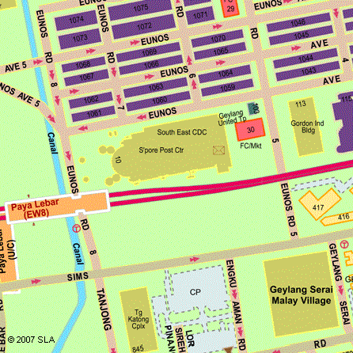

CLINIC MANAGEMENT
=================

Conduct
~~~~~~~

All data relating to the legal clinic is confidential and is **not** to
be revealed to anyone not directly related to the service. The lawyers
will be governed by the relevant sections of the Legal Profession Act
and relevant ethical rules during their interactions with clients. In
the event that the applicant has sought the advice of another lawyer,
you may deal with the case as you see fit.

Confidentiality
~~~~~~~~~~~~~~~

In addition to the rules mentioned above, the CDC shall not release the
names or contact details of any of the lawyers volunteering at the legal
clinic.

You are not to give your name, the name of your firm or any details by
which the client may be able to identify or locate you.

Support
~~~~~~~

A copy of the Community Legal Clinic Manual will be provided to each
lawyer prior to the clinic.

Before beginning to volunteer at the clinic, it is suggested that
lawyers sit in on at least one session with an experienced volunteer
lawyer (mentor). It is proposed that there be at least one mentor
present at each session.

New volunteers are encouraged to consult the designated mentor in the
event of doubt. They are also encouraged to attend such training
sessions to be conducted by the Law Society under the auspices of the
Pro Bono Services Office as necessary.

A copy of the Women’s Charter, Penal Code and other Statutes related to
family and criminal Law, information on Legal Aid Bureau, Family Court,
Criminal Legal Aid Scheme and The Law Society of Singapore Directory are
available for reference at the Community Legal Clinic. You may consult
the other volunteer lawyers for their opinion.

In case you feel the clinic attendee is eligible for legal aid – civil
or criminal, or needs referral to particular services such as
counselling or financial aid, please let the PBS Officer know. They will
carry out the appropriate follow-up after the legal consultation.

In some cases, clinic attendees may be emotionally charged over the
matter. If at any point you feel that the clinic attendee needs
emotional support, please request assistance from the PBS Officer.

Forms

Before each clinic session, you will be furnished a summary of each
clinic attendee’s problem/area of enquiry (see page 3-2 for a sample).

For each attendee, you will need to complete a green form (FORM A, see
page 3-5 for a sample) which is essentially the attendance note for you
to record the advice given to the client.

The Clinic Case List contains information about the clinic applicants
registered for each session and a short narrative of the problem and
issues on which advice is sought.

Form A and the Clinic Case List are NOT to be handed to the client.

Fill in FORM A after the consultation, giving a short synopsis of the
advice offered. If you have suggested a second consultation, make a note
on FORM A and inform the PBS Officer of this. As a rule, we do not
register applicants for a second consultation over the same issue unless
there are special circumstances requiring further legal advice.

Applicants
~~~~~~~~~~

As a rule, each applicant is given a maximum of 20 minutes. The duty PBS
Officer will advise if there is adequate time. If there are fewer
applicants, the length of consultation may be lengthened at your own
discretion.

All applicants who have registered for the Community Legal Clinic will
be seen on the night itself. As far as possible, we avoid turning
applicants away. Applicants (and anyone accompanying them) will be
required to provide their identification for verification purposes, as
well as sign a Disclaimer of Liability before being allowed to consult
with the lawyer.

Clinic times and venues
~~~~~~~~~~~~~~~~~~~~~~~

Registration and arrangements for appointments at the four Community
Legal Clinics are handled by the Pro Bono Services Office. The clinics
are hosted by the NW, SW, SE and Central CDCs. Volunteer’s lawyers will
have the use of interview rooms at the CDC office. A Pro Bono Service
Officer will be at the reception counter of the CDC office to usher the
clients into the interview rooms where the advice is given. The times
and venues for the clinics are as follows:

Mon (7 -9.30 pm)

| North West Community Development Council
| #06-13 Woodlands Civic Centre
| 900 South Woodlands Drive
| Singapore 730900
|

(5 minutes walk from Woodlands MRT station)

|image1|

*Reproduced with permission of SLA.*

Tues (7 – 9.30 pm)

| South East Community Development Council
| #02-01 Singapore Post Centre
| 10 Eunos Road 8
| Singapore 408600
|

(5 minutes walk from Paya Lebar MRT station)

|image2|

*Reproduced with permission of SLA.*

Wed (7 – 9.30 pm)

| South West Community Development Council
| #03-11 The JTC Summit
| 8 Jurong Town Hall Road
| Singapore 609434
|

(10 minutes walk from Jurong East MRT station)

|image3|

*Reproduced with permission of SLA.*

Thurs (7 – 9.30 pm)

| Central Community Development Council
| #07-11 HDB Hub via Bizthree Lift Lobby 1
| 490 Lorong 6 Toa Payoh
| Singapore 310490
|

(5 minutes walk from Toa Payoh MRT station)

|image4|

\ *Reproduced with permission of SLA.*

Clinic Checklist for Volunteer Lawyers
--------------------------------------

The following checklist will assist the volunteer lawyer when dealing
with the attendee during the clinic session.

**Explain to the clinic attendee the Disclaimer of Liability**. You
could say:

*The purpose of the Community Legal Clinic is to provide free advice
to all those in need. The advice given at these sessions shall be as a
matter of guidance and comfort only and is not intended to replace,
substitute or supplement legal advice and legal action that may be
needed. The information provided by attendees to the volunteer lawyers
shall be kept confidential. Please note that the volunteer lawyers are
under a legal prohibition from acting any further for attendees. For the
free advice given, The Law Society of Singapore and its volunteer
lawyers and/or their practices shall not be liable in any way whatsoever
for any such advice or information.*

**You are discouraged from revealing your name, the name of your firm,
or any details by which the applicant can identify or locate you, to the
clinic attendee.** This reduces the likelihood of the attendee tracing
you for further advice or representation.

**Adhere to the time limit of 20 minutes allocated**. This is to ensure
that everyone gets the same amount of time with you.

**Be polite and courteous at all times to members of the public.** If
you have any problems or experience difficulties with any member of the
public, please approach the duty Pro Bono Service Officer for
assistance.

**Do not attend to a member of public who has a solicitor on record.**
It is likely that you will not be told of all the facts within 20
minutes and any advice given by you may be in conflict with the advice
already given by the solicitor on record. If you **do** find out that
the person is represented by a lawyer, immediately inform the person
that you cannot give advice and terminate the session.

**Do not give specific advice on “legal costs”, especially on
professional charges for a specific matter.** You may, however, explain
the basis for charging and taxation of bill costs.

**Keep an accurate record of the nature of the advice sought and the
advice rendered by you in the attendance note provided.** Although there
is a disclaimer the member of public would have signed, an accurate
record will help us deal with complaint(s) later should any arise.

Making Referrals
----------------

The Pro Bono Officer will inform you of the appropriate referrals for
the clinic attendees. You may then indicate the relevant information on
Form B (blue form) and/or C (purple form) and hand this to the clinic
attendee at the end of the session. Below is a list of agencies
providing follow-up services. The services they provide are described in
this section.

In the course of counselling, you may decide that additional referral
action is required. Record the type of help required on Form A (the
green form) and inform the PBS Officer who will then arrange for the
client to contact the appropriate agency for further assistance.

• The Advertising Standards Authority of Singapore (ASAS)

• Consumers Association of Singapore (CASE)

• Credit Counselling Singapore (CCS)

• Centre for Enable Living (CEL)

• Criminal Legal Aid Scheme (CLAS)

• The Consumer Protection (Fair Trading) Act (CPFTA)

• Financial Industry Disputes Resolution Centre Ltd (FIDReC)

• Friends of Litigants-In-Person (FLIP)

• Health Science Authority (HSA)

• Insolvency & Public Trustees Office (IPTO)

    | • Legal Aid Bureau (LAB)
    | • Ministry of Manpower (MOM)

• Motor Industries Dispute Resolution Centre (MIDReC)

• National Council On Problem Gambling (NCPG)

• National Council of Social Service (NCSS) – with 54 social service agencies including Family Service Centres (FSCs)

• Primary Justice Project (PJP)

• Singapore Institute of Surveyors & Valuers

• Singapore Dental Association (SDA)

• Singapore Dental Council (SDC)

• Singapore Institute of Surveyors & Valuers (SISV)

• Singapore Mediation Centre (SMC)

• Singapore Medical Association (SMA)

• Singapore Medical Council (SMC)

• Special Needs Trust Company (SNTC)

• Strata Titles Boards

• Tribunal for the Maintenance of Parents

*The Advertising Standards Authority of Singapore (ASAS)*\  [1]_
----------------------------------------------------------------

Address: 170 Ghim Moh Road #05-01

Ulu Pandan Community Building

Singapore 279621

General Line: 6461 1888

Fax : 6467 9055

Email : asas@case.org.sg

Operating Hours: Mondays–Fridays, 9am–6pm

(Nearest MRT Station: Holland Village)

The Advertising Standards Authority of Singapore (ASAS) is an Advisory
Council to the Consumers Association of Singapore (CASE). It was set up
in 1973 to promote ethical advertising in Singapore and is the
self-regulatory body of the advertising industry.

**What can ASAS do?**

-  Provides advice and guidance when advertisers, advertising agencies
   and media owners are in doubt over the acceptability of
   advertisements – particularly before publication. However, it is not
   intended for ASAS to be a clearing-house for the approval of all
   advertising.

-  Handles complaints about advertising practices. ASAS is able to rule
   on disputes between members of the Singapore Advertisers Association,
   the Association of Accredited Advertising Agents, Advertising Media
   Owners’ Association of Singapore and the Association of Broadcasters.

-  Advises on any advertisement prepared and/or published by persons or
   companies outside the four Associations, provided that it is brought
   to the attention of ASAS in accordance with the procedure of lodging
   a complaint.

-  Issues sanctions: In withholding of advertising space or time from
   advertisers, and withdrawal of the trading privileges from
   advertising agencies. Both these sanctions are applied by the media
   owners.

-  On adverse publicity. This is wielded by ASAS, which may publish
   details of the outcome of investigations it undertakes naming those
   who have offended against the Code. Decides and interprets the Code.
   Decision shall be final.

*Consumers Association of Singapore (CASE)*
------------------------------------------

| 170 Ghim Moh Road #05-01
| Ulu Pandan Community Building
| Singapore 279621
|

Hotline: `6100 0315 <tel:+6561000315>`__

Fax : 6467 9055

(Nearest MRT Station: Buona Vista) (Bus numbers: 92, 100, 111, 198)

**Complaints CASE handles:**

Consumer-to-business disputes

| Please ensure the main complainant is the person lodging the claim,
  (the main complainant
| denotes the person who made the purchase). You are a consumer if you
  make a transaction for a product or service for personal use.

**What to do if you have a consumer complaint?**

If you have a dispute with a retailer over consumer goods and services
and the matter with the retailer remains unresolved, you can approach
CASE for advice and assistance through the following means:

**Phone assistance**

| You may call our hotline 6100-0315 to seek general queries from our
  Consumer Relations Officers. 
| Hotline hours: Mon-Fri 9am to 5pm, Sat 9am to 12pm

**Counter service**

For a consultation, please see any of our officers directly at our
office. Our operating hours are from Monday to Saturday, 9am to 4pm. We
are located at:

|  
| 170 Ghim Moh Road
| #05-01 Ulu Pandan Community Building
| Singapore 279621
|

**Complaints CASE does not handle:**

-  Business-to-business disputes - This includes any transactions
   between businesses and products or services purchased for business
   use. Should there be a dispute, you may consider checking with the
   Small Claims Tribunals (SCT) if you are eligible to make a claim
   via \ `SCT <http://app.subcourts.gov.sg/sct/index.aspx>`__.

-  Landlord and tenant claims - For disputes pertaining to deposits or
   rental issues, you should lodge your case with the Small Claims
   Tribunals \ `SCT <http://app.subcourts.gov.sg/sct/index.aspx>`__.

-  Speculation in shares, stocks, commodities, investments - If you are
   an investor and have dealings in shares, stocks etc. Accident claims
   - If you have a dispute with another driver in an accident.

-  Overseas companies - If you have bought a product overseas (except
   for Mainland China, India, Macao SAR and Malaysia).

*Credit Counselling Singapore (CCS)*\  [2]_
-------------------------------------------

| 210 Middle Road #05-04
| Singapore Pools Building
| Singapore 188994
|

General Line: `6338 2663 <tel:+6563382663>`__

Fax : 6338 6586

Email : enquiry@ccs.org.sg

Operating Hours: Mondays–Fridays, 9am–6pm

Hotline: 1800 CALL CCS (1800 2255 227)

(Nearest MRT Station: Bugis)

**About CCS**

CCS specialises in assisting people with an unsecured, legal, consumer
debt problem. However, CCS is unable to take up a person’s case and talk
to his creditors, e.g. a bank, without first having a detailed
understanding of his financial situation.  And CCS obtains a person’s
details from the credit counselling session that takes place after the
person has attended CCS free info talk on debt management and also
submitted his counselling request.

It offers services in the following areas:

-  Info Talk on Debt Management

-  Credit Counselling

-  Debt Management Programme (DMP)

-  Education on Financial Topics

*Centre For Enabled Living (CEL)*\  [3]_

SG Enable

141 Redhill Road

Singapore 158828

Tel: 6593 6437

Hotline: 1800-8585-885

Fax: 6270 7024

Website: `*https://www.sgenable.sg* <https://www.sgenable.sg/>`__

(Nearest MRT Station: Redhill)

SG Enable is an agency dedicated to enabling persons with disabilities.

Key functions of SG Enable include:

-  Enhancing information and referral services for child and adult
   disability schemes;

-  Administering grants and support to persons with disabilities and
   their caregivers;

-  Improving transition management across different life stages;

-  Enhancing employability and employment options for persons with
   disabilities; and

-  Rallying stakeholder support in enabling persons with disabilities

SG Enable provides programmes for children, youths and adults. It also
provides support for caregivers and for work training and employment.
Schemes for financial assistance and other assistance may also be
available

*Criminal Legal Aid Scheme (CLAS)*
----------------------------------

State Courts

Level 5 (between Court No. 5 & 12)

1 Havelock Square

| Singapore 059724
| Tel: 6534 1564

Fax: 6534 5237

Email: CLAS@lawsoc.org.sg

Operating Hours: 9 am to 5.45 pm

Mondays to Fridays; closed on Saturdays, Sundays and Public Holidays

(Nearest MRT Station: Clarke Quay)

CLAS provides free criminal legal assistance to the poor and needy in
non-capital charges. Only persons with a disposable income of not more
than S$10,000 per year and a disposable capital of not more than
S$10,000 may be granted legal aid.

**The laws that CLAS covers include: **

-  Arms & Explosives Act (Cap. 13)

-  Arms Offences Act (Cap. 14)

-  Computer Misuse Act (Cap. 50A)

-  Corrosive & Explosive Substances & Offensive Weapons Act (Cap. 65)

-  Dangerous Fireworks Act (Cap. 72)

-  Enlistment Act (Cap. 93)

-  Explosive Substances Act (Cap. 100)

-  Films Act (Cap. 107)

-  Miscellaneous Offences (Public Order and Nuisance) Act (Cap. 184)

-  Misuse of Drugs Act (Cap. 185)

-  Penal Code (Cap. 224)

-  Prevention of Corruption Act (Cap. 241)

-  Undesirable Publications Act (Cap. 338)

-  Vandalism Act (Cap. 341)

-  Women’s Charter (Cap. 353) [Sections 65(8) and 140(1)(i)] [S. 65(8) –
   breach of personal protection order] [S. 140(1)(i) – sexual
   intercourse with any girl below the age of 16 years except by way of
   marriage]

*Centre for Forensic Medicine (CFM)*
-------------------------------------

Health Sciences Authority

Level 1, Blk 9, SGH, Outram Rd

Singapore 169608

(Nearest MRT Station: Outram Park)The Applied Sciences Group applies
forensic, medical, scientific, investigative and analytical expertise to
serve the administration of justice and to safeguard public health. The
Group consists of the Centre for Analytical Science (CAS), Centre for
Forensic Medicine (CFM) and Centre for Forensic Science (CFS).

\ *The Consumer Protection (Fair Trading) Act (CPFTA)*
------------------------------------------------------

Under the CPFTA, CASE and Singapore Tourism Board are empowered to
invite errant businesses to enter into a Voluntary Compliance Agreement,
failing which, to take an injunction to stop the business from engaging
in further unfair practices.

The consumer should first seek to resolve the dispute with the trader.
Businesses should consider having in place a dispute resolution or
alternative mediation process so that there is a platform for settling
disputes with consumers. Currently, mediation services are available
through Community Mediation Centres, Singapore Mediation Centre, CASE
and various industry-specific mediation facilities. If the dispute
cannot be settled, the consumer may file a claim in court for civil
remedies. Most claims for unfair practices under the Act should be filed
in the Small Claims Tribunal. The consumer may also have rights of
action under contract or tort law. The consumer should seek legal advice
in case of uncertainty.

When considering a claim for unfair practices under the Act, prior
granting remedies the court will take into account whether the consumer
made a reasonable effort to minimise any loss or damage resulting from
the unfair practice, and tried to resolve the dispute through a
specified dispute resolution scheme. The Financial Industry Disputes
Resolution Centre Ltd (FIDReC) has been prescribed as the specified
dispute resolution scheme in respect of disputes relating to MAS-related
financial products or services supplied by a subscriber to FIDReC.

\ *Financial Industry Disputes Resolution Centre Ltd (FIDReC)*\  [4]_

112 Robinson Road #13-03

HB Robinson

Singapore 068902

Tel: (65) 63278878 / Fax: (65) 63278488

(Nearest MRT Station: Downtown)

Email: info@fidrec.com.sg

Opening hours:

Mondays, Wednesdays, Fridays: 9am – 6pm

Tuesdays, Thursdays: 9am – 7.30pm

**The Jurisdiction of FIDReC**

**
**\ The jurisdiction of FIDReC in adjudicating disputes between
consumers and financial institutions is as follows:

(1) Claims between the insured and insurance companies up to S$100,000

(2) Disputes between banks and consumers, capital market disputes and
    all other disputes (including third party claims and market conduct
    claims): up to S$50,000

At present, FIDReC’s services are available to all consumers who are
individuals or sole-proprietors.

\ *Friends of Litigants-In-Person (FLIP)*
-----------------------------------------

Community Justice Centre

Level 11 Havelock Square

State Courts Complex

Singapore 059724

Tel: 6557 4100    Website: www.cjc.org.sg

(Nearest MRT Station: Clarke Quay)

The FLIP programme aims to assist litigants-in-person with emotional and
practical support as they journey through the various steps of court
proceedings during the trial. The earlier they engage FLIP, the more
FLIP is able to help them.

\ *Health Science Authority (HSA)*

Health Sciences Authority

11 Outram Road

Singapore 169078

Bloodbank@HSA

Website: `www.hsa.gov.sg <http://www.hsa.gov.sg/>`__

(Nearest MRT Station: Outram Park)

\ *Insolvency & Public Trustees Office (IPTO)*\  [5]_
-----------------------------------------------------

The URA Centre, East Wing

45 Maxwell Road

#07-11, Singapore 069118

Tel: 1800 2255 529

Email: OneMinLaw@mlaw.gov.sg

Opening Hours:

Mondays to Fridays: 8:30 am to 5:00 pm

Saturdays: 8:00 am to 12:00pm

(Nearest MRT Station: Telok Ayer)

The Insolvency and Public Trustee's Office (IPTO) provides services in:

-  Bankruptcy & Debt Repayment Schemes

-  Corporate Insolvency

-  Public Trustee

-  Moneylenders

-  Pawnbrokers

\ *Legal Aid Bureau (LAB)*
--------------------------

45 Maxwell Rd #07-11

The URA Centre, East Wing

Singapore 069118

Registration Hours

Mondays to Fridays: 8:30am to 5:00pm

Saturdays: 8:30am to 12:00pm

Tel: (65) 1800 2255 529 (toll-free) / Fax: (65) 6325 1402

E-mail: OneMinLaw@mlaw.gov.sg

(Nearest MRT Station: Telok Ayer)

LAB provides Legal Advice, Legal Aid, Legal Assistance and
Counselling. It handles divorce, variation or enforcement orders,
custody of children, monetary claims, claims for compensation and estate
matters. It is not free and most people will be required to pay a
contribution towards the costs of work done. Legal Aid is available to
Singapore citizens, and PRs who are in Singapore, that satisfy the means
test.

\ *Ministry of Manpower (MOM)*
------------------------------

Ministry of Manpower Services Centre

1500 Bendemeer Road

Singapore 339946

Tel: 6438 5122 (General Enquiries) / Fax: 6534 4840

(Nearest MRT Station: Potong Pasir)

Ministry of Manpower Headquarters

18 Havelock Road

Singapore 059764

(Nearest MRT Station: Clarke Quay)

The general enquiries hotline operates on:

Monday - Friday: 8.30 am to 5.30 pm

Saturday: 8.30 am to 1 pm

If you are an employee covered by the Employment Act and wish to lodge a
claim against your employer, you can call MOM Contact Centre at 6438
5122 or visit Appointment@MOM to book a 30-min appointment session to
consult our Labour Relations Officer. Alternatively, you may submit your
claims online via Employment Standards Online (ESOL) for individual
users. This service is intended for employees who have left employment
and wish to recover salaries and other statutory payments such as
overtime pay, public holiday and annual leave pay from their former
employers. 

\ *Motor Industries Dispute Resolution Centre (MIDReC)*\  [6]_
--------------------------------------------------------------

61 Ubi Avenue 2

#06-04/05 Automobile Megamart

Singapore 408898

Opening hours: Mondays – Fridays 9:00am to 5:30pm / Saturdays 9:00am to
1:00pm

Tel: 67430269 / Fax: 67471010 / Email: info@midrec.com.sg

(Nearest MRT Station: MacPherson)

The Motor Industries Dispute Resolution Centre or MIDReC is an
independent and impartial institution specializing in the resolution of
disputes between motoring businesses and consumers. Consumers who have
an unresolved dispute with an accredited motoring business can lodge
their claim/disputewith the MIDReC.

\ *National Council On Problem Gambling (NCPG)*\  [7]_
------------------------------------------------------

510 Thomson Road

#05-01, SLF Building, Singapore 298135

Opening hours: Mondays – Fridays 8:30am to 6:00pm. Eve of public
holidays: 8.30am to 12.30pm

(Nearest MRT Station: Toa Payoh)

The NCPG is a council comprising 15 members with expertise in psychiatry
and psychology, social services, counselling, legal, rehabilitative as
well as religious services. The Council’s first two-year term began on
31 August 2005, and it is now in its fifth term.

\ *National Council of Social Service (NCSS)*
---------------------------------------------

Ulu Pandan Community Building

170 Ghim Moh Road, #01-02, Singapore 279621

DID: 6210 2500

Website: `www.ncss.org.sg <http://www.ncss.org.sg>`__

(Nearest MRT Station: Holland Village)

There is a referral protocol to recommend follow-up of clinic attendees
by social agencies registered with NCSS. After recording in Form A or C
the type of referral required, please inform the duty PBS Officer who
will be able to inform the relevant agencies for appropriate follow-up
action with the client.

Under this arrangement, referrals can be made to and from 42 social
service agencies which includes the 36 Family Service Centres.

More information on the financial, social and other assistance schemes
available can be found in “Assistance Schemes for Individuals & Families
in Social & Financial Need” compiled by NCSS.

*Singapore Dental Association (SDA)*
------------------------------------

2 College Road

Level 2 Alumni Association, Singapore 169850

Opening Hours: Monday - Friday 9:00am to 6:00pm

(Nearest MRT Station: Outram Oark)

Complaints other than those of professional misconduct (e.g. billing
disputes and other complaints against dentist or dental clinics) are
directed to the Complaints Handling Committee of the Singapore Dental
Association for mediation.

\ *Singapore Dental Council (SDC)*\  [8]_
-----------------------------------------

81 Kim Keat Road

#09-00 NKF Building, Singapore 328836

Opening Hours: Monday - Friday 9:00am to 6:00pm

Tel: 6355 2405

(Nearest MRT Station: Chinatown)

The Council looks into cases where there is professional misconduct,
performance impaired by ill health or a conviction. If you have concerns
that a dental provider has not acted in a professional manner, you can
seek help from the Council or the Singapore Dental Association (SDA).
The SDC will only convene a hearing by the Complaints Committee after it
has received an official complaint in writing and is supported by a
Statutory Declaration.

Types of issues include (1) serious profession misconduct, (2)
performance impaired by ill health and/or (3) conviction.

*Singapore Institute of Surveyors & Valuers (SISV)*
---------------------------------------------------

SISV Dispute Resolution Centre

110 Middle Road #09-03

Chiat Hong Building

Singapore 188968

Tel: 6222-3030 / Fax: 6225-2453

Email: sisv.info@sisv.org.sg / Website:
`http://www.sisv.org.sg <http://www.sisv.org.sg/>`__

(Nearest MRT Station: Bugis)

**Joint SISV-CMC Mediation Scheme**

The purpose of this Scheme is to allow disputes occurring in private
estates and neighbourhoods to be resolved in an amicable manner rather
than resorting to courts.

Accredited agencies or agents and those employing their services may
avail themselves of mediation and other dispute resolution services.
Under this scheme, trained mediators from the Community Mediation Centre
of Ministry of Law and the Singapore Institute of Surveyors and Valuers
Mediation Centre will conduct a co-mediation session to help parties
resolve their disputes.

Community mediators who are mainly grassroots leaders currently deal
with community and social conflicts in public housing estates. SISV
mediators handle technical conflicts relating to real estate and
construction disputes. This Scheme takes advantage of the respective
skills and expertise of these mediators to better resolve conflicts in
management corporations and private estates jointly. It will benefit
residents and occupants in these private developments and help to
promote good neighbourliness and community cohesion. This Scheme will
only deal with relational disputes such as quarrels, environmental
problems arising from noise or leakage, use of common facilities, and
disagreements with Council members and residents

\ *
Singapore Mediation Centre (SMC)*
---------------------------------

1 Supreme Court Lane

Level 4, Singapore 178879

Tel +65 6332 4366

(Nearest MRT Station: City Hall)

Mediation is a solutions-driven, problem-solving process. Instead of
pitting parties against each other, SMC facilitates an objective
discussion on how to advance difficult situations. The goal of mediation
is to find a practical solution and acceptable settlement.

Their process is carefully managed and facilitated by one of their
professional mediators. All SMC mediators have undergone mediation
training of the highest standards. They are respected, senior members of
the legal profession or are industry experts in their respective fields.
Their experience and training help parties identify issues, negotiate
constructively and explore different ways of settling.

Key to mediation is that parties make their own decisions, often with
the help of their lawyers. They are in complete control of the outcome
and do not run the risk of having an unfavourable decision imposed upon
them by a judge or arbitrator. 

\ *Primary Justice Project*
---------------------------

The PJP is a joint collaboration between the State Courts, the Law
Society, the Community Justice Centre and other justice stakeholders.
The PJP encourages the public to explore amicable settlement of disputes
as it provides an interim step between self-help and commencing action
in the courts.

Under this scheme, a party who has a dispute may approach any lawyer
listed on the Primary Justice panel, who provide basic legal advice and
facilitate a settlement of the dispute at a fixed fee.

**How PJP can help**

Parties may apply for PJP of their case falls under the following
categories:

(1) *Civil claims of less than $60,000* (e.g. claims for breach of
    contract, defamation) and which fall outside the Small Claims
    Tribunals' jurisdiction, including consumer claims, tenancy
    disputes, MCST disputes, defamation and employment disputes; and

(2) *Divorce matters where most ancillary matters are close to
    settlement* (e.g. maintenance; matrimonial property; matrimonial
    assets).

**How much does PJP cost**

+----------------------------+------------------------------------------------------------------------------------------------------------------------------------------------------------------------------------------------------------------------+
| **1st appointment**        | **2nd appointment**                                                                                                                                                                                                    |
+============================+========================================================================================================================================================================================================================+
| $300 legal fees            | $1,500 (calculated at $300 per hour, capped at 5 hours).                                                                                                                                                               |
|                            |                                                                                                                                                                                                                        |
| $100 administrative fees   | Includes disbursements, however, this does not include costs and disbursements payable to an ADR service provider (e.g. mediation provider) and does not include stamp fees and other fees payable to third parties.   |
+----------------------------+------------------------------------------------------------------------------------------------------------------------------------------------------------------------------------------------------------------------+

**How to apply**

Application forms are available at CJC HELP Services.

\ *Singapore Medical Association (SMA)*\  [9]_
----------------------------------------------

2 College Road, Level 2

Alumni Medical Centre, Singapore 169850

Telephone: +65 6223 1264

(Nearest MRT Station: Outram Park)

SMA is a national medical organisation representing the majority of
medical practitioners in both the public and private sector.

**Procedure For Submission of A Complaint **

1) Forward an original, signed letter, giving full details of the
       matter, to:

    The Chairman

    Complaints Committee

    Singapore Medical Association

    2 College Road

    Singapore 169850

1) In the letter, please furnish the patient's particulars: NRIC No./
       Address/ Telephone No.

2) The doctor's particulars: Name / Place of Practice (Clinic /
       Department & Hospital Name).

3) A letter of consent from the patient for the release of all relevant
       information pertaining to consultation and treatment with the
       doctor(s) or hospital mentioned in the letter. Please download
       the appropriate consent/authorisation form from the SMA’s
       website.

4) If you are not the patient, but are submitting the letter on behalf
       of the patient, kindly furnish your Name, NRIC No., and Contact
       Address.

SMA’s preliminary enquiry procedure entails obtaining comments from the
doctor(s) referred to in the case. Refer to Information on SMA
Complaints Committee in the next section.

The Committee meets once a month to consider cases for which the
preliminary enquiry is completed. While we endeavour to expedite the
processing of letters received, the whole process may take 2 to 6 months
before you will receive a final reply from us.

\ *Singapore Medical Council (SMC)*\  [10]_
-------------------------------------------

Singapore Medical Council

16 College Road #01-01

College of Medicine Building

Singapore 169854

Website: `www.smc.gov.sg <http://www.smc.gov.sg>`__

(Nearest MRT Station: Outram Park)

*Relating to Complaints/Disciplinary Proceedings*

General Enquiries: 6372 3141

Appointment for Statutory Declarations: 6372-3074

The Singapore Medical Council (SMC) is a statutory board under the
Ministry of Health. Section 5 of the Medical Registration Act (Cap 174)
states that the SMC is to:

-  Keep and maintain registers of registered medical practitioners

-  Approve or reject applications for medical registration under the MRA
   or to approve any such application subject to such restrictions as it
   may think fit

-  Issue practising certificates to registered medical practitioners

-  Make recommendations to the appropriate authorities on the courses of
   instructions and examinations leading to the Singapore degree

-  Make recommendations to the appropriate authorities for the training
   and education of registered medical practitioners

-  Determine and regulate the conduct and ethics of registered medical
   practitioners; and

-  Generally do all such acts and matters and things as are necessary to
   be carried out under the MRA

\ *Special Needs Trust Company (SNTC)*
--------------------------------------

298 Tiong Bahru Road

#03-07 Central Plaza, Singapore 168730

(Nearest MRT Station: Tiong Bahru)

Tel: 6278 9598 / Email: enquires@sntc.org.sg

Website: `www.sntc.org.sg <http://www.sntc.org.sg>`__

Operation hours: Mon – Fri, 9am – 6pm

**About SNTC**

SNTC, a charity and an Institution of Public Character, is the only
non-profit trust company in Singapore set up to provide affordable trust
services to people with special needs/disabilities.

The Insolvency and Public Trustee’s Office (“Public Trustee”) is
entrusted to invest and manage the trust funds. SNTC will administer the
funds according to a care plan, set out in a \*\*Letter of Intent
tailored to the needs of the Beneficiary under the trust.

SNTC is jointly supported by the Ministry of Social and Family
Development (MSF) and National Council of Social Service (NCSS).

\ *Strata Titles Boards*\  [11]_
--------------------------------

45 Maxwell Road #01-11

East Wing, The URA Centre,

Singapore 069118

(Nearest MRT Station: Telok Ayer)

Website: www.mnd.gov.sg/stb/index.html

Tel No: 63251589/63251581

Fax No: 6325 1607

Email: mnd\_strata\_titles\_boards\_enquiry@mnd.gov.sg

A Strata Titles Board is a body constituted under Part VI of the
Building Maintenance and Strata Management Act (BMSMA) to hear
applications:

(a) for orders for collective sales under Part VA of the Land Titles
(Strata) Act; and

    (b) relating to certain types of disputes or matters arising in
    respect of the strata units or the strata development including the
    common property.

\ *Tribunal For The Maintenance Of Parents*
-------------------------------------------

Address: Family Link@Lengkok Bahru

8 Lengkok Bahru #02-01

Singapore 159052

Tel: 1800-2585128 / Fax: 62585928

(Nearest MRT Station: Redhill)

Operation Hours:

Mon – Fri: 8.30 a.m. – 5 p.m. (Lunch: 1 – 2 p.m.)

Sat: 8.30 a.m. – 1 p.m.

Closed on Sunday & Public Holidays

**Role of the TMP**

Setup in 1996 under the Maintenance of Parents Act (Chapter 167B), the
TMP provides a legal channel for elderly parents to seek maintenance
from their children who are capable of supporting them, but are not
willing to do so.

The Tribunal, comprising a President and his members, hears applications
for maintenance or variation of maintenance orders. It adopts a
non-adversarial stance and refers the differences between the parties to
a conciliation officer for mediation before applications are heard. The
Ministry provides the services of a Commissioner and the secretariat to
support the Tribunal.

**Who May Apply**

Any person 60 years and above, domiciled and resident in Singapore
unable to maintain himself adequately can claim maintenance from their
children..

A person below 60 years may also apply if the Tribunal is satisfied that
he is suffering from infirmity of mind or body or for other special
reasons which prevent him or makes it difficult to maintain himself.

An approved person or organization in whose care a parent resides may
apply to the Tribunal for an order for maintenance from one or more of
his children. Any person/organization must apply to the Minister for
Community Development for approval to be an approved person /
organization before filing an application for maintenance.

The Commissioner for the Maintenance of Parents appointed under the
Maintenance of Parents Act may also make an application on a parent’s
behalf.

.. [1]
   Information retrieved from http://www.case.org.sg/asas.aspx

.. [2]
   Information retrieved from http://www.ccs.org.sg/about-ccs

.. [3]
   Information retrieved from
   `https://www.sgenable.sg, <https://www.sgenable.sg/>`__ last updated
   on 18 August 2014

.. [4]
   Information retrieved from
   http://www.fidrec.com.sg/website/contactus.html

.. [5]
   Information in this section obtained from the IPTO website

.. [6]
   Last updated on 18 February 2014 from
   http://\ `www.casetrust.org.sg <http://www.casetrust.org.sg>`__

.. [7]
   Information retrieved from http://www.ncpg.org.sg

.. [8]
   Last updated on
   `http://www.healthprofessionals.gov.sg <http://www.healthprofessionals.gov.sg/>`__
   on 16 June 2013

.. [9]
   Information retrieved from http://www.sma.org.sg/default.aspx

.. [10]
   Last updated 18 October 2011 from SMC website -
   http://www.healthprofessionals.gov.sg/content/hprof/smc/en.html, last
   accessed on 3 September 2014

.. [11]
   http://app.mnd.gov.sg/stb/Home.aspx, last accessed on 3 September
   2014

.. |image1| image:: ../_static/image2.png
   :width: 5.86458in
   :height: 5.43053in

.. |image3| image:: ../_static/image4.png
   :width: 6.12504in
   :height: 4.70833in
.. |image4| image:: ../_static/image5.png
   :width: 6.02275in
   :height: 4.95833in
