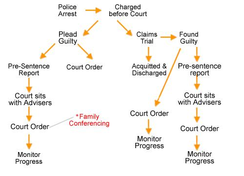

Everything Else
===============

`INTELLECTUAL PROPERTY 259 <#_Toc398041173>`__

`Definitions of the various forms of intellectual property
259 <#definitions-of-the-various-forms-of-intellectual-property>`__

`Copyright 261 <#copyright>`__

`Criminal Offences under Copyright Law
270 <#criminal-offences-under-copyright-law>`__

`Civil Remedies under Copyright Law
273 <#civil-remedies-under-copyright-law>`__

`Right Management Information (RMI)
274 <#right-management-information-rmi>`__

`Copyright and the Internet 275 <#copyright-and-the-internet>`__

`Commonly Asked Questions on Copyright
277 <#commonly-asked-questions-on-copyright>`__

`Trade Marks 291 <#trade-marks>`__

`Applying to Register a Trade Mark in Singapore
293 <#applying-to-register-a-trade-mark-in-singapore>`__

`Infringement of Registered Trademark 295 <#section-39>`__

`Revocation and Invalidation of Trade Marks
297 <#revocation-and-invalidation-of-trade-marks>`__

`Passing Off 299 <#passing-off>`__

`Registered Designs 301 <#registered-designs>`__

`Trade Secrets and Confidential Information
304 <#trade-secrets-and-confidential-information>`__

`Maintaining Confidentiality 307 <#maintaining-confidentiality>`__

`Patents 310 <#patents>`__

`Layout-designs of Integrated Circuits
314 <#layout-designs-of-integrated-circuits>`__

`Geographical Indications 316 <#geographical-indications>`__

`Plant Variety 318 <#plant-variety>`__

`WILLS <#wills-intestacy-probate-administration>`__, `INTESTACY, PROBATE
& ADMINISTRATION 322 <#_Toc398041221>`__

`Administration of Small Estates by The Public Trustee
329 <#_Toc398041227>`__

`About the Wills Registry 335 <#about-the-wills-registry>`__

`Probate and Letters of Administration
338 <#probate-and-letters-of-administration>`__

`DATA PROTECTION LAW 349 <#data-protection-law>`__

`Personal Data Protection Act 2012 (‘PDPA’)
349 <#personal-data-protection-act-2012-pdpa>`__

`ADVANCE MEDICAL DIRECTIVES 355 <#_Toc398041283>`__

`JUVENILE ISSUES 357 <#juvenile-issues>`__

`Definitions & Age Ranges 357 <#definitions-age-ranges>`__

`Beyond Parental Control 358 <#beyond-parental-control>`__

`Juvenile Arrest Cases 362 <#youth-arrest-cases>`__

`Commonly Asked Questions on Pre-Sentence Report
363 <#commonly-asked-questions-on-pre-sentence-report>`__

`Court Orders 364 <#court-orders>`__

`Family Conferencing 370 <#family-conferencing>`__

`Commonly Asked Questions on Court Orders & Family Conferencing
372 <#commonly-asked-questions-on-court-orders-family-conferencing>`__

`Restorative Programmes 374 <#restorative-programmes>`__

`Care & Protection 376 <#care-protection>`__

`MILITARY LAW 379 <#military-law>`__

`Overview of the Military Justice System
379 <#overview-of-the-military-justice-system>`__

`Charge Procedures 384 <#_Toc398041322>`__

`Common Military Offences 389 <#common-military-offences>`__

`ALTERNATIVE DISPUTE RESOLUTION 394 <#alternative-dispute-resolution>`__

`Arbitration 394 <#_Toc398041332>`__

`Mediation 395 <#_Toc398041333>`__

`Adjudication 395 <#_Toc398041334>`__

`Alternative Dispute Resolution in Singapore 397 <#_Toc398041336>`__

`THE TRAFFIC COURT 403 <#the-traffic-court>`__

`Traffic offences without any offer of composition
403 <#traffic-offences-without-any-offer-of-composition>`__

`Minor traffic offences with an offer of composition
403 <#minor-traffic-offences-with-an-offer-of-composition>`__

INTELLECTUAL PROPERTY

Introduction
------------

**World Intellectual Property Organization (WIPO)**

The WIPO was established in 1967. It was tasked to promote the
protection of intellectual property throughout the world through
co-operation among the Governments of Contracting States of the Paris
Convention 1883 and the Berne Convention 1886. *WIPO’s mission is to
lead the development of a balanced and effective international
intellectual property system* that enables innovation and creativity for
the benefit of all.

There are 187 current Member States, including Singapore. WIPO's
strategic direction, budget and activities are determined by its Member
States, who meet in the Assemblies, Committees and other decision-making
bodies.

Definitions of the various forms of intellectual property
----------------------------------------------------------

Intellectual Property (IP) refers to creations by individuals for which
exclusive rights are given. A creative musical, artistic or dramatic
piece; a new inventory innovation; a symbol of a business which has been
recognised through the hard work and toil gone into it: these are
examples of what define intellectual property.

The various forms of IP protection in Singapore are copyright, trade
mark, passing off, registered design, trade secret and confidential
information, patent, geographical indication, layout-design of an
integrated circuit, as well as plant variety.

**Copyright **

Copyright is the exclusive and assignable *legal right of an author* of,
among other things, dramatic, musical, artistic or literary works. It
protects works like novels, computer programs, plays, sheet music and
paintings. It also protects works like sound recordings, cinematograph
films, television and sound broadcasts and cable programmes. These
rights enable a copyright owner to control the commercial exploitation
of his work.

**Trade Mark**

A trade mark indicates *trade origin*. It is any sign capable of being
represented and of distinguishing one’s goods or services dealt with or
provided in the course of trade from those of others.

**Passing off**

A passing off action involves a *deception* made by a person to sell his
own goods under the pretence that they are the goods of another. Such
unfair business practice affects the goodwill of another.

**Registered Design **

A design means *features of shape, configuration, pattern or ornament*
applied to or embodied in an article by any industrial process. It is
the appearance of articles we see everyday. An article refers to any
object to which the design is applied.

**Trade Secret and Confidential Information**

The law on trade secrets is closely tied with the law on confidential
information. A trade secret or confidential information is some
*undisclosed information* or "secret" that is important to a business or
company and is kept out of the public domain. This category of IP offers
protection of extremely valuable business assets. It is a term commonly
used to cover information that has commercial value.

**Patent **

A patent is a right granted to an *owner of an invention* that prevents
others from replicating the invention, using the invention, selling the
invention and importing or exporting the invention. In order for someone
to do any of the above the consent of the patent owner would be
required.

**Geographical Indication**

A geographical indication means any indication or sign used on goods in
trade to identify them as *originating from a specific place*. It
usually consists of the name of the place of origin of the product. Such
labels convey to the consumers that the product possesses special
qualities, reputation or characteristics that are essentially
attributable to that place of origin.

**Layout - Design of an Integrated Circuit**

This refers to the 3-dimensional disposition, however expressed, of the
elements of an integrated circuit (at least one of which is an active
element), and of some or all of the interconnections of an integrated
circuit, or such a 3-dimensional disposition prepared for an integrated
circuit intended for manufacture.

**Plant Variety**

A plant variety means a plant grouping within a single botanical taxon
of the lowest rank which, irrespective of whether the conditions for a
grant of protection are fully met, can be:

(a) Defined by the expression of the chacteristics resulting from a
    given genotype or a combination of genotypes

(b) Distinguished from any other plant grouping by the expression of at
    least one of those characteristics

(c) Considered as a unit with regard to its suitability for being
    propagated unchanged

*
*\ Copyright
------------

Copyright is a form of personal or moveable property. It can be licensed
or transferred, either as an *entire bundle* (all of the distinct rights
under copyright) or as a *single, distinct right* within the copyright
bundle (e.g. only the right to reproduce).

For a work to be protected by copyright, it has to be *original* and
*expressed in a tangible form* such as in a recording or in writing.
Originality simply means that there is a degree of independent effort in
the creation of the work. It is not a question of whether the work has
creative merit.

Works Protected By Copyright
~~~~~~~~~~~~~~~~~~~~~~~~~~~~

Copyright protects literary, dramatic, musical and artistic works. Other
subject matter like films, sound recordings, broadcasts, cable
programmes and published works are also protected. Such rights are often
referred to as neighbouring or related rights.

Copyright protects the expression of ideas (e.g. in words and
illustrations.) Ideas alone are not protected. The following may be
protected under copyright law:

+----------------------------------------------------------------------------+--------------------------------------------------------------------------------------------------------------------------------------------------------------------------------+
| **Literary works**                                                         | Written works/books, articles in journals or newspapers, lyrics in songs, source codes of computer programs                                                                    |
| such as                                                                    |                                                                                                                                                                                |
+============================================================================+================================================================================================================================================================================+
| **Dramatic works                                                           | Scripts for films & drama (as applied), choreographic scripts for shows or dance routines                                                                                      |
| **\ such as                                                                |                                                                                                                                                                                |
+----------------------------------------------------------------------------+--------------------------------------------------------------------------------------------------------------------------------------------------------------------------------+
| **Musical works**                                                          | Music (i.e melody)                                                                                                                                                             |
+----------------------------------------------------------------------------+--------------------------------------------------------------------------------------------------------------------------------------------------------------------------------+
| **Artistic works                                                           | Paintings , drawings, sculptures, engravings, photographs, buildings or models of buildings, works of artistic craftsmansip. eg designer furniture that is not mass produced   |
| **\ such as                                                                |                                                                                                                                                                                |
+----------------------------------------------------------------------------+--------------------------------------------------------------------------------------------------------------------------------------------------------------------------------+
| **Published editions of literary, dramatic, musical or artistics works**   | Typographical arrangements of a published work                                                                                                                                 |
+----------------------------------------------------------------------------+--------------------------------------------------------------------------------------------------------------------------------------------------------------------------------+
| **Sound recordings**                                                       | An aggregate of sounds recorded **o**\ n tapes, CDs, etc                                                                                                                       |
+----------------------------------------------------------------------------+--------------------------------------------------------------------------------------------------------------------------------------------------------------------------------+
| **Films **                                                                 | An aggregate of visual images and sounds recorded on tapes, video compact discs, digital versatile discs, etc                                                                  |
+----------------------------------------------------------------------------+--------------------------------------------------------------------------------------------------------------------------------------------------------------------------------+
| **Television and radio broadcasts **                                       | Broadcasts by way of television or radio                                                                                                                                       |
+----------------------------------------------------------------------------+--------------------------------------------------------------------------------------------------------------------------------------------------------------------------------+
| **Cable programmes**                                                       | Programmes (visual images and sound) included in a cable programme service sent by means of a telecommunication system                                                         |
+----------------------------------------------------------------------------+--------------------------------------------------------------------------------------------------------------------------------------------------------------------------------+
| **Performances**                                                           | By performer such as musicians, singers and comedians                                                                                                                          |
+----------------------------------------------------------------------------+--------------------------------------------------------------------------------------------------------------------------------------------------------------------------------+

What Is Not Protected By Copyright?
~~~~~~~~~~~~~~~~~~~~~~~~~~~~~~~~~~~

Subject matter not protected by copyright includes:

-  Ideas (e.g. a new business idea that have not been documented)

-  Concepts (e.g. an idea for a new game show that has not been written
   down)

-  Procedures (e.g. the steps involved when applying for a travel visa)

-  Methods (e.g. the unique solution to a mathematical problem), **and**

-  Subject matter that has not been made in a tangible form in a
   recording or writing (e.g. a speech or a dance that has not been
   written down or recorded)

**Automatic Protection**

In Singapore, an author automatically enjoys copyright protection as
soon as he creates and expresses his work in a tangible form. There is
no need to file for registration to secure copyright protection.

Overseas Protection For Copyright Works Created In Singapore
~~~~~~~~~~~~~~~~~~~~~~~~~~~~~~~~~~~~~~~~~~~~~~~~~~~~~~~~~~~~

A copyright work created by a Singapore citizen or resident is protected
in many countries overseas by virtue of international agreements.
Generallythe work of a Singapore citizen or resident would be protected
in countries which have signed the international agreements as though
the work was made there. Some countries such as Canada and the U.S.
provide for registration to facilitate proof of copyright infringement
proceedings.

-  The Berne Convention for the Protection of Literary and Artistic
   Works is a convention on copyright protection of literary and
   artistic works including films. It is administered by the WIPO. A
   list of countries party to the Berne Convention may be found at the
   WIPO website [219]_.

-  The Agreement on Trade-Related Aspects of Intellectual Property
   Rights (TRIPS Agreement) (1994) is an international agreement on
   intellectual property rights including copyright, patents, and trade
   marks. Ratification of TRIPS is a mandatory requirement for
   membership of the World Trade Organization (WTO). A list of member
   countries of the WTO may be found at the WTO website [220]_.

The Symbol *©*
~~~~~~~~~~~~~~

The use of the symbol is simply a notice of a claim by the copyright
owner that copyright exists. It does not give the copyright owner any
substantive *right* and is not crucial to the enjoyment of copyright
protection.

Conversely, the non-use of the symbol does not imply a *waiver* or loss
of copyright. It may, however, be a relevant fact in infringement
proceedings. The Court will take into account whether the infringing
party had knowledge that material was protected, and may lower damages
if not. The use of the © symbol would generally stop the infringing
party from successfully relying on such an argument.

In practice, the © symbol is usually followed by the year when copies of
the work were first made available, and the name of the copyright owner,
e.g. © 2005 Intellectual Property Office of Singapore. Sometimes, near
the © symbol, there may be a statement indicating the terms of permitted
use, e.g. “for Private Use Only”. Where the owner does not allow use,
the term “All Rights Reserved” may be found after the © symbol.

Proof Of Originality
~~~~~~~~~~~~~~~~~~~~

In practice, authors have resorted to a number of means to preserve
their interests. They may have:

-  Deposited a copy of their work with their solicitors or a depository.

-  Sent a copy of their work to themselves by post leaving the envelope
   unopened on its return so that the date stamp and the unopened work
   could establish the date of existence and the work as it existed at
   the relevant time, **or**

-  Made a declaration stating the facts of ownership and the date of
   creation before a Commissioner of Oaths.

These are however no foolproof methods of proving authorship as none
prove that the work is original or created by the author. In a dispute,
the Court will decide whether there is sufficient evidence to prove
authorship.

In an action, it is presumed that copyright subsists in the work and
that the plaintiff is the copyright owner unless the defendant (i.e.
alleged infringer) challenges that. If the defendant challenges in good
faith whether copyright subsists in the work or whether the plaintiff is
the copyright owner, the plaintiff will have to file an affidavit with
assertions of relevant facts to show that copyright subsists and that he
is the copyright owner.

Ownership And Rights
~~~~~~~~~~~~~~~~~~~~

Generally, the person who created the work (i.e. the author) owns the
copyright in the work. However, there are exceptions to this general
rule. Some exceptions are:

**Employment**: If the work is created by an employee pursuant to the
terms of his employment, the employer owns the copyright in the work.

**Special situation for newspaper/magazine/periodical employees:**

Where an employee of a newspaper, magazine or periodical creates a
literary, dramatic or artistic work pursuant to the terms of his
employment and for the purpose of publication in a newspaper, magazine
or periodical, the proprietor of the newspaper, magazine or periodical
owns the copyright in respect of publication in or reproduction for the
purpose of publication in any newspaper, magazine or periodical. The
employee owns the remaining rights that make up the copyright bundle of
exclusive rights.

**Commissioning**: If a portrait / photograph / engraving is
commissioned by another party, the commissioner owns the copyright in
the work. If the portrait / photograph / engraving is required for a
particular purpose, this purpose must be told to the commissioned party.
While the commissioner is the copyright owner, the commissioned party
has the right to stop others from doing any act comprised in the
copyright, unless such act is done for the particular purpose for which
the portrait / photograph / engraving is created.

For other types of commissioned works, ownership belongs to the
commissioned party.

As mentioned in the introduction, the copyright owner may transfer his
rights to another party or entity either partially or wholly.

Seeking Permission From Copyright Owners
~~~~~~~~~~~~~~~~~~~~~~~~~~~~~~~~~~~~~~~~

Consent is needed to do anything that only the copyright owner has the
exclusive right to do (e.g. reproduce the work). Sometimes, consent is
indicated in the terms of permitted use, e.g. “for Private Use Only”.
Otherwise, one should seek consent. Merely acknowledging the source when
one uses the work is insufficient.

To obtain consent from copyright owners, one may:

-  Contact the copyright owners directly and negotiate for a licence to
   use the copyright work, **or**

-  Obtain a licence through a collecting society.

A collecting society is an organisation that administers the rights of a
group of copyright owners. It can grant consent for use of the works of
its members under specific conditions. The following are collecting
societies in Singapore:

-  Composers and Authors Society of Singapore

-  Copyright Licensing and Administration Society of Singapore Ltd

-  Music Publishers (Singapore) Ltd

-  Recording Industry Performance Singapore Pte Ltd

-  InnoForm Entertainment Pte Ltd

-  Motion Picture licensing Company (Singapore) Pte Ltd

-  Horizon Music Entertainment Pte Ltd

Not all IP Associations are collecting societies that administer
licences. The following are IP Associations that represent the interests
of copyright owners. Generally they are non-profit, non-government
bodies engaging in promotional, educational and trade-related activities
on behalf of their members:

-  Business Software Alliance

-  International Confederation of Societies of Authors and Composers

-  International Federation of the Phonographic Industry

-  Recording Industry Association (Singapore)

-  The Motion Picture Association

For more details, please refer to the IPOS website at
http://www.ipos.gov.sg.

Copyright Tribunals
~~~~~~~~~~~~~~~~~~~~

The Copyright Tribunal is a forum for resolving certain disputes between
copyright owners and users of copyright works. The Tribunal’s
jurisdiction is set out in Part VII of the Copyright Act (Cap. 63).

The Tribunal is empowered to:

-  Resolve disputes relating to licences and licence schemes in relation
       to a work or other subject matter.

-  Ascertain the royalty payable for the recording of musical works and,
   where applicable, apportion the royalty in respect of a record.

-  Determine what constitutes "equitable remuneration " for the making
   available to the public of a sound recording through a
   non-interactive digital audio transmission.

-  Determine what constitutes "equitable remuneration" for the making of
   a recording or film of a work.

-  Determine what constitutes "equitable remuneration" for the making of
   a copy of a sound recording.

The Copyright Tribunal has the power to refer to the High Court any
matter that comes before it for determination on a point of law. This
may be done on its own volition or at the request of any party to the
matter.

Furthermore, Part X of the Copyright Act (Cap. 63) provides that the
Tribunal may determine the terms on which the government can use
copyright material.

The procedure for applications to be made to the Tribunal is set out in
the Copyright Tribunal (Procedure) Regulations 1988. The forms are
available from the IPOS website [221]_.

For more information, please contact:

**Secretary to the Copyright Tribunals **

Intellectual Property Office of Singapore

51 Bras Basah Road, #04-01 Manulife Centre

Singapore 189554

Tel: (65) 6339 8616 / Fax: (65) 6339 0252

Copyright Infringement
~~~~~~~~~~~~~~~~~~~~~~

Under the Copyright Act, there are two broad categories of things that
are protected by copyright. These are:

(a) “Works”, including, a literary, dramatic, musical or artistic work

(b) Subject matter other than works including; sound recordings,
    cinematograph films, television broadcasts and sound broadcasts,
    cable programs and published editions of a literary, dramatic,
    musical or artistic work

**Infringement of works**

There are three categories of matters which will be deemed an
infringement of the copyright in any work. These include:

(a) Where a person, without the licence of the owner of the copyright,
    does in Singapore, or authorises the doing in Singapore of, any act
    comprised in the copyright.

(b) Where a person, without the licence of the owner of the copyright,
    imports an article into Singapore and sells, lets for hire, or by
    way of trade offering or exposing for sale or hire, the article, or
    distributes the article for the purposes of trade or for any other
    purpose to an extent that will affect prejudicially the owner of the
    copyright, or by way of trade exhibiting the article in public,
    where he knows, or ought reasonably to know, that the making of the
    article was carried out without the consent of the owner of the
    copyright

(c) Where a person who, in Singapore, and without the licence of the
    owner of the copyright, distributes an article and sells, lets for
    hire, or by way of trade offers or exposes for sale or hire the
    article, or by way of trade exhibits the article in public, where he
    knows, or ought reasonably to know, that the making of the article
    constituted an infringement of the copyright or, in the case of an
    imported article, the making of the article was carried out without
    the consent of the owner of the copyright, and that distribution of
    the article for the purpose of trade or for any other purpose to an
    extent that affects prejudicially the owner of the copyright shall
    be taken to be the sale of those articles

**Acts which are *not* an infringement of works**

**A. Fair Dealing**

Under the provisions of the Copyright Act, copying the whole or a part
of a copyright work is permissible as long as it is a 'fair dealing'.
Factors that will be taken into account in deciding whether such copying
is a fair dealing include the following:

-  The purpose and character of the dealing, including whether such
   dealing is of a commercial nature or is for non-profit educational
   purposes.

-  The nature of the work or adaptation.

-  The amount and substantiality of the part copied taken in relation to
   the whole work or adaptation.

-  The effect of the dealing upon the potential market for, or value of,
   the work or adaptation.

-  The possibility of obtaining the work or adaptation within a
   reasonable time at an ordinary commercial price.

Where the copying is for the specific purposes of research or study, it
shall be taken to be a fair dealing as long as the copying limits are
observed. For a published work of at least 10 pages, the copying limits
are up to 10% of the number of pages or one chapter, whichever is the
greater.

In other cases, fair dealings for the purposes of criticism, review or
reporting current events would not constitute copyright infringement. In
the case of criticism or review and the reporting of current events in a
newspaper, magazine or similar periodical, a sufficient acknowledgment
of the work is required.

**B. Other Exceptions**

It is further not an infringement to a work if a person:

-  Does anything which is the copyright owner's exclusive right to do if
   it is done for the purposes of judicial proceeding or of a report of
   a judicial proceeding, or seeking professional advice from an
   advocate and solicitor, or the giving of professional advice by an
   advocate and solicitor..

-  Makes a reproduction of a work, or of a computer program being an
   adaptation of the work, that he owns, which the reproduction is made
   by him, or on his behalf, for the purpose of using that duplicate
   copy in lieu of the original copy in the event that the original copy
   is lost, destroyed or rendered unusable

-  Decompiles a computer programme expressed in a low level language
   where it is necessary to achieve the objective of obtaining the
   information necessary to create an independent computer program which
   can be operated with the computer program decompiled or with another
   computer program and the information so obtained is not used for any
   other purpose.

-  Observes, studies or tests the functioning of a computer programme in
   order to determine the ideas and principles which underlie any
   element of the computer program, if he does so while performing any
   of the acts of loading, displaying, running, transmitting or storing
   the computer program which he is entitled to do.

**Infringement of subject matter other than works**

There are three categories of matters which will be deemed an
infringement of the copyright in any subject matter other than works.
These include:

(a) Where a person, not being the owner of the copyright, and without
    the licence of the owner of the copyright, does in Singapore, or
    authorises the doing in Singapore of, any act comprised in the
    copyright

(b) Where a person, without the licence of the owner of the copyright,
    imports an article into Singapore and sells, lets for hire, or by
    way of trade offers or exposes for sale or hire, the article, or
    distributing the article for the purposes of trade or for any other
    purpose to an extent that will affect prejudicially the owner of the
    copyright, or by way of trade exhibiting the article in public,
    where he knows, or ought reasonably to know, that the making of the
    article was carried out without the consent of the owner of the
    copyright

(c) Where a person who, in Singapore, and without the licence of the
    owner of the copyright, distributes an article and sells, lets for
    hire, or by way of trade offers or exposes for sale or hire the
    article, or by way of trade exhibits the article in public, where he
    knows, or ought reasonably to know, that the making of the article
    constituted an infringement of the copyright or, in the case of an
    imported article, the making of the article was carried out without
    the consent of the owner of the copyright, and that distribution of
    the article for the purpose of trade or for any other purpose to an
    extent that affects prejudicially the owner of the copyright shall
    be taken to be the sale of those articles

**Acts which are *not* an infringement of subject matter *other than*
works**

**A. Fair dealing**

In determining whether a fair dealing with a subject matter other than
works is established, a court would look into the following factors,
namely:

-  The purpose and character of the dealing, including whether such
   dealing is of a commercial nature or is for non-profit educational
   purposes

-  The nature of the audio-visual item

-  The amount and substantiality of the part copied taken in relation to
   the whole audio-visual item

-  The effect of the dealing upon the potential market for, or value of,
   the audio-visual item

-  The possibility of obtaining the audio-visual item within a
   reasonable time at an ordinary commercial price

An example of when a fair dealing may be done with a subject matter
other than a work, would be where the purpose is for research and study.

In other cases, fair dealings with an audio-visual item for the purposes
of criticism, review or reporting of news would not constitute copyright
infringement. In the case of criticism or review and the reporting of
news in a newspaper, magazine or similar periodical, a sufficient
acknowledgment of the first-mentioned audio-visual item is required.

**B. Other exceptions**

It is further not an infringement to a subject matter other than a work
if:

-  Where **50 years** or more has lapsed since the making of a sound
   recording or cinematograph film, and such sound recording or
   cinematograph film has never been published and is kept in the
   collection of a library or archives where it is, subject to any
   regulations governing that collection, accessible to the public, then
   a person may make a copy or make a communication of the sound
   recording for the purpose of research or study or with a view to
   publication.

-  Where for the purposes of preservation/replacement of the sound
   recording or cinematograph film that forms, or formed, part of the
   collection of a library or archives, making a copy is necessary to
   preserve against loss or deterioration or for the purpose of research
   or is necessary to replace because of damage,deterioration or has
   been lost or stolen.

-  Where a filming or recording is made of broadcasts or programmes for
   private and domestic use

-  Where a record is made of a sound broadcast or a cinematograph film
   of a television broadcast or of a cable programme for educational
   purposes.

*
*\ Remedies Available To Copyright Owners
~~~~~~~~~~~~~~~~~~~~~~~~~~~~~~~~~~~~~~~~~

Where there has been an infringement of the copyright of the owner, that
person (or an authorised person in whom the copyright priviliges have
been assigned) may take legal action in a court to obtain the following
remedies:

(a) An injunction

(b) Damages

(c) An account of profits

(d) Where the plaintiff has elected for an award of statutory damages in
    lieu of damages or an account of profits, statutory damages of:

(i) Not more than $10,000 for each work or subject-matter in respect of
    which

    the copyright has been infringed

(i) Not more than $200,000 in the aggregate, unless the plaintiff proves
    that

    his actual loss from such infringement exceeds $200,000

**Factors in Determining Statutory Damages **

In determining the amount of statutory damages, the court is to consider
these factors:

-  The nature and purpose of the infringing act, including whether the
   infringing act was of a commercial nature or otherwise

-  The flagrancy of the infringement

-  Whether the defendant acted in bad faith

-  Any loss that the plaintiff has suffered or is likely to suffer by
   reason of the infringement

-  Any benefit shown to have accrued to the defendant by reason of the
   infringement

-  Conduct of both parties before and during proceedings

-  The need to deter other similar infringements

-  Any other relevant matters

*
*\ Criminal Offences under Copyright Law
----------------------------------------

In Singapore, criminal offences under copyright law include the
following:

(a) Where a person makes for sale or hire, sells or lets for hire, or by
    way of trade offers or exposes for sale or hire, or by way of trade
    exhibits in public, any infringing copy of a work protected by
    copyright.

(b) Where a person imports into Singapore an article which is an
    infringing copy of a work protected by copyright for the purpose of
    selling, letting for hire, or by way of trade offering or exposing
    for sale or hire the article, distributing the article for the
    purpose of trade or for any other purpose to an extent that will
    affect prejudicially the owner of the copyright in the work, or by
    way of trade exhibiting the article in public

(c) Where a person, at a time when copyright subsists in a work
    distributes such a work for the purposes of trade or for other
    purposes but to such an extent as to affect prejudicially the owner
    of the copyright

(d) Where a person, at a time when copyright subsists in a work, makes
    or has in his possession an article specifically designed or adapted
    for making copies of the work

(e) Where a person for his private profit causes a literary, dramatic or
    musical work to be performed in public, or causes a cinematograph
    film to be seen or heard or seen and heard in public, other than by
    the reception of a television broadcast or cable programme

In any of the instances above, it must be proved that the infringing
party knows or ought reasonably to know that the copies are infringing
copies.

The penalties imposed for an offence committed under either parts (a) or
(b) above is:

-  A fine not exceeding $10,000 for the article or for each article in
   respect of which the offence was committed or $100,000, whichever is
   the lower; and/or

-  Imprisonment for a term not exceeding 5 years

The penalties imposed for an offence committed under part (c) above is:

-  A fine not exceeding $50,000; and/or

-  Imprisonment for a term not exceeding 3 years

The penalties imposed for an offence committed under part (d) above is:

-  A fine not exceeding $20,000 for each such article in respect of
   which the offence is committed; and/or

-  Imprisonment for a term not exceeding 2 years

The penalties imposed for an offence committed under part (e) above is:

-  A fine not exceeding $20,000; and/or

-  Imprisonment for a term not exceeding 2 years

The law provides that where any person has in his possession five or
more infringing copies of any work or other subject-matter, unless
otherwise proven, is presumed that the possession of the infringing
copies was not for private and domestic use or that such possession was
for the purpose of sale.

Criminal liability for wilful infringement

It is also a criminal offence if a person wilfully infringes copyright
for the purpose of obtaining a commercial advantage and/or to the extent
of the infringement significant, which is outside of the offences
contained in parts (a), (b), (c) and (e) above.

Commercial advantage means any direct advantage, benefit or financial
gain for a business or trade. As to whether the infringement is to an
extent that is significant, this is judged based on the volume and value
of any articles that are infringing copies, whether the infringement has
a substantial prejudicial impact on the copyright owner and all other
relevant matters.

The penalties for such wilful copyright infringement are:

-  1st offence, a fine not exceeding $20,000 and/or imprisonment for a
   term not exceeding 6 months, **or**

-  2nd or subsequent offence, a fine not exceeding $50,000 and/or
   imprisonment for a term not exceeding 3 years.

**Other acts that have civil and criminal liabilities include: **

-  Circumventing a technological measure; and

-  Removing or altering the rights management information electronically
   attached to a work.

Circumvention of technological measures

Copyright owners employ certain technological measures to prevent or
restrict unauthorized access to their digital copyright works. Given the
increasing ease with which these digital works can be reproduced and
disseminated, it has become necessary to protect technological measures
that are employed in connection with the exercise of the owner’s
copyright.

The owner of a copyright work may take action against a person who:

a) Knowingly circumvents a technological access control measure put in
       place.

b) Manufactures, imports, distributes, offers to the public, provides or
       otherwise traffics in any device, product or component which:

i.   Is promoted, advertised or marketed for the purpose of
         circumventing the technological measure

ii.  Has limited commercial significance other than to circumvent the
         technological measure, or

iii. Is designed or made primarily for the purpose of circumventing the
         technological measure

a) Offers to the public or provides any service which:

i.   Is promoted, advertised or marketed for the purpose of
         circumventing the technological measure

ii.  Has limited commercial significance other than to circumvent the
         technological measure, or

iii. Is performed primarily for the purpose of circumventing the
         technological measure

Circumvent means to avoid, bypass, remove, deactivate, descramble (where
the copy is scrambled), decrypt (where the copy is encrypted) or
otherwise impair.

**Criminal Liability for Circumvention of Technological Measures**

Where a person contravenes part (a) above wilfully and for the purpose
of obtaining any commercial advantage or private financial gain, if
convicted, he shall be liable to a fine not exceeding $20,000.

Where a person contravenes part (b) or (c) above wilfully and for the
purpose of obtaining any commercial advantage or private financial gain,
if convicted, he shall be liable to a fine not exceeding $20,000 and/or
imprisonment for a term not exceeding 2 years.

For the purposes of (b)(i) and (c)(i) above, the contravention is not
considered wilful unless the person had himself promoted, advertised or
marketed or authorised the promotion, advertising or marketing of it.

For the purposes of (b)(ii) and (c)(ii), the contravention is not
considered wilful unless the person, at the time of contravention, knew
or had reason to believe that it had only a limited commercially
significant purpose or use other than to circumvent the technological
measure.

For the purposes of (b)(iii), the contravention is not considered wilful
unless the person, at the time of contravention, knew or had reason to
believe that it was designed or made primarily for the purpose of
circumventing the technological measure.

For the purposes of (c)(iii), the contravention is not considered wilful
unless the person had himself performed it or authorised the performance
of it, primarily for the purpose of circumventing the technological
measure.

**
**\ Civil Remedies under Copyright Law
--------------------------------------

The owner of the copyright may commence a civil action against a person
who contravenes any of the sections above.

Civil remedies available include:

-  Injunction

-  Either:

    a. Damages; **or **

    b. Statutory damages in lieu of damages of not more than $20,000

-  Order for delivery up of any articles used to carry out the
   prohibited act to the copyright owner, **or **

-  Order for destruction.

*Please see also the considerations by the Court in awarding statutory
damages on the IPOS website. *

Exceptions to Prohibition on Circumvention of Technological Access
Control Measures

The Copyright Act provides for exceptions where the circumvention of a
technological measure which effectively controls access to a work is not
a contravention. These include acts done:

-  To enable a non-profit library, any non-profit archives, an
   educational institution, an institution assisting
   handicapped/intellectually handicapped readers to have access to a
   copyright work which is not otherwise available to the library,
   archives or institution, for the sole purpose of making acquisition
   decisions.

-  For undertaking research on encryption technology.

-  For the sole purpose of achieving inter-operability of an
   independently created computer program with another computer program.

-  For the sole purpose of testing, investigating or correcting a
   security flaw or vulnerability of a computer, computer system or
   network.

-  For the sole purpose of preventing access by minors to any material
   on the Internet, **or**

-  For the purpose of law enforcement, intelligence, national defence,
   essential security or other similar purpose.

Right Management Information (RMI)
----------------------------------

Rights management information is used by authors of digital works to
identify their works or to provide information about the copyright work,
including the terms and conditions relating to its use.

Where RMI in electronic form:

-  Is attached to or embodied in a copy of a work or other
   subject-matter in which copyright subsists or a recording of a
   performance, **or **

-  Appears in connection with the communication or making available to
   the public of a copy of a work or other subject-matter or a recording
   of a performance

An action may be brought by the owner or exclusive licensee of the
copyright or the performer against a person who does any of the
following acts:

a) Knowingly removes or alters the RMI relating to any work or other
   subject-matter or recording of a performance.

b) Distributes or imports for distribution the rights management
   information relating to any work or other subject-matter or any
   recording of a performance, being rights management information which
   has been altered without the consent of:

(i)  The owner or exclusive licensee of the copyright in the work or
     subject-matter, **or**

(ii) The performer of the performance; **or**

a) Distributes, imports for distribution, communicates or makes
   available to the public copies of a work or other subject-matter or a
   recording of a performance in respect of which the rights management
   information has been removed or altered without the consent of:

(i)  The owner or exclusive licensee of the copyright in the work or
     subject matter; **or**

(ii) The performer of the performance

and the person performing any of the above acts knows or ought
reasonably to know that the act will induce, enable, facilitate or
conceal an infringement of the copyright in the work or subject-matter
or an unauthorised use of the performance.

Copyright and the Internet
--------------------------

Copyright Materials on the Internet
^^^^^^^^^^^^^^^^^^^^^^^^^^^^^^^^^^^

All copyright materials are entitled to the same protection, regardless
of whether they are sent over the Internet or stored on web servers. The
fact that they are made available on the Internet does not constitute a
waiver of copyright nor does it carry any implied licence for anyone to
download or reproduce the material without the permission of the
copyright owner.

It is advisable for all copyright owners to maintain documentary
evidence of the date of creation of the work, and to display a notice of
copyright on the material posted on the Internet. Such documentary
evidence will facilitate proof of copyright should there be a need to
enforce the copyright against a third party. *Please refer to the symbol
© and proving originality of work.*

Webpages
^^^^^^^^

Generally, a webpage is considered subject matter that is entitled to
copyright protection. Individual works (e.g. original music, original
text) within a webpage can also independently enjoy copyright protection
separate from the webpage.

If you wish to hyperlink to a website, it is good practice to check the
terms and conditions of use of the website and the terms and conditions
of use of the works.

Downloading Materials from the Internet
^^^^^^^^^^^^^^^^^^^^^^^^^^^^^^^^^^^^^^^

Downloading materials from the Internet may constitute a copyright
infringement because copying is involved. However, the mentioned
exceptions may apply.

Browsing
^^^^^^^^

When users browse (view, listen or utilize) copyright works made
available over the Internet, a transient and incidental electronic copy
of the copyright work is created in the user’s computer or other
electronic device in the process of communicating the work to the user.
The making of this transient and incidental copy of the work constitutes
a reproduction of the work.

The Copyright Act provides a specific limited exception for the act of
browsing copyright materials made available on the Internet. The
copyright in a work is not infringed by the making of a temporary or
transient reproduction of the work.

The exception applies only if:

-  The reproduction is made incidentally as part of the technical
   process of making or receiving a communication, **and **

-  The act of making the communication itself does not constitute an
   infringement.

This exception shall NOT apply if the reproduction of the copyright work
that is communicated is:

-  An infringing copy of the work, **or**

-  A reproduction that, if it had been made in Singapore, would have
   been an infringing copy of the copyright work.

Email Forwarding
^^^^^^^^^^^^^^^^

Generally, forwarding an email which contains copyright material without
the consent of the copyright owner is an infringement because copying is
involved.

Liability of Network Service Providers (NSPs)
^^^^^^^^^^^^^^^^^^^^^^^^^^^^^^^^^^^^^^^^^^^^^^

NSPs provide Internet access services and facilities for communication
across networks, as well as for storage of data. As such, they are the
repository and access point for a high volume of copyright works.
Recognising the need to limit the liability of NSPs for infringement
committed by their users, the Copyright Act provides NSPs with limited
legal liability in copyright infringement suits, subject to the NSP
meeting certain stipulated conditions. One of these conditions is that
the NSP must designate a representative to receive any notice of
infringement served by copyright owners.

NSPs should complete the relevant form on the IPOS website to notify
IPOS of all designated representatives together with prescribed
information thereof, to be listed in the Directory of NSPs administered
and maintained by IPOS. The completed form can be submitted by hand,
mailed, faxed or emailed to IPOS. An administrative fee of $32 will
apply.

Commonly Asked Questions on Copyright [222]_
--------------------------------------------

**COPYRIGHT ISSUES AT THE WORKPLACE**\  [223]_
~~~~~~~~~~~~~~~~~~~~~~~~~~~~~~~~~~~~~~~~~~~~~~

**Can I forward emails and file attachments from external parties to my
colleagues? **

Forwarding emails and file attachments constitutes reproduction of the
copyright material. You can do so only with the consent of the copyright
owners or if it is a situation of fair dealing (s35 of the Copyright
Act).

The consent of copyright owners can be express or implied. For example,
some emails expressly invite you to forward them to your contacts who
you think may be interested (e.g. publicity on a product launch). Other
emails, by their nature (e.g. where social awareness or public education
is involved), may imply that forwarding is allowed. When in doubt, you
should check with the source.

**Can I install original software bought by my company on my home PC? **

Every time computer software is installed on a PC, a copy is made.
Installation of software should take place with the copyright owner's
consent, which can usually be found within the terms and conditions
accompanying the original software your company bought.

Whether you can also install this software on your home PC depends on
these terms and conditions. It cannot be assumed that legitimate
software bought for office use can also be installed on home PCs.

Usually, there is a variety of licences for a company to choose from
when buying software. In general, the higher the licence fee, the wider
the scope of permitted use.

**I am writing a proposal for my company. Can I: **

-  **Insert images from websites or clipart from legally purchased
   software in my proposal? **

-  **Annex copies of newspaper/magazine/journal articles to my
   proposal?**

Copyright in images and clipart includes the right to make copies.
Making copies without the copyright owner’s permission by using them in
your proposal would constitute infringement, unless the terms and
conditions of use allow such use, or the owner’s consent is sought (s26
of the Copyright Act). These terms and conditions should be available on
the website and in the software agreement that comes with the software.

Similarly, newspaper/magazine/journal articles are also protected by
copyright. You need the copyright owners' consent to make copies before
annexing them to your proposal, unless it is a situation of "fair
dealing". Alternatively, you can annex the actual articles, as clipped
from the newspaper/magazine/journal, to your proposal without making
copies.

***
*\ During my presentation at the department meeting, can I screen the
opening scene from an original movie DVD to grab my colleagues'
attention? The scene takes only 1 minute. **

Owning an original movie DVD allows you to enjoy the movie privately in
a domestic setting. However, only the copyright owner of a movie has the
exclusive right to show it in public (s26(1)(b)(iii) of the Copyright
Act). The concept of "public" may include workplaces.

As long as the opening scene is a substantial part of the movie (in
quality, rather than quantity), you still need to get the copyright
owner's consent before playing it at your department meeting.

**During our company's Family Day held at a park, can we play music over
the PA system? **

Playing music over the PA system constitutes public performance of
copyrighted works. Thus, although your company’s Family Day is an ad-hoc
event, consent of the copyright owners must be sought. You should
approach COMPASS (Composers and Authors Society of Singapore).

Alternatively, your company can choose to simply connect the PA system
to a local radio station instead of playing music independently. Doing
so is allowed under our copyright law (s43 of the Copyright Act).

**My company is organising a seminar. Can I make a copy of the map
showing the seminar venue and print it on the invitation cards and
publicity material? **

A map is an artistic work protected by copyright. It is necessary to
obtain the copyright owner's consent before reproducing the map in your
invitation cards and publicity material (s26 of the Copyright Act). For
instance, you can simply check with the owner of the venue (e.g. if the
seminar is held on rented premises like a hotel ballroom) whether it has
its own map which it can allow your company to use.

Alternatively, your company can produce its own map for use in its
invitation cards and publicity material.

**My company engaged a vendor to give us training. Since we paid for the
training, can we: **

-  **Make copies of the materials and distribute them to staff who did
   not attend the training? **

-  **Make a video-recording of the training sessions to show the staff
   who did not attend the training?**

As original training materials are protected by copyright, they can only
be reproduced with the permission of the copyright owner or if it is a
situation of "fair dealing". Check the agreement between your company
and the vendor: was it agreed that the training fee includes the right
for your company to make copies of the training materials and a
video-recording of the training? Alternatively, during the training, did
the trainer indicate on behalf of the vendor that your company is free
to make copies of the materials for internal use?

Further, the trainer may deliver the training based on a prepared
script, which is also protected by copyright. Video-recordings of such
training are considered to reproduce the underlying literary work, and
are not permitted in the absence of the owner’s consent. Hence, when in
doubt, you should check with the company whether video-recording is
allowed.

**My company commissioned a graphics designer to design the invitation
cards and publicity posters for a product launch. To save costs, can I
"recycle" the artwork for another event e.g. by simply changing the
event details on the material?**

It depends on what was agreed between your company and the graphics
designer on the use of the artwork and/or ownership of copyright in the
artwork.

In the absence of an agreement between the parties, the default position
is that the graphics designer (or his company, if he is an employee)
owns the copyright (s30 of the Copyright Act). If so, you should only
"recycle" the designs with permission as this involves making copies of
the artwork. Even though the event details will be changed, a
substantial part of the artwork would have been copied and this is
enough to infringe copyright.

In general, it is best to ensure at the outset that the terms of the
engagement suit your company's needs e.g. with allowance for multiple
use in future or with copyright to be owned by your company, at an
agreed price.

**I was interviewed by a journalist who then published a feature in the
newspaper on my company. Can I use the published feature for my
company's publicity e.g. in emails to business associates, in our annual
report, on our company website etc.? **

It depends on how you intend to “use” the published feature. If, in your
publicity, you merely refer to the fact that the newspaper featured your
company, you do not need the newspaper's permission to do so.

However, if you reproduce the newspaper feature in your publicity
material, you will need the copyright owner's consent to do so unless it
is a situation of "fair dealing". The copyright owner may be the
newspaper itself, or the feature writer, especially if he/she is a
freelancer. You should check with the newspaper if in doubt.

**I provide photography services. Do I own the copyright to the photos
that I take for my clients? If I don't, is there any way that I can own
the copyright? I want to showcase the best photos in my website and
brochures. **

The default position is that clients who pay for your services own the
copyright to the photos taken. However, you have limited rights in that
if the photos are required for any particular purpose (e.g. a corporate
client wants glamour shots of the senior management, to use in its
annual report), you are entitled to prevent the photos from being used
for other purposes (s30 of the Copyright Act).

In practice, however, many photographers have their own terms of
engagement with clients. The parties are free to have their own
agreement, which automatically overrides the above default position.
Thus, for example, you and your clients can mutually agree that you will
own the copyright in the photos but that your clients can use the photos
for certain purposes; or that your clients own the copyright but you
have the license to reproduce the photos in your website and brochures.

***
* I own a music CD retail shop. To promote the latest music CDs, I often
play them in my shop. I was told recently that I may be infringing
copyright. Is this true? If so, what should I do? **

When you play music CDs in your retail shop you are actually
"performing" the copyright works in public, and as such need to
copyright owners consent.

COMPASS (Composers and Authors Society of Singapore) represents most of
the song writers and lyricists and is authorized to collect royalties
for them in return for consent to play the music publicly. Thus, you can
approach them to obtain consent for playing the different music CDs in
your shop. More details are available on its website.

**What can I do if I suspect that another company has infringed my
company's copyright? On the other hand, what can I do if I am accused of
infringing another company's copyright?**

If you suspect that your company's copyright has been infringed, you
should obtain legal advice on the options available in your particular
case. As copyright is a private right, copyright owners generally have
to take action themselves to obtain compensation.

As a practical matter, you should gather as many facts about the
suspected infringement as possible so that your legal advisor can better
advise you. If you threaten legal action without grounds, the party you
suspect has infringed your copyright can sue you for groundless threats
of legal proceedings.

If you are accused of infringing another company's copyright, you should
likewise get hold of the relevant facts and seek legal advice.

Finally, whether you suspect or are suspected of copyright infringement,
going to court is not the only way to deal with the matter. For example,
in cases of unintentional infringement, both parties may be more willing
and find it more cost- and time-effective to negotiate a private
settlement out of court. Parties may also wish to engage a mediator in
their talks. Mediation services are provided by the Singapore Mediation
Centre. For more information, please visit the Singapore Mediation
Centre website (http://www.mediation.com.sg/).

**If my employee infringes copyright, e.g. while at work, he illegally
uploads music to the Internet, as the employer, am I also responsible
for my employee's action? **

In general, an employer may be held responsible for an employee's
wrongdoing committed in the course of employment. Copyright owners can
sue both the employee and employer for copyright infringement committed
by the employee.

Furthermore, if a criminal offence is committed by a company its
directors, managers, secretaries and other similar officers are also
personally responsible if the infringement is committed with their
consent or connivance.

Practically, an employer should foster a working environment that
respects intellectual property rights to minimize the risk (please refer
to the next FAQ).

***
* As an employer, what can I do to ensure that my employees do not
infringe copyright? **

An employer is in the ideal position to take the lead in honouring
intellectual property rights in the workplace. Simple measures go a long
way in establishing the right work culture for a productive and legal
work environment.

Insisting on only original software, having a system of tracking
software installation and un-installation to keep within the limits of
the software licence, running regular internal software audits are some
of the things you can do. It is also important to impress upon employees
the value of respecting copyright as part of a virtuous cycle that
benefits everybody.

For more ideas, you can visit the Business Software Alliance's homepage
or its dedicated Software Asset Management (SAM) site
(http://ww2.bsa.org/country.aspx?sc\_lang=en-US-SG).

**I own a graphics design firm. I am told that I can exploit the
copyright in my works by licensing it to other companies. How should I
go about doing so? **

Indeed, copyright, like many other types of property, can be licensed by
the copyright owner to others. Licensing is a useful way to get more
mileage from your copyright (another way is to sell it outright).

As copyright is a private right, it is up to you and your potential
licensees to negotiate the terms of the licence.

**COPYRIGHT ISSUES AT HOME**\  [224]_
~~~~~~~~~~~~~~~~~~~~~~~~~~~~~~~~~~~~~

**We are throwing a housewarming party at our new home. Can we copy the
map showing the location of our home and print it on our invitation
cards? **

A map is an artistic work protected by copyright. Thus, the copyright
owner’s consent is required before you use the map. Another option is
for you to draw your own map to use in the invitation cards.

**Can I record a TV or cable programme and: **

**(a) View it during my leisure time? **

**(b) Show it during a party?**

(a) Yes, you can do so for your own private and domestic use. This is an
exception recognised under our copyright law (s114 of the Copyright
Act).

(b) You may do so if the viewing of the programme at a party or other
gathering is regarded as your private and domestic use.

What is private and domestic use often depends on the facts. For
example, if you only invite a select group of friends and relatives to a
gathering, then it is more likely that the viewing of the recorded
programme will be considered as private and domestic. On the other hand,
if you invite a large group of friends and then permit those friends to
invite their own friends, then it is more likely that the viewing of the
recorded programme will be considered to be seen in public. In such a
situation, there is copyright infringement if the copyright owner’s
consent is not sought.

It is important to bear in mind that a recording might be considered to
be communicated to the public even on private property (e.g. party held
in function room of a private condominium).

As an alternative, you may instead choose to watch the actual television
broadcast or cablecast during the party. This is allowed under our
copyright law if the audience is non-paying.

**Can I invite my friends and relatives to my house to watch a movie if:
**

-  **I have bought the original movie DVD? **

-  **I rented the DVD from a rental store?**

In general, our copyright law recognises that the copyright owner, not
the consumer, has the exclusive right to cause the movie to be seen in
public (s26 of the Copyright Act).

Buying an original movie DVD gives you a licence to use it according to
law; you still do not own the copyright in it. (Please see the answer to
question 2 above for a discussion on what may amount to a movie being
seen in public.)

Likewise, renting a movie DVD does not mean you own the copyright to it.
You should read the terms and conditions of use that come with the movie
DVD and ensure that your use falls within their scope. You may come
across terms such as "For private domestic use only", which explicitly
allows you to enjoy the movie privately in a domestic setting.

**I am organising a motivational talk at my condominium's clubhouse. The
event is open only to the residents and their guests (max. 2 per
resident), and is free. **

    **(a) Before the talk, can I play some tracks from original music
    CDs to set the mood? **

**(b) During the talk, can I screen excerpts from original DVDs I own?**

(a) Generally, you are free to play original music CDs in a private and
domestic setting. However, you cannot do so in a public setting without
a license from the relevant copyright owners, because only the copyright
owners of the sheet music and lyrics of the tracks in the CDs have the
exclusive right of public performance (s26 of the Copyright Act). It
does not matter that the event is free of charge or that the event is
organised on an ad-hoc basis. It also does not matter that the event
takes place on private property.

What is "public" can be relatively wide in scope and depends on factors
such as the size and nature of the audience, which the Court will
consider and determine.

In the present scenario, you are opening the event to ALL residents of
the condominium plus a limited number of guests, the identities of whom
are unknown to you. In such a situation, you may be considered to be
"performing" the sheet music and lyrics in a public setting and will
need a licence from the relevant copyright owners.

This is unlike a situation where you invite a restricted number of your
friends and family to the clubhouse for the event. In this situation, it
is more likely that you would be able to establish that you are playing
the music CDs in a private and domestic setting.

If you are playing the music CDs in a public setting, you should
approach COMPASS (Composers and Authors Society of Singapore) for
licensing permission. More details can be found on the COMPASS website.

Alternatively, you can choose to simply connect the PA system to a local
radio station playing music appropriate for your event instead of
playing CDs. Doing so is allowed under our copyright law.

(b) Similar to part (a). If you are uncertain whether a screening is
public, it is advisable to check that the copyright owner agrees .

The above issue is a concern even though you only plan to screen movie
excerpts, if the excerpts form a substantial part of the respective
movies. What is "substantial"? This is a question of fact to be
determined case by case. For example, if the excerpts screened comprise
important or readily identifiable scenes in the movie (irrespective of
duration), then it is more likely that you would have screened a
substantial part of the movie. The test, therefore, is qualitative,
rather than purely quantitative.

However, our copyright law does allow you to screen the excerpts for the
specific purpose of criticism or review (e.g. reviewing whether a
particular technique demonstrated in a video DVD is effective), as long
as a sufficient acknowledgement is made (s36 of the Copyright Act).

**Can I lend my original CDs/VCDs/DVDs to my friends? **

Under our copyright law, you can generally do so but take note of the
terms and conditions of use that accompany the CDs/VCDs/DVDs. You may be
subject to certain contractual terms outside of copyright law which can
affect how you may use the CDs/VCDs/DVDs e.g. "Buying this CD gives you,
the Buyer, the licence to enjoy it personally. No public performance,
rental or lending is permitted."

Further, remember that even if your friends may borrow CDs/VCDs/DVDs
from you to listen or view, they do not have free rein to make
unauthorised copies of them!

**I think my computer is going to crash, and I have misplaced all the
CD-ROMs of the programs that are installed in the computer. Can I make
back-ups of the programs in case my computer crashes? **

You can do so if the terms and conditions accompanying the original
(misplaced) CD-ROMs allow. If in doubt, you should check with the
copyright owner. The official website for the software may have
important contact information, FAQs etc. in this regard. Sometimes, the
software retailer could be your first point of contact and enquiry.

In a similar scenario where the original CD-ROMs are still available,
our copyright law does allow the owner of the software to make a back-up
copy of the original CD-ROMs. This is only allowed if the back-up copy
is made for the sole purpose of being used if the original copy is lost,
destroyed or unusable. This exception applies even if the copyright
owner states otherwise in the terms and conditions of use (s39 of the
Copyright Act).

***
* Can music, songs, videos and movies from my original CDs/VCDs/DVDs: **

**(a) Be copied into other storage media? **

**(b) Be converted into other formats like MP3? **

**(c) Be uploaded onto my personal website/blog?**

All the above acts involve making copies of the copyright-protected
music, songs, videos and movies. Hence, copyright will be infringed
unless it is a situation of "fair dealing" as determined by the Court
(s35 of the Copyright Act) or if it is done for the purpose of criticism
or review (s36 of the Copyright Act), which may be relevant in scenario
(c) where opinions are often expressed. In the latter case, you need to
make a sufficient acknowledgement of the work used. Further, if the
copyright owner takes legal action against you, it is for the Court to
decide whether on the evidence, you have genuinely uploaded the material
for the purpose of criticism or review such that the exception applies.

If the abovementioned exceptions do not apply, you should proceed only
with consent from the copyright owners. This consent may be found in the
terms and conditions accompanying your CDs/VCDs/DVDs. For example, some
record companies expressly state the number of copies you can make of
the music on other devices (e.g. personal computers, MP3 players). If
the terms and conditions do not address your intended use of the music,
songs, videos and movies, you may also contact the copyright owners
directly for consent.

**Can I copy newspaper/magazine/journal articles onto my personal
website/blog? I will acknowledge the source. **

Newspaper/magazine/journal articles are original literary works
protected by copyright. You generally need the copyright owners' consent
to make copies on your website/blog (s26 of the Copyright Act). The
copyright owner may be the newspaper/magazine/journal publisher, or the
individual author, especially if he/she is a freelancer (s30 of the
Copyright Act). You should check with the publisher if in doubt. Merely
acknowledging the source will not be enough to avoid infringing
copyright in the newspaper/magazine/journal articles.

The exception is if it is a situation of "fair dealing" as determined by
the Court, or if it is done for the purpose of criticism or review. For
example, if you share an opinion on a particular magazine feature in
your blog, you may upload and refer to that feature under the latter
exception. In such a case, you will need to identify the title and
author of the magazine feature.

**Can I use images provided by portals such as Google Images and: **

**(a) Create a slideshow to distribute to my friends? **

**(b) Print them to decorate my room? **

**(c) Upload them on my website/blog?**

You can use these images in the above ways if the terms and conditions
of use so allow (e.g. "You may use this image for personal,
non-commercial purposes but please always acknowledge my copyright and
include my contact details in your use"). Look for these terms and
conditions on the website.

If the terms and conditions do not address your intended use of the
images, you may also contact the copyright owners directly for consent.
This is needed because copyright in images includes the right to make
copies, such as when you electronically copy and paste, print or upload
them. Doing so without the copyright owner's permission will infringe
his copyright.

The exception is if it is a situation of "fair dealing" as determined by
the Court or if it is done for the purpose of criticism or review, which
may be relevant in scenario (c) where opinions are often expressed. In
the latter case, a sufficient acknowledgement of the image by its
title/description and author is needed.

**Can I post a video-recording of my sister's birthday celebration onto
websites such as YouTube? **

In general, the maker of a video owns the copyright to it (s30 of the
Copyright Act). When a video-recording is posted onto a website, a copy
is made. This involves the reproduction right of the copyright owner.
Further, the communication right is involved as the video is made
available on the Internet (s26 of the Copyright Act). Thus, if you want
to post the video-recording onto websites like YouTube and you are not
the maker of the video, you should get the consent of the copyright
owner.

Apart from copyright concerns, you may also want to consider Internet
safety and privacy issues before posting the video-recording for the
world at large to view.

**Does watching content online (e.g. exclusive cable TV shows and live
sports events) through various internet live-streaming channels infringe
copyright?**

One has to exercise caution in relation to content available on the
Internet. Not everything that is available for free or technically
possible is being reproduced legally; some of these are from legitimate
copyright owners or their licensees. Others, however, are not. For
example, there are those who steal broadcast signals from authorised
sources and transmit them online illegally.

This has an impact on you because when you watch content online via
streaming technology, a temporary copy of the programme is made on your
computer. You may recall that reproduction is one of the copyright
owner's exclusive rights (s26 of the Copyright Act). If the programme is
communicated without the copyright owner's consent (e.g. in the example
of signal theft above), then the temporary copy on your computer
infringes copyright. In other words, if the source is infringing, the
temporary copy on your computer will also be infringing. If the source
is authorised, the temporary copy on your computer is recognised as an
exception under our copyright law and is therefore non-infringing (s38A
of the Copyright Act).

In view of this, you should be careful and check before watching content
available online. It may not always be possible to tell if the source is
legitimate. If you do not receive a clear and satisfactory response from
the people responsible for putting up the content, it is best to avoid
watching it.

**COPYRIGHT AND THE INTERNET**\  [225]_
~~~~~~~~~~~~~~~~~~~~~~~~~~~~~~~~~~~~~~~

**I like surfing the Internet and visiting personal websites and blogs.
I found something interesting on someone else's personal website/blog.
**

(a) **Can I quote it on my personal website?**

(b) **Can I link to the other person’s personal website/blog? **

(c) **Can I take screen shots of the website/blog and place it on my
    personal website? **

(d) **Can I forward part of the text by email to other people?**

Original website/blog content is protected by copyright. You generally
need copyright owners’ consent to make copies, which is entailed by the
actions in (a) quoting, (c) taking screen shots and (d) forwarding by
email. Check whether any policy or terms of use on the website/blog
address this. You should contact the website/blog owner if in doubt.

On the other hand, you can make copies without the express consent of
copyright owners if it is a situation of “fair dealing” as determined by
the Court, or if it is done for the purpose of criticism or review (s35
and s36 of the Copyright Act).

For example, if you share an opinion on someone else’s blog entry in
your personal website, you may be able to upload and refer to relevant
parts of that blog entry under the latter exception. In such a case, you
will need to identify the title and author of the blog entry. If the
copyright owner takes legal action against you, it is for the Court to
decide whether on the evidence, you have genuinely uploaded the content
for the purpose of criticism or review such that the exception applies.

Checking the policy or terms of use on the website/blog and contacting
the website/blog owner if in doubt are useful, practical steps to apply
to the issue of linking in (b) as well. Generally speaking, copyright
owners could welcome links to their personal website/blog if there are
no other commercial or privacy concerns.

As a point of caution, you should be careful not to create links to
websites/blogs which may carry content that infringes copyright. In such
a case, you yourself might infringe copyright by “authorising
infringement”, in that others make unauthorised copies of the content
using the link on your website/blog (s31 of the Copyright Act).

**I am an avid blogger who blogs on many subjects. I have a comments
section so that readers may post their thoughts. **

    **(a) I would like to let other people use the content on my blog.
    Can I license it?**

    **(b) If a reader comments on my blog, does it mean she has licensed
    the rights to me?**

(a) You can certainly control how your copyright material is used. There
are many ways to exercise this control as a copyright owner, so you
should give it some thought and then communicate your policy clearly on
your blog.

For example, do you want your work to be freely distributed without any
conditions, to maximise your reach without bothering about dollars and
cents? Or do you want to restrict use to only non-commercial
distribution and copying? Will you allow others to modify your work?
Under what circumstances?

There is no fixed format for a license. For some ideas, Creative Commons
(CC), a non-profit organisation, offers a range of flexible copyright
licenses for creative works. You may consider adopting one of CC’s
licences if it suits your needs (see http://creativecommons.org).

(b) It depends on the policy you adopt for your blog. If a reader leaves
a comment, there is at least an implied licence that she allows her
comment to be viewed on your blog. If you intend to use your readers’
comments beyond this, you should state so clearly on your blog. After
all, original comments by readers belong to them, not you.

**Do I own the copyright to pictures and articles that I upload in
citizen journalist websites such as STOMP? Are the website owners
required to seek permission from me before reproducing the picture or
article elsewhere?**

In general, the person who took the picture, or, in the case of an
article, its author, is the copyright owner. Hence, if you took the
picture or wrote the article yourself, you own the copyright. If someone
else took the picture or wrote the article, the fact that you uploaded
the picture or article does not make you the copyright owner. In fact,
you would need the copyright owner’s permission before uploading the
picture or article (s30 of the Copyright Act).

Citizen journalist websites have their own policies regarding copyright
issues and this may vary from site to site. You should be familiar with
these policies (sometimes referred to as “Copyright Policy” or “Terms
and Conditions of Use” on the sites) before using the sites.

Often, citizen journalist websites expressly require you not to be in
breach of copyright law when you upload material. Thus, you should be
careful to upload only copyright material that you own, or for which
clearance has been given, or where an exception applies. Through their
stated copyright policy or terms and conditions of use, citizen
journalist websites also typically obtain your license to reproduce and
distribute the material you uploaded without the need to check with you
each time they do so.

**Can I upload photos and videos of live events (e.g. soccer matches,
concerts) taken from my camera phone or digital camera onto my personal
website/blog?**

It depends.

For instance, live sports events in themselves are not protected by
copyright. Hence, you will not infringe copyright by taking and
uploading photos and videos that you took at the sports event itself. On
the other hand, broadcasts of sports events are protected by copyright
(s84 of the Copyright Act). If you take videos of these broadcasts, and
upload them onto your personal website/blog, you will infringe copyright
in the broadcasts.

As for live concerts, if you take videos at the concerts themselves, you
run the risk of infringing the underlying musical and literary works
when you upload them onto your website/blog (s26 of the Copyright Act).
The exception is if it is a situation of “fair dealing” as determined by
the Court or if it is done for the purpose of criticism or review, which
may be relevant in relation to websites/blogs where opinions are often
expressed (s35 and s36 of the Copyright Act). In the latter case, you
need to make a sufficient acknowledgement of the work used. Further, if
the copyright owner takes legal action against you, it is for the Court
to decide whether on the evidence you have genuinely uploaded relevant
parts of the material for the purpose of criticism or review such that
the exception applies.

***
* Can music, songs, videos and movies from my original CDs/VCDs/DVDs: **

**(a) Be uploaded onto my personal website/blog? **

**(b) Be sent to my family and friends over Microsoft/Yahoo messenger?**

The above acts involve making copies of the copyright-protected music,
songs, videos and movies. Hence, copyright will be infringed unless it
is a situation of “fair dealing” as determined by the Court or if it is
done for the purpose of criticism or review, which may be relevant in
scenario (a) where opinions are often expressed. In the latter case, you
need to make a sufficient acknowledgement of the work used. Further, if
the copyright owner takes legal action against you, it is for the Court
to decide whether on the evidence, you have genuinely uploaded relevant
parts of the material for the purpose of criticism or review such that
the exception applies.

If the abovementioned exceptions do not apply, you should proceed only
with consent from the copyright owners.

**Can I use images provided by portals such as Google Images and upload
them on my website/blog?**

Only if the terms and conditions of use on the website so allow (e.g.
“You may use this image for personal, non-commercial purposes but please
always acknowledge my copyright and include my contact details in your
use”).

If the terms and conditions do not address your intended use of the
images, you may also contact the copyright owners directly for consent.
Copyright in images includes the right to make copies and to communicate
them, such as when you upload them onto your website/blog (s26 of the
Copyright Act). Doing so without the copyright owner’s permission will
infringe his exclusive rights (s31 of the Copyright Act).

The exception is if it is a situation of “fair dealing” as determined by
the Court or if it is done for the purpose of criticism or review (s35
and s36 of the Copyright Act). In the latter case, a sufficient
acknowledgement of the image by its title/description and author is
needed.

**Can I copy articles onto my personal website/blog? I will acknowledge
the source.**

Articles from newspapers, books and other forms of publications are
protected by copyright. You generally need the copyright owners’ consent
to make copies on your website/blog (s26 of the Copyright Act). erely
acknowledging the source will not be enough to avoid infringing
copyright in the publications.

The exception is if it is a situation of “fair dealing” as determined by
the Court, or if it is done for the purpose of criticism or review (s35
and s36 of the Copyright Act). For example, if you share an opinion on a
particular magazine feature in your blog, you may upload and refer to
relevant parts of that feature under the latter exception. In such a
case, you will need to identify the title and author of the magazine
feature.

**I am undertaking research on a particular topic. Can I copy material
from the Internet? **

Original internet content is protected by copyright, just as other
original content in printed form. You generally need copyright owners’
consent to copy their internet content. Check whether any policy or
terms of use on the website/blog address this.

On the other hand, you can copy the content without the express consent
of copyright owners if it is done for purposes of research or study (s35
of the Copyright Act).

However, the amount copied must be a “reasonable portion” of the
original work. Under our copyright law, this means you can only copy up
to 10% of the number of pages, words or bytes , or one chapter,
whichever is more.

If you copy more than a “reasonable portion” of the internet content for
your research, this may still be allowed if it is a situation of “fair
dealing” as determined by the Court. As a practical point, if you need
to copy more than a “reasonable portion”, it is prudent to contact the
copyright owner for clearance at the outset, if the policy or terms of
use on the website/blog do not address this.

**I am a fan of the Star Wars movie series and a few cartoon series. Can
I make tribute videos using pictures of my favourite stars or cartoon
characters from these series and upload them on YouTube?**

Generally, a tribute video would reproduce parts of the films in the
series as well as perform part of the underlying script; further
uploading it on YouTube involves communication, which is the copyright
owners’ exclusive right. If the parts used are substantial in terms of
their distinctiveness and importance to the original series, it may be a
case of copyright infringement (s26 and s31 of the Copyright Act).

However, tribute videos may be allowed, without the copyright owners’
consent, if the Courts find that they qualify as "fair dealing" (s35 of
the Copyright Act).

From a practical perspective, the stance of different copyright owners
in relation to tribute videos will vary. Some may believe that tribute
videos enhance the value of their original works and boost sales. Others
want to safeguard the integrity of their original works, exercise
stronger control and not tolerate unauthorised versions or adaptations
in circulation. .

**I want to parody a character (either fictitious or real) in my
blog/website. Can I use some of the images and text from the movie/book
in my parody?**

Copying images and text from the movie/book infringes copyright if the
parts taken are substantial. Further uploading them onto your
blog/website could also infringe because that involves communication,
which is the copyright owners’ exclusive right (s26 of the Copyright
Act).

The exception is if it is a situation of “fair dealing” as determined by
the Court, or if it is done for the purpose of criticism (s36 of the
Copyright Act). For example, if your parody expresses a criticism of the
work from which the character is parodied, you may be able to upload
your parody under the latter exception. In such a case, you will need to
identify the title and author of the source. If the copyright owner
takes legal action against you, it is for the Court to decide whether on
the evidence, you have genuinely uploaded the parody for the purpose of
criticism such that the exception applies.

**Can I post a video-recording of my sister’s birthday celebration onto
websites such as YouTube?**

In general, the maker of a video owns the copyright to it (s30 of the
Copyright Act). When a video-recording is posted onto a website, a copy
is made. This involves the reproduction right of the copyright owner.
Further, the communication right is involved as the video is made
available on the Internet. Thus, if you want to post the video-recording
onto websites like YouTube and you are not the maker of the video, you
should obtain the consent of the copyright owner.

Apart from copyright concerns, you may also want to consider Internet
safety and personal privacy issues before posting the video-recording
for the world at large to view.

**My friend took a very nice photograph. Can I upload the photograph
onto my personal website/blog?**

When you upload a photograph onto your personal website/blog, you are
both making a copy of a copyright work, as well as communicating it to
the public. Since these actions are exclusive to the copyright owner,
you should obtain his/her agreement before uploading.

Usually, the person who takes the photograph owns the copyright (s30 of
the Copyright Act). For example, if the shot is from your friend’s
personal travel album, he is the right person to approach for consent.
However, if your friend was commissioned to take the photograph by
another person who pays him, that other person is the copyright owner,
not your friend, unless their contract states otherwise. In the latter
case, your friend will have no right to “agree” to you uploading the
photograph onto your website/blog.

**COPYRIGHT FOR EDUCATORS**\  [226]_
~~~~~~~~~~~~~~~~~~~~~~~~~~~~~~~~~~~~

Copyright impacts educators significantly. This is because educators
often use copyright works for purposes of teaching. IPOS has prepared a
special Copyright Infosheet just for educators which is accessible at
this link [227]_.

**OTHERS**\  [228]_
~~~~~~~~~~~~~~~~~~~

**If I use copyright work, can I acknowledge the source of the work
(i.e. with a footnote or in a bibliography) instead of seeking the
owner's permission?**

Unless the use of the work is for the purpose of criticism or review,
any reproduction of copyright materials without the prior permission of
the copyright owner is an infringement. The mere acknowledgement of the
source does not amount to obtaining the permission of the copyright
owner.

**Can I paraphrase an article?**

As it is the expression of ideas that is protected by copyright, you
will not infringe copyright if you express in your own words the
information or ideas presented in the article.

*
*\ Trade Marks
--------------

A trade mark is a sign that you can use to distinguish your business’
goods or services from those of other traders.

**The conditions are:**

(a) The sign that can be represented graphically, **and**

(b) The sign must be capable of distinguishing the goods or services
    dealt with or provided in the course of trade by a person from goods
    or services so dealt with or provided by any other person

Benefits Of Registering A Trade Mark
~~~~~~~~~~~~~~~~~~~~~~~~~~~~~~~~~~~~

In Singapore, it is not compulsory to register a trade mark. However
through a registered trade markyou can protect your brand (or “mark”) by
restricting other people from using its name or logo. Once acquired, a
trade mark can last indefinitely as long as you renew it every 10 years.
Because a registered trade mark is a form of IP, you can license or
assign it to others.

On the other hand, for a mark that is not registered, you may rely on
your rights under the common law action of "passing off" to protect your
mark against imitation or infringement.

However, if you register a trade mark in relation to your goods and/or
services, you are effectively gaining a statutory monopoly of your mark.
A trade mark can add value to your business because it can be used to
protect your market share, be licensed to third parties such as a
franchisee, or be sold sell outright for a specified value. You can also
use a trade mark to help raise equity for the development of your
business.

Classification Of Trade Marks
~~~~~~~~~~~~~~~~~~~~~~~~~~~~~

Singapore uses the International Classification of Goods and Services,
under the Nice Agreement, to classify trade mark registrations. This
classification sets out 34 different classes of goods and 11 classes of
services that a trader can register in relation to a mark.

The following can be registered as a trade mark but a mark must be
distinctive and capable of distinguishing your goods or services from
similar ones of other traders:

-  Letters

-  Words

-  Names

-  Signatures

-  Labels

-  Devices

-  Tickets

-  Shapes

-  Colours

or any combination of these elements.

Trade Marks That Cannot Be Registered
~~~~~~~~~~~~~~~~~~~~~~~~~~~~~~~~~~~~~

The following shall not be registered:

(a) Signs which do not satisfy the definition of a trade mark.

(b) Trade marks which are devoid of any distinctive character.

(c) Trade marks which consist exclusively of signs or indications which
    may serve, in trade, to designate the kind, quality, quantity,
    intended purpose, value, geographical origin, the time of production
    of goods or of rendering of services, or other characteristics of
    goods or services, **and**

(d) Trade marks which consist exclusively of signs or indications which
    have become customary in the current language or in the bona fide
    and established practices of the trade.

Trade Mark Symbols
~~~~~~~~~~~~~~~~~~

If you successfully register a trade mark, you are permitted to use the
® symbol next to your mark. Another common symbol associated with trade
mark is ™ − this denotes that the mark is being used by the company as
their trade mark but it does not mean that the mark is registered or
protected under the trade mark law.

Applying to Register a Trade Mark in Singapore
----------------------------------------------

Before applying
^^^^^^^^^^^^^^^

Before you apply, you should conduct a thorough search of existing trade
marks in the records maintained by the Registry of Trade Marks. It is
important to ensure that there is no prior trade mark that is similar or
identical to the one you intend to use. Go to eTrademarks to access the
Similar Mark Search. If there exists a similar mark (used on similar
goods or services), IPOS would raise an objection to your application.

Additionally, you would need to determine the goods and services in
respect of your trade mark application. In accordance with the NICE
Classification, goods and services are divided into 45 classes (Class
1-34 being Classes of Goods, and Class 35-45 being Classes of Services).
The class headings of the Nice Classification give general information
about the types of goods and services which belong to each class. A
specification indicating the class heading does not amount to a claim
for all the goods or services in that class. To register your trade
mark, you are required to state the exact class number and appropriate
specification according to the Nice Classification.

When to register

There is no time limit for registering your trade mark – you might have
been using your logo in conjunction with the ™ symbol for some time (or
even without the symbol). However, a trade mark has to be registered in
order to bring a suit for infringement of a registered trade mark.
Registration takes effect from the date you file your trade mark
application.

In Singapore, there is a priority claim procedure in place for
applicants who have filed an earlier claim for the same mark in another
Paris Convention country or a World Trade Organisation member country
(other than Singapore). The Singapore application must be filed within
six months from the date of the first filing.

Application
^^^^^^^^^^^

In order to obtain an official filing date, the application shall:

-  Contain a request for the registration of a trade mark

-  State the name and address of the applicant

-  Contain a clear representation of the trade mark

-  List the goods or services in relation to which the applicant seeks
   to register the trade mark **and**

-  State:

(i)  That the trade mark is being used in the course of trade, by the
     applicant or with his consent, in relation to those goods or
     services, **or**

(ii) That the applicant has a bona fide intention that the trade mark
     should be so used

Your application can be submitted as follows:

-  Apply and pay the appropriate fee via the IPOS eTrademarks online
   facility; or

-  Download your forms at the IPOS website and send or take your
   completed application to:

**Registrar of Trade Marks, Registry of Trade Marks**

    Intellectual Property Office of Singapore

51 Bras Basah Road, #01-01 Manulife Centre

Singapore 189554

Applying through IPOS to register a trade mark outside Singapore
^^^^^^^^^^^^^^^^^^^^^^^^^^^^^^^^^^^^^^^^^^^^^^^^^^^^^^^^^^^^^^^^

**Before applying**
^^^^^^^^^^^^^^^^^^^

If you wish to register a trade mark in countries outside of Singapore,
you will have to make a separate application in accordance with the
trade mark policies of each territory. You can make individual
applications within each country or via the Madrid Protocol (an
internationally recognised system for international registration of
trade marks).

The Madrid Protocol, administered by the International Bureau of the
WIPO in Switzerland, allows a trade mark owner to seek protection of the
trade mark in several countries simultaneously by filing one application
with a single office, in one language and by paying one fee (in Swiss
Francs).

An international trade mark registration is valid for 10 years and can
be renewed every 10 years. However, for the first five years, the
international registration remains totally dependent on the validity of
the mark that has been registered or applied for in the country of
origin.

**Filing an international application in Singapore**
^^^^^^^^^^^^^^^^^^^^^^^^^^^^^^^^^^^^^^^^^^^^^^^^^^^^

You must be a resident or national of Singapore (or have a real and
effective industrial or commercial establishment in Singapore) if you
wish to utilise the Madrid Protocol system to acquire a registered trade
mark across a number of countries.

As a first step, you will need to apply or register your mark in
Singapore, a contracting country under the Madrid Protocol. The goods or
services in your international application must be covered by your
Singapore mark. You can then use your Singapore mark as a base for an
international application. The countries in which you are seeking
registration must be Madrid Protocol member countries.

Term and renewal

If your trade mark registration application is successful, the trade
mark will be valid for 10 years from the initial filing date. However,
protection of your mark can be indefinite if you pay the necessary
renewal fees after each 10-year period.

Infringement of Registered Trademark
------------------------------------

**A. If a person infringes your registered trade mark, you can exercise
your rights under the Trade Marks Act.**

A person infringes a registered trade mark if, without the consent of
the proprietor of the trade mark, he uses in the course of trade a sign
which is identical with the trade mark in relation to goods or services
which are identical with those for which it is registered; or

-  Without the consent of the proprietor of the trade mark he uses in
   the course of trade a sign where:

    (a) The sign is identical with the trade mark and is used in
    relation to goods or services similar to those for which the trade
    mark is registered; or

    (b) The sign is similar to the trade mark and is used in relation to
    goods or services identical with or similar to those for which the
    trade mark is registered,

    there exists a likelihood of confusion on the part of the public; or

-  A person infringes a registered trade mark which is well known in
   Singapore if:

(a) Without the consent of the proprietor of the trade mark, he uses in
    the course of trade a sign which is identical with or similar to the
    trade mark in relation to goods or services which are not similar to
    those for which the trade mark is registered;

(b) The use of the trade mark in relation to those goods or services
    would indicate a connection between those goods or services and the
    proprietor;

(c) There exists a likelihood of confusion on the part of the public
    because of such use; and

(d) The interests of the proprietor are likely to be damaged by such
    use.

**B. Under the Trade Marks Act , “well known trade mark” means:**

(a) Any registered trade mark that is well known in Singapore; or

(b) Any unregistered trade mark that is well known in Singapore and that
belongs to a person who:

(i) Is a national of a Convention country; **or**

(ii) Is domiciled in, or has a real and effective industrial or
commercial establishment

in, a Convention country,

whether or not that person carries on business, or has any goodwill, in
Singapore.

There is no requirement to prove that the infringer caused any damage to
the registered trade mark proprietor.

**
C. If there is an infringement on your registered trade mark, you can
seek the following:**

(a) An injunction (subject to such terms, if any, as the Court thinks
    fit)

(b) Damages

(c) An account of profits **and**

(d) Statutory damages (where the infringement involves the use of a
    counterfeit trade mark in relation to goods or services).

Revocation and Invalidation of Trade Marks
------------------------------------------

**A. The registration of a trade mark may be revoked if:**

(a) Within the period of 5 years following the date of completion of the
    registration procedure, it has not been put to genuine use in the
    course of trade in Singapore, by the proprietor or with his consent,
    in relation to the goods or services for which it is registered, and
    there are no proper reasons for non-use.

(b) Such use has been suspended for an uninterrupted period of 5 years,
    and there are no proper reasons for non-use.

(c) In consequence of acts or inactivity of the proprietor, it has
    become the common name in the trade for the product or service for
    which it is registered.

(d) In consequence of the use made of it by the proprietor or with his
    consent in relation to the goods or services for which it is
    registered, it is liable to mislead the public, particularly as to
    the nature, quality or geographical origin of those goods or
    services.

**B. A trade mark can become invalid if:**

(a) There is an earlier trade mark in relation which:

(i)   Is identical and which the goods or services for which the trade
      mark is to be registered is identical; **or**

(ii)  Is identical and which the goods or services for which the trade
      mark is to be registered is similar and there exists a likelihood
      of confusion on the part of the public; **or**

(iii) Is similar and which the goods or services for which the trade
      mark is to be registered is identical and there exists a
      likelihood of confusion on the part of the public; **or**

(iv)  Before 1\ :sup:`st` July 2004, is identical or similar and is to
      be registered for goods or services which are not similar and
      that:

i.   The earlier trade mark is well known in Singapore;

ii.  Use of the later trade mark in relation to the goods or services
     for which the later trade mark is sought to be registered would
     indicate a connection between those goods or services and the
     proprietor of the earlier trade mark;

iii. There exists a likelihood of confusion on the part of the public
     because of such use; and

iv.  The interests of the proprietor of the earlier trade mark are
     likely to be damaged by such use; or

(i) On or after 1st July 2014, the whole or an essential part is
    identical with or similar and if:

i.  The earlier trade mark is well known in Singapore; and

ii. Use of the later trade mark in relation to the goods or services for
    which the later trade mark is sought to be registered:

a. Would indicate a connection between those goods or services and the
   proprietor of the earlier trade mark, and is likely to damage the
   interests of the proprietor of the earlier trade mark; or

b. If the earlier trade mark is well known to the public at large in
   Singapore:

A. Would cause dilution in an unfair manner of the distinctive character
   of the earlier trade mark; or

B. Would take unfair advantage of the distinctive character of the
   earlier trade mark; or

(a) There is an earlier right in relation to which the following
    conditions are satisfied:

(i) Its use in Singapore is liable to be prevented:

i.  By virtue of any rule of law (in particular, the law of passing off)
    protecting an unregistered trade mark or other sign used in the
    course of trade; or

ii. By virtue of an earlier right other than those referred to in (a)(i)
    to (iv) or (b)(i)i above, in particular by virtue of the law of
    copyright or any law with regard to the protection of designs.

    unless the proprietor of that earlier trade mark or other earlier
    right has consented to the registration.

*
*\ Passing Off
--------------

The law of passing off aims to provide relief to traders in cases of
deceptive business practices. Since the 19\ :sup:`th` century, the
action of passing off has gradually expanded to cover several forms of
deceptive misappropriation by a trader of another’s business reputation.

**Some examples are:**

-  Misrepresentation as to the quality of goods

-  Misrepresentation as to a connection or association between the
   trader and his competitor, **and**

-  Misrepresentation as to endorsement and merchandising of the goods

However, courts have refused to recognise the right of a trader under
passing off as a fully-fledged property right in the mark or sign,
leaving the protection of the property right in the trade mark or sign
to the sole purview of the registered trade mark regime.

In an action of passing off, the protection extended to the goodwill
enjoyed by the trader in his business.

Passing off and trade mark

In Singapore, the law of passing of is expressly preserved by the Trade
Marks Act. The 2 systems of protection co-exist. Both passing off and
registered trade marks protect a trader’s indicators of trade origin.
Despite that, there are important distinctions between the 2 forms of
IP.

A registered trade mark can be protected even without prior use. An
action for passing off requires that the trader has used his mark or
get-up in connection with his business and is able to establish
goodwill. As such, it provides important protection especially to small
traders who may not have registered their trade indicators.

Passing off provides protection to marks or get-up that are unable to
obtain registration because they do not meet the required registration
requirement, either because they are not capable of graphic
representation or because they are devoid of any distinctive character,
are exclusively descriptive or customary in the current language and
would hence be refused registration.

Elements

The Singapore Court of Appeal has endorsed and approved the 3 elements
of passing off as set out in the UK case of **Reckitt & Colman Products
Ltd v Borden Inc** [1990] 1 WLR 491.

**The 3 elements are:**

(a) **Goodwill:** There must firstly be a business, trade or calling. A
    mere non-use *per se* is not enough to constitute an abandonment of
    a business, trade or calling. It is a question of fact and degree.
    Goodwill is of value, not only in respect of current business but
    also because of future business opportunities it will nurture. It is
    important to note that there is a difference between goodwill and
    reputation. The former cannot subsist independently of the business
    to which it is attached while the latter may and often does exist
    without any supporting business.

(b) **Misrepresentation:** There must be a misrepresentation made by the
    defendant to the public causing confusion as to the origins of the
    goods or services of the plaintiff. It does not matter even if the
    defendant made the misrepresentation through complete innocence
    although this may be a factor to consider in the award of damages.
    The false statement could relate to the source or origin of the
    goods or services. It may also be made as to the quality of the
    goods or services or even to a business connection or association
    between the plaintiff and the defendant.

(c) **Likelihood of damage:** The plaintiff must establish that he
    suffers or is likely to suffer damage by reason of the deception by
    the defendant’s misrepresentation, whether it is as to the source,
    quality or trade connection between the plaintiff and the defendant.
    There needs to be proof of actual damage or a real likelihood of
    damage of the plaintiff’s goodwill established as a matter of
    probability and not mere possibility.

Remedies

The plaintiff has the following remedies:

(a) Injunctions

(b) Order for delivery up

(c) Damages, **or**

(d) Account of profits

Defences

When a defendant is being sued for passing off, he could rely on the
following defences:

(a) He is merely selling the plaintiff’s own goods

(b) He has an independent or concurrent right to use the mark or get-up
    concerned, **or**

(c) The plaintiff is prevented from suing him by estoppel, laches or
    acquiescence.

*
*\ Registered Designs
---------------------

Registered Designs are used primarily to protect designs for industrial
use. A design refers to the features of a shape, configuration, pattern
or ornament applied to an article by any industrial process. Registering
a design will protect the external appearance of the article.

Registration of designs

By registering a design, you obtain a right to ownership and the right
to prevent others from using the design without your permission. You can
exploit your design in many ways. You may use it to better protect your
market share by barring copying by others, license it to third parties
for commercial returns or sell the design for a sum of money.

To qualify for registration, a design must satisfy:

(a) a “\ **design**\ ” within the meaning of the Registered Designs Act

(b) the design is “\ **new**\ ”

(c) the applicant is the “\ **owner of the design**\ ”, and

(d) the design is to be applied to an “\ **article**\ ”

(a) **A “design” within the meaning of the Registered Designs Act:**
    Features of shape, configuration, pattern or ornament applied to an
    article by any industrial process, but does not include:

a) A method or principle of construction; or

b) Features a shape or configuration of an article which:

(i)  are dictated solely by the function which the article has to
     perform;

(ii) are dependent upon the appearance of another article of which the
     article

    is intended by the designer to form an integral part; or

(i) enable the article to be connected to, or placed in, around or
    against,

    another article so that either article may perform its function.

(a) **The design is “new”:** The design must not have been registered in
    Singapore or elsewhere, or published anywhere in the world, in
    respect of the same or any other article, before the date of
    application of the first filing. Furthermore, the design must not
    differ only in immaterial details, or features, from other designs
    that are commonly found in trade. Therefore, the owner of a design
    should be careful not to disclose the design to anyone until a
    design application is filed.

(b) **The applicant is the “owner of the design”:** The applicant must
    be the person who creates it or, if there are 2 or more such
    persons, each of those persons.

(c) **The design is to be applied to an “article”:** The registered
    design has to be applied to an article by an industrial process.
    This means that more than 50 copies of the article must have been or
    are intended to be produced for sale or hire.

Designs that cannot be registered

Under the Registered Designs Act and Rules, the following cannot be
registered:

-  Designs that are contrary to public order or morality

-  Computer program or layout-designs

-  Wall plaques, medals and medallionsPrinted matter primarily of a
   literary or artistic character, including book jackets, calenders,
   certificates, coupons, dress-making patterns, greeting cards, labels,
   leaflets, maps, plans, playing cards, postcards, stamps, trade
   advertisements, trade forms and cash, transfers and similar articles

Applying to register a design in Singapore
^^^^^^^^^^^^^^^^^^^^^^^^^^^^^^^^^^^^^^^^^^

**Before application**
^^^^^^^^^^^^^^^^^^^^^^

It is important to conduct a search of existing designs to ensure its
registrability. You can use the IPOS eDesigns search resource and the
search terminals available at the IPOS Public Search area to carry out
your search. You may also wish to check the databases of other
countries.

**When to register**
^^^^^^^^^^^^^^^^^^^^

You should register your design at the earliest opportunity as the
design registration system in Singapore operates on a first-to-file
basis. Hence the first person to file an application will, in general,
have priority over others.

In Singapore, there is a priority application procedure in place for
applicants who have filed an earlier application for the same design in
another Paris Convention country or a World Trade Organisation member
country (other than Singapore). The Singapore application must be filed
within six months from the date of the first filing.

**Application**
^^^^^^^^^^^^^^^

Download your forms at the IPOS website and send; or take your completed
application to:

**Registry of Designs - Intellectual Property Office of Singapore **

51 Bras Basah Road, #01-01 Manulife Centre, Singapore 189554

Term and Renewal

If your design registration is successful, you will own the design for
an initial five years from the date of filing the registration. The
registration can then be renewed every five years up to a maximum of 15
years, subject to the payment of the extension fees.

Exclusive rights conferred by registration

Section 30(1) of the Registered Designs Act provides that the
registration of a design gives to the registered owner the exclusive
right:

(a) To make in Singapore or import into Singapore:

(i)  For sale or hire

(ii) For use for the purpose of trade or business

(a) to sell, hire, or offer or expose for sale or hire, in Singapore,

any article in respect of which the design is registered and to which
that design or a design not substantially different from it has been
applied.

Infringement

Section 30(2) of the Registered Designs Act provides that the right in a
registered design is infringed by any person who, without the consent of
the registered owner and while the registration is in force:

(a) Does anything which by virtue of subsection (1) is the exclusive
    right of the registered owner.

(b) Makes anything for enabling any article referred to in subsection
    (1) to be made in Singapore or elsewhere.

(c) Does anything in relation to a kit that would constitute an
    infringement of the design if it had been done in relation to the
    assembled article, **or**

(d) Makes anything for enabling a kit to be made or assembled, in
    Singapore or elsewhere, if the assembled article would be an article
    referred to in subsection (1).

There would be an infringement if the infringing article bears a design
which is exactly the same to that which has been registered or if the
infringing article bears a design which is not substantially different
to that which has been registered.

When making comparison, the whole of the shape and configuration of the
registered design are to be taken into account.

Enforcement

Under the Registered Designs Actthe plaintiff has the following
remedies:

a) Injunctions

b) Damages, **or**

c) Account of profits

Trade Secrets and Confidential Information
------------------------------------------

A trade secret is some information or "secret" that is important to the
business or company and is not known to the public. It is a term
commonly used to cover information that has commercial value and would
give a business or company an edge over its competitors. The law on
"trade secrets" is really about the protection of confidential
information.

The law protects this information as a secret from everyone except
certain key people in the business or company. Therefore, legal action
can be taken against someone who reveals this secret information to
others, especially when he is aware that it is a secret. This rests on
the nature of the doctrine of confidentiality, in that the information
parted to someone is to be kept in the strictest fiduciary-like secrecy.

There are no registration procedures, and there is no specified time
limit within which the secret may be protected. When a trade secret is
leaked out, this breach of confidence (that is, the breaking of the
promise of keeping the secret) is an action that may be taken in court
which an aggrieved party may rely upon against the disclosing party.

However, not all information can be considered a trade secret. To
determine whether there has been a breach of confidence, the court will
consider the following:

(a) The information must have the necessary quality of confidence about
    it.

(b) The information must have been imparted in circumstances importing
    an obligation of confidence.

(c) There must be an unauthorised use of the information to the
    detriment of the party communicating it.

Confidential Information

To have the “necessary quality of confidence”, the information must not
already be available to the public at large. It does not have to be new,
inventive or special, as any ordinary or mundane information can be the
subject matter of confidence provided it is private to the person who
discloses the information, even though others could gather similar
information if they took the trouble to do so. The information can
relate to technical, commercial and personal matters (e.g., price lists,
customer lists and financial statements). Mere gossip or information
relating to scandalous or immoral material is not protectable.

In general, information is likely to be considered to be confidential
and therefore protectable if:

(a) The owner of the information believes that the release of the
    information would be injurious to him or of advantage to his rivals.

(b) The owner believes the information to be confidential or secret and
    not already in the public domain.

(c) The owner’s belief in respect of (a) and (b) above is reasonable,
    **and **

(d) The information must be judged in the light of usages and practices
    of the particular trade or industry concerned [229]_.

In an action for breach of confidence, the owner must clearly and
specifically identify the confidential information that is alleged to
have been wrongly disclosed or used by the defendant  [230]_.

Confidential Obligation

The obligation can arise by contract or by implication of law, such as
where there is a duty of good faith as in the relationship between a
lawyer and his client, a banker and his customer and an employer and his
employee. Another situation in which such an implication would arise is
where a person discusses his information (e.g. business plan) with a
potential business partner with a view to commercially exploiting the
information. A person who is given confidential information will not be
bound by the obligation if he is unaware (and has no reason to be aware)
of the confidential nature of the information.

An ex-employee is not bound by the duty of good faith. He is permitted
to make use of his memory of the information that he has acquired during
employment, except trade secrets and information covered by the express
term of his employment contract. Whether the information is to be
regarded as a trade secret depends on such factors as:

a) The nature of the employment.

b) The nature of the information itself.

c) Whether the employer impressed on the employee the confidentiality of
   the information, **and **

d) Whether the relevant information can be easily isolated from other
   information which the employee is free to disclose [231]_.

Unauthorised Use

A person who has acquired confidential information under confidential
circumstances is under an obligation not to disclose or use the
information. Whether there is such an obligation on him depends on if it
is conscionable for a recipient of confidential information to disclose
or use the information in the circumstances in question [232]_. The test
is objective. He is liable even if he does not appreciate the
confidentiality of the information [233]_, has no intention to take
advantage of the information **(Interfirm Comparisons v Law Society of
New South Wales** [1977] RPC 137 [234]_), or uses the information
“subconsciously” [235]_ ().

A third party to whom confidential information has been wrongfully
disclosed would not be liable for disclosing or using the information if
he is a bona fide purchaser for value without notice of the
confidentiality of the information ( [236]_). But once he knows that the
information was originally given in confidence, he can be restrained
from disclosing or using the information [237]_ ().

Unauthorised disclosure is allowed if it is in the public interest or
there is a just cause or excuse (e.g. to prevent cover-up of a
wrongdoing) [238]_.

Remedies

Where the requirements are established, the owner of the confidential
information can apply to the court for an interlocutory and final
injunctions, damages, account of profits, and an order for delivery up
or destruction and constructive trust in the copyright of a book if it
was published in breach of confidence.

Maintaining Confidentiality
---------------------------

The best way of protecting confidential information is to make sure that
no one else knows the information. Ways to protect the confidentiality
of information include:

-  Only allowing certain people to access such confidential information.

-  Having employees sign contracts called non-disclosure agreements,
   which provide that they have to maintain confidential, specific
   information that is disclosed to them.

-  Having non-disclosure agreements signed by anyone else who comes in
   contact with the company, such as consultants or vendors, and who
   have the chance to learn about the confidential information, and/or

-  Keeping a clear record of all business deals that may cover any
   confidential information.

Patents and confidential information

Generally, it is not possible to maintain a patent and ensure
non-disclosure of confidential information for the same invention. Under
patent law, the owner of the invention obtains a 20-year monopoly to
exclude others from making, using or selling the invention without his
consent. In return, the owner makes a full disclosure of the invention
for the world to know. Thus, details on/about a patented invention can
never be kept confidential.

Copyright and confidential information

Confidential information with copyrightable material will be protected
by both copyright law and law regarding confidential information. One
such example is a computer software programme. With inherent copyright
protection for the software programme, the owner may commercialise the
software product while maintaining confidentiality of the underlying
architecture, algorithms and source code.

Confidential information

The law of confidential information in Singapore is based on the English
common law doctrine of breach of confidentiality. It prevents
unauthorised persons from using the confidential information.

The law protects personal information imparted in circumstances
importing a duty of confidentiality, as well as commercial/business
information and technical/industrial information. Ideas per se can be
protected as confidential information. Inventions and processes which
cannot be patented may be protected under this.

The extent of protection is often dependant on what the courts view as
reasonable and can even be indefinite. Contracts are used to ensure that
parties keep confidential information disclosed to them. The
enforceability of such contracts depends on the country where protection
is sought. Therefore, if one wishesto ensure that his/her rights to
confidential information are actionable in Singapore, it is advisable
that a governing law clause be made in favour of Singapore within the
confidentiality / non-disclosure agreement.

Implementing internal and external safeguards to maintain the
confidentiality of confidential and proprietary information is of
critical importance. Instituting a comprehensive employee program,
placing special protective notices and legends on materials which
indicate that such materials contain confidential and proprietary
information, maintaining physical security measures, and placing
appropriate nondisclosure provisions in agreements with third parties
are some of these internal and external safeguards.

There are a multitude of internal procedures that a company can adopt to
enhance its claim that it is reasonably protecting its confidential
information and demonstrate its intention to keep its confidential and
proprietary information confidential. Establishing an employee program
to protect confidential information is the most important internal
procedure. Such a program includes the following:

-  Requiring all salaried employees to sign written non-disclosure
   agreements as a condition of their hiring; **and **

-  Similarly requiring all hourly employees to sign statements reciting
   the company’s policies with respect to its confidential and
   proprietary information.

The employee program should also include placing notices of the
company’s policies with respect to its confidential and proprietary
information prominently on bulletin boards and other areas in which
employees would be likely to see them (e.g., the company lunchroom), and
disseminating memoranda to employees on an annual basis to remind them
of company policies. Finally, a company’s employee program should
include the performance of exit interviews when employees leave the
company’s employment. During these exit interviews, the employee should
be reminded of the company’s policies with regard to its confidential
and proprietary information.

In addition to the employee program, there should be a reasonable level
of physical security at company offices to physically safeguard its
confidential and proprietary information. Some common physical security
measures that should seriously be considered include:

-  Keeping all confidential and proprietary information under lock and
   key (i.e. on-line, subject to computer security measures to prevent
   unauthorized access) and restricting access to such information to
   only those employees who need access to perform their respective
   jobs.

-  Restricting access to certain parts of company offices to authorized
   personnel only;

-  Maintaining a register to be signed by all visitors.

-  Requiring that visitors be escorted while on the premises.

-  Requiring approval of a corporate officer for any office tours and
   restricting the scope of such tours, and

-  Requiring all employees and visitors to wear distinguishing badges,
   especially to gain access to restricted areas.

In addition to internal procedures to maintain the secrecy of all
confidential and proprietary information, there should also be certain
external procedures that will reasonably protect information outside the
company. The single most important external procedure that must be
adopted is the insertion of non-disclosure provisions in all agreements
under which confidential and proprietary information may be disclosed.

Without non-disclosure provisions in all agreements with outsiders (any
non-employees), any information that is disclosed to outsiders could
become public domain information free from any confidentiality
obligation, thus causing complete loss of the protection with regard to
such information. Also, any confidential and proprietary information
disclosed to an outsider should contain a protective statement.

Patents
-------

A patent is a right granted to the owner of an invention that prevents
others from making, using, importing or selling the invention without
his permission. It gives protection to inventions in all fields of human
endeavours and is synonymous with the progress of science and the
creation of useful arts.

How Is A Patent Registered?
~~~~~~~~~~~~~~~~~~~~~~~~~~~

To obtain a patent in Singapore, one must submit a patent application to
the Registry of Patents. The patent application should contain a request
for the grant of a patent, a specification containing a description of
the invention, a claim or claims, any drawing referred to in the
description or any claim and an abstract.

Benefits Of A Patent
~~~~~~~~~~~~~~~~~~~~

Apart from using the patent to prevent others from exploiting the
invention, the patent owner can exploit his patent in many ways. He can
use his patent to raise funds for his business, license it to third
parties for commercial returns or sell the patented invention for a sum
of money.

Patentable Inventions
~~~~~~~~~~~~~~~~~~~~~

A patentable invention can be a product or a process that gives a new
technical solution to a problem. It can be a new method of doing things,
the composition of a new product, or a technical improvement on how
certain objects work.

For an invention to be patentable, it must, in general, satisfy three
key criteria:

(a) The invention must be **new**

(b) There must be an **inventive step**, and

(c) The invention must be capable of **industrial application**

(a) **The invention must be new:** The invention should not have been
    made known to the public in any way (within or outside of
    Singapore). Owners of inventions should be careful to keep the
    invention secretuntil a patent application has been successfully
    made. An invention is not new if it has already been made available
    to the public orally or by written descrition, or otherwise.

    In certain cases, it may be necessary to disclose the invention
    before the application for a patent is made, e.g. disclosure to a
    marketing consultant. Care must be taken to ensure that the
    disclosure is made in confidence so that such disclosure will not be
    fatal to the subsequent patenting of the invention.

    Once a date of filing has been obtained for the patent application,
    the invention can claim a "Patent Pending" status and the applicant
    can proceed to disclose the invention as indicated in the patent
    application to interested parties. As part of the application
    process, the patent application will be published on the
    Intellectual Property Office of Singapore’s database. This database
    can be viewed by the public.

(a) **There must be an inventive step:** The invention must be something
    that represents an improvement over any existing product or process
    that is already available. If an invention is new yet obvious to a
    person skilled in the art, the invention would not fulfil the
    inventive step requirement.

(b) **The invention must be capable of industrial application:** The
    invention must be useful and have some form of practical
    application. It should be capable of being made or used, or
    achieving a concrete end result in any industry, including
    agriculture.

    It is important to know the state-of-the-art before filing for a
    patent. An inventor would not have to re-invent the wheel and the
    inventor would not infringe on other patents filed or granted. Some
    resources available to help search for existing patents include
    ePatents, SurfIP and the search terminals available at the IPOS'
    Public Search Area. You may also wish to check the databases of
    other countries.

Non-Patentable Inventions
~~~~~~~~~~~~~~~~~~~~~~~~~

An invention of a method of treatment of the human or animal body by
surgery or therapy or of diagnosis practised on the human or animal body
shall not be taken to be capable of industrial application, and hence,
is not patentable.

Also, an invention that is generally expected to encourage offensive,
immoral or anti-social behaviour will not be patentable even if it
satisfies the three key criteria.

Ownership And Rights
~~~~~~~~~~~~~~~~~~~~

**Legislation Governing Patents**

The Patents Act (Cap. 221) came into force on 23 Feb 1995 and provided
Singapore with its own patent system. The Patents Act and its subsidiary
legislation, which consists of the Patents Rules, the Patents (Patent
Agents) Rules, and the Patents (Composition of Offences) Regulations,
form the legislation governing patent law in Singapore.

Copies of the legislation are available at the Intellectual Property
Office of Singapore website [239]_.

**Rights Conferred by a Patent**

For a patent granted in Singapore, the rights conferred by a patent
extend throughout Singapore. It confers on the owner the right to
prevent others from exploiting the invention without his consent during
the term of the patent, which is 20 years from the date of filing the
patent application, subject to the payment of annual renewal fees (i.e
if the annual renewal fee is not paid, then the registered patent
duration will end). Annual renewal fees are payable starting from the
end of the 4th year from the date of filing, and for every subsequent
year thereafter, until the patent expires. If the applicant feels that
the process for application of the patent was unduly delayed, he/she may
request the Registrar to extend the duration of the patent.

Although a patent is a form of intangible property it can be assigned,
licensed or mortgaged or otherwise handled as if it were property.

**Entitlement to a Patent**

The right to the grant of a patent belongs primarily to the inventor or
inventors. However, should the invention be developed in the course of
work, under Singapore law, the rights to the invention may then vest
with the employer. The patent law lays down the circumstances in which
inventions by the employee belong to the employer and those in which
they remain with the employee.

Any person or corporation claiming to be the owner of an invention can
apply for a patent in Singapore. There are no restrictions or
discrimination as to nationality or residency. However, an applicant who
is not a resident in Singapore must provide the Registry of Patents with
an address for service in Singapore to which all correspondences will be
sent. If a patent agent is hired to act on the applicant's behalf, this
address for service should be the practice address of the patent agent.

Infringement And Enforcement Of Patent Rights
~~~~~~~~~~~~~~~~~~~~~~~~~~~~~~~~~~~~~~~~~~~~~

**Infringement**

Infringement occurs when an invention of a patented product or process
is used without the consent of the patent owner while the patent is in
force. For example, the following actions taken without the consent of
the patent owner will constitute infringement:

(a) Where the invention is a product, he makes, disposes of, offers to
    dispose of, uses or imports the product or keeps it whether for
    disposal or otherwise

(b) Where the invention is a process, he uses the process or he offers
    it for use in Singapore when he knows, or it is obvious to a
    reasonable person in the circumstances, that its use without the
    consent of the proprietor would be an infringement of the patent,
    **or**

(c) Where the invention is a process, he disposes of, offers to dispose
    of, uses or imports any product obtained directly by means of that
    process or keeps any such product whether for disposal or otherwise.

**Enforcement**

Where a registered patent has been infringed, the patent owner has the
right to bring civil legal action against the infringer.

The patent owner may seek the following remedies from a court, namely:

(a) An injunction restraining the defendant from any apprehended act of
    infringement.

(b) An order for the defendant to deliver up or destroy any patented
    product in relation to which the patent is infringed or any article
    in which that product is inextricably comprised or any material and
    implement the predominant use of which has been in the creation of
    the infringing product.

(c) For damages in respect of the infringement.

(d) Or an account of the profits derived by him from the infringement,
    and

(e) For a declaration that the patent is valid and has been infringed by
    him.

**Making Unauthorised Claims - A Criminal Offence**

It is a criminal offence to make unauthorised claims about patent rights
or patents applied for. If a party falsely claims his product is
"patented" or "patent pending" or he claims to have applied for a patent
for his product without actually doing so, if found guilty, can face a
fine of up to $10,000 or to imprisonment for a term not exceeding 12
months or both.

An example of when a person would be deemed to have made an unauthorised
claim that a product is patented, would be where such a product has been
stamped, engraved or impressed on it the word “patent” or “patented” or
anything expressing or implying that the article is a patented product,
shall be taken to represent that the article is a patented product.

Additonally, an example of when a person would be deemed to have made an
unauthorised claim that a product is undergoing patent application would
be where such a product has been stamped, engraved or impressed on it
the word “patent applied for” or “patent pending” or anything expressing
or implying that a patent has been applied for in respect of the
article, shall be taken to represent that a patent has been applied for
in respect of it.

Hiring Patent Professionals
~~~~~~~~~~~~~~~~~~~~~~~~~~~

Although it is not a requirement that a patent application be filed
through an agent, an applicant should consider seeking the advice of a
patent agent for his patent application. Patent applications are
technical requiring legal documents and it is very important that the
patent application is carefully drafted for it to be effective.

A patent agent should be able to advise him on the measures to take in
making any pre-application disclosures, advise on searches on existing
inventions, on the patentability of an invention, attend to the drafting
of the patent application and the prosecution of the patent application
before the Registrar of Patents.

In Singapore, the patent agent profession is regulated by The Patent
(Patent Agents) Rules 2001 and Section 104 and 105 of the Patents Act.
If a person describes himself as a patent agent, he must be registered
with IPOS and have a practising certificate issued by IPOS. The list of
Singapore-based registered patent agents are available at the IPOS
website [240]_.

*
*\ Layout-designs of Integrated Circuits
----------------------------------------

Integrated circuits are integral components in electronic equipment such
as computers and mobile phones. In Singapore, integrated circuits are
now protected under the Layout-Designs of Integrated Circuits Act (Cap.
159A).

A layout-design of an integrated circuit refers essentially to the
three-dimensional character of the elements and interconnections of an
integrated circuit.

An integrated circuit (IC) is an electronic circuit in which the
elements of the circuit are integrated into a medium, and which
functions as a unit. Currently the medium used to create this unit is a
solid semiconductor such as silicon. The circuit is integrated into the
piece of silicon, commonly called a "chip" or a "silicon chip". The
terms "integrated circuit", "semiconductor" and "silicon chip" are used
synonymously as commercial ICs are usually fabricated from silicon
semiconductors.

Protection

This form of IP need not be registered, but may be protected
nonetheless. A citizen or resident of Singapore, or a country which is a
member of the World Trade Organization, or a country designated by the
Singapore Government as a qualifying country, who owns a layout-design,
can gain automatic protection for the layout-design if it qualifies for
protection under Singapore law. Hence, it is not necessary to file an
application to protect the layout–design or deposit the layout-design
with IPOS.

In Singapore, an original layout-design of an IC can be protected under
the Layout-Designs of Integrated Circuits Act. An original layout-design
is one which is both the result of the creator's own intellectual
effort, and which is not commonplace among creators of layout-designs
and manufacturers of ICs at the time of its creation.

However, where the layout-design is created in pursuance of a
commission, the person who commissioned the layout-design is the owner
and where the layout-design is created by an employee in the course of
his employement, the employer is the owner.

Duration

A layout-design ceases to be a protected:

(a) If it is first commercially exploited within 5 years after it was
    created, at the end of the tenth calendar year.

(b) In any other case, at the end of the period of 15 calendar years
    after the year in which it was created

Rights

Section 8 of the Layout-Designs of Integrated Circuits Act provides that
a person who is the owner of the layout-design has the following rights:

a) To copy, and to authorise the copying of, all or part of his
   protected layout-design, whether by incorporation into an integrated
   circuit or otherwise

b) To commercially exploit, and to authorise the commercial exploitation
   of, his protected layout-design

Acts amounting to infringement

A person who does any of the restricted acts referred to in Section 8 of
the Layout-Designs Act as mentioned above, without the consent of the
qualified owner is liable for infringement.

Acts not amounting to infringement

Instances when acts of a person would not constitute infringement
includes:

a) If the copying is of any part of a protected layout-design that does
   not comply with the requirement of originality.

b) If the copying is done for a private purpose and not for commercial
   exploitation.

c) If the copying is done for the sole purpose of evaluation, analysis,
   research or teaching.

d) To use the results of such evaluation, analysis or research to create
   a different layout-design that complies with the requirement of
   originality.

e) To do any of the acts referred to in section 8 (see above) in respect
   of the layout-design referred to in paragraph (d) above

f) For a qualified owner of another protected layout-design —

(i)  That is identical to the first-mentioned protected layout-design;
     and

(ii) That is independently created,

    to do any of the acts referred to in section 8 (see above) in
    respect of that other layout-design, **or**

a) To commercially exploit a copy of the protected layout-design, an
   integrated circuit in which the layout-design is incorporated or an
   article that contains an integrated circuit in which the
   layout-design is incorporated after the copy, integrated circuit or
   article has been commercially exploited, whether in Singapore or
   elsewhere, by, or with the consent of, the qualified owner.

Remedies

The owner can exercise his rights by taking legal action against the
infringing party for damages, injunctions, account of profits, delivery
up and order for disposal.

When damages may be awarded, the court may take into account all of the
circumstances of the case including the flagrancy of the infringement
and any benefit accruing to the defendant by reason of the infringement,
and award additional damages.

*
*\ Geographical Indications
---------------------------

A geographical indication (GI) is a sign that identifies a product as
originating from a specific location which shows that the product has a
special quality or reputation or other characteristic.

Well-known examples of GIs include Darjeeling (tea) and Tuscany (olive
oil).

Protection

The Geographical Indications Act (Cap. 117B) provides that it is not
necessary to file an application to protect the GI, as it can
automatically be protected under the Geographical Indications Act. It
may also be eligible for registration as a trade mark under the Trade
Marks Act.

A GI informs consumers that a product originates from a certain place
and has special qualities due to that place of origin. On the other
hand, a trade mark is used to distinguish a business’ goods or services
from those of other traders. A GI may be used by all producers or
traders whose products originate from that place and which share typical
characteristics. A trade mark gives its owners the right to prevent
others from using it.

In Singapore, the law protects only the GIs of a country which is a
member of the World Trade Organization, a party to the Paris Convention
for the Protection of Industrial Property, or a country designated by
the Singapore Government as a qualifying country from which GIs of that
country can be protected. Additionally, the GI must be protected in its
country of origin.

Geographical indications that are not protected
^^^^^^^^^^^^^^^^^^^^^^^^^^^^^^^^^^^^^^^^^^^^^^^

Instances where a GI will not be protected includes the following:

-  It is immoral or against public policy.

-  It has become the common name in Singapore for the goods or services
   which it identifies.

-  It is not or has ceased to be protected in its country of origin, or
   has fallen into disuse in that country, **and**

-  In relation to wines and spirits, it has been used continuously for
   at least 10 years preceding 15 April 1994 or in good faith preceding
   that date.

Enforcement

In Singapore, a producer of the goods, trader of the goods or an
association of such producers or traders can exercise his rights under
the Geographical Indications Act by taking legal action against the
infringing party when the GI is used in a situation where it is
misleading, unfair, or where the GI used identifies a wine or spirit
that does not originate from the place as indicated by the GI.

Owners of GIs who wish to protect their IP rights must take prompt
action or risked being time-barred. Section 9 of the Geographical
Indications Act provides that no action shall be taken against a person
for the use of a trade mark which contains or consists of a GI after the
expiry of 5 years:

(a) From the date such use by that person or his predecessor in title
    has become generally known in Singapore, **or**

(b) From the date of registration of that trade mark by that person
    under the current Trade Marks Act (Cap. 332) or any previous law
    relating to trade marks, if the trade mark has been published by
    that date, whichever is earlier

The time-bar does not apply where the trade mark in question was used or
registered in bad faith.

*
*\ Plant Variety
----------------

A plant variety is defined as a plant group within a single botanical
taxon of the lowest rank.

A plant variety can be:

-  Defined by the expression of the characteristics resulting from a
   given genotype or a combination of genotypes.

-  Distinguished from any other plant grouping by the expression of at
   least one of those characteristics, and

-  Considered as a unit with regard to its suitability for being
   propagated unchanged.

If you are a person who breeds plant, and has discovered and developed a
new plant variety, you are called a "breeder" and you can seek
protection for your new plant varieties by applying for a Grant of
Protection for a Plant Variety.

Protection

The term of protection is 25 years from the date of grant, subject to
the payment of annual fees. Annual fees are payable every year starting
from the end of the first year of grant. The plant variety is your
personal property.

The grant of protection is a right given by the Government to the
breeder to prevent others from doing any of the following acts (Scope of
Grant of Protection) in respect of the propagating material and/or
harvested material of the protected plant variety without the breeder’s
authorisation:

-  Production or reproduction

-  Conditioning for the purpose of propagation

-  Offering for sale

-  Selling or other forms of marketing

-  Export

-  Import, **and**

-  Stocking for any of the purposes mentioned above

The candidate plant variety must meet the following criteria:

(a) **New**

(b) **Distinct**

(c) **Uniform, and**

(d) **Stable**

(a) **New:** The variety has not been sold or disposed of, by or with
    the consent of the breeder:

i.  Earlier than 1 year before the date of application in Singapore
    where the sale or disposal is made in Singapore, **and**

ii. Where the sale / disposal is made outside of Singapore, earlier than
    6 years before the date of application in the case of trees or
    vines, or earlier than 4 years before the date of application in the
    case of other plant varieties.

(a) **Distinct:** The variety is clearly distinguishable from any other
    variety whose existence is a matter of common knowledge at the time
    of filing of the application. A variety that is of common knowledge
    does not have to be a protected variety.

(b) **Uniform:** The variety is sufficiently uniform in its relevant
    characteristics, subject to the variation that may be expected from
    the particular features of its propagation.

(c) **Stable:** The relevant characteristics of the variety remain
    unchanged after repeated propagation or, in the case of a particular
    cycle of propagation, at the end of each such cycle.

Denomination

Furthermore, it must also be given a suitable denomination. Thisis the
distinguishing name or identification for the plant variety. The breeder
of the new variety has to propose a suitable denomination as its generic
designation for approval. An example, “Summer Snow” is a denomination
under Rosa in a particular member country of The International
Convention for the Protection of NewVarieties of Plants (“UPOV”). Any
member of the public may access the records at the IPOS Public Search
Room to conduct a search on the denominations in the UPOV Register.

Where an application in a UPOV Convention country has been previously
made for the plant variety, the same denomination has to be used when
applying for the grant of plant variety protection in Singapore.

The proposed denomination has to conform to all the criteria set out in
Sections 36 and 37 of the Plant Varieties Protection Act.

The Registrar shall not approve or register a denomination for the plant
variety which:

-  Consists solely of figures, except where this is an established
   practice for designating plant varieties.

-  Is likely to mislead or cause confusion concerning the
   characteristics, value or identity of the plant variety, or the
   identity of the breeder.

-  Is contrary to any written law or public order, or is likely to be
   offensive to the public

-  Is likely to cause confusion with a trade mark, a name, a business or
   any other rights for which any person other than the applicant enjoys
   protection under any law, **or**

-  Is likely to cause confusion with a trade mark for any material of
   another plant variety or for goods similar to any material of the
   first-mentioned plant variety for which the applicant enjoys
   protection under any law.

*Application for protection*

You should apply for plant variety protection at the earliest
opportunity as the system in Singapore operates on a first-to-file
basis. Singapore is a member of the UPOV Convention. Hence if you have a
corresponding application filed earlier in a UPOV Convention member
country , you may claim priority from this first-filed application
within 12 months from the date of the first filing. Similarly, if your
application is first filed in Singapore, it can be used to claim
priority in a corresponding application filed in a UPOV Convention
member country, provided that the corresponding application is filed
within 12 months from the date of the first-filed Singapore application.

Protection for plant varieties is territorial in nature. If you wish to
obtain protection outside of Singapore, you will need to file separate
applications in each of these countries as there is no international
registration system for the filing of an application for a grant of
plant varieties protection.

Although it is not a requirement, an applicant may wish to appoint an
agent to act on his behalf. The Registry recommends that applicants seek
legal advice to determine the scope of their rights.

Applications are administered by the IPOS and the technical examination
will be conducted locally by the Agri-Food Veterinary Authority of
Singapore (AVA). The applicant must file the application form, technical
questionnaire, and necessary supporting documents together with the
prescribed fee, at the Registry of Plant Varieties at IPOS.

All forms are available at the Registry of Plant Varieties and are
downloadable from the IPOS website.

The application may either be submitted in person to the Registry or
mailed to the address below:

**Registrar of Plant Varieties**

Registry of Plant Varieties

Intellectual Property Office of Singapore

51 Bras Basah Road

#01-01 Manulife Centre

Singapore 189554

Publication

The application will be published in the Plant Varieties Protection
Journal, produced by the Registry of Plant Varieties once the
preliminary examination is completed. It is accessible on the IPOS
website.

Challenging the validity of a grant of protection

Anyone can challenge the validity of your grant on the grounds that:

-  The plant was not new or distinct at the time of grant.

-  The plant variety was not uniform or stable at the time of grant,
   **or**

-  The protection has been granted to a party who is not entitled to the
   grant.

Anyone may also apply to the court to challenge the validity of a
registered denomination on the ground that it did not meet the required
registration criteria or the use of the registered denomination by the
grantee has been prohibited or restricted by an order of court pursuant
to any proceedings taken under any law.

Entitlement to plant variety protection

Any breeder, whether an individual or a company, can apply for the grant
of plant variety protection. However, if the plant variety is bred, or
discovered and developed, in the course of work, under Singapore law,
the rights to the plant variety may then vest with the employer.

There are no restrictions or discrimination as to nationality or
residency. However, an applicant who is not a resident in Singapore must
provide the Registry of Plant Varieties with an address for service in
Singapore to which all correspondences will be sent.

**Provisional Protection**

Where a grant of protection for a plant variety has been made, the
grantee shall have the right to take proceedings in respect of the
protected variety under the Plant Varieties Protection Act as if the
grant of protection had been made on the date the application for that
grant of protection was published under section 15 of the Plant
Varieties Protection Act.

Infringement and enforcement

The rights of the owner of the protected plant variety are infringed if
a party performs any of the acts stated in the Scope of Grant of
Protection mentioned above, without the consent of the owner in respect
of the propagating material and/or harvested material of the plant
variety.

The owner of the protected plant variety can take civil legal action
against an infringing party, seek relief in the form of an injunction to
stop the infringing activities, demand for the profits gained by the
infringing party at his expense or seek damages for the loss suffered.

WILLS, INTESTACY, PROBATE & ADMINISTRATION [241]_
=================================================

Making a Will
-------------

**What is a Will?**

A Will is a legal document by which a person writing the Will ("the
Testator") can, amongst other things -

1. Dictate how his/her assets shall be administered and distributed
   after his/her death. The recipients of these assets are known as
   "beneficiaries";

2. Appoint a person ("the Executor") to carry out such administration
   and distribution upon the Testator’s death; and

3. Appoint guardians for his/her children who may still be under the age
   of 21 at the Testator’s death.

**How is a Will Created?**

There are certain basic requirements for a valid will -

1. The Testator must be older than 21 years old;

2. The Testator must have the requisite mental capacity to make the
   will;

3. The will must be made in writing, and must be signed by the Testator
   in the presence of two (2) witnesses; and

4. The witnesses to the execution of the will can be a Testator's
   lawyer, friend or relative (excluding spouse) as long as the witness
   is not a beneficiary under the will.

A maximum of four (4) people can be appointed as Executor/Trustee under
a will, although the more Executor/Trustees are appointed, the harder it
is for all of them to make a decision.

**Important note:** Under section 115(1) of the Administration of Muslim
Law Act, the beneficiaries must apply to the President of the Syariah
Court for an Inheritance Certificate to establish the share of each
beneficiary. Muslims can only dispose off or give away 1/3 of their
estate to persons who are not already entitled under the Inheritance
Certificate mentioned above.

**What assets you can include in a Will?**

Only assets that are under your sole name can be passed on under a will,
although this includes any tenancies-in-common, which are divisible and
can be bequeathed.

Assets which cannot be included in a will are -

1. Any immovable properties that are held in joint tenancy;

2. Monies in Central Provident Fund;

3. Insurance policies in which you have nominated beneficiaries.

**Money in your Central Provident Fund (CPF)**

Under the laws of Singapore, the savings in your CPF Ordinary, Special,
Medisave and Retirement Account as well as any discounted SingTel Shares
cannot be distributed under your Will. Instead you will have to make a
nomination under the CPF Act.

Your nominee will then be entitled to the funds in your CPF account. If
you have not made a nomination, your funds will be distributed under the
law in accordance with the Intestate Succession.

If you get married after making a nomination, your nomination made
before marriage is automatically cancelled, unless you say that it was
made in contemplation of marriage. Therefore, you ought to make a new
nomination after marrying.

**Changing your Will**

Never attempt to change your Will by crossing parts out or adding words
in or by attaching anything to it. If you do so your Will may become
ineffective or invalid. If you wish to change your Will, either make a
fresh Will or prepare a Supplemental Will (“a Codicil”).

**Reviewing your Will**

If you marry or remarry, your Will is revoked unless the Will was made
in contemplation of your marriage.

You should also review your Will if any of the following happens:

a. If you change your name or anyone mentioned in the Will changes his
   name.

b. If an executor or trustee dies or becomes incapable of carrying out
   his duties owing to ill-health.

c. If a beneficiary dies (this is called a “Lapse”).

d. If you subsequently sell or part with any property mentioned in the
   Will.

e. If there is any significant change in circumstances, for example,
   when you acquire property or assets which have not been mentioned in
   your Will.

It is advisable to review your Will regularly.

**Making known your Will**

Although a Will is a private document, it is important that your family
and especially your executors know that you have a Will and where you
have kept it. You should submit an online deposit form to the Wills
Registry which is maintained by the Public Trustee. The Registry acts as
a central information centre for all wills that are drawn up, of which
notice has been given to the Public Trustee. The Wills Registry,
however, only keeps a record that you have done a Will and does not
actually keep a copy of the Will itself. You do not have to register the
Will in order to validate it.

This form can be downloaded from their website at
https://www.mlaw.gov.sg/content/pto/en.html.

Apart from registering your Will with the Wills Registry, you may wish
to deposit the original Will with your lawyer for safekeeping. You
should then give your executors your lawyer’s name and address.

**Administering your estate**

Your Will takes effect upon your death. Your executors would have to
apply to Court for a Grant of Probate. The Court will only issue the
Grant after it is satisfied that all procedural requirements are met.
Estate Duty clearance will be required before a Grant is obtained for
deaths that took place before 15 February 2008.

Once the Grant of Probate is issued, the original Will is retained by
the Court. The executors will be given a copy of the Will together with
the Grant. All your property and assets will then pass to your
executors, who will have the responsibility of administering and
distributing the estate according to the instructions in your Will.

If You Do Not Make A Will
-------------------------

If you pass away without making a Will, your assets will be distributed
according to the rules of intestacy as laid down in the Intestate
Succession Act. Your lawyer can advise you about these rules and how
they apply to you. If you die without making a Will, your estate may be
distributed to persons to whom you do not intend to give anything.

Also, if you pass away without making a Will, you cannot choose the
people who will look after your estate. Administrators, rather than
executors, will look after your estate, although they have the same
responsibilities. Administrators have to apply to Court for "Letters of
Administration" instead of the Grant of Probate and the procedure is
generally more complicated. For example, the administrators will have to
provide two guarantors unless they get approval from the Court.

Therefore, if you want to provide for your family members, friends or a
charity after your death, you should consider making a Will as it will
be easier and more convenient.

Costs
-----

If you are concerned about the cost of making a Will, discuss this with
your lawyer. You can ask your lawyer for an estimate of the costs
involved before appointing him.

Syariah Law
-----------

Some of the points mentioned above do not apply to Muslims. Under
section 115(1) of the Administration of Muslim Law Act, the
beneficiaries must apply to the President of the Syariah Court for an
Inheritance Certificate to establish the share of each beneficiary.
Muslims can only dispose off or give away 1/3 of their estate to persons
who are not already entitled under the Inheritance Certificate mentioned
above.

Commonly Asked Questions on Wills
---------------------------------

**Do I need a lawyer?**

If you are 21 years and of sound mind, you may make your own Will and
change it at any time during your life without consulting a lawyer. (s4
of the Wills Act) But the risk is that your home-made Will may be
ineffective or invalid, causing your beneficiaries to suffer unnecessary
expense. It is therefore in your interest to consult a lawyer who can
advise you and draft your Will for you according to law.

However, if you are a soldier in active military service, or a mariner
or a seaman at sea, you may make a Will even though you are under 21
years (s5 of the Wills Act).

**What will make a Will ineffective or invalid?**

Your Will is invalid if it does not conform to the rules of formal
validity under the Wills Act:

-  A Will must be committed to writing (verbal declaration of the
   Testator’s intentions does not constitute a valid Will).

-  The testator must be at least 21 of age.

-  The testator must sign the Will at the foot of the Will. If the
   testator is unable to do so, he may direct another person to sign it
   in his presence.

-  A Will must be witnessed by two witnesses, and they must also sign
   the Will in the presence of the testator.

-  The two witnesses cannot be beneficiaries of the Will, or spouses of
   the beneficiaries.

If you change your Will by crossing parts out or adding words in or by
attaching anything to it and not by making a fresh Will or prepare a
Supplemental Will (codicil), your Will may become ineffective or invalid
(s15 of the Wills Act).

If you marry or remarry, your Will is revoked unless the Will was made
in contemplation of your marriage (s13 of the Wills Act).

**What if I cannot afford a lawyer?**

Normally, it costs around a few hundred Singapore dollars to engage a
lawyer to draft a Will. If it is not affordable for you, you may
consider obtaining free legal advice by visiting a Community Legal
Clinic, provided by the Pro Bono Service Office to clarify any queries
you may have on drafting a Will. For more information, you may refer to
the website of the Pro Bono Service Office [242]_. You may also find a
list of other legal clinics there.

If you require further services, you may consider applying to the Legal
Aid Bureau, which can assist in appointing a lawyer for you if you meet
their entry requirements. Ad Hoc Pro Bono Services by the Pro Bono
Service Office can also assist in putting you in touch with a lawyer who
is willing to take up the case on a pro bono basis.

**What will happen to assets I do not mention in my Will?**

Where you pass away leaving behind a Will which does not deal with all
of your estate, those assets not disposed of in your Will will be
distributed in accordance with the rules under the Intestate Succession
Act. This situation is usually described as “partial intestacy”. For the
Intestate Succession Act, you may refer to the explanation “If You Do
Not Make A Will” above.

It is good to have an Inventory List of your Assets and Liabilities
attached to your Last Will in order to list down all the assets you own.
This will help your executor in the event of your death. You should also
update your Inventory List from time to time to reflect changes to your
asset list. Further, to avoid the status of “partial intestacy”, it is
crucial to include a “residuary clause” in your Will.

**What if someone doesn’t agree with my choice of beneficiaries?**

You have a right to choose beneficiaries solely at your discretion in
your Will and can choose your family members, your friends or even an
organization as beneficiaries in your Will.

However, this right of choice of beneficiaries is subject to the
provisions of the Inheritance (Family Provision) Act where your
dependants can apply to Court for a reasonable provision of maintenance
from your estate even though they are not beneficiaries under your Will.
The Court has the power to order that your estate make payment to these
dependents either as a lump sum or on such terms that the Court deems
fit. Dependants which may be entitled to make such application are (s3
of the Inheritance Act):

-  A spouse.

-  An unmarried daughter

-  A son who has not attained his age of 21 years.

-  A son or a daughter who is in capable of maintaining himself or
       herself, by reason of some mental or physical disability.

**Is a hand-written will valid?**

Yes, you can prepare a hand-written Will by hand since the Will Act does
not question the form of writing of a Will. A hand-written Will may be
valid as long as it is properly executed in accordance with the Wills
Act.

But, you should be aware that you still need to sign your Will in the
presence of witnesses and it is not possible to make a valid Will alone.

**Is a Will drafted overseas valid in Singapore?**

Yes, even if a Will is drafted and executed overseas, it can be a valid
Will. However, the Will has to be executed according to:

-  The territory of execution of the Will.

-  The territory of domicile of the testator when the Will was executed
   or at the time of his death.

-  The territory of habitual residence of the testator when the Will was
   executed or at the time of his death: or

-  The territory of which the testator was a national when the Will was
   executed or at the time of his death.

**Can I draft a will on someone else’s behalf?**

Yes. You can assist to draft a Will on another person’s behalf. However,
the person making the Will will have to be the person that signs at the
foot of the Will as the testator.

**How does someone who “lacks capacity” (eg. mental illness, etc) draft
a will? **

A person who lacks mental capacity will not be able to make a Will. The
Testator has to be of sound mind, and mentally capable of understanding
what he/she is doing and the consequences of that action, when making a
Will.

Hence, before a Will is executed, if there may be a dispute as to the
mental capacity of a testator, a medical report should be obtained to
substantiate that a person is of such sound mind as to be able to make a
Will. Sometimes, allegations of undue influence can also be asserted by
certain parties, on the Testator. Undue influence can refer to the
unconscientious use of one’s power over another, such as coercion,
threats, harassments or persistent persuasion.

However, people who are illiterate can still make a Will. If a Testator
cannot read or write, he can ask someone else to write down his
intention. If a testator cannot sign his name, he can affix his
thumbprint on the document. What matters is that the testator has the
mental capacity and understands that he is making a Will, and the
consequences of doing so.

**What happens to my debt? Who will inherit my mortgage, etc?**

An administrator or an executor has to make payment of any debts and
expenses of the deceased prior to the distribution of his estate.

| If there aren’t enough assets to cover the debts, the estate is said
  to be insolvent. For insolvent estate, the order of priority in the
  repayment of debts have to be accordance with the \ *First
  Schedule* of the Probate and Administration Act, and then rules under
  the \ *Bankruptcy Act* will follow. If there aren’t enough funds left
  over to pay all the creditors in one group, the amount left will be
  prorated to creditors in the group. The beneficiaries will also get
  nothing, even if a will leaves them specific property or specified
  sums of money. Beneficiaries can only receive assets in probate if
  there are enough assets left over after all legitimate debts have been
  paid.
| On the other hand, in the case of a solvent estate, creditors will get
  paid in the order found in the Second Schedule of the Probate and
  Administration Act.

A creditor can also apply for the Letters of Administration as a
creditor where spouses or next of kin of the deceased do not apply.

**What about my CPF?**

As stated above, distribution of assets of the deceased is generally
handled by an administrator or an executor.

However, the Central Provident Fund (CPF) is different. CPF is a
comprehensive social security savings plan administered by the Singapore
government.Under the CPF Act, the savings in your CPF Ordinary, Special,
Medisave and Retirement Account as well as any discounted SingTel Shares
cannot be distributed under your Will. If a CPF member makes a
nomination under this Act, the CPF contributions made and death benefits
payable under the insurance scheme administered by the CPF Board will be
distributed to the nominees specified under the nomination without the
need for a Grant of Probate to be extracted for the member’s estate.

For more information about assets handled outside the power of an
Administrator or Executor, see “Administration of Small Estates by the
Public Trustee”.

**Do I have to disclose my criminal record or declare previous
convictions when drafting a Will?**

No. A Will is a private document wherein you dictate matters such as the
disposal of assets, and the guardianship of infant children. Thus, past
criminal record and previous convictions do not have to be disclosed
with making a Will.

**What if the deceased gives something away which they were not entitled
too in the first place (eg. property in someone else’s name, etc)?**

| The testator can only dispose of assets under his name. Thus, if a
  Testator gives something which does not belong to him/her in a Will,
  such part of a Will will not have effect.
| Immovable property that is owned by you with another person in joint
  tenancy is subject to the general rule of survivorship, wherein a
  joint owner who survives is entitled to the whole ownership of the
  joint asset once another joint owner passes away.

| However, this rule does not apply if your immovable properties is held
  in a “Tenancy-in-common”, where each of the joint owners owns an
  identifiable share of the immovable property and can deal with his
  share of the immovable property in his Will.
| The manner of holding and the specific share of each owner is stated
  on the documents conferring the title of immovable property on the
  owners, like the Certificate of Title.

Administration of Small Estates by The Public Trustee [243]_
-------------------------------------------------------------

Overview Of Services Provided By The Public Trustee
~~~~~~~~~~~~~~~~~~~~~~~~~~~~~~~~~~~~~~~~~~~~~~~~~~~~

**Administration of Estates of Deceased Persons **

The Public Trustee administers small estates of deceased persons where
the value of the estate does not exceed $50,000.00.

In administering an estate, the Public Trustee recovers and realizes
assets in the estate and distributes these to the beneficiaries. The
Public Trustee ascertains the beneficiaries according to the Intestate
Succession Act (Cap. 146) for non-Muslims and Administration of Muslim
Law Act (Cap. 3) for Muslims.

If the beneficiary is a minor, the Public Trustee will hold his share in
trust until he attains 21 years old. In the meantime, the minor
beneficiary’s guardian can apply to the Public Trustee for the child’s
monthly maintenance.

The assets that are administered by the Public Trustee include:

-  Deceased’s monies in banks or other financial institutions in
   Singapore.

-  Deceased’s shares which are listed on SGX.

-  Deceased’s vehicle, except taxis.

-  Deceased’s undrawn salary.

-  Compensation monies due to the deceased.

**Who Can Apply To the Public Trustee? **

Any person over 21 years old can apply. Friends or relatives can also
apply on behalf of beneficiaries.

**Statutory Fees Charged **

The statutory fees payable to the Public Trustee are as follows:

+------------------------+--------------+
| **Value of Estate**    | **Charge**   |
+------------------------+--------------+
| For the first $5,000   | 6.50%        |
+------------------------+--------------+
| For the next $2,000    | 6.00%        |
+------------------------+--------------+
| For the next $3,000    | 4.25%        |
+------------------------+--------------+
| For the next $10,000   | 2.75%        |
+------------------------+--------------+
| For the next $30,000   | 2.25%        |
+------------------------+--------------+

 

These fees, which we will take from the estate money, include GST and
cannot be waived. You will have to pay a minimum fee of $15.

**How To Apply To The Public Trustee To Be Administrator**

You will need to make an online application at
https://www.mlaw.gov.sg/content/pto/en.html under eServices for the
Public Trustee to administer the Deceased’s estate monies. Please note
that you will be required to disclose information on the Deceased’s
shares, bank savings account, death gratuity, insurance policies and
vehicles owned (if any) in the online application.

You will need to have your Singpass ready in order to access the online
application form. You may apply for your Singpass at
`https://www.singpass.gov.sg <https://www.singpass.gov.sg/>`__ if you do
not have one.

If you are ineligible to apply for a Singpass, you may apply for a login
ID and password through the website:
https://www.mlaw.gov.sg/content/pto/en.html under eServices.

Please note that the information given to the public trustee must be
true.

It is an offence to furnish false information to a public servant.

The Public Trustee will not administer the estate if he discovers that
any information given is incorrect or untrue.

Situations Where The Public Trustee Is Unable To Help
~~~~~~~~~~~~~~~~~~~~~~~~~~~~~~~~~~~~~~~~~~~~~~~~~~~~~~

The situations where the Public Trustee is unable to assist include the
following:

-  Where the estate exceeds $50,000 in value.

-  Where there are conflicting claims to the estate or disputes between
   beneficiaries.

-  Where the estate has outstanding debts or liabilities.

-  Where the deceased had shares or other interest in unlisted companies
   (foreign or local.

-  Where the deceased was a partner, a sole-proprietor or had interest
   in a firm or other business.

-  Where the deceased was the sole lessee (owner) of a HDB flat and
   there are minor interests.

-  Where there are pending law suits which involve the deceased.

Where the Public Trustee is unable to administer the estate, you may
have to apply to the Courts for Letters of Administration (i.e. appoint
administrators) to deal with the deceased’s estate. If you qualify for
legal aid, you may apply to the Legal Aid Bureau at The URA Centre, East
Wing, 45 Maxwell Road, #07-11, Singapore 069118 to assist you to apply
for the Letters of Administration. If not, you will have to engage the
services of a lawyer.

***
***\ Administration Of CPF Funds Of Deceased Persons
~~~~~~~~~~~~~~~~~~~~~~~~~~~~~~~~~~~~~~~~~~~~~~~~~~~~~

The CPF Board will forward a Deceased’s CPF monies to the Public
`Trustee <javascript:;>`__ under the following scenarios:

 

(a) If the Deceased had not made a valid CPF nomination during his
lifetime; or

    (b) If the person nominated to receive the CPF monies is under 18
    years old (other than a widow).

     

You will need to check with CPF Board if the Deceased had made a valid
nomination for his CPF monies. If the Deceased had made a valid CPF
nomination, the CPF Board will pay out his CPF monies directly to the
nominee(s) if he/she is above 18 years old.

**Application To The Public Trustee **

You will need to make an online application at
https://www.mlaw.gov.sg/content/pto/en.html under eServices for the
Public Trustee to administer the un-nominated CPF monies.

You will need to have your Singpass ready in order to access the online
application form. You may apply for your Singpass at
https://www.singpass.gov.sg if you do not have one.

If you are ineligible to apply for a Singpass, you may apply for a login
ID and password through the
website:\ https://www.mlaw.gov.sg/content/pto/en.html under eServices.

**Distribution By The Public Trustee **

**For Non-Muslims:**

+-------------------------------------------+----------------------------------------------------------------------------------------------------------------+
| **Rules of Distribution (Non-Muslims)**   |
+-------------------------------------------+----------------------------------------------------------------------------------------------------------------+
| **Deceased Die**                          | **Distribution**                                                                                               |
|                                           |                                                                                                                |
| **Intestate Leaving**                     |                                                                                                                |
+-------------------------------------------+----------------------------------------------------------------------------------------------------------------+
| **Spouse**                                | Whole share to surviving spouse                                                                                |
|                                           |                                                                                                                |
| No Issue                                  |                                                                                                                |
|                                           |                                                                                                                |
| No Parent                                 |                                                                                                                |
+-------------------------------------------+----------------------------------------------------------------------------------------------------------------+
| **Spouse**                                | ½ share to surviving spouse                                                                                    |
|                                           |                                                                                                                |
| **Issue**                                 | ½ share to be shared equally among issue and, where they have already died, their children.                    |
|                                           |                                                                                                                |
|                                           | Parents are not entitled                                                                                       |
+-------------------------------------------+----------------------------------------------------------------------------------------------------------------+
| **Issue**                                 | Whole share to be shared equally among issue and, where they have already died, their children                 |
|                                           |                                                                                                                |
| No Spouse                                 | Parents are not entitled                                                                                       |
+-------------------------------------------+----------------------------------------------------------------------------------------------------------------+
| **Spouse**                                | ½ share to surviving spouse                                                                                    |
|                                           |                                                                                                                |
| **Parent**                                | ½ share to be shared equally among surviving parents                                                           |
|                                           |                                                                                                                |
| No Issue                                  |                                                                                                                |
+-------------------------------------------+----------------------------------------------------------------------------------------------------------------+
| **Parents**                               | Whole share to be shared equally among surviving parents                                                       |
|                                           |                                                                                                                |
| No Spouse                                 |                                                                                                                |
|                                           |                                                                                                                |
| No Issue                                  |                                                                                                                |
+-------------------------------------------+----------------------------------------------------------------------------------------------------------------+
| **Siblings**                              | Whole share to be shared equally among deceased’s siblings and, where they have already died, their children   |
|                                           |                                                                                                                |
| No Spouse                                 |                                                                                                                |
|                                           |                                                                                                                |
| No Issue                                  |                                                                                                                |
|                                           |                                                                                                                |
| No Parents                                |                                                                                                                |
+-------------------------------------------+----------------------------------------------------------------------------------------------------------------+
| **Grandparents**                          | Whole share to be shared equally among surviving grandparents                                                  |
|                                           |                                                                                                                |
| No Spouse                                 |                                                                                                                |
|                                           |                                                                                                                |
| No Issue                                  |                                                                                                                |
|                                           |                                                                                                                |
| No Parents                                |                                                                                                                |
|                                           |                                                                                                                |
| No Siblings and their children            |                                                                                                                |
+-------------------------------------------+----------------------------------------------------------------------------------------------------------------+
| **Uncles and Aunts**                      | Whole share to be shared equally among surviving uncles and aunts                                              |
|                                           |                                                                                                                |
| No Spouse                                 |                                                                                                                |
|                                           |                                                                                                                |
| No Issue                                  |                                                                                                                |
|                                           |                                                                                                                |
| No Parents                                |                                                                                                                |
|                                           |                                                                                                                |
| No Siblings and their children            |                                                                                                                |
|                                           |                                                                                                                |
| No Grandparents                           |                                                                                                                |
+-------------------------------------------+----------------------------------------------------------------------------------------------------------------+

\* Spouse refers to husband or wife

\* Issue means a child (legitimate or legally adopted) and the
descendants of a deceased’s child. Illegitimate children and transferred
children are NOT entitled under the Intestacy Rules

**For Muslims:**

The Public `Trustee <javascript:;>`__ will distribute the Deceased’s
un-nominated CPF monies in accordance with the School of the Muslim Law
observed by the Deceased. 

The Certificate of Inheritance issued by Syariah Court will list down
the beneficiaries and their share of inheritance.

**Application For Maintenance **

Where the Public Trustee is holding the monies in trust for a minor
beneficiary, the parents or legal guardians may make an application to
the Public Trustee for the monthly maintenance and education of the
minor beneficiary.

You need to complete the application online at www.iptoonline.gov.sg and
provide the Public Trustee with a copy of the documents stated online.

**Statutory Fees Charged **

The statutory fees payable to the Public Trustee for the administration
of CPF monies are as follows:

+-------------------------------------+--------------+
| **Amount of CPF Monies**            | **Charge**   |
+-------------------------------------+--------------+
| For the first $1,000                | 2.400%       |
+-------------------------------------+--------------+
| For the next $9,000                 | 1.500%       |
+-------------------------------------+--------------+
| For the next $240,000               | 0.750%       |
+-------------------------------------+--------------+
| For the next $250,000               | 0.450%       |
+-------------------------------------+--------------+
| For amounts in excess of $500,000   | 0.300%       |
+-------------------------------------+--------------+

These fees, which we will take from the CPF money, include GST and
cannot be waived. You will have to pay a minimum fee of $15.

FAQs on Administration by The Public Trustee
~~~~~~~~~~~~~~~~~~~~~~~~~~~~~~~~~~~~~~~~~~~~

**What is the maximum value of an estate that Public Trustee can
administer? **

$50,000 in value.

1. **What are the assets that can be realised by the Public Trustee? **

The assets recovered by the Public Trustee are :

-  Deceased’s monies in banks or other financial institutions in
   Singapore.

-  Deceased’s shares which are listed on SGX.

-  Deceased’s vehicle, except taxis.

-  Deceased’s undrawn salary.

-  Compensation monies due to the deceased.

   1. **What are our fees?**

Statutory Fees chargeable under the Public Trustee (Fees) Rules for the
administration of Assets other than CPF Monies.

    For the first $5,000 in the estate 6.5%

    For the next $2,000 6.00%

    For the next $3,000 4.25%

    For the next $10,000 2.75%

    For the next $30,000 2.25%

These fees cannot be waived.

1. **What are the situations where the Public Trustee is unable to
       assist? **

The situations includes :

-  Where the estate exceeds $50,000 in value.

-  Where there are conflicting claims to the estate or disputes between
   beneficiaries.

-  Where the estate has outstanding debts or liabilities.

-  Where the deceased had shares or other interest in unlisted companies
   (foreign or local).

-  Where the deceased was a partner, a sole-proprietor or had interest
   in a firm or other business.

-  Where the deceased was the sole lessee (owner) of a HDB flat and
   there are minor interests.

-  Where there are pending law suits which involve the deceased.

   1. **How are the monies distributed? **

Non-Muslim - Intestate Succession Act

    Muslim - Inheritance Certificate from Syariah Court

1. **How long does the Public Trustee take to administer a case? **

The Public Trustee will distribute the monies within 4 weeks from the
date of receipt of the full set of documentation from the beneficiaries
or the date of receipt of the deceased's monies, whichever is later.

1. **How does one make an application to the Public Trustee for
       assistance in the administration of a deceased's estate? **

The appropriate application form must be completed online and submitted
together with copies of documents as listed in the application forms.
The application forms available are as follows:

-  Application for administration of CPF Monies.

-  Application for administration of deceased estate (Assets other then
   CPF Monies).

About the Wills Registry [244]_
-------------------------------

**What is the Wills Registry? **

The Public Trustee maintains a confidential Wills Registry where
testators and their solicitors can deposit information on Wills. No
actual wills are deposited at the Wills Registry. All Wills must be kept
by the testator or his/her representative.

The will information will be kept in the system for 120 years from the
date of birth of the person making the will.

**What are the benefits of the Wills Registry? **

In the administration of a deceased’s estate, the administrator or
executor has to first determine whether the deceased left behind a Will.
Often, the next-of-kin or beneficiaries may also believe that the
deceased may have done so but do not have a copy of the Will or
information as to which solicitor drew up the Will.

The information available from the Wills Registry will be useful to the
following persons:

-  The person who made the Will (also known as the testator) and/or
       his/her solicitors if the testator wishes to make a subsequent
       Will.

-  The solicitors acting for the estate of the deceased testator to
       assist them in the administration of the deceased testator’s
       estate, **or **

-  The next-of-kin or beneficiaries of a deceased.

**What kind of information can be deposited at the Wills Registry? **

The Public Trustee welcomes testators and their solicitors to deposit
information on Wills, including Wills that have been previously drawn
up, with the Wills Registry by completing this form and providing the
following information:

-  Particulars of the Testator.

-  Date of Will and Codicil (i.e. a supplement modifying a Will).

-  Particulars of the Solicitor/Person who has drawn up the Will.

-  Particulars of the Custodian of the Will, **and **

-  Particulars of the Informant.

Testators will need to access our online deposit form [245]_ to deposit
their will information with the Wills Registry. The Public Trustee does
***not*** allow the deposit of any Wills at the Wills Registry. Wills
must be kept by the testator or his representative.

Solicitors may deposit the information on behalf of the testator.

The Wills Registry will no longer accept hardcopy forms for the deposit
of will information after **1 Mar 2014**.

Solicitors may deposit the information on behalf of the testator. Your
law firm or company may apply for an organisation account with us. With
an organisation account, your law firm or company will be able to
authorise you to access the online deposit form.

You may refer to the IPTO guide online [246]_ under “Guides and Forms”
on how to apply for an organization account.

Your law firm or company need not apply for a new organisation account
if it has an existing organisation account with us.

**Will the Wills Registry keep my information confidential? **

All information deposited with us is strictly confidential. Only the
following people may make a search for information related to a will.

-  The person who made the will (if they give us proof of identity).

-  The solicitor who is helping someone draw up any further will.

-  The solicitor acting for the estate of someone who has died (if they
   produce the death certificate).

-  The next-of-kin of someone who has died if they produce the death
   certificate and documents showing their relationship to the person
   who has died.

**How do I obtain information relating to a Will? **

You will need to access the online search form [247]_.

Only the following persons may carry out an online search for this
information, and the following supporting documents will be required:

-  For the person making search on own will record:

    • Your NRIC

-  For law firms:

    • NRIC of the person who made the will or

    • Death certificate of the person who made the will

-  For next-of-kin:

    • Death certificate of the person who made the will and

    • NRIC of next-of-kin and

    • Proof of relationship to the person who made the will (for
    example, marriage certificate (for spouse) and birth certificate
    (for parents or children))

Please allow **3 - 5 working days** for IPTO to process your form.

The Wills Registry will no longer accept hardcopy search forms after
***15 April 2014***.

The search results will be sent to you via **email** once we have
verified your supporting documents.

The search results will no longer be sent by post or fax.

**What kind of fees does the Wills Registry charge for its services? **

Fees (inclusive of GST) are shown below.

+--------------------------------+------------+
| **Item**                       | **Fees**   |
+--------------------------------+------------+
| Depositing Information         | $50.00     |
+--------------------------------+------------+
| Cost of a Search Application   | $10.00     |
+--------------------------------+------------+

Payment for the deposit of will information must be made online via
debit card, `credit <javascript:;>`__ card or direct debit.

**Can the Wills Registry assist in the drafting of a Will? **

No, the Wills Registry does not provide legal advice on drafting a will
or how the will is to be executed. You may want to contact a solicitor
for help with drafting a will.

**How do I update or amend my existing will record?**

You will have to deposit a new will record with the Wills Registry. The
$50 fee for a new will deposit shall still apply.

**Is it compulsory to deposit my will information with the Wills
Registry?**

No, it is not compulsory to deposit your will information with the Wills
Registry.

**Will my will become invalid if I do not deposit my will information
with the Wills Registry?**

No, the validity of your will does not depend on whether you have
deposited your will information with the Will Registry or not.

Probate and Letters of Administration [248]_
--------------------------------------------

**What happens to the property belonging to a person when he dies? **

A person has to be appointed by the Court to take charge of the deceased
person's property (collectively known as his estate).

+-----------------------------------------------------------------------------------------------------------------------------------------------------------------------------------------------------------------+-----------------------------------------------------------------------------------------------------+
| If the deceased person **has made a Will**                                                                                                                                                                      | If the deceased person died **without** having made a Will                                          |
+=================================================================================================================================================================================================================+=====================================================================================================+
| He would have appointed a person(s) called an executor(s) to take charge of the estate. The appointed executor has to apply for a **Grant of Probate**                                                          | A person would normally have to be appointed as an administrator(s) to take charge of the estate.   |
+-----------------------------------------------------------------------------------------------------------------------------------------------------------------------------------------------------------------+-----------------------------------------------------------------------------------------------------+
| In order to be recognised legally as the executor(s) or administrator(s) of the deceased person's estate, you would have to apply for a Grant of Probate or a Grant of Letters of Administration respectively   |
+-----------------------------------------------------------------------------------------------------------------------------------------------------------------------------------------------------------------+-----------------------------------------------------------------------------------------------------+

**What is Probate? **

It is a Court Order authorising the executor(s) appointed by the
deceased person under his Will to administer his estate according to the
directions contained in his Will.

**What are Letters of Administration? **

It is a Court Order authorising the person(s) named in it, to administer
the estate of the deceased person in accordance with the law.

Who Can Apply For Probate Or Letters Of Administration?
~~~~~~~~~~~~~~~~~~~~~~~~~~~~~~~~~~~~~~~~~~~~~~~~~~~~~~~~

**Probate**

You can apply for probate if you are the executor(s) named in the Will
of the deceased person.

**Letters Of Administration**

In the case of the Letters of Administration, you and any of your family
members are entitled to apply to be appointed administrator(s). However,
the law gives priority to certain members of the family over others,
depending on the marital status of the deceased and his family
composition. For example, if the deceased person was single, his
surviving parents will have priority over his brothers and sisters to be
the administrators; if the deceased person was married with children,
his spouse will have priority over the children to be his administrator.

Please note that the law requires at least 2 administrators to be
appointed where there is/are one or more minor beneficiaries. A minor
beneficiary is any person below 21 years of age who has a share in the
estate. This is to protect the minor beneficiary's interest in the
estate.

**If I have the right to apply for a Grant of Probate or a Grant of
Letters of Administration (as the case may be), can I renounce my right
to apply?**

Yes. If you are the named executor(s) in the Will, or if you are a party
having priority in law to apply for a Grant of Letters of Administration
and you are unwilling or unable to apply for a Grant of Probate or a
Grant of Letters of Administration, you may give up (renounce) your
rights and consent to other persons applying for a Grant of Probate or a
Grant of Letters of Administration by filing a Renunciation and Consent.

**Where can I apply for Probate or Letters of Administration? **

If the value of the estate of the deceased is below S$3 million, the
application is made in the State Courts. If the value of the estate of
the deceased exceeds S$3 million, the application is made in the Supreme
Court.

**How do I apply for Probate or Letters of Administration? **

To apply for Probate or Letters of Administration, a number of documents
have to be prepared and filed (after payment of stamp fees) at the
Service Bureau, located at the Supreme Court or at 133 New Bridge Road,
#19-01/02 Chinatown Point.

Documents required in an application for a Grant of Probate and a Grant
of Letters of Administration:

(1) An Originating Summons together with a Statement containing the
    relevant information to be entered in an electronic template.

(2) A checklist for the Originating Summons in an electronic template.

(3) A supporting affidavit verifying the information in the Statement
    for probate or administration. the affidavit must be in the format
    and contain the necessary supporting documents as prescribed by
    paragraph 117 of the State Courts `Practice
    Directions <http://app.subcourts.gov.sg/subcourts/page.aspx?pageid=4433>`__
    and must be filed within 14 days after the filing of the Originating
    Summons and Statement

(4) The Administration Oath(s) by the Applicant(s) and Co-administrator,
    if any.

(5) A certified true copy of the deceased's death certificate. The
    original must be submitted to the Probate Counter, located at the
    Civil Registry of the State Courts, for verification by 4.30 pm of
    the next working day after the electronic filing of the Originating
    Summons and Statement.

(6) Original Inheritance Certificate from the Syariah Court (for Muslim
    estates only). The original must be submitted to the Probate Counter
    for verification by 4.30 pm, of the next working day of the
    electronic filing of the Originating Summons.

(7) A certified true copy of the Will. The original must be submitted to
    the Probate Counter, by 4.30 pm of the next working day after the
    electronic filing of the Originating Summons and Statement.

(8) Certificate of Result of Caveat Search together with the Search
    Reports from both the High Court and State Courts in the electronic
    format.

**
Additional documents required for Probate and Letters of Administration
**

**Probate**

(1) The original Will, and two A4 sized certified true copies and one A3
    sized uncertified copy of the will.

(2) Where the Will is not written in English, a certified true
    translation by a person competent to translate must be attached.

(3) Renunciation(s) by a person(s) appointed executor(s) by the will but
    who does not wish to be the executor(s) if any.

**Letters of Administration**

-  Consent of the co-administrator, if any.

-  Renunciation of the beneficiaries having a prior right to apply for
   letters of administration if any.

*Note*: The above requirements apply in cases of simple applications for
Probate and Letters of Administration. Much depends on the status of the
deceased, his beneficiaries and the estate.

**What happens after the Originating Summons has been filed in court? **

After the Originating Summons has been filed in Court, a Registrar will
review it. If the Registrar is satisfied that all the documents are in
order, the Application for Probate or Letters of Administration will be
granted.

If there are errors or omissions in the documents, the Originating
Summons may be rejected outright, returned to you for amendment or it
may be fixed for hearing before a Deputy Registrar in Chambers.

**What should I do after the application is granted?**

After the Registrar grants an order-in-terms of the application, there
are still a few more steps in which you (the applicant) need to file:

-  A Schedule of Assets belonging to the deceased as at time of death
   and an affidavit verifying such schedule;

-  An Administration Bond with 2 sureties (Only for an application for
   Grant of Letters of Administration); and

-  A Request to Extract Grant.

**How do I settle estate duty matters? **

For all estate duty matter please refer to the IRAS. For more
information on the estate duty, please visit their website at
www.iras.gov.sg.

**How do I execute an Administration Bond? **

In the case of Letters of Administration, you have to file an
Administration Bond to extract the grant. The Administration Bond has to
be signed by you and your sureties, if any.

Where any beneficiary is under 21 years of age, or the value of the
estate exceeds S$250,000 you are required to furnish 2 sureties to the
Administration Bond. This is to ensure that you administer the estate
properly. The sureties must have assets worth the total value of the
deceased's estate.

After the Registrar approves the particulars of the sureties, they have
to affirm or swear an affidavit certifying their worth. If you cannot
get any person to stand as surety, you may apply to the Court to
dispense with the sureties. You will have to affirm or swear an
affidavit setting out the reasons for your application. You will also
have to obtain the consent of all adult beneficiaries and creditors to
the dispensation of sureties. The Court has the discretion to dispense
with one or both sureties.

**How do I extract the grant? **

After the estate duty matters have been settled, you may apply to
extract the grant. This is done by way of a Request to extract Grant of
Probate or Letters of Administration [whichever is applicable] and
filing of the Administration Bond (if it is a case of Letters of
Administration being extracted). before filling the request, you should
conduct a search to ensure that there are no caveats in force against
the estate.

**Must I engage a lawyer? **

You may wish to engage a lawyer if the estate of the deceased is complex
or if you are unfamiliar with the legal procedures such as preparation
and filing of numerous documents, and attending Court.

Commonly Asked Questions On Probate / Letter Of Administration
~~~~~~~~~~~~~~~~~~~~~~~~~~~~~~~~~~~~~~~~~~~~~~~~~~~~~~~~~~~~~~

**Executors/Administrators**

**What are my obligations as an executor? How long can I take?**

The executor may be required to perform the following, depending on the
contents of the will:

1. Apply for probate.

2. Make the arrangements for the funeral of the deceased.

3. Determine the total assets and liabilities of the deceased.

4. Resolve the outstanding income tax liability of the deceased,
   according to section 58 of the `Income Tax
   Act <http://statutes.agc.gov.sg/aol/search/display/view.w3p;page=0;query=DocId%3A45fc380e-12d4-4935-b138-c42dc45d377c%20Depth%3A0;rec=0;resUrl=http%3A%2F%2Fstatutes.agc.gov.sg%2Faol%2Fbrowse%2FtitleResults.w3p%3Bletter%3DI%3Btype%3DactsAll;whole=yes>`__.

5. Pursue any debts owed to the deceased.

6. Resolve any debts or liabilities of the deceased. In the case of an
   insolvent estate, the order of priority in the repayment of debts can
   be found in the \ `Bankruptcy
   Act <http://statutes.agc.gov.sg/aol/search/display/view.w3p;page=0;query=DocId%3Ac342424a-8867-494a-bbab-91b696d12bdc%20Depth%3A0;rec=0;resUrl=http%3A%2F%2Fstatutes.agc.gov.sg%2Faol%2Fbrowse%2FtitleResults.w3p%3Bletter%3DB%3Btype%3DactsAll;whole=yes>`__,
   after fulfillment of the \ `First
   Schedule <http://statutes.agc.gov.sg/aol/search/display/view.w3p;ident=71399d56-6518-4694-bdd5-87dd81a8d927;page=0;query=DocId%3Af157ad50-12b0-43d2-9734-34a734c957c8%20Depth%3A0;rec=0;resUrl=http%3A%2F%2Fstatutes.agc.gov.sg%2Faol%2Fbrowse%2FtitleResults.w3p%3Bletter%3DP%3BpNum%3D1%3Btype%3DactsAll>`__ of
   the Probate and Administration Act. In the case of a solvent estate,
   the order of repayment can be found in the \ `Second
   Schedule <http://statutes.agc.gov.sg/aol/search/display/view.w3p;ident=cfe43bcd-816c-47fb-8fa7-11dde4d3c225;page=0;query=DocId%3Af157ad50-12b0-43d2-9734-34a734c957c8%20Depth%3A0;rec=0;resUrl=http%3A%2F%2Fstatutes.agc.gov.sg%2Faol%2Fbrowse%2FtitleResults.w3p%3Bletter%3DP%3BpNum%3D1%3Btype%3DactsAll>`__ of
   the Probate and Administration Act.

7. Distribute the assets to the beneficiaries or their respective
   guardians, in accordance to the will.

8. Perform your duties in accordance with the Law.

The length of time it would take to carry out the duties of an executor
will depend on various factors. Probate is a complex process, which can
involve many individuals, organizations and government departments.
Insurance companies, banks and Revenue and Customs Authorities are just
some of those that need to be contacted. On average, probate takes
between six to nine months to complete and can take up to eighty working
hours. It is not an unusual occurrence for it to stretch out for as long
as a year, and perhaps even longer if things are not straightforward.

**Contested will:** If the Will is contested, this will certainly
further stretch out the settlement process. Claims regarding the
validity of the will itself can be brought many years after the date of
death. If a claim is made, the estate should not be distributed until
after the claim has been dealt with. The amount of time that Probate
will take will depend on the size and complexity of their estate. A
testator who owned shares, several bank accounts, and more than one
property in different, far off locations would leave a complex
collection of assets for their executor to take stock of. This will be
complicated further if the testator named a number of different
beneficiaries in their Will. If the testator had any creditors, the
executor of the Will needs to settle these, using the assets of the
deceased. This must be done before any money or assets have are to any
beneficiaries, and thus the duties of the executor will not end until
such is achieved.

**How do I compile a list of all the deceased’s assets?**

It is important to identify the assets of the deceased. When doing this,
you should be aware that assets can contain not only real estate and
stock investments, but also any property of value. If there is a Will of
the deceased, you can refer to the assets listed up in the Will. However
you should be careful that the deceased may own more assets than what is
stated in the Will. It may be also give a clue by looking for any unpaid
amounts due the deceased including interest, dividends, and other income
(e.g., in bank statements).

**How do I get a certified true copy of someone’s death certificates?**

**
**\ Death certificates are issued by the ICA office. Application for
issuance of the certificates can be made online or in person. Applicants
are required to show his/her identity.

For details of the application, please refer to the explanation of
“Apply for Death Extracts” at the website of ICA [249]_.

**What if the executor can’t be found?**

If the Executor cannot be found the Court will appoint the fittest
person to administer the deceased's estate according to the Will. The
Court could decide to appoint one or more persons, depending on how the
relevant orders pursuant to the Will and the Letters of Administration
require to do so. The order in considering the persons to be appointed
by Court is as follows:

    (a) A universal or residuary legatee.

    (*b*) A legal personal representative of a deceased universal or
    residuary legatee.

    (*c*) Such person or persons, being beneficiaries under the will, as
    would have been entitled to a grant of letters of administration if
    the deceased had died intestate.

    (*d*) A legatee having a beneficial interest.

    (*e*) A creditor of the deceased.

**Can an administrator/executor distribute assets to themselves?**

The executor/administrator can distribute the assets to himself if he is
a beneficiary of the deceased's estate. Otherwise it would be a breach
of his duties to do so and the beneficiaries can take action against the
executor/administrator.

It is important to note that Executors have a lot of work. There are
professional executors that charge for their services and there are
non-professional Executors who will only claim reimbursement of their
expenses. Thus part of the assets will be used to pay for the fees
charged by the professional executor, or the reimbursement of the costs
of the non-professional executor.

**Can anyone apply to be an executor/administrator of an estate? Can I
be the executor/administrator of my friend’s estate?**

To become an executor/administrator of someone´s estate, you either have
to be appointed by the Will or by the Court following the rules of
priority to grant such status, as per Section13 of the Probate and
Administration Act. Thus only those persons appointed in the Will or
those who pursuant to Section13 of the Probate and Administration Act
have a right to make such an application to Court.

**In relation to Letters of Administration, what is meant by
administering someone’s estate “in accordance with the law”? What kind
of process/procedure do I have to follow?**

The administration of someone´s estate “in accordance with the law”
refers both to the way the estate should be administered pursuant to the
directions and orders of the person in the will or the rule of
intestacy, as regulated in Intestate Succession Act.

It also refers to the way the Executor has to perform his role (whether
testate or intestate succession), pursuant to the regulations contained
in the Probate and Administration Act.

Accordingly the Executor shall abide to all the applicable and relevant
regulations to his role depending on the circumstances and should also
fully comply with all enforceable regulations contained in the Letters
of Administration.

**Will a Grant of Letters of Administration or a Grant of Probate allow
me to distribute property located overseas?**

No. You will either have to apply for a fresh Grant of Letters of
Administration or a fresh Grant of Probate in that foreign country or
apply for a resealing of the Grant of Letters of Administration or a
resealing of a Grant of Probate which you had already obtained from the
Singapore Courts.

**Can I become the administrator of a non-Singaporean’s Will in another
jurisdiction?**

This would depend on the rules of Probates and Administrator of the
other jurisdiction. For these purposes, the administrator would have to
provide that the power granted to him is enough to manage the estate of
the deceased. Thus it would depend on the jurisdiction and the relevant
laws applicable thereof.

**As a minor, can I change the executor of my will/administrator of my
estate?**

Yes. Executors of Wills that involve minors can be removed because of
the same reasons and other executors (please refer to the section
“removing/replacing administrators/executors”). The minor acts through
his guardian and thus it is the guardian that has file the request
before the Court. The duty to act in the beneficiaries’ best interests
will be more rigorously assessed by the Court when it comes to minors
who have a right to special protection.

**Can an executor of a will be under 21 years old at the time the will
is made?**

Yes, as long as the executor is above the age of 21 at the time of death
of the testator.

**Do multiple executors have to execute the will together? Or do other
beneficiaries have to submit a letter of renunciation first?**

When multiple executors are appointed, they have to act in unison.
Accordingly, they must take all decisions unanimously and all of them
must execute all the documents required to be signed during the
administration of the estate of the deceased and the allocation of the
assets pursuant to the will or the rules of intestacy. Thus, engaging
multiple executors is likely to delay rather than facilitate the
execution process.

**BENEFICIARIES**

**How will I know if I am a beneficiary of a will?**

The executor has the duty to notify all the beneficiaries that they hold
such rights under the will or pursuant to the rules of intestacy. It is
important to note that Singapore has a Wills Registry. The Wills
Registry keeps the following information:

-  Details of the person making the will i.e. testator.

-  Date of the will.

-  Details of the person who drew up the will.

-  Details of where the will is held.

The Wills Registry will not keep a copy nor original version of the
Will.

**Does a beneficiary have to be Singaporean?**

A beneficiary does not have to be Singaporean. However, it is advisable
to duly identify the non-Singaporean either with their passport or local
ID number. The non-Singaporean may be an international charity or a
Permanent Resident in Singapore. It is also important to analyse whether
there will be any restrictions and regulations that will affect the
transfer of certain types of properties such as HDBs in Singapore to
such beneficiaries.

**What are my rights as a beneficiary of a will?**

These rights are:

-  To know if a Will exists.

-  To know the contents of the Will and request a copy of such text.

-  To be informed by the executor/administrator of the current status of
       his task, and to be informed on how the estate is being managed
       towards distribution of the assets.

-  To receive the assets as per stated in the Will or according to the
       intestacy rules contained in the Intestate Succession Act.

-  To request the removal of the Administrator/Executor.

-  To make an application for a Grant of Probate or a Grant of Letters
       of Administration from a Court subject to the provisions of
       Section 13 of the Probate and Administration Act.

**What are my rights as a spouse/child of the deceased? What if we were
not on good terms?**

The starting question is whether there was a will or not. If there was a
Will, the provisions therein will be respected. Nevertheless it is
important to note that there are exceptions as provided in the Wills Act
regarding a minimum welfare that is guaranteed for spouses and children.

As for intestate succession, Section 7 of the Intestate Succession Act
provides that the child and the spouse will be entitled to the
deceased's estate regardless of the quality of their relationship with
the deceased.

**Do ex-spouses have any claim to a deceased’s estate? What about if
there are ongoing divorce proceedings?**

Only surviving current Spouses have a right to claim part of the
Deceased´s estate. However, it is important to note that the ex-Spouse
could be appointed as a Guardian of the surviving children of the
deceased, and in such cases the ex-Spouse can claim part of the estate
for the welfare and upbringing of the children.

Where there is an ongoing divorce, if the proceedings have not been
finalized he/she would still be, before the authorities and the law,
your spouse and thus have all the rights under intestacy law.

**Do children born out of wedlock or as a result of an affair have a
legitimate claim to the deceased’s estate?**

Both illegitimate and adopted children are not included in the intestacy
law rules. Thus under the current statutes they would not have a right
to inherit. In AGG v. Estate of AAH deceased [2009] SGCA 56, an
appellant seeking maintenance for her two daughters which where
illegitimate filed a claim for maintenances benefits. The Court
dismissed the appeal based on the fact neither the law nor English
precedents included them. Nevertheless the court did call for a change
in the law to include illegitimate children of a deceased person.

**Can physical abuse and/or harassment between beneficiaries affect
their entitlement to a proportion of an estate/assets? **

Wills can contain certain conditions in order to have the right to
receive the section of the estate allocated. Thus, if the testator
included clauses regarding good relations among the beneficiaries, their
share in the deceased estate could be compromised and reduced
accordingly in situations of abuse and/or harassment.

**Can I contest a Will?**

Yes. If there are any bases upon which the Validity of the Will can be
challenged, the beneficiaries may bring an action for total or partial
invalidation. Examples of the bases upon which the validity of the Will
can be challenged include the lack of fulfilment of formalities required
by the law, or that the deceased lacked mental capacity when the Will
was drafted.

However, it is important to remember there are certain protections that
the law grants to spouses and children in case the portion of the estate
allocated to them in the Will is not sufficient to provide for their
livelihood until they can fend for themselves.

**Can I contest the decision of an executor/administrator?**

Yes. The executor or administrator must perform his duties pursuant to
the instructions of the will and the rules of Administrators and Probate
act. Consequently, when the executor is overreaching its powers by
acting outside of the Will instructions or contrary to the rules of
intestacy, his decision can be contested in Court. Depending on the
effects of the challenged decision on the administration of the estate,
the Court would also consider the removal of the executor.

**Can a beneficiary argue for a greater share of the deceased’s estate,
other than what is specified to them in the will? **

The spouse and children of the deceased have a right pursuant to the
Inheritance (Family Provision) Act to be allocated a portion of the
estate of the deceased for them to secure a minimum welfare standard of
life. Thus if pursuant to the initial allocation of assets in the Will,
the Spouse and the Children are not allocated enough assets for them to
secure a minimum standard of living the spouse and children may apply to
the Court for a further share of the deceased's estate.

Apart from the above, the beneficiaries cannot argue for a bigger share
than what is contained in the Will unless he proves that the Will is
invalid.

**Can I take legal action against an executor or administrator refusing
to carry out their obligations?**

Yes. Any person who believes and has reasonable evidence that the
administrator or executor is not performing his duties pursuant to the
law or the instructions set out in the will can file a claim before the
Probate Court. For example, the executor could have acted without the
required care, or clearly against the law and orders of the Will. It is
important to provide evidentiary support for the allegations contained
in the claim, as otherwise it would be very hard to reverse an
appointment made in the Will or the Court.

**Can I be “trumped” by another beneficiary listed in the will – i.e.
can they take away my entitlement to the estate?**

If the deceased had nominated you under the **CPF Act**, you shall be
entitled to the funds in the deceased’s CPF account regardless of what
is stated in the latter’s Will.

Similarly, if you are **the spouse or child** of the deceased and a
nominated beneficiary under a **life insurance policy or NTUC Income
policy** taken out by the deceased, an implied “irrevocable” trust is
created and cannot be voided by a will. In other words, the policy is a
separate document and does not become part of the estate disposed of by
will regardless of what the Will states.

In the absence of nominations outside of the Will, the provisions of the
Will will be carried out according to the testator’s wishes, so it would
not be a matter of another beneficiary “trumping” your entitlement.

Under certain circumstances, a Will may be treated as invalid by a
court. In such cases, the deceased’s assets will not be distributed
according to the Will, and such assets may instead distributed according
to the Intestate Succession Act.

**Can someone “purchase” my entitlement to a deceased’s estate from
me?**

Distribution of the assets to the estate beneficiaries is the very last
step in the estate settlement process. Consequently, it is only after
settlement of the debts and other liabilities of the estate that
beneficiaries can receive their share of what remains, if any, of the
estate. At this point, and not before, the inheritance becomes your
personal asset, thus allowing you to enjoy the financial benefits, and
giving you the liberty to decide how to dispose of it, including selling
it to another person.

However, depending on the nature of the inherited property, there may
exist some restrictions on transfer, such as when a holding company had
been set up specifically to ensure that the shareholding is fairly
divided amongst your family members, and the shareholder’s agreement
provides that all shareholders are given the first right if any other
shareholder wants to sell their shares. This means that as a
shareholder, you may not be able to simply sell your inherited share
without first offering the same to the other shareholders.

**Can I recover money from a person who is now deceased?**

Even death does not wipe out debts. Settlement of debts has first
priority over estate distribution. It is only when all estate debts have
been settled, or in rare occasions forgiven, that the residual estate
can be distributed amongst beneficiaries.

As a creditor, you may lodge a caveat on the estate. Until all creditors
are satisfied that there are sufficient funds in the estate and there is
an undertaking from the estate’s legal representative to settle the debt
before distribution is present, the caveat will not be removed, and the
letter of administration or grant of probate will not be issued.

Be advised though, that if there is no formal IOU, it would be very
difficult for you to recover from the estate. The estate legal
representative is under no legal obligation to recognise such loans, let
alone settle it. However, if there is admissible evidence, like a
bounced cheque issued by the debtor shortly before he dies, you can file
a caveat on the estate.

(1) Inconsequence of the discovery of a will/codicil involving a
    substantial change in the disposition of the deceased’s estate

(2) In consequence of a question whether a person had an interest in the
    estate; or as to the nature of an interest in the estate, not having
    been determined at the time when representation was first taken out;
    or

(3) In consequence of some other circumstances affecting the
    administration or distribution of the estate.

DATA PROTECTION LAW
===================

Personal Data Protection Act 2012 (‘PDPA’)
------------------------------------------

The Personal Data Protection Act (PDPA) fully came into force on 2 July
2014, which –

1. Establishes protection over the collection, use, disclosure, access
   and correction, and care of personal data belonging to individuals;

2. Provides for the establishment of the Do-Not-Call Registry (“DNC
   Registry”), at which individuals register their Singapore phone
   number to prevent marketers from sending them unsolicited mobile text
   messages, calls or faxes.

"Personal data" is data, whether true or not, about an individual.
Therefore, even false information can be considered “personal data”, if
it can be used to identify an individual.

The personal data must have "identifiability", in that an individual is
likely to be identified from that personal data, by a determined person
with a particular purpose to want to identify the individual.

The personal data should be significant in some sense; it should have
some value – monetary or otherwise.

What’s Excluded

1. Personal data in a record that has existed for at least one hundred
   (100) years;

2. Personal data about a deceased individual (except if the individual
   has been deceased for 10 years or less);

3. Business contact information, unless otherwise specifically
   mentioned. This is defined as as information which has not been
   provided by the individual solely for his personal purpose. Such
   information include an individual’s name, position name or title,
   business telephone number, business address, business electronic mail
   address or business fax number and any other similar information
   about the individual.

Limitation of Applicability

The following persons are not subject to compliance with the PDPA, and
will instead continue to be governed by existing common law -

1. Individuals acting in a domestic or personal capacity, by using
   personal data for purposes to do with personal, family or household
   affairs;

2. Public agency, or an entity acting on behalf of a public agency.

Data intermediaries are subject only to safeguarding and retention
provisions of the PDPA. Data intermediaries are defined as organisations
that processes personal data on behalf of another organisation but does
not include an employee of that other organisation.

"Processing" includes the following activities with respect to personal
data -

• recording

• holding

• organisation

• adaptation or alteration

• retrieval

• combination

• transmission

• erasure

• destruction

Obligations under the Law
~~~~~~~~~~~~~~~~~~~~~~~~~

The PDPA recognises both (i) the right of the individual to protect
their personal data and (ii) the right of organizations to collect, use
or disclose personal data.

The latter right however, is qualified to the extent that the personal
data must be used for purposes deemed appropriate by a reasonable
person.

The following obligations are imposed on organizations which fall within
the ambit of the PDPA –

1. **Consent Obligation**

An individual must give consent for personal data to be collected, used
or disclosed. An individual must be allowed to withdraw consent, with
reasonable notice, and should be informed of the likely consequences of
such withdrawal.

Upon withdrawal of consent by the individual, their personal data can no
longer be collected, used or disclosed.

However, an individual can be *deemed* to provide his/her consent where
–

-  He voluntarily provided such personal data, and it is reasonable for
   him to do so;

-  He consents to the disclosure of his data from one company to another
   – he is deemed to have consented to the collection of his personal
   data by the second company.

The PDPA also provides for exceptions to receiving consent from the
individual, which include –

-  Where necessary to respond to an emergency threatening the life,
   health or safety of an individual;

-  To recover, or to pay a debt owed;

-  To manage or terminate an employment relationship;

-  Necessary in the national interest;

-  If inconsistent with other written laws, e.g. under the Banking Act
   banks do not need to obtain the consent of an individual prior to
   disclosing customer information for the purpose of an application for
   a grant of probate.

1. **Purpose Limitation Obligation**

The organization can only collect use or disclose personal data for the
purpose that the individual has given consent for.

The organisation cannot, as a condition of providing a service, require
the individual to give consent for use beyond what is reasonably needed
for providing such service.

1. **Notification Obligation**

Individuals must be notified of the purpose for which the organisation
is collecting using or disclosing their personal data, before the
organization proceeds to collect, use or disclose the individual’s
personal data.

1. **Access and Correction Obligation**

If so requested, an organisation must provide to an individual, his/her
personal data and the ways in which it has been used or disclosed in the
past year. The organization can levy a reasonable charge for an access
request.

Furthermore, an organisation should correct any errors or omission in
personal data upon the individual’s request. The organization cannot
charge the individual for a correction request.

However, organisations are prevented from providing access if the
provision of the data may:

-  Cause immediate or grave harm to the safety or physical or mental
   health of the individual;

-  Threaten the safety or physical or mental health of another
   individual;

-  Reveal personal data about another individual

-  Reveal the identity of the person who has provided the personal data
   about the individual , and the person has not consented to the
   disclosure of his or her identity;

-  Is contrary to national interest.

1. **Accuracy Obligation**

Personal data collected by the organisation must be reasonably accurate
and complete.

1. **Protection Obligation**

The organisation must implement security measures to protect, and
control or prevent unauthorised use of personal data.

1. **Retention Limitation Obligation**

Personal data and the means by which it can be associated with the
individual, should no longer be retained if it is no longer necessary
for any business or legal purposes.

There is no specific retention period, but an individual can tell an
organisation to stop collecting, using or disclosing their personal data
at any time. However, the organisation is not required to delete or
destroy personal data and may retain it for as long as there are
business or legal needs. 

1. **Transfer Limitation Obligation**

An organisation must ensure that personal data is protected by measures
comparable to those provided under the PDPA when transferring personal
data outside of Singapore.

1. **Openness Obligation**

The organization must, upon request, make available information about
data protection policies, practices and complaints process.

A data protection officer must be designated to implement personal data
protection policies within the organisation. The business contact
information of the data protection officer should be made available to
the public; however the responsibility of complying with the PDPA
remains the organisation’s responsibility.

Penalties
~~~~~~~~~

If found to be in non-compliance, organizations may face financial
penalties of up to S$1 million and additional liabilities in terms of
private rights of action against organisations in breach.

Do-Not-Call Registry (DNC Registry)
-----------------------------------

Organizations are required to check whether a Singapore telephone number is registered with the DNC Registry prior to sending telemarketing messages, calls, or faxes.
----------------------------------------------------------------------------------------------------------------------------------------------------------------------

Marketing messages are those which, among others –

-  Offer, advertise or promote goods or services, or the supplier of
   such goods or services;

-  Offer, advertise or promote land or an interest in land, or the
   supplier of such land or an interest in land;

-  Offer, advertise or promote a business or investment opportunity, or
   the supplier of such business or investment opportunity.

Types of messages which are excluded from provisions under the PDPA
relating to the DNC Registry include –

-  Non-commercial nature, such as service calls or reminders;

-  Market survey or research calls;

-  Promotion of charitable or religious purpose;

-  Business-to-business telemarketing calls.

There are 3 DNC Registers –

1. No Voice Call Register

2. No Text Message Register

3. No Fax Message Register

Results from the DNC Registry are valid only for 30 days, after which
the organisation must re-apply to check if a telephone number is
registered.

It must be noted that an organisation can continue sending marketing
messages to an individual where there is an "ongoing relationship". An
ongoing relationship is the conduct of a business or activity
(commercial or otherwise) by the organization for the individual, such
as a subscription, membership, account or loan . A series of one-off
transactions or a past relationship is not sufficient to constitute an
ongoing relationship. However, the organisation must allow the
individual to opt out of receiving marketing messages, if he/she so
wishes.

Limitations of the DNC Registry
-------------------------------

Only Singapore telephone numbers can be registered with the DNC
Registry. An organization cannot therefore contact the individual using
smartphone applications which use telephone numbers as an identifier,
such as Whatsapp.

However, smartphone applications which use an identifier other than a
telephone number, are not covered by the PDPA e.g. iMessage uses an
email address as an identifier, hence marketing messages can be sent by
iMessage, as the email address cannot be registered with the DNC
Registry.

Similarly, email is not included within the scope of the DNC Registry.
However, individuals can use email filters to manage their junk or spam
email.

Breach of the PDPA
------------------

A complaint can be lodged with the PDPC for investigations by providing
the following information:

1. Your particulars (name, NRIC, contact number, etc)

2. The date and approximate time of the call/text/fax you received

3. The Singapore telephone number on which you received the
   call/text/fax

4. If available, the name and telephone number of the person that made
   or sent the call/text/fax

5. If available, the name of the organisation on whose behalf the
   call/text/fax was made or sent (for example, the caller/sender may be
   employed by one company but made the call/text/fax on behalf of
   another company)

6. If available, the contact details (such as a website or telephone or
   fax number) of the organisation involved

7. Contents of the call/text/fax (where applicable, to attach a copy of
   the message received)

8. Whether you have any ongoing relationship (e.g. membership,
   subscription) with the organisation

9. Whether you recall having withdrawn consent from that organisation to
   contact you

The above information should be sent to the PDPC through any of the
following channels:

1. Email: info@pdpc.gov.sg, with the subject title as [Enforcement]

2. Telephone: 6377 3131

3. Post:


    Attn: Officer-in-charge, Enforcement,

    Personal Data Protection Commission

    460 Alexandra Road


    #10-02 PSA Building


    Singapore 119963

1. Fax: 6274 7370

Supporting information such as the below should be provided when making
the complaint -

1. Screenshots of the message (including the message date and time of
   the message)

2. Call logs of the telephone number that made the telemarketing call

3. The original fax message received

4. Documents showing that you have withdrawn consent from receiving
   telemarketing messages/calls from the organisation concerned

However, a complaint can be made even if documentary evidence is not
available provided there is sufficient evidence for the PDPC to
investigate further.

The individual may be expected to make a police statement and/or attend
Court, if necessary.

*Offer of Moneylending Services*

Under the Moneylenders Act, licensed moneylenders are not allowed to
advertise their moneylending services via SMS or voice calls. Therefore,
any SMSes or calls soliciting for loans are either sent by a licensed
moneylender in contravention of advertising restrictions, or by an
unlicensed moneylender.

The SMS (with a screen capture of the SMS you received) should be
reported at:

(a) the `Electronic Police Centre <http://www.spf.gov.sg/epc/>`__;

(b) the National Crime Prevention Council's 'X Ah Long' Hotline at
1800-924-5664 (1800-X-AH-LONG);

(c) the \ `Crimestopper
Portal <https://app.spf.gov.sg/CrimeStopper/CrimeStopper.aspx>`__; or 



(d) the Insolvency and Public Trustee's Office
at \ ipto_enquiry@ipto.gov.sg

ADVANCE MEDICAL DIRECTIVE
=========================

Introduction

The **“Advance Medical Directive Act”** is (Chapter 4A, 1997 Revised
Edition) is the law to *“provide for, and give legal effect to, advance
directives to medical practitioners against artificial prolongation of
the dying process and for matters connected therewith.*\ ”

An Advance Medical Directive ("AMD") is a legal document signed by a
person in advance, which informs the doctor that he objects to the use
of extraordinary life-sustaining treatment to prolong his life where he
becomes terminally ill and unconscious or incapable of exercising
rational judgment.

"Extraordinary lifesaving treatment" is any medical procedure or measure
which only prolongs the process of dying when death is imminent, when
administered to a terminally-ill patient. Palliative care is excluded.

"Terminal illness" is defined as an incurable condition caused by injury
or disease from which there is no reasonable prospect of a temporary or
permanent recovery.

Creating an Advance Medical Directive
-------------------------------------

An AMD can be created at any time by any person, who is -

1. 21 years or older;

2. Of sound mental mind.

To be valid, the AMD must be in the prescribed form, which can be
obtained from clinics, polyclinics, hospitals or the Ministry of Health
website) -

1. In writing;

2. Witnessed by two (2) witnesses, one of which must be a doctor
   registered with the Singapore Medical Council and the other must be
   at least 21 years old;

3. Returned to the Registrar of AMD, Ministry of Health upon completion.

Further, both witnesses cannot have any vested interests in the death of
the creator of the AMD. The witnesses must not -

• Be a beneficiary of the will or any insurance policy taken out by the
creator of the AMD;

• Have any interest under any instrument of which the creator of the AMD
is a donor, settlor or grantor;

• Be entitled as an intestate beneficiary to the estate of the creator
of the AMD;

• Be entitled to an interest in the CPF or other provident fund
belonging to the creator of the AMD; and

• Have registered an objection to the AMD.

A relative to the creator of the AMD can be a witness, as long as he
does not have any vested interests as listed above.

How an AMD works
----------------

The AMD is confidential and will not be disclosed to anyone, except if
the creator of the AMD has authorised specific persons in writing.

An AMD is activated in the event the creator of the AMD is -

1. Suffering from a terminal illness;

2. Unconscious or incapable of exercising rational judgment;

3. To the point where he/she is unable to communicate his/her wishes to
   the doctor.

The doctor will then check the AMD Registry to see if an AMD has been
registered. If so, extraordinary life-sustaining treatment will not be
applied or given to the creator of the AMD.

An AMD is confidential, and therefore the doctor cannot ask their
patient whether or not an AMD has been created.

To determine whether a patient is "terminally ill" -

1. Three doctors, including the doctor who is responsible for the
   treatment of the patient, must unanimously certify that the patient
   is terminally ill;

2. At least 2 out of the 3 doctors must be specialists;

3. If these doctors cannot unanimously agree, then the matter is
   referred for determination to a committee of 3 specialists appointed
   by the Director of Medical Services from among the panel of
   specialists appointed by the Minister;

4. If the second panel of 3 doctors cannot unanimously agree, the
   patient shall be presumed not to be terminally ill and the AMD will
   not take effect.

Revoking an AMD
---------------

An AMD can be revoked at any time in the presence of at least one
witness, by -

1. Completing the AMD revocation form; or

2. Writing a letter to the Registrar of AMD to revoke it.

If the creator of the AMD is unable to write, the AMD can be revoked
orally or in any other way in which he can communicate. It is then the
responsibility of the witness to the revocation to submit the notice of
revocation using the revocation form or the letter. The witness should
also state the reason why the person revoking the AMD could not do so
himself.

**
**

JUVENILE ISSUES
===============

Definitions & Age Ranges
------------------------

Definitions

**Child (< 14):** A “child” in Singapore is defined in the Children and
Young Persons Act (Cap. 38) as “a person who is below the age of 14
years”. [250]_

**Juvenile (7 to <16):** A “juvenile” in Singapore is defined in the Act
as “a male or female person who is 7 years of age or above and below the
age of 16 years”. [251]_

**Young person (14 to <16):** A “young person” is defined in the Act as
“a person who is 14 years of age or above and below the age of 16
years”. [252]_

Relevant Penal Code Provisions

**Absolute immunity from criminal liability (< 7):** The Penal Code
(Cap. 224) provides that “nothing is an offence which is done by a child
under 7 years of age.” [253]_

**Qualified immunity from criminal liability (>7 to <12):** The Penal
Code provides that “[n]othing is an offence which is done by a child
above 7 years of age and under 12, who has not attained sufficient
maturity of understanding to judge of the nature and consequence of his
conduct on that occasion.” [254]_

Jurisdiction of the Youth Court (*formerly Juvenile Court*)

**By age**

Only a child, juvenile or young person (age to be determined at the date
of commencement of the hearing of the charge) may be brought before the
Juvenile Court to be tried for an offence. [255]_

The Act provides that “no child or young person [i.e. nobody under 16
years of age] shall be charged with or tried for any offence by court of
summary jurisdiction except a Juvenile Court”, [256]_ unless:

-  He/she is jointly charged with another person who is 16 years of age
   or above [257]_

-  He/she is charged with any offence triable only by the High Court,
   and (a) the Public Prosecutor has not applied to the Juvenile Court
   to try such offence or (b), if the Public Prosecutor has made such an
   application, the legal representative of the child/young person has
   not consented to the offence being tried by the Juvenile
   Court. [258]_

*Types of cases/issues*

The Juvenile Court, or the Juvenile Justice Division of the State
Courts, deals with: [259]_

-  Beyond Parental Control (“BPC”) cases

-  Juvenile Arrest Cases (“JAC”)

-  Care & Protection Order (“CPO”) cases

Beyond Parental Control
-----------------------

Basic Information
~~~~~~~~~~~~~~~~~

Beyond Parental Control (“BPC”) refers to a child or young person below
the age of 16 years who may be: [260]_

(1) In persistent conflict with his/her parent(s) and school or other
authorities **and/or**

(2) Displaying at-risk behaviour.

There has usually been a breakdown in the relationship and communication
between the child/young person and his/her parent(s). It may result in
the inability of the parent(s) to exercise care and control over the
child/young person. In these circumstances, the parent(s) can apply to
the Juvenile Court for a BPC order. [261]_

**Requirement of Proof:** The Court only makes a BPC order if the parent
can prove to the satisfaction of the Court that the child is beyond
parental control. The parent will have to first go through Pre-Complaint
Counselling with the child. This is conducted by the Singapore
Children's Society at the Juvenile Court.

Procedure For Parents
~~~~~~~~~~~~~~~~~~~~~

**Step 1: Lodging a complaint**\  [262]_

The parent can lodge a complaint at the Juvenile Court from 2pm to 4pm
on Fridays, except on public holidays.

To lodge a complaint, the parent is required to bring their child along.
In the event that the parent is unable to do so, the Magistrate may
issue a warrant of arrest with no bail for the child to be brought to
the Juvenile Court.

The parent must bring the following documents:

-  The child’s Birth Certificate (either the original or photocopy).

-  The child’s Identity Card, if possible.

-  The Custody and Access Order, if the parents are divorced.

**Step 2: Pre-complaint counselling**

Before the complaint is sworn, the parents and the child will be
attended to by a Social Worker from the Singapore Children's Society who
will try to resolve the matter without the intervention of the
Court. [263]_ In the meantime, the case will be adjourned for 4 weeks
pending the outcome of the counselling sessions. [264]_

In the event that Court intervention is still necessary, the Magistrate
will confirm that the parent is proceeding with the complaint before
calling for a Social Report on the child. Pending the preparation of the
Social Report, the Court may remand the child either in a Place of
Detention (either the Singapore Boys’ Home or the Toa Payoh Girls’
Home). [265]_

The parent will be informed of the date to return to Court when the
Court will make the appropriate orders. [266]_

**Step 3: Return to Court**\  [267]_

The parent must bring the child along on the return date. The Magistrate
and 2 Panel Advisers to the Juvenile Court will discuss and consider the
Social Report on the child.

Subject to the parent’s consent, the child may be ordered to:

-  Be sent to an Approved Home for not less than 2 and not more than 3
   years; or

-  Be placed on statutory supervision under the supervision of a Social
   Worker for a specified period not exceeding 3 years.

**Step 4: Consequences of breaching an order**

**Breach proceedings**

If the child fails to comply with any of the given orders, the Social
Worker will initiate breach proceedings against the child.

If the child is not in Court, a warrant of arrest will be issued. When
the warrant is executed and the juvenile is brought before the Court,
the Court will explain the substance of the complaint and elicit a reply
from the child and parent.

The Magistrate will call for a progress report on the child and fix a
date to consider the outcome of the breach. The child may be remanded
pending the production of the progress report.

**Court orders**

If the child is a resident of an Approved Home, the Court may order the
child to be transferred to another Approved Home and be detained there
for the whole or any part of the unexpired period of detention.

If the child is under statutory supervision, the Court may, on the
hearing date, make the following orders after considering the Social
Report and that it is in the best interest of the child to do so:

-  Discharge the child back to the parent.

-  Make a fresh statutory supervision order.

-  Order the child to be sent to an Approved Home for a minimum of 2
   years and a maximum of 3 years.

**
**\ Commonly Asked Questions On Going Beyond Parental Control
~~~~~~~~~~~~~~~~~~~~~~~~~~~~~~~~~~~~~~~~~~~~~~~~~~~~~~~~~~~~~

**Will the Juvenile Court be monitoring the child?**

The Juvenile Court does review BPC cases from time to time if there is a
need for close monitoring of the Juvenile. If and when the
pre-delinquent Child or Young Person fails to comply with an order of
statutory supervision, the Social Worker from Singapore Children's
Society may institute a complaint in Court. The juvenile and his Parents
are given an opportunity to explain and respond to these complaints. The
Court may remand the juvenile pending a progress report.

**Are there any programmes in place for BPC children/young persons?**

The Counselling And Psychological Services (“CAPS”) of the State Courts
introduced the BPC Family Conferencing programme to strengthen family
units, empower parents and the community to regain control of the
juveniles, encourage the juvenile to take responsibility for his
behaviour, reduce the placement of such juveniles in institutions
accommodating offenders and reduce the likelihood of the juvenile
committing an offence.

**Can the child or ex-spouse appeal the Court Order?**

Any child or young person or his parent or guardian who is dissatisfied
with any judgment or order of a Juvenile Court may appeal to the High
Court, in accordance with the provision of any law regulating appeals to
the High Court from a Magistrate’s Court (such as deadlines). [268]_

Youth Arrest Cases
------------------

Case Flow Outline [269]_

|image7|

The details on specific stages in the Case Flow Outline can be found in
the following sections. Refer to the relevant sections in this chapter
for more information on the Pre-Sentence Report stage, Court Orders, and
the Family Conferencing stage.

Commonly Asked Questions on Pre-Sentence Report
-----------------------------------------------

**GENERAL QUESTIONS**
~~~~~~~~~~~~~~~~~~~~~

**What is a Pre-Sentence Report? **

A Pre-Sentence Report is a report that gives information to the Court
about the juvenile and whether he/she can benefit from being placed on
probation under the supervision of a Probation Officer. The Report is
put up when the Court calls for it after a juvenile has been convicted
of an offence, and before the sentence or order is imposed.

**Why does the Court order a Pre-Sentence Report? **

The Pre-Sentence Report will help the Court understand the needs of the
juvenile and determine whether probation is in his/her best interest to
help him/her make positive changes. It should be noted that while the
Probation Officers make recommendations on the juvenile's suitability
for probation, it is ultimately the Court that decides on the sentence
or order. Besides calling for a Pre-Sentence Report, the Court can also
call for other reports such as medical or psychological reports.

**Who prepares the Pre-Sentence Report? **

The Pre-Sentence Report is prepared by trained Probation Officers from
MSF or volunteers who have been qualified as Gazetted Volunteer
Probation Officers. These officers are gazetted under the Probation of
Offenders Act.

**FOR JUVENILE OFFENDERS**
~~~~~~~~~~~~~~~~~~~~~~~~~~

**What does the offender have to do if told that a Pre-Sentence Report
will be prepared? **

Once the Court calls for a Pre-Sentence Report, the offender will have
to proceed to the Probation Intake Office on the 5th floor of the
Subordinate Courts' Complex to provide the Court Liaison Officer with
basic information to help them gather the relevant information about the
offender.

The Probation Officer will contact the offender and his parents/guardian
within 3 working days from the court appearance to arrange for an
interview. If the offender does not hear from the Probation office by
then, he may call the info-line at 1800-258-7963 to make enquiries. The
offender will be required to provide his I/C number to help the
Probation officer trace his case file.

**What will the Probation Officer ask? **

The Probation Officer will speak to the offender about his lifestyle,
family background, education and/or employment history, hobbies,
friends, any previous Court appearances and all the circumstances
surrounding the offence(s).

The officer may also want to talk to other people who know the offender,
such as family members, teachers or employers, counsellors (if any) who
may have counselled the offender in the past or any relevant persons. It
is important that the offender be truthful and co-operate with the
Probation Officer from the beginning to avoid a lengthy investigation
process.

Court Orders
------------

The Juvenile Court has the power to make orders for juveniles: [270]_

-  When an offence has been proven

-  When the juvenile admits the facts constituting the offence under
   Section 44(1) of the Children and Young Persons Act

Considerations Of The Court [271]_
~~~~~~~~~~~~~~~~~~~~~~~~~~~~~~~~~~

The Juvenile Court takes into consideration every individual offender’s
strengths and limitations when making its orders. In broad terms, the
factors that the Juvenile Court considers include:

-  Rehabilitation and reformation of the offender.

-  Removal of him/her from undesirable surroundings.

-  Promoting his/her education and welfare.

-  Compensation of victim(s) involved.

-  Protection of the public.

-  Minimising the risk of further offending by the offender.

-  Punishment of the offender.

**Step 1: Dealing with juvenile offenders**\  [272]_

The Juvenile Court is empowered with the following options (explained
below) to deal with a juvenile offender upon a finding of guilt under
Section 44 of the Act:

**(a) Discharging the offender**

The offender may be granted an absolute or conditional discharge. An
absolute discharge is rarely made. A conditional discharge is one where
the offender is discharged on condition that he does not commit any
offences within a prescribed period (maximum 12 months). The offender
may be conditionally discharged upon his entering into a bond to ensure
good behaviour.

**(b) Committing the offender to the care of a relative or other fit
person**

The Court may commit the offender to the care of a relative or fit
person for aspecified period of time if it deems that the offender will
be better cared for and supervised by that relative or fit person.

**(c) Offender's parent or guardian to execute a bond to exercise proper
care and guardianship**

This order is usually made in conjunction with a Probation Order. An
appropriate monetary value ordered by the Magistrate will constitute the
bond.

**(d) Community service order**

The Court may require the offender to perform community service for a
specified duration of to 240 hours. This order is usually made in
conjunction with a Probation Order.

**(e) Probation order**

A probation order places the offender under the supervision of a
Probation Officer from the Ministry of Social and Family Development
(“MSF”) for a period of not less than 6 months and not more than 3
years.

**Conditions and requirements**

The Court may attach conditions to the probation order that it thinks
necessary for securing the good conduct of the offender or preventing
him from re-offending. Such additional conditions can include residence
in an Approved Institution.

An additional requirement for residence is normally made for juveniles
who have an unsatisfactory home environment but who otherwise satisfy
the usual requirements for probation. The maximum duration of residence
at an Approved Institution is 12 months. Probationers who are ordered to
reside at an approved institution are permitted to work or pursue their
education in schools outside the confines of the institution after an
initial period of one month at the institution.

The following institutions are gazetted as Approved Institutions:

-  Singapore Boys’ Hostel (for males only)

-  Bukit Batok Hostel (for older males who are aged above 16 but placed
   on probation before turning 16)

-  Salvation Army Gracehaven (for non-Muslim females only)

-  Pertapis Adolescent Development Centre (for Muslim males only)

-  Pertapis Centre For Women and Girls (for Muslim females only)

-  Muhammiyah Welfare Home (for Muslim females only)

The Court may also make an order of residence in a non-gazetted home if
the pre-sentence report shows that the institution is prepared to accept
the offender. The Hiding Place, Singapore Boys’ Town and Teen Challenge
are voluntary institutions that accept male juveniles with delinquency
problems that are not deep-seated. At Teen Challenge, the programme that
the probationer has to undergo lasts 18 months.

**Classification of probation orders**

Operationally, probation orders have been classified into 3 grades to
cater for the varying intensity of risks and needs of the individual
probationers. These are:

-  Administrative Probation

-  Supervised Probation

-  Intensive Probation

**Additional orders**

These orders may be made in addition to the probation order:

-  Committing the offender to the care of a relative or other fit
   person.

-  Offender's Parent or Guardian to execute a bond to exercise proper
   care and Guardianship.

-  Community service order.

-  Detention at a Place of Detention (if detention order is made with
   Probation order, detention will be up to 3 months).

-  Weekend Detention at a Place of Detention or Approved Institution (up
   to 52 weekends).

-  Payment of a fine, damages or costs.

**(f) Detention at a “Place of Detention”**

The offender may be detained for a period of up to 6 months. The
following are gazetted as Places of Detention:

-  Singapore Boys’ Home (for males only)

-  Toa Payoh Girls’ Home (for females only)

Under this order, offenders will be required to be resident at the Place
of Detention for a specified period of time as ordered by the Court.

The following orders may also be made in addition to the Detention at a
Place of Detention order:

-  Offender's Parent or Guardian to execute a bond to exercise proper
   care and Guardianship

-  Probation order

**(g) Weekend detention at a “Place of Detention” or Approved
Institution**

The Court may order that the offender be detained in a Place of
Detention or an Approved Institution over a specified number of weekends
– up to 52 weekends. During the specified period, the offender is able
to pursue his/her education or go to work and attend school during the
weekdays.

However, they will be detained at Singapore Boys’ Home (for males only)
or Toa Payoh Girls’ Home (for females only) during the weekends from 3pm
on Saturday to 5pm on Sunday for the specified number of weekends.

The following orders may be made in addition to the Weekend Detention
order:

-  Committing the offender to the care of a relative or other fit person

-  Offender's Parent or Guardian to execute a bond to exercise proper
   care and Guardianship

-  Community service order

-  Probation order

-  Payment of a fine, damages or costs

-

**(h) Approved School order**

The Juvenile Court may commit offenders to an Approved School. Such
orders areusually meted out for juveniles with pronounced delinquency.
Juveniles who commit serious offences, exhibit a cavalier attitude
towards community-based supervision or have strong associations with
highly undesirable peers are normally sent to an Approved School regime
for a period of not more than 3 years.

This regime provides a structured and controlled environment in which to
rehabilitate the offender. There are facilities in all Approved Schools
to cater either "in-house" or outside the institution depending on the
offender's behaviour, to the offender's academic or vocational needs.
Depending on their behaviour and responses to the rehabilitation
programmes, residents in these institutions may be granted home leave
during weekends and be allowed to return to their schools and employment
after a period of initial stay, which is usually about 9 months.

**Approved Schools**

Both voluntary welfare organisations (“VWOs”) and MSF manage Approved
Schools.

There are presently two Approved Schools run by VWOs that meet the
specific rehabilitative needs of the offenders. These are:

-  Salvation Army, Gracehaven (for non-Muslims)

-  Muhammadiyah Welfare Home (for Muslims)

There are presently two Approved Schools run by MSF. These are:

-  Singapore Boys’ Home (“SBH”) (for males)

-  Toa Payoh Girls’ Home (“TPGH”) (for females)

Juveniles who are sent to SBH or TPGH exhibit a greater degree of
delinquency and possess more/greater risk factors compared to those sent
to Salvation Army Gracehaven or Muhammadiyah Welfare Home.

**(i) Reformative Training Centre**

The Prisons Department of the Ministry of Home Affairs runs the
Reformative Training Centre. Offenders here do not enjoy the privilege
of home-leave.

Where the offender is between the ages of 14 and 16, or has attained 16
years, and the Court is satisfied that it is expedient with a view to
his/her reformation that he/she should undergo a period of training in a
reformative training centre, it may order him to be brought before a
District Court to be considered for reformative training.

This order is normally made after the juvenile has committed a breach
for unruly behaviour in an Approved School regime.

**(j) Payment of a fine, damages or costs**

Offenders may be asked to make reparation to society by way of a fine or
to the victim by an award of damages. This order is rarely made alone
and is normally coupled with a probation order.

In the case of a child (below 14 years old) or young person (14 years
old and above, but below 16 years old), the parents/guardians will be
ordered to pay this on behalf of the child. Such an order will not be
made against the parents/guardians if the Court is satisfied that the
parents/guardians cannot be found or that they have not conduced the
commission of the offence by neglecting to exercise due care over the
child/young person.

**Stage 2: Review of cases**\  [273]_

**(a) Court-ordered probation review**

Apart from the 6-monthly reviews, the Juvenile Court may decide to place
selected probation cases for review very shortly after making the
probation order. The period could be 1 to 3 months after the probation
order. This is to ensure that such cases are very closely monitored and
remedial actions enforced should the probationer manifest any intention
not to cherish the opportunity to be rehabilitated.

**(b) Advisory Board review**

Residents' progress in the Approved Schools and Approved Homes regime
are assessed at the meetings of the Advisory Board, a body constituted
by the Minister of Community Development and Sports to review such
residents. Such meetings are held once every 2 months. The Juvenile
Court Magistrate is an ex officio member of this Board. The Director of
Social Welfare, on the advice of the Advisory Board, may release the
residents on licence after they have completed 12 months in the Approved
Schools / Approved Homes regime.

**Stage 3 (if applicable): Breach of Court Order**\  [274]_

Residents in the Approved Schools and Approved Homes may be in breach
for unruly behaviour. The test is whether the resident is so unruly a
character that he/she cannot be so detained in the Approved School or
Home. Such behaviour includes bullying other residents, fighting and
abscondance. The manager of a Place of Detention, an Approved School or
an Approved Home can initiate breach proceedings against a resident, to
the Juvenile Court.

The resident is offered an opportunity to explain himself or engage a
counsel to do so to the Court. The Court, if satisfied that there is
justification for the breach action, will call for a progress report on
the resident and fix the case for consideration before the Juvenile
Court.

If the Juvenile Court is satisfied that the Young Person is so unruly as
to be unfit to reside at the present institution, it is empowered to
mete out the following orders pursuant to Section 44(7) of the Children
and Young Persons Act:

-  Order the resident to be transferred to another Approved School that
   the Court considers more suitable, and detain the resident there for
   the unexpired period of detention (for example, an unruly female
   resident may be transferred from the Salvation Army Gracehaven to the
   Toa Payoh Girls' Home).

-  If a resident is between 14 and 16 years of age, he/she may be
   brought before a District Court and sent to the Reformative Training
   Centre.

However, it is also open to the Court in the appropriate case to give
the young person a stern warning with respect to his behaviour and
direct him to continue his present detention.

**
**\ Family Conferencing
-----------------------

Under Section 45(1) of the Children and Young Persons Act, the Juvenile
Court Magistrate may order that a juvenile case conference be convened
to deal with an offender found guilty of an offence. This order is made
if in respect of the offender's family background, general conduct, home
surroundings, school record, medical history and state of development of
the offender, the Court is satisfied that it would be in the best
interests of the offender that he/she be dealt with by a juvenile case
conference. [275]_

Participants
~~~~~~~~~~~~~

The parties convened by the Magistrate will vary according to the needs
of each juvenile case conference. The participants of a conference may
include the following:

-  Facilitator

-  Offender

-  Parent(s) or guardian(s)

-  Extended family

-  Victim(s)

-  Victim’s family

-  Offender’s school teacher, principal and/or employer

-  Prosecutor and/or Police Investigating Officer

-  Probation (Welfare) Officer, Case Worker and/or Psychologist

-  Other relevant persons.

Objectives [276]_
~~~~~~~~~~~~~~~~~

Objectives of these juvenile case conferences include:

-  Reprimanding the offender.

-  Administering a formal caution to the offender.

-  Requiring the offender to pay compensation to the victim(s) of the
   offence.

-  Requiring the offender to apologise to the victim(s) of the offence.

-  Resolving any relationship problems between the child/young person
   and the parent/guardian, which should aid the rehabilitation of the
   juvenile.

-  Requiring the offender to do such other acts as the juvenile case
   conference thinks appropriate in the circumstances.

Court Orders
~~~~~~~~~~~~

The results and recommendations of the juvenile case conference are made
to the Magistrate who then makes appropriate orders in open Court. If it
is deemed appropriate, under Section 46(1) of the Act the Court may make
an additional order requiring either or both the child/young person and
the parent/guardian thereof to undergo counselling, psychotherapy or
other appropriate programmes.

After the conference, you and your child will wait at the waiting area
of the Juvenile Court before the case is mentioned in the Juvenile
Court. The Magistrate will then make an order on your child's case. The
options available to the Court are:

-  Discharge

-  Discharge with good behaviour bond

-  Commit to a relative or fit person for a specified period

-  Parent/guardian to enter bond to exercise proper care and supervision

-  Probation

-  Detention in a Place of Detention (up to 6 months)

-  Approved School order (between 2-3 years)

-  Fine, damages, or costs

-  Transfer to a District Court for a reformatory training order, if it
   is expedient to your child's reformation that such an order is made
   (certain conditions will have to be met before such an order is made
   if your child is above 14 years old and below 16 years old)

**
**\ Commonly Asked Questions on Court Orders & Family Conferencing
------------------------------------------------------------------

**How does the offender appeal a court order? **

Any child/ young person or his parent/guardian who is dissatisfied with
any judgment or order of a Juvenile Court may appeal to the High
Court. [277]_

Appeals must be in accordance with the provision of any law in force for
the time being regulating appeals to the High Court from a Magistrate’s
Court, [278]_ which means that the appeal must be filed with the Crime
Registry of the State Courts within 14 days from the time the judgment,
sentence or order is made. [279]_

**How can a parent help the child remain on the right track after the
Court Order? **

The real test on the child's sincerity for change comes after the Court
has made an order for his/her case. The child needs to have the
determination for a change as well as your continued support. Be
sensitive to the child's needs but keep boundaries and rules intact.

Attending parenting workshops and talks may be useful. A parent can get
a copy of these from the information counter of the Family Court,
various social service centres, family service centres or from the
Ministry of Social and Family Development. Counselling for the parent
and child at various family service centres will also assist in the
child's rehabilitative needs.

**What happens at the Juvenile Case Conference? **

Knowing that the child has committed an offence can be a difficult or
embarrassing thing to accept for many parents. Sometimes the juveniles
may not know how their parents feel about their offence, the impact it
has on a victimor the level of responsibility needed for wayward
actions. There is a need for confrontation, reprimand, reconciliation,
and resolution of key issues or counselling which furthers
rehabilitation.

The Juvenile Court is not only a Court that metes out punishment for
crime but also focuses on the restoration of an offender and his / her
family. Restorative justice aims towards the ultimate reintegration of a
sound young person into a functional family.

Together with the juvenile and his/her family, participants will examine
the formulation of the rehabilitation process including the possible
commencement of additional counselling, psychotherapy or other programme
deemed appropriate in future.

The facilitator guides, sums up and closes the conference. Ultimately,
it is the Magistrate of Juvenile Court itself who decides on all orders
to be imposed.

**How effective is a Juvenile Case Conference?**

Between 1994 and 2000, 144 cases underwent Family Conferencing (as it
was called then). 53% of them were for thefts. Only a mere 6% reoffended
over this period, with no records of re-offending in some years. The
study showed that the juvenile's family members, his/her extended
family, and his/her schoolteachers contributed to his/her
rehabilitation.

In two studies in 1995 and 1997, surveys were conducted to evaluate the
impact of Family Conferencing on juvenile offenders and their family
members. The results showed that both juveniles and their family members
have benefited from the programme. In many cases, the juvenile and his
family realised the seriousness of his offending behaviour. The Family
Conference offered the offender an opportunity to accept responsibility
qua the victim. The offender and his Parents improved their relationship
with one another. Parents also indicated that Family Conferencing helped
them realise the needs of the juveniles. With the aid of the
facilitators they were able to identify areas to work on.

**
**\ Restorative Programmes
--------------------------

Counselling And Psychological Services (CAPS)
~~~~~~~~~~~~~~~~~~~~~~~~~~~~~~~~~~~~~~~~~~~~~

The CAPS of the State Courts coordinates and brings together the formal
and informal juvenile justice constituents in the rehabilitation of the
juvenile offender and youths at risk. It works out programmes for
juveniles and their families with an emphasis to re-integrate the
juvenile back to his/her family and community in line with the
Restorative Justice Model adopted by the Juvenile Justice System. [280]_

Personal and specialised attention is paid to each juvenile offender,
his character, his family and environment for a holistic approach to
rehabilitation. In additionCAPS, in its planning of restorative
programmes, also looks at the larger issue of educating the general
public and community on pertinent issues that underscore delinquency and
crime recidivism. [281]_

Programmes established should not only teach juvenile delinquents and
offenders basic life skills and afford them employability and
self-sustenance without resorting to crime. In addition, the juvenile's
family and community of care should be targeted as well. Thus the
Juvenile Court, CAPS and its constituent stakeholders actively seek to
tap all available community resources as meaningful options that targets
at underlying causes of delinquency, resulting in meaningful
re-orientation of values and eroding causes of recidivism. The approach
seeks to equip young offenders and delinquents with the resources and
life skills to embark on more constructive lifestyles. [282]_

Streetwise Programme [283]_
~~~~~~~~~~~~~~~~~~~~~~~~~~~

The Streetwise Programme is a government-funded project initiated by the
Inter-Ministry Committee on Youth Crime and is coordinated by the
National Youth Council (“NYC”). There are 4 youth agencies which work in
collaboration with the NYC in administering this programme.

The Juvenile Court refers certain offenders to this developmental
programme as a condition of their probation which aims at changing the
behaviour of youths who have unwittingly drifted into gangs. It is an
intensive 6-month structured programme that incorporates elements of
counselling, family conferencing, peer support, recreation and academic
activities. The programme aims to help these youths “turn their lives
around” and gain a fresh start.

Youth Family Care Programme [284]_
~~~~~~~~~~~~~~~~~~~~~~~~~~~~~~~~~~

The Youth Family Care ("YFC") Programme is run by CAPS and the Singapore
Children's' Society. A large number of delinquent youths who come under
the supervision of the Juvenile Court come from broken and dysfunctional
families where there are often no adequate family role models. Through
YFC, volunteer Mentor Families are matched to befriend, mentor, support
and encourage young persons placed on probation or statutory supervision
as well as to provide hope and modelling for healthy families that work.
It is targeted at helping juvenile offenders and children who are beyond
parental control who have little family support, who are remorseful
about their past misdeeds and do not have ingrained delinquent traits.

Beyond Parental Control Family Conferencing [285]_
~~~~~~~~~~~~~~~~~~~~~~~~~~~~~~~~~~~~~~~~~~~~~~~~~~

The Beyond Parental Control ("BPC") Family Conferencing philosophy is
similar to that of the Family Conferencing for offenders except that it
is targeted at juveniles who are BPC. It was introduced to strengthen
family units, empower parents and the community to regain control of the
juveniles, encourage the juvenile to take responsibility for his
behaviour, reduce the placement of such juveniles in institutions
accommodating offenders and reduce the likelihood of the juvenile
committing an offence.

School-Probation-Courts Link-Up [286]_
~~~~~~~~~~~~~~~~~~~~~~~~~~~~~~~~~~~~~~

This programme, implemented on 1 July 2000, institutionalizes the role
of Operations Managers ("OMs") in schools within the rehabilitative
framework of a Probation Order. OMs hold non-teaching posts in schools
and handle school administrative operations including disciplinary
issues. Under this programme, the OM will be the contact person for all
probationers' matters, including contributing or assisting the Probation
Officer during the pre-sentence investigation stage and drawing up the
supervision plan should probation be granted. This improves the
communication and follow-up channels between the schools and the Courts
in probation matters.

Peer Mediation Programme [287]_
~~~~~~~~~~~~~~~~~~~~~~~~~~~~~~~

The philosophy behind introducing peer mediation in schools is to nip
disciplinary problems in the bud before they escalate into behaviour
that requires intervention by schools, police or the Courts. This is
done by imparting practical skills to students in the management and
resolution of conflicts. Selected students receive special training to
enable them to act as third party mediators between two or more of their
peers in the same school who are involved in petty quarrels and who are
willing to have their disputes resolved constructively.

Those collaborating in the Peer Mediation programme encompass a wide
range of community and government organizations, including schools,
CDCs, namely Sembawang-Hong Kah CDC and Ang Mo Kio-Cheng San CDC, the
Ministry of Education, the Ministry of Law, the Community Mediation
Centres and the Law Society.

Care & Protection
-----------------

Duty Of Parents
~~~~~~~~~~~~~~~

Parents have a duty to provide care and protection to their children.
This includes providing a safe home environment, provision of food,
clothes and shelter. They also have a duty under law to provide for the
child’s education.

Section 68 of the Women’s Charter (Cap. 353) provides that *“[e]xcept
where an agreement or order of court otherwise provides, it shall be the
duty of a parent to maintain or contribute to the maintenance of his or
her children:*

-  *Whether they are in his or her custody or the custody of any other
   person, and*

-  *Whether they are legitimate or illegitimate,*

*either by*

-  *Providing them with such accommodation, clothing, food and education
   as may be reasonable having regard to his or her means and station in
   life or*

-  *By paying the cost thereof.”*

Information For Juveniles Seeking Help Or Advice
~~~~~~~~~~~~~~~~~~~~~~~~~~~~~~~~~~~~~~~~~~~~~~~~

If a child or young person requires help and advice because basic care
and protection is not provided at home, he can approach his teachers or
counsellors in school or a Family Service Centre. They may help him to
talk to his parents and help him and his parents to understand one
another.

If the problem cannot be resolved, the person whom the child or young
person can ask for help may report the case to the Ministry of Social
and Family Development (“MSF”). A social worker from the MSF will:

• Remove the child or young person from his home to a place of safety if
the worker thinks it is not safe living at home.

• Check to see whether the child or young person is being properly taken
care of at home.

• Counsel the parents and teach them how to take better care of the
child or young person, and/or

• Apply to the Juvenile Court for a Care and Protection Order if
necessary.

Role Of The Juvenile Court
~~~~~~~~~~~~~~~~~~~~~~~~~~

The Court will act in the youth’s best interest, and may order that:

• A welfare officer supervise him/her, to ensure he/she is well taken
care of by his/her parents.

• The youth stay in a Home for boys and/or girls, or a relative or other
person who can take good care of him/her; and/or

• The youth and his/her parents to go for counselling, psychotherapy or
other programmes so as to teach them how to deal with the problems each
party faces and to teach the parents how to take better care of their
child.

The MSF social worker will contact the parents to inform them of their
legal duty to allow the youth to continue his/her studies. If necessary,
the social worker will apply for a Care and Protection Order that can
help keep the youth in school.

Domestic Violence
~~~~~~~~~~~~~~~~~

**Family violence**

Domestic or family violence can occur in different forms. Examples
include punching, slapping, kicking, choking, hitting with objects,
issue of threats, intimidation and verbal abuse. [288]_

Under Section 64 of the Women’s Charter (Cap. 353), “family violence”
means the commission of any of the following acts:

(a) Wilfully / knowingly placing, or attempting to place, a family
member in fear of hurt.

(b) Causing hurt to a family member by such act which is known or ought
to have been known would result in hurt.

(c) Wrongfully confining or restraining a family member against his
will.

(d) Causing continual harassment with intent to cause or knowing that it
is likely to cause anguish to a family member.

Thisdoes not include any force lawfully used in self-defence, or by way
of correction towards a child below 21 years of age.

**Information for victims of family violence**

If a person or any of his family members are victim(s) of
domestic/family violence, the person should immediately:

**(a) Go to the Police for help**

The person can call the police or go to the nearest neighbourhood Police
Post or Centre for help. A police report is necessary if the person
wishes to apply for a Protection or Expedited Order. The police can
provide a referral letter to go to the hospital for medical examination
and treatment.

**(b) Go to a Family Service Centre for advice and assistance**

The person can call any of the hotlines or go to the nearest family
service centre for help or the person needs someone to talk to. There
will be people to listen and assist.

**(c) Go for a medical examination/treatment if injured**

A person should seek medical treatment at the nearest hospital or
clinic. Even if there is no wish to take action against the abuser, it
is advisable that the person go to the doctor to have his injuries
documented as evidence of the abuse.

**(d) Go to a temporary shelter if the person fears for own safety or
the safety of his family members**

**(e) Go to a crisis shelter**

If a person has to leave the home immediately due to family violence and
have no place to go, there are crisis shelters where he can stay
temporarily. The person may approach a Family Service Centre or the
Police if he wishes to go to a crisis shelter. The person can also seek
shelter with relatives or friends whom he can trust.

**(f) Go to the Family Court for a Protection Order or Expedited Order**

You can apply to the Court for:

-  A Protection Order to stop the family violence

-  An Expedited Order if there is imminent danger of family violence
   being committed against the applicant or the applicant’s family
   member.

These are “restraining orders” that forbid the abusive member from using
violence against the applicant. Not abiding by the order is a criminal
offence that can be charged in court.

A person can apply for a Protection Order / Expedited Order from the
Family Court on his own if he is 21 years old and above. If the affected
person is below 21 years old, he must get a relative who is 21 years old
or above to make the application for him.

MILITARY LAW
============

Overview of the Military Justice System
---------------------------------------

The Singapore Armed Forces (“SAF”) is expected to treat every member of
its service personnel fairly and equally under the military justice
system, regardless of race, rank or vocation. [289]_

The military justice system is based on the SAF Act (Cap 295). All
servicemen/women are subjected to the SAF Act, SAF Regulations and
orders of whatever form issued pursuant to them. While discipline is
paramount in the military, not all offences committed by SAF
servicemen/women are dealt with by formal investigations and charges.
Offenders can be dealt with by way of informal or formal punishment
systems. [290]_

Informal Punishment System [291]_
~~~~~~~~~~~~~~~~~~~~~~~~~~~~~~~~~

Commanders are empowered to mete out informal punishments or
administrative measures like extra duties or weekend confinement to
servicemen who have committed minor disciplinary breaches, such as being
late, sluggish, or improperly dressed.

Unlike with formal punishment, there will be no records of informal
punishment beyond the unit’s own administration, thus such records will
not follow a Full-time National Serviceman (“NSF”) upon leaving his unit
on his Operationally-Ready Date (“ORD”).

Formal Punishment System
~~~~~~~~~~~~~~~~~~~~~~~~

If the offence that a serviceman/woman has committed is of a more
serious nature, he/she may be formally dealt with by his disciplinary
officer by way of a summary trial, or brought before a subordinate
military court (more commonly known as the General Court
Martial). [292]_ Depending on the rank of the serviceman/woman being
charged, he/she may be brought before a junior or senior disciplinary
officer to be charged at summary trial. The presiding officer may refer
the case to a higher authority at his/her discretion.

    **1. Summary trial**

    The offences that can be dealt with by summary trial are essentially
    military offences, such as absence without leave, non-compliance
    with lawful orders, and insubordination. [293]_

    Depending on the rank of the serviceman/woman in question, and the
    type of the disciplinary body hearing the case, the possible
    sentences that may be imposed can vary, and may include fines or
    detention. [294]_

    A summary trial lacks certain elements of a normal trial, most
    notably the absence of any requirement that the disciplinary officer
    abides by the rules of evidence. [295]_ Procedurally, it gives the
    disciplinary officer a lot of discretion in carrying out the trial
    in a manner that he/she deems appropriate or expedient for the
    disposal of the charge in conducting the trial.

    However, the discretion conferred is not a blank cheque; the summary
    trial is carried out in accordance with relevant SAF regulations,
    and the records of the summary trial are sent to the office of the
    Director, Legal Services of the SAF to monitor the conduct of such
    trials. [296]_

    **2. General Court Martial**

    The General Court Martial (“GCM”) exists as a separate forum from
    that of the summary trial. Unlike the summary trial, the GCM deals
    with a wider range of offences, and can impose a wide range of
    punishments including imprisonment and discharge, on top of
    sentences like detention and fines. The GCM is also a more public
    and open forum, and its proceedings are conducted using similar
    legal rules and procedures as those used in a civilian criminal
    court. [297]_

    Generally, only serious offences investigated by the Military Police
    Command and referred to the office of the Director of Legal Services
    will result in the accused serviceman being charged in a GCM. In
    such a case, a military prosecutor will draw up a formal charge
    sheet and present it before the GCM. [298]_

    A serviceman that has been found guilty of an offence through a
    Summary Trial will be given an opportunity to elect to be heard in a
    GCM before he is convicted and punished. [299]_ However under the
    circumstances, if the punishment for the offence is a reprimand or a
    minor punishment, the disciplinary officer has the discretion to
    refuse this opportunity to the serviceman/woman. [300]_

    **Panel Court Martial & Judge Court Martial**\  [301]_

    GCMs can be further sub-divided into two categories: the Panel
    Courts Martial—consisting of a President and usually two other
    members, and the Judge Courts Martial—consisting of a single
    President only. The current practice is for military offences to be
    heard by Panel Courts Martial, while civil offences like misuse of
    drugs and penal code offences may be dealt with by a Judge Court
    Martial.

*
*\ Seeking Redress [302]_
-------------------------

There are numerous safeguards and avenues set out in the Military
Justice System for a serviceman/women to seek redress if he/she feels
unfairly treated or sentenced.

    **1. Informal Punishment**

    Generally a serviceman/woman who is dissatisfied with an informal
    punishment may request that a superior commander review the
    punishment, or request a formal disciplinary hearing.

    **2. Summary Trial**

    **Right to be tried by a General Court Martial / Subordinate
    Military Court**

    If a Serviceman/woman is faced with a summary trial, the
    Disciplinary officer who brought the charge will first try him/her.
    One the Disciplinary officer is satisfied of the available evidence
    that the Serviceman/woman is guilty, he/she is to give the accused a
    right to be tried by a General Court Martial. However the
    Disciplinary officer has the discretion to deny trial by General
    Court Martial if the punishment is a reprimand or minor punishment
    that doesn’t involve a fine, detention, imprisonment, deduction in
    rank or any other more serious penalty.

    If the Serviceman/woman choses to exercise their right to be tried
    by General Court Martial, the Disciplinary officer shall forward the
    charge sheet, record of evidence and such other particulars to the
    director. The Director shall:

-  Direct that a charge be submitted to the convening authority and a
   trail by General Court Martial shall proceed.

-  With the approval of the Armed Forces Council, direct that no action
   be taken against the accused either by way of Summary Trial or by a
   General Court Martial, thereby acquitting ehe Serviceman/Woman of the
   charge

    **Petition for Review**

    Alternatively, an aggrieved Serviceman/Woman may request that the
    Armed Forces Council or any other appropriate authority as delegated
    by the Council review his/her conviction or punishment imposed at
    the Summary Trial.

    **3. General Court Martial**

    General Court Martial and Field General Courts Martial are
    collectively referred to as “Subordinate Military Courts”.

**Representation**

    In the case of a General Court Martial, a Serviceman/woman may
    choose to be represented by a lawyer or an SAF Defending Officer if
    a Court Martial will hear his/her Case. Accepting the appointment of
    an SAF Defending Officer incurs no cost to the Serviceman, but the
    costs of a privately engaged lawyer must be borne by the
    Serviceman/woman.

    **Petition for Review and Appeal**

    At the end of the trial, a Serviceman/woman who is dissatisfied with
    the decision of the Court Martial may petition the Reviewing
    Authority (the Armed Forces Council or a Committee of its members)
    for a review of his/her case. The Serviceman/Woman can also appeal
    to the Military Court Of Appeal (“MCA”) for a reconsideration of
    his/her conviction, his /her sentence or both. All decisions of the
    MCA are final.

    **4. Military Court Of Appeal**

**Composition of the MCA**

    The MCA is the highest court in the Military Justice System. The
    MCA, when convened to hear an appeal, sits as a aanel of five
    members. Heading the MCA is a President appointed by the Chief
    Justice. By law, the President of the MCA must be a person qualified
    to be a Judge Of The Supreme Court. Four other members—two civilian
    members who are qualified Legal Practitioners with at least five
    years experience each, and two Senior Military Officers—constitute
    the rest of the MCA.

    **Use Of Civilian Legal Procedures**

    The General Court Martial and the MCA are tribunals headed by
    Presidents who are outside the SAF chain of command. The Presidents
    of these forums will hear the case impartially like any other
    civilian criminal case. The proceedings in the General Court Martial
    and the MCA are also heard in a public forum, and these military
    courts adopt many of the same legal procedures and safeguards as
    those used in civilian criminal courts. All Servicemen/women
    formally charged with offences can bring their cases to these
    forums.

Charge Procedure
----------------

Case Flow Outline
-----------------

*
*\ Charges & Jurisdiction
~~~~~~~~~~~~~~~~~~~~~~~~~

**1. Accused servicemen/women under the rank of Warrant Officer**

Either a junior disciplinary officer or a senior disciplinary officer
can issue a charge and hold a summary trial. [303]_

-  A “junior disciplinary officer” is an officer or a warrant officer
   commanding a squadron, battery, company or equivalent
   sub-unit [304]_.

-  A “senior disciplinary officer” is an officer in command of a base or
   unit equivalent to a battalion or larger, usually the Commanding
   Officer of the serviceman/woman’s unit [305]_.

    The serviceman/woman may be able to elect to be tried by a General
    Court Martial (“GCM”) instead. (Refer to the previous section for
    details)

**2. Accused officers under the rank of Lieutenant-Colonel**

Only a superior commander who is at least 2 ranks above him can issue a
charge. [306]_

The superior commander can be an officer commanding a command or
formation, or designated as a superior commander for the purpose of
discipline by the Armed Forces Council. [307]_

Arrest
~~~~~~

“Arrest” includes both close arrest and open arrest. “Close Arrest”
means that the Serviceman/Woman is detained in a designated place (e.g.
detention barracks). “Open Arrest” means that he/she is still able to go
about his/her daily activities in the barracks/ship.

A Serviceman/Woman may be placed under arrest pending investigation.
During this time, he/she will be permitted access to counsel as long as
there is no prejudice to the investigative Process.

In general, a person will not be detained where the offence is not of a
serious nature. However, a person may be placed under close arrest if
he/she is likely to injure him/herself or others, suborn witnesses, has
been apprehended as being absent without leave (“Awol”), or under any
other circumstances where close arrest is deemed desirable.

*
*\ Bail
~~~~~~~

An accused person who has been detained may apply for bail, pending
investigation or appeal. [308]_ If he is successful in his application,
he will be released from detention, and entrusted to the custody of the
person who posted bail — the surety. [309]_ If the accused person
absconds, the surety is liable to forfeit the sum specified when the
bail is granted. [310]_

    **1. Application for bail**

To apply for bail, the accused must first have lodged a notice of appeal
to the Registrar of the Subordinate Military Courts. The court will then
commence a hearing of the bail application.

    **2. Surety and bond**

The accused must also have a surety who is willing to provide a bond as
a guarantee for the accused’s attendance in court.

    The court decides the value of the bond, [311]_ and the bond itself
    may take the form of an undertaking to pay, or even an actual cash
    deposit. Depending on the value of the bond, as well as the
    surrounding circumstances, a court may allow multiple sureties.

    **3. Considerations in granting bail**

Some considerations the court might take into account in granting bail
are:

-  The seriousness of the offence.

-  The severity of the punishment awarded by the GCM (in the case of an
   appeal).

-  Whether the sureties are satisfactory.

-  Previous imprisonment or detention of the accused;

-  Previous failures to appear in court;

-  Likelihood of recidivism if released on bail (particularly in AWOL
   cases); and

-  Where the accused is charged with offences of assault/offering
   violence/indecent conduct, so as to safeguard the public.

Legal Representation
~~~~~~~~~~~~~~~~~~~~

A serviceman may choose to be defended either by privately engaged
counsel, or by an appointed Defending Officer. Defending Officers are
appointed, usually from within the unit, and may or may not be legally
trained.

Access to legal representation by a practitioner of the accused person’s
choice is guaranteed under the Constitution. [312]_ However, this
entitlement only arises after “a reasonable time” after arrest so as to
facilitate the investigative process. [313]_ What constitutes “a
reasonable time” is based on the circumstances of the case, [314]_ but
in general the onus is on the investigative authority to justify the
denial of access to counsel by explaining why it would be prejudicial to
the investigative process.

Requesting Reduction & Alteration Of Charges
~~~~~~~~~~~~~~~~~~~~~~~~~~~~~~~~~~~~~~~~~~~~

Representations are written memorandums to the prosecution, and are
written to persuade the prosecution to reduce the number of charges
brought against the serviceman. Representations may be written in the
same style as a mitigation plea, and are submitted well in advance of
the trial date. If you require more time to prepare for the trial (such
as for the purpose of interviewing the serviceman and writing
representations), you may request a postponement of the trial date.

Upon interviewing the accused serviceman/woman and informing him/her of
the charges, the Defending Officer/legal representative should note if
he/she would like to contest any of the charges, either because they
contain details which he/she feels are inaccurate, or if he/she is not
amenable to admitting to the charge at all. Representations can
therefore be made to the prosecution for the purpose of reducing or
altering the charges.

The Defending Officer/legal representative might want to make
representations to the prosecution especially in cases where there are
multiple charges drawn against the serviceman form a single incident, or
when the modification of a few particulars of the charge would make the
serviceman agreeable to admitting to it.

The prosecution may respond in a number of ways:

-  An agreement to withdraw a charge means that the charge will be stood
   down entirely

-  Taking a charge into consideration means that the court will not
   treat the charges individually during sentencing, but will take them
   into consideration in the judgment. This usually is conditional on
   the serviceman’s agreement to plead guilty to the charges to be taken
   into consideration.

-  Lastly, the prosecution may choose to continue with the charges, in
   which case the charges will be brought up during the trial.

Whether charges will be dropped, taken into consideration or proceeded
upon is entirely up to the discretion of the prosecutor.

Mitigation & Defence
~~~~~~~~~~~~~~~~~~~~

    **1. Mitigation**\  [315]_

Mitigation is adopted only when the accused has already pleaded guilty.
If a serviceman/woman pleads guilty, he/she essentially accepts full
admission to the charge(s) brought against him/her, and the GCM must
then decide on the appropriate sentence.

    Therefore, the main objective of a mitigating plea is to reduce the
    sentence by raising appropriate mitigating factors. These include
    previous good conduct, remorse and adverse family backgrounds.

    Besides mitigation based on existing charges, another avenue for
    reducing the overall sentence is to reduce the overall number of
    charges. This involves making representations to the prosecution.
    (Refer to Chapter 18.2.6)

    **2. Defence**

    If the accused pleads “not guilty”, the prosecution will then submit
    evidence to prove the charges. The accused may then submit a defence
    to rebut the allegations made by the prosecution. In general, a
    defence is more difficult to conduct than mitigation. Although it is
    possible for a serviceman/woman to represent him/herself, or to
    request a Defending Officer, most servicemen/women privately engage
    lawyers if they are contesting the charge.

Common Military Offences
------------------------

The following sub-chapter outlines peacetime offences in the SAF Act
(Cap. 295) that servicemen/women are more commonly convicted of and the
corresponding sentences for each offence.

General Conduct Offences

**Disobedience of general orders** (s 21): This is a catch-all provision
regarding the contravention or failure to comply with a lawful general
order which the serviceman/woman might have or ought to have known
about.

***•*** Maximum sentence\ **:** **2 years** imprisonment

**Conduct to prejudice of good order or discipline** (s 25): This is
another catch-all provision regarding a serviceman whose conduct or
omission is considered to be to the prejudice of good order or
discipline.

***•*** Maximum sentence\ **:** **12 months** imprisonment

**Malingering** (s 32): There are three forms of malingering:

(a) Falsely pretending to suffer from an illness.

(b) Deliberately injuingr oneself or any person, or causing oneself to
    be injured by any person, and doing so with the intent to render
    oneself or the other person to be rendered unfit for service.

(c) Doing anything to produce, prolong or aggravate any sickness with
    the intent to render or keep himself unfit for duty or service.

    • Maximum sentence: **12 months** imprisonment

**Intoxication** (s 33): This offence is applicable whether the
serviceman/woman was on duty or not when found to be intoxicated.

***•*** Maximum sentence\ **: 6 months** imprisonment

**Possession, etc., of drugs** (s 34): Any person who possesses, smokes
or consumes any controlled drug is liable under this section. What is
considered a “controlled drug” is defined in any written law relating to
the misuse or control of drugs, such as the Misuse of Drugs Act (Cap.
185). A possible defence is that the serviceman/woman was authorised to
do so.

***•*** Maximum sentence: **5 years** imprisonment

**Contempt** (s 48): This offence is applicable mainly to disobedience
of lawful judicial procedural orders, such as failing to comply with a
summons/order to attend as a witness at the Military Court of Appeal (s
48(1)(a)), or refusing to take an oath when required to do so (s
48(1)(b)).

    ***•*** Maximum sentence: **2 years imprisonment**, but if the court
    requires the offender to be tried summarily instead of at trial,
    then the maximum sentence is **21 days** imprisonment or a $50 fine

*
*\ Absence Without Leave

**Absence without leave** (s 22):

Absence without leave is commonly referred to as “AWOL” (Absent Without
Official Leave). Any serviceman/woman who is absent from where he/she is
lawfully required to be present is liable under this section. It is a
defence that the serviceman/woman was absent due to a result of
circumstances over which he/she had no control (s 22(2)).

***•*** Maximum sentence: **2 years** imprisonment

**Desertion** (s 23):

Absence without leave escalates into the offence of desertion if the
serviceman/woman is not only absent from where he/she is lawfully
required to be present, but is also found to have intended to remain
permanently absent from duty without lawful authority when/after he/she
has failed to report to his place of duty (s 23(2)(b)).

***•*** Maximum sentence: **10 years** imprisonment

Abuse & Excess of Authority

**Abuse of authority** (s 29): A serviceman/woman is liable under this
section if he/she knowingly exceeds his/her authority over a
subordinate.

• Maximum sentence: **2 years** imprisonment

**Personation and excess of authority** (s 30):

(a) When a serviceman/woman holds himself out to have a rank, status, or
assignment in the SAF, or who wears any military dress, insignia or
badge that he is not authorised to wear, is liable under s 30(1).

-  Maximum sentence: **12 months** imprisonment

(b) When a serviceman/woman who, without authority does any act while
holding him/herself out to have authority to do so, is liable under s
30(2).

• Maximum sentence: **2 years** imprisonment

Offences Against Persons & Property

**Endangering life or property** (s 41): Any serviceman/woman who does
an act that endangers life or property, and which causes or is likely to
cause injury to the person or property, is liable under this section.

    ***•*** Maximum sentence: **5 years** imprisonment for wilful acts
    (s 41(a)) and 3 years imprisonment for negligent acts (s 41(b))

**Damage to, and loss of, SAF property, etc.** (s 42):

Any serviceman/woman who wilfully damages or causes the loss of, or is
concerned in the wilful damage or loss of any SAF property or any
property belonging to a person subject to military law is liable under s
42(1). This includes acts of wilful neglect.

***•*** Maximum sentence: **3 years** imprisonment

Any serviceman/woman who causes through a negligent act or omission any
damage to, or loss of, SAF property, or has committed a wilful or
negligent act or omission which is likely to cause damage to, or loss
of, SAF property, is liable under s 42(2).

***•*** Maximum sentence: **2 years** imprisonment, or **3 years**
imprisonment if the property concerned consists of arms, or is an
aircraft, a vessel or a vehicle

**Unlawful arrest** (s 45):

Any serviceman/woman who either unlawfully holds a person in custody, or
does not comply with the regulations governing the placing of a person
in custody, is liable under this section.

***•*** Maximum sentence: **2 years** imprisonment

Misappropriation & Misapplication of Property

**Dishonest misappropriation of SAF property** (s 43):

Any serviceman/woman is liable if he/she steals or dishonestly
misappropriates any SAF property, or:

(a) Is involved in the stealing of any SAF property (s 43(a)); or

(b) Receives any property belonging to the SAF or to a person subject to
military law while knowing that it was stolen or dishonestly
misappropriated (s 43(b))

    ***•*** Maximum sentence: **3 years** imprisonment, or **7 years**
    imprisonment if the property in question consisted of an aircraft, a
    vessel, or arms.

**Misapplication and waste of SAF property** (s 44):

Any serviceman/woman who misapplies or wastefully expends any SAF
property is liable under this section.

***•*** Maximum sentence: **2 years** imprisonment

Abetments & Attempts

**Abetments and attempts** (s 58):

Any person who aids, abets, counsels or procures the commission of a
military offence, or who attempts to commit a military offence, shall be
liable for the same punishment as for the offence. However, if the
offence is punishable by death, the maximum sentence for an abetment or
attempt shall be imprisonment.

Defences

**Justification, excuse and defence** (s 59):

Rules and principles regarding justifications, excuses and defences as
established in the civil courts are also applicable to any charge under
the SAF Act.

Commonly Asked Questions on Military Law

**Will I be charged in a civil court after being charged in a military
court?**

If you have been charged in a military court, you cannot be charged in a
civil court for the same offence or for an offence arising from the same
facts.

**Can I choose to stand trial in a civil court instead of a military
court? **

As a military charge is not a civil charge, once you have been charged
in a military court you cannot request to be charged in a civil court.

**Will I have a civil criminal record as a result of a military
charge?**

No.

If you have been charged with a military offence under the SAF Act (as
opposed to the Penal Code), the SAF will record the offence internally
but you will not have a criminal record.

**Will I be sent to the detention barracks immediately upon arrest?**

You may be detained in the detention barracks while waiting for the
court martial. The wait in detention may be counted as part of your
subsequent sentence.

**Will a military charge affect my employment or education prospects? **

In general, any military offence may be reflected in your ORD transcript
and will be viewed by potential employers and educational institutions.
Certain universities and employers may also include a request for any
conviction by a court of law including a military court.

**What happens if I can’t pay a fine imposed on me? **

If you default on a fine, you may be detained in the Detention Barracks
for a period of 10 days for a fine of $100 and below, a period of 20
days for a fine between $300 and $100 and a maximum of 40 days for
larger amounts. [316]_

**Can I work while serving in the SAF?**

NSFs can apply to their Commanding Officer for permission to work
outside of military duties provided there are pressing personal
circumstances and that such work does not conflict with military duties.

**Can my items be confiscated during a search? **

Confiscation of items can only take place when you are under arrest.
Only a military policeman who is making an arrest can confiscate your
personal items if there is reason to believe that the items were used in
the offence or are relevant evidence of the offence. Your items may be
detained until your discharge or acquittal. Any other military personnel
are only able to search for and seize offensive weapons.

**Can my parents / relatives / girlfriend visit me in the Detention
Barracks?**

Detained serviceman can only have 1 visit per week from immediate family
members only but there is no limit on the number of visits by legal
counsel or Defending Officers. You may also receive letters, and write 1
letter per week. [317]_

ALTERNATIVE DISPUTE RESOLUTION
==============================

What Is Alternative Dispute Resolution?
~~~~~~~~~~~~~~~~~~~~~~~~~~~~~~~~~~~~~~~

Alternative dispute resolution, or ADR, refers to a range of procedures
for resolving disputes between parties **outside of the traditional
court system**. These include:

+------------------------------+----------------------------------------------------------------------------------------------------------------------------------------------+
| **ADR Procedure**            | **Description**                                                                                                                              |
+==============================+==============================================================================================================================================+
| **Arbitration**              | A person or panel selected by the parties decides the dispute after receiving evidence and hearing arguments.                                |
+------------------------------+----------------------------------------------------------------------------------------------------------------------------------------------+
| **Mediation**                | A neutral person helps the parties find a mutually acceptable resolution of their dispute.                                                   |
+------------------------------+----------------------------------------------------------------------------------------------------------------------------------------------+
| **Adjudication**             | Commercial use of an adjudicator, who is a neutral third party, to decide issues between parties.                                            |
+------------------------------+----------------------------------------------------------------------------------------------------------------------------------------------+
| **Neutral Evaluation**       | An expert identifies each side’s strengths and weaknesses and suggests the likely amount of damages, if any, that may be awarded at trial.   |
+------------------------------+----------------------------------------------------------------------------------------------------------------------------------------------+
| **Settlement Conferences**   | A judge meets with the parties to explore settlement options and encourages them to agree upon a resolution of their dispute.                |
+------------------------------+----------------------------------------------------------------------------------------------------------------------------------------------+

The various ADR procedures range from non-evaluative, informal methods
such as conciliation and facilitation to more evaluative and formal
mechanisms such as arbitration and neutral evaluation.

Arbitration

Arbitration is a consensual process by which parties submit their
differences to one or more impartial persons, the arbitrator or panel of
arbitrators, for resolution through a final and binding decision.

Below are some of the key features of arbitration:

**Confidentiality:** While similar to court litigation in that
proceedings are adversarial and decisions are binding, arbitration
offers a high degree of confidentiality to parties (the proceedings are
private), more flexibility in terms of rules and procedures used as well
as greater international enforceability of judgements over court
decisions.

Under the New York Convention to which Singapore is a signatory,
arbitral awards have extra-territorial enforceability in over 120
countries.

**Time and cost saving:** Resolving disputes through arbitration instead
of litigation can sometimes save time and money for the parties
involved, as arbitral proceedings can in certain cases be faster and
more cost-efficient.

The characteristics of arbitration make it particularly suited for
commercial disputes, especially where confidentiality is important to
the parties involved. Almost every civil dispute can be referred to
arbitration.

However matters involving moral questions or questions of law cannot be
resolved by arbitration. Matters not referred to arbitration include:

(a) Matrimonial matters, like divorce or maintenance.

(b) Bankruptcy matters, eg. declaring a person as an insolvent.

(c) Criminal offences.

    Mediation

    Mediation is a non-adversarial consensual process in which a neutral
    person, the mediator, helps parties to settle their disputes through
    a conciliatory process of discussion and narrowing differences.

    Parties in mediations make their own decisions, with the help of the
    mediator in shaping the outcome of the dispute. The mediator does
    **not** have the final decision-making power. Should parties fail to
    come to an agreement, they are permitted to walk away from the
    mediation session without a positive outcome. Successful mediation
    depends on the co-operation of all parties in implementing the
    agreed upon solution, since the process (unlike arbitration) is
    non-binding unless the parties agree to be contractually bound by
    the terms of settlement.

    The focus in mediation is on finding a practical solution acceptable
    to all parties that helps to preserve the working relationship on
    all sides.

    Adjudication

    Adjudication is similar to arbitration, although there is a set
    timeframe within which the adjudicator must make a decision and
    parties are responsible for their own costs unless otherwise agreed.
    Decisions made in adjudication, as for arbitration, are binding
    unless these are later overturned by an arbitration or court
    judgment.

    Commonly used in the construction industry to ensure payment and
    resolve other types of disputes, adjudication is aimed at being
    faster and more cost effective than either litigation or
    arbitration.

    In general, the flexible nature of ADR and the various options
    available allows parties to choose the most appropriate way for
    resolving their disputes without unnecessary cost or delay.

    Neutral Evaluation

    This is a structured proceeding, but conducted informally. Both
    parties and their lawyers present their side of the case and key
    evidence to one another and the evaluator, who is a settlement
    judge.

    The evaluator then reviews the case and provides an assessment of
    the merits, which is his best estimate of the parties' likelihood of
    success at trial.

    Neutral evaluation can be used to either settle, or as a basis for
    settlement of negotiations.

    Settlement Conferences

    These are meetings in which a judge or volunteer attorney assists
    opposing parties, to reach a mutually agreeable resolution of their
    dispute without having to proceed to a trial. The judge will
    evaluating the strengths and weaknesses of the case, without making
    any decisions or orders in the case.

    Such a conference may be initiated through either party, or it may
    be ordered by the court as a precedent to holding a trial. Parties
    are usually represented at the settlement conference by their own
    lawyers.

    Alternative Dispute Resolution in Singapore

    The following section provides an overview of various ADR services
    available in Singapore to businesses and individuals.

General Commercial Disputes
~~~~~~~~~~~~~~~~~~~~~~~~~~~

**A. Mediation**

**Singapore Mediation Centre (SMC)**

Services provided by the SMC include Mediation, Neutral Evaluation,
Mediation-Arbitration ("Med-Arb") and the Singapore Domain Name dispute
resolution. Online ADR services are also available through the dispute
manager website (see section on online ADR below).

The SMC also administers the Small Case Commercial Mediation Scheme
(SCCMS), which is designed to provide cheap mediation services for cases
where the quantum of a claim is S$60,000 or less. The first two hours of
mediation are free.

Its panel of mediators and neutrals includes leaders from different
professions and industries who have undergone formal mediation training
and rigorous evaluation. SMC also has an international panel of
mediators that parties may choose from.

Fees depend on the quantum in dispute and the seniority and number of
mediators.

The SMC can be found at -

1 Supreme Court Lane, Level 4, Singapore 178879

Tel +65 6332 4366

Fax +65 6333 5085

**Mediation in the State Courts**

State Courts attempt to provide a holistic approach to dispute
resolution, including mediation, in a variety of matters -

1. **Criminal matters** - After the complainant files a summons, a
   notice may be issued for both the complainant and respondent to
   appear for mediation before a Magistrate or in the Community
   Mediation Centre.

2. **Small Claims Tribunals** - Generally, claims less than $10,000 are
   heard here. Parties normally comprise consumer and supplier, and are
   asked to attend a mediation or “consultation” session before a Small
   Claims Tribunals Registrar.

3. **Other civil matters** - Other civil disputes may be referred for
   mediation by the Primary Dispute Resolution Centre (PDRC), please see
   below for further details. The PDRC will only schedule a mediation
   session when all the pleadings – all documents required to commence
   an action or defend a case – have been filed and all the parties
   consent to the mediation.

   If the case is a non-injury motor accident (NIMA) or personal injury
   (PI), a notice to attend Court Dispute Resolution will be sent to
   your lawyer.

   If the case is not NIMA or PI, then either party may apply for
   mediation after obtaining permission of all parties.

4. **Family matters** - Parties involved in divorce proceedings in the
   Family Court may be referred for mediation in the Family Resolutions
   Chambers or the Child Focused Resolution Centre. Mediation is also
   conducted by the Maintenance Mediation Chambers when parties file
   maintenance complaints.

   *What Goes on During Mediation at the PDRC*

   **Ad Hoc Mediation**

   Parties can also arrange, for a fee, an *ad hoc* mediation through
   law firms or various other private service providers. These mediators
   will facilitate discussions between the parties to facilitate
   settlement.

   **B. Arbitration**

   **Singapore International Arbitration Centre (SIAC)**

   SIAC is an arbitral institution that offers a neutral and independent
   venue for parties to resolve their disputes. Its services include
   arbitrator appointment and case administration (including financial
   management, logistical and institutional support) to parties involved
   in commercial disputes, both domestic and international.

   With the exception of criminal and family law matters, almost any
   civil case that can be taken to court can be resolved by arbitration
   at SIAC if the parties agree. Fees charged for arbitration include a
   management fee pegged to the amount in the dispute as well as the
   arbitrator's fee, which depends on the complexity and quantum of the
   dispute as well as the seniority of the arbitrators.

   SIAC has a regional panel and an international panel of arbitrators,
   comprising of legal and industry experts in a broad range of subject
   areas. Parties are also free to appoint their own arbitrators if they
   prefer.

   **Other Arbitration Rules / Ad Hoc Arbitration**

   Parties may also agree to arbitrate in Singapore in *ad hoc*
   arbitrations or under other arbitration rules such as the ICC rules
   or UNCITRAL rules. Where parties do not use an arbitration
   institution to administer the arbitration, they will be responsible
   for organizing the arbitration.

   Where arbitration is conducted in Singapore, the Arbitration Act
   (where all the parties are domestic) and the International
   Arbitration Act (all other arbitrations) will apply.

   **Arbitration For Small Cases**

   **Small Claims Tribunal (SCT)**

   The Small Claims Tribunals was established to provide a quick and
   inexpensive forum for the resolution of small claims between
   consumers and suppliers. Claims brought before the tribunals first go
   through mediation to try to reach a settlement, failing which
   adjudication is used to resolve the dispute.

   Small Claims Tribunal can hear only (i) matters less than $10,000; or
   (ii) matters between $10,000 and $20,000, but only if all parties
   signed a memorandum of consent to have the matter heard at the SCT.

   **Law Society Arbitration Scheme (LSAS)**

   The LSAS offers neutral evaluation and arbitration services under a
   simple procedure designed to achieve a speedy resolution at low cost.

   Arbitrations with a sum in dispute of less than S$60,000 are
   ‘documents-only’ arbitrations without an oral hearing, by default,
   unless parties opt otherwise. Costs are limited to 10% of claim value
   or S$2,000, whichever is higher. A scale for party and party costs
   also applies.

   **Pro Bono Arbitration Scheme (PBAS)**

   This scheme is similarly managed by the Law Society. The PBAS is only
   for disputes of up to $20,000, and arbitrations are conducted on a
   documents-only basis.

   There is a sole arbitrator, who will waive his or her fees for the
   matter.

Industry-Specific ADR Schemes
~~~~~~~~~~~~~~~~~~~~~~~~~~~~~

**Construction - BCA-SMC Adjudication Initiative**

The Building and Construction Industry Security of Payment (SOP) Act was
introduced with the objective of facilitating cash flow in the
construction industry by upholding the rights of parties to seek
progress payment for work done, and providing a framework for quick and
low-cost resolution of payment disputes through adjudication. The Act
applies to all parties in the construction industry with written
contracts for the works or the supply of goods or services for
construction projects in Singapore.

The Singapore Mediation Centre (SMC) has been appointed as the
Authorised Nominating Body or ANB under the Act and is tasked with
administering the adjudication process as well as train, certify and
maintain a register of adjudicators.

**Maritime - Singapore Chamber of Maritime Arbitration (SCMA)**

The SCMA offers parties involved in maritime disputes an independent,
efficient and reliable means of resolving their disputes through
arbitration. SCMA has an international panel of experienced arbitrators,
user-friendly arbitration rules and a quantum-based fee structure which
provides certainty of cost. Services provided by SCMA include
appointment of arbitrators and case administration including all
financial, logistical and administrative matters relating to the
arbitration.

**Singapore Institute of Surveyors and Valuers (SISV)**

The SISV Dispute Resolution Centre provides mediation and arbitration
services in respect of real estate and construction disputes. The
mediators on SISV's Panel of Mediators are drawn from its membership.
They comprise practising quantity surveyors, valuers and land surveyors
who are familiar with the kinds of disputes in their respective
industries. Any party to a real estate or construction dispute may
approach the SISV Mediation Centre for its dispute to be resolved
through mediation. Disputes that can be handled by SISV include those
relating to:

-  Construction contracts between developers and contractors,
       contractors and contractors.

-  The development and management of buildings including strata title
       developments.

-  The buying and selling of property and agency related disputes.

-  The surveying field, including those concerning boundary conflicts
       and encroachments.

-  The provision of professional services in the field of development,
       land surveying, construction, project management, contract
       administration, property management, valuation and property
       consultancy and other related services.

-  Other disputes relating to development, planning, construction,
       project management, valuation, property management and
       maintenance issues concerning property and projects.

   **For Disputes Between Law Practices – SCMediate**

   Senior Counsel in private practice (known as the Forum of Senior
   Counsel) have decided to make themselves available to mediate
   disputes between law practices. Under this service, every Senior
   Counsel in private practice will be available, if requested, to act
   as a mediator in any dispute between law practices. The Senior
   Counsel providing this service will not charge where the total time
   spent does not exceed half a day. However, their availability to act
   will be subject to their prior or overriding commitments. All
   communications with Senior Counsel as mediator will be kept
   confidential. Senior Counsel will render their services on the basis
   that they will be exempted from liability in respect of the services
   provided. As with all mediations, Senior Counsel will not have any
   power to make binding decisions.

   Parties may appoint a mutually agreed Senior Counsel of their choice
   as mediator.

   This scheme is different from the Cost Dispute Resolve scheme offered
   by the society for resolving disputes on legal costs.

Consumer Issues
~~~~~~~~~~~~~~~

Several organisations in Singapore are involved in encouraging the use
of ADR to resolve customer complaints in specific service areas.

**SG Enable**

SG Enable is an agency dedicated to enabling persons with disabilities.

Key functions of SG Enable include:

-  Enhancing information and referral services for child and adult
   disability schemes.

-  Administering grants and support to persons with disabilities and
   their caregivers.

-  Improving transition management across different life stages.

-  Enhancing employability and employment options for persons with
   disabilities.

-  Rallying stakeholder support in enabling persons with disabilities.

-  SG Enable provides programmes for children, youths and adults. It
   also provides support for caregivers and for work training and
   employment. Schemes for financial assistance and other assistance may
   also be available.

   ***Address:*** 141 Redhill Road, Singapore 158828

   ***Tel:*** 6593 6437

   ***Fax:*** 6270 7024

   ***Website:*** https://www.sgenable.sg

   **Consumers Association of Singapore (CASE) Mediation Centre**

   The CASE Mediation Centre helps settle disputes that often arise
   between businesses and consumers by way of mediation rather than
   through the courts.

   **Financial Industry Disputes Resolution Centre Ltd (FIDReC)**

   The FIDReC is an independent and impartial institution specialising
   in the resolution of disputes between financial institutions and
   consumers. FIDReC subsumes the work of the Consumer Mediation Unit
   (CMU) of the Association of Banks in Singapore and the Insurance
   Disputes Resolution Organisation(IDRO). FIDReC provides an affordable
   and accessible one-stop avenue for consumers to resolve their
   disputes with financial institutions. It handles disputes between
   insureds and insurance companies (up to S$100,000) as well as
   disputes between banks and consumers, capital market disputes and all
   other financial disputes (including third party claims and market
   conduct claims) (up to S$50,000).

   **Law Society’s Cost Dispute Resolve**

   Cost Dispute Resolve provides a simple and expedited arbitration
   procedure for resolving the dispute if mediation is unsuccessful.
   Under this scheme, the rules governing the mediation process and the
   procedures have been kept simple to facilitate access dispute
   resolution.

Social, Community & Relational Disputes
~~~~~~~~~~~~~~~~~~~~~~~~~~~~~~~~~~~~~~~

**Community Mediation Centres (CMCs)**

The purpose of the CMC is to provide mediation services in social,
community or family disputes that do not involve a seizable offence
(where police are legally empowered to arrest without a warrant).

CMCs handle cases involving conflicts between neighbours, family members
and friends. CMCs cater to community disputes as opposed to commercial
ones. These encompass relational disputes encountered within one's
community and social sphere. Parties to:

-  Neighbourhood disputes

-  Family disputes (excluding family violence)

-  Disagreements with friends

-  Stallholder/owner squabbles and

-  Altercations/arguments between strangers

   can approach the Community Mediation Centres. Staff will evaluate the
   suitability of each case for mediation.

   Apart from direct intake cases, the CMCs also handle Magistrate
   Complaint referrals from the State Courts pursuant to section 15 of
   the CMCs Act. CMCs have also worked with other frontline agencies
   such as family service centres, community centres and the police to
   set up satellite mediation venues at suitable locations near to where
   Singaporeans live and work.

   **Other Mediation and Counselling Centres**

   Mediation work for family and community-related issues is also
   undertaken by non-profit organisations in Singapore. For example, the
   Eagles Mediation and Counselling Centre (EMCC) conducts community
   mediation and counseling programmes for individuals, families, youths
   and organisations.

**Mediation in Family and Divorce Matters, Ministry of Community
Development, Youth and Sports (MCYS)**

Mediation is also used to resolve disputes in the Tribunal of
Maintenance of Parents (TMP) and the Syariah Court under MCYS.

The ***TMP*** provides a legal avenue for elderly parents to apply for a
maintenance order against their children. When a case is brought to the
TMP, the Tribunal first refers parties to a conciliation officer for
mediation, to try to help them arrive at a settlement.

In the ***Syariah Court***, mediation is also used to help married
couples of the Muslim faith in filing for divorce issues such as the
custody of children, division of matrimonial property and other divorce
and ancillary issues. This helps the couple to maintain ties and
continue to communicate after the divorce for the sake of their
children.

THE TRAFFIC COURT
=================

The Traffic Court hears and tries traffic offences. It deals with all
fresh traffic arrest cases, Traffic Police summonses/notices where there
are no offers of composition as well as Land Transport Authority
summonses/notices where there are no offers of composition.

It operates as a mentions court which deals with a wide variety of
applications including applications for bail, remand and adjournments
and is involved in the management of traffic cases. It is also the trial
court for traffic cases.

Traffic offences *without* any offer of composition
---------------------------------------------------

If there is no offer of composition, you are required to attend the
Traffic Court on the date and time stipulated. Once you have been dealt
with by the Traffic Court, you will be given either a fine ticket (blue
in colour) or a Fine Advice Chit by the Court Officer. You can make the
payment at the Finance Section which is located at Level one of the
State Courts, Havelock Square Complex.

Minor traffic offences *with* an offer of composition
-----------------------------------------------------

A traffic offence is considered minor if there is an offer of
composition stated on the traffic ticket or notice. There is an offer of
composition if the ticket or notice states a sum of money which you can
pay to settle the ticket or notice without going to court.

**AXS Stations:** Anyone who receives a traffic ticket or notice from
the Traffic Police Department, Land Transport Authority, Housing and
Development Board or Urban Redevelopment Authority for a minor traffic
offence may use the AXS Station to settle the fine.

If the offer of composition has expired, users can use the Automated
Traffic Offence Management System (ATOMS) to settle their tickets or
notices by pleading guilty to the traffic offence stated in their ticket
or notice and pay a court fine. With ATOMS, users can settle their
traffic tickets at their convenience and there is no need to go to
court.

ATOMS is run on the AXS Stations which are located island-wide. You can
call the AXS Hotline at 6560 2727 or visit their website at
http://www.axs.com.sg to find the AXS Station nearest to you.

Please note that the operating hours for the AXS Hotline are:

8.00 am to 10.00 pm daily

(including Sundays and public holidays)

**
**\ Commonly Asked Questions on the Traffic Court
-------------------------------------------------

**Can I claim legal aid for a traffice offence?**

Yes, it is possible but not guaranteed, as there are rules on
eligibility for free legal aid, depending on the individual lawyer/ law
firm or other organization you approach in regards to your case.

**Should I hire a lawyer, or can I represent myself in Court?**

This depends on whether your traffic offence is a minor or serious one.

Your traffic ticket/notice will indicate whether your traffic offence is
serious or minor. If the ticket specifies an “offer of composition”,
your offence is considered minor. You can pay a “composition” to settle
the ticket/notice without going to court (thus, you do not have to hire
counsel), provided you pay on time.

If there is no offer of composition, your offence is considered serious.
You must attend court on the appointed date. If you plead guilty, the
court will impose a sentence. If you claim trial, a date will be set for
the case to be heard. [318]_

**On what grounds can my licence be suspended/revoked?**

Singapore's demerit points system named the Driver Improvement Points
System (DIPS) was introduced on 1 March 1983.
DIPS is designed to
identify and rehabilitate errant drivers through a system of rewards and
punishments. Errant motorists are thus encouraged to improve their
driving behaviours on the roads with incentives to expunge their demerit
points and previous suspension record as well as remission of suspension
period.

For new motorists who are *under one year of probation* from the date of
grant on their dirving licence, the driving licence can be revoked and
become invalid when 13 or more demerit points are accumulated. The
licence holder will have to retake all necessary tests to obtain a
licence again.

For *non-probation motorists*, where they have no previous suspension
record with Traffic Police, and they have accumulated 24 or more demerit
points within 24 consecuive months, their driving licence will become
liable for the 1\ :sup:`st` suspension of 12 weeks. If a motorists has a
previous suspension record with Traffice Police, and they have
accumulated 12 or more demerit points within 12 months, their driving
lience will become liable for the subsequent suspension. For subsequent
suspensions after the 1\ :sup:`st` suspension, the suspension periods
are:

-  2\ :sup:`nd` suspension: 24 weeks

-  3\ :sup:`rd` suspension: 1 year

-  4\ :sup:`th` suspension: 2 years

-  5\ :sup:`th` suspension (onwards): 3 years

Where the suspension period lasts a year or longer (ie. 3\ :sup:`rd`
suspension and onwards), the driving licence will be revoked and become
invalid. The licence holder will have to retake all the necessary
driving tests (theory and practical) to obtain a licence to drive/ride
again.

Motorists liable for 1\ :sup:`st` and 2\ :sup:`nd` suspension will offer
a retraining course to correct their driving beaviours. If they take and
pass the retraining course, their suspension period will be given a
remission. For 1st suspension, the suspension period will be reduced
from 12 weeks to 4 weeks. If none of their traffic offences leading to
their 1st suspension was involved in traffic accident, their suspension
period will be further reduced to 1 week; and for 2nd suspension, it
will be reduced from 24 weeks to 12 weeks.

There is no offer of retraining course and remission for 3rd and
subsequent suspensions.

**What are the offences listed under DIPS?**

Under the DIPS, demerit points are given from a list of scheduled
offences under the Road Traffic (DIPS) Rules.

 

**LIST OF SCHEDULED OFFENCES UNDER DIPS**\  [319]_

+---------+-----------------------------------------------------------------------------------------------------------------------------------------------------------------------------------------------------------------------------------------------------------------------------------------------------+--------------------+
| *S/N*   | *Offences committed*                                                                                                                                                                                                                                                                                | *Demerit points*   |
+---------+-----------------------------------------------------------------------------------------------------------------------------------------------------------------------------------------------------------------------------------------------------------------------------------------------------+--------------------+
| 1       | Carrying excess pillion or carrying pillion sitting not astride                                                                                                                                                                                                                                     | 3                  |
+---------+-----------------------------------------------------------------------------------------------------------------------------------------------------------------------------------------------------------------------------------------------------------------------------------------------------+--------------------+
| 2       | Rider failing to wear or wear insecurely on his head a protective helmet                                                                                                                                                                                                                            | 3                  |
+---------+-----------------------------------------------------------------------------------------------------------------------------------------------------------------------------------------------------------------------------------------------------------------------------------------------------+--------------------+
| 3       | Disobeying traffic direction of police officer, employee of Authority or security officer engaged in regulating traffic                                                                                                                                                                             | 3                  |
+---------+-----------------------------------------------------------------------------------------------------------------------------------------------------------------------------------------------------------------------------------------------------------------------------------------------------+--------------------+
| 4       | Conveying load not properly secured                                                                                                                                                                                                                                                                 | 3                  |
+---------+-----------------------------------------------------------------------------------------------------------------------------------------------------------------------------------------------------------------------------------------------------------------------------------------------------+--------------------+
| 5       | Using tyres with ply or cord carcass exposed                                                                                                                                                                                                                                                        | 3                  |
+---------+-----------------------------------------------------------------------------------------------------------------------------------------------------------------------------------------------------------------------------------------------------------------------------------------------------+--------------------+
| 6       | Driver failing to wear seat belt                                                                                                                                                                                                                                                                    | 3                  |
+---------+-----------------------------------------------------------------------------------------------------------------------------------------------------------------------------------------------------------------------------------------------------------------------------------------------------+--------------------+
| 7       | Parking abreast of another vehicle                                                                                                                                                                                                                                                                  | 3                  |
+---------+-----------------------------------------------------------------------------------------------------------------------------------------------------------------------------------------------------------------------------------------------------------------------------------------------------+--------------------+
| 8       | Parking within a pedestrian crossing                                                                                                                                                                                                                                                                | 3                  |
+---------+-----------------------------------------------------------------------------------------------------------------------------------------------------------------------------------------------------------------------------------------------------------------------------------------------------+--------------------+
| 9       | Stopping in a zebra controlled (or more commonly known as zebra crossing) area                                                                                                                                                                                                                      | 3                  |
+---------+-----------------------------------------------------------------------------------------------------------------------------------------------------------------------------------------------------------------------------------------------------------------------------------------------------+--------------------+
| 10      | Driver failing to ensure that every passenger wears a seat belt                                                                                                                                                                                                                                     | 3                  |
+---------+-----------------------------------------------------------------------------------------------------------------------------------------------------------------------------------------------------------------------------------------------------------------------------------------------------+--------------------+
| 11      | Using a motor vehicle where a person below 1.35 metres in height is a passenger and is not properly secured by an approved child restraint or a body-restraining seat belt                                                                                                                          | 3                  |
+---------+-----------------------------------------------------------------------------------------------------------------------------------------------------------------------------------------------------------------------------------------------------------------------------------------------------+--------------------+
| 12      | Parking within a Demerit Points No Parking Zone                                                                                                                                                                                                                                                     | 3                  |
+---------+-----------------------------------------------------------------------------------------------------------------------------------------------------------------------------------------------------------------------------------------------------------------------------------------------------+--------------------+
| 13      | Stopping within a Demerit Points No Stopping Zone                                                                                                                                                                                                                                                   | 3                  |
+---------+-----------------------------------------------------------------------------------------------------------------------------------------------------------------------------------------------------------------------------------------------------------------------------------------------------+--------------------+
| 14      | Failing to fill up every passenger seat in driver’s cabin, or any additional cabin or enclosed space provided for the carriage of passengers or goods and which is adjacent to or is an extension of the cabin for the driver, before carrying any person on the floor of open deck goods vehicle   | 3                  |
+---------+-----------------------------------------------------------------------------------------------------------------------------------------------------------------------------------------------------------------------------------------------------------------------------------------------------+--------------------+
|         | **Fine : Light Vehicle: $120 /  Heavy Vehicle : $150**                                                                                                                                                                                                                                              |                    |
+---------+-----------------------------------------------------------------------------------------------------------------------------------------------------------------------------------------------------------------------------------------------------------------------------------------------------+--------------------+
|         |                                                                                                                                                                                                                                                                                                     |                    |
+---------+-----------------------------------------------------------------------------------------------------------------------------------------------------------------------------------------------------------------------------------------------------------------------------------------------------+--------------------+
| 15      | Exceeding speed limit for vehicle by 1 to 20 kilometres per hour                                                                                                                                                                                                                                    | 4                  |
+---------+-----------------------------------------------------------------------------------------------------------------------------------------------------------------------------------------------------------------------------------------------------------------------------------------------------+--------------------+
| 16      | Exceeding speed limit on a road by 1 to 20 kilometres per hour                                                                                                                                                                                                                                      | 4                  |
+---------+-----------------------------------------------------------------------------------------------------------------------------------------------------------------------------------------------------------------------------------------------------------------------------------------------------+--------------------+
| 17      | Failing to give way to oncoming traffic at controlled junction                                                                                                                                                                                                                                      | 4                  |
+---------+-----------------------------------------------------------------------------------------------------------------------------------------------------------------------------------------------------------------------------------------------------------------------------------------------------+--------------------+
| 18      | Failing to give way at uncontrolled junction                                                                                                                                                                                                                                                        | 4                  |
+---------+-----------------------------------------------------------------------------------------------------------------------------------------------------------------------------------------------------------------------------------------------------------------------------------------------------+--------------------+
| 19      | Failing to give way at junction                                                                                                                                                                                                                                                                     | 4                  |
+---------+-----------------------------------------------------------------------------------------------------------------------------------------------------------------------------------------------------------------------------------------------------------------------------------------------------+--------------------+
| 20      | Failing to give way at roundabout                                                                                                                                                                                                                                                                   | 4                  |
+---------+-----------------------------------------------------------------------------------------------------------------------------------------------------------------------------------------------------------------------------------------------------------------------------------------------------+--------------------+
| 21      | Crossing double white lines                                                                                                                                                                                                                                                                         | 4                  |
+---------+-----------------------------------------------------------------------------------------------------------------------------------------------------------------------------------------------------------------------------------------------------------------------------------------------------+--------------------+
| 22      | Crossing road divider                                                                                                                                                                                                                                                                               | 4                  |
+---------+-----------------------------------------------------------------------------------------------------------------------------------------------------------------------------------------------------------------------------------------------------------------------------------------------------+--------------------+
| 23      | Obstructing flow of traffic                                                                                                                                                                                                                                                                         | 4                  |
+---------+-----------------------------------------------------------------------------------------------------------------------------------------------------------------------------------------------------------------------------------------------------------------------------------------------------+--------------------+
| 24      | Forming up incorrectly when turning left or right                                                                                                                                                                                                                                                   | 4                  |
+---------+-----------------------------------------------------------------------------------------------------------------------------------------------------------------------------------------------------------------------------------------------------------------------------------------------------+--------------------+
| 25      | Failing to give way to ambulance, fire brigade or police vehicle                                                                                                                                                                                                                                    | 4                  |
+---------+-----------------------------------------------------------------------------------------------------------------------------------------------------------------------------------------------------------------------------------------------------------------------------------------------------+--------------------+
| 26      | Driving while carrying load on a motor vehicle in a dangerous manner                                                                                                                                                                                                                                | 4                  |
+---------+-----------------------------------------------------------------------------------------------------------------------------------------------------------------------------------------------------------------------------------------------------------------------------------------------------+--------------------+
| 27      | Stopping on the shoulder or verge of an expressway                                                                                                                                                                                                                                                  | 4                  |
+---------+-----------------------------------------------------------------------------------------------------------------------------------------------------------------------------------------------------------------------------------------------------------------------------------------------------+--------------------+
| 28      | Stopping or remaining at rest on the carriage way of expressway                                                                                                                                                                                                                                     | 4                  |
+---------+-----------------------------------------------------------------------------------------------------------------------------------------------------------------------------------------------------------------------------------------------------------------------------------------------------+--------------------+
|         | **Fine : Light Vehicle: $130 /  Heavy Vehicle : $160**                                                                                                                                                                                                                                              |                    |
+---------+-----------------------------------------------------------------------------------------------------------------------------------------------------------------------------------------------------------------------------------------------------------------------------------------------------+--------------------+
|         |                                                                                                                                                                                                                                                                                                     |                    |
+---------+-----------------------------------------------------------------------------------------------------------------------------------------------------------------------------------------------------------------------------------------------------------------------------------------------------+--------------------+
| 29      | Exceeding speed limit for vehicle by 21 to 30 kilometre per hour                                                                                                                                                                                                                                    | 6                  |
+---------+-----------------------------------------------------------------------------------------------------------------------------------------------------------------------------------------------------------------------------------------------------------------------------------------------------+--------------------+
| 30      | Exceeding speed limit on a road by 21 to 30 kilometres per hour                                                                                                                                                                                                                                     | 6                  |
+---------+-----------------------------------------------------------------------------------------------------------------------------------------------------------------------------------------------------------------------------------------------------------------------------------------------------+--------------------+
| 31      | Driving on the shoulder of an expressway                                                                                                                                                                                                                                                            | 6                  |
+---------+-----------------------------------------------------------------------------------------------------------------------------------------------------------------------------------------------------------------------------------------------------------------------------------------------------+--------------------+
| 32      | Failing to securely tie or attach goods to a goods vehicle to prevent their falling off from the vehicle                                                                                                                                                                                            | 6                  |
+---------+-----------------------------------------------------------------------------------------------------------------------------------------------------------------------------------------------------------------------------------------------------------------------------------------------------+--------------------+
| 33      | Offences committed by motorists at pedestrian crossing                                                                                                                                                                                                                                              | 6                  |
+---------+-----------------------------------------------------------------------------------------------------------------------------------------------------------------------------------------------------------------------------------------------------------------------------------------------------+--------------------+
| 34      | Driving or riding against the flow of traffic as indicated by traffic signs                                                                                                                                                                                                                         | 6                  |
+---------+-----------------------------------------------------------------------------------------------------------------------------------------------------------------------------------------------------------------------------------------------------------------------------------------------------+--------------------+
| 35      | Careless driving                                                                                                                                                                                                                                                                                    | 6                  |
+---------+-----------------------------------------------------------------------------------------------------------------------------------------------------------------------------------------------------------------------------------------------------------------------------------------------------+--------------------+
| 36      | Carrying passengers on a motor vehicle or trailer in a dangerous manner                                                                                                                                                                                                                             | 6                  |
+---------+-----------------------------------------------------------------------------------------------------------------------------------------------------------------------------------------------------------------------------------------------------------------------------------------------------+--------------------+
| 37      | Reversing unnecessarily along an expressway                                                                                                                                                                                                                                                         | 6                  |
+---------+-----------------------------------------------------------------------------------------------------------------------------------------------------------------------------------------------------------------------------------------------------------------------------------------------------+--------------------+
| 38      | Failing to obey 1.1 metre height restriction for persons carried on open deck goods vehicle                                                                                                                                                                                                         | 6                  |
+---------+-----------------------------------------------------------------------------------------------------------------------------------------------------------------------------------------------------------------------------------------------------------------------------------------------------+--------------------+
| 39      | Carrying passengers when the clear floor space of the open deck of goods vehicle available for each passenger is insufficient                                                                                                                                                                       | 6                  |
+---------+-----------------------------------------------------------------------------------------------------------------------------------------------------------------------------------------------------------------------------------------------------------------------------------------------------+--------------------+
|         | **Fine : Light Vehicle: $150 /  Heavy Vehicle : $180**                                                                                                                                                                                                                                              |                    |
+---------+-----------------------------------------------------------------------------------------------------------------------------------------------------------------------------------------------------------------------------------------------------------------------------------------------------+--------------------+
|         |                                                                                                                                                                                                                                                                                                     |                    |
+---------+-----------------------------------------------------------------------------------------------------------------------------------------------------------------------------------------------------------------------------------------------------------------------------------------------------+--------------------+
| 40      | Exceeding speed limit for vehicle by 31 to 40 kilometres per hour                                                                                                                                                                                                                                   | 8                  |
+---------+-----------------------------------------------------------------------------------------------------------------------------------------------------------------------------------------------------------------------------------------------------------------------------------------------------+--------------------+
| 41      | Exceeding speed limit on a road by 31 to 40 kilometres per hour                                                                                                                                                                                                                                     | 8                  |
+---------+-----------------------------------------------------------------------------------------------------------------------------------------------------------------------------------------------------------------------------------------------------------------------------------------------------+--------------------+
|         | **Fine : Light Vehicle: $170 /  Heavy Vehicle : $200**                                                                                                                                                                                                                                              |                    |
+---------+-----------------------------------------------------------------------------------------------------------------------------------------------------------------------------------------------------------------------------------------------------------------------------------------------------+--------------------+
|         |                                                                                                                                                                                                                                                                                                     |                    |
+---------+-----------------------------------------------------------------------------------------------------------------------------------------------------------------------------------------------------------------------------------------------------------------------------------------------------+--------------------+
| 42      | Driving without due care or reasonable consideration for other road users                                                                                                                                                                                                                           | 9                  |
+---------+-----------------------------------------------------------------------------------------------------------------------------------------------------------------------------------------------------------------------------------------------------------------------------------------------------+--------------------+
| 43      | Carrying passengers on a goods vehicle in a dangerous manner                                                                                                                                                                                                                                        | 9                  |
+---------+-----------------------------------------------------------------------------------------------------------------------------------------------------------------------------------------------------------------------------------------------------------------------------------------------------+--------------------+
|         | **Fine : Light Vehicle: $170 /  Heavy Vehicle : $200**                                                                                                                                                                                                                                              |                    |
+---------+-----------------------------------------------------------------------------------------------------------------------------------------------------------------------------------------------------------------------------------------------------------------------------------------------------+--------------------+
|         |                                                                                                                                                                                                                                                                                                     |                    |
+---------+-----------------------------------------------------------------------------------------------------------------------------------------------------------------------------------------------------------------------------------------------------------------------------------------------------+--------------------+
| 44      | Exceeding speed limit for vehicle by 41 to 50 kilometres per hour                                                                                                                                                                                                                                   | 12                 |
+---------+-----------------------------------------------------------------------------------------------------------------------------------------------------------------------------------------------------------------------------------------------------------------------------------------------------+--------------------+
| 45      | Exceeding speed limit on a road by 41 to 50 kilometres per hour                                                                                                                                                                                                                                     | 12                 |
+---------+-----------------------------------------------------------------------------------------------------------------------------------------------------------------------------------------------------------------------------------------------------------------------------------------------------+--------------------+
|         | **Offender will be prosecuted in court**                                                                                                                                                                                                                                                            |                    |
+---------+-----------------------------------------------------------------------------------------------------------------------------------------------------------------------------------------------------------------------------------------------------------------------------------------------------+--------------------+
|         |                                                                                                                                                                                                                                                                                                     |                    |
+---------+-----------------------------------------------------------------------------------------------------------------------------------------------------------------------------------------------------------------------------------------------------------------------------------------------------+--------------------+
| 46      | Failing to conform to traffic light signals                                                                                                                                                                                                                                                         | 12                 |
+---------+-----------------------------------------------------------------------------------------------------------------------------------------------------------------------------------------------------------------------------------------------------------------------------------------------------+--------------------+
|         | **Fine : Light Vehicle: $200 /  Heavy Vehicle : $230**                                                                                                                                                                                                                                              |                    |
+---------+-----------------------------------------------------------------------------------------------------------------------------------------------------------------------------------------------------------------------------------------------------------------------------------------------------+--------------------+
|         |                                                                                                                                                                                                                                                                                                     |                    |
+---------+-----------------------------------------------------------------------------------------------------------------------------------------------------------------------------------------------------------------------------------------------------------------------------------------------------+--------------------+
| 47      | Use of mobile telephone while driving                                                                                                                                                                                                                                                               | 12                 |
+---------+-----------------------------------------------------------------------------------------------------------------------------------------------------------------------------------------------------------------------------------------------------------------------------------------------------+--------------------+
|         | **1st offence: Fine not exceeding $1000 or jail up to 6 months or both**\ 
\ **2nd and subsequent offence: Fine not exceeding $2000 or jail up to 12 months or both**                                                                                                                               |                    |
+---------+-----------------------------------------------------------------------------------------------------------------------------------------------------------------------------------------------------------------------------------------------------------------------------------------------------+--------------------+
|         |                                                                                                                                                                                                                                                                                                     |                    |
+---------+-----------------------------------------------------------------------------------------------------------------------------------------------------------------------------------------------------------------------------------------------------------------------------------------------------+--------------------+
| 48      | Exceeding speed limit for vehicle by 51 to 60 kilometres per hour                                                                                                                                                                                                                                   | 18                 |
+---------+-----------------------------------------------------------------------------------------------------------------------------------------------------------------------------------------------------------------------------------------------------------------------------------------------------+--------------------+
| 49      | Exceeding speed limit on a road by 51 to 60 kilometres per hour                                                                                                                                                                                                                                     | 18                 |
+---------+-----------------------------------------------------------------------------------------------------------------------------------------------------------------------------------------------------------------------------------------------------------------------------------------------------+--------------------+
|         | **Offender will be prosecuted in court**                                                                                                                                                                                                                                                            |                    |
+---------+-----------------------------------------------------------------------------------------------------------------------------------------------------------------------------------------------------------------------------------------------------------------------------------------------------+--------------------+
|         |                                                                                                                                                                                                                                                                                                     |                    |
+---------+-----------------------------------------------------------------------------------------------------------------------------------------------------------------------------------------------------------------------------------------------------------------------------------------------------+--------------------+
| 50      | Exceeding speed limit for vehicle by more than 60 kilometres per hour                                                                                                                                                                                                                               | 24                 |
+---------+-----------------------------------------------------------------------------------------------------------------------------------------------------------------------------------------------------------------------------------------------------------------------------------------------------+--------------------+
| 51      | Exceeding speed limit on a road by more than 60 kilometres per hour                                                                                                                                                                                                                                 | 24                 |
+---------+-----------------------------------------------------------------------------------------------------------------------------------------------------------------------------------------------------------------------------------------------------------------------------------------------------+--------------------+
| 52      | Reckless or dangerous driving                                                                                                                                                                                                                                                                       | 24                 |
+---------+-----------------------------------------------------------------------------------------------------------------------------------------------------------------------------------------------------------------------------------------------------------------------------------------------------+--------------------+
|         | **Offender will be prosecuted in court**                                                                                                                                                                                                                                                            |                    |
+---------+-----------------------------------------------------------------------------------------------------------------------------------------------------------------------------------------------------------------------------------------------------------------------------------------------------+--------------------+

** **

**What do I do if issued with a warrant of arrest?**

If you have settled all your traffic summonses, and would like to find
out why there is a warrant of arrest issued against you, you can send an
email to: SPF\_TP\_Summons\_Processing@spf.gov.sg or call (65) 6 547
0000 to check.

*Warrants are typically issued when a person fails to appear in court or
is being sought on criminal charges.* It is best to consult a criminal
lawyer for advice on how to possibly avoid being locked up, and not less
importantly, to prepare for your defense.

The Warrant will be handed over to the Warrant Enforcement Unit (a
division of the Singapore Police Force) or the respective enforcement
agencies for them to execute. The police will either arrest you or you
may be asked to surrender yourself at the Warrant Enforcement Unit for
the warrant to be executed.

As a condition of the Warrant of Arrest, bail may or may not be offered
upon arrest. If no bail is offered, you will be brought to Court within
48 hours of your arrest; if bail is offered, you will be asked to
furnish the bail sum before you may be released to attend Court on a
specified date. If you are unable to find a bailor, you will be brought
to Court within 48 hours of your arrest. In certain cases, you may be
disqualified from holding or obtaining a driving licence pending your
arrest.

**How can I get a charge withdrawn?**

If you in fact committed the offence charged against you, there is no
way that the charge can be withdrawn completely. However, if you feel
that you did not commit the offence, or that the summons was not
justifiable, you may make an appeal by writing to the Traffic Police or
LTA. [320]_

**Traffic Police appeals**

Write to: Chief Investigation Officer
Violation Reports
Investigation
Branch, Traffic Police Department, 10 Ubi Avenue 3, Singapore 408865


Email:
`*SPF\_TP\_Summons\_Processing@spf.gov.sg* <mailto:SPF_TP_Summons_Processing@spf.gov.sg>`__

**LTA appeals**

Write to:
`*https://vrl.lta.gov.sg/lta/vrl/action/pubfunc?ID=AddAppeal* <https://vrl.lta.gov.sg/lta/vrl/action/pubfunc?ID=AddAppeal>`__

**Can the number of charges against me be reduced?**

If you think you have a good reason for committing the offence, you can
try to mitigate the offence. Use an `*AXS
station* <http://www.axs.com.sg/axsStation_locations.php>`__ and answer
“Yes” when asked if you want to mitigate the offence. You will be
required to attend a court hearing and explain your reasons to the
judge. [321]_

Commonly Asked Questions on Handphone Driving [322]_

For the offence of handphone driving to stand, **ALL** the following 3
conditions must be fulfilled:

    (1) The vehicle is in motion

    (2) The driver is holding on to the handphone with one hand; while
    his other hand is holding the steering wheel

    (3) The driver is communicating with any person with that handphone

**Note:** If the driver is not holding on to the steering wheel at all,
he can be charged for reckless or dangerous driving. Upon conviction,
first-time offenders can be fined up to S$3000/-, or jailed for a term
up to 12 months, or both. Repeat offenders are liable for a maximum fine
of S$5000/-, or to imprisonment for a term up to 2 years, or both. In
addition, they may also be disqualified from holding or obtaining a
driving licence. This includes making phone calls, paging someone,
receiving a call by pressing the keypad, and reading, writing or sending
an SMS.

**Purpose of the rules:** The purpose of setting the three conditions is
to ensure that drivers who have no intention to commit handphone driving
will not be caught by ambiguous rules. For example, a driver who simply
holds a mobile phone but is not using it to communicate while driving
will not have committed the offence. However, if by doing so, the driver
loses attention on the roads and fails to maintain proper control of his
vehicle, he will still have committed an offence of driving without due
care or reasonable consideration.

Similarly, the spirit of the law is such that the driver who uses his
handphone is only a menace to other road users if his vehicle is moving.
Hence, drivers who use their handphones while their vehicles are
stationary will not be caught.

In short, Traffic Police do not take action against motorists for
handphone driving simply because there is a handphone on the passenger
seat or beside the driver. Traffic Police will only take action when our
observations show that all the three conditions for the offence of
handphone driving are concurrently present.

All handphone driving offenders will be prosecuted in court, regardless
of whether the motorist is a first-timer or repeat offender. A
first-timer convicted of phone and drive offence shall be liable to 12
demerit points and a maximum fine of up to $1000/- or to imprisonment
for a term not exceeding 6 months or both. He/She may also be
disqualified from driving. The offender's handphone and SIM card will be
seized to facilitate investigation. These may be forfeited by the court
upon conviction.

**Common Scenarios:**

**Scenario A (Paging for someone):** Page for someone, with or without
earpiece, using one hand to hold on to the mobile phone while driving.

**Scenario B (SMS/MMS message):** Writing, Sending, and Reading SMS/MMS
messages from someone, with or without earpiece, using one hand to hold
on to the mobile phone while driving.

**Scenario C (Making a Call):** Making a call, with or without earpiece,
by pressing the keypads and was holding handphone in one hand while
driving.

**Scenario D (Receiving a Call):** Receiving a call, with or without
earpiece, by pressing the keypads and was holding handphone in one hand
while driving.

.. [219]
   http://www.wipo.int

.. [220]
   http://www.wto.org

.. [221]
   http://www.ipos.gov.sg

.. [222]
   `http://www.ipos.gov.sg/Portals/0/COPYRIGHT\_Work%20[Oct%202012].pdf <http://www.ipos.gov.sg/Portals/0/COPYRIGHT_Work%20%5bOct%202012%5d.pdf>`__,
   information as of 2012 and last accessed on 1 September 2014

.. [223]
   Extracted from the IPOS website, last updated and verified on 1
   September 2014

.. [224]
   Extracted from the IPOS website, last updated and verified on 1
   September 2014

.. [225]
   Extracted from the IPOS website, last updated and verified on 1
   September 2014

.. [226]
   http://www.ipos.gov.sg/Portals/0/COPYRIGHT\_Educators%20[Oct%202012].pdf

.. [227]
   http://www.ifaq.gov.sg/iPOS/apps/fcd_faqmain.aspx#TOPIC_433, last
   updated 4 August 2014, last accessed 1 September 2014
   http://www.ipos.gov.sg/Portals/0/COPYRIGHT\_Educators%20[Oct%202012].pdf

.. [228]
   http://www.ifaq.gov.sg/iPOS/apps/fcd_faqmain.aspx#TOPIC_433, last
   updated 4 August 2014, last accessed 1 September 2014

.. [229]
   (Thomas Marshall (Exports) Ltd v Guinle [1976] FSR 345 ).

.. [230]
   (Chiarapurk Jack v Haw Par Brothers International Ltd [1993] 3 SLR
   285).

.. [231]
   (Faccenda Chicken Ltd v Fowler [1986] 1 All ER 617, applied in Tang
   Siew Choy v Certact Pte Ltd [1993] 3 SLR 44. Asia Business Forum Pte
   Ltd v Long Ai Sin [2003] 4 SLR 658 and the Court of Appeal in Man
   Financial (S) Pte Ltd v Wong Bark Chuan David [2008] 1 SLR 663).

.. [232]
   Douglas v Hello! Ltd [2001] QBD 967 at [65]

.. [233]
   National Broach v Churchill Gear [1965] RPC 61

.. [234]
   Interfirm Comparisons v Law Society of New South Wales [1977] RPC 137

.. [235]
   Seager v Copydex [1967] 1 WLR 923

.. [236]
   Stevenson, Jordan and Harrison Ltd v Macdonald and Evans Ltd [1951]
   68 RPC 190

.. [237]
   Wheatley v Bell [1984] FSR 16

.. [238]
   Lion Laboratories Ltd v Evans [1985] QBD 527

.. [239]
   http://www.ipos.gov.sg/AboutIP/IPLegislation.aspx, last accessed on 1
   September 2014

.. [240]
   http://\ `www.ipos.gov.sg <http://www.ipos.gov.sg>`__

.. [241]
   Following section on “Making a Will” is from The Law Society of
   Singapore’s website

.. [242]
   http://probono.lawsociety.org.sg

.. [243]
   Information from IPTO’s website
   http://www.ipto.gov.sg/content/ipto/en/public-trustee/deceased-cpf-estate-monies/information-for-next-of-kin-estate-monies.html,
   last updated 8 September 2014

.. [244]
   .. rubric:: Source: IPTO website
      https://www.mlaw.gov.sg/content/pto/en/wills-registry/information-for-testators.html,
      last updated 2 December 2014
      :name: source-ipto-website-httpswww.mlaw.gov.sgcontentptoenwills-registryinformation-for-testators.html-last-updated-2-december-2014

.. [245]
   Accessible at https://www.mlaw.gov.sg/eservices/pto/welcome.xhtml

.. [246]
   https://www.mlaw.gov.sg/content/pto/en/wills-registry/forms.html

.. [247]
   Ibid

.. [248]
   http://www.ifaq.gov.sg/Subcourts/apps/fcd_faqmain.aspx#TOPIC_351,
   updated on 16 June 2014 on the State Courts’ website.

   Current website
   https://www.statecourts.gov.sg/TBD/Pages/ProbateandAdministration.aspx,
   last updated 20/12/2014, being updated in view of amendments to the
   Rules of Court and the Practice Directions.

.. [249]
   http://www.ica.gov.sg/page.aspx?pageid=163, last accessed on 3
   September 2014

.. [250]
   Children and Young Persons Act (Cap 38) s 2(1)

.. [251]
   Ibid

.. [252]
   Children and Young Persons Act (Cap 38) s 2(1)

.. [253]
   Penal Code (Cap 224) s 82

.. [254]
   Penal Code (Cap 224) s 83

.. [255]
   Children and Young Persons Act (Cap 38) s 33(6)

.. [256]
   Children and Young Persons Act (Cap 38) s 33(1)

.. [257]
   Children and Young Persons Act (Cap 38) s 33(3)

.. [258]
   Children and Young Persons Act (Cap 38) s 33(2)

.. [259]
   State Courts of Singapore, *Juvenile Justice Process Flowchart*
   available at https://app.statecourts.gov.sg/juvenile/index.aspx, last
   accessed on 1 September 2014

.. [260]
   Ministry of Social and Family Development (“MSF”), *Beyond Parental
   Control: New Cases* available at
   http://app.msf.gov.sg/ResearchRoom/ResearchStatistics/BeyondParentalControlNewCases.aspx,
   last accessed on 1 September 2014

.. [261]
   Ibid

.. [262]
   MSF, *Beyond Parental Control* available at
   https://app.statecourts.gov.sg/juvenile/page.aspx?pageid=8945, last
   accessed on 1 September 2014

.. [263]
   Ibid

.. [264]
   MSF, *FAQs: What is pre-complaint counselling?* available at
   http://www.ifaq.gov.sg/Subcourts/apps/fcd\_faqmain.aspx#FAQ\_2151,
   last accessed on 1 September 2014

.. [265]
   MSF, *FAQs: What happens after you have lodged a complaint?*
   available at
   http://www.ifaq.gov.sg/Subcourts/apps/fcd\_faqmain.aspx#FAQ\_2221,
   last accessed on 1 September 2014

.. [266]
   Ibid

.. [267]
   MSF, *FAQs: What to expect on the return date?* available at
   http://www.ifaq.gov.sg/Subcourts/apps/fcd\_faqmain.aspx#FAQ\_1947,
   last accessed on1 September 2014

.. [268]
   Children and Young Persons Act (Cap 38) s 48

.. [269]
   *See* See Family Justice Courts of Singapore, *Youth Court Matters*
   available at:
   https://www.familyjusticecourts.gov.sg/Common/Pages/YouthMatters.aspx#processes,
   last updated 6 April 2015.

.. [270]
   Ibid

.. [271]
   Ibid

.. [272]
   Ibid

.. [273]
   State Courts of Singapore, *What Will Happen When A Juvenile Breaches
   A Court Order* available at
   https://app.statecourts.gov.sg/juvenile/page.aspx?pageid=8984, last
   accessed on 1 September 2014

.. [274]
   Ibid

.. [275]
   Ibid

.. [276]
   Ibid

.. [277]
   Children and Young Persons Act (Cap 38) s 48

.. [278]
   Ibid

.. [279]
   Criminal Procedure Code 2010, section 377(2)

.. [280]
   State Courts of Singapore, *Introduction to Restorative Programmes*
   available at
   https://app.statecourts.gov.sg/juvenile/page.aspx?pageid=3860, last
   accessed on 1 September 2014

.. [281]
   Ibid

.. [282]
   Ibid

.. [283]
   State Courts of Singapore, *Reaching Out To The Juvenile* available
   at https://app.statecourts.gov.sg/juvenile/page.aspx?pageid=7520,
   last accessed on 17 June 2014

.. [284]
   Ibid

.. [285]
   Ibid

.. [286]
   Ibid

.. [287]
   State Courts of Singapore, *Reaching Out To The Community* available
   at https://app.statecourts.gov.sg/juvenile/page.aspx?pageid=7523,
   last accessed on 1 September 2014

.. [288]
   MSF, *FAQs: Family Violence* available at
   http://app.customerfeedback.msf.gov.sg/mcys\_faqmain.asp?strItemChoice=2004104123228&action=SHOWTOPICS&strSubItemChoice=2004129225829&m\_strTopicSysID=2004129225927,
   last accessed on 1 September 2014

.. [289]
   Ministry of Defence (“MINDEF”), *Cyber Pioneer: Military justice
   system treats all fairly and equally* (25 January 2008), available at
   http://www.mindef.gov.sg/imindef/resourcelibrary/cyberpioneer/topics/articles/news/2008/January/25jan08\_news.html,
   last accessed on 17 June 2014

.. [290]
   Ibid

.. [291]
   Ibid

.. [292]
   Ibid

.. [293]
   Ibid

.. [294]
   Ibid

.. [295]
   Singapore Armed Forces (“SAF”) Act (Cap. 295) s 76

.. [296]
   MINDEF, *Cyber Pioneer: Military justice system treats all fairly and
   equally* (25 January 2008), available at
   http://www.mindef.gov.sg/imindef/resourcelibrary/cyberpioneer/topics/articles/news/2008/January/25jan08\_news.html,
   last accessed on 17 June 2014

.. [297]
   Ibid

.. [298]
   Ibid

.. [299]
   SAF Act (Cap. 295) s 77(1)

.. [300]
   SAF Act (Cap. 295) s 77(3)

.. [301]
   MINDEF, *Cyber Pioneer: Military justice system treats all fairly and
   equally* (25 January 2008), available at
   http://www.mindef.gov.sg/imindef/resourcelibrary/cyberpioneer/topics/articles/news/2008/January/25jan08\_news.html,
   last accessed on 17 June 2014

.. [302]
   Ibid

.. [303]
   SAF Act (Cap 295) s 62(4)

.. [304]
   SAF Act (Cap 295) s 2(1)

.. [305]
   Ibid

.. [306]
   SAF Act (Cap 295) s 62(3)

.. [307]
   SAF Act (Cap 295) s 2(1)

.. [308]
   SAF Act (Cap 295) ss 130, 182B

.. [309]
   Criminal Procedure Code (Cap 68) s 104(1)

.. [310]
   Criminal Procedure Code (Cap 68) s 104(2)

.. [311]
   SAF Act (Cap 295) s 182C

.. [312]
   Constitution of the Republic of Singapore, Art. 9(3)

.. [313]
   Jasbir Singh v PP [1994] 1 SLR(R) 782; James Raj s/o Arokiasamy v PP
   [2014] SGHC 10

.. [314]
   Ibid

.. [315]
   *See* Law Gazette, *Plea in Mitigation*, available at
   http://www.lawgazette.com.sg/2006-1/Jan06-feature2.htm, last accessed
   on 19 June 2014

.. [316]
   SAF Act (Cap 295) s 71

.. [317]
   SAF Military Police Command, *FAQs: SAF Detention Barracks*,
   available at
   http://www.mindef.gov.sg/imindef/mindef\_websites/atozlistings/safmpc/faqs.html,
   last accessed on 19 June 2014

.. [318]
   http://www.ecitizen.gov.sg/topics/pages/mobile/topicsdetail.aspx?mpageId=195,
   last accessed 1 September 2014

.. [319]
   http://driving-in-singapore.spf.gov.sg/services/driving_in_singapore/services/dips.html

.. [320]
   http://www.ecitizen.gov.sg/topics/pages/mobile/topicsdetail.aspx?mpageId=195#sthash.ZnwU6pyi.dpuf

.. [321]
   http://www.ecitizen.gov.sg/topics/pages/mobile/topicsdetail.aspx?mpageId=195

.. [322]
   This section is extracted from Singapore Police Force website on July
   2014

