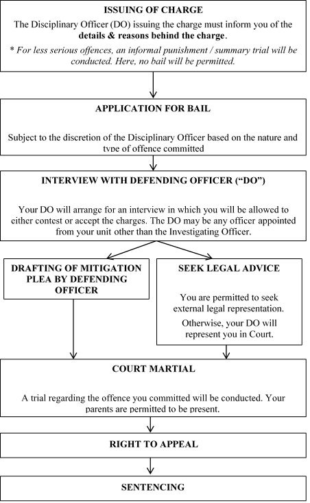

MILITARY LAW
============

Overview of the Military Justice System
---------------------------------------

The Singapore Armed Forces (“SAF”) is expected to treat every member of
its service personnel fairly and equally under the military justice
system, regardless of race, rank or vocation. [289]_

The military justice system is based on the SAF Act (Cap 295). All
servicemen/women are subjected to the SAF Act, SAF Regulations and
orders of whatever form issued pursuant to them. While discipline is
paramount in the military, not all offences committed by SAF
servicemen/women are dealt with by formal investigations and charges.
Offenders can be dealt with by way of informal or formal punishment
systems. [290]_

Informal Punishment System [291]_
~~~~~~~~~~~~~~~~~~~~~~~~~~~~~~~~~

Commanders are empowered to mete out informal punishments or
administrative measures like extra duties or weekend confinement to
servicemen who have committed minor disciplinary breaches, such as being
late, sluggish, or improperly dressed.

Unlike with formal punishment, there will be no records of informal
punishment beyond the unit’s own administration, thus such records will
not follow a Full-time National Serviceman (“NSF”) upon leaving his unit
on his Operationally-Ready Date (“ORD”).

Formal Punishment System
~~~~~~~~~~~~~~~~~~~~~~~~

If the offence that a serviceman/woman has committed is of a more
serious nature, he/she may be formally dealt with by his disciplinary
officer by way of a summary trial, or brought before a subordinate
military court (more commonly known as the General Court
Martial). [292]_ Depending on the rank of the serviceman/woman being
charged, he/she may be brought before a junior or senior disciplinary
officer to be charged at summary trial. The presiding officer may refer
the case to a higher authority at his/her discretion.

**1. Summary trial**

The offences that can be dealt with by summary trial are essentially
military offences, such as absence without leave, non-compliance
with lawful orders, and insubordination. [293]_

Depending on the rank of the serviceman/woman in question, and the
type of the disciplinary body hearing the case, the possible
sentences that may be imposed can vary, and may include fines or
detention. [294]_

A summary trial lacks certain elements of a normal trial, most
notably the absence of any requirement that the disciplinary officer
abides by the rules of evidence. [295]_ Procedurally, it gives the
disciplinary officer a lot of discretion in carrying out the trial
in a manner that he/she deems appropriate or expedient for the
disposal of the charge in conducting the trial.

However, the discretion conferred is not a blank cheque; the summary
trial is carried out in accordance with relevant SAF regulations,
and the records of the summary trial are sent to the office of the
Director, Legal Services of the SAF to monitor the conduct of such
trials. [296]_

**2. General Court Martial**

The General Court Martial (“GCM”) exists as a separate forum from
that of the summary trial. Unlike the summary trial, the GCM deals
with a wider range of offences, and can impose a wide range of
punishments including imprisonment and discharge, on top of
sentences like detention and fines. The GCM is also a more public
and open forum, and its proceedings are conducted using similar
legal rules and procedures as those used in a civilian criminal
court. [297]_

Generally, only serious offences investigated by the Military Police
Command and referred to the office of the Director of Legal Services
will result in the accused serviceman being charged in a GCM. In
such a case, a military prosecutor will draw up a formal charge
sheet and present it before the GCM. [298]_

A serviceman that has been found guilty of an offence through a
Summary Trial will be given an opportunity to elect to be heard in a
GCM before he is convicted and punished. [299]_ However under the
circumstances, if the punishment for the offence is a reprimand or a
minor punishment, the disciplinary officer has the discretion to
refuse this opportunity to the serviceman/woman. [300]_

**Panel Court Martial & Judge Court Martial**\  [301]_

GCMs can be further sub-divided into two categories: the Panel
Courts Martial—consisting of a President and usually two other
members, and the Judge Courts Martial—consisting of a single
President only. The current practice is for military offences to be
heard by Panel Courts Martial, while civil offences like misuse of
drugs and penal code offences may be dealt with by a Judge Court
Martial.

Seeking Redress [302]_
-------------------------

There are numerous safeguards and avenues set out in the Military
Justice System for a serviceman/women to seek redress if he/she feels
unfairly treated or sentenced.

**1. Informal Punishment**

Generally a serviceman/woman who is dissatisfied with an informal
punishment may request that a superior commander review the
punishment, or request a formal disciplinary hearing.

**2. Summary Trial**

**Right to be tried by a General Court Martial / Subordinate
Military Court**

If a Serviceman/woman is faced with a summary trial, the
Disciplinary officer who brought the charge will first try him/her.
One the Disciplinary officer is satisfied of the available evidence
that the Serviceman/woman is guilty, he/she is to give the accused a
right to be tried by a General Court Martial. However the
Disciplinary officer has the discretion to deny trial by General
Court Martial if the punishment is a reprimand or minor punishment
that doesn’t involve a fine, detention, imprisonment, deduction in
rank or any other more serious penalty.

If the Serviceman/woman choses to exercise their right to be tried
by General Court Martial, the Disciplinary officer shall forward the
charge sheet, record of evidence and such other particulars to the
director. The Director shall:

-  Direct that a charge be submitted to the convening authority and a
   trail by General Court Martial shall proceed.

-  With the approval of the Armed Forces Council, direct that no action
   be taken against the accused either by way of Summary Trial or by a
   General Court Martial, thereby acquitting ehe Serviceman/Woman of the
   charge

**Petition for Review**

Alternatively, an aggrieved Serviceman/Woman may request that the
Armed Forces Council or any other appropriate authority as delegated
by the Council review his/her conviction or punishment imposed at
the Summary Trial.

**3. General Court Martial**

General Court Martial and Field General Courts Martial are
collectively referred to as “Subordinate Military Courts”.

**Representation**

In the case of a General Court Martial, a Serviceman/woman may
choose to be represented by a lawyer or an SAF Defending Officer if
a Court Martial will hear his/her Case. Accepting the appointment of
an SAF Defending Officer incurs no cost to the Serviceman, but the
costs of a privately engaged lawyer must be borne by the
Serviceman/woman.

**Petition for Review and Appeal**

At the end of the trial, a Serviceman/woman who is dissatisfied with
the decision of the Court Martial may petition the Reviewing
Authority (the Armed Forces Council or a Committee of its members)
for a review of his/her case. The Serviceman/Woman can also appeal
to the Military Court Of Appeal (“MCA”) for a reconsideration of
his/her conviction, his /her sentence or both. All decisions of the
MCA are final.

**4. Military Court Of Appeal**

**Composition of the MCA**

The MCA is the highest court in the Military Justice System. The
MCA, when convened to hear an appeal, sits as a aanel of five
members. Heading the MCA is a President appointed by the Chief
Justice. By law, the President of the MCA must be a person qualified
to be a Judge Of The Supreme Court. Four other members—two civilian
members who are qualified Legal Practitioners with at least five
years experience each, and two Senior Military Officers—constitute
the rest of the MCA.

**Use Of Civilian Legal Procedures**

The General Court Martial and the MCA are tribunals headed by
Presidents who are outside the SAF chain of command. The Presidents
of these forums will hear the case impartially like any other
civilian criminal case. The proceedings in the General Court Martial
and the MCA are also heard in a public forum, and these military
courts adopt many of the same legal procedures and safeguards as
those used in civilian criminal courts. All Servicemen/women
formally charged with offences can bring their cases to these
forums.

Charge Procedure
----------------

Case Flow Outline
~~~~~~~~~~~~~~~~~

|image8|

Charges & Jurisdiction
~~~~~~~~~~~~~~~~~~~~~~~~~

**1. Accused servicemen/women under the rank of Warrant Officer**

Either a junior disciplinary officer or a senior disciplinary officer
can issue a charge and hold a summary trial. [303]_

-  A “junior disciplinary officer” is an officer or a warrant officer
   commanding a squadron, battery, company or equivalent
   sub-unit [304]_.

-  A “senior disciplinary officer” is an officer in command of a base or
   unit equivalent to a battalion or larger, usually the Commanding
   Officer of the serviceman/woman’s unit [305]_.

    The serviceman/woman may be able to elect to be tried by a General
    Court Martial (“GCM”) instead. (Refer to the previous section for
    details)

**2. Accused officers under the rank of Lieutenant-Colonel**

Only a superior commander who is at least 2 ranks above him can issue a
charge. [306]_

The superior commander can be an officer commanding a command or
formation, or designated as a superior commander for the purpose of
discipline by the Armed Forces Council. [307]_

Arrest
~~~~~~

“Arrest” includes both close arrest and open arrest. “Close Arrest”
means that the Serviceman/Woman is detained in a designated place (e.g.
detention barracks). “Open Arrest” means that he/she is still able to go
about his/her daily activities in the barracks/ship.

A Serviceman/Woman may be placed under arrest pending investigation.
During this time, he/she will be permitted access to counsel as long as
there is no prejudice to the investigative Process.

In general, a person will not be detained where the offence is not of a
serious nature. However, a person may be placed under close arrest if
he/she is likely to injure him/herself or others, suborn witnesses, has
been apprehended as being absent without leave (“Awol”), or under any
other circumstances where close arrest is deemed desirable.

Bail
~~~~~~~

An accused person who has been detained may apply for bail, pending
investigation or appeal. [308]_ If he is successful in his application,
he will be released from detention, and entrusted to the custody of the
person who posted bail — the surety. [309]_ If the accused person
absconds, the surety is liable to forfeit the sum specified when the
bail is granted. [310]_

**1. Application for bail**

To apply for bail, the accused must first have lodged a notice of appeal
to the Registrar of the Subordinate Military Courts. The court will then
commence a hearing of the bail application.

**2. Surety and bond**

The accused must also have a surety who is willing to provide a bond as
a guarantee for the accused’s attendance in court.

The court decides the value of the bond, [311]_ and the bond itself
may take the form of an undertaking to pay, or even an actual cash
deposit. Depending on the value of the bond, as well as the
surrounding circumstances, a court may allow multiple sureties.

**3. Considerations in granting bail**

Some considerations the court might take into account in granting bail
are:

-  The seriousness of the offence.

-  The severity of the punishment awarded by the GCM (in the case of an
   appeal).

-  Whether the sureties are satisfactory.

-  Previous imprisonment or detention of the accused;

-  Previous failures to appear in court;

-  Likelihood of recidivism if released on bail (particularly in AWOL
   cases); and

-  Where the accused is charged with offences of assault/offering
   violence/indecent conduct, so as to safeguard the public.

Legal Representation
~~~~~~~~~~~~~~~~~~~~

A serviceman may choose to be defended either by privately engaged
counsel, or by an appointed Defending Officer. Defending Officers are
appointed, usually from within the unit, and may or may not be legally
trained.

Access to legal representation by a practitioner of the accused person’s
choice is guaranteed under the Constitution. [312]_ However, this
entitlement only arises after “a reasonable time” after arrest so as to
facilitate the investigative process. [313]_ What constitutes “a
reasonable time” is based on the circumstances of the case, [314]_ but
in general the onus is on the investigative authority to justify the
denial of access to counsel by explaining why it would be prejudicial to
the investigative process.

Requesting Reduction & Alteration Of Charges
~~~~~~~~~~~~~~~~~~~~~~~~~~~~~~~~~~~~~~~~~~~~

Representations are written memorandums to the prosecution, and are
written to persuade the prosecution to reduce the number of charges
brought against the serviceman. Representations may be written in the
same style as a mitigation plea, and are submitted well in advance of
the trial date. If you require more time to prepare for the trial (such
as for the purpose of interviewing the serviceman and writing
representations), you may request a postponement of the trial date.

Upon interviewing the accused serviceman/woman and informing him/her of
the charges, the Defending Officer/legal representative should note if
he/she would like to contest any of the charges, either because they
contain details which he/she feels are inaccurate, or if he/she is not
amenable to admitting to the charge at all. Representations can
therefore be made to the prosecution for the purpose of reducing or
altering the charges.

The Defending Officer/legal representative might want to make
representations to the prosecution especially in cases where there are
multiple charges drawn against the serviceman form a single incident, or
when the modification of a few particulars of the charge would make the
serviceman agreeable to admitting to it.

The prosecution may respond in a number of ways:

-  An agreement to withdraw a charge means that the charge will be stood
   down entirely

-  Taking a charge into consideration means that the court will not
   treat the charges individually during sentencing, but will take them
   into consideration in the judgment. This usually is conditional on
   the serviceman’s agreement to plead guilty to the charges to be taken
   into consideration.

-  Lastly, the prosecution may choose to continue with the charges, in
   which case the charges will be brought up during the trial.

Whether charges will be dropped, taken into consideration or proceeded
upon is entirely up to the discretion of the prosecutor.

Mitigation & Defence
~~~~~~~~~~~~~~~~~~~~

    **1. Mitigation**\  [315]_

Mitigation is adopted only when the accused has already pleaded guilty.
If a serviceman/woman pleads guilty, he/she essentially accepts full
admission to the charge(s) brought against him/her, and the GCM must
then decide on the appropriate sentence.

    Therefore, the main objective of a mitigating plea is to reduce the
    sentence by raising appropriate mitigating factors. These include
    previous good conduct, remorse and adverse family backgrounds.

    Besides mitigation based on existing charges, another avenue for
    reducing the overall sentence is to reduce the overall number of
    charges. This involves making representations to the prosecution.
    (Refer to Chapter 18.2.6)

    **2. Defence**

    If the accused pleads “not guilty”, the prosecution will then submit
    evidence to prove the charges. The accused may then submit a defence
    to rebut the allegations made by the prosecution. In general, a
    defence is more difficult to conduct than mitigation. Although it is
    possible for a serviceman/woman to represent him/herself, or to
    request a Defending Officer, most servicemen/women privately engage
    lawyers if they are contesting the charge.

Common Military Offences
------------------------

The following sub-chapter outlines peacetime offences in the SAF Act
(Cap. 295) that servicemen/women are more commonly convicted of and the
corresponding sentences for each offence.

General Conduct Offences

**Disobedience of general orders** (s 21): This is a catch-all provision
regarding the contravention or failure to comply with a lawful general
order which the serviceman/woman might have or ought to have known
about.

**•** Maximum sentence\ **:** **2 years** imprisonment

**Conduct to prejudice of good order or discipline** (s 25): This is
another catch-all provision regarding a serviceman whose conduct or
omission is considered to be to the prejudice of good order or
discipline.

**•** Maximum sentence\ **:** **12 months** imprisonment

**Malingering** (s 32): There are three forms of malingering:

(a) Falsely pretending to suffer from an illness.

(b) Deliberately injuingr oneself or any person, or causing oneself to
    be injured by any person, and doing so with the intent to render
    oneself or the other person to be rendered unfit for service.

(c) Doing anything to produce, prolong or aggravate any sickness with
    the intent to render or keep himself unfit for duty or service.

    • Maximum sentence: **12 months** imprisonment

**Intoxication** (s 33): This offence is applicable whether the
serviceman/woman was on duty or not when found to be intoxicated.

**•** Maximum sentence\ **: 6 months** imprisonment

**Possession, etc., of drugs** (s 34): Any person who possesses, smokes
or consumes any controlled drug is liable under this section. What is
considered a “controlled drug” is defined in any written law relating to
the misuse or control of drugs, such as the Misuse of Drugs Act (Cap.
185). A possible defence is that the serviceman/woman was authorised to
do so.

**•** Maximum sentence: **5 years** imprisonment

**Contempt** (s 48): This offence is applicable mainly to disobedience
of lawful judicial procedural orders, such as failing to comply with a
summons/order to attend as a witness at the Military Court of Appeal (s
48(1)(a)), or refusing to take an oath when required to do so (s
48(1)(b)).

    **•** Maximum sentence: **2 years imprisonment**, but if the court
    requires the offender to be tried summarily instead of at trial,
    then the maximum sentence is **21 days** imprisonment or a $50 fine

Absence Without Leave

**Absence without leave** (s 22):

Absence without leave is commonly referred to as “AWOL” (Absent Without
Official Leave). Any serviceman/woman who is absent from where he/she is
lawfully required to be present is liable under this section. It is a
defence that the serviceman/woman was absent due to a result of
circumstances over which he/she had no control (s 22(2)).

**•** Maximum sentence: **2 years** imprisonment

**Desertion** (s 23):

Absence without leave escalates into the offence of desertion if the
serviceman/woman is not only absent from where he/she is lawfully
required to be present, but is also found to have intended to remain
permanently absent from duty without lawful authority when/after he/she
has failed to report to his place of duty (s 23(2)(b)).

**•** Maximum sentence: **10 years** imprisonment

Abuse & Excess of Authority

**Abuse of authority** (s 29): A serviceman/woman is liable under this
section if he/she knowingly exceeds his/her authority over a
subordinate.

• Maximum sentence: **2 years** imprisonment

**Personation and excess of authority** (s 30):

(a) When a serviceman/woman holds himself out to have a rank, status, or
assignment in the SAF, or who wears any military dress, insignia or
badge that he is not authorised to wear, is liable under s 30(1).

-  Maximum sentence: **12 months** imprisonment

(b) When a serviceman/woman who, without authority does any act while
holding him/herself out to have authority to do so, is liable under s
30(2).

• Maximum sentence: **2 years** imprisonment

Offences Against Persons & Property

**Endangering life or property** (s 41): Any serviceman/woman who does
an act that endangers life or property, and which causes or is likely to
cause injury to the person or property, is liable under this section.

    **•** Maximum sentence: **5 years** imprisonment for wilful acts
    (s 41(a)) and 3 years imprisonment for negligent acts (s 41(b))

**Damage to, and loss of, SAF property, etc.** (s 42):

Any serviceman/woman who wilfully damages or causes the loss of, or is
concerned in the wilful damage or loss of any SAF property or any
property belonging to a person subject to military law is liable under s
42(1). This includes acts of wilful neglect.

**•** Maximum sentence: **3 years** imprisonment

Any serviceman/woman who causes through a negligent act or omission any
damage to, or loss of, SAF property, or has committed a wilful or
negligent act or omission which is likely to cause damage to, or loss
of, SAF property, is liable under s 42(2).

**•** Maximum sentence: **2 years** imprisonment, or **3 years**
imprisonment if the property concerned consists of arms, or is an
aircraft, a vessel or a vehicle

**Unlawful arrest** (s 45):

Any serviceman/woman who either unlawfully holds a person in custody, or
does not comply with the regulations governing the placing of a person
in custody, is liable under this section.

**•** Maximum sentence: **2 years** imprisonment

Misappropriation & Misapplication of Property

**Dishonest misappropriation of SAF property** (s 43):

Any serviceman/woman is liable if he/she steals or dishonestly
misappropriates any SAF property, or:

(a) Is involved in the stealing of any SAF property (s 43(a)); or

(b) Receives any property belonging to the SAF or to a person subject to
military law while knowing that it was stolen or dishonestly
misappropriated (s 43(b))

    **•** Maximum sentence: **3 years** imprisonment, or **7 years**
    imprisonment if the property in question consisted of an aircraft, a
    vessel, or arms.

**Misapplication and waste of SAF property** (s 44):

Any serviceman/woman who misapplies or wastefully expends any SAF
property is liable under this section.

**•** Maximum sentence: **2 years** imprisonment

Abetments & Attempts

**Abetments and attempts** (s 58):

Any person who aids, abets, counsels or procures the commission of a
military offence, or who attempts to commit a military offence, shall be
liable for the same punishment as for the offence. However, if the
offence is punishable by death, the maximum sentence for an abetment or
attempt shall be imprisonment.

Defences

**Justification, excuse and defence** (s 59):

Rules and principles regarding justifications, excuses and defences as
established in the civil courts are also applicable to any charge under
the SAF Act.

Commonly Asked Questions on Military Law

**Will I be charged in a civil court after being charged in a military
court?**

If you have been charged in a military court, you cannot be charged in a
civil court for the same offence or for an offence arising from the same
facts.

**Can I choose to stand trial in a civil court instead of a military
court?**

As a military charge is not a civil charge, once you have been charged
in a military court you cannot request to be charged in a civil court.

**Will I have a civil criminal record as a result of a military
charge?**

No.

If you have been charged with a military offence under the SAF Act (as
opposed to the Penal Code), the SAF will record the offence internally
but you will not have a criminal record.

**Will I be sent to the detention barracks immediately upon arrest?**

You may be detained in the detention barracks while waiting for the
court martial. The wait in detention may be counted as part of your
subsequent sentence.

**Will a military charge affect my employment or education prospects?**

In general, any military offence may be reflected in your ORD transcript
and will be viewed by potential employers and educational institutions.
Certain universities and employers may also include a request for any
conviction by a court of law including a military court.

**What happens if I can’t pay a fine imposed on me?**

If you default on a fine, you may be detained in the Detention Barracks
for a period of 10 days for a fine of $100 and below, a period of 20
days for a fine between $300 and $100 and a maximum of 40 days for
larger amounts. [316]_

**Can I work while serving in the SAF?**

NSFs can apply to their Commanding Officer for permission to work
outside of military duties provided there are pressing personal
circumstances and that such work does not conflict with military duties.

**Can my items be confiscated during a search?**

Confiscation of items can only take place when you are under arrest.
Only a military policeman who is making an arrest can confiscate your
personal items if there is reason to believe that the items were used in
the offence or are relevant evidence of the offence. Your items may be
detained until your discharge or acquittal. Any other military personnel
are only able to search for and seize offensive weapons.

**Can my parents / relatives / girlfriend visit me in the Detention
Barracks?**

Detained serviceman can only have 1 visit per week from immediate family
members only but there is no limit on the number of visits by legal
counsel or Defending Officers. You may also receive letters, and write 1
letter per week. [317]_

.. [289]
   Ministry of Defence (“MINDEF”), *Cyber Pioneer: Military justice
   system treats all fairly and equally* (25 January 2008), available at
   http://www.mindef.gov.sg/imindef/resourcelibrary/cyberpioneer/topics/articles/news/2008/January/25jan08\_news.html,
   last accessed on 17 June 2014

.. [290]
   Ibid

.. [291]
   Ibid

.. [292]
   Ibid

.. [293]
   Ibid

.. [294]
   Ibid

.. [295]
   Singapore Armed Forces (“SAF”) Act (Cap. 295) s 76

.. [296]
   MINDEF, *Cyber Pioneer: Military justice system treats all fairly and
   equally* (25 January 2008), available at
   http://www.mindef.gov.sg/imindef/resourcelibrary/cyberpioneer/topics/articles/news/2008/January/25jan08\_news.html,
   last accessed on 17 June 2014

.. [297]
   Ibid

.. [298]
   Ibid

.. [299]
   SAF Act (Cap. 295) s 77(1)

.. [300]
   SAF Act (Cap. 295) s 77(3)

.. [301]
   MINDEF, *Cyber Pioneer: Military justice system treats all fairly and
   equally* (25 January 2008), available at
   http://www.mindef.gov.sg/imindef/resourcelibrary/cyberpioneer/topics/articles/news/2008/January/25jan08\_news.html,
   last accessed on 17 June 2014

.. [302]
   Ibid

.. [303]
   SAF Act (Cap 295) s 62(4)

.. [304]
   SAF Act (Cap 295) s 2(1)

.. [305]
   Ibid

.. [306]
   SAF Act (Cap 295) s 62(3)

.. [307]
   SAF Act (Cap 295) s 2(1)

.. [308]
   SAF Act (Cap 295) ss 130, 182B

.. [309]
   Criminal Procedure Code (Cap 68) s 104(1)

.. [310]
   Criminal Procedure Code (Cap 68) s 104(2)

.. [311]
   SAF Act (Cap 295) s 182C

.. [312]
   Constitution of the Republic of Singapore, Art. 9(3)

.. [313]
   Jasbir Singh v PP [1994] 1 SLR(R) 782; James Raj s/o Arokiasamy v PP
   [2014] SGHC 10

.. [314]
   Ibid

.. [315]
   *See* Law Gazette, *Plea in Mitigation*, available at
   http://www.lawgazette.com.sg/2006-1/Jan06-feature2.htm, last accessed
   on 19 June 2014

.. [316]
   SAF Act (Cap 295) s 71

.. [317]
   SAF Military Police Command, *FAQs: SAF Detention Barracks*,
   available at
   http://www.mindef.gov.sg/imindef/mindef\_websites/atozlistings/safmpc/faqs.html,
   last accessed on 19 June 2014

